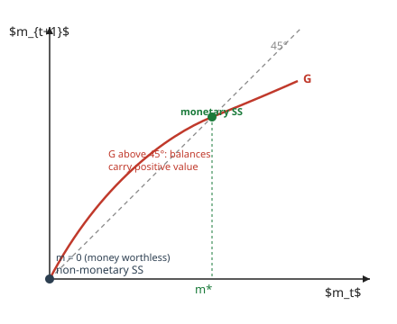

# Grad Macroeconomics · Lesson 3.3: Money and rational bubbles

> ⏱ ~15 min · Module 3: Overlapping generations · Builds on: [3.2 Dynamic inefficiency and over-accumulation](03-02-dynamic-inefficiency.md) · Unlocks: [3.4 Social security and intergenerational transfers](03-04-social-security-transfers.md)

## Why this matters

A dollar bill pays no dividend, promises no redemption, and is worth its paper. Yet you take it in exchange for real goods every day. Why? Not because it's *fundamentally* worth anything — it isn't — but because you expect the next person to take it too. That belief, and only that belief, gives it value. This lesson shows that fiat money is a **rational bubble**: a price built entirely on expected resale, with no fundamental underneath. And the punchline from 3.2 pays off — money is valued *precisely* in the dynamically inefficient economies where capital is over-accumulated ($r < n$). Money isn't a nuisance the model tolerates; it's the market's fix for the missing trade between generations who never meet.

## The idea

Recall the OLG problem: the young have resources they'd love to move into old age, but there's no one to trade with — the old they could sell to are already dead by the time they're old themselves. In [3.2](03-02-dynamic-inefficiency.md) an economy stuck at $r < n$ was over-saving into low-return capital when a costless intergenerational chain would have paid $n$.

Fiat money *is* that chain. Introduce an intrinsically worthless token in fixed supply $M$. The young sell goods to the old for tokens; when they're old, they sell the tokens to the *next* young cohort for goods. Each generation holds the token for one period and passes it on. No one ever "cashes it in" for anything real — the token just circulates forever, and every generation gets its intergenerational trade executed.

Samuelson's insight: **money is a social contrivance** — a decentralized way to run the transfer scheme that a benevolent planner would want but that no bilateral market can arrange, because the counterparties are in different centuries. It works only if everyone believes the next cohort will accept the token. That belief is **self-fulfilling**: if they will, it's worth holding; if they won't, it's worthless today. Both beliefs are internally consistent, so the economy has (at least) two steady states — a **monetary** one and a **non-monetary** one.

## The formal version

Take the pure-exchange OLG of [3.1](03-01-olg-model.md): a generation of size $N_t = N_0(1+n)^t$, each agent endowed with $w_1$ goods when young and $w_2$ when old, $w_1 > w_2$ (they want to shift consumption forward). No storage, no capital — the *only* asset is money.

Let $P_t$ be the price of goods in tokens and $m_t \equiv M/(P_t N_t)$ the **real balances per young person**. A young agent buys $m_t$ of real balances, carries the tokens one period, and resells them to next period's young.

**In words:** money's gross real return is how much its purchasing power appreciates, $P_t/P_{t+1}$ — you buy goods back next period at whatever price the token then commands.

Money-market clearing says the real value of the whole stock equals what the young collectively hold: $M/P_t = N_t\, m_t$. In a **stationary** monetary equilibrium $m_t = m > 0$ is constant, so $M/P_t = N_t m$ grows with the population, forcing

$$\frac{P_t}{P_{t+1}} = \frac{N_{t+1}}{N_t} = 1+n \equiv R^m.$$

**In words:** the gross return on money is the population growth rate. The old sell a fixed nominal stock to a cohort that is $(1+n)$ times larger, so each token buys $(1+n)$ times more goods — money pays $n$, the golden-rule return.

Compare this to the return the agent *could* get with no money — the **autarky rate** $r_A$, the interest rate at which they'd just decline to trade, i.e. the marginal rate of substitution at the endowment point:

$$1 + r_A = \frac{u'(w_1)}{\beta\,u'(w_2)}.$$

**Existence.** Money can hold value in stationary equilibrium **iff** $r_A < n$ — exactly the dynamic-inefficiency condition from 3.2. If the autarky economy already pays more than $n$ (so $r_A > n$), no one wants an asset yielding only $n$, and money's value collapses to zero. When $r_A < n$, the monetary steady state $m^* > 0$ coexists with the non-monetary one at $m = 0$; the bubble crowds out the over-accumulated saving, lifts the return to $n$, and delivers the golden-rule allocation — a **Pareto improvement** over autarky.

**The general rational bubble.** Take any asset with dividend $d_{t+1}$ and price $p_t$, held by risk-neutral agents at required gross return $1+r$. No-arbitrage:

$$p_t = \frac{\mathbb{E}_t[\,d_{t+1} + p_{t+1}\,]}{1+r} \quad\Longleftrightarrow\quad (1+r)\,p_t = \mathbb{E}_t[d_{t+1}] + \mathbb{E}_t[p_{t+1}].$$

This difference equation has a whole family of solutions $p_t = f_t + b_t$, where

$$f_t = \sum_{k=1}^{\infty}\frac{\mathbb{E}_t[d_{t+k}]}{(1+r)^k} \quad(\text{the \textbf{fundamental}}), \qquad \mathbb{E}_t[b_{t+1}] = (1+r)\,b_t \quad(\text{the \textbf{bubble}}).$$

**In words:** the fundamental is the discounted stream of actual payouts; the bubble is any extra term that grows at exactly the discount rate, so that its expected capital gain alone covers the required return. Money is the extreme case: $d \equiv 0$, so $f_t = 0$ and its entire price is bubble. A bubble is a price with no fundamental to pin it — pure expectation of resale.

## Picture

The law of motion for real balances $m_{t+1} = G(m_t)$ has two fixed points where it crosses the 45° line: the origin (money worthless) and $m^*$ (money valued). Both are consistent equilibria — which one you're in is a matter of belief.

## Worked examples

**Example 1 — a log OLG, monetary steady state constructed.** Let $u(c) = \ln c$, discount $\beta$, endowment $(w_1, w_2)$ with $w_1 > w_2$, growth $n$. The young solve, facing gross return $R$ on saving,

$$\max_{c_1,c_2}\ \ln c_1 + \beta \ln c_2 \quad\text{s.t.}\quad c_1 + \frac{c_2}{R} = w_1 + \frac{w_2}{R} \equiv W.$$

Log utility gives the classic split $c_1 = \dfrac{W}{1+\beta}$, and real balances (saving) $m = w_1 - c_1$. In the monetary steady state $R = R^m = 1+n$:

$$m^* = w_1 - \frac{1}{1+\beta}\left(w_1 + \frac{w_2}{1+n}\right) = \frac{\beta\,w_1(1+n) - w_2}{(1+\beta)(1+n)}.$$

Money is valued exactly when $m^* > 0$, i.e. $\beta\,w_1(1+n) > w_2$. Now check this is the dynamic-inefficiency condition. The autarky rate for log utility is $1 + r_A = \dfrac{u'(w_1)}{\beta u'(w_2)} = \dfrac{1/w_1}{\beta/w_2} = \dfrac{w_2}{\beta w_1}$, so

$$r_A < n \iff \frac{w_2}{\beta w_1} < 1+n \iff w_2 < \beta w_1(1+n) \iff m^* > 0.$$

The three conditions are literally the same inequality. And at $R = 1+n$ the agent's budget line coincides with the economy's feasibility line (aggregate resources per young grow at $n$), so the monetary allocation *is* the golden-rule allocation — it beats autarky for every generation, including the initial old, who receive $m^* > 0$ of goods for tokens they were handed for free.

**Example 2 — the bubble condition and why it needs $r \le n$.** Money has $d = 0$, so its price is a pure bubble $b_t$ obeying $\mathbb{E}_t[b_{t+1}] = (1+r)\,b_t$. In our OLG the relevant riskless return is the growth rate, so a *constant* real value $b_t = m^* $ requires the return on holding money to be... the growth rate $n$. That's consistent only if the alternative return $r$ satisfies $r \le n$: if $r > n$, no agent accepts an asset appreciating at only $n$ when capital pays $r$, and $b_t \to 0$.

The feasibility argument is sharper. A bubble grows in expectation like $(1+r)^t$. The economy grows like $(1+g)^t$ (here $g = n$). The bubble's share of the economy is

$$\frac{b_t}{Y_t} \sim \left(\frac{1+r}{1+g}\right)^t.$$

If $r > g$ this ratio explodes — the bubble eventually demands more goods than the entire economy produces, which is impossible. So a rational bubble can persist **only if $r \le g$**: the asset must not outgrow the economy that has to keep buying it. This is the same "$r < n$" fingerprint from 3.2, now stated as a survival condition for bubbles.

## Watch out

- **A bubble is not irrationality.** Every agent here is fully rational and forward-looking; the price is consistent with no-arbitrage at every date. "Rational bubble" means *non-fundamental*, not *foolish*. The fragility is real, though: nothing pins $b_t$, so a switch to the belief "$b_{t+1}=0$" is *also* an equilibrium — the bubble can burst to its fundamental (here, zero) with no change in fundamentals.
- **Money is valued because the economy is sick, not because it's healthy.** In a dynamically *efficient* economy ($r > n$), fiat money cannot hold value — capital already dominates it. Don't carry over the intuition that "money is always useful." In this bare model it earns its keep only when there's a missing-trade problem to solve.
- **$R^m = 1+n$ is a steady-state statement.** Off the stationary path, money's return is $P_t/P_{t+1}$ and can differ; the clean "return $= n$" holds where per-capita real balances are constant.
- **Don't conflate the two returns in the bubble condition.** The bubble must *grow* at the discount rate $r$ (that's no-arbitrage). Whether it can *survive* depends on comparing that $r$ to the economy's growth $g$. Growing at $r$ is required; $r \le g$ is what makes the requirement feasible.

## One-liner

> Fiat money is a rational bubble — a price that is pure expected resale value — and it holds value exactly when the economy is dynamically inefficient ($r < n$), because then a token yielding the growth rate beats the low return on capital.

## Problems

**P1 (🟢)** A pure-exchange Samuelson OLG has log utility, $\beta = 1$, population growth $n = 0.02$, and endowment $(w_1, w_2) = (4, 1)$. Can fiat money have positive value in a stationary equilibrium? Compute the autarky rate $r_A$ and compare it to $n$.

**P2 (🟡)** In a stationary monetary equilibrium the nominal stock $M$ is fixed and per-young real balances are constant. (a) Derive the gross real return on money $R^m$ from money-market clearing. (b) If capital in this economy would pay gross return $1+r$ with $r < n$, show money strictly dominates capital as a store of value, and state what this does to capital accumulation.

**P3 (🔴)** An asset pays a real dividend that grows deterministically, $d_{t} = d_0(1+g)^t$, and the required gross return is $1+r$ with $r > g$. (a) Write the no-arbitrage price equation and its fundamental solution $f_t$. (b) Write the condition a bubble term $b_t$ must satisfy. (c) Argue that a bubble cannot persist on this asset if $r$ exceeds the economy's growth rate, and explain how the same asset *could* carry a bubble if instead $r < g$.

Solutions

**P1** For log utility the autarky rate is $1 + r_A = \dfrac{u'(w_1)}{\beta u'(w_2)} = \dfrac{1/w_1}{\beta/w_2} = \dfrac{w_2}{\beta w_1} = \dfrac{1}{1\cdot 4} = 0.25$, so $r_A = -0.75$. Since $r_A = -0.75 < 0.02 = n$, the economy is dynamically inefficient and **money can hold positive value**. Check with the explicit balance: $m^* = \dfrac{\beta w_1(1+n) - w_2}{(1+\beta)(1+n)} = \dfrac{1\cdot4\cdot1.02 - 1}{2\cdot1.02} = \dfrac{3.08}{2.04} \approx 1.51 > 0.$ ✓ The young hold about $1.51$ of real balances; money implements the golden-rule transfer.

**P2** (a) Money-market clearing: the real value of the stock equals total real balances held by the young, $M/P_t = N_t m_t$. With $m_t = m$ constant, $M/P_t = N_t m$, so $M/P_{t+1} = N_{t+1} m$. Dividing,

$$\frac{P_{t+1}}{P_t} = \frac{N_t}{N_{t+1}} = \frac{1}{1+n} \quad\Longrightarrow\quad R^m = \frac{P_t}{P_{t+1}} = 1+n.$$

(b) Money's gross return is $1+n$; capital's is $1+r$. Since $r < n$, $\;1+n > 1+r$, so money **strictly dominates** capital as a store of value — every saver prefers to hold money. Saving flows out of capital and into real balances: the bubble **crowds out the over-accumulated capital**, pushing the economy from the inefficient $r < n$ point toward the golden rule where the marginal return rises to $n$. (This is exactly 3.2's over-accumulation being cured — money removes the excess capital that was earning a sub-$n$ return.)

**P3** (a) No-arbitrage: $(1+r)p_t = \mathbb{E}_t[d_{t+1}] + \mathbb{E}_t[p_{t+1}]$. With deterministic dividends the fundamental is the discounted dividend stream:

$$f_t = \sum_{k=1}^{\infty}\frac{d_{t+k}}{(1+r)^k} = \sum_{k=1}^{\infty}\frac{d_0(1+g)^{t+k}}{(1+r)^k} = d_t\sum_{k=1}^{\infty}\left(\frac{1+g}{1+r}\right)^k = d_t\,\frac{1+g}{r-g},$$

which converges precisely because $r > g$ (a Gordon-growth price). (b) The general solution is $p_t = f_t + b_t$ with the bubble obeying $\mathbb{E}_t[b_{t+1}] = (1+r)b_t$, i.e. $b_t = b_0(1+r)^t$ for a deterministic bubble. (c) A positive bubble grows like $(1+r)^t$. Measured against an economy growing at rate $g_{\text{econ}}$, its share is $b_t/Y_t \sim \big((1+r)/(1+g_{\text{econ}})\big)^t$. If $r > g_{\text{econ}}$ this $\to \infty$: the bubble eventually claims more resources than the economy produces, so it cannot be an equilibrium — buyers can't be found and the only solution is $b_0 = 0$, price $=$ fundamental. If instead $r < g_{\text{econ}}$ (the dynamically inefficient case), the bubble's share stays bounded (in fact shrinks relative to the economy), so a bubble *can* persist — which is exactly why fiat money, an asset with $f_t = 0$, holds value only when $r < n$.

## Flashback

**From Lesson 3.2 (Dynamic inefficiency).** A Diamond OLG reaches a steady state with capital-labor ratio $k^*$ satisfying $f'(k^*) = 0.03$, while population grows at $n = 0.05$ (take depreciation $\delta = 0$). Is this economy dynamically efficient? If not, in which direction should the capital stock move to reach the golden rule, and by what test do you know?

Solution

The golden rule sets the net marginal product of capital equal to the growth rate: $f'(k_{gr}) - \delta = n$, i.e. $f'(k_{gr}) = 0.05$ here. At the steady state $f'(k^*) = 0.03 < 0.05 = n$, so the net return on capital is *below* the growth rate — the economy is **dynamically inefficient** (over-accumulating). Since $f''<0$, a *lower* capital stock raises $f'$; the economy should **reduce $k$** until $f'(k) = 0.05$. The test is the sign of $r - n$: $r = f'(k^*) - \delta = 0.03 < n = 0.05$ signals over-accumulation, and a permanent reduction in $k$ raises consumption for every generation — a Pareto improvement. (This is the same $r < n$ condition that, in 3.3, is exactly when fiat money can hold value: money crowds out that excess capital.)

## Connections

- **Backward:** the money-valued condition $r_A < n$ is 3.2's [dynamic inefficiency](03-02-dynamic-inefficiency.md) verbatim — money exists to cure over-accumulation. The pure-exchange scaffold and the missing-trade problem come from [3.1 the OLG model](03-01-olg-model.md).
- **Forward:** [3.4 social security and intergenerational transfers](03-04-social-security-transfers.md) shows an unfunded (pay-as-you-go) pension is the *same* bubble in policy clothing — a token claim on the next generation, paying the growth rate $n$, welfare-improving exactly when $r < n$. Consumption-based asset pricing in [5.4](05-04-consumption-based-asset-pricing.md) revisits the no-arbitrage pricing equation with risk-averse agents and a stochastic discount factor.
- **Sideways (mathematical finance):** a bubble is a price with no arbitrage-pinned fundamental — precisely the failure of *uniqueness* that finance studies as multiplicity of the equivalent martingale measure / breakdown of transversality in infinite horizons. In a finite-horizon complete market, transversality forces $b_t = 0$ and price $=$ fundamental (unique EMM expectation); the OLG's infinite horizon and missing markets are what let the bubble survive. See [`mathematical-finance`](../../mathematical-finance/syllabus.md).
- **Sideways (monetary economics, plain language):** this is the bedrock answer to "why is fiat money worth anything?" — not gold backing, not decree, but the self-fulfilling expectation that the next holder will accept it. The same logic underlies why currencies can lose value abruptly (a coordination switch to the $b=0$ equilibrium) with no change in fundamentals.
