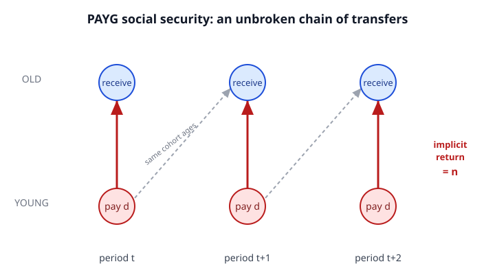

# Grad Macroeconomics · Lesson 3.4: Social security and intergenerational transfers

> ⏱ ~15 min · Module 3: Overlapping generations · Builds on: [3.3 Money and rational bubbles](03-03-money-rational-bubbles.md) · Unlocks: Module 4 — [4.1 The real business cycle model](04-01-real-business-cycle.md)

## Why this matters

Every public pension system is a machine for moving resources *between people who never meet* — today's workers to today's retirees, then their workers to them. The great and surprising result of this lesson is that whether that machine creates wealth or destroys it comes down to a single inequality you already know: $n$ versus $r$. When the economy is **dynamically inefficient** ($r < n$, from [3.2](03-02-dynamic-inefficiency.md)) — the exact same condition under which fiat money holds value in [3.3](03-03-money-rational-bubbles.md) — an unfunded pension can make *every generation better off at once*, a genuine free lunch of the kind economics usually forbids. Unfunded social security turns out to be the same social contrivance as money: both implement a trade between generations that the market, left alone, cannot arrange. This lesson also carries **Boss Problem 3**, where we solve a Cobb–Douglas OLG economy end to end and watch the free lunch materialize.

## The idea

Take the two-period OLG world of [3.1](03-01-olg-model.md): people are young (work, earn, save) then old (retire, consume savings). A pension system is a rule for taxing the young to pay the old. There are exactly two ways to run it.

**Funded (or "fully funded"):** your contributions are *invested* — bought as capital — and you get them back with the market return. Put in $d$ when young, get back $(1+r)d$ when old. Your money worked for you; the return is $r$, the marginal product of capital.

**Pay-as-you-go (PAYG, "unfunded"):** your contributions are *immediately handed to today's old*. Nothing is invested. When you retire, you're paid not from your own past contributions but from the taxes on the *next* cohort of young. Put in $d$ when young; when old you receive whatever the larger, richer next generation pays in. If population grows at rate $n$, there are $(1+n)$ times as many contributors behind you as there were beside you, so you collect $(1+n)d$. Your implicit return is $n$ — the economy's growth rate, no capital involved. (More generally, if wages also grow at rate $g$, the tax base grows at $\approx n+g$; this combined biological-plus-productivity return is the **Aaron–Samuelson return**. We fold both into $n$.)

Now line them up. Funded returns $r$; PAYG returns $n$. A worker prefers PAYG **iff $n > r$** — iff the economy is dynamically inefficient. That is the whole story in one line: when capital is over-accumulated and earns a miserable return, routing retirement saving *around* the capital market and through the growth of the population instead is simply a better deal. And it's better for *everyone*, because the very first retirees get a benefit having contributed nothing — a pure gift that later cohorts never have to pay back, since each is bailed out by the one after it. The chain never has to close as long as growth continues.

## The formal version

**Environment.** OLG, cohort of size $N_t = N_0(1+n)^t$. A representative young agent earns wage $w_t$, consumes $c_{1,t}$, saves $s_t$; when old consumes $c_{2,t+1} = (1+r_{t+1})s_t$. Preferences are time-separable $u(c_{1,t}) + \beta\,u(c_{2,t+1})$.

**A PAYG scheme of size $d$.** Each young pays a per-capita contribution $d$; the proceeds are split equally among the current old. Total collected at date $t$ is $N_t d$; recipients number $N_{t-1}$. So the benefit per old person is

$$b_t = \frac{N_t d}{N_{t-1}} = (1+n)\,d.$$

> **In words:** you pay $d$ young and receive $(1+n)d$ old — a gross return of $1+n$ on your forced "investment," delivered by the sheer size of the generation behind you, not by any capital.

The young agent's lifetime budget, with the scheme, is $c_{1,t} + s_t + d = w_t$ and $c_{2,t+1} = (1+r_{t+1})s_t + (1+n)d$. Collapsing $s_t$ gives the present-value constraint

$$c_{1,t} + \frac{c_{2,t+1}}{1+r_{t+1}} = w_t + d\left(\frac{1+n}{1+r_{t+1}} - 1\right) = w_t + d\,\frac{n - r_{t+1}}{1+r_{t+1}}.$$

**In words:** the scheme expands your lifetime resources by $d\frac{n-r}{1+r}$ — strictly positive iff $n>r$. A household that was already optimizing over a strictly larger budget set is strictly better off. And the date-0 old, who receive $b_0=(1+n)d>0$ for nothing, are strictly better off too. Hence:

> **Samuelson–Aaron theorem.** Introducing a small unfunded pension is a **Pareto improvement iff $r < n$** (dynamic inefficiency). The same inequality that makes fiat money valuable in [3.3](03-03-money-rational-bubbles.md).

**Effect on capital.** PAYG also changes behavior: the young, promised a transfer in old age, save less privately. Aggregate capital next period is what the young save, $K_{t+1} = N_t s_t$, so lower $s_t$ means lower $k_{t+1} = s_t/(1+n)$. **PAYG crowds out capital.** Whether that is good or bad is again the same test: if the economy was over-accumulating ($r<n$, capital above the golden rule of [2.4](02-04-golden-rule-dynamic-efficiency.md) from Module 2), pushing $k$ down *raises* welfare; if $r>n$ (efficient), the crowd-out destroys valuable capital and *lowers* welfare. Unfunded pensions are a cure that only helps the over-saving patient.

**Ricardian equivalence — the escape hatch.** All of this assumes generations are financially separate. Suppose instead each parent is altruistic and leaves an *operative* (interior, strictly positive) bequest, caring about the child's utility directly. Then a government transfer from young to old is undone: the altruistic old parent, made richer by the transfer and seeing the child made poorer by exactly the tax that funds it, simply raises the bequest one-for-one. The dynasty's consolidated budget — and every real allocation — is unchanged. **PAYG becomes neutral.** The family already internalizes the intergenerational trade the government is trying to force, so the government's hands slide off. This is **Ricardian equivalence** (Barro): with operative dynastic altruism, the *timing and direction of intergenerational transfers do not matter*. It fails — and transfers bite again — exactly when the dynastic link is broken: non-operative bequests (finite lives with a corner at zero bequest, or no altruism), binding borrowing constraints on the young who cannot offset, or distortionary (non-lump-sum) taxes.

## Picture

Intergenerational transfer flows: each cohort pays $d$ when young (up-arrows, same period) and, after aging one period (dashed diagonals), collects from the larger cohort behind it — an implicit return of $n$.

## Worked examples

**Example 1 (the core comparison — PAYG vs funded).**
A worker can save one unit either through a funded account earning net return $r = 2\%$ per generation, or through a PAYG pension in an economy where the effective tax base grows at $n = 5\%$ per generation. Which does she prefer, and by how much in present value?

*Funded:* contribute $1$, receive $1.02$ when old; net return $2\%$.
*PAYG:* contribute $1$, receive $1+n = 1.05$ when old; net return $5\%$.
PAYG dominates by return $n - r = 3$ percentage points. In lifetime present value (discounting old-age receipts at the market rate $r$), the gain from swapping one unit of funded saving into PAYG is

$$\frac{1+n}{1+r} - 1 = \frac{1.05}{1.02} - 1 \approx 0.0294,$$

i.e. about 2.9% of the contribution, free. She prefers PAYG precisely because $n > r$: the economy is dynamically inefficient, so the growth of the workforce beats the return on capital. Had $r$ been $6\% > n$, the sign flips and she prefers the funded account — invested capital would out-earn the demographic dividend.

**Example 2 (BOSS PROBLEM 3 — Cobb–Douglas OLG, solved end to end).**

*Setup.* Log utility $\ln c_{1,t} + \beta\ln c_{2,t+1}$. Production $Y_t = K_t^\alpha L_t^{1-\alpha}$ with full depreciation ($\delta = 1$), so in per-worker terms $y = k^\alpha$. Competitive factor prices:

$$w_t = (1-\alpha)k_t^{\alpha}, \qquad 1 + r_t = f'(k_t) = \alpha\,k_t^{\alpha - 1}.$$

**(a) Saving.** The young maximize $\ln(w_t - s_t) + \beta\ln\big((1+r_{t+1})s_t\big)$. First-order condition:

$$-\frac{1}{w_t - s_t} + \beta\,\frac{1}{s_t} = 0 \;\Longrightarrow\; s_t = \frac{\beta}{1+\beta}\,w_t.$$

Log utility makes saving a fixed fraction of the wage, independent of $r_{t+1}$ (income and substitution effects cancel) — a clean feature we exploit.

**(b) Capital accumulation and steady state.** The young's savings become next period's capital: $K_{t+1} = N_t s_t$, so per next-period-worker,

$$k_{t+1} = \frac{K_{t+1}}{N_{t+1}} = \frac{s_t}{1+n} = \frac{1}{1+n}\cdot\frac{\beta}{1+\beta}(1-\alpha)k_t^{\alpha}.$$

Setting $k_{t+1}=k_t=k^*$ and solving:

$$k^* = \left[\frac{\beta(1-\alpha)}{(1+\beta)(1+n)}\right]^{\tfrac{1}{1-\alpha}}.$$

**(c) The equilibrium interest rate.** Plug into $1+r^* = \alpha (k^*)^{\alpha-1} = \alpha (k^*)^{-(1-\alpha)}$:

$$1 + r^* = \alpha\cdot\frac{(1+\beta)(1+n)}{\beta(1-\alpha)} = \frac{\alpha(1+\beta)}{\beta(1-\alpha)}\,(1+n).$$

**(d) Dynamic-inefficiency condition.** The economy over-accumulates when $r^* < n$, i.e. $1+r^* < 1+n$:

$$\frac{\alpha(1+\beta)}{\beta(1-\alpha)} < 1 \;\Longleftrightarrow\; \alpha(1+\beta) < \beta(1-\alpha) \;\Longleftrightarrow\; \boxed{\;\alpha < \frac{\beta}{1+2\beta}\;}.$$

**In words:** a small capital share $\alpha$ (capital earns little) and high patience $\beta$ (the young save a lot) together push equilibrium capital past the golden rule. Note $n$ drops out of the *condition* entirely — with log utility and Cobb–Douglas, dynamic inefficiency is a statement about tastes and technology alone. For, say, $\beta = 1$ the threshold is $\alpha < 1/3$; a capital share below a third means over-accumulation.

**(e) The Pareto-improving pension.** Introduce a marginal PAYG scheme of size $d$. Hold prices fixed at $(w^*, r^*)$ to first order (a marginal scheme moves them by a second-order amount). From the formal section, every young cohort's lifetime present value rises by

$$d\,\frac{n - r^*}{1 + r^*} > 0 \quad\text{whenever } r^* < n,$$

and the initial old receive $(1+n)d > 0$ for free. Under the condition in (d), *every* generation — the launch cohort and all that follow — is strictly better off. The free lunch is real, and it is exactly the over-accumulated capital being recycled into a higher-return intergenerational trade. (The general-equilibrium effect only sharpens this: lower private saving drags $k$ down toward the golden rule, pushing $r^*$ up toward $n$ and raising output-per-worker's contribution to welfare.) $\blacksquare$

## Watch out

- **PAYG's "return" is not interest.** No capital is invested; nothing compounds. The $n$ is pure accounting — the next cohort is bigger/richer, so more comes in than went out. Calling it a "return" is an analogy, and it evaporates the instant growth stops ($n = 0 \Rightarrow$ you get back exactly $d$, a zero-return forced loan).
- **Dynamic inefficiency is not "the interest rate is low."** It is $r < n$ — the return on capital below the *growth rate*. A 4% real return is dynamically inefficient in a 5%-growth economy and efficient in a 2%-growth one. Always compare to $n$, never to zero.
- **Crowding out cuts both ways.** In the popular press "pensions reduce saving" sounds unambiguously bad. In an over-accumulating economy it is *good* — you were saving too much. The welfare sign is $\mathrm{sign}(n - r)$, not the sign of the saving change.
- **Ricardian equivalence needs the bequest to be *operative*.** A household at the corner ($b = 0$, wanting to leave a negative bequest but unable to) cannot offset a transfer from itself to its child — the constraint binds. Equivalence quietly assumes an interior, strictly positive, altruistically chosen bequest. Most households leave none; that is why the theorem is a benchmark, not a description.

## One-liner

> An unfunded pension pays the growth rate $n$ while capital pays $r$ — so it is a free lunch for every generation exactly when $r < n$, the same dynamic-inefficiency condition that makes money valuable, and dynastic altruism is the one force that can make it all cancel.

## Problems

**P1 (🟢)** An economy has population growth $n = 3\%$ and wage growth $g = 1\%$ per generation, so the PAYG tax base grows at $\approx n + g = 4\%$. The capital market pays a net return $r = 2\%$. A worker must route her retirement saving entirely through one system. (a) What is her implicit return under PAYG versus funded? (b) Which does she prefer, and is this economy dynamically inefficient? (c) If a reform raised the capital return to $r = 6\%$, would your answer change?

**P2 (🟡, Boss Problem 3 core)** In the log/Cobb–Douglas OLG of Example 2, take $\alpha = 1/4$ and $\beta = 1$. (a) Verify the dynamic-inefficiency condition $\alpha < \beta/(1+2\beta)$ and compute $1 + r^*$ as a multiple of $1+n$. (b) A marginal PAYG scheme of size $d$ is introduced with $n = 0.5$ per generation. By what fraction of $d$ (in lifetime present value) is a representative young cohort made better off? (c) State in one sentence why the *initial* old generation is better off, and why this makes the reform a Pareto improvement rather than a redistribution.

**P3 (🔴)** State and prove Ricardian equivalence in a two-period OLG with operative dynastic altruism, for a PAYG transfer of size $d$ from each young to the contemporaneous old. Then identify **two** assumptions whose failure restores real effects of the transfer, explaining the mechanism in each case.

Solutions

**P1.** (a) PAYG implicit return $\approx n + g = 4\%$; funded return $r = 2\%$. (b) She prefers **PAYG**, which pays $4\% > 2\%$. Since the growth rate $(4\%)$ exceeds the capital return $(2\%)$, $r < n+g$: the economy is **dynamically inefficient**, over-accumulating capital. (c) Yes — with $r = 6\% > 4\%$ the funded system now out-earns growth, so she switches to **funded**; the economy is now dynamically efficient and PAYG would destroy welfare by crowding out productive capital.

**P2.** (a) Threshold $\beta/(1+2\beta) = 1/(1+2) = 1/3$. Since $\alpha = 1/4 < 1/3$, the condition holds — dynamically inefficient. From Example 2(c),
$$1+r^* = \frac{\alpha(1+\beta)}{\beta(1-\alpha)}(1+n) = \frac{(1/4)(2)}{(1)(3/4)}(1+n) = \frac{1/2}{3/4}(1+n) = \frac{2}{3}(1+n).$$
So $1+r^* = \tfrac{2}{3}(1+n) < 1+n$, confirming $r^* < n$. (b) The present-value gain per unit contributed is
$$\frac{n-r^*}{1+r^*} = \frac{(1+n)-(1+r^*)}{1+r^*} = \frac{(1+n) - \tfrac{2}{3}(1+n)}{\tfrac{2}{3}(1+n)} = \frac{\tfrac{1}{3}}{\tfrac{2}{3}} = \frac{1}{2}.$$
Each young cohort is better off by **$d/2$** in lifetime present value — remarkably, independent of $n$ here, because $r^*$ is pinned to $(1+n)$. (c) The initial old receive $(1+n)d > 0$ having contributed nothing, a pure windfall; since *no* generation is made worse off (every young cohort gains $d/2$) and at least one is strictly better off, the reform is a **Pareto improvement**, not a mere redistribution — it manufactures welfare from the economy's over-accumulation rather than shifting it between cohorts.

**P3.** *Statement.* Consider a dynasty: an old parent at date $t$ and her child (young at $t$, old at $t+1$), linked by an operative bequest — the parent chooses a strictly positive bequest $x > 0$ to maximize $U^{\text{parent}}(c^{\text{old}}) + \gamma\, V^{\text{child}}$, where $V^{\text{child}}$ is the child's lifetime utility and $\gamma>0$ the altruism weight, and the interior optimum sets the parent's marginal utility of own consumption equal to $\gamma$ times the marginal value of the bequest to the child. **Claim:** a PAYG transfer taxing each young $d$ and paying each old $b$ has no effect on any real allocation.

*Proof.* Write the dynasty's consolidated resources. Without the scheme, the child's lifetime resources are (young income) $+\ x$ (the bequest), and the parent consumes her own resources less $x$. Now impose the scheme: it taxes the child (young) by $d$ and pays the parent (old) $b$. The parent, now richer by $b$ and seeing the child poorer by $d$, re-optimizes. But the *consolidated* dynastic budget is unchanged: the scheme moves $d$ out of the child and $b$ into the parent, and the parent can move resources back to the child costlessly via the bequest. Concretely, the parent raises the bequest to $x' = x + d$ (feasible since the pre-transfer bequest was interior, $x>0$, so a small adjustment stays admissible), funded out of her extra $b$ plus, if $b \ne d$, an offsetting change in her own consumption that the consolidated constraint accommodates. After the adjustment the child's net resources are (young income) $- d + x' = $ (young income) $+ x$ — exactly as before — and the parent's first-order condition, which depends only on consolidated resources, is again satisfied at the *same* consumption levels. Every real allocation is invariant; the transfer is neutral. $\blacksquare$

*The intuition:* the altruistic family already runs its own private intergenerational transfer (the bequest) and has chosen it optimally. Government transfers between the same two generations are redundant reshufflings the family undoes at no cost.

*Two failures that restore real effects:*
1. **Non-operative bequests.** If the parent leaves $x = 0$ — a binding corner, because she would *like* to leave a negative bequest (extract resources from the child) but cannot — then a transfer *from* the parent *to* the child cannot be offset by reducing an already-zero bequest. The constraint $x \ge 0$ binds, the dynasty cannot undo the transfer, and consumption reallocates. Since most households leave no bequest, this is the empirically dominant failure and the reason PAYG has real effects.
2. **Binding borrowing constraints.** Suppose the young household is liquidity-constrained (cannot borrow against future income). A PAYG transfer that taxes it $d$ when it is cash-poor and pays it later cannot be neutralized by private borrowing/lending, because the offsetting trade is exactly the one the constraint forbids. The transfer relaxes or tightens a binding constraint and thereby changes real consumption. *(A third valid answer: distortionary, non-lump-sum taxes — offsetting the transfer would require changing labor supply or saving at a distorted margin, so the family cannot restore the original allocation costlessly.)*

## Flashback

**From [3.3](03-03-money-rational-bubbles.md) (Money and rational bubbles).** In a stationary OLG economy the young can store their savings only as capital, which pays a net real return of $r = 1\%$ per generation, while population grows at $n = 4\%$ per generation. A government proposes issuing a fixed stock of intrinsically worthless fiat money. (a) Can fiat money hold positive value in a stationary equilibrium? (b) What is the rate of return money would pay its holders, and how does that connect to the social-security result of this lesson?

Solution

(a) **Yes.** Fiat money can be valued in a stationary equilibrium iff the storage/capital return falls short of the growth rate, $r < n$ — the dynamic-inefficiency condition. Here $r = 1\% < 4\% = n$, so a monetary equilibrium exists: the young are willing to trade goods for the intrinsically useless paper because it is a *better store of value* than the capital available to them.

(b) With a fixed nominal money stock $M$ and a population of young growing at $n$, real money balances per young are constant in a stationary equilibrium, so the *aggregate* real value of money grows at $n$; each holder's money buys $(1+n)$ times as much next period (the price level falls at rate $\approx n$). The net real return on money is therefore **$n = 4\%$**, beating capital's $1\%$.

This is *exactly* PAYG social security. A young agent hands goods to the old (buys money from them / pays the pension tax) and is repaid by the next, larger generation — an implicit return of $n$ in both cases. Fiat money and unfunded social security are the **same intergenerational-trade device** wearing different uniforms: each is valuable, and welfare-improving, under the identical condition $r < n$. Money does it decentrally through a price; social security does it through a tax-and-benefit rule.

## Connections

- **Backward:** the welfare test $r < n$ is [3.2](03-02-dynamic-inefficiency.md)'s dynamic inefficiency verbatim, and the pension is the constructive proof that inefficiency implies an unexploited Pareto improvement. The mechanism is [3.1](03-01-olg-model.md)'s missing intergenerational market, now completed by a public rule. And it is [3.3](03-03-money-rational-bubbles.md)'s valued bubble in fiscal clothing — same condition, same free lunch.
- **Forward:** the crowding-out of capital and the debt-neutrality argument reappear in fiscal policy — [6.1](06-01-monetary-fiscal-nk.md) and debt-sustainability analysis lean directly on whether $r \lessgtr n$ (a government can roll debt forever exactly when $r < n$, the same knife-edge). The RBC model of [4.1](04-01-real-business-cycle.md) instead assumes an infinitely-lived dynasty — precisely the Ricardian world where these transfers would be neutral, which is why business-cycle models rarely feature them.
- **Sideways (micro):** operative bequests and dynastic altruism are the intertemporal analog of household bargaining and the collective model — see the altruism and dynasty material in [grad-micro](../../grad-micro/syllabus.md). Ricardian equivalence is an envelope/revealed-preference result: an agent already optimizing over a margin is, to first order, unaffected by being nudged along it.
- **Sideways (public economics):** the entire policy debate over funded vs. pay-as-you-go pensions — and the demographic "crisis" of aging societies (falling $n$ shrinking PAYG's implicit return toward zero) — is this one inequality playing out in plain language.
