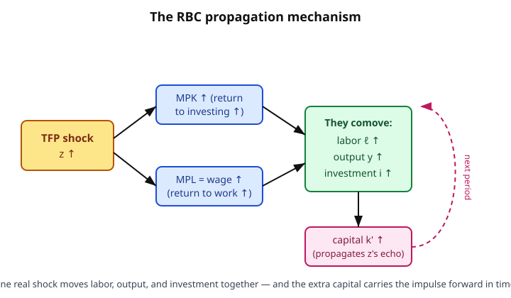

# Grad Macroeconomics · Lesson 4.1: The real business cycle model

> ⏱ ~15 min · Module 4: Business cycles · Builds on: [3.4 Social security and intergenerational transfers](03-04-social-security-transfers.md), [1.5 Stochastic dynamic programming](01-05-stochastic-dynamic-programming.md) · Unlocks: [4.2 Calibration and the stochastic growth model](04-02-calibration-stochastic-growth.md)

## Why this matters

Modules 1–3 built a machinery for *growth* — economies climbing toward a balanced path. But quarterly data doesn't climb smoothly; it wobbles. Output, hours worked, and investment all rise and fall **together**, and the swings are large. The pre-1980 answer was: markets fail, prices are sticky, and the government should smooth the ride. Kydland and Prescott's real business cycle (RBC) program made a startling counter-claim: take the *same* optimizing stochastic growth model you already know, hit it with productivity shocks, and the fluctuations it spits out look like real data — **and they are efficient**. No market failure, no role for stabilization policy. Recessions, on this view, are the economy optimally doing less when it's temporarily less productive.

You don't have to believe it — most macroeconomists don't take the strong version literally. But it is the null hypothesis every business-cycle model since is measured against, and the New Keynesian model of [4.4](04-04-nominal-rigidities-new-keynesian.md) is *defined* by the frictions it adds to this frictionless core. Learn the benchmark first.

## The idea

You already have almost the entire model. Lesson [1.5](01-05-stochastic-dynamic-programming.md) gave you the stochastic growth model: a representative household chooses consumption and saving each period to maximize expected discounted utility, facing a productivity level $z_t$ that follows a Markov process. RBC adds exactly one ingredient — **an endogenous labor choice**. The household now decides not just how much to consume, but how much to *work*.

That one addition is where cycles come from. When productivity $z_t$ is temporarily high, two things happen at once:

- The **wage** (the marginal product of labor) rises, so working *now* is unusually well paid. Rational households do more of a good thing while it's cheap — they work more today and rest more later. This is **intertemporal substitution of labor**.
- The **return to capital** (the marginal product of capital) rises, so investing now is unusually rewarding. Households save more, plowing output into next period's capital stock.

So a single real shock pushes labor, output, *and* investment up together — the comovement we see in data — and the extra capital carries the impulse forward, generating persistence even after $z$ reverts. That's the whole mechanism. No money, no prices-that-stick, no confusion: just a competitive economy optimally reallocating work and saving over time in response to how productive it is.

## The formal version

**The household problem.** A representative household maximizes

$$\max_{\{c_t,\,\ell_t,\,k_{t+1}\}} \; \mathbb{E}_0 \sum_{t=0}^\infty \beta^t\, u(c_t,\,1-\ell_t), \qquad 0<\beta<1,$$

subject to the resource constraint

$$c_t + k_{t+1} = z_t\, k_t^{\alpha}\,\ell_t^{1-\alpha} + (1-\delta)k_t.$$

*Symbols.* $c_t$ = consumption; $\ell_t$ = hours worked, so $1-\ell_t$ = leisure out of a time endowment normalized to 1; $k_t$ = capital brought into period $t$; $\beta$ = discount factor; $\delta$ = depreciation rate; $\alpha\in(0,1)$ = capital share; $z_t$ = total factor productivity (TFP). The period utility $u(c,1-\ell)$ rises in both consumption and leisure. Output is Cobb–Douglas, $y_t = z_t k_t^\alpha \ell_t^{1-\alpha}$.

**In words:** the household values consumption *and* leisure, and each period splits its resources (this period's output plus undepreciated capital) between eating now and building next period's capital — all while working the amount it chooses.

**The productivity shock.** $z_t$ is a Markov process, in practice an AR(1) in logs:

$$\ln z_t = \varphi \ln z_{t-1} + \varepsilon_t, \qquad 0<\varphi<1,\quad \varepsilon_t \sim \text{i.i.d. mean } 0.$$

**In words:** productivity is persistent — a good draw today ($\varepsilon_t>0$) raises expected productivity for many periods, decaying at rate $\varphi$. Persistence is what lets a transient shock produce a drawn-out cycle.

**The two optimality conditions.** The household's plan is pinned down by two first-order conditions (derived in Worked Example 1):

1. **Consumption Euler equation** (the intertemporal margin — same as [1.3](01-03-euler-transversality.md)/[1.5](01-05-stochastic-dynamic-programming.md), now with the endogenous return):
$$u_c(c_t,1-\ell_t) = \beta\, \mathbb{E}_t\Big[u_c(c_{t+1},1-\ell_{t+1})\big(\alpha z_{t+1}k_{t+1}^{\alpha-1}\ell_{t+1}^{1-\alpha} + 1-\delta\big)\Big].$$
   *In words:* the marginal utility given up by saving one more unit today equals the discounted expected marginal utility it buys tomorrow, scaled by the gross return on capital $R_{t+1}=\alpha\,\text{MPK}_{t+1}+1-\delta$.

2. **Intratemporal labor–leisure condition** (the *within*-period margin, new to RBC):
$$\frac{u_\ell(c_t,1-\ell_t)}{u_c(c_t,1-\ell_t)} = (1-\alpha)\,z_t\,k_t^{\alpha}\,\ell_t^{-\alpha} = w_t.$$
   *In words:* the marginal rate of substitution between leisure and consumption equals the real wage, which in competitive equilibrium equals the marginal product of labor $\text{MPL}_t$. Work up to the point where the last hour's leisure, valued in consumption units, is exactly worth the wage it costs you. Here $u_\ell$ denotes $\partial u/\partial(1-\ell)$, the marginal utility of leisure.

The Euler equation governs saving *across* time; the labor condition governs work *within* a period. Together with the resource constraint and the $z$ process, they *are* the model.

**Why comovement.** A positive $z_t$ raises $w_t$ (labor condition) → $\ell_t$ rises → output $y_t=z_tk_t^\alpha\ell_t^{1-\alpha}$ rises by *more* than $z$ alone (the labor response amplifies it). It also raises $\text{MPK}_{t+1}$, so the Euler equation calls for higher $k_{t+1}$ → investment $i_t=k_{t+1}-(1-\delta)k_t$ rises. Consumption rises too (the household is richer) but by less than output, because part of the windfall is saved. That is exactly the joint upswing of $y,\ell,i,c$ observed in expansions.

## Picture

## Worked examples

**Example 1 — Deriving the two optimality conditions.** Substitute the resource constraint's implied consumption $c_t = z_tk_t^\alpha\ell_t^{1-\alpha}+(1-\delta)k_t-k_{t+1}$ and write the Lagrangian, or more cleanly attach a multiplier $\lambda_t$ to each period's constraint:

$$\mathcal{L}=\mathbb{E}_0\sum_{t}\beta^t\Big[u(c_t,1-\ell_t)+\lambda_t\big(z_tk_t^\alpha\ell_t^{1-\alpha}+(1-\delta)k_t-c_t-k_{t+1}\big)\Big].$$

Take first-order conditions:

- $\partial/\partial c_t:\quad u_c(c_t,1-\ell_t)=\lambda_t.$ (Marginal utility of consumption = shadow value of resources.)
- $\partial/\partial \ell_t:\quad -u_\ell(c_t,1-\ell_t)+\lambda_t(1-\alpha)z_tk_t^\alpha\ell_t^{-\alpha}=0.$ Working an hour costs $u_\ell$ in lost leisure and yields $\text{MPL}_t$ units of resources worth $\lambda_t$ each. Divide by $u_c=\lambda_t$:
$$\boxed{\;\frac{u_\ell}{u_c}=(1-\alpha)z_tk_t^\alpha\ell_t^{-\alpha}=w_t.\;}$$
- $\partial/\partial k_{t+1}:\quad -\lambda_t+\beta\,\mathbb{E}_t\big[\lambda_{t+1}(\alpha z_{t+1}k_{t+1}^{\alpha-1}\ell_{t+1}^{1-\alpha}+1-\delta)\big]=0.$ Substituting $\lambda_t=u_c(c_t,1-\ell_t)$ gives the **Euler equation** above.

Two margins, two conditions. The Euler equation is the one you already know from deterministic growth; the labor condition is the genuinely new object that turns a growth model into a cycle model.

**Example 2 — Intertemporal labor substitution, made explicit.** Take the separable log utility
$$u(c,1-\ell)=\ln c+\psi\ln(1-\ell),\qquad \psi>0.$$
Then $u_c=1/c$ and $u_\ell=\psi/(1-\ell)$, so the labor condition becomes
$$\frac{\psi/(1-\ell_t)}{1/c_t}=w_t \;\Longrightarrow\; \frac{\psi\,c_t}{1-\ell_t}=w_t \;\Longrightarrow\; \boxed{\,1-\ell_t=\frac{\psi\,c_t}{w_t}\,,\quad \ell_t=1-\frac{\psi c_t}{w_t}.}$$
Read it: leisure is proportional to consumption and *inversely* proportional to the wage. Now suppose a **temporary** positive shock hits: $z_t$ (and hence $w_t=(1-\alpha)z_tk_t^\alpha\ell_t^{-\alpha}$) jumps today but is expected to revert. Because the shock is temporary, consumption-smoothing keeps $c_t$ from rising much (the household spreads the windfall over its whole future). With $c_t$ roughly fixed and $w_t$ up sharply, $\ell_t=1-\psi c_t/w_t$ **rises** — leisure is expensive right now, so take less of it. That is intertemporal substitution: you concentrate work in the high-wage window. The *more transitory* the shock (low $\varphi$), the flatter the consumption response and the larger the labor response — high-productivity times see the biggest hours booms.

## Watch out

- **The labor-supply elasticity problem.** For the model to generate employment swings as large as the data from productivity shocks of realistic size, the representative household's labor supply must be *very* elastic — much more elastic than microeconometric estimates of individual labor supply. RBC leans on an "indivisible labor" / extensive-margin argument (people move in and out of employment, not hours) to rescue this. It remains the model's most contested joint.
- **"Recessions are optimal" is a strong claim, not a throwaway.** In this model the welfare theorems hold: the competitive allocation solves a planner's problem (see [1.6](01-06-recursive-competitive-equilibrium.md)). So the fluctuations are Pareto efficient and there is literally nothing a benevolent government could improve by stabilizing output. Whether you believe *actual* recessions are efficient responses to technology regress is exactly the debate — and the reason [4.4](04-04-nominal-rigidities-new-keynesian.md) exists.
- **Are TFP shocks even the driver?** Measured "TFP" is the Solow residual from [2.6](02-06-growth-accounting.md) — a residual, not a directly observed technology. Negative technology shocks (does knowledge *regress* in a recession?) strike many as implausible; the residual may be picking up unmeasured labor hoarding, utilization, or demand. The RBC program's boldest bet is that this residual is a genuine exogenous impulse.
- **Comovement is a *test*, not an assumption.** Nothing forced $c,\ell,i$ to move together — a preference shock, or a shock to the discount factor, would push consumption and labor in *opposite* directions. That real productivity shocks deliver the observed positive comovement is a nontrivial success of the mechanism.

## One-liner

> Feed the stochastic growth model an endogenous labor choice and a persistent TFP shock, and it optimally makes an economy work more, produce more, and invest more exactly when it's most productive — cycles as efficient responses to real shocks, with no room for stabilization policy.

## Problems

**P1 (🟢)** For utility $u(c,1-\ell)=\ln c+\psi\ln(1-\ell)$ and Cobb–Douglas output $y=zk^\alpha\ell^{1-\alpha}$, derive the intratemporal labor–leisure condition and solve it for $\ell$ in terms of $c$ and the wage $w$.

**P2 (🟡)** A positive, persistent TFP shock hits an RBC economy in period $t$ (so $z_t\uparrow$ and, since $\varphi>0$, $\mathbb{E}_t z_{t+1}\uparrow$ too). Sign the impact-period responses of the wage $w_t$, hours $\ell_t$, output $y_t$, and investment $i_t$, and explain the channel for each. Why does consumption rise by *less* than output?

**P3 (🔴)** The closed-form benchmark. Take $u=\ln c+\psi\ln(1-\ell)$, Cobb–Douglas production, and **full depreciation** $\delta=1$, so $c_t+k_{t+1}=z_tk_t^\alpha\ell_t^{1-\alpha}$. Guess that the savings rate and labor are constant: $k_{t+1}=s\,y_t$ and $\ell_t=\bar\ell$. Verify the guess and find $s$ and $\bar\ell$ in closed form. (Hint: with $\delta=1$ and log utility the Euler equation gives $s=\alpha\beta$; then use the labor condition with $c_t=(1-s)y_t$.)

Solutions

**P1.** With $u=\ln c+\psi\ln(1-\ell)$: $u_c=1/c$ and the marginal utility of leisure is $u_\ell=\partial u/\partial(1-\ell)=\psi/(1-\ell)$. The MRS of leisure for consumption is
$$\frac{u_\ell}{u_c}=\frac{\psi/(1-\ell)}{1/c}=\frac{\psi c}{1-\ell}.$$
Set it equal to the marginal product of labor $w=(1-\alpha)zk^\alpha\ell^{-\alpha}$:
$$\frac{\psi c}{1-\ell}=w\;\Longrightarrow\; 1-\ell=\frac{\psi c}{w}\;\Longrightarrow\; \ell=1-\frac{\psi c}{w}.$$
Hours fall with consumption (a rich household rests more, the wealth effect) and rise with the wage (the substitution effect makes work attractive).

**P2.**
- **Wage $w_t\uparrow$.** $w_t=(1-\alpha)z_tk_t^\alpha\ell_t^{-\alpha}$. Capital $k_t$ is predetermined; $z_t\uparrow$ raises MPL directly, so $w_t\uparrow$.
- **Hours $\ell_t\uparrow$.** From the labor condition $\ell_t=1-\psi c_t/w_t$: the higher wage makes leisure expensive, so the substitution effect raises $\ell_t$. (The wealth effect from higher $c_t$ pushes the other way, but for a not-too-permanent shock the substitution effect dominates on impact — and persistence keeps $c_t$ from jumping enough to overturn it.)
- **Output $y_t\uparrow$, and by more than $z$ alone.** $y_t=z_tk_t^\alpha\ell_t^{1-\alpha}$. Both $z_t\uparrow$ (direct) and $\ell_t\uparrow$ (induced) raise output — the endogenous labor response *amplifies* the technology shock. This is the RBC amplification channel.
- **Investment $i_t\uparrow$.** Because $\varphi>0$, higher $z_t$ raises expected $z_{t+1}$ and hence $\text{MPK}_{t+1}=\alpha z_{t+1}k_{t+1}^{\alpha-1}\ell_{t+1}^{1-\alpha}$. The Euler equation says a higher expected return calls for more saving, so $k_{t+1}\uparrow$ and $i_t=k_{t+1}-(1-\delta)k_t\uparrow$. The extra capital propagates the shock into future periods.
- **Consumption rises by less than output.** The windfall is partly transitory, so consumption-smoothing (permanent-income logic, previewed for [5.1](05-01-permanent-income-life-cycle.md)) spreads it over the whole future — the household saves a chunk of the good period rather than eating it all. Hence $\Delta c_t<\Delta y_t$, the residual going to investment. This is why investment is *more* volatile than consumption over the cycle, a first-order fact the model gets right.

**P3.** With $\delta=1$ the constraint is $c_t+k_{t+1}=z_tk_t^\alpha\ell_t^{1-\alpha}=y_t$.

*Saving rate.* Guess $k_{t+1}=s\,y_t$ with $s$ constant, so $c_t=(1-s)y_t$. The Euler equation with $u_c=1/c$ and gross return $R_{t+1}=\alpha z_{t+1}k_{t+1}^{\alpha-1}\ell_{t+1}^{1-\alpha}+1-\delta=\alpha\, y_{t+1}/k_{t+1}$ (using $\delta=1$ and $y_{t+1}=z_{t+1}k_{t+1}^\alpha\ell_{t+1}^{1-\alpha}$) is
$$\frac1{c_t}=\beta\,\mathbb{E}_t\!\left[\frac1{c_{t+1}}\cdot\frac{\alpha y_{t+1}}{k_{t+1}}\right].$$
With $c_{t+1}=(1-s)y_{t+1}$ the $y_{t+1}$ cancels: $\dfrac{1}{(1-s)y_t}=\beta\,\dfrac{\alpha}{(1-s)k_{t+1}}=\beta\dfrac{\alpha}{(1-s)\,s\,y_t}.$ Cancel $(1-s)y_t$:
$$1=\frac{\alpha\beta}{s}\;\Longrightarrow\; \boxed{s=\alpha\beta.}$$
Constant $s$ verifies the guess: $k_{t+1}=\alpha\beta\,y_t$ and $c_t=(1-\alpha\beta)y_t$. (This is the classic Brock–Mirman closed form; labor didn't enter the saving rate at all.)

*Labor.* Use the labor condition $\ell_t=1-\psi c_t/w_t$ with $c_t=(1-\alpha\beta)y_t$ and $w_t=(1-\alpha)y_t/\ell_t$ (since $\text{MPL}=(1-\alpha)y/\ell$). Then
$$\frac{\psi c_t}{w_t}=\frac{\psi(1-\alpha\beta)y_t}{(1-\alpha)y_t/\ell_t}=\frac{\psi(1-\alpha\beta)}{1-\alpha}\,\ell_t.$$
The labor condition $1-\ell_t=\psi c_t/w_t$ becomes
$$1-\ell_t=\frac{\psi(1-\alpha\beta)}{1-\alpha}\,\ell_t \;\Longrightarrow\; 1=\ell_t\left(1+\frac{\psi(1-\alpha\beta)}{1-\alpha}\right),$$
$$\boxed{\;\bar\ell=\frac{1-\alpha}{(1-\alpha)+\psi(1-\alpha\beta)}.\;}$$
This is a **constant** — independent of $z_t$ and $k_t$ — so the guess $\ell_t=\bar\ell$ is verified. Both the savings share and the labor share are constants; the $y_t$'s all canceled because log utility makes income and substitution effects on both margins exactly offset. The economy still fluctuates: output $y_t=z_tk_t^\alpha\bar\ell^{1-\alpha}$ inherits all the movement in $z_t$ (amplified through the capital accumulation $k_{t+1}=\alpha\beta y_t$), even though the *shares* saved and worked never budge. This tractable case is the launchpad for the calibration exercise of [4.2](04-02-calibration-stochastic-growth.md), where realistic $\delta<1$ forces a numerical solution.

## Flashback

**From Lesson [3.1](03-01-olg-model.md) (OLG saving):** In the two-period overlapping-generations model, a household born in period $t$ works only when young, earning wage $w_t$, consumes $c^y_t$ young and $c^o_{t+1}$ old, saves $s_t=w_t-c^y_t$, and earns gross return $1+r_{t+1}$ on savings. With log utility $U=\ln c^y_t+\beta\ln c^o_{t+1}$, derive the saving function $s_t$. Does saving depend on the interest rate?

Solution

Budget constraints: $c^y_t=w_t-s_t$ and $c^o_{t+1}=(1+r_{t+1})s_t$. Substitute into utility:
$$U=\ln(w_t-s_t)+\beta\ln\big((1+r_{t+1})s_t\big).$$
Differentiate with respect to $s_t$ and set to zero:
$$\frac{dU}{ds_t}=\frac{-1}{w_t-s_t}+\beta\cdot\frac{1}{s_t}=0\;\Longrightarrow\;\beta(w_t-s_t)=s_t\;\Longrightarrow\;\boxed{s_t=\frac{\beta}{1+\beta}\,w_t.}$$
Saving is a **constant fraction** $\beta/(1+\beta)$ of the wage and — the punchline — **does not depend on the interest rate** $r_{t+1}$. With log utility the income and substitution effects of a higher return exactly cancel (the same knife-edge that made $s$ and $\bar\ell$ clean constants in P3 above). This is why log utility is the workhorse for closed-form macro: it neutralizes the interest-rate channel of saving. Any curvature other than log ($\text{CRRA}$ with $\gamma\neq1$) breaks the tie and makes saving respond to $r$.

## Connections

- **Backward:** this is [1.5](01-05-stochastic-dynamic-programming.md)'s stochastic growth model with one new choice variable (labor), solved by the same Euler-equation logic of [1.3](01-03-euler-transversality.md); the efficiency claim rests on the welfare theorem of [1.6](01-06-recursive-competitive-equilibrium.md). The production side and the TFP object are [2.1](02-01-solow-model.md) and [2.6](02-06-growth-accounting.md)'s Solow residual, now reinterpreted as the *impulse* driving cycles. The slogan "the same model explains growth and cycles" is literally that continuity.
- **Forward:** [4.2](04-02-calibration-stochastic-growth.md) calibrates this model to match second moments of the data; [4.3](04-03-propagation-impulse-responses.md) traces the impulse-response functions that show how a one-period shock propagates through the capital stock; [4.4](04-04-nominal-rigidities-new-keynesian.md) keeps this optimizing core but adds nominal rigidities and monopolistic competition, restoring a role for monetary policy that the RBC model denies. Consumption-smoothing here previews [5.1](05-01-permanent-income-life-cycle.md).
- **Sideways:** the consumption Euler equation is the *same* object as the stochastic discount factor in [`mathematical-finance`](../../mathematical-finance/syllabus.md) — $\beta\, u_c(c_{t+1})/u_c(c_t)$ is the pricing kernel, tying business-cycle consumption dynamics to asset returns (the thread [5.4](05-04-consumption-based-asset-pricing.md) picks up). Estimating and testing these dynamics on time-series data — the AR(1) for $z$, the cross-correlations of $y,c,i,\ell$ — is the province of [`econometrics`](../../econometrics/syllabus.md).
