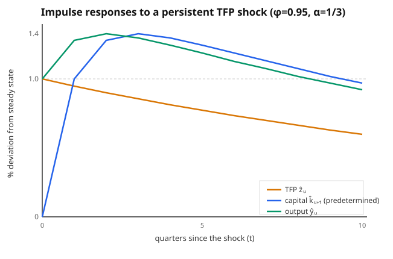

# Grad Macroeconomics · Lesson 4.2: Calibration and the stochastic growth model

> ⏱ ~15 min · Module 4: Business cycles · Builds on: [4.1 The real business cycle model](04-01-real-business-cycle.md) · Unlocks: [4.3 Propagation and impulse responses](04-03-propagation-impulse-responses.md)

## Why this matters

You built the RBC model in 4.1 — a full general-equilibrium economy driven by one thing, random technology. Now: **is it any good?** You can't run the experiment twice, and the model has no closed form, so you can't just read off a prediction. The RBC answer to both problems is a two-move discipline that still organizes modern macro. First, **calibrate**: don't estimate the parameters, *pick* them from long-run averages and micro evidence that have nothing to do with business cycles. Then **log-linearize**: since the equilibrium conditions are nonlinear and unsolvable, approximate them to linear equations in percent-deviations around the steady state, solve *that* system exactly, and simulate. Success isn't fitting the wiggles of GDP — it's reproducing its **second moments** (how volatile output is, how much smoother consumption is, how everything moves together) from parameters you never tuned to match them. That's a genuinely falsifiable claim, and it's how a stochastic growth model becomes a quantitative theory of the cycle.

## The idea

Two ideas, one per move.

**Calibration is borrowing.** Every structural parameter shows up somewhere *other* than the cycle — in a national-accounts ratio, a growth fact, a micro study. The capital share $\alpha$ is just capital's cut of national income, about a third. The discount factor $\beta$ is pinned by the average real interest rate. The persistence $\phi$ of technology is the autocorrelation of the Solow residual you measured in [2.6](02-06-growth-accounting.md). So you spend *no* cyclical information choosing parameters, which leaves the cyclical moments free to either vindicate or embarrass the model. That's the whole point of calibrating rather than estimating: you keep the test honest by not fitting to the thing you're testing.

**Log-linearizing is looking through a magnifying glass at the steady state.** The economy spends its life near the balanced-growth point. So write every variable as a *percent deviation* from its steady-state value, $\hat x_t \equiv \ln(x_t/x^*)$, and Taylor-expand each equilibrium condition to first order. Products become sums, powers become multipliers ($\widehat{k^\alpha} = \alpha\hat k$), and a tangle of nonlinear conditions collapses into a small **linear** rational-expectations system. Linear systems you can solve in closed form — you get a **policy function**, a rule like "next period's capital is a fixed combination of today's capital and today's technology." Then you feed it random shocks and watch.

There is one blessed special case where the approximation is *exact*: log utility with full depreciation ($\delta=1$). We'll use it as the anchor, because its linear policy function is literally the true one — the boss problem below.

## The formal version

**The calibration protocol.** For the standard RBC economy with Cobb–Douglas production $y_t = z_t k_t^\alpha n_t^{1-\alpha}$ and preferences $\mathbb{E}_0\sum \beta^t\big[\ln c_t - \psi\frac{n_t^{1+\nu}}{1+\nu}\big]$:

| Parameter | Meaning | Calibration target |
|---|---|---|
| $\alpha$ | capital share | factor income: capital's share of GDP $\approx 1/3$ |
| $\delta$ | depreciation rate | capital-consumption data, $\approx 0.025$/qtr (10%/yr) |
| $\beta$ | discount factor | average real return: $\beta \approx 1/(1+r)$, so $\approx 0.99$/qtr |
| $\psi$ | disutility of work | average hours worked $\approx 1/3$ of time endowment |
| $\nu$ | inverse Frisch elasticity | micro labor-supply studies |
| $\phi,\ \sigma_\varepsilon$ | TFP persistence, shock size | AR(1) fit to the Solow residual (2.6) |

In words: five of these come from ratios and averages that a sophomore could look up; only the shock process is a genuine time-series estimate, and even that is a one-line regression, $\hat z_t = \phi\hat z_{t-1} + \varepsilon_t$.

**The moment-matching test.** Simulate the calibrated model, filter out the trend (as you would the data), and compute **second moments** — standard deviations, cross-correlations with output, autocorrelations. A pass looks like: consumption *less* volatile than output, investment *far more* volatile, hours nearly as volatile as output, and everything strongly *procyclical*. This is exactly the language of [`econometrics`](../../econometrics/syllabus.md) — you are doing informal method-of-moments, matching model moments to sample moments (GMM makes it formal).

**Log-linearization, mechanically.** For any equilibrium condition, use these first-order rules around the steady state, with $\hat x_t = \ln(x_t/x^*)$ so that $x_t \approx x^*(1+\hat x_t)$:

$$\widehat{x_t y_t} = \hat x_t + \hat y_t,\qquad \widehat{x_t^a} = a\,\hat x_t,\qquad \widehat{x_t + y_t}=\frac{x^*}{x^*+y^*}\hat x_t + \frac{y^*}{x^*+y^*}\hat y_t.$$

In words: take logs, then read every variable as its percent gap from steady state; multiplication turns into addition, exponents into slopes, and sums into share-weighted averages. Apply these to the resource constraint, the Euler equation, and the labor FOC and you get a linear system in $(\hat k_t,\hat z_t)$ and the jump variables.

**Solving the linear system — Blanchard–Kahn.** The linearized model is a system of expectational difference equations with two kinds of variables: **predetermined** states (capital $\hat k_t$ — fixed by yesterday's choice) and **jump** variables (consumption — chosen freely today). It has a unique, stable (non-exploding) solution **iff the number of eigenvalues outside the unit circle equals the number of jump variables.** In words: exactly one unstable root must be "used up" pinning down the one free jump variable, leaving one stable root to govern the predetermined state. That's the discrete-time, stochastic reincarnation of the **saddle path** from [2.3](02-03-ramsey-cass-koopmans.md): the economy has one predetermined state and one forward-looking control, and equilibrium is the single trajectory that neither explodes nor collapses. When Blanchard–Kahn holds, you can write the solution as a linear policy function $\hat k_{t+1} = a\,\hat k_t + b\,\hat z_t$ with $|a|<1$.

## Picture

The payoff of the whole apparatus is an **impulse response function**: hit the calibrated model with a one-time technology shock and trace the reaction of each variable over time. Below is the $\delta=1$ log economy (the boss problem) with $\alpha=1/3$, $\phi=0.95$.

Read it as a story. Technology (orange) jumps up and decays geometrically at rate $\phi$ — the *direct* effect. Capital (blue) can't move on impact (it was chosen yesterday), so it starts at zero, then climbs as the productive economy saves more, peaking a few quarters out. Output (green) jumps immediately with technology, then keeps *rising* for a couple of quarters even as the shock fades, because the capital being built props it up. That internal, hump-shaped propagation — output outliving its own shock — is the machine you'll take apart in [4.3](04-03-propagation-impulse-responses.md).

## Worked examples

**Example 1 — calibrating the standard parameters.** You're told: capital earns about 1/3 of national income; the capital stock depreciates about 10% per year; the average real return on capital is about 4% per year; and a regression of the log Solow residual on its own lag gives a slope of 0.95 with residual standard deviation 0.007. Working at *quarterly* frequency, calibrate $\alpha,\delta,\beta,\phi,\sigma_\varepsilon$.

*Solution.* Because production is Cobb–Douglas, factor payments equal output elasticities: capital's income share **is** $\alpha$, so $\boxed{\alpha=1/3}$ — no cyclical data touched. Depreciation is a flow rate; 10%/yr at quarterly frequency is $\boxed{\delta=0.10/4=0.025}$. The discount factor comes from the deterministic Euler equation $1=\beta(1+r)$ evaluated at the steady-state return; 4%/yr is $\approx 1\%$/qtr, so $\boxed{\beta=1/(1.01)\approx 0.99}$. The technology process is already an AR(1) in logs, and the regression *is* the calibration: $\boxed{\phi=0.95}$, $\boxed{\sigma_\varepsilon=0.007}$. Every number came from a ratio, a rate, or a one-line regression — none from the volatility of GDP, which is precisely what we now get to test.

**Example 2 — BOSS PROBLEM 4: log-linearize the stochastic growth model, solve the policy, describe the IRF.**

*Setup.* Take the planner's problem with log utility, full depreciation ($\delta=1$), inelastic labor normalized to 1, and Cobb–Douglas technology:
$$\max\ \mathbb{E}_0\sum_{t=0}^\infty \beta^t \ln c_t \quad\text{s.t.}\quad c_t + k_{t+1} = z_t k_t^\alpha,\qquad \ln z_t = \phi\ln z_{t-1}+\varepsilon_t.$$
Here $c_t$ is consumption, $k_t$ the predetermined capital stock, $z_t$ total factor productivity (steady-state value normalized to $z^*=1$, so $\ln z_t$ is *already* a percent deviation), $\alpha\in(0,1)$ the capital share, $\beta\in(0,1)$ the discount factor, and $\varepsilon_t$ a mean-zero i.i.d. innovation.

*Step 1 — the exact policy (guess and verify).* The Euler equation is $\frac{1}{c_t} = \beta\,\mathbb{E}_t\!\big[\frac{1}{c_{t+1}}\,\alpha z_{t+1}k_{t+1}^{\alpha-1}\big]$ (marginal product of capital under $\delta=1$ is $\alpha z_{t+1}k_{t+1}^{\alpha-1}$). Guess a constant saving rate, $k_{t+1}=s\,z_t k_t^\alpha$, so $c_t=(1-s)z_tk_t^\alpha$. Substitute:
$$\frac{1}{(1-s)z_tk_t^\alpha}=\beta\,\mathbb{E}_t\!\left[\frac{\alpha z_{t+1}k_{t+1}^{\alpha-1}}{(1-s)z_{t+1}k_{t+1}^\alpha}\right]=\beta\,\frac{\alpha}{(1-s)}\,\mathbb{E}_t\!\left[\frac{1}{k_{t+1}}\right]=\frac{\beta\alpha}{(1-s)}\cdot\frac{1}{s\,z_tk_t^\alpha}.$$
The $z_{t+1}$ cancels, the expectation evaporates, and $z_tk_t^\alpha$ matches on both sides: $1=\beta\alpha/s$, so $s=\alpha\beta$. The exact optimal policy is
$$k_{t+1}=\alpha\beta\,z_t k_t^\alpha,\qquad c_t=(1-\alpha\beta)\,z_t k_t^\alpha.$$

*Step 2 — log-linearize (here, exactly).* Take logs of the capital rule: $\ln k_{t+1}=\ln(\alpha\beta)+\ln z_t+\alpha\ln k_t$. The deterministic steady state ($z=1$) satisfies $\ln k^*=\ln(\alpha\beta)+\alpha\ln k^*$, i.e. $\ln(\alpha\beta)=(1-\alpha)\ln k^*$ and $k^*=(\alpha\beta)^{1/(1-\alpha)}$. Subtract the steady state from the log rule, writing $\hat k_t=\ln(k_t/k^*)$ and $\hat z_t=\ln z_t$:
$$\boxed{\hat k_{t+1}=\alpha\,\hat k_t+\hat z_t},\qquad \hat z_t=\phi\,\hat z_{t-1}+\varepsilon_t.$$
Because the true policy was already log-linear (Cobb–Douglas $\times$ log $\times$ $\delta=1$), *no approximation error* is incurred — the linearized law of motion is exact. The saving rule is: next period's capital gap is $\alpha$ times today's gap plus the full technology gap.

*Step 3 — output and consumption policies.* Output is $y_t=z_tk_t^\alpha$, so $\hat y_t = \hat z_t + \alpha\hat k_t$. Consumption is a constant fraction of output, $c_t=(1-\alpha\beta)y_t$, so $\hat c_t=\hat y_t=\hat z_t+\alpha\hat k_t$ — consumption moves one-for-one with output here.

*Step 4 — check Blanchard–Kahn.* The state $\hat k_t$ follows $\hat k_{t+1}=\alpha\hat k_t+\hat z_t$ with eigenvalue $\alpha\in(0,1)$: stable. The jump variable $\hat c_t$ is pinned down by the policy $\hat c_t=\hat z_t+\alpha\hat k_t$ — no free explosive direction. One predetermined state, one stable root, jump uniquely determined: saddle-path stable, exactly as [2.3](02-03-ramsey-cass-koopmans.md) demanded.

*Step 5 — the impulse response.* Hit a steady economy with $\varepsilon_0=1$ and nothing after, so $\hat z_t=\phi^t$ for $t\ge0$. Capital is predetermined: $\hat k_0=0$. Iterating $\hat k_{t+1}=\alpha\hat k_t+\phi^t$ gives the closed form
$$\hat k_t=\frac{\phi^t-\alpha^t}{\phi-\alpha},\qquad \hat y_t=\hat z_t+\alpha\hat k_t=\phi^t+\alpha\,\frac{\phi^t-\alpha^t}{\phi-\alpha}.$$
On impact, $\hat y_0=1$: output jumps by the full shock, since capital can't respond yet. Then the higher output feeds saving, capital climbs to a peak a few quarters out, and output *rises above its impact level* before decaying — the hump in the figure. With $\alpha=1/3,\phi=0.95$, output peaks near $t=2$ at $\approx 1.33\%$ per 1% shock. Consumption, being proportional to output, traces the identical hump. Everything is procyclical and dies out at the slower of the two rates $\phi,\alpha$. (That consumption is exactly as volatile as output is the knife-edge model's *failure* — see Watch out.)

## Watch out

- **The $\delta=1$ model can't smooth consumption.** Because saving is a constant fraction of output, $\hat c_t=\hat y_t$ exactly — consumption is as volatile as output, contradicting the data (and Example-1's whole test). This isn't a bug in the method; it's what happens when you shut the accumulation margin ($\delta=1$ means capital fully evaporates each period, so there's no smoothing stock). The *general* calibrated model, solved by genuine (approximate) log-linearization, delivers smoother consumption. Use $\delta=1$ for the clean algebra, not for the moments.
- **Log-linearization is local.** It's a first-order Taylor expansion; it's blind to anything the linear terms miss — precautionary saving, the welfare cost of risk, asymmetric responses to big vs. small shocks. For those you need higher-order or global methods. Near the steady state with small shocks it's excellent; for a deep recession, distrust it.
- **Calibrate, don't peek.** The discipline only means something if the targets are cycle-*independent*. If you quietly tune $\phi$ to make output volatility come out right, you've turned a test into a tautology. Keep the moment you're testing out of the parameters you're choosing.
- **$\ln z^*=0$ is a normalization, not a coincidence.** We set $z^*=1$ so that $\hat z_t=\ln z_t$ needs no "minus steady state." If you calibrate $z^*\ne 1$, remember $\hat z_t=\ln(z_t/z^*)$.

## One-liner

> Calibrate the parameters from long-run facts, log-linearize the unsolvable model into a linear policy function around the steady state, then judge it by whether its simulated second moments — not its parameters — match the data.

## Problems

**P1 (🟢) — calibrate from targets.** You're handed three long-run facts for an annual RBC calibration: labor receives about two-thirds of national income; the average real return on capital is about 5% per year; and the capital stock loses about 8% of its value to depreciation each year. Give $\alpha$, $\beta$, and $\delta$, and state in one line why none of these used business-cycle data.

**P2 (🟡) — log-linearize a resource constraint.** The economy's resource constraint is $y_t = c_t + i_t$ (output splits into consumption and investment). Log-linearize it around the steady state and show the result is *not* simply $\hat y_t=\hat c_t+\hat i_t$. Express the coefficients in terms of the steady-state great ratios $c^*/y^*$ and $i^*/y^*$.

**P3 (🔴) — BOSS PROBLEM 4, full.** Consider the log-utility, $\delta=1$ stochastic growth model with inelastic labor:
$$\max\ \mathbb{E}_0\sum_{t=0}^\infty\beta^t\ln c_t\quad\text{s.t.}\quad c_t+k_{t+1}=z_tk_t^\alpha,\quad \hat z_t=\phi\hat z_{t-1}+\varepsilon_t,\quad \hat z_t\equiv\ln z_t.$$
(a) Derive the exact optimal policy and show the linearized law of motion is $\hat k_{t+1}=\alpha\hat k_t+\hat z_t$. (b) Solve for the output policy $\hat y_t$ in terms of $\hat k_t,\hat z_t$, and verify the system is saddle-path stable (Blanchard–Kahn). (c) For a one-time unit innovation $\varepsilon_0=1$, derive closed forms for $\hat z_t,\hat k_t,\hat y_t$, and describe in words the shape of the output and consumption impulse responses — in particular, why output can be *higher* several quarters after the shock than on impact.

Solutions

**P1.** Cobb–Douglas factor shares equal the exponents, so if labor's share is $\approx 2/3$, capital's share is $\alpha = 1-2/3 = \boxed{1/3}$. The discount factor solves the steady-state Euler condition $1=\beta(1+r)$ with $r=0.05$: $\beta = 1/1.05 \approx \boxed{0.952}$. Depreciation is read straight off the capital-loss rate, $\delta = \boxed{0.08}$. Each is a factor share, an average return, or a depreciation rate — long-run averages, none of which references the volatility, correlation, or persistence of output. That's what makes the subsequent moment-matching a real test.

**P2.** Start from $y_t=c_t+i_t$, which at steady state reads $y^*=c^*+i^*$. Write each variable as $x_t\approx x^*(1+\hat x_t)$ (first order):
$$y^*(1+\hat y_t)=c^*(1+\hat c_t)+i^*(1+\hat i_t).$$
The constants cancel by the steady-state identity, leaving $y^*\hat y_t=c^*\hat c_t+i^*\hat i_t$. Divide by $y^*$:
$$\boxed{\hat y_t=\frac{c^*}{y^*}\hat c_t+\frac{i^*}{y^*}\hat i_t.}$$
The percent change in output is the **share-weighted** average of the percent changes in its components, *not* their sum. (Sanity check: the weights $c^*/y^*+i^*/y^*=1$, so if $\hat c_t=\hat i_t$ then $\hat y_t$ equals that common value — as it must. Naïvely adding would double-count.) This is the general "$\widehat{x+y}$" rule from the formal section, and it's why investment's large percent swings translate into only a modest output swing: its share $i^*/y^*$ is small (~1/4).

**P3.**

*(a)* The Euler equation is $u'(c_t)=\beta\mathbb{E}_t[u'(c_{t+1})R_{t+1}]$ with $u'(c)=1/c$ and gross return $R_{t+1}=\partial(z_{t+1}k_{t+1}^\alpha)/\partial k_{t+1}=\alpha z_{t+1}k_{t+1}^{\alpha-1}$ (full depreciation, so no $1-\delta$ term):
$$\frac{1}{c_t}=\beta\,\mathbb{E}_t\!\left[\frac{\alpha z_{t+1}k_{t+1}^{\alpha-1}}{c_{t+1}}\right].$$
Guess $k_{t+1}=s z_t k_t^\alpha$, hence $c_t=(1-s)z_tk_t^\alpha$ and $c_{t+1}=(1-s)z_{t+1}k_{t+1}^\alpha$. Then
$$\frac{\alpha z_{t+1}k_{t+1}^{\alpha-1}}{c_{t+1}}=\frac{\alpha z_{t+1}k_{t+1}^{\alpha-1}}{(1-s)z_{t+1}k_{t+1}^\alpha}=\frac{\alpha}{(1-s)k_{t+1}},$$
which is *non-random* given information at $t$ (it depends only on $k_{t+1}=sz_tk_t^\alpha$, chosen at $t$), so the expectation drops:
$$\frac{1}{(1-s)z_tk_t^\alpha}=\frac{\beta\alpha}{(1-s)}\cdot\frac{1}{sz_tk_t^\alpha}\ \Longrightarrow\ 1=\frac{\beta\alpha}{s}\ \Longrightarrow\ s=\alpha\beta.$$
So $k_{t+1}=\alpha\beta z_tk_t^\alpha$. Take logs: $\ln k_{t+1}=\ln(\alpha\beta)+\ln z_t+\alpha\ln k_t$. Steady state ($z=1$): $\ln k^*=\ln(\alpha\beta)+\alpha\ln k^*\Rightarrow \ln(\alpha\beta)=(1-\alpha)\ln k^*$. Subtract from the log rule and use $\hat k_t=\ln k_t-\ln k^*$, $\hat z_t=\ln z_t$:
$$\hat k_{t+1}=\alpha\hat k_t+\hat z_t.$$
(Exact, since the policy was already log-linear.)

*(b)* Output $y_t=z_tk_t^\alpha\Rightarrow \ln y_t=\ln z_t+\alpha\ln k_t\Rightarrow \hat y_t=\hat z_t+\alpha\hat k_t$. Consumption $c_t=(1-\alpha\beta)y_t\Rightarrow \hat c_t=\hat y_t=\hat z_t+\alpha\hat k_t$. Stability: the predetermined state obeys $\hat k_{t+1}=\alpha\hat k_t+\hat z_t$ with eigenvalue $\alpha\in(0,1)$ — inside the unit circle, so bounded. The single jump variable $\hat c_t$ is uniquely tied to the states with no explosive component. One predetermined state, one stable root, one uniquely-pinned jump: the Blanchard–Kahn condition holds and the equilibrium is the saddle path.

*(c)* With $\varepsilon_0=1$ and $\varepsilon_t=0$ afterward, $\hat z_t=\phi^t$ ($t\ge0$). Capital is predetermined so $\hat k_0=0$; iterating $\hat k_{t+1}=\alpha\hat k_t+\phi^t$ (linear first-order with forcing $\phi^t$) gives homogeneous part $B\alpha^t$ and particular part $A\phi^t$ with $A\phi=\alpha A+1\Rightarrow A=1/(\phi-\alpha)$; imposing $\hat k_0=A+B=0$:
$$\hat k_t=\frac{\phi^t-\alpha^t}{\phi-\alpha},\qquad \hat y_t=\hat c_t=\phi^t+\alpha\,\frac{\phi^t-\alpha^t}{\phi-\alpha}.$$
*Shape.* On impact $\hat y_0=1$ — output rises one-for-one with technology because capital is frozen for one period. Thereafter two forces compete: the direct effect $\phi^t$ decays, but the *indirect* effect works through capital, which starts at zero and builds as the newly-productive economy saves more, cresting a few quarters out (at $\alpha=1/3,\phi=0.95$, output peaks near $t=2$ at about $1.33\%$). Because that accumulated capital keeps output elevated even as the shock fades, output is **higher several quarters after the shock than at impact** — a hump. Consumption, being a fixed fraction of output, traces the same hump exactly. Both are strongly procyclical and decay to zero at the slower of $\phi$ and $\alpha$. The hump is *endogenous propagation*: capital accumulation stretches a transient shock into a persistent, delayed output cycle — the theme of [4.3](04-03-propagation-impulse-responses.md).

## Flashback

**From Lesson 4.1 (fresh variant of the RBC labor FOC).** In the RBC model with period utility $\ln c_t - \psi\frac{n_t^{1+\nu}}{1+\nu}$ and production $y_t=z_tk_t^\alpha n_t^{1-\alpha}$, derive the household's **intratemporal** optimality condition relating hours $n_t$, consumption $c_t$, and the real wage, and rewrite it using the marginal product of labor.

Solution

The intratemporal condition equates the marginal rate of substitution between leisure and consumption to the real wage — the price of an hour. Marginal disutility of work is $-u_n=\psi n_t^\nu$; marginal utility of consumption is $u_c=1/c_t$. Their ratio is the MRS, set equal to the real wage $w_t$:
$$\frac{-u_n}{u_c}=\psi n_t^\nu c_t = w_t.$$
In a competitive equilibrium the wage equals the marginal product of labor, $w_t=(1-\alpha)z_tk_t^\alpha n_t^{-\alpha}=(1-\alpha)\,y_t/n_t$. Substituting,
$$\psi n_t^\nu c_t=(1-\alpha)\frac{y_t}{n_t}.$$
In words: households push hours until the utility cost of one more hour of work ($\psi n_t^\nu$, in consumption units after dividing by $u_c$) equals what that hour produces at the margin. This static condition is the third equilibrium equation — alongside the Euler equation and resource constraint — that you'd log-linearize to close the *general* (variable-labor) RBC model.

## Connections

- **Backward — [4.1](04-01-real-business-cycle.md):** this is 4.1's model taken to data. The Euler equation and labor FOC you derived there are exactly the nonlinear conditions we now calibrate and log-linearize.
- **Backward — [2.3](02-03-ramsey-cass-koopmans.md):** Blanchard–Kahn *is* the saddle path, discretized and made stochastic — one predetermined state, one forward-looking control, a unique non-exploding trajectory selected by a stable/unstable eigenvalue split.
- **Backward — [2.6](02-06-growth-accounting.md):** the Solow residual you constructed there is the *raw material* for the shock process $\hat z_t=\phi\hat z_{t-1}+\varepsilon_t$; its autocorrelation and variance are two of the calibration targets.
- **Forward — [4.3](04-03-propagation-impulse-responses.md):** the hump-shaped IRF here is the starting point; 4.3 dissects how the model turns a transient shock into a persistent cycle (and why RBC critics say it needs help).
- **Sideways — [`econometrics`](../../econometrics/syllabus.md):** moment matching is informal method-of-moments; GMM formalizes "choose parameters so model moments equal sample moments," and the AR(1) shock fit is bread-and-butter time-series estimation. DSGE estimation (likelihood/Bayesian) is the successor to calibration.
- **Sideways — [`dynamical-systems`](../../dynamical-systems/syllabus.md):** log-linearization is linearizing a nonlinear map about a fixed point; the eigenvalues of the resulting linear system (inside vs. outside the unit circle) decide stability exactly as in continuous-time phase-plane analysis, here in discrete time.
