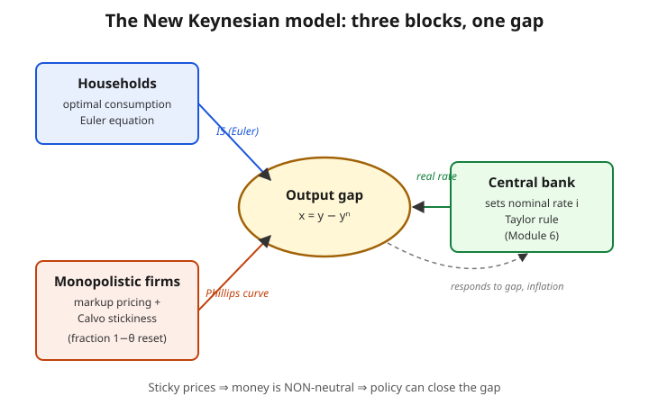

# Grad Macroeconomics · Lesson 4.4: Nominal rigidities and the New Keynesian setup

> ⏱ ~15 min · Module 4: Business cycles · Builds on: [4.3 Propagation and impulse responses](04-03-propagation-impulse-responses.md) · Unlocks: [4.5 The New Keynesian Phillips curve](04-05-nk-phillips-curve.md)

## Why this matters

RBC (Lessons 4.1–4.3) is a beautiful machine with one uncomfortable feature: **money doesn't matter**. Prices are perfectly flexible, markets always clear, and every fluctuation is an *efficient* response to real shocks (mostly technology). A central bank that changes the nominal interest rate changes nothing real — it just moves the price level one-for-one. Yet in the data, monetary policy plainly *does* move output and employment, and recessions look like *shortfalls* — factories idle, workers who'd happily work at the going wage — not efficient vacations.

The New Keynesian (NK) model is the challenger. It keeps the RBC skeleton — optimizing households, a stochastic general equilibrium solved recursively — and adds **one friction: prices are sticky.** That single change flips the model's politics. Money becomes non-neutral, *demand* shocks move output, fluctuations become partly a *market failure*, and there is suddenly a **role for stabilization policy**. Everything modern central banks say traces back to the two building blocks in this lesson.

## The idea

To make prices sticky you first need someone who *sets* a price. In competitive RBC, no firm sets anything — each is a price-taker facing a horizontal demand curve, selling at marginal cost. "Keeping my price fixed" is meaningless for a price-taker. So the NK model needs two ingredients, in order:

1. **Monopolistic competition** — give each firm a little market power, so it *chooses* a price (a markup over marginal cost). Now "sticky price" means something: the firm has a price it would like to change but doesn't.
2. **Calvo pricing** — stop firms from re-optimizing every period. Each period only a random fraction of firms may reset; the rest are frozen at last period's price. The aggregate price level now crawls instead of jumping.

Once the price level crawls, the central bank's grip on the *nominal* rate becomes a grip on the *real* rate (because expected inflation can't instantly move to offset it). Control the real rate and you control desired saving vs. spending — hence aggregate demand, hence output. That is the whole non-neutrality result, and it is the reason Module 6 exists.

The output can now sit *away* from its efficient level. We name that wedge the **output gap**, and closing it becomes the goal of policy.

## The formal version

**Block 1 — Monopolistic competition.** There is a continuum of firms $i \in [0,1]$, each producing a differentiated variety. Households bundle varieties with a constant-elasticity (Dixit–Stiglitz) aggregator, which delivers each firm a downward-sloping demand curve

$$y_i = \left(\frac{p_i}{P}\right)^{-\varepsilon} Y,$$

where $p_i$ is firm $i$'s price, $P$ the aggregate price index, $Y$ aggregate output, and $\varepsilon > 1$ the elasticity of demand (how fast a firm loses customers when it raises its price relative to rivals).

*In words:* charge more than the average and you shed sales, but you don't lose *everyone* the way a competitive firm would — that residual loyalty is the market power. A profit-maximizing firm with marginal cost $MC$ sets

$$p_i = \underbrace{\frac{\varepsilon}{\varepsilon-1}}_{\text{markup }>\,1}\; MC.$$

*In words:* price is a fixed markup over marginal cost; the markup shrinks toward $1$ as $\varepsilon \to \infty$ (fierce competition) and blows up as $\varepsilon \to 1$ (near-monopoly). This is the FOC we derive in Example 1. It is exactly the increasing-returns/monopoly logic of [2.5](02-05-endogenous-growth-ak-ideas.md), now used not for growth but to manufacture a price-setter.

**Block 2 — Calvo (1983) pricing.** Each period, a firm may reset its price only if a coin lands right: with probability $1-\theta$ it re-optimizes, with probability $\theta$ it is stuck at last period's price. The lottery is independent across firms and time (memoryless), so at any date a fraction $1-\theta$ of firms are choosing fresh prices and $\theta$ are frozen.

Because the resetting firms all face the same aggregate conditions, they choose a common reset price $p_t^*$. The Dixit–Stiglitz price index (which aggregates the $\varepsilon$-elastic varieties) then evolves as

$$P_t^{1-\varepsilon} = \theta\, P_{t-1}^{1-\varepsilon} + (1-\theta)\,(p_t^*)^{1-\varepsilon}.$$

*In words:* today's price level is a blend of yesterday's frozen prices (weight $\theta$) and the freshly chosen ones (weight $1-\theta$) — so $P_t$ can only move as fast as the resetting minority drags it. The **expected duration** a given price stays in force is

$$\text{duration} = \sum_{k=1}^{\infty} k\,(1-\theta)\,\theta^{k-1} = \frac{1}{1-\theta},$$

a geometric-waiting-time (memoryless) result — Example 2 does the sum. So $\theta = 0.75$ (a quarter of firms reset each quarter) gives an average price life of $1/0.25 = 4$ quarters, i.e. one year, which is roughly what micro price data show.

**The two equilibrium relations (previewed, derived in 4.5).**

- *Household side.* Households still maximize lifetime utility subject to a budget, so we still get an **Euler equation** — same object as [4.1](04-01-real-business-cycle.md). Log-linearized, it becomes the **dynamic IS curve**: the output gap today depends on the *expected future gap* minus the *real interest rate* (nominal rate $i_t$ minus expected inflation). Higher real rate ⇒ households postpone consumption ⇒ lower demand ⇒ lower gap. This is the channel by which monetary policy bites.
- *Firm side.* A Calvo resetter knows it may be stuck for a while, so it sets a **forward-looking** price that averages expected marginal costs over the expected life of the price. Aggregating those decisions yields the **New Keynesian Phillips curve**: inflation depends on expected future inflation plus the current output gap. That derivation is Lesson 4.5.

**The output gap.** Define the **natural level of output** $y_t^n$ as the output that *would* prevail if all prices were flexible — the RBC allocation, which is efficient. The **output gap** is

$$x_t \equiv y_t - y_t^n.$$

*In words:* the gap is how far the sticky-price economy has drifted from the efficient, flexible-price benchmark. In RBC, $x_t \equiv 0$ by construction — output *is* potential. In NK, sticky prices let $x_t \neq 0$: a demand shortfall with frozen prices means firms can't cut prices to clear markets, so they cut *quantities* instead, and output falls below potential. That gap is a genuine **market failure** (a pricing externality), which is precisely why a benevolent policymaker can improve on the market outcome — the theme of Module 6.

## Picture

The three blocks meet at the output gap. Households (Euler → IS) and firms (markup + Calvo → Phillips curve) pin down how the gap and inflation move; the central bank, by choosing the nominal rate, moves the *real* rate — which only works *because* sticky prices stop inflation from adjusting instantly. Kill the stickiness ($\theta \to 0$) and the green arrow does nothing: you are back in neutral-money RBC.

## Worked examples

**Example 1 (the monopolistic markup — deriving $\varepsilon/(\varepsilon-1)$).** A firm faces demand $y = (p/P)^{-\varepsilon} Y$ and constant marginal cost $MC$. Treating $P$ and $Y$ as given (the firm is atomistic), write real profit as revenue minus cost. It's cleanest to optimize over price $p$. Real revenue is $\frac{p}{P}\,y = \frac{p}{P}\left(\frac{p}{P}\right)^{-\varepsilon}Y$. Let $\tilde p \equiv p/P$ be the relative price; profit in real terms is

$$\Pi(\tilde p) = \tilde p \cdot \tilde p^{-\varepsilon} Y \;-\; \frac{MC}{P}\,\tilde p^{-\varepsilon} Y = Y\left(\tilde p^{\,1-\varepsilon} - \tfrac{MC}{P}\,\tilde p^{-\varepsilon}\right).$$

Differentiate w.r.t. $\tilde p$ and set to zero:

$$\frac{d\Pi}{d\tilde p} = Y\left[(1-\varepsilon)\,\tilde p^{-\varepsilon} + \varepsilon\,\tfrac{MC}{P}\,\tilde p^{-\varepsilon-1}\right] = 0.$$

Divide by $Y\,\tilde p^{-\varepsilon-1} > 0$:

$$(1-\varepsilon)\,\tilde p + \varepsilon\,\tfrac{MC}{P} = 0 \;\;\Longrightarrow\;\; \tilde p = \frac{\varepsilon}{\varepsilon-1}\,\frac{MC}{P} \;\;\Longrightarrow\;\; p = \frac{\varepsilon}{\varepsilon-1}\,MC.$$

The markup $\mu \equiv \varepsilon/(\varepsilon-1)$ is exactly the standard "marginal revenue = marginal cost" result: $MR = p(1 - 1/\varepsilon)$, set equal to $MC$, gives $p = MC/(1-1/\varepsilon) = \frac{\varepsilon}{\varepsilon-1}MC$. As $\varepsilon\to\infty$, $\mu\to1$ and we recover competitive marginal-cost pricing — no price-setting power, no room for stickiness.

**Example 2 (Calvo mechanics — price index and duration).** *The index.* Split all firms into the $\theta$ that are frozen and the $1-\varepsilon$… careful: frozen fraction is $\theta$, resetting fraction $1-\theta$. The Dixit–Stiglitz index is $P_t = \left(\int_0^1 p_{i,t}^{1-\varepsilon}\,di\right)^{1/(1-\varepsilon)}$, i.e. $P_t^{1-\varepsilon} = \int_0^1 p_{i,t}^{1-\varepsilon}\,di$. By the memoryless Calvo lottery, the frozen firms are a *representative* random sample of last period's distribution, so their contribution is exactly $\theta$ times last period's index: $\int_{\text{frozen}} p_{i,t}^{1-\varepsilon}\,di = \theta\,P_{t-1}^{1-\varepsilon}$. The resetters all pick $p_t^*$, contributing $(1-\theta)(p_t^*)^{1-\varepsilon}$. Sum:

$$P_t^{1-\varepsilon} = \theta\,P_{t-1}^{1-\varepsilon} + (1-\theta)\,(p_t^*)^{1-\varepsilon}. \checkmark$$

*The duration.* A price set today survives $k$ periods if it fails to be drawn for reset $k-1$ times and is drawn on the $k$-th — but "duration" counts how many periods the price is *in effect*. The probability a price lasts exactly $k$ periods is $(1-\theta)\theta^{k-1}$ (frozen $k-1$ times, then reset). Expected duration:

$$\mathbb{E}[\text{duration}] = \sum_{k=1}^\infty k(1-\theta)\theta^{k-1} = (1-\theta)\sum_{k=1}^\infty k\,\theta^{k-1} = (1-\theta)\cdot\frac{1}{(1-\theta)^2} = \frac{1}{1-\theta},$$

using $\sum_{k\ge1} k\theta^{k-1} = 1/(1-\theta)^2$. This is just the mean of a geometric distribution with reset-probability $1-\theta$. For $\theta = 0.75$: duration $= 4$ quarters.

## Watch out

- **Which fraction is which.** $\theta$ is the *stuck* fraction (probability of *not* resetting); $1-\theta$ is the *reset* fraction. Higher $\theta$ ⇒ stickier prices ⇒ longer duration ⇒ *more* monetary non-neutrality. It's easy to flip these — anchor on "duration $=1/(1-\theta)$ grows as $\theta\to1$."
- **Monopoly power ≠ stickiness.** Monopolistic competition alone (flexible prices, $\theta=0$) still gives money-neutrality: firms just re-set the markup over cost every period and $P$ jumps freely. The market power is *necessary but not sufficient* — you need Calvo (or menu costs, or Rotemberg adjustment) on top to freeze the price. Block 1 builds the price-setter; Block 2 ties its hands.
- **The gap is against *potential*, not against zero or trend.** $y^n$ is itself stochastic — it moves with technology shocks exactly as in RBC. A boom can have a *zero* gap (output high, but potential equally high, so no inefficiency) while a mild slowdown has a *negative* gap. Policy targets $x_t$, not $y_t$.
- **Sticky prices, not sticky everything.** The friction is on *price adjustment*. Wages, in the baseline model, are flexible (richer NK models add sticky wages too). Don't smuggle in extra rigidities the model doesn't have.

## One-liner

> Give firms market power (a markup $\varepsilon/(\varepsilon-1)$) and then freeze most of their prices each period (Calvo $\theta$): the price level crawls, so the central bank's nominal rate moves the real rate, money becomes non-neutral, and output can sit inefficiently away from potential — a gap for policy to close.

## Problems

**P1 (🟢)** A monopolistically competitive firm faces demand elasticity $\varepsilon = 6$ and has constant marginal cost $MC = 10$. (a) Compute its markup and its optimal price. (b) What fraction of the price is "pure markup" (price above marginal cost, as a share of price)? (c) Qualitatively, what happens to price as $\varepsilon \to \infty$, and why does that matter for the NK model?

**P2 (🟡)** In a Calvo economy the average price stays fixed for $5$ quarters. (a) Find $\theta$ and the per-quarter reset fraction $1-\theta$. (b) A researcher instead measures that $30\%$ of firms reset each quarter. What $\theta$ and what implied average duration does that give? (c) Which economy — 5-quarter durations or the 30%-reset one — has *more* monetary non-neutrality, and why?

**P3 (🔴)** Explain, as a tight argument, why *monopolistic competition* (rather than perfect competition) is a prerequisite for modeling sticky prices and non-neutral money. Address: (i) what "keeping my price fixed" means for a price-taker; (ii) why a frozen price under perfect competition can't be an equilibrium; (iii) how a small markup lets a firm hold a fixed price without immediately going bankrupt or capturing the whole market; (iv) the resulting channel from a nominal-rate change to real output.

Solutions

**P1.** (a) Markup $\mu = \frac{\varepsilon}{\varepsilon-1} = \frac{6}{5} = 1.2$. Optimal price $p = \mu\cdot MC = 1.2 \times 10 = 12$. (b) Pure markup share $= \frac{p - MC}{p} = \frac{12-10}{12} = \frac{2}{12} = \tfrac16 \approx 16.7\%$. (Equivalently, the Lerner index equals $1/\varepsilon = 1/6$ — a clean check: for CES demand the markup-over-price share is exactly $1/\varepsilon$.) (c) As $\varepsilon\to\infty$, $\mu\to1$ so $p\to MC = 10$: pricing collapses to competitive marginal-cost pricing and market power vanishes. That matters because with no market power there is no meaningful "chosen price" to hold fixed — sticky prices and hence money non-neutrality would be impossible. The finite markup is what keeps a price-setter in the model.

**P2.** (a) Duration $= \frac{1}{1-\theta} = 5 \Rightarrow 1-\theta = \tfrac15 = 0.2$, so $\theta = 0.8$. Reset fraction $= 0.2$ (20% per quarter). (b) $1-\theta = 0.30 \Rightarrow \theta = 0.70$; average duration $= \frac{1}{0.30} \approx 3.33$ quarters. (c) The 5-quarter economy ($\theta=0.8$) has *more* non-neutrality: higher $\theta$ means prices stay frozen longer, so a given nominal-rate move is offset less by price adjustment and translates into a larger, longer-lasting real-rate and output response. The 30%-reset economy ($\theta=0.7$) has more frequent price adjustment (shorter 3.33-quarter durations), so it is closer to the flexible-price, near-neutral RBC limit.

**P3.** *(i)* For a perfectly competitive price-taker, the firm faces a horizontal demand curve at the market price and sells at marginal cost; it has no price to "choose." A price is simply read off the market. "Keeping my price fixed" is not even a decision the firm makes — so there is nothing to be sticky. *(ii)* Suppose you *forced* a competitive firm to hold a fixed nominal price while the market price moved. If its price sits above the market's, it sells zero (everyone buys the identical good cheaper elsewhere); if below, it's swamped with infinite demand and loses money on every unit since price $<$ marginal cost. Neither is an equilibrium — a frozen price under homogeneous goods and price-taking is untenable. Stickiness needs *differentiated* goods so that a firm priced a bit off the average keeps a *finite, smooth* customer base rather than jumping between zero and infinity. *(iii)* Monopolistic competition supplies exactly that: demand $y_i=(p_i/P)^{-\varepsilon}Y$ is downward-sloping and continuous, and the firm charges a markup $\varepsilon/(\varepsilon-1)$ over marginal cost. Because price already exceeds marginal cost, if aggregate conditions shift a little the firm can hold its price fixed and still profitably serve whatever demand shows up — it loses some markup, not its existence. It neither goes bankrupt (price still $\ge MC$ for small shocks) nor captures the whole market (rivals' varieties aren't perfect substitutes). So "don't change my price this period" is a viable, near-optimal choice — the precondition Calvo exploits. *(iv)* With most prices frozen, the aggregate price level $P_t$ adjusts sluggishly, so expected inflation can't instantly move to offset a change in the nominal rate $i_t$. Hence a cut in $i_t$ lowers the *real* rate $r_t \approx i_t - \mathbb{E}_t\pi_{t+1}$. Via the household Euler equation, a lower real rate raises desired current consumption/spending — aggregate demand — and since sticky-price firms meet demand by adjusting *output* rather than price, real output rises. Money is non-neutral, and the size of the effect grows with the stuck fraction $\theta$.

## Flashback

**From Lesson 4.3 (Propagation and impulse responses).** Consider the univariate propagation mechanism $x_t = \rho\,x_{t-1} + \varepsilon_t$ with $|\rho| < 1$ and a one-time unit shock $\varepsilon_0 = 1$ (all other $\varepsilon_t = 0$, $x_{-1}=0$). (a) Write the impulse response $\{x_0, x_1, x_2, \dots\}$ in closed form. (b) Find the *cumulative* (long-run) response $\sum_{t=0}^\infty x_t$. (c) With $\rho = 0.75$, at what horizon $t$ has the response decayed to below $10\%$ of its impact value?

Solution

(a) Iterating from $x_{-1}=0$ with the single impulse at $t=0$: $x_0 = 1$, $x_1 = \rho$, $x_2 = \rho^2$, …, so $x_t = \rho^t$ for $t\ge0$. The impulse response is the geometric decay $\{1,\rho,\rho^2,\dots\}$ — the persistence parameter $\rho$ is exactly the per-period survival rate of the shock. (b) Cumulative response $\sum_{t=0}^\infty \rho^t = \frac{1}{1-\rho}$ (geometric series, $|\rho|<1$). *Note the echo of this lesson:* this is structurally identical to the Calvo duration $\frac{1}{1-\theta}$ — both are geometric sums where $1-(\text{parameter})$ measures a per-period "exit rate" (shock decay there, price reset here). (c) Need $\rho^t < 0.1$, i.e. $t > \frac{\ln 0.1}{\ln 0.75} = \frac{-2.3026}{-0.2877} \approx 8.0$. So by $t = 9$ (and marginally at $t\approx8$) the response is below 10% of impact. Higher $\rho$ ⇒ slower decay ⇒ longer-lived propagation, the same intuition by which higher $\theta$ ⇒ stickier prices ⇒ longer real effects of money.

## Connections

- **Backward:** [2.5](02-05-endogenous-growth-ak-ideas.md) built monopoly power from nonrivalry/increasing returns to reward idea production; here the *same* Dixit–Stiglitz monopolistic-competition structure is repurposed to manufacture a price-setter whose price can be frozen. [4.1](04-01-real-business-cycle.md)–[4.3](04-03-propagation-impulse-responses.md) are the frictionless benchmark this lesson departs from — RBC *is* the flexible-price limit ($\theta\to0$), and its allocation is the natural output $y^n$ against which we now measure the gap.
- **Forward:** [4.5](04-05-nk-phillips-curve.md) turns the two blocks into equations — the household Euler → dynamic IS curve, and the Calvo resetter's forward-looking problem → the New Keynesian Phillips curve $\pi_t = \beta\,\mathbb{E}_t\pi_{t+1} + \kappa x_t$. Module 6 ([6.1](06-01-monetary-fiscal-nk.md), [6.2](06-02-policy-rules-taylor-principle.md)) closes the model with a Taylor rule and studies optimal stabilization — the whole point of introducing a gap policy can close.
- **Sideways (micro):** monopolistic competition, CES/Dixit–Stiglitz demand, and markups are core industrial-organization and trade tools — see [`grad-micro`](../../grad-micro/syllabus.md). The pricing FOC in Example 1 is the same "marginal revenue = marginal cost with $MR = p(1-1/\varepsilon)$" you meet there; NK macro just embeds a continuum of these firms in general equilibrium and freezes a fraction of them.
