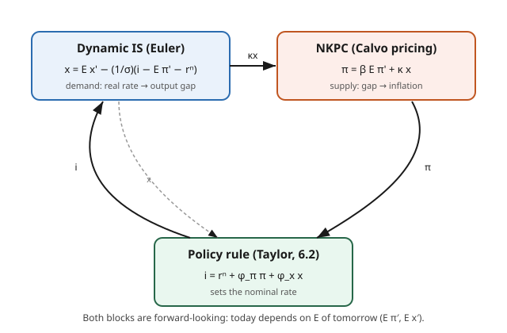

# Grad Macroeconomics · Lesson 4.5: The New Keynesian Phillips curve

> ⏱ ~15 min · Module 4: Business cycles · Builds on: [4.4 Nominal rigidities and the New Keynesian setup](04-04-nominal-rigidities-new-keynesian.md) · Unlocks: Module 5 — [5.1 The permanent-income and life-cycle hypotheses](05-01-permanent-income-life-cycle.md)

## Why this matters

The old Phillips curve was an empirical scatterplot: more inflation, less unemployment, pick your spot on the menu. Then the 1970s handed the profession stagflation — high inflation *and* high unemployment — and the menu evaporated. Lucas and Friedman had already said why: once people *expect* inflation, they price it in, and the tradeoff shifts under your feet. Any Phillips curve worth trusting has to be built from firms who form expectations and optimize.

This lesson builds exactly that curve from the Calvo pricing of [4.4](04-04-nominal-rigidities-new-keynesian.md), pairs it with a demand block derived from the household Euler equation of [1.3](01-03-euler-transversality.md)/[1.5](01-05-stochastic-dynamic-programming.md), and assembles the **three-equation New Keynesian model** that is the workhorse of modern monetary policy — the model behind every central bank's forward guidance. It is the capstone of Module 4 and the pivot into the consumption and asset-pricing theory of Module 5.

## The idea

A firm that gets to reset its price today knows it may be **stuck with that price for a while** (Calvo: each period only a fraction $1-\theta$ of firms re-optimize). So it does not set a price for today's conditions — it sets a price for the whole expected future over which the price will bind. Two things drive that choice:

1. **Where it wants its price relative to everyone else's** — its desired markup over marginal cost. Marginal cost rises when the economy runs hot, i.e. when the **output gap** $x_t$ (output minus its flexible-price "natural" level) is positive.
2. **Where prices are heading** — because the firm is stuck, it cares about *future* costs and *future* prices, i.e. **expected future inflation**.

Sum those two motives across all resetting firms and you get the punchline: **today's inflation is driven by expected future inflation plus how hot the economy runs.** That is the New Keynesian Phillips Curve. Inflation is *forward-looking* — the exact opposite of the old adaptive story where inflation was just last year's inflation plus a gap.

The demand side comes from the household. The consumption Euler equation says: consume more today only if the real interest rate is low relative to how impatient you are. Log-linearize it and you get the **dynamic IS curve** — the output gap falls when the real rate is pushed above its "natural" level. A central bank that controls the real rate therefore has genuine traction on output, and through the Phillips curve, on inflation.

## The formal version

**The New Keynesian Phillips Curve (NKPC).**

$$\boxed{\;\pi_t = \beta\, \mathbb{E}_t \pi_{t+1} + \kappa\, x_t\;}$$

- $\pi_t$ = inflation between $t-1$ and $t$; $\mathbb{E}_t$ = expectation given time-$t$ information; $x_t$ = output gap (log output minus log natural output); $\beta\in(0,1)$ = household discount factor.
- $\kappa > 0$ = slope, packaging the Calvo frequency and real marginal-cost sensitivity:
$$\kappa = \frac{(1-\theta)(1-\beta\theta)}{\theta}\,\gamma,$$
with $\theta$ = fraction of firms *not* resetting each period, and $\gamma>0$ = elasticity of a firm's real marginal cost to the output gap.

In words: inflation today equals discounted expected inflation tomorrow plus a term that is positive when the economy is overheating. Note the structure of $\kappa$ — **stickier prices (higher $\theta$) flatten the curve**: if few firms can reset, a hot economy barely moves this period's average price. Perfectly flexible prices ($\theta\to 0$) send $\kappa\to\infty$ and inflation just tracks the gap one-for-one.

**Dynamic IS (the Euler equation, log-linearized).**

$$\boxed{\;x_t = \mathbb{E}_t x_{t+1} - \tfrac{1}{\sigma}\big(i_t - \mathbb{E}_t \pi_{t+1} - r_t^n\big)\;}$$

- $i_t$ = nominal interest rate (set at $t$); $i_t - \mathbb{E}_t\pi_{t+1}$ = ex-ante **real** rate; $\sigma>0$ = inverse elasticity of intertemporal substitution (CRRA curvature); $r_t^n$ = **natural rate of interest**, the real rate that would prevail with flexible prices.

In words: the output gap today is tomorrow's expected gap, minus a demand term that bites whenever the real rate sits *above* the natural rate. Push the real rate above $r_t^n$ and demand cools; drop it below and demand heats up. We derive this in Worked Example 2.

**The policy rule** (Taylor, previewed; solved in [6.2](06-02-policy-rules-taylor-principle.md)) closes the system, e.g. $i_t = r_t^n + \phi_\pi \pi_t + \phi_x x_t$. Three equations — NKPC, dynamic IS, policy rule — in three unknowns $(\pi_t, x_t, i_t)$: the **three-equation NK model**.

## Picture

Supply (NKPC) turns the gap into inflation; demand (IS) turns the real rate into the gap; policy sets the nominal rate in response to both. Every block is forward-looking — the defining feature that separates this from the old static curve.

## Worked examples

**Example 1 — Solve the NKPC forward: inflation is a discounted sum of expected gaps.**

Start from $\pi_t = \beta\,\mathbb{E}_t\pi_{t+1} + \kappa x_t$ and substitute the same equation for $\mathbb{E}_t\pi_{t+1}$. Since $\mathbb{E}_t[\mathbb{E}_{t+1}\pi_{t+2}] = \mathbb{E}_t\pi_{t+2}$ (law of iterated expectations, [prob](../../probability-theory/syllabus.md)):

$$\pi_t = \kappa x_t + \beta\,\mathbb{E}_t\big[\kappa x_{t+1} + \beta\,\mathbb{E}_{t+1}\pi_{t+2}\big] = \kappa\big(x_t + \beta\,\mathbb{E}_t x_{t+1}\big) + \beta^2\,\mathbb{E}_t\pi_{t+2}.$$

Iterate $T$ times:

$$\pi_t = \kappa\sum_{k=0}^{T-1}\beta^k\,\mathbb{E}_t x_{t+k} + \beta^T\,\mathbb{E}_t\pi_{t+T}.$$

Impose the no-explosion (transversality) condition $\lim_{T\to\infty}\beta^T\,\mathbb{E}_t\pi_{t+T} = 0$ — inflation is not expected to blow up geometrically — and the trailing term vanishes:

$$\boxed{\;\pi_t = \kappa\sum_{k=0}^{\infty}\beta^k\,\mathbb{E}_t x_{t+k}\;}$$

**Read it:** current inflation is the *present value of expected future output gaps*. Exactly the perpetuity-style discounting of [2.3 improper integrals](../../calc-refresher/lessons/02-03-improper-integrals-and-models.md) and the forward-pricing of [mathematical finance](../../mathematical-finance/syllabus.md) — a $\beta^k$-weighted sum of a forward path. A one-period gap barely registers; a gap the market believes will *persist* moves inflation a lot. This single formula is why credibility is the whole game (Problem 2).

**Example 2 — Derive the dynamic IS curve from the consumption Euler equation.**

The representative household from [1.5](01-05-stochastic-dynamic-programming.md) maximizes $\mathbb{E}_t\sum_{s\ge0}\beta^s\frac{C_{t+s}^{1-\sigma}}{1-\sigma}$ subject to a one-period nominal bond with gross return $1+i_t$. The Euler equation (marginal utility today = discounted expected marginal utility tomorrow, valued in real terms) is

$$C_t^{-\sigma} = \beta(1+i_t)\,\mathbb{E}_t\!\left[\frac{C_{t+1}^{-\sigma}}{1+\pi_{t+1}}\right].$$

Log-linearize around a steady state with constant $C$, gross inflation $\Pi$, and (from the deterministic Euler) $1+i = \Pi/\beta$. Write lowercase for log-deviations, $c_t \equiv \log(C_t/C)$, and use $\log(1+i_t)\approx i_t$, $\log(1+\pi_{t+1})\approx \pi_{t+1}$. Taking logs and keeping first-order terms (the Jensen/variance terms are constants under log-normality):

$$-\sigma c_t = \text{const} + i_t + \mathbb{E}_t\big[-\sigma c_{t+1} - \pi_{t+1}\big].$$

Rearrange, folding the constant into $\rho \equiv -\log\beta$ (the steady-state real rate):

$$c_t = \mathbb{E}_t c_{t+1} - \tfrac{1}{\sigma}\big(i_t - \mathbb{E}_t\pi_{t+1} - \rho\big).$$

Now close the goods market. In the basic NK model there is no capital or government, so market clearing is $y_t = c_t$. Under **flexible** prices the same Euler holds at natural output $y_t^n$, which *defines* the natural rate:

$$y_t^n = \mathbb{E}_t y_{t+1}^n - \tfrac{1}{\sigma}\big(r_t^n - \rho\big) \;\Longrightarrow\; r_t^n = \rho + \sigma\,\mathbb{E}_t\Delta y_{t+1}^n.$$

Subtract the natural version from the actual one. The gap $x_t \equiv y_t - y_t^n$ obeys, with the $\rho$'s cancelling:

$$x_t = \mathbb{E}_t x_{t+1} - \tfrac{1}{\sigma}\big(i_t - \mathbb{E}_t\pi_{t+1} - r_t^n\big).$$

**Read it:** $r_t^n = \rho + \sigma\,\mathbb{E}_t\Delta y_{t+1}^n$ — the natural real rate is high when the economy expects fast natural-output growth (people want to borrow against a richer future, pushing the equilibrium real rate up). Policy's job is to track $r_t^n$; a real rate above it opens a negative gap.

## Watch out

- **The sign and object of the "gap."** $x_t$ is output *relative to its flexible-price natural level*, not relative to trend or to zero. A boom driven entirely by higher productivity raises $y_t^n$ too, so it need not open a positive gap — and need not be inflationary. Confusing "high output" with "high gap" is the classic error.
- **$\kappa$ is not the old Phillips slope.** It is a deep parameter built from price stickiness $\theta$ and discounting; more sticky prices *flatten* it. This is why estimated Phillips curves look flat in low-inflation eras — not a broken model, a high-$\theta$ regime.
- **Forward-looking only is empirically fragile.** The pure NKPC predicts inflation can jump costlessly on news (Problem 2), yet real-world inflation is *sluggish and persistent*. The standard fix is the **hybrid NKPC**, $\pi_t = \gamma_f\mathbb{E}_t\pi_{t+1} + \gamma_b\pi_{t-1} + \kappa x_t$, adding a backward-looking term (indexation, rule-of-thumb firms). Estimating $\gamma_f$ vs. $\gamma_b$ — and the expectations that enter — is a live [econometrics](../../econometrics/syllabus.md) debate.
- **Certainty equivalence is a linearization artifact.** The dynamic IS above drops second moments; that is fine for policy analysis but throws away exactly the precautionary and risk-premium effects Module 5 ([5.2](05-02-precautionary-saving.md), [5.4](05-04-consumption-based-asset-pricing.md)) is about. Different question, different tool.

## One-liner

> Inflation is the present value of expected future output gaps ($\pi_t = \kappa\sum\beta^k\mathbb{E}_t x_{t+k}$), and the gap is driven by the real rate minus its natural level — so credible expectations, not just current slack, set inflation.

## Problems

**P1 (🟢)** Take $\kappa = 0.1$ and $\beta = 0.99$. The market expects output gaps (in percent) $x_t = 3$, $x_{t+1} = 2$, $x_{t+2} = 1$, and $x_{t+k}=0$ for all $k\ge 3$. Using the forward-solved NKPC, compute today's inflation $\pi_t$.

**P2 (🟡)** Suppose at date $t$ the economy expects a string of positive future output gaps, so $\pi_t > 0$. The central bank now *credibly* announces a policy that will hold the output gap at zero at every future date: $\mathbb{E}_t x_{t+k} = 0$ for all $k \ge 0$. Using the forward-solved NKPC, find $\pi_t$. Then contrast with a purely backward-looking curve $\pi_t = \pi_{t-1} + \kappa x_t$: how large an output gap would *that* model need to bring inflation from $\pi_{t-1}$ down to $0$? Interpret the difference.

**P3 (🔴)** Add a **demand (preference) shock**: household period utility is $\xi_t\,\frac{C_t^{1-\sigma}}{1-\sigma}$, where $\xi_t$ is a positive AR(1) taste shifter (high $\xi_t$ = extra urge to consume today). Re-derive the dynamic IS equation. Show that the *gap* form $x_t = \mathbb{E}_t x_{t+1} - \frac{1}{\sigma}(i_t - \mathbb{E}_t\pi_{t+1} - r_t^n)$ is unchanged, but that $\xi_t$ enters the **natural rate** $r_t^n$. Determine the sign of $r_t^n$'s response to a positive transitory demand shock, and interpret.

Solutions

**P1.** The forward solution is $\pi_t = \kappa\sum_{k\ge0}\beta^k\,\mathbb{E}_t x_{t+k}$. Only the first three terms are nonzero:

$$\pi_t = 0.1\big(3 + 0.99\cdot 2 + 0.99^2\cdot 1\big) = 0.1\big(3 + 1.98 + 0.9801\big) = 0.1\times 5.9601 \approx 0.596\%.$$

Nearly $\kappa$ times the *sum* of the expected gaps ($=0.1\times6=0.6$), shaded down slightly by discounting. Note it exceeds $\kappa x_t = 0.3$: the anticipated *future* heat is already in today's inflation.

**P2.** Forward-solved NKPC with all expected future gaps zero:

$$\pi_t = \kappa\sum_{k\ge0}\beta^k\,\mathbb{E}_t x_{t+k} = \kappa\sum_{k\ge0}\beta^k\cdot 0 = 0.$$

Inflation collapses to $0$ *today*, with $x_t = 0$ — **no recession required.** Because inflation is entirely the discounted sum of expected future gaps, a fully credible promise to keep the economy at potential kills inflation immediately; the expectations do all the work. This is the New Keynesian "costless disinflation if credible" result.

The backward-looking curve $\pi_t = \pi_{t-1} + \kappa x_t$ has no expectations term. To hit $\pi_t = 0$ you must solve $0 = \pi_{t-1} + \kappa x_t$, i.e.

$$x_t = -\frac{\pi_{t-1}}{\kappa} < 0,$$

a deliberate **recession** whose depth is $1/\kappa$ per point of disinflation — the classic *sacrifice ratio*. With $\kappa=0.1$, cutting inflation by one point costs a $10\%$ output gap. The contrast is the whole reason expectations were put into the curve: in the forward-looking world, disinflation's cost depends entirely on credibility; in the backward-looking world it is a mechanical, unavoidable recession. (Reality sits in between — hence the hybrid curve and the empirical fact that disinflations *do* hurt, because credibility is imperfect.)

**P3.** With the preference shifter, the Euler equation becomes

$$\xi_t\,C_t^{-\sigma} = \beta(1+i_t)\,\mathbb{E}_t\!\left[\frac{\xi_{t+1}\,C_{t+1}^{-\sigma}}{1+\pi_{t+1}}\right].$$

Log-linearize as in Example 2, writing $\zeta_t \equiv \log(\xi_t/\xi)$:

$$\zeta_t - \sigma c_t = \text{const} + i_t + \mathbb{E}_t\big[\zeta_{t+1} - \sigma c_{t+1} - \pi_{t+1}\big].$$

Solve for $c_t$ (and use $y_t=c_t$):

$$y_t = \mathbb{E}_t y_{t+1} - \tfrac{1}{\sigma}\big(i_t - \mathbb{E}_t\pi_{t+1} - \rho\big) + \tfrac{1}{\sigma}\big(\zeta_t - \mathbb{E}_t\zeta_{t+1}\big).$$

The flexible-price (natural) allocation satisfies the *same* equation with $r_t^n$ in place of $i_t - \mathbb{E}_t\pi_{t+1}$ and $y_t^n$ in place of $y_t$:

$$y_t^n = \mathbb{E}_t y_{t+1}^n - \tfrac{1}{\sigma}\big(r_t^n - \rho\big) + \tfrac{1}{\sigma}\big(\zeta_t - \mathbb{E}_t\zeta_{t+1}\big),$$

which pins down

$$r_t^n = \rho + \sigma\,\mathbb{E}_t\Delta y_{t+1}^n + \big(\zeta_t - \mathbb{E}_t\zeta_{t+1}\big).$$

Subtracting the natural equation from the actual one, the $\zeta$-term is identical in both and **cancels**, leaving the gap equation untouched:

$$x_t = \mathbb{E}_t x_{t+1} - \tfrac{1}{\sigma}\big(i_t - \mathbb{E}_t\pi_{t+1} - r_t^n\big).$$

So the demand shock does not show up in the reduced-form IS in gaps — it shows up *inside* $r_t^n$. **Sign:** a positive transitory shock has $\zeta_t > 0$ and, by mean reversion, $\mathbb{E}_t\zeta_{t+1} < \zeta_t$, so $\zeta_t - \mathbb{E}_t\zeta_{t+1} > 0$ and $r_t^n$ **rises**. Interpretation: when everyone suddenly wants to consume now, the real rate that keeps output at potential must go *up* to choke off the excess demand. If policy fails to raise $i_t$ to match, the actual real rate falls below $r_t^n$, opening a positive gap and — via the NKPC — inflation. This is precisely why the model says policy must "track the natural rate": demand shocks are inflationary only to the extent the central bank lets the real rate lag $r_t^n$.

## Flashback

**From Lesson 4.4 (Calvo pricing).** Under Calvo, each period an independent fraction $1-\theta$ of firms re-optimize their price and the rest keep last period's. Take $\theta = 0.75$ (quarterly). (a) What is the expected number of quarters a newly set price stays fixed? (b) What is the probability that a price set today is still in effect three quarters later?

Solution

The number of periods a price survives is geometric: each quarter it stays fixed with probability $\theta$ and resets with probability $1-\theta$.

(a) Expected duration $= \dfrac{1}{1-\theta} = \dfrac{1}{0.25} = 4$ quarters — one full year. (This is the average price spell; it is why $\theta=0.75$ is the standard quarterly calibration.)

(b) Surviving three more quarters requires "no reset" three times: $\theta^3 = 0.75^3 = 0.4219$, about a $42\%$ chance. The expected duration in (a) and this survival curve are exactly the objects the resetting firm discounts over when it prices forward — the microfoundation of $\beta\mathbb{E}_t\pi_{t+1}$ in the NKPC.

## Connections

- **Backward:** the NKPC is Calvo pricing ([4.4](04-04-nominal-rigidities-new-keynesian.md)) aggregated — the forward-looking $\beta\mathbb{E}_t\pi_{t+1}$ term *is* the expected price-spell duration of the Flashback. The dynamic IS is the consumption Euler equation of [1.3](01-03-euler-transversality.md)/[1.5](01-05-stochastic-dynamic-programming.md), log-linearized around steady state.
- **Forward:** [6.1](06-01-monetary-fiscal-nk.md) and [6.2](06-02-policy-rules-taylor-principle.md) close and solve the three-equation model — the Taylor rule, the Taylor principle for determinacy, and optimal stabilization. Module 5 ([5.1](05-01-permanent-income-life-cycle.md), [5.4](05-04-consumption-based-asset-pricing.md)) reopens the consumption side the linearized IS flattened out.
- **Sideways (finance):** solving the NKPC forward into $\pi_t = \kappa\sum\beta^k\mathbb{E}_t x_{t+k}$ is the same present-value / forward-solving move that prices any asset as discounted expected cash flows — see [mathematical finance](../../mathematical-finance/syllabus.md). Inflation *is* an asset price on future slack.
- **Sideways (econometrics):** estimating $\kappa$, the forward vs. backward weights of the hybrid curve, and the expectations that enter is a central identification problem in [econometrics](../../econometrics/syllabus.md) — GMM on the Euler-equation moment condition, expectations proxies, weak-instrument worries.
