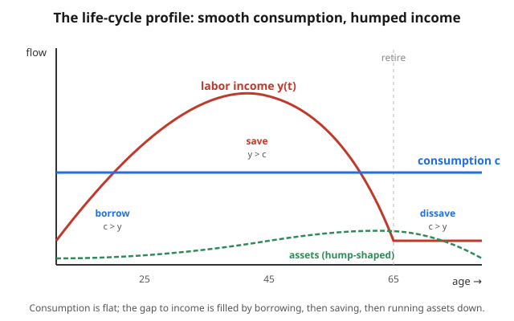

# Grad Macroeconomics · Lesson 5.1: The permanent-income and life-cycle hypotheses

> ⏱ ~15 min · Module 5: Consumption, investment, and asset pricing · Builds on: [4.5 The New Keynesian Phillips curve](04-05-nk-phillips-curve.md), [1.3 Euler & transversality](01-03-euler-transversality.md) · Unlocks: [5.2 Precautionary saving and buffer stocks](05-02-precautionary-saving.md)

## Why this matters

Consumption is roughly 60–70% of GDP, so any theory of the business cycle needs a theory of how households decide what to spend. The naive Keynesian answer — spend a fixed fraction of *this year's* income — makes a sharp, wrong prediction: that a one-time tax rebate should send consumption up as much as a permanent raise. Households don't behave that way. A grad student who wins a year's salary in a lottery does not quadruple this year's spending; they bank most of it. The micro-founded theory in this lesson explains *why*: forward-looking agents consume out of **lifetime resources**, not current cash flow, and so they **smooth**. That single idea reorganizes fiscal-multiplier debates, the response to stimulus checks, and — via the same Euler equation — the pricing of every asset (Lesson [5.4](05-04-consumption-based-asset-pricing.md)).

## The idea

Imagine your entire economic future collapsed into one number: the constant annual amount you *could* consume forever if you pooled everything you own and everything you'll earn and spread it evenly. Call that number **permanent income**. Friedman's claim is that consumption tracks *this* — not the jagged, year-to-year path of actual earnings.

The consequence is **smoothing**. If income spikes this year but the spike is temporary, permanent income barely moves (one good year, averaged over forty, is a rounding error), so consumption barely moves and you save almost the whole windfall. If instead income rises *permanently* — a promotion for life — then permanent income rises nearly one-for-one, and consumption rises with it. **The response of consumption diagnoses whether a shock is transitory or permanent.**

Modigliani's **life-cycle** version applies the same logic across a lifetime rather than across shocks. Income is hump-shaped — low when young, peaking in middle age, near zero in retirement — but you want *flat* consumption. So you borrow when young (student debt), save hard in your peak-earning middle years, and dissave in retirement, running the accumulated assets back down. Wealth is therefore hump-shaped even though consumption is flat. That's the picture below.

## The formal version

**Setup.** A household lives from $t$ with financial wealth $A_t$, earns stochastic labor income $y_{t+s}$, consumes $c_{t+s}$, faces a constant real interest rate $r$, and can borrow and lend freely at $r$. *In words: one asset, one rate, no borrowing limits — the cleanest possible world.* The lifetime (intertemporal) budget constraint, in present value, is

$$\sum_{s=0}^{\infty}\frac{c_{t+s}}{(1+r)^s} = A_t + \sum_{s=0}^{\infty}\frac{y_{t+s}}{(1+r)^s} \;\equiv\; W_t.$$

*In words: the PV of what you spend equals total resources $W_t$ = financial wealth + human wealth (the PV of future labor income).* This is the household side of the Ramsey problem from [2.3](02-03-ramsey-cass-koopmans.md), written for one agent taking $r$ as given.

**Permanent income.** Define permanent income $y^P_t$ as the *annuity value* of $W_t$ — the constant flow whose PV equals $W_t$. Since $\sum_{s\ge 0}(1+r)^{-s} = \tfrac{1+r}{r}$,

$$y^P_t = \frac{r}{1+r}\,W_t = \frac{r}{1+r}\Big[A_t + \underbrace{\textstyle\sum_{s\ge 0}(1+r)^{-s}\,\mathbb{E}_t\,y_{t+s}}_{\text{human wealth}}\Big].$$

**PIH.** The permanent-income hypothesis says the household consumes exactly this annuity:

$$\boxed{\,c_t = y^P_t = \frac{r}{1+r}\Big[A_t + \textstyle\sum_{s\ge 0}(1+r)^{-s}\,\mathbb{E}_t\,y_{t+s}\Big].\,}$$

*In words: spend the perpetuity-equivalent of your lifetime wealth, so wealth is never drawn down in expectation — you live off the "interest" on total resources.* (Consuming exactly $y^P$ keeps $W$ constant in expectation; that's precisely what a smoother wants.)

**MPCs fall out immediately.** Differentiate $c_t$ with respect to a shock to income:

- A **transitory** shock — extra $\Delta$ this period only — raises $W_t$ by $\Delta$, so it raises $c_t$ by $\dfrac{r}{1+r}\,\Delta$. With $r=4\%$ that is an MPC of about $0.04$: **almost all of a windfall is saved.**
- A **permanent** shock — income up by $\Delta$ *every* period — raises human wealth by $\sum_{s\ge0}(1+r)^{-s}\Delta = \tfrac{1+r}{r}\Delta$, so it raises $c_t$ by $\tfrac{r}{1+r}\cdot\tfrac{1+r}{r}\Delta = \Delta$: **MPC $\approx 1$.**

$$\text{MPC}_{\text{transitory}} = \frac{r}{1+r}\approx 0, \qquad \text{MPC}_{\text{permanent}} = 1.$$

**Hall's random walk (1978).** Now add the household's optimization explicitly. With per-period utility $u$, discount factor $\beta$, the consumption Euler equation (the same object as [1.3](01-03-euler-transversality.md)) is

$$u'(c_t) = \beta(1+r)\,\mathbb{E}_t\,u'(c_{t+1}).$$

Impose two of Hall's assumptions: **quadratic utility** $u(c) = -\tfrac{1}{2}(\bar c - c)^2$, so $u'(c) = \bar c - c$ is *linear*; and $\beta(1+r)=1$, so discounting exactly offsets the interest rate. Substituting,

$$\bar c - c_t = \mathbb{E}_t[\bar c - c_{t+1}] \;\Longrightarrow\; \boxed{\;\mathbb{E}_t\,c_{t+1} = c_t\;}\;\Longrightarrow\; c_{t+1} = c_t + \varepsilon_{t+1}.$$

*In words: expected next-period consumption equals current consumption — consumption is a **martingale**, so its changes are unpredictable.* Only genuine *news* (the innovation $\varepsilon_{t+1}$, a surprise to permanent income) moves consumption. Anything you already knew is, by definition, already in $c_t$.

**Certainty equivalence.** Because $u'$ is linear, the Euler equation involves only $\mathbb{E}_t c_{t+1}$ — the *variance* of future consumption never enters. The household behaves as if the future were certain at its mean: risk has no effect on the consumption level. That is a *feature of quadratic utility, not of the world*, and Lesson [5.2](05-02-precautionary-saving.md) breaks it by making $u'''>0$, which is where precautionary saving comes from.

**Testable content.** Two sharp predictions: (i) **predictable** income changes should *not* move consumption (only surprises do); empirically consumption *does* respond to predictable income — the **"excess sensitivity"** puzzle. And (ii) consumption should respond *one-for-one* to permanent-income innovations; empirically it responds *less* than the PIH predicts to persistent income shocks — the **"excess smoothness"** puzzle. These twin failures motivate everything in the rest of the module.

## Picture

The blue consumption line is flat; the red income curve humps. Where income sits below consumption (young, old) the household borrows or dissaves; where it sits above (middle age) it saves. The green dashed curve — accumulated assets — rises through the working years and is drawn back down in retirement, ending near zero. Flat consumption *forces* hump-shaped wealth.

## Worked examples

**Example 1 (three-period PIH — level, then two MPCs).**
A household lives three periods $t=0,1,2$, has financial wealth $A_0 = 100$, and expects labor income $y_0 = 60,\ y_1 = 120,\ y_2 = 30$. The interest rate is $r=0$ (clean arithmetic; the annuity factor is just "divide by the number of periods"). With $r=0$ the budget constraint is $c_0+c_1+c_2 = A_0 + y_0+y_1+y_2$ and smoothing wants $c_0=c_1=c_2=c$.

Total resources $W_0 = 100 + 60 + 120 + 30 = 310$. Permanent income (annuity over 3 periods) $= 310/3 \approx 103.3$, so

$$c_0 = c_1 = c_2 \approx 103.3.$$

Note $c_0 \approx 103.3 > y_0 = 60$: the household **borrows** $43.3$ in youth against the fat middle-period income, exactly the life-cycle motive.

*MPC out of a transitory shock:* suppose $y_0$ is revised up by $\Delta=30$ (this period only). Then $W_0$ rises by $30$, spread over 3 periods: $\Delta c_0 = 30/3 = 10$, so MPC $=1/3$. With three periods the transitory MPC is $\tfrac{1}{3}$ (the finite-horizon analog of $\tfrac{r}{1+r}$).

*MPC out of a permanent shock:* suppose income rises by $\Delta=30$ in *every* remaining period ($y_0,y_1,y_2$ each up $30$). Then $W_0$ rises by $90$, and $\Delta c_0 = 90/3 = 30$: MPC $=1$. **Same 30-dollar current-income increase, MPC of $\tfrac13$ vs $1$** — depending entirely on whether it repeats.

**Example 2 (Hall's random walk — the derivation and its meaning).**
Quadratic utility $u(c)=-\tfrac12(\bar c - c)^2$ gives marginal utility $u'(c)=\bar c - c$, a straight line. The Euler equation $u'(c_t)=\beta(1+r)\mathbb{E}_t u'(c_{t+1})$ with $\beta(1+r)=1$ becomes

$$\bar c - c_t = \mathbb{E}_t(\bar c - c_{t+1}) = \bar c - \mathbb{E}_t c_{t+1}.$$

Cancel $\bar c$: $\mathbb{E}_t c_{t+1} = c_t$. Writing the realization as its conditional mean plus a mean-zero surprise, $c_{t+1}=c_t+\varepsilon_{t+1}$ with $\mathbb{E}_t\varepsilon_{t+1}=0$ — a **random walk**.

Why does *only* a surprise move consumption? Because $c_t$ was already set to the annuity of $\mathbb{E}_t W_t$. Anything about the future the household knew at $t$ is already priced into $c_t$; the only thing that can change $c_{t+1}$ is information that arrived *between* $t$ and $t+1$ — i.e., a revision to permanent income. Predictable income growth (a raise you signed for last year) changes nothing when it arrives, because you already smoothed against it. This is the content of the excess-sensitivity test: regress $\Delta c_{t+1}$ on any period-$t$ variable; the PIH says the coefficient is zero.

## Watch out

- **"Consumption follows income."** No — consumption follows *permanent* income. The whole point is that $c$ and $y$ decouple; the correlation you see in the data is mostly the permanent component moving both.
- **The transitory MPC is $\tfrac{r}{1+r}$, not $r$.** Small, but get the algebra right: a transitory dollar adds one dollar to $W$, consumed as an annuity $\tfrac{r}{1+r}$ per period. The permanent MPC being $1$ comes from the annuity factor $\tfrac{1+r}{r}$ cancelling it — memorize the cancellation, not the number.
- **Certainty equivalence is an artifact of quadratic utility, not a law.** It needs $u'$ linear (so $u'''=0$). Real utility has $u'''>0$; then variance *does* enter and you get precautionary saving. Don't carry "risk doesn't matter" into [5.2](05-02-precautionary-saving.md).
- **Quadratic utility's ugly side.** $u'(c)=\bar c-c$ turns negative for $c>\bar c$ (satiation) and implies *increasing* absolute risk aversion. Hall's result is clean but the utility is a workhorse, not a realistic preference. Flag it and move on.
- **Random walk ≠ constant.** Consumption isn't flat over time in the stochastic model; it wanders as news arrives. "Smooth" means it doesn't respond to *predictable* movements, not that it never changes.

## One-liner

> Consume the annuity value of lifetime wealth: windfalls are saved, permanent raises are spent one-for-one, and — with quadratic utility and $\beta(1+r)=1$ — consumption becomes a random walk that only *news* can move.

## Problems

**P1 (🟢) — Permanent income and the consumption level.**
A household has financial wealth $A_0 = 50$ and expects labor income $y_0=40,\ y_1=80,\ y_2=60$ over three periods, with $r=0$. Compute total lifetime resources, permanent income, and the smoothed consumption level. In which period(s) does the household save vs. borrow?

**P2 (🟡) — Transitory vs. permanent MPC, contrasted.**
Stay in the infinite-horizon PIH with $c_t=\tfrac{r}{1+r}[A_t+\sum_{s\ge0}(1+r)^{-s}\mathbb{E}_t y_{t+s}]$ and take $r=0.05$.
(a) A household receives an *unexpected* one-time transfer of $\Delta=1{,}000$ (this period only). By how much does $c_t$ rise? What is the implied MPC?
(b) Instead the household learns its income is permanently higher by $\Delta=1{,}000$ per period, starting now. By how much does $c_t$ rise? What is the MPC?
(c) In one sentence, explain why (a) and (b) differ by the factor $\tfrac{1+r}{r}$, and what that implies for the effect of a temporary tax rebate vs. a permanent tax cut.

**P3 (🔴) — Hall's random walk and the two empirical puzzles.**
(a) Starting from the Euler equation $u'(c_t)=\beta(1+r)\mathbb{E}_t u'(c_{t+1})$, assume quadratic utility $u(c)=-\tfrac12(\bar c-c)^2$ and $\beta(1+r)=1$. Derive $\mathbb{E}_t c_{t+1}=c_t$ and hence $c_{t+1}=c_t+\varepsilon_{t+1}$ with $\mathbb{E}_t\varepsilon_{t+1}=0$.
(b) Explain precisely why this implies that a change in income that was *predictable* at time $t$ should have *zero* effect on $\Delta c_{t+1}$.
(c) Define the "excess sensitivity" and "excess smoothness" puzzles and say which PIH prediction each one violates.

Solutions

**P1.** Total resources $W_0 = A_0 + y_0+y_1+y_2 = 50 + 40+80+60 = 230$. With $r=0$ the annuity over 3 periods is $W_0/3$:

$$y^P = c_0=c_1=c_2 = 230/3 \approx 76.7.$$

Compare consumption to income each period:
- $t=0$: $c=76.7 > y_0=40$ → **borrows** $36.7$.
- $t=1$: $c=76.7 < y_1=80$ → **saves** $3.3$ (net; repays part of the debt).
- $t=2$: $c=76.7 > y_2=60$ → **dissaves** $16.7$.

Net position returns to zero: $-36.7 + 3.3 + \ldots$ — check that lifetime saving is zero, $\sum(y_s-c_s) = (40-76.7)+(80-76.7)+(60-76.7) = -36.7+3.3-16.7 = -50 = -A_0$ ✓ (the household ends by exactly spending down its initial wealth $A_0=50$). Classic hump: borrow young, save in the fat middle period, dissave at the end.

**P2.** (a) A transitory $\Delta=1{,}000$ raises $W_t$ by $1{,}000$ (one period only). Then

$$\Delta c_t = \frac{r}{1+r}\cdot 1{,}000 = \frac{0.05}{1.05}\cdot 1{,}000 \approx 47.6,\qquad \text{MPC}=\frac{r}{1+r}\approx 0.0476.$$

About 95% is saved.

(b) A permanent $\Delta=1{,}000$ per period raises human wealth by $\sum_{s\ge0}(1+r)^{-s}\cdot 1{,}000 = \tfrac{1+r}{r}\cdot 1{,}000 = 21{,}000$. Then

$$\Delta c_t = \frac{r}{1+r}\cdot \frac{1+r}{r}\cdot 1{,}000 = 1{,}000,\qquad \text{MPC}=1.$$

The entire raise is consumed.

(c) A permanent shock repeats every period, so its PV is $\tfrac{1+r}{r}$ times a single transitory shock; the annuity factor $\tfrac{r}{1+r}$ in the consumption rule exactly cancels that, leaving MPC $=1$ vs. $\tfrac{r}{1+r}$. Implication: a **temporary** tax rebate is mostly saved (weak stimulus), while a **permanent** tax cut is spent nearly one-for-one — so the *persistence* of a fiscal change, not its size, drives its effect on demand.

**P3.** (a) Quadratic utility gives $u'(c)=\bar c-c$ (linear). Plug into the Euler equation and use $\beta(1+r)=1$:

$$\bar c - c_t = \beta(1+r)\,\mathbb{E}_t(\bar c - c_{t+1}) = \mathbb{E}_t(\bar c - c_{t+1}) = \bar c - \mathbb{E}_t c_{t+1}.$$

Cancel $\bar c$: $c_t = \mathbb{E}_t c_{t+1}$, i.e. $\mathbb{E}_t c_{t+1}=c_t$. Define $\varepsilon_{t+1}\equiv c_{t+1}-\mathbb{E}_t c_{t+1}$; by construction $\mathbb{E}_t\varepsilon_{t+1}=0$, and $c_{t+1}=\mathbb{E}_t c_{t+1}+\varepsilon_{t+1}=c_t+\varepsilon_{t+1}$. Consumption is a martingale (random walk with drift zero here). Linearity of $u'$ is what makes only the *mean* $\mathbb{E}_t c_{t+1}$ appear — certainty equivalence.

(b) The martingale property says $\Delta c_{t+1}=c_{t+1}-c_t=\varepsilon_{t+1}$, which is orthogonal to the time-$t$ information set: $\mathbb{E}_t[\varepsilon_{t+1}\mid \Omega_t]=0$. Anything *predictable* at $t$ — including a scheduled income change — is in $\Omega_t$, so it was already incorporated into $c_t$ when the household smoothed. When the anticipated income actually arrives it delivers no *news*, hence no revision to permanent income, hence no change in consumption. Formally: regress $\Delta c_{t+1}$ on any $t$-dated variable $x_t$; the PIH predicts a zero coefficient.

(c) **Excess sensitivity:** empirically, consumption *does* respond to predictable/anticipated income changes (nonzero coefficient on lagged, known income growth). This violates prediction (i) — that only surprises move consumption. **Excess smoothness:** empirically, consumption responds *less than one-for-one* to persistent (near-permanent) income innovations — it is "too smooth" relative to the PIH. This violates prediction (ii) — that consumption should move roughly one-for-one with permanent-income news. (The two puzzles are two sides of the same over-restrictive benchmark; liquidity constraints, precautionary motives, and habit all help resolve them — Module 5's agenda.)

## Flashback

**From [4.5](04-05-nk-phillips-curve.md) (forward-solving a first-order expectational difference equation).** The New Keynesian Phillips curve $\pi_t = \beta\,\mathbb{E}_t\pi_{t+1} + \kappa\, x_t$ is a forward-looking equation of the same type as the human-wealth sum in this lesson. Solve it forward: assuming the no-bubble condition $\lim_{T\to\infty}\beta^T\mathbb{E}_t\pi_{t+T}=0$, express current inflation $\pi_t$ as a discounted sum of expected future output gaps.

Solution

Iterate the equation forward. Substitute $\mathbb{E}_t\pi_{t+1}=\beta\mathbb{E}_t\pi_{t+2}+\kappa\mathbb{E}_t x_{t+1}$ into $\pi_t=\beta\mathbb{E}_t\pi_{t+1}+\kappa x_t$:

$$\pi_t = \kappa x_t + \beta\kappa\,\mathbb{E}_t x_{t+1} + \beta^2\mathbb{E}_t\pi_{t+2}.$$

Continue $T$ times:

$$\pi_t = \kappa\sum_{s=0}^{T-1}\beta^s\,\mathbb{E}_t x_{t+s} + \beta^T\mathbb{E}_t\pi_{t+T}.$$

The no-bubble terminal condition kills the last term as $T\to\infty$, leaving

$$\boxed{\;\pi_t = \kappa\sum_{s=0}^{\infty}\beta^s\,\mathbb{E}_t x_{t+s}.\;}$$

*In words: today's inflation is the present value of all current and expected future output gaps — inflation is inherently forward-looking.* This is structurally identical to human wealth $\sum_{s\ge0}(1+r)^{-s}\mathbb{E}_t y_{t+s}$ in the PIH: same forward-solving move, same terminal condition, discount factor $\beta$ here vs. $\tfrac{1}{1+r}$ there.

## Connections

- **Backward:** the engine is the consumption Euler equation from [1.3](01-03-euler-transversality.md) / [1.5](01-05-stochastic-dynamic-programming.md) — Hall's random walk is *just* that Euler equation under quadratic utility and $\beta(1+r)=1$. The intertemporal budget constraint and the PIH consumption rule are the single-agent, price-taking version of the household problem inside [2.3 Ramsey–Cass–Koopmans](02-03-ramsey-cass-koopmans.md).
- **Forward:** [5.2](05-02-precautionary-saving.md) restores $u'''>0$, breaking certainty equivalence and adding a precautionary saving term (variance now matters); [5.4](05-04-consumption-based-asset-pricing.md) reads the *same* Euler equation as an asset-pricing equation — the stochastic discount factor is $\beta u'(c_{t+1})/u'(c_t)$ — leading to the equity-premium puzzle in [5.5](05-05-equity-premium-puzzle.md).
- **Sideways (finance):** martingale consumption is a cousin of the efficient-markets idea that prices are martingales under the right measure — both say "only news moves the object." See `](../../mathematical-finance/syllabus.md)`.
- **Sideways (econometrics):** the random-walk prediction is directly *testable* — regress $\Delta c_{t+1}$ on lagged information and test for zero coefficients (Hall's original test, and the orthogonality-condition / GMM machinery it launched). See `](../../econometrics/syllabus.md)`.
