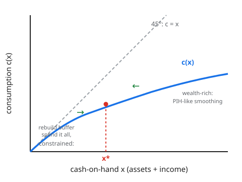

# Grad Macroeconomics · Lesson 5.2: Precautionary saving and buffer stocks

> ⏱ ~15 min · Module 5: Consumption, investment, and asset pricing · Builds on: [5.1 The permanent-income and life-cycle hypotheses](05-01-permanent-income-life-cycle.md) · Unlocks: [5.3 q-theory of investment](05-03-q-theory-investment.md)

## Why this matters

The permanent-income hypothesis (PIH) of [5.1](05-01-permanent-income-life-cycle.md) delivered a clean, almost shocking result: consumption is a random walk, and *the variance of future income doesn't appear anywhere in the consumption function*. A household facing a coin-flip income and one facing a certain income behave identically — this is **certainty equivalence**. That is manifestly false in the data. People with volatile incomes save more; the young and asset-poor hold cash they "shouldn't"; consumption tracks predictable income too closely (the [5.1](05-01-permanent-income-life-cycle.md) excess-sensitivity puzzle).

The single missing ingredient is the curvature of *marginal* utility. Once you put it back, risk itself becomes a reason to save, a target level of wealth emerges endogenously, and the clean PIH cracks in exactly the ways the data demands. This lesson is the bridge from the representative-agent smoother to the buffer-stock consumer that all of modern heterogeneous-agent macro ([6.4](06-04-heterogeneous-agent-taste.md)) is built on.

## The idea

Certainty equivalence held in [5.1](05-01-permanent-income-life-cycle.md) only because we used **quadratic utility**, whose marginal utility $u'(c) = a - bc$ is *linear*. The Euler equation cares about $\mathbb{E}_t u'(c_{t+1})$, and averaging a linear function is the same as evaluating it at the average: $\mathbb{E}[u'(c)] = u'(\mathbb{E}[c])$. Risk washes out.

But realistic marginal utility is **convex** — it bends upward. The pain of losing your last 100 dollars of consumption exceeds the pleasure of gaining 100, and this asymmetry *grows* as consumption falls toward zero. For a convex $u'$, Jensen's inequality flips the averaging: $\mathbb{E}[u'(c)] > u'(\mathbb{E}[c])$. Uncertainty *raises* expected marginal utility. Through the Euler equation, higher expected future marginal utility is a reason to shift consumption from tomorrow to... no — a reason to raise $u'(c_t)$ today by consuming *less* today. That extra saving driven purely by risk is **precautionary saving**.

Convexity of $u'$ means $u''' > 0$: the third derivative of utility must be positive. Quadratic utility has $u''' = 0$, which is *exactly* why it killed the effect. The name for a positive $u'''$ is **prudence**.

## The formal version

**Prudence.** A utility function exhibits prudence if $u''' > 0$: marginal utility is convex. **In words:** the marginal-utility curve sags, so a spread of possible future consumptions pushes *up* the average marginal utility of the future.

**Jensen through the Euler equation.** The consumption Euler equation from [1.3](01-03-euler-transversality.md) is
$$u'(c_t) = \beta(1+r)\,\mathbb{E}_t\,u'(c_{t+1}).$$
**In words:** at the optimum the marginal cost of saving one unit (utility given up today) equals its expected marginal benefit (discounted expected utility tomorrow). If $u'''>0$ then holding $\mathbb{E}_t c_{t+1}$ fixed, adding risk raises the right-hand side, so the household must raise $u'(c_t)$ — i.e. lower $c_t$ and save more.

**Kimball's prudence coefficient.** Just as Arrow–Pratt absolute risk aversion is $-u''/u'$ (curvature of $u$, governing the willingness to *pay* to avoid a gamble), the **absolute prudence** coefficient is
$$P(c) = -\frac{u'''(c)}{u''(c)},$$
**In words:** the curvature of $u'$, governing how strongly a gamble in future income *raises current saving*. Both are positive for the standard utilities; risk aversion measures the aversion to risk in *levels*, prudence measures the response of *saving* to risk.

**The precautionary premium.** For a small, mean-zero income risk $\tilde\varepsilon$ with variance $\sigma^2$ added to future resources, a second-order expansion of the Euler equation shows optimal saving rises by an amount proportional to
$$\tfrac{1}{2}\,\sigma^2 \cdot \big[-u'''(c)\big] \;\; \big/\;\; \big[-u''(c)\big] \;=\; \tfrac{1}{2}\,\sigma^2\, P(c) \times (\text{marginal utility slope}).$$
The saving response is the product of the *size of the risk* and the *prudence* of the household. No prudence, no response — certainty equivalence.

**Which utilities are prudent?**

| Utility | $u'(c)$ | $u''(c)$ | $u'''$ | Prudent? |
|---|---|---|---|---|
| Quadratic $ac-\tfrac{b}{2}c^2$ | $a-bc$ | $-b$ | $0$ | No — certainty equiv. |
| CRRA $\dfrac{c^{1-\gamma}}{1-\gamma}$ | $c^{-\gamma}$ | $-\gamma c^{-\gamma-1}$ | $\gamma(\gamma+1)c^{-\gamma-2}>0$ | Yes |
| CARA $-\tfrac{1}{\alpha}e^{-\alpha c}$ | $e^{-\alpha c}$ | $-\alpha e^{-\alpha c}$ | $\alpha^2 e^{-\alpha c}>0$ | Yes |

**Buffer-stock saving (Carroll, Deaton).** Combine three ingredients: prudence, a **borrowing constraint** (you cannot let assets go below some floor, often zero), and permanent + transitory **income risk**. The optimal policy is no longer "consume permanent income." Instead a **target** cash-on-hand ratio $x^*$ emerges: below $x^*$ prudence and the looming constraint dominate — the household saves to rebuild its buffer; above $x^*$ impatience ($\beta(1+r)<1$) dominates and it spends the buffer down. Cash-on-hand drifts back toward $x^*$, producing a stable *target wealth-to-income ratio* even though income is never smoothed away. The consumer holds a small stock of liquid assets as self-insurance, not for lifetime smoothing.

**Liquidity constraints alone.** Even with $u'''=0$, an occasionally-binding borrowing constraint makes a consumer act cautiously. When the constraint binds, the Euler equation becomes an *inequality*, $u'(c_t) \ge \beta(1+r)\mathbb{E}_t u'(c_{t+1}) + \lambda_t$, where $\lambda_t\ge0$ is the constraint's multiplier (shadow value). A positive $\lambda_t$ acts like extra impatience: it holds $c_t$ *below* what smoothing wants, so consumption tracks current income. The mere *risk of hitting* the constraint tomorrow raises $\mathbb{E}_t u'(c_{t+1})$ and induces precaution today, even for a non-prudent utility. Either channel — prudence or constraints — generates **excess sensitivity** of consumption to predictable income, the [5.1](05-01-permanent-income-life-cycle.md) puzzle.

## Picture

The blue consumption function $c(x)$ plots consumption against cash-on-hand $x$. Near the constraint (left) it hugs the 45° line — the household spends essentially everything and cannot save the buffer it wants. At high $x$ (right) it flattens toward a shallow, PIH-like slope: the wealth-rich smooth. The target $x^*$ is where these forces balance; the green arrows show cash-on-hand drifting back toward it from either side.

## Worked examples

**Example 1 (prudence via Jensen for CRRA).** Take CRRA utility $u(c)=\dfrac{c^{1-\gamma}}{1-\gamma}$, so $u'(c)=c^{-\gamma}$, a convex function of $c$ for any $\gamma>0$. Suppose next-period consumption is a fair gamble: $c_{t+1} = \bar c \pm \Delta$ each with probability $\tfrac12$, so $\mathbb{E}_t c_{t+1}=\bar c$. Then
$$\mathbb{E}_t\,u'(c_{t+1}) = \tfrac12(\bar c+\Delta)^{-\gamma} + \tfrac12(\bar c-\Delta)^{-\gamma}.$$
Because $c^{-\gamma}$ is convex, this exceeds $\bar c^{-\gamma}=u'(\mathbb{E}_t c_{t+1})$ — Jensen. Concretely with $\gamma=2$, $\bar c=1$, $\Delta=0.5$:
$$\mathbb{E}_t u'(c_{t+1}) = \tfrac12(1.5)^{-2} + \tfrac12(0.5)^{-2} = \tfrac12(0.444) + \tfrac12(4) = 2.22,$$
versus $u'(\bar c)=1^{-2}=1$. Expected marginal utility more than *doubles* under the risk. The Euler equation $c_t^{-\gamma}=\beta(1+r)\mathbb{E}_t u'(c_{t+1})$ now demands a much larger right-hand side, so $c_t$ falls and saving rises. **Sign of the effect:** positive and increasing in both $\gamma$ (curvature) and $\Delta$ (risk). Certainty equivalence would have used $u'(\bar c)=1$ and predicted no change.

**Example 2 (two-period precautionary premium).** A household lives two periods, has certain first-period income $y_1$ and risky second-period income $y_2 = \bar y_2 + \tilde\varepsilon$ with $\mathbb{E}\tilde\varepsilon=0$, $\mathrm{Var}(\tilde\varepsilon)=\sigma^2$. It saves $s$ at gross return $R=1+r$, chooses $c_1=y_1-s$, and consumes everything in period 2: $c_2 = R s + \bar y_2 + \tilde\varepsilon$. With $\beta R=1$ the Euler equation is
$$u'(y_1-s) = \mathbb{E}\,u'\!\big(Rs+\bar y_2+\tilde\varepsilon\big).$$
Expand the right side to second order around $\tilde\varepsilon=0$ (let $\bar c_2 = Rs+\bar y_2$):
$$\mathbb{E}\,u'(\bar c_2+\tilde\varepsilon) \approx u'(\bar c_2) + u''(\bar c_2)\,\mathbb{E}\tilde\varepsilon + \tfrac12 u'''(\bar c_2)\,\mathbb{E}\tilde\varepsilon^2 = u'(\bar c_2) + \tfrac12 u'''(\bar c_2)\,\sigma^2.$$
So the optimality condition becomes $u'(c_1) = u'(\bar c_2) + \tfrac12 u'''(\bar c_2)\sigma^2$. Under **prudence** ($u'''>0$) the right-hand side sits *above* the certainty benchmark $u'(c_1)=u'(\bar c_2)$, so the household must raise $s$ to restore equality: raising $s$ lowers $c_1$ (hence raises $u'(c_1)$, the left side) and raises $\bar c_2$ (hence lowers $u'(\bar c_2)$, the right side) — both movements close the gap. Differentiating the condition implicitly, $\dfrac{ds}{d\sigma^2} = \dfrac{-\tfrac12 u'''(\bar c_2)}{u''(c_1)+R\,u''(\bar c_2)-\tfrac12 R u'''\sigma^2} > 0$, since the numerator is negative (prudence) and the denominator is negative (both $u''<0$). **Saving rises with the variance of future income.** Under **quadratic** utility $u'''=0$, the premium term vanishes and $s$ is independent of $\sigma^2$ — certainty equivalence recovered exactly.

## Watch out

- **Prudence ≠ risk aversion.** Risk aversion ($-u''/u'$, curvature of $u$) is about disliking gambles in consumption *levels*; prudence ($-u'''/u''$, curvature of $u'$) is about how much a *future* gamble raises *current* saving. A quadratic-utility agent is risk-averse ($u''<0$) yet *imprudent* ($u'''=0$) — risk-averse but with zero precautionary motive. They are logically independent.
- **The precautionary premium multiplies risk by prudence.** Big risk with an imprudent utility does nothing; a prudent utility with no risk does nothing. You need both, and the effect is second-order in the risk ($\propto \sigma^2$), so it is negligible for small risks and dominant for large ones — which is why it matters most for the income-volatile poor.
- **Constraints and prudence produce the *same symptom*.** Excess sensitivity can come from prudence with risk, or from an occasionally-binding constraint, or (usually) both. Don't read excess sensitivity as evidence for one specific mechanism.
- **A binding constraint turns the Euler *equation* into an *inequality*.** Writing $u'(c_t)=\beta R\,\mathbb{E}_t u'(c_{t+1})$ when the constraint binds is simply wrong — you drop the multiplier $\lambda_t>0$ and mispredict consumption.

## One-liner

> Certainty equivalence dies the moment marginal utility bends: with $u'''>0$, risk itself raises expected future marginal utility and so raises saving today — and a borrowing constraint does the same even without prudence, giving households a target buffer instead of a smoothed lifetime path.

## Problems

**P1 (🟢)** Compute the absolute prudence coefficient $P(c)=-u'''/u''$ for (a) CRRA utility $u(c)=\frac{c^{1-\gamma}}{1-\gamma}$ and (b) CARA utility $u(c)=-\frac{1}{\alpha}e^{-\alpha c}$. Compare each to its Arrow–Pratt absolute risk aversion $A(c)=-u''/u'$.

**P2 (🟡)** In the two-period model of Example 2, take CARA utility $u(c)=-\frac{1}{\alpha}e^{-\alpha c}$ and let $\tilde\varepsilon\sim\mathcal N(0,\sigma^2)$. Solve the Euler equation *exactly* (CARA + normal gives a closed form) and show that optimal saving $s$ is strictly increasing in $\sigma^2$. Identify the exact precautionary premium.

**P3 (🔴)** Consider an infinitely-lived consumer with an occasionally-binding borrowing constraint $a_{t+1}\ge 0$ and a known, *deterministic* income path that includes a large predictable jump at date $T$ (e.g. a tuition-to-salary transition). Using the constrained Euler condition $u'(c_t) = \beta(1+r)\,u'(c_{t+1}) + \lambda_t$ with $\lambda_t\ge0$ and complementary slackness $\lambda_t a_{t+1}=0$, argue that consumption *rises* when the predictable income arrives — i.e. consumption is excessively sensitive to anticipated income — and explain the sense in which the shadow price $\lambda_t$ acts like a boost to the discount rate.

Solutions

**P1.**
(a) CRRA: $u'=c^{-\gamma}$, $u''=-\gamma c^{-\gamma-1}$, $u'''=\gamma(\gamma+1)c^{-\gamma-2}$. Then
$$P(c) = -\frac{u'''}{u''} = -\frac{\gamma(\gamma+1)c^{-\gamma-2}}{-\gamma c^{-\gamma-1}} = \frac{(\gamma+1)}{c} = \frac{\gamma+1}{c}.$$
Risk aversion is $A(c) = -\frac{u''}{u'} = \frac{\gamma c^{-\gamma-1}}{c^{-\gamma}} = \frac{\gamma}{c}$. So for CRRA, **prudence exceeds risk aversion by exactly $1/c$**: $P = A + 1/c = (\gamma+1)/c$. Both decline in $c$ — richer households are less prudent and less risk-averse in absolute terms (constant in *relative* terms: $cP=\gamma+1$, $cA=\gamma$).

(b) CARA: $u'=e^{-\alpha c}$, $u''=-\alpha e^{-\alpha c}$, $u'''=\alpha^2 e^{-\alpha c}$. Then
$$P(c) = -\frac{\alpha^2 e^{-\alpha c}}{-\alpha e^{-\alpha c}} = \alpha, \qquad A(c) = -\frac{-\alpha e^{-\alpha c}}{e^{-\alpha c}} = \alpha.$$
For CARA, **prudence equals risk aversion**, both constant at $\alpha$ (independent of $c$). This constancy is what makes CARA analytically convenient — the precautionary premium won't depend on the consumption level.

**P2.** With $u'(c)=e^{-\alpha c}$ the Euler equation $u'(c_1)=\mathbb{E}\,u'(c_2)$ (using $\beta R=1$) is
$$e^{-\alpha c_1} = \mathbb{E}\big[e^{-\alpha(Rs+\bar y_2+\tilde\varepsilon)}\big] = e^{-\alpha(Rs+\bar y_2)}\,\mathbb{E}\big[e^{-\alpha\tilde\varepsilon}\big].$$
For $\tilde\varepsilon\sim\mathcal N(0,\sigma^2)$ the moment-generating function gives $\mathbb{E}[e^{-\alpha\tilde\varepsilon}] = e^{\alpha^2\sigma^2/2}$. So
$$e^{-\alpha c_1} = e^{-\alpha(Rs+\bar y_2) + \alpha^2\sigma^2/2}.$$
Take logs and divide by $-\alpha$, with $c_1=y_1-s$ and $\bar c_2 = Rs+\bar y_2$:
$$c_1 = \bar c_2 - \frac{\alpha\sigma^2}{2} \quad\Longrightarrow\quad y_1 - s = Rs + \bar y_2 - \frac{\alpha\sigma^2}{2}.$$
Solve for saving:
$$s = \frac{y_1-\bar y_2}{1+R} + \frac{\alpha\sigma^2}{2(1+R)}.$$
The first term is the certainty-equivalent saving (split the income gap over the two periods). The second term is the **precautionary premium**: strictly positive, and
$$\frac{ds}{d\sigma^2} = \frac{\alpha}{2(1+R)} > 0.$$
Saving rises linearly in the variance $\sigma^2$, with a slope set by prudence $\alpha$. Setting $\alpha\to0$ (imprudent limit) kills it — certainty equivalence. Note the premium adds $\frac{\alpha\sigma^2}{2}$ to the *gap* between $\bar c_2$ and $c_1$: the consumer deliberately makes planned second-period consumption exceed first-period consumption to hold a buffer against the downside.

**P3.** Let the predictable income jump raise resources at date $T$. In the periods *before* $T$ the consumer would, under pure PIH, borrow against the coming income to raise consumption now (smooth). But $a_{t+1}\ge0$ forbids borrowing, so for $t<T$ the constraint binds: $a_{t+1}=0$ and $\lambda_t>0$. With $a_{t+1}=0$ and no assets carried in, the consumer can consume *only current income*, $c_t=y_t$ — pinned to income, not to permanent income. The Euler condition reads
$$u'(c_t) = \beta(1+r)\,u'(c_{t+1}) + \lambda_t, \qquad \lambda_t>0.$$
Because $\lambda_t>0$, the left side exceeds $\beta(1+r)u'(c_{t+1})$, meaning $u'(c_t)$ is *higher* — i.e. $c_t$ is *lower* — than the unconstrained smoother would choose. When the income jump finally lands at $T$, the constraint slackens ($\lambda_T=0$, $a_{T+1}>0$), and consumption jumps up with income. Thus consumption **rises when the anticipated income arrives**, tracking the predictable path — the definition of excess sensitivity, which frictionless PIH forbids.

The shadow-price interpretation: rewrite the binding condition as
$$u'(c_t) = \beta(1+r)\Big(1 + \tfrac{\lambda_t}{\beta(1+r)u'(c_{t+1})}\Big)u'(c_{t+1}) \equiv \beta(1+r)(1+\mu_t)\,u'(c_{t+1}).$$
The factor $(1+\mu_t)>1$ multiplies the effective return exactly as an *increase in impatience* would: it is as if the constrained consumer discounts the future more heavily, wanting to consume now but being unable to move resources forward across time. The tighter the constraint (larger $\lambda_t$), the larger this effective impatience, and the more consumption hugs current income. Prudence is not even needed here — the constraint alone breaks certainty equivalence and smoothing.

## Flashback

**From [5.1](05-01-permanent-income-life-cycle.md) (PIH / random-walk consumption):** Under quadratic utility with $\beta(1+r)=1$, the Euler equation gives $\mathbb{E}_t c_{t+1}=c_t$, so consumption is a martingale. Suppose a household learns at date $t$ that its permanent income is unchanged in expectation but that *next period's income has become riskier* (a mean-preserving spread, same $\mathbb{E}_t y_{t+1}$, larger variance). Does $c_t$ change? Now answer the same question if utility is CRRA instead. Explain the contrast in one sentence.

Solution

**Quadratic utility:** $c_t$ does **not** change. Marginal utility $u'(c)=a-bc$ is linear, so $\mathbb{E}_t u'(c_{t+1})=u'(\mathbb{E}_t c_{t+1})=a-b\,\mathbb{E}_t c_{t+1}$ — the spread of $c_{t+1}$ never enters. The Euler equation still gives $\mathbb{E}_t c_{t+1}=c_t$ with $c_t$ determined by expected resources only. A mean-preserving spread leaves expected resources unchanged, so consumption is unchanged: **certainty equivalence**.

**CRRA utility:** $c_t$ **falls** — the household saves more. $u'(c)=c^{-\gamma}$ is convex ($u'''=\gamma(\gamma+1)c^{-\gamma-2}>0$), so by Jensen a mean-preserving spread raises $\mathbb{E}_t u'(c_{t+1})$ above $u'(\mathbb{E}_t c_{t+1})$. The Euler equation $c_t^{-\gamma}=\beta(1+r)\mathbb{E}_t u'(c_{t+1})$ then requires a higher $c_t^{-\gamma}$, i.e. a lower $c_t$: **precautionary saving**.

**One sentence:** the answers differ only because quadratic utility has $u'''=0$ while CRRA has $u'''>0$ — prudence is the entire wedge between certainty equivalence and precautionary saving.

## Connections

- **Backward:** this relaxes the certainty equivalence of [5.1](05-01-permanent-income-life-cycle.md) by restoring $u'''>0$, which [5.1](05-01-permanent-income-life-cycle.md) had switched off via quadratic utility; the operative optimality condition is the stochastic consumption Euler equation of [1.3](01-03-euler-transversality.md), and the whole apparatus of expectations-under-uncertainty is the stochastic dynamic programming of [1.5](01-05-stochastic-dynamic-programming.md) — where certainty equivalence was first flagged as an artifact of quadratic/linear-quadratic structure.
- **Forward:** buffer-stock behavior is the microfoundation of incomplete-markets, heterogeneous-agent macro ([6.4](06-04-heterogeneous-agent-taste.md)) — Aiyagari/Bewley/Huggett economies are populations of buffer-stock savers, and their fat wealth distributions and high marginal propensities to consume come straight from the constrained, prudent policy drawn above.
- **Sideways (micro):** prudence $-u'''/u''$ is the exact dynamic analogue of Arrow–Pratt risk aversion $-u''/u'$ — see the risk-aversion and expected-utility machinery in the [grad-micro syllabus](../../grad-micro/syllabus.md).
- **Sideways (finance):** marginal utility as a pricing kernel is the through-line to asset pricing — the same convex $u'$ that drives precautionary saving here generates risk premia and prices state-contingent claims, developed in [5.4](05-04-consumption-based-asset-pricing.md) and, in continuous time, in the [mathematical-finance syllabus](../../mathematical-finance/syllabus.md).
