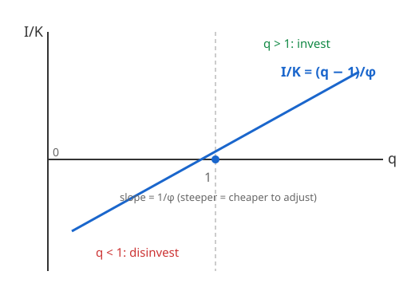

# Grad Macroeconomics · Lesson 5.3: The q-theory of investment

> ⏱ ~15 min · Module 5: Consumption, investment, and asset pricing · Builds on: [5.2 Precautionary saving and buffer stocks](05-02-precautionary-saving.md) · Unlocks: [5.4 The consumption-based asset-pricing model](05-04-consumption-based-asset-pricing.md)

## Why this matters

Consumption theory (5.1–5.2) gave us the household's smooth, forward-looking spending. Now flip to the firm: how fast should it build capital? The frictionless answer is embarrassing. If capital could be installed instantly and costlessly, the firm would jump to the point where the marginal product of capital equals its rental price — *today*, in one leap — and the flow of investment $I$ would be a knife-edge indeterminate quantity (any path that gets you there in an instant is equally good). That is not what investment looks like. Real investment is smooth, sluggish, and visibly tied to how the stock market values firms.

The fix is one idea: **it is costly to invest *fast***. Once you add a convex cost of adjusting the capital stock, the firm can no longer teleport — it must choose a *rate* of investment, weighing the marginal cost of installing another unit against the value that unit will create over its whole life. That value has a name, **$q$**, and it turns out to be exactly the object Module 1 already taught you: the derivative of the value function with respect to the state. Investment theory is Module 1 wearing a finance hat.

## The idea

Give the firm a purchase price of $1$ per unit of capital, but add a penalty for installing quickly: bolting machines in at a frantic pace disrupts production, needs overtime, breaks things. So the *total* cost of investing at rate $I$ when you hold capital $K$ is more than $I$ — it is $I$ plus an **adjustment cost** $C(I,K)$ that is convex in $I$. Convexity is the whole engine: because the marginal cost of the *next* unit of investment rises with the pace, the firm spreads investment out over time instead of doing it all at once. Investment becomes smooth and forward-looking, just like consumption.

How much to invest? Push investment until the marginal cost of one more unit installed equals what that installed unit is worth to the firm. Call that worth **marginal $q$** — the shadow value of an extra unit of *installed* capital. Then the rule is stark:

- $q > 1$: an installed unit is worth more than the $1$ it costs to buy $\Rightarrow$ **invest**.
- $q < 1$: installed capital is worth less than its replacement cost $\Rightarrow$ **disinvest** (let it depreciate, or sell).
- $q = 1$: indifferent — the resting point.

And the pace scales with the gap: $I/K$ is an increasing function of $q$, crossing zero at $q=1$. That is the entire theory in one line.

## The formal version

The firm chooses an investment path to maximize the present value of dividends (revenue minus wage bill minus investment spending minus adjustment costs), discounting at rate $r$:

$$V(K_0) = \max_{\{I_t\}} \int_0^\infty e^{-rt}\Big[\, \Pi(K_t) - I_t - C(I_t, K_t)\,\Big]\,dt \quad \text{s.t. } \dot K_t = I_t - \delta K_t .$$

Here $\Pi(K)$ is operating profit (output net of flexibly-chosen inputs like labor, already maximized out), $\delta$ is the depreciation rate, and $C(I,K)$ is the convex installation cost. *In words: pick the investment stream that makes the firm worth the most, respecting that capital only accumulates as fast as you install it net of decay.*

Attach a co-state $q_t$ to the accumulation constraint $\dot K = I - \delta K$ — this is exactly the [2.3](02-03-ramsey-cass-koopmans.md) Hamiltonian machine and the [1.4](01-04-envelope-theorem-dynamics.md) marginal-value-of-the-state object. The current-value Hamiltonian is

$$\mathcal H = \Pi(K) - I - C(I,K) + q\,(I - \delta K).$$

The two optimality conditions are where all the content lives.

**(1) FOC in the control $I$** ($\partial \mathcal H/\partial I = 0$):

$$1 + C_I(I,K) = q.$$

*In words: invest until the marginal cost of installing another unit — its purchase price $1$ plus the marginal adjustment cost $C_I$ — equals the shadow value $q$ of having it installed.* Since $C$ is convex, $C_I$ is increasing in $I$; invert to get $I$ as an increasing function of $q$. This is the investment rule, and it says $I>0 \iff q>1$.

**(2) Co-state (Euler) equation** ($\dot q = rq - \partial\mathcal H/\partial K$):

$$\dot q = (r+\delta)\,q - \big[\Pi'(K) - C_K(I,K)\big].$$

*In words: the required return $(r+\delta)q$ on holding a unit of installed capital must be delivered by its marginal profit contribution $\Pi' - C_K$ plus any capital gain $\dot q$ — an asset-pricing no-arbitrage condition for capital.* Solving it forward (imposing the transversality condition $e^{-rt}q_t K_t \to 0$, the [1.3](01-03-euler-transversality.md) rule that rules out valuing capital you never cash in) gives the punchline:

$$q_t = \int_t^\infty e^{-(r+\delta)(s-t)}\big[\Pi'(K_s) - C_K(I_s,K_s)\big]\,ds.$$

**Marginal $q$ is the present value of the future marginal products of an extra unit of capital installed today**, discounted at $r+\delta$. It is the co-state's forward solution — the shadow price of the state, exactly as in [1.4](01-04-envelope-theorem-dynamics.md).

**Marginal vs. average $q$.** Marginal $q = \partial V/\partial K$ is the value of the *next* unit — unobservable. **Tobin's average $q$** is the value of *all* the firm's capital relative to what it would cost to rebuild:

$$q^{\text{avg}} = \frac{\text{market value of the firm } V(K)}{\text{replacement cost of its capital } K} = \frac{V(K)}{K}$$

(with replacement price normalized to $1$). This is **observable** — market cap plus debt, over the book value of capital. **Hayashi's theorem:** if $\Pi$ and $C$ are homogeneous of degree one in $(K)$ and $(I,K)$ respectively — i.e. **constant returns to scale** plus **perfect competition** (price-taking firm) — then $V(K)$ is linear in $K$, so $V/K = \partial V/\partial K$: **average $q$ equals marginal $q$**. The observable ratio is then a *sufficient statistic* for investment: to predict $I/K$ you need nothing but the market's valuation.

## Picture

The investment rule is a rising line in $q$. It crosses zero at $q=1$ (buy price = installed value), with slope $1/\varphi$ set by how convex the adjustment cost is: cheaper-to-adjust firms (small $\varphi$) have a steep line and respond violently to valuation; costly-to-adjust firms have a flat one and barely move.

## Worked examples

**Example 1 (the quadratic case — deriving $I/K = (q-1)/\varphi$).** Take the workhorse adjustment cost

$$C(I,K) = \frac{\varphi}{2}\left(\frac{I}{K}\right)^2 K,$$

which is convex in $I$ and homogeneous of degree one in $(I,K)$ (the Hayashi form). The marginal adjustment cost is

$$C_I(I,K) = \frac{\partial}{\partial I}\left[\frac{\varphi}{2}\frac{I^2}{K}\right] = \varphi\,\frac{I}{K}.$$

Plug into the FOC $1 + C_I = q$:

$$1 + \varphi\,\frac{I}{K} = q \quad\Longrightarrow\quad \boxed{\ \frac{I}{K} = \frac{q-1}{\varphi}\ }.$$

Investment as a share of capital is *linear in $q$*, zero at $q=1$, with slope $1/\varphi$. Larger adjustment friction $\varphi$ flattens the response; frictionless $\varphi\to 0$ makes $I/K$ explode unless $q=1$ exactly — recovering the frictionless indeterminacy we started with. This linear rule is the equation you take to data.

**Example 2 (marginal $q$ = PV of marginal products; the Hayashi condition).** Set $C_K$ aside for the clean case ($C_K$ is second-order here) and read the co-state solution:

$$q_t = \int_t^\infty e^{-(r+\delta)(s-t)}\,\Pi'(K_s)\,ds.$$

*In words: the shadow value of a machine is the discounted stream of the extra profit it throws off over its lifetime, discounting for both impatience $r$ and physical decay $\delta$.* Check the steady state: with $K$ constant, $\Pi'$ is constant and the integral collapses to $q^* = \Pi'(K^*)/(r+\delta)$ — the perpetuity formula, the continuous-time cousin of the perpetuity in [calc-refresher 2.3](../../calc-refresher/lessons/02-03-improper-integrals-and-models.md). And $\dot q = 0$ in the co-state equation gives the same $(r+\delta)q^* = \Pi'(K^*)$, with $q^*=1$ at the long-run capital stock (so $I/K = \delta$, just replacing depreciation).

Now Hayashi. Under constant returns, Euler's homogeneity theorem gives $V(K) = V'(K)\,K$, hence

$$\underbrace{\frac{V(K)}{K}}_{\text{average } q,\ \text{observable}} = \underbrace{V'(K)}_{\text{marginal } q,\ \text{drives } I}.$$

So regressing $I/K$ on the observable $V/K$ recovers the structural rule $I/K = (q-1)/\varphi$ with slope $1/\varphi$ — no need to measure the unobservable marginal product path at all. That is the theorem's power and why it dominated empirical investment work.

## Watch out

- **It is *marginal* $q$ that drives investment, not average $q$.** They coincide *only* under Hayashi's assumptions. Break constant returns (market power, decreasing returns, a fixed factor like land or managerial talent) and $V/K > V'/K$: the firm has franchise value / rents unattached to the marginal machine, so average $q$ overstates the investment incentive. The empirical failure of $q$-theory — average $q$ predicts investment poorly, and cash flow adds explanatory power it "shouldn't" — is read as exactly this: financing frictions, market power, and measurement error in the replacement cost / market value all drive a wedge between the observable ratio and the marginal object that actually matters.
- **$q$ is a *relative* price, not a dollar amount.** It is installed value *over replacement cost*. The $q=1$ threshold is what makes it dimensionless and comparable across firms.
- **Don't forget depreciation in the discount rate.** Capital is discounted at $r+\delta$, not $r$: a machine both competes with the interest rate *and* physically wears out, so its effective discount rate is higher and its value lower.
- **The frictionless limit is the null, not a special case.** With $\varphi=0$ the rule has no interior solution off $q=1$; adjustment cost is what makes investment a well-posed, smooth, forward-looking decision at all.

## One-liner

> Invest until the marginal cost of installing capital equals its shadow value $q$ — the value function's derivative from Module 1 — so $I/K$ rises with $q$, and under constant returns the observable average $q$ is all you need.

## Problems

**P1 (🟢)** A firm has quadratic adjustment costs with $\varphi = 4$. Its Tobin's $q$ is currently $1.2$.
(a) What is its investment rate $I/K$?
(b) At what value of $q$ would the firm hold capital constant net of depreciation, if $\delta = 0.05$? (Recall $\dot K = I - \delta K$.)

**P2 (🟡)** Starting from the current-value Hamiltonian $\mathcal H = \Pi(K) - I - C(I,K) + q(I-\delta K)$, derive the co-state equation and solve it forward to show

$$q_t = \int_t^\infty e^{-(r+\delta)(s-t)}\big[\Pi'(K_s) - C_K(I_s,K_s)\big]\,ds,$$

stating the transversality condition you use. Interpret the discount rate.

**P3 (🔴)** State and explain Hayashi's theorem: why does constant returns to scale (plus perfect competition) make the *observable* average $q$ a sufficient statistic for investment, and what exactly goes wrong when the assumptions fail? Give one concrete economic mechanism that drives average and marginal $q$ apart.

Solutions

**P1.** (a) Use the derived rule $I/K = (q-1)/\varphi = (1.2 - 1)/4 = 0.2/4 = 0.05$. So the firm invests at $5\%$ of its capital stock per period.

(b) Capital is constant when $\dot K = 0 \iff I = \delta K \iff I/K = \delta = 0.05$. Set the rule equal to $\delta$: $(q-1)/\varphi = 0.05 \Rightarrow q - 1 = 4(0.05) = 0.2 \Rightarrow q = 1.2$. So at $q=1.2$ investment exactly replaces depreciation — the firm is at a $\dot K=0$ locus (not the full steady state, which would also need $\dot q = 0$, i.e. $q=1$; here $q>1$ means the firm is still growing its valuation-justified stock over time). Note P1(a)'s number was engineered to land precisely on the replacement rate.

**P2.** The current-value maximum principle gives the co-state law $\dot q = rq - \partial \mathcal H/\partial K$. Compute the derivative:

$$\frac{\partial \mathcal H}{\partial K} = \Pi'(K) - C_K(I,K) - \delta q.$$

Therefore

$$\dot q = rq - \Pi'(K) + C_K(I,K) + \delta q = (r+\delta)q - \big[\Pi'(K) - C_K(I,K)\big].$$

This is a linear first-order ODE in $q$. Rearrange as $\dot q - (r+\delta)q = -[\Pi'-C_K]$ and multiply by the integrating factor $e^{-(r+\delta)t}$:

$$\frac{d}{dt}\Big(e^{-(r+\delta)t} q_t\Big) = -e^{-(r+\delta)t}\big[\Pi'(K_t) - C_K(I_t,K_t)\big].$$

Integrate from $t$ to $\infty$:

$$\lim_{s\to\infty} e^{-(r+\delta)s}q_s - e^{-(r+\delta)t}q_t = -\int_t^\infty e^{-(r+\delta)s}\big[\Pi'(K_s)-C_K(I_s,K_s)\big]\,ds.$$

The **transversality condition** $\lim_{s\to\infty} e^{-(r+\delta)s} q_s = 0$ (equivalently $e^{-rs}q_s K_s \to 0$: you place no value on capital in the infinitely distant future you never harvest) kills the first term. Multiply through by $e^{(r+\delta)t}$:

$$q_t = \int_t^\infty e^{-(r+\delta)(s-t)}\big[\Pi'(K_s) - C_K(I_s,K_s)\big]\,ds. \qquad\blacksquare$$

*Interpretation:* marginal $q$ today is the discounted stream of the marginal profit an extra installed unit generates over its life. The discount rate is $r+\delta$, not $r$: the unit competes against the market return $r$ *and* physically depreciates at rate $\delta$, so both erode its present value. This is the forward-looking co-state / shadow price of the state from [1.4](01-04-envelope-theorem-dynamics.md), now literally an asset price.

**P3.** *Statement.* If operating profit $\Pi(K)$ is homogeneous of degree one in $K$ and the adjustment cost $C(I,K)$ is homogeneous of degree one in $(I,K)$ — the joint content of **constant returns to scale** and **perfect competition** (a price-taking firm has no rents from being large) — then the firm's value $V(K)$ is homogeneous of degree one in $K$, i.e. linear: $V(K) = v\cdot K$ for a scalar $v$.

*Why average = marginal.* By Euler's homogeneity theorem, a degree-one function satisfies $V(K) = V'(K)\,K$. Divide by $K$:

$$\underbrace{V(K)/K}_{\text{average } q} = \underbrace{V'(K)}_{\text{marginal } q}.$$

Marginal $q = V'(K)$ is what enters the investment FOC and is unobservable; average $q = V/K$ is directly measurable as (market value of equity + debt)/(replacement cost of capital). Hayashi says they are the *same number*, so the observable average $q$ is a **sufficient statistic**: given it, investment $I/K = (q-1)/\varphi$ is pinned down without measuring the marginal product path.

*Why it fails.* If the value function is not linear in $K$, then $V/K \neq V'$, and it is *marginal* $q$ (which we cannot see) that governs investment while average $q$ (which we can) mismeasures it. Concrete mechanisms:
- **Market power / decreasing returns:** a monopolist or a firm with a fixed factor (land, a brand, scarce managerial talent) earns **rents** — franchise value baked into $V$ but not attached to the marginal machine. Then $V/K > V'$: average $q$ overstates the incentive to invest. This is the leading explanation for why measured $q$ predicts investment poorly and why cash flow enters investment regressions with extra explanatory power (a signature of **financing frictions**, another wedge — external funds cost more than internal, so investment tracks internal funds beyond what $q$ alone implies). Measurement error in replacement cost and in market value adds further slippage.

## Flashback

**From [5.2 Precautionary saving](05-02-precautionary-saving.md):** A consumer has utility with **prudence** — a convex marginal utility, $u'''>0$. Consumption next period is uncertain: with equal probability it will be $c^H = \bar c + \varepsilon$ or $c^L = \bar c - \varepsilon$. Show that *expected* marginal utility $\mathbb E[u'(c)]$ exceeds the marginal utility at the mean $u'(\bar c)$, and explain in one sentence why this raises today's saving.

Solution

By definition of prudence, $u'$ is a **convex** function. Jensen's inequality applied to the convex function $u'$ gives, for the mean-preserving spread between $c^H$ and $c^L$,

$$\mathbb E[u'(c)] = \tfrac12 u'(\bar c + \varepsilon) + \tfrac12 u'(\bar c - \varepsilon) \;\ge\; u'\!\Big(\tfrac12(\bar c+\varepsilon) + \tfrac12(\bar c-\varepsilon)\Big) = u'(\bar c),$$

with strict inequality whenever $u'''>0$ and $\varepsilon\neq 0$ (the average of a convex function exceeds the function of the average). *Why it raises saving:* the consumption Euler equation sets $u'(c_t) = \beta(1+r)\,\mathbb E[u'(c_{t+1})]$; risk inflates the right-hand side, so $u'(c_t)$ must rise too, which means $c_t$ falls — the household consumes less and saves more today purely as a precaution against future consumption risk. The convexity that generates prudence here is the exact mathematical cousin of the convex *adjustment cost* driving this lesson's investment smoothing: in both, convexity turns a knife-edge into a smooth, cautious, forward-looking rule.

## Connections

- **Backward to [1.4](01-04-envelope-theorem-dynamics.md):** $q$ *is* the envelope object $V'(K)$ — the marginal value of the state. Everything here is that theorem applied to a firm; the "shadow price of capital" language is literally the co-state.
- **Backward to [2.3](02-03-ramsey-cass-koopmans.md):** the Hamiltonian, the co-state Euler equation, and the transversality condition are the same optimal-control toolkit that solved Ramsey — here the state is firm capital and the co-state is $q$ rather than the marginal utility of consumption.
- **Forward to [5.4](05-04-consumption-based-asset-pricing.md):** $q$ is a relative asset price, and its co-state equation *is* a no-arbitrage / Euler pricing condition. Next lesson prices *any* asset by the same forward-discounted-payoff logic, using the household's stochastic discount factor.
- **Business cycles ([4.1](04-01-real-business-cycle.md), [4.3](04-03-propagation-impulse-responses.md)):** adjustment costs are precisely what make investment respond sluggishly and hump-shapedly to shocks in RBC/DSGE models — remove them and investment is a spike; the convexity here is the propagation channel.
- **Sideways to [`mathematical-finance`](../../mathematical-finance/syllabus.md):** average $q = $ (asset value)/(replacement cost) is a valuation ratio, and marginal $q$ as the PV of future marginal products is present-value pricing — the same discounting machinery as bond/equity valuation.
- **Sideways to [`grad-micro`](../../grad-micro/syllabus.md):** this is the theory of firm capital dynamics — optimal investment under convex costs, the dynamic analogue of the static profit-maximizing input choice, and the foundation for industry investment and firm-size dynamics.
