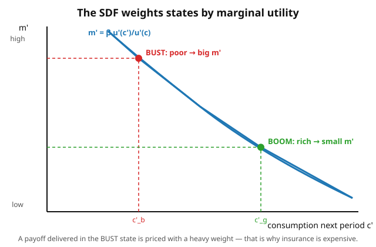

# Grad Macroeconomics · Lesson 5.4: The consumption-based asset-pricing model

> ⏱ ~15 min · Module 5: Consumption, investment, and asset pricing · Builds on: [5.3 q-theory of investment](05-03-q-theory-investment.md) · Unlocks: [5.5 The equity-premium puzzle](05-05-equity-premium-puzzle.md)

## Why this matters

Every asset a household can buy — a stock, a bond, a claim on next year's harvest — shows up in the *same* budget constraint as consumption. So the *same* Euler equation that told you how to smooth consumption across time also tells you what any asset is worth. That is the entire content of consumption-based asset pricing: **the price of an asset is its expected payoff, weighted by how much you'll crave a dollar in each future state.** A payoff that lands when you're already rich is nearly worthless to you; one that lands when you're desperate is precious. Get this one equation and you can price everything — and you'll see it is *literally the same equation* finance derives from no-arbitrage, only with the mysterious "risk-neutral weights" replaced by something you can measure: marginal utility. That identification is the door into 5.5's famous puzzle.

## The idea

You already know the consumption Euler equation from [1.3](01-03-euler-transversality.md) and [5.1](05-01-permanent-income-life-cycle.md): give up a little consumption today, invest it, get consumption back tomorrow, and at the optimum you're indifferent. An asset is just a particular way of moving a dollar from today to tomorrow — pay $p_t$ now, receive a (possibly random) payoff $x_{t+1}$ later. Indifference says the utility you sacrifice buying it must equal the expected utility its payoff brings back.

Turn the crank and one object falls out and does all the work: the **stochastic discount factor** $m_{t+1}$, the ratio of tomorrow's marginal utility to today's. It discounts *and* it re-weights by state. In a good state your consumption is high, marginal utility $u'(c_{t+1})$ is low, so $m_{t+1}$ is small — payoffs there barely move you. In a bad state $u'$ is high, $m_{t+1}$ is large, and payoffs there are worth their weight in gold. **An asset is valuable to the extent it pays off when $m$ is high — i.e. when you're poor.** Everything else in this lesson is a corollary of that sentence.

## The formal version

The household solves
$$\max_{\{c_t,\,\xi_t\}} \; \mathbb{E}_0 \sum_{t=0}^{\infty} \beta^t u(c_t), \qquad c_t + p_t\,\xi_t = w_t + x_t\,\xi_{t-1},$$
where $\xi_t$ is the quantity of the asset held out of period $t$, $p_t$ its price, $x_{t+1}$ its payoff next period, $w_t$ other income, $\beta\in(0,1)$ the discount factor, and $u$ strictly concave. In words: each period you split resources between consumption and buying claims that pay off later.

The first-order condition in $\xi_t$ — buy one more unit, lose $p_t u'(c_t)$ of utility today, gain $\beta\,\mathbb{E}_t[u'(c_{t+1})x_{t+1}]$ tomorrow — sets the two equal:
$$p_t\,u'(c_t) = \beta\,\mathbb{E}_t\big[u'(c_{t+1})\,x_{t+1}\big].$$

Divide by $u'(c_t)$ and name the ratio. This is the whole model:
$$\boxed{\;p_t = \mathbb{E}_t\big[m_{t+1}\,x_{t+1}\big], \qquad m_{t+1} = \beta\,\frac{u'(c_{t+1})}{u'(c_t)}.\;}$$

**In words:** price = expected payoff, each state weighted by the marginal-utility ratio $m$. The object $m_{t+1}$ is the **stochastic discount factor** (SDF), also called the **pricing kernel**. Three corollaries, all just special cases of the boxed equation:

**1. The risk-free rate.** A riskless bond pays $x_{t+1}=1$ for sure and returns $R_f = 1/p_t$. Plug in: $1 = \mathbb{E}_t[m_{t+1}]\,R_f$, so
$$R_f = \frac{1}{\mathbb{E}_t[m_{t+1}]}.$$
In words: the safe rate is set by how much, on average, you discount the future.

**2. Beta pricing / the risk premium.** For any asset with gross return $R_i = x_{t+1}/p_t$, the boxed equation reads $1 = \mathbb{E}_t[m_{t+1}R_i]$. Expand the expectation of a product, $\mathbb{E}[mR]=\mathbb{E}[m]\mathbb{E}[R]+\operatorname{Cov}(m,R)$, and solve:
$$\mathbb{E}_t[R_i] - R_f = -R_f\,\operatorname{Cov}_t(m_{t+1},R_i) = -\frac{\operatorname{Cov}_t(m_{t+1},R_i)}{\mathbb{E}_t[m_{t+1}]}.$$
**In words:** an asset earns a premium over safe exactly when its return covaries *negatively* with the SDF — i.e. *positively* with consumption. Assets that pay off in booms (when $m$ is low) are lousy insurance, so they must be cheap, so they must promise a high return. Assets that pay off in busts (when $m$ is high) are insurance, so investors accept a return *below* $R_f$.

**3. The log-normal / CRRA closed form.** Take $u(c)=\dfrac{c^{1-\gamma}}{1-\gamma}$ (so $u'(c)=c^{-\gamma}$, $\gamma$ = coefficient of relative risk aversion), write $\beta=e^{-\rho}$, and assume log consumption growth $\Delta\ln c_{t+1}$ is normal with mean $g_c$ and variance $\sigma_c^2$. Then $\ln m_{t+1} = -\rho - \gamma\,\Delta\ln c_{t+1}$ is normal, and using $\mathbb{E}[e^X]=e^{\mathbb{E}X+\frac12\operatorname{Var}X}$:
$$r_f = \rho + \gamma\,g_c - \tfrac{1}{2}\gamma^2\sigma_c^2, \qquad \mathbb{E}[r_i]-r_f + \tfrac12\sigma_i^2 = \gamma\,\operatorname{Cov}(\Delta\ln c,\,r_i).$$
In words: the safe rate rises with impatience and expected growth (you'd borrow against a rich future) and falls with consumption risk (precautionary demand for safety, straight from [5.2](05-02-precautionary-saving.md)); the equity premium is $\gamma$ times how strongly the asset's return moves with consumption. Hold onto that last formula — 5.5 shows the numbers don't add up.

## Concrete instance

A two-state endowment economy. Today $c_0=1$. Next period is a **boom** ($c_g=1.04$) or a **bust** ($c_b=0.96$), each with probability $\tfrac12$. Preferences are CRRA with $\gamma=3$ and $\beta=0.98$.

**Step 1 — the SDF.** $m_s = \beta\,(c_s/c_0)^{-\gamma}$:
$$m_g = 0.98\,(1.04)^{-3} = 0.871, \qquad m_b = 0.98\,(0.96)^{-3} = 1.108.$$
The bust weight is larger — a dollar delivered in the bad state is worth more.

**Step 2 — the risk-free rate.** $\mathbb{E}[m] = \tfrac12(0.871+1.108)=0.9894$, so $R_f = 1/0.9894 = 1.0107$ — about a $1.1\%$ real rate.

**Step 3 — price a procyclical asset.** "Equity" pays $x_g=1.5$ in the boom, $x_b=0.5$ in the bust (more when times are good):
$$p = \mathbb{E}[m\,x] = \tfrac12(0.871\cdot1.5 + 1.108\cdot0.5) = 0.930.$$
Its expected payoff is $\mathbb{E}[x]=1.0$, so its expected return is $\mathbb{E}[R]=1.0/0.930 = 1.075$, i.e. $7.5\%$. The premium over safe is $7.5\%-1.1\% = 6.4\%$ — positive, because this asset pays in the boom (where $m$ is small), the opposite of insurance.

## Worked examples

**Example 1 (derive the pricing equation from scratch).** Start from the Lagrangian of the household problem with multiplier $\lambda_t$ on the period-$t$ budget constraint:
$$\mathcal{L} = \mathbb{E}_0\sum_t \Big[\beta^t u(c_t) + \lambda_t\big(w_t + x_t\xi_{t-1} - c_t - p_t\xi_t\big)\Big].$$
FOC in $c_t$: $\beta^t u'(c_t) = \lambda_t$. FOC in $\xi_t$ (it appears with $-\lambda_t p_t$ this period and $+\lambda_{t+1}x_{t+1}$ next, in expectation):
$$\lambda_t p_t = \mathbb{E}_t[\lambda_{t+1}x_{t+1}].$$
Substitute $\lambda_t=\beta^t u'(c_t)$ and $\lambda_{t+1}=\beta^{t+1}u'(c_{t+1})$:
$$\beta^t u'(c_t)\,p_t = \mathbb{E}_t\big[\beta^{t+1}u'(c_{t+1})x_{t+1}\big]\;\Longrightarrow\; p_t = \mathbb{E}_t\!\left[\beta\frac{u'(c_{t+1})}{u'(c_t)}x_{t+1}\right] = \mathbb{E}_t[m_{t+1}x_{t+1}].$$
The SDF is nothing but the ratio of the budget multipliers — the shadow price of resources tomorrow relative to today. That is why *the same* $m$ prices *every* asset: they all trade against the one budget constraint.

**Example 2 (the log-normal CRRA formulas).** With $\ln m = -\rho-\gamma\,\Delta\ln c$ and $\Delta\ln c\sim N(g_c,\sigma_c^2)$:

*Risk-free rate.* $\mathbb{E}[m]=\exp\!\big(\mathbb{E}[\ln m]+\tfrac12\operatorname{Var}[\ln m]\big)=\exp\!\big(-\rho-\gamma g_c+\tfrac12\gamma^2\sigma_c^2\big)$. Since $r_f=\ln R_f=-\ln\mathbb{E}[m]$,
$$r_f = \rho + \gamma g_c - \tfrac12\gamma^2\sigma_c^2.$$
Read the terms: $\rho$ (impatient people demand a higher safe rate), $+\gamma g_c$ (growth makes you want to borrow, pushing rates up — strength $\gamma$, since high $\gamma$ means a strong taste for smoothing), $-\tfrac12\gamma^2\sigma_c^2$ (risk makes safe assets prized, pushing their rate down — the precautionary term).

*Equity premium.* Let both $\ln m$ and $r_i=\ln R_i$ be jointly normal. The pricing identity $1=\mathbb{E}[e^{\ln m + r_i}]$ gives $0=\mathbb{E}[\ln m]+\mathbb{E}[r_i]+\tfrac12\operatorname{Var}(\ln m)+\tfrac12\operatorname{Var}(r_i)+\operatorname{Cov}(\ln m,r_i)$. For the bond ($r_i=r_f$, no variance) this is $0=\mathbb{E}[\ln m]+r_f+\tfrac12\operatorname{Var}(\ln m)$. Subtract:
$$\mathbb{E}[r_i]-r_f+\tfrac12\sigma_i^2 = -\operatorname{Cov}(\ln m,r_i)=\gamma\,\operatorname{Cov}(\Delta\ln c,\,r_i).$$
The $\tfrac12\sigma_i^2$ is a Jensen correction converting the log premium to a level; the economics is all in the last term. **The premium equals risk aversion times the return's covariance with consumption growth.** Everything you need for 5.5 is here: to explain a big premium you need $\gamma$ large, or consumption very volatile, or the two very correlated — and the data offers none of them.

## Watch out

- **The SDF is not a discount rate you get to choose.** Beginners want to "discount risky assets at a higher rate." Here you discount *every* payoff — safe or risky — by the *same* random $m$; risk adjustment happens through the covariance inside $\mathbb{E}[m x]$, not by hand-picking rates. One kernel prices the whole market.
- **Sign errors in the premium.** It's $\mathbb{E}[R_i]-R_f = -\operatorname{Cov}(m,R_i)/\mathbb{E}[m]$ — note the minus. Assets that covary *positively* with $m$ (pay off in bad times, like insurance or safe bonds) earn *less* than $R_f$. The premium is a reward for making your consumption risk *worse*, not for volatility per se: idiosyncratic wiggle that's uncorrelated with $m$ earns zero premium.
- **CRRA ties two things together.** With power utility, $\gamma$ is simultaneously relative risk aversion *and* the inverse elasticity of intertemporal substitution. So the very parameter that makes the premium formula want a large $\gamma$ also makes $r_f$ shoot up through the $\gamma g_c$ term — the "risk-free rate puzzle" hiding inside the equity-premium puzzle. Epstein–Zin preferences later untie them.
- **$\mathbb{E}[m x]$, not $\mathbb{E}[m]\mathbb{E}[x]$.** The whole point is the covariance term. Splitting the expectation throws away exactly the risk correction you came for.

## One-liner

> Price = expected payoff weighted by marginal utility: $p=\mathbb{E}[m\,x]$ with $m=\beta u'(c')/u'(c)$ — assets that pay off when you're poor are precious, so those that pay off in booms must promise a premium.

## Problems

**P1 (🟢)** A two-state endowment economy: $c_0=1$, and next period $c_g=1.05$ or $c_b=0.95$ with equal probability. Preferences are CRRA with $\gamma=2$, $\beta=0.97$.
(a) Compute the SDF in each state and the risk-free gross return $R_f$.
(b) Price an asset paying $x_g=1.2$, $x_b=0.9$, and report its expected gross return.

**P2 (🟡)** Using the beta-pricing formula $\mathbb{E}[R_i]-R_f=-\operatorname{Cov}(m,R_i)/\mathbb{E}[m]$, consider two assets in a two-state world where the bust state carries the higher $m$. Asset A pays more in the boom (procyclical); asset B pays more in the bust (countercyclical). Show that A's covariance with $m$ is negative and B's is positive, and conclude the sign of each asset's risk premium. Explain in one sentence why a rational investor holds B at all despite its below-safe expected return.

**P3 (🔴)** Derive the log-normal CRRA risk-free rate $r_f=\rho+\gamma g_c-\tfrac12\gamma^2\sigma_c^2$ and the equity premium $\mathbb{E}[r_i]-r_f+\tfrac12\sigma_i^2=\gamma\operatorname{Cov}(\Delta\ln c,r_i)$ from the pricing identity $1=\mathbb{E}[e^{\ln m+r}]$. Then interpret each of the three terms in $r_f$, and state precisely what the premium formula demands of $\gamma$ if $\sigma_c\approx 1\%$ per year and $\operatorname{Cov}(\Delta\ln c,r_i)\approx 0.0002$ but the historical premium is $\approx 6\%$.

Solutions

**P1.** (a) $m_s=\beta(c_s)^{-\gamma}=0.97\,c_s^{-2}$ (since $c_0=1$).
$$m_g = 0.97/(1.05)^2 = 0.97/1.1025 = 0.87982, \qquad m_b = 0.97/(0.95)^2 = 0.97/0.9025 = 1.07479.$$
$\mathbb{E}[m]=\tfrac12(0.87982+1.07479)=0.97731$, so $R_f = 1/0.97731 = 1.02322$ — about a $2.3\%$ real rate.

(b) $p=\mathbb{E}[mx]=\tfrac12(0.87982\cdot1.2 + 1.07479\cdot0.9)=\tfrac12(1.05578+0.96731)=\tfrac12(2.02309)=1.01155$.
Expected payoff $\mathbb{E}[x]=\tfrac12(1.2+0.9)=1.05$, so $\mathbb{E}[R]=1.05/1.01155 = 1.03801$, i.e. about $3.80\%$. Premium over safe $=3.80\%-2.32\%=1.48\%>0$: the asset is procyclical (pays more in the boom, where $m$ is small), so it must offer a premium. (Check via covariance: $R_g=1.2/1.01155=1.18631$, $R_b=0.9/1.01155=0.88973$; $\mathbb{E}[mR]=\tfrac12(0.87982\cdot1.18631+1.07479\cdot0.88973)=\tfrac12(1.04374+0.95628)=1.00001\approx1$ ✓.)

**P2.** In a two-state world with probabilities $(\pi,1-\pi)$, $\operatorname{Cov}(m,R)=\pi(1-\pi)(m_b-m_g)(R_b-R_g)$ — the product of the two states' spreads times $\pi(1-\pi)>0$. Given $m_b>m_g$ (bust carries higher $m$), the sign of the covariance is the sign of $(R_b-R_g)$.

- **Asset A (procyclical):** pays more in the boom, so $R_g>R_b$, i.e. $R_b-R_g<0$, hence $\operatorname{Cov}(m,R_A)<0$. Then $\mathbb{E}[R_A]-R_f=-\operatorname{Cov}/\mathbb{E}[m]>0$: **positive premium.**
- **Asset B (countercyclical):** pays more in the bust, so $R_b>R_g$, i.e. $R_b-R_g>0$, hence $\operatorname{Cov}(m,R_B)>0$. Then $\mathbb{E}[R_B]-R_f<0$: **negative premium — it returns less than the safe asset on average.**

A rational investor still holds B because it is *insurance*: it delivers exactly when marginal utility is highest (the bust), smoothing consumption, and that hedging value is worth paying for — i.e. worth accepting a below-safe average return.

**P3.** Write $\ln m=-\rho-\gamma\,\Delta\ln c$, so $\ln m$ is normal with mean $-\rho-\gamma g_c$ and variance $\gamma^2\sigma_c^2$.

*Risk-free rate.* $R_f=1/\mathbb{E}[m]$ and $\mathbb{E}[m]=\exp(\mathbb{E}[\ln m]+\tfrac12\operatorname{Var}[\ln m])=\exp(-\rho-\gamma g_c+\tfrac12\gamma^2\sigma_c^2)$. Hence
$$r_f=\ln R_f=-\ln\mathbb{E}[m]=\rho+\gamma g_c-\tfrac12\gamma^2\sigma_c^2.$$
Terms: (i) $\rho$ — pure impatience raises the rate needed to defer consumption; (ii) $+\gamma g_c$ — expected growth makes a rich future you want to borrow against today; the pull is stronger the more you dislike a lumpy path (large $\gamma$ = strong smoothing motive), pushing the rate up; (iii) $-\tfrac12\gamma^2\sigma_c^2$ — consumption risk makes the safe asset a hedge, so precautionary demand bids its price up and its rate down.

*Equity premium.* Joint normality of $(\ln m, r)$ gives, from $1=\mathbb{E}[e^{\ln m+r}]$,
$$0=\mathbb{E}[\ln m]+\mathbb{E}[r]+\tfrac12\operatorname{Var}(\ln m)+\tfrac12\operatorname{Var}(r)+\operatorname{Cov}(\ln m,r).$$
Apply it to the bond ($r=r_f$ deterministic, so $\operatorname{Var}(r)=\operatorname{Cov}=0$): $0=\mathbb{E}[\ln m]+r_f+\tfrac12\operatorname{Var}(\ln m)$. Subtract the bond equation from the risky one:
$$0=\big(\mathbb{E}[r_i]-r_f\big)+\tfrac12\sigma_i^2+\operatorname{Cov}(\ln m,r_i)\;\Longrightarrow\;\mathbb{E}[r_i]-r_f+\tfrac12\sigma_i^2=-\operatorname{Cov}(\ln m,r_i)=\gamma\,\operatorname{Cov}(\Delta\ln c,r_i),$$
using $\operatorname{Cov}(\ln m,r_i)=\operatorname{Cov}(-\gamma\Delta\ln c,r_i)=-\gamma\operatorname{Cov}(\Delta\ln c,r_i)$.

*The demand on $\gamma$.* Setting $\gamma\cdot0.0002\approx0.06$ forces $\gamma\approx300$. That is an absurd level of risk aversion (reasonable estimates are $1$–$10$): consumption is far too smooth, and too weakly correlated with stock returns, for a plausible $\gamma$ to generate a $6\%$ premium. That contradiction is the **equity-premium puzzle** — the subject of [5.5](05-05-equity-premium-puzzle.md). (And cranking $\gamma$ up to $300$ would blow up the $\gamma g_c$ term in $r_f$, giving an insane risk-free rate — the puzzle's twin.)

## Flashback

**From [5.3](05-03-q-theory-investment.md) (q-theory of investment):** A firm chooses investment $I$ to maximize its value net of a convex adjustment cost. With capital price normalized to 1, installing $I$ units of capital costs $I + \tfrac{\phi}{2}\,\tfrac{I^2}{K}$, and marginal $q$ (the shadow value of an extra unit of installed capital) is $q$. Write the first-order condition for $I$ and solve for the optimal investment rate $I/K$ in terms of $q$ and $\phi$.

Solution

The firm's marginal cost of investing one more unit is $\dfrac{\partial}{\partial I}\big(I+\tfrac{\phi}{2}I^2/K\big)=1+\phi\,\dfrac{I}{K}$. Optimality sets marginal cost equal to marginal benefit, the value $q$ of the installed unit:
$$1+\phi\,\frac{I}{K}=q \;\Longrightarrow\; \frac{I}{K}=\frac{q-1}{\phi}.$$
In words: the firm invests until the last unit's installation cost has risen to its shadow value; the investment rate is linear in $q-1$, with slope $1/\phi$. Firms invest only when $q>1$ (capital inside the firm is worth more than its replacement cost), and steeper adjustment costs (larger $\phi$) damp the response — the same "marginal cost = marginal value" logic that, in this lesson, sets an asset's price where the marginal utility given up equals the marginal utility gained.

## Connections

- **Backward:** this *is* the [1.3](01-03-euler-transversality.md)/[1.5](01-05-stochastic-dynamic-programming.md) Euler equation, read as a pricing formula — the marginal-rate-of-substitution $m$ that governed consumption smoothing now governs every asset price. The household is the very one from [5.1](05-01-permanent-income-life-cycle.md), and the precautionary force of [5.2](05-02-precautionary-saving.md) reappears as the $-\tfrac12\gamma^2\sigma_c^2$ term that lowers the safe rate.
- **Forward:** [5.5](05-05-equity-premium-puzzle.md) plugs U.S. data into the log-normal formulas and finds the required $\gamma$ is absurd — the puzzle this lesson set up. Graduate asset pricing builds out from $p=\mathbb{E}[mx]$: Hansen–Jagannathan bounds, factor models, habit and long-run-risk fixes.
- **Sideways (direct bridge):** this is where macro and finance meet. `](../../mathematical-finance/syllabus.md)` derives the *same* equation $p=\mathbb{E}^{\mathbb{Q}}[x]/R_f$ from **no-arbitrage**, where $\mathbb{Q}$ is the risk-neutral (equivalent martingale) measure. The dictionary: the SDF *is* the Radon–Nikodym density that reweights physical probabilities into $\mathbb{Q}$, $m_{t+1}=\tfrac{1}{R_f}\tfrac{d\mathbb{Q}}{d\mathbb{P}}$. Finance gets $m$ from the *absence of free lunches*; macro gets the *same* $m$ from *marginal utility*. Same kernel, two origin stories.
- **Sideways (micro):** the whole apparatus rests on expected-utility maximization over states — the machinery of `](../../grad-micro/syllabus.md)`. Risk aversion $\gamma$ is the curvature of $u$, and the state-price weighting is exactly the Arrow–Debreu state-price / contingent-claim logic in disguise.
