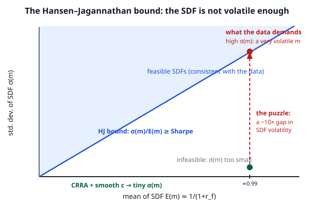

# Grad Macroeconomics · Lesson 5.5: The equity-premium puzzle

> ⏱ ~15 min · Module 5: Consumption, investment, and asset pricing · Builds on: [5.4 The consumption-based asset-pricing model](05-04-consumption-based-asset-pricing.md) · Unlocks: Module 6 — [6.1 Monetary and fiscal policy in the NK model](06-01-monetary-fiscal-nk.md)

## Why this matters

The consumption-based model of 5.4 is beautiful: *every* asset is priced off one household's Euler equation, no free parameters beyond taste $(\beta,\gamma)$. This lesson takes that clean machine to the postwar US data — and watches it break. Stocks have paid about **6 percentage points a year more than bonds** for a century, yet aggregate consumption is *smooth* (its growth wobbles by only 1–2% a year) and barely moves with the stock market. The model can only reconcile a big reward with a small risk by making the household **absurdly** afraid of risk — risk aversion in the tens to hundreds, where any sane number is 1–5. And the very knob that buys you the premium simultaneously predicts a risk-free rate of 50%+ when the real one is ~1%. This is the **equity-premium puzzle** (Mehra–Prescott, 1985) and its twin, the **risk-free-rate puzzle** (Weil, 1989): the frontier where the representative-agent model fails, and the launch pad for a generation of fixes.

## The idea

5.4 gave you the punchline in one line: the risk premium on an asset is its return's covariance with the stochastic discount factor $m$, and $m$ is high consumption marginal utility — i.e. bad times. An asset that pays off *in* bad times is insurance and can charge a negative premium; an asset that pays off in *good* times (stocks) is the opposite of insurance and must bribe you to hold it. The size of that bribe is $\gamma$ (how much you dislike consumption risk) times how tightly the asset's return tracks your consumption.

So the premium has three ingredients: risk aversion $\gamma$, how volatile your consumption is, and how correlated the asset is with it. Two of those three are *tiny* in the data — consumption barely moves, and it barely correlates with stocks. The only ingredient left to carry a 6% premium is $\gamma$, and it has to be enormous to compensate. That is the whole puzzle in one breath: **smooth consumption + big premium ⇒ implausible risk aversion.**

## The formal version

Start where 5.4 ended. A representative household with CRRA utility $u(c)=\dfrac{c^{1-\gamma}}{1-\gamma}$ (so $\gamma$ is the coefficient of relative risk aversion) prices any gross return $R_{i,t+1}$ via the Euler equation

$$1=\mathbb{E}_t\!\big[m_{t+1}R_{i,t+1}\big],\qquad m_{t+1}=\beta\Big(\tfrac{c_{t+1}}{c_t}\Big)^{-\gamma}.$$

**In words:** the SDF $m$ is discounted marginal-utility growth — it spikes when consumption falls (marginal utility high), so $m$ is a "bad-times" weight.

Now specialize to make it solvable in closed form. Assume log consumption growth $\Delta c_{t+1}\equiv\ln(c_{t+1}/c_t)$ and each log return $r_{i,t+1}\equiv\ln R_{i,t+1}$ are **jointly normal**, with $\mathbb{E}_t\Delta c=g_c$, $\operatorname{Var}_t\Delta c=\sigma_c^2$, $\operatorname{Var}_t r_i=\sigma_i^2$, and $\operatorname{Cov}_t(r_i,\Delta c)=\sigma_{ic}$. Taking logs, $\ln m_{t+1}=\ln\beta-\gamma\,\Delta c_{t+1}$. Apply $\mathbb{E}[e^X]=e^{\mathbb{E}X+\frac12\operatorname{Var}X}$ to $1=\mathbb{E}_t\!\big[e^{\ln m+r_i}\big]$:

$$0=\ln\beta-\gamma g_c+\mathbb{E}_t r_i+\tfrac12\big(\gamma^2\sigma_c^2+\sigma_i^2-2\gamma\sigma_{ic}\big).\qquad(\star)$$

Two consequences fall out of $(\star)$.

**Risk-free rate.** For the riskless asset $\sigma_i^2=\sigma_{ic}=0$ and $\mathbb{E}_t r_i=r_f$ is known:

$$\boxed{\,r_f=-\ln\beta+\gamma g_c-\tfrac12\gamma^2\sigma_c^2\,}$$

**In words:** the safe rate rises with impatience ($-\ln\beta=\rho$), rises with $\gamma g_c$ (impatient-to-consume-later: if you expect to be richer you'd borrow, pushing rates up), and falls with a **precautionary** term $-\tfrac12\gamma^2\sigma_c^2$ (fear of the future makes you save, pushing rates down — the same prudence from [5.2](05-02-precautionary-saving.md)).

**Equity premium.** Subtract the risk-free equation from $(\star)$ for a risky asset $e$ (equity):

$$\boxed{\,\underbrace{\mathbb{E}_t r_e-r_f+\tfrac12\sigma_e^2}_{\text{equity premium}}=\gamma\,\sigma_{ec}=\gamma\,\rho_{ec}\,\sigma_e\,\sigma_c\,}$$

The $\tfrac12\sigma_e^2$ is a Jensen correction turning the *log* premium into the *level* premium $\mathbb{E}[R_e]-R_f$; ignore it if it bothers you. **In words:** the premium is exactly risk aversion $\times$ how much the stock's return co-moves with consumption growth, and $\sigma_{ec}=\rho_{ec}\sigma_e\sigma_c$ with $\rho_{ec}$ the correlation. This is the formula the data will now destroy.

## Concrete instance — Boss Problem 5

**Plug in postwar US annual moments.** Take equity premium $\approx 0.06$, stock-return volatility $\sigma_e\approx 0.16$, consumption-growth volatility $\sigma_c\approx 0.015$, correlation $\rho_{ec}\approx 0.20$. Solve the boxed premium formula for the risk aversion the data demands:

$$\gamma=\frac{\text{premium}}{\rho_{ec}\,\sigma_e\,\sigma_c}=\frac{0.06}{0.20\times 0.16\times 0.015}=\frac{0.06}{0.00048}\approx 125.$$

Risk aversion of **125**. Even the most generous possible assumption — pretend stocks are *perfectly* correlated with consumption, $\rho_{ec}=1$ — only softens it to $\gamma=0.06/(0.16\times0.015)\approx 25$. Both are off the map: introspection and micro evidence put $\gamma$ around 1–5. A person with $\gamma=25$ would pay to avoid a coin flip over a modest lunch. **That is the equity-premium puzzle**: the smooth, weakly-correlated consumption series simply has too little risk in it to justify a 6% reward at any believable $\gamma$.

Now the twin bind. Feed even the *smaller* number, $\gamma\approx 25$, into the risk-free formula with $\beta=0.99$ ($\rho\approx0.01$), $g_c\approx0.02$, $\sigma_c=0.015$:

$$r_f=0.01+25(0.02)-\tfrac12(25)^2(0.015)^2=0.01+0.50-0.070\approx 0.44.$$

The model predicts a **44% real risk-free rate**; the data says ~1%. The $\gamma g_c$ term explodes because a very risk-averse agent who *knows* consumption grows 2% a year is desperate to borrow against that growth, driving the safe rate through the roof. **One parameter cannot fix both puzzles**: raising $\gamma$ to earn the premium wrecks the risk-free rate. (See the [Boss Problem worked example](#worked-examples) below for the full derivation from scratch.)

## Picture

The Hansen–Jagannathan bound restates the puzzle geometrically. For *any* asset, $\dfrac{\sigma(m)}{\mathbb{E}(m)}\ge$ its Sharpe ratio — the data's high Sharpe ratio (~0.4) demands a **volatile** SDF, but smooth consumption with moderate $\gamma$ delivers a nearly *constant* $m$. The model's dot sits far below the frontier it must reach.

## Worked examples

**Example 1 — Boss Problem 5: the puzzle, start to finish.**

*(1) Euler + SDF.* The household maximizes $\mathbb{E}_0\sum_t\beta^t\frac{c_t^{1-\gamma}}{1-\gamma}$ subject to a budget that lets it buy one unit of asset $i$ today (cost $u'(c_t)$ in utils) for a payoff $R_{i,t+1}$ tomorrow. The first-order condition equates marginal cost and expected marginal benefit:

$$u'(c_t)=\beta\,\mathbb{E}_t\!\big[u'(c_{t+1})R_{i,t+1}\big]\;\Longrightarrow\;1=\mathbb{E}_t\!\Big[\underbrace{\beta\big(\tfrac{c_{t+1}}{c_t}\big)^{-\gamma}}_{m_{t+1}}R_{i,t+1}\Big].$$

*(2) Lognormal closed form.* With $\Delta c,r_i$ jointly normal, $\ln m=\ln\beta-\gamma\Delta c$, and $1=\mathbb{E}_t e^{\ln m+r_i}$ gives equation $(\star)$. Setting risk to zero yields $r_f=-\ln\beta+\gamma g_c-\tfrac12\gamma^2\sigma_c^2$; differencing $(\star)$ against $r_f$ yields the premium $=\gamma\rho_{ec}\sigma_e\sigma_c$.

*(3) Numbers.* With premium $=0.06$, $\rho_{ec}=0.20$, $\sigma_e=0.16$, $\sigma_c=0.015$: $\gamma\approx 125$ (or $\approx 25$ granting $\rho_{ec}=1$). Plausible $\gamma$ is 1–5, so a $\gamma$ of 25–125 is the puzzle. **The clean model needs a fear of risk no human exhibits.**

**Example 2 — the risk-free-rate puzzle (the twin).** Suppose we swallow $\gamma=25$ to earn the premium. Does anything else break? Yes: the safe rate. Holding $\beta=0.99,\;g_c=0.02,\;\sigma_c=0.015$,

$$r_f=\underbrace{0.01}_{\rho}+\underbrace{25(0.02)}_{\gamma g_c=0.50}-\underbrace{\tfrac12(625)(0.000225)}_{\text{precaution}=0.070}=0.44.$$

A 44% real risk-free rate versus ~1% in the data. The growth term $\gamma g_c$ is the culprit: it scales *linearly* in $\gamma$, so the same big $\gamma$ that buys a 6% premium buys a 40%+ safe rate. You could try to rescue $r_f$ by setting $\beta>1$ (a *negative* rate of time preference — patience so extreme it's uncomfortable to defend), but the growth term still dominates. The two puzzles are one organism: **the CRRA model has a single dial, and no setting satisfies both facts.**

## Watch out

- **The premium formula is a covariance, not a variance.** What earns the reward is co-movement of the stock with *consumption*, not the stock's own volatility. Stocks are volatile ($\sigma_e\approx16\%$) but that alone prices nothing — an asset uncorrelated with consumption ($\rho_{ec}=0$) earns *zero* premium no matter how wild it is. The puzzle is precisely that stocks correlate so *weakly* with consumption yet pay so much.
- **Don't conflate $\gamma$'s two jobs.** Under CRRA, one parameter is *both* relative risk aversion (across states) *and* the reciprocal of the elasticity of intertemporal substitution (across time). That forced marriage is *why* fixing the premium breaks $r_f$ — and why Epstein–Zin preferences, which divorce the two, dissolve the risk-free-rate puzzle.
- **The precautionary term can flip $r_f$ negative at extreme $\gamma$.** Since it scales as $\gamma^2$, at $\gamma\approx 200$ it overtakes $\gamma g_c$ and predicts a *negative* safe rate. Either way the prediction is wildly counterfactual — the point is instability, not a particular sign.
- **A high measured $\gamma$ is a symptom, not a preference.** Nobody thinks households literally have $\gamma=100$. The verdict is that the *representative-agent, complete-markets, CRRA* frame is wrong somewhere — smooth aggregate consumption is the wrong risk measure.

## Resolutions (a taste)

None of these is developed here; each is a research program that keeps the Euler logic but changes one ingredient so that a *moderate* $\gamma$ generates a *volatile enough* SDF:

- **Habit formation** (Campbell–Cochrane): utility depends on consumption *relative to a slow-moving habit*, so effective risk aversion spikes in bad times — the SDF becomes volatile without huge $\gamma$.
- **Long-run risk** (Bansal–Yaron): a small persistent component in consumption growth plus Epstein–Zin preferences makes investors fear news about the distant future.
- **Rare disasters** (Rietz–Barro): a small chance of a consumption catastrophe (depression, war) that is under-represented in tranquil postwar samples fattens the SDF's tail.
- **Epstein–Zin recursive preferences:** separate risk aversion from the elasticity of intertemporal substitution, curing the risk-free-rate puzzle directly.
- **Heterogeneous agents / incomplete markets** ([6.4](06-04-heterogeneous-agent-taste.md)): *individual* consumption is far riskier than the smooth aggregate, and uninsurable idiosyncratic risk raises the effective price of equity.

## One-liner

> A 6% equity premium off 1–2% consumption volatility forces risk aversion in the tens-to-hundreds — and that same dial then predicts a 40%+ risk-free rate; the representative-agent SDF just isn't volatile enough.

## Problems

**P1 (🟢)** Using the level premium formula $\text{premium}=\gamma\,\rho_{ec}\,\sigma_e\,\sigma_c$, back out the implied coefficient of relative risk aversion from: equity premium $=0.06$, $\sigma_e=0.15$, $\sigma_c=0.015$, $\rho_{ec}=0.20$. Is it plausible? What does it become if you generously assume $\rho_{ec}=1$?

**P2 (🟡)** Take the $\gamma$ you'd need from the *generous* $\rho_{ec}=1$ case of P1 (round to $\gamma=100$ to keep it simple) and compute the model's real risk-free rate from $r_f=-\ln\beta+\gamma g_c-\tfrac12\gamma^2\sigma_c^2$, using $\beta=0.99$, $g_c=0.02$, $\sigma_c=0.015$. Compare to the ~1% in the data and name the puzzle.

**P3 (🔴)** State the Hansen–Jagannathan bound and prove its one-line derivation from $1=\mathbb{E}[mR]$. Then show that CRRA utility with smooth consumption and *moderate* risk aversion violates it: for lognormal $m$, $\sigma(m)/\mathbb{E}(m)\approx\gamma\sigma_c$; with $\sigma_c=0.015$ and an observed Sharpe ratio of $0.40$, what is the smallest $\gamma$ consistent with the bound, and why does $\gamma=5$ fail?

Solutions

**P1.** Solve for $\gamma$:

$$\gamma=\frac{0.06}{0.20\times 0.15\times 0.015}=\frac{0.06}{0.00045}\approx 133.$$

Implausible — micro evidence and introspection put $\gamma$ at 1–5, and $133$ describes someone who fears almost any bet. Granting the most charitable correlation $\rho_{ec}=1$:

$$\gamma=\frac{0.06}{0.15\times 0.015}=\frac{0.06}{0.00225}\approx 27.$$

Still an order of magnitude too high. Both numbers *are* the puzzle: no defensible $\gamma$ reconciles a 6% premium with such smooth, weakly-correlated consumption.

**P2.** With $\gamma=100$, $-\ln\beta=-\ln(0.99)\approx 0.01005$:

$$r_f=0.01005+100(0.02)-\tfrac12(100)^2(0.015)^2=0.01005+2.00-1.125\approx 0.885.$$

The model predicts an **88.5% real risk-free rate**, versus roughly **1%** observed — the **risk-free-rate puzzle** (Weil). The linear growth term $\gamma g_c=2.0$ (a very risk-averse agent who knows consumption grows 2%/yr is frantic to borrow) dwarfs everything. The same $\gamma$ that was needed to explain the premium blows up the safe rate: the two puzzles are inseparable under CRRA.

**P3.** *The bound.* For any excess return $R^e$ (a risky return minus the risk-free rate), the Euler equation gives $0=\mathbb{E}[mR^e]=\mathbb{E}[m]\mathbb{E}[R^e]+\operatorname{Cov}(m,R^e)$. Hence

$$\mathbb{E}[R^e]=-\frac{\operatorname{Cov}(m,R^e)}{\mathbb{E}[m]}=-\frac{\rho_{m,e}\,\sigma(m)\,\sigma(R^e)}{\mathbb{E}[m]}.$$

Divide by $\sigma(R^e)$ and use $|\rho_{m,e}|\le 1$:

$$\underbrace{\frac{\big|\mathbb{E}[R^e]\big|}{\sigma(R^e)}}_{\text{Sharpe ratio}}=|\rho_{m,e}|\,\frac{\sigma(m)}{\mathbb{E}[m]}\le\frac{\sigma(m)}{\mathbb{E}[m]}.$$

That is the **Hansen–Jagannathan bound**: the SDF's coefficient of variation must be at least the highest Sharpe ratio in the market. **In words:** to price a high-reward-per-unit-risk asset you need a *volatile* discount factor.

*The violation.* For lognormal $m=\beta(c_{t+1}/c_t)^{-\gamma}$, $\ln m=\ln\beta-\gamma\Delta c$ has standard deviation $\gamma\sigma_c$, and for small volatility $\sigma(m)/\mathbb{E}(m)=\sqrt{e^{\gamma^2\sigma_c^2}-1}\approx\gamma\sigma_c$. The bound then reads

$$\gamma\sigma_c\ge \text{Sharpe}=0.40\;\Longrightarrow\;\gamma\ge\frac{0.40}{0.015}\approx 27.$$

With moderate $\gamma=5$: $\sigma(m)/\mathbb{E}(m)\approx 5\times0.015=0.075$, far below the required $0.40$ — the model's SDF is only a fifth as volatile as the data demand. Smooth consumption makes $m$ nearly constant, so a moderate $\gamma$ cannot clear the bound; you're forced back to $\gamma\approx 27$ or higher. Same puzzle, stated as SDF volatility.

## Flashback

**From [1.3 (Euler equation and transversality)](01-03-euler-transversality.md):** A household with CRRA utility $u(c)=\frac{c^{1-\gamma}}{1-\gamma}$ and discount factor $\beta$ can save in a riskless bond with gross return $R$. Consumption is *deterministic* and grows at constant gross rate $G=c_{t+1}/c_t$. Derive the Euler equation, solve for the $R$ the household's optimization implies, and interpret it as the deterministic limit of this lesson's risk-free formula.

Solution

The bond Euler equation is $u'(c_t)=\beta R\,u'(c_{t+1})$, i.e. $c_t^{-\gamma}=\beta R\,c_{t+1}^{-\gamma}$. Rearrange:

$$1=\beta R\Big(\tfrac{c_{t+1}}{c_t}\Big)^{-\gamma}=\beta R\,G^{-\gamma}\;\Longrightarrow\;R=\frac{G^{\gamma}}{\beta}.$$

Taking logs with $r=\ln R$, $\rho=-\ln\beta$, $g=\ln G$: $r=\rho+\gamma g$. **In words:** the safe rate is impatience plus $\gamma$ times consumption growth — patient, growth-hungry agents accept a higher rate. This is exactly the risk-free formula $r_f=-\ln\beta+\gamma g_c-\tfrac12\gamma^2\sigma_c^2$ with the risk term $\sigma_c^2$ switched off. It also isolates the villain of the risk-free-rate puzzle: even with *no* uncertainty, cranking $\gamma$ to explain the premium sends $r=\rho+\gamma g_c$ sky-high.

## Connections

- **Backward:** this lesson stress-tests the [5.4](05-04-consumption-based-asset-pricing.md) machine — same Euler equation, same SDF, now confronted with data. The precautionary term $-\tfrac12\gamma^2\sigma_c^2$ in $r_f$ is the prudence of [5.2](05-02-precautionary-saving.md) reappearing as an asset-pricing force, and the deterministic skeleton is the [1.3](01-03-euler-transversality.md) Euler equation.
- **Forward:** [6.4](06-04-heterogeneous-agent-taste.md) offers one resolution — replace the smooth *aggregate* with much riskier *individual* consumption under incomplete markets. The broader menu (habits, long-run risk, disasters, Epstein–Zin) is the modern asset-pricing research program.
- **Sideways (finance):** the equity premium, Sharpe ratios, and SDF volatility are the shared currency with [`mathematical-finance`](../../mathematical-finance/syllabus.md), which reaches the same SDF through no-arbitrage rather than the household Euler equation — the Hansen–Jagannathan bound is exactly where the two routes meet.
- **Sideways (econometrics):** every number here — the 6% premium, $\sigma_c$, $\rho_{ec}$, the Sharpe ratio — is a *sample moment* with standard errors, and whether the puzzle is real hinges on estimating and testing them. [`econometrics`](../../econometrics/syllabus.md) supplies the GMM machinery (Hansen's own tool) for estimating the Euler equation directly.
