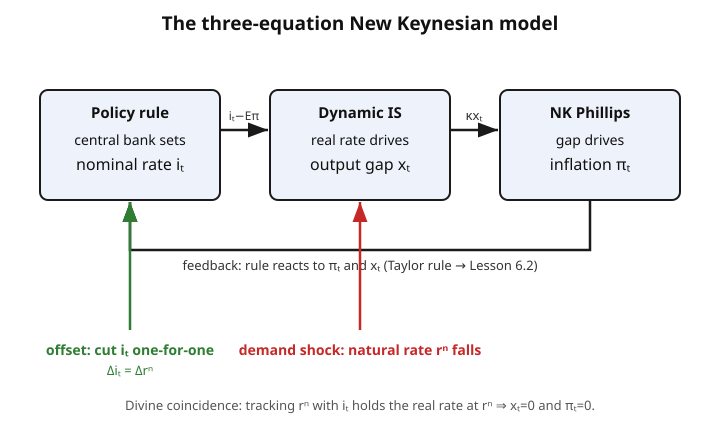

# Grad Macroeconomics · Lesson 6.1: Monetary and fiscal policy in the NK model

> ⏱ ~15 min · Module 6: Frictions, policy, and unemployment · Builds on: [5.5 The equity-premium puzzle](05-05-equity-premium-puzzle.md), [4.4 Nominal rigidities](04-04-nominal-rigidities-new-keynesian.md), [4.5 The NK Phillips curve](04-05-nk-phillips-curve.md) · Unlocks: [6.2 Policy rules and the Taylor principle](06-02-policy-rules-taylor-principle.md)

## Why this matters

In the RBC world of Module 4, recessions are efficient responses to technology — the planner would *choose* the same path, and stabilization policy can only make things worse. That is a bracing conclusion, and it is wrong about the world we live in. Once prices are sticky (4.4), demand shocks push output away from where a frictionless economy would sit, that gap is a genuine welfare loss, and a central bank that moves the interest rate can undo it. This lesson assembles the two building blocks you already have — the consumption Euler equation turned into an **IS curve**, and the **NK Phillips curve** — bolts a policy rule onto them, and shows the payoff: **demand matters, and stabilization policy has a real job.** That is the entire intellectual break between RBC and New Keynesian macro, and it is why the Fed exists.

## The idea

Sticky prices are the whole hinge. If the central bank raises the *nominal* rate $i_t$ but goods prices barely move over the horizon that matters, then the **real** rate $i_t - \mathbb{E}_t\pi_{t+1}$ rises too. A higher real rate makes saving more attractive than spending today, so households pull demand forward less — current output falls relative to its frictionless "natural" level. That shortfall is the **output gap** $x_t$. And when firms are producing below capacity, marginal costs are slack, so inflation cools. So the chain is:

$$\text{nominal rate } i_t \;\longrightarrow\; \text{real rate} \;\longrightarrow\; \text{output gap } x_t \;\longrightarrow\; \text{inflation } \pi_t.$$

Every link needs sticky prices. In the RBC model the middle two arrows are severed — money is neutral, the real rate is pinned by technology and thrift, and $i_t$ just sets inflation with no real bite. Stickiness is what lets the bank reach through nominal instruments to real quantities.

The punchline splits by shock type. A **demand shock** (something that shifts how much households want to spend at a given real rate) can be *perfectly* neutralized: move $i_t$ to hold the real rate exactly where the frictionless economy would put it, and both the gap and inflation stay at zero. That happy alignment is the **divine coincidence** — stabilize one, you stabilize the other. A **cost-push / supply shock** breaks it: it moves inflation for a given gap, so you cannot zero out both at once, and policy must *trade off* inflation against output.

## The formal version

The model is three equations in $(x_t, \pi_t, i_t)$.

**(i) Dynamic IS curve.**

$$x_t = \mathbb{E}_t x_{t+1} - \frac{1}{\sigma}\big(i_t - \mathbb{E}_t\pi_{t+1} - r^n_t\big).$$

*In words:* today's output gap equals the expected future gap minus the gap-cost of a real rate above the natural rate. Here $x_t$ is the output gap (log output minus its flexible-price level), $\sigma>0$ is the coefficient of relative risk aversion / inverse intertemporal elasticity, $i_t$ the one-period nominal rate, $\mathbb{E}_t\pi_{t+1}$ expected inflation, and $r^n_t$ the **natural rate of interest** — the real rate that would prevail with flexible prices. This is nothing but the household Euler equation (1.3/1.5) log-linearized and written in gaps: when the real rate $i_t-\mathbb{E}_t\pi_{t+1}$ exceeds $r^n_t$, households defer spending and $x_t$ drops. Demand shocks enter entirely through $r^n_t$.

**(ii) NK Phillips curve** (from 4.5).

$$\pi_t = \beta\,\mathbb{E}_t\pi_{t+1} + \kappa\,x_t.$$

*In words:* inflation today is discounted expected future inflation plus a slope $\kappa>0$ times the output gap. Firms resetting prices under Calvo frictions raise them when demand runs hot ($x_t>0$); $\beta\in(0,1)$ is the discount factor and $\kappa$ shrinks as prices get stickier.

**(iii) A monetary policy rule** for $i_t$ — a Taylor rule that reacts to inflation and the gap, e.g. $i_t = r^n_t + \phi_\pi \pi_t + \phi_x x_t$. The design of this rule (and the determinacy condition $\phi_\pi>1$) is the subject of [6.2](06-02-policy-rules-taylor-principle.md); here we mostly ask what the bank *should* want $i_t$ to do.

**Cost-push shocks.** To model supply disturbances, add a term $u_t$ to the Phillips curve:

$$\pi_t = \beta\,\mathbb{E}_t\pi_{t+1} + \kappa\,x_t + u_t.$$

*In words:* $u_t$ (an oil-price jump, a markup shock) raises inflation even at a zero gap — the wedge that destroys the divine coincidence.

**Fiscal policy.** Government spending $g_t$ adds to demand. In the IS block it acts like a positive shift in desired spending; its effect on output — the **fiscal multiplier** $dY/dg$ — depends on how monetary policy responds. If the bank offsets the demand by raising $i_t$, the multiplier is small (crowding out through the real rate). If monetary policy is *passive* — holding $i_t$ fixed, especially at the **zero lower bound (ZLB)** where $i_t$ cannot fall below $\approx 0$ — the multiplier is large, and can exceed one.

## Picture

## Worked examples

**Example 1 (the divine coincidence for a demand shock).** Suppose a demand shock drops the natural rate: $r^n_t$ falls by $\Delta$ (households suddenly want to save more — a "risk-off" wave). Nothing else is disturbed, so $u_t=0$. Claim: the bank can hold $x_t=0$ and $\pi_t=0$ in every period.

Conjecture the target allocation $x_t=0,\ \pi_t=0$ for all $t$, and check the three equations are satisfiable. The Phillips curve $0 = \beta\cdot 0 + \kappa\cdot 0$ holds. ✓ The IS curve becomes

$$0 = 0 - \frac{1}{\sigma}\big(i_t - 0 - r^n_t\big) \quad\Longrightarrow\quad i_t = r^n_t.$$

So set the nominal rate equal to the (fallen) natural rate: **cut $i_t$ by exactly $\Delta$.** Doing so holds the real rate at $r^n_t$, keeps the gap at zero, and — because a zero gap means no cost pressure — keeps inflation at zero too. One instrument, both targets hit. The lesson: for pure demand shocks there is *no tradeoff* — the interest rate is a perfect antidote, and stabilizing the gap automatically stabilizes inflation. This is exactly what the green "offset" arrow in the figure does to the red demand shock.

**Example 2 (a cost-push shock breaks it).** Now hit the Phillips curve with a one-time cost-push shock $u_t=u>0$ (say an energy-price spike), with the natural rate undisturbed. Can the bank still zero out both? The Phillips curve at a zero gap gives

$$\pi_t = \beta\,\mathbb{E}_t\pi_{t+1} + \kappa\cdot 0 + u = \underbrace{\beta\mathbb{E}_t\pi_{t+1}}_{\ge 0} + u > 0.$$

To force $\pi_t=0$ the bank would need $\kappa x_t = -u$, i.e. deliberately open a **negative** gap $x_t = -u/\kappa$ — engineer a recession — to press inflation back down. Conversely, holding $x_t=0$ leaves inflation at $u>0$. It cannot have both: **no divine coincidence.**

What does optimal policy do? With a loss function $L=\tfrac12\mathbb{E}\sum\beta^t(\pi_t^2+\lambda x_t^2)$ (it dislikes both inflation and gap volatility, weight $\lambda>0$), minimizing subject to the Phillips constraint $\pi_t=\kappa x_t + u$ (taking a one-shot static view for intuition) gives the first-order condition

$$\pi_t\cdot\kappa + \lambda x_t = 0 \quad\Longrightarrow\quad x_t = -\frac{\kappa}{\lambda}\,\pi_t.$$

*In words:* **lean against inflation by opening a proportional negative gap** — "split the difference." Substituting back, $\pi_t = u\,\dfrac{\lambda}{\lambda+\kappa^2}>0$ and $x_t = -u\,\dfrac{\kappa}{\lambda+\kappa^2}<0$: the bank accepts *some* inflation and *some* recession, in proportions set by how much it cares about each ($\lambda$) and how steep the Phillips curve is ($\kappa$). Neither target is hit; the pain is shared. That tradeoff — absent for demand shocks — is the entire policy problem for supply shocks, and it is why stagflation is hard.

## Watch out

- **Divine coincidence is a demand-shock statement, not a law.** It holds because demand shocks move the gap and inflation *together*, so one instrument suffices. Any shock that enters the Phillips curve directly ($u_t$: markups, oil, wage-push) breaks it. Don't over-remember the happy case.
- **It's the real rate that bites, not the nominal rate.** In Example 1 the bank cuts the nominal rate, but the *work* is done by holding the real rate at $r^n$. If inflation expectations moved, the same $i_t$ would deliver a different real rate. Sticky prices are what keep $\mathbb{E}_t\pi_{t+1}$ from instantly undoing the bank's move — remove stickiness and the whole channel collapses back to RBC neutrality.
- **The fiscal multiplier has no single value.** "The multiplier is 0.6" and "the multiplier is 1.5" can both be right — in normal times vs. at the ZLB. It is a *general-equilibrium* object that depends on the monetary reaction, not a structural constant. Anyone quoting one number without stating the monetary regime is hiding the assumption.
- **The ZLB is a constraint on $i_t$, not on $r^n_t$.** A deep demand shock can push the *required* nominal rate below zero. The bank can't go there, so the real rate stays too high, the gap can't be closed, and the divine coincidence fails not because of a cost-push term but because the instrument is pinned.

## One-liner

> Sticky prices let the nominal rate steer the real rate, the gap, and inflation; demand shocks the bank can perfectly offset (divine coincidence), supply shocks force a tradeoff — and when the rate hits zero, fiscal policy inherits the job.

## Problems

**P1 (🟢)** The economy sits at $x_t=0,\ \pi_t=0$ with $\sigma=2$. A demand shock lowers the natural rate from $r^n=2\%$ to $r^n=-1\%$ (an annualized 3-point drop). The bank wants to keep the output gap at zero. By how much must it change the nominal rate $i_t$, and in which direction? Does your answer depend on $\sigma$?

**P2 (🟡)** A cost-push shock $u=0.4$ hits the Phillips curve $\pi_t=\beta\mathbb{E}_t\pi_{t+1}+\kappa x_t+u$. Treat it as static ($\mathbb{E}_t\pi_{t+1}=0$) with slope $\kappa=0.2$, and let the bank minimize $L=\tfrac12(\pi^2+\lambda x^2)$ with $\lambda=0.1$. (a) Show no policy achieves $\pi=x=0$. (b) Find the optimal $(\pi,x)$ and confirm it splits the difference. (c) What happens as $\lambda\to 0$ (a pure inflation-targeter)?

**P3 (🔴)** Argue why the fiscal multiplier is larger at the zero lower bound than in normal times. Frame it through the three equations: in normal times the bank responds to the spending-driven demand with $i_t$; at the ZLB it cannot. Explain, using the IS and Phillips curves, why fiscal stimulus that would be partly crowded out in normal times is instead *amplified* at the ZLB — and why this is the textbook case for fiscal action in a deep recession.

Solutions

**P1** From Example 1, holding $x_t=0$ (with no cost-push shock) requires $i_t=r^n_t$. The natural rate fell by $3$ percentage points, so the bank must **cut $i_t$ by exactly $3$ points**, matching the drop one-for-one. The direction is down (an easing, to prevent the real rate from rising above the now-lower natural rate and choking demand). It does **not** depend on $\sigma$: setting $i_t=r^n_t$ makes the entire bracketed real-rate-minus-natural-rate term zero, so the $1/\sigma$ multiplier is irrelevant. ($\sigma$ would matter only if the bank *failed* to fully offset — it scales how much a residual real-rate gap moves output.)

**P2** (a) With $\mathbb{E}_t\pi_{t+1}=0$ the constraint is $\pi=\kappa x+u=0.2x+0.4$. Setting $x=0$ forces $\pi=0.4\ne 0$; setting $\pi=0$ forces $x=-u/\kappa=-2$, a large recession. Both targets can't be zero simultaneously — no divine coincidence.

(b) Minimize $L=\tfrac12(\pi^2+\lambda x^2)$ subject to $\pi=\kappa x+u$. Substitute:

$$L(x)=\tfrac12\big((\kappa x+u)^2+\lambda x^2\big),\qquad L'(x)=\kappa(\kappa x+u)+\lambda x=0.$$

So $(\kappa^2+\lambda)x=-\kappa u\Rightarrow x=-\dfrac{\kappa u}{\kappa^2+\lambda}$. With numbers: $\kappa^2=0.04$, $\kappa^2+\lambda=0.14$, so

$$x=-\frac{0.2\times 0.4}{0.14}=-\frac{0.08}{0.14}\approx -0.571,\qquad \pi=\kappa x+u=0.2(-0.571)+0.4\approx 0.286.$$

Check the optimality condition from the text, $x=-(\kappa/\lambda)\pi=-(0.2/0.1)(0.286)=-0.571$. ✓ Both are nonzero and opposite-signed: the bank accepts inflation of $\approx 0.29$ *and* a negative gap of $\approx -0.57$ — it splits the difference rather than fully fighting either.

(c) As $\lambda\to 0$ the bank stops caring about output. Then $x=-\kappa u/(\kappa^2)= -u/\kappa=-2$ and $\pi\to 0$: it drives inflation all the way to zero by opening whatever gap is needed. A strict inflation-targeter eliminates the tradeoff *by ignoring one side of it* — accepting an arbitrarily deep recession to hold $\pi=0$. (Symmetrically, $\lambda\to\infty$ gives $x\to 0,\ \pi\to u$: hold output, eat the inflation.)

**P3** Model government spending as a positive demand term in the IS curve (it raises desired spending at a given real rate, like a rise in $r^n$'s effective pull on output).

*Normal times.* The bank follows a Taylor rule. Extra spending pushes the gap up, which via the Phillips curve pushes inflation up, so the rule *raises* $i_t$. The higher real rate crowds out private consumption and investment through the IS curve, clawing back part of the fiscal impulse. Output rises less than the raw spending — multiplier below one. In the limit of a bank that perfectly targets the gap, it fully offsets and the multiplier collapses toward zero: fiscal policy just changes the *composition* of demand (more $g$, less private spending), not its level.

*At the ZLB.* A deep demand shock has already driven the required nominal rate below zero; the bank is stuck at $i_t=0$ and *wants* to ease further but can't. Now government spending raises the gap, but the bank does **not** raise $i_t$ in response — it is pinned. With the nominal rate fixed and prices rising (the spending lifts $\pi_t$ via the Phillips curve), the *real* rate $i_t-\mathbb{E}_t\pi_{t+1}$ actually **falls**. Through the IS curve a lower real rate *raises* private demand — so instead of crowding out, fiscal spending crowds *in*. The direct spending and the induced private demand reinforce, and the multiplier exceeds one. That is the mechanism: the crowding-out channel that shrinks the multiplier in normal times is switched off (and even reversed) when monetary policy is stuck at zero — which is precisely the deep-recession scenario, and the textbook argument for fiscal stimulus when the central bank has run out of room.

## Flashback

**From Lesson 5.4 (Consumption-based asset pricing):** The stochastic discount factor is $M_{t+1}=\beta\,\dfrac{u'(c_{t+1})}{u'(c_t)}$, and every asset with gross return $R_{t+1}$ satisfies $\mathbb{E}_t[M_{t+1}R_{t+1}]=1$. For the one-period **risk-free** real bond ($R^f_{t+1}$ known at $t$), use CRRA utility $u'(c)=c^{-\sigma}$ and log consumption growth $\Delta\ln c_{t+1}\sim\mathcal N(\mu,s^2)$ to derive the risk-free rate, and connect the result to the natural rate $r^n$ in this lesson's IS curve.

Solution

For the risk-free asset the pricing equation reads $R^f_{t+1}\,\mathbb{E}_t[M_{t+1}]=1$, so $R^f_{t+1}=1/\mathbb{E}_t[M_{t+1}]$. With CRRA,

$$M_{t+1}=\beta\left(\frac{c_{t+1}}{c_t}\right)^{-\sigma}=\beta\,e^{-\sigma\Delta\ln c_{t+1}}.$$

Since $\Delta\ln c_{t+1}\sim\mathcal N(\mu,s^2)$, the term $-\sigma\Delta\ln c_{t+1}$ is normal with mean $-\sigma\mu$ and variance $\sigma^2 s^2$, and the log-normal expectation gives

$$\mathbb{E}_t[M_{t+1}]=\beta\,e^{-\sigma\mu+\tfrac12\sigma^2 s^2}.$$

Taking logs of $R^f=1/\mathbb{E}_t[M_{t+1}]$ and writing $r^f\equiv\ln R^f$:

$$r^f=-\ln\beta+\sigma\mu-\tfrac12\sigma^2 s^2.$$

*Reading it:* the real risk-free rate rises with impatience ($-\ln\beta$) and with expected consumption growth $\mu$ scaled by $\sigma$ (fast-growing, impatient consumers demand a high rate to be coaxed into saving), and falls with consumption risk $s^2$ (precautionary demand for the safe asset). This $r^f$ **is** the natural rate $r^n$ of the IS curve: it is the flexible-price real rate consistent with the household's Euler equation. A demand shock in 6.1 — a jump in patience or a risk-off rise in $s^2$ — lowers $r^n$ exactly through these channels, which is why the central bank must cut $i_t$ to follow it. The IS curve is this asset-pricing equation, log-linearized and written in output gaps.

## Connections

- **Backward:** the IS curve is the household Euler equation of [1.3](01-03-euler-transversality.md)/[1.5](01-05-stochastic-dynamic-programming.md) log-linearized in gaps; the Phillips curve is built in [4.5](04-05-nk-phillips-curve.md) from the Calvo pricing frictions of [4.4](04-04-nominal-rigidities-new-keynesian.md). The sharp contrast is with RBC ([4.1](04-01-real-business-cycle.md)): remove sticky prices and money is neutral, demand doesn't matter, and stabilization policy is pointless.
- **Forward:** [6.2](06-02-policy-rules-taylor-principle.md) closes the model with the Taylor rule and asks when the three equations have a unique stable solution — the **Taylor principle** ($\phi_\pi>1$) and determinacy. The unemployment cost of the "negative gap" this lesson opens gets microfoundations in [6.3](06-03-search-matching-dmp.md).
- **Sideways (finance):** the natural rate $r^n$ is the real risk-free rate priced in [5.4](05-04-consumption-based-asset-pricing.md) and, over horizons, the term structure studied in `](../../mathematical-finance/syllabus.md)`. Monetary policy's grip on the short real rate is where that whole yield curve is anchored.
- **Sideways (policy in plain language):** the ZLB story is the macro debate of 2008–2015 and 2020 — why central banks hit zero, why "unconventional" tools and fiscal stimulus took over, and why the multiplier arguments in P3 were the crux of the austerity-vs-stimulus fight.
