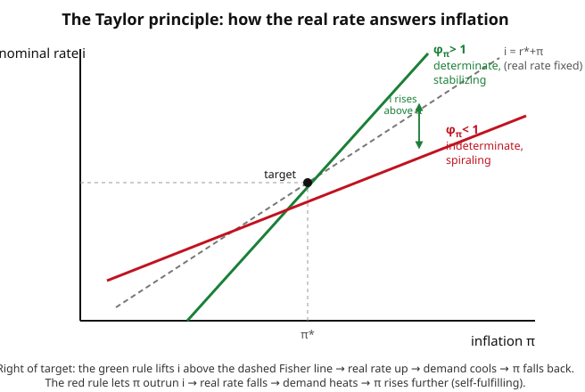

# Grad Macroeconomics · Lesson 6.2: Policy rules and the Taylor principle

> ⏱ ~15 min · Module 6: Frictions, policy, and unemployment · Builds on: [6.1 Monetary and fiscal policy in the NK model](06-01-monetary-fiscal-nk.md) · Unlocks: [6.3 Search and matching: the DMP model](06-03-search-matching-dmp.md)

## Why this matters

In 6.1 you closed the New Keynesian model with three equations — a demand block (IS), a supply block (NKPC), and a central bank that sets the nominal interest rate. But that third equation is not a fact about the world; it is a *choice*. And here is the unsettling part: the same demand and supply blocks can produce either a well-behaved economy or a chaotic one, depending entirely on how aggressively the bank leans against inflation. Get the rule wrong and inflation is no longer pinned down at all — random shifts in belief ("sunspots") become self-fulfilling, and the model has infinitely many equilibria.

This lesson is about two of the deepest results in monetary economics, and they are cousins. First: **to give the economy a unique, stable path, the interest-rate rule must respond more than one-for-one to inflation** (the Taylor principle). Second: **even a bank that knows the right rule will do worse setting policy fresh each period than one that commits to the rule in advance** (time inconsistency). Determinacy and credibility — that is the whole job description of a modern central bank.

## The idea

Start with the interest-rate rule John Taylor fit to Fed behavior in 1993:

$$i_t = r^* + \pi^* + \phi_\pi(\pi_t - \pi^*) + \phi_x\, x_t.$$

Here $i_t$ is the nominal policy rate, $r^*$ the long-run real rate, $\pi^*$ the inflation target, $\pi_t$ actual inflation, $x_t$ the output gap (output minus its flexible-price level), and $\phi_\pi,\phi_x \ge 0$ the response coefficients. **In words:** when inflation runs hot or the economy overheats, raise rates; the constants $r^*+\pi^*$ just set the neutral level so that at target ($\pi_t=\pi^*$, $x_t=0$) the rate equals $r^*+\pi^*$ — the Fisher-consistent neutral nominal rate.

Now the crux. What actually cools demand is not the *nominal* rate but the *real* rate $r_t \approx i_t - \mathbb{E}_t\pi_{t+1}$. Suppose inflation rises by one point. The rule raises $i_t$ by $\phi_\pi$ points. The real rate therefore moves by $(\phi_\pi - 1)$ points (roughly, holding the gap and expected inflation's extra kick aside):

- If $\phi_\pi > 1$: the nominal rate rises *more* than inflation, so the **real rate rises**. Borrowing gets genuinely more expensive, demand and the output gap fall, and through the NKPC inflation is pulled *back down*. Self-correcting.
- If $\phi_\pi < 1$: the nominal rate rises *less* than inflation, so the **real rate falls**. Money is cheaper in real terms, demand *rises*, inflation goes *up further* — validating the initial jump. A belief that inflation will be high becomes true. Self-*fulfilling*.

That threshold — respond more than one-for-one — is the **Taylor principle**. The figure shows it geometrically: only a rule steeper than the 45° Fisher line lifts the real rate when inflation climbs.

## The formal version

**Determinacy in the three-equation model.** Write the model in gaps around the target (so $\pi^*=0$ for tidiness). The IS and NKPC blocks are

$$x_t = \mathbb{E}_t x_{t+1} - \tfrac{1}{\sigma}\big(i_t - \mathbb{E}_t\pi_{t+1} - r^*\big), \qquad \pi_t = \beta\,\mathbb{E}_t\pi_{t+1} + \kappa\, x_t,$$

with $\sigma>0$ the inverse intertemporal elasticity, $\beta\in(0,1)$ the discount factor, and $\kappa>0$ the NKPC slope from [4.5](04-05-nk-phillips-curve.md). Substituting the Taylor rule $i_t = r^* + \phi_\pi\pi_t + \phi_x x_t$ gives a linear system

$$\mathbb{E}_t \begin{pmatrix} x_{t+1} \\ \pi_{t+1} \end{pmatrix} = A \begin{pmatrix} x_t \\ \pi_t \end{pmatrix}.$$

Both $x_t$ and $\pi_t$ are **jump** (non-predetermined) variables — nothing forces where they start. The **Blanchard–Kahn condition** ([4.2](04-02-calibration-stochastic-growth.md), and the eigenvalue logic of [2.3](02-03-ramsey-cass-koopmans.md)'s saddle path) says: a unique bounded rational-expectations equilibrium exists iff the number of eigenvalues of $A$ outside the unit circle equals the number of jump variables — here, **both** eigenvalues must lie outside the unit circle. **In words:** with two free variables and no anchor, you need two explosive roots so that only one starting point — the target itself — fails to blow up; that unique non-explosive path *is* the equilibrium.

Working out when that holds yields the clean condition

$$\boxed{\;\phi_\pi + \frac{1-\beta}{\kappa}\,\phi_x > 1\;}$$

for local determinacy. **In words:** the *combined* long-run response to inflation must exceed one. With $\phi_x=0$ this is exactly $\phi_\pi>1$ — the Taylor principle. A positive $\phi_x$ helps a little (because a higher gap eventually raises inflation through the NKPC), but the inflation coefficient does the heavy lifting.

If instead $\phi_\pi<1$ (and $\phi_x$ small), one eigenvalue falls inside the unit circle: there is a continuum of bounded paths converging to the steady state, indexed by arbitrary "sunspot" beliefs. **Indeterminacy** — inflation is not pinned down, and self-fulfilling volatility (extra business-cycle noise with no fundamental cause) can appear.

**Rules versus discretion (Kydland–Prescott, 1977).** Now a second, distinct reason to like rules. Suppose the bank has a per-period loss

$$L = \tfrac{1}{2}(\pi_t - \pi^*)^2 + \tfrac{\lambda}{2}(x_t - \tilde{x})^2,$$

it dislikes inflation deviating from target and output falling short of an ambitious goal $\tilde{x}>0$ (above the natural level — think a socially desired employment level beyond the frictional floor). Output is tied to *surprise* inflation via an expectations-augmented Phillips curve

$$x_t = \bar{x} + a\,(\pi_t - \pi_t^e), \qquad a>0,$$

where $\pi_t^e$ is the public's prior expectation and $\bar x$ the natural level (normalize $\bar x=0$). Only *unexpected* inflation buys output. **In words:** the bank can trade a burst of inflation for a temporary boom, but only by surprising people.

- **Commitment:** the bank promises $\pi_t=\pi^*$ and, being believed, delivers it. Output sits at $\bar x=0$; loss is $\tfrac{\lambda}{2}\tilde x^2$.
- **Discretion:** the bank re-optimizes each period *taking $\pi_t^e$ as given* (it is already set). It now sees a live tradeoff — a bit more inflation raises output — and cannot resist. Solving its first-order condition, and imposing rational expectations $\pi_t^e=\pi_t$ (the public anticipates the temptation, so $x_t=0$ again), yields an **inflation bias**:

$$\pi_t = \pi^* + \lambda a\,\tilde{x} \;>\; \pi^*, \qquad x_t = 0.$$

**In words:** discretion delivers *higher average inflation and exactly the same output* as commitment. The boom the bank wanted never materializes — everyone saw it coming — so society pays the inflation cost for nothing. Commitment Pareto-dominates. The fix is to remove the discretion: a legislated rule, an inflation-targeting mandate, or (Rogoff) appointing a "conservative" central banker who weights inflation more heavily than society does.

## Picture

## Worked examples

**Example 1 (the Taylor principle as a real-rate response).** Let the rule be $i_t = r^* + \pi^* + \phi_\pi(\pi_t-\pi^*)$ (set $\phi_x=0$). Inflation jumps by $\Delta\pi = +1$ point above target, and for a clean read hold expected future inflation fixed so the real rate moves as $\Delta r = \Delta i - \Delta(\mathbb{E}\pi)\approx \Delta i$. Then

$$\Delta i = \phi_\pi\,\Delta\pi = \phi_\pi, \qquad \Delta r \approx \phi_\pi - 1 \ \text{(net of the point inflation itself ate).}$$

More carefully: the *real* cost of borrowing is $i-\pi$, which moves by $\Delta i - \Delta\pi = (\phi_\pi-1)\Delta\pi$. With $\phi_\pi=1.5$: $\Delta(i-\pi)=+0.5>0$, real rate up, demand down — **stabilizing**. With $\phi_\pi=0.8$: $\Delta(i-\pi)=-0.2<0$, real rate *down*, demand up, inflation reinforced — **destabilizing**. The knife-edge $\phi_\pi=1$ leaves the real rate unchanged: the bank merely tracks inflation and never leans against it, so nothing anchors $\pi$.

**Example 2 (time inconsistency: solving the discretion game).** Take the setup above with $\pi^*=0$ for tidiness, so $L=\tfrac12\pi^2 + \tfrac{\lambda}{2}(x-\tilde x)^2$ and $x = a(\pi-\pi^e)$.

*Discretion.* The bank chooses $\pi$ with $\pi^e$ already fixed. Substitute the Phillips curve:

$$L(\pi) = \tfrac12\pi^2 + \tfrac{\lambda}{2}\big(a(\pi-\pi^e)-\tilde x\big)^2.$$

First-order condition $dL/d\pi = 0$:

$$\pi + \lambda a\big(a(\pi-\pi^e)-\tilde x\big) = 0.$$

The public is rational: in equilibrium $\pi^e=\pi$, so the surprise term $a(\pi-\pi^e)=0$ vanishes. The FOC collapses to

$$\pi - \lambda a\,\tilde x = 0 \;\Rightarrow\; \pi^{\text{disc}} = \lambda a\,\tilde x, \qquad x = 0.$$

*Commitment.* The bank binds itself to $\pi=0$ before expectations form; believed, it gets $\pi^e=0$, hence $x=a(0-0)=0$ and $\pi^{\text{comm}}=0$.

*Compare losses (both have $x=0$, so the $\tilde x$ term is identical):*

$$L^{\text{comm}} = \tfrac{\lambda}{2}\tilde x^2, \qquad L^{\text{disc}} = \tfrac12(\lambda a\tilde x)^2 + \tfrac{\lambda}{2}\tilde x^2 = L^{\text{comm}} + \tfrac12\lambda^2a^2\tilde x^2.$$

Discretion is strictly worse by $\tfrac12\lambda^2a^2\tilde x^2>0$ — the dead-weight inflation bias, with *zero* output gain to show for it. Note it vanishes only if $\tilde x=0$ (no over-ambition) or $\lambda=0$ (bank ignores output): the bias is born precisely from wanting output above the natural level.

## Watch out

- **The Taylor principle is about the *real* rate, not the nominal rate.** "The Fed raised rates" tells you nothing until you compare the hike to inflation. Raising $i$ by 3 points while inflation rose 4 is *loosening*. $\phi_\pi>1$ is exactly the condition that a hike is real.
- **Determinacy ≠ stability of a given path.** Indeterminacy is not "the economy explodes"; it is "too many well-behaved paths exist," so beliefs pick among them. The pathology is non-uniqueness and sunspot volatility, not divergence.
- **The inflation bias is not a mistake or bad forecasting.** The discretionary bank is optimizing correctly every period and the public forecasts perfectly. The bias is the *equilibrium* of rational play — that is what makes it a commitment problem, not an information problem.
- **Discretion buys no output *on average*.** It can still respond to shocks; the point is that the *systematic* attempt to run the economy hot is fully anticipated and nets only inflation. Don't read "commitment dominates" as "never react to shocks."
- **The $\tilde x>0$ assumption is doing the work.** If the bank targeted the natural level of output, the temptation — and the bias — disappears. Over-ambition about output is the original sin.

## One-liner

> A central bank earns a unique, stable equilibrium only by raising real rates when inflation rises ($\phi_\pi>1$), and earns low average inflation only by tying its own hands — because a bank free to surprise you will, you'll expect it, and you'll both end up worse off.

## Problems

**P1 (🟢)** A central bank follows $i_t = r^* + \pi^* + 1.5(\pi_t-\pi^*) + 0.5\,x_t$ with $r^*=2\%$, $\pi^*=2\%$. Inflation rises to $\pi_t=4\%$ while the output gap stays at $x_t=0$; assume expected future inflation is unchanged. Compute the change in the nominal rate and in the real rate, and state whether the move stabilizes inflation.

**P2 (🟡)** For each rule, use the determinacy condition $\phi_\pi + \tfrac{1-\beta}{\kappa}\phi_x > 1$ (with $\beta=0.99$, $\kappa=0.1$) to say whether the equilibrium is determinate or indeterminate: (a) $\phi_\pi=1.5,\ \phi_x=0$; (b) $\phi_\pi=0.9,\ \phi_x=0$; (c) $\phi_\pi=0.9,\ \phi_x=0.5$. For (c), interpret why a gap response can rescue an inflation coefficient below 1.

**P3 (🔴)** Kydland–Prescott inflation bias. The bank minimizes $L=\tfrac12(\pi-\pi^*)^2 + \tfrac{\lambda}{2}(x-\tilde x)^2$ subject to $x = a(\pi-\pi^e)$, with $\lambda=0.25$, $a=1$, $\tilde x=2$, $\pi^*=2$. (a) Derive the discretionary inflation rate and output. (b) Derive the commitment outcome. (c) Compute both losses and show commitment Pareto-dominates. (d) In one sentence, say what real-world institution implements the commitment solution.

Solutions

**P1** Nominal-rate change: $\Delta i = 1.5\times(4\%-2\%) + 0.5\times 0 = 1.5\times 2 = +3$ points. Real-rate change: since expected inflation is held fixed, $\Delta r \approx \Delta i - \Delta\pi = 3 - 2 = +1$ point. (Equivalently $(\phi_\pi-1)\Delta\pi = 0.5\times 2 = 1$.) The real rate rises, so borrowing is genuinely more expensive, demand and the output gap fall, and inflation is pulled back toward target — **stabilizing**, exactly because $\phi_\pi=1.5>1$.

**P2** Compute the coefficient $\tfrac{1-\beta}{\kappa} = \tfrac{1-0.99}{0.1} = \tfrac{0.01}{0.1}=0.1$.
- (a) $1.5 + 0.1(0) = 1.5 > 1$ → **determinate**.
- (b) $0.9 + 0.1(0) = 0.9 < 1$ → **indeterminate** (Taylor principle violated; sunspot equilibria possible).
- (c) $0.9 + 0.1(0.5) = 0.9 + 0.05 = 0.95 < 1$ → still **indeterminate**. The gap response helps — a higher output gap eventually feeds inflation through the NKPC, so leaning on $x$ is a partial substitute for leaning on $\pi$ — but here $\phi_x=0.5$ adds only $0.05$, not enough to clear $1$. The inflation coefficient carries almost all the weight because the NKPC transmits the gap to inflation only weakly (small $\kappa$) and with discounting ($1-\beta$ tiny).

**P3** Setup: $L=\tfrac12(\pi-2)^2+\tfrac{0.25}{2}(x-2)^2$, $x=1\cdot(\pi-\pi^e)$.

(a) *Discretion.* Take $\pi^e$ as given, substitute $x=\pi-\pi^e$:
$$L=\tfrac12(\pi-2)^2+\tfrac{0.25}{2}\big((\pi-\pi^e)-2\big)^2.$$
FOC in $\pi$: $(\pi-2) + 0.25\big((\pi-\pi^e)-2\big)=0.$ Impose rational expectations $\pi^e=\pi$ so $\pi-\pi^e=0$:
$$(\pi-2) + 0.25(0-2)=0 \;\Rightarrow\; \pi-2 = 0.5 \;\Rightarrow\; \pi^{\text{disc}}=2.5,\quad x=0.$$
The inflation bias is $\lambda a\tilde x = 0.25\cdot1\cdot2 = 0.5$ above target, as the formula predicts.

(b) *Commitment.* Bind to $\pi=\pi^*=2$; believed, $\pi^e=2$, so $x=2-2=0$, and $\pi^{\text{comm}}=2$.

(c) *Losses.* Both give $x=0$, so the output term is $\tfrac{0.25}{2}(0-2)^2 = 0.125\cdot4 = 0.5$ in each.
$$L^{\text{comm}} = \tfrac12(2-2)^2 + 0.5 = 0 + 0.5 = 0.5.$$
$$L^{\text{disc}} = \tfrac12(2.5-2)^2 + 0.5 = \tfrac12(0.25) + 0.5 = 0.125 + 0.5 = 0.625.$$
Commitment loss $0.5 <$ discretion loss $0.625$, and both deliver identical output $x=0$ — so no one is worse off under commitment and the bank is strictly better off: commitment **Pareto-dominates**. The extra $0.125$ is pure wasted inflation, matching $\tfrac12\lambda^2a^2\tilde x^2=\tfrac12(0.25)^2(1)(4)=0.125$.

(d) A legislated **inflation-targeting mandate** (or an independent, "conservative" central bank whose charter fixes the target) removes the period-by-period discretion and implements the commitment outcome.

## Flashback

**From Lesson 6.1 (three-equation NK model):** A positive demand shock hits the IS curve, $x_t = \mathbb{E}_t x_{t+1} - \tfrac{1}{\sigma}(i_t - \mathbb{E}_t\pi_{t+1} - r^*) + \varepsilon_t$ with $\varepsilon_t>0$, while the bank holds the nominal rate $i_t$ fixed for one period. Qualitatively, what happens to the output gap and inflation on impact, and how would a Taylor rule with $\phi_\pi>1$ have blunted the response? (Reason it through; no numbers needed.)

Solution

With $i_t$ pinned and the real rate therefore unmoved, the positive shock $\varepsilon_t$ raises the current output gap $x_t$ directly (demand exceeds the flexible-price level). Through the NKPC $\pi_t=\beta\mathbb{E}_t\pi_{t+1}+\kappa x_t$, the higher gap lifts inflation: $\kappa x_t>0$ pushes $\pi_t$ up. So on impact both the gap and inflation rise, and with a fixed rate there is no offsetting force — the shock passes straight through.

Under an active Taylor rule with $\phi_\pi>1$, the rise in $\pi_t$ (and $x_t$) makes the bank raise $i_t$ *more than one-for-one* with inflation, so the **real rate** $i_t-\mathbb{E}_t\pi_{t+1}$ climbs. The IS curve then pulls the output gap back down, and the smaller gap feeds a smaller inflation rise through the NKPC. The endogenous rate response leans against the shock, so both $x_t$ and $\pi_t$ move less on impact — the Taylor principle is what turns the passive economy into a self-stabilizing one.

## Connections

- **Backward:** this is the equation that *closes* the three-equation model of [6.1](06-01-monetary-fiscal-nk.md) — the IS and NKPC blocks are inert until the policy rule specifies how $i_t$ moves. The supply block is the NKPC of [4.5](04-05-nk-phillips-curve.md).
- **Backward (methods):** determinacy is the Blanchard–Kahn eigenvalue count from [4.2](04-02-calibration-stochastic-growth.md), and the "unique non-explosive path" logic is exactly the saddle-path selection you saw in the Ramsey model, [2.3](02-03-ramsey-cass-koopmans.md) — jump variables must ride the stable/unstable manifold to avoid blowing up.
- **Forward:** the credibility argument underlies real central-bank practice — inflation targeting, independent central banks, forward guidance — and the frictions theme continues into labor-market search in [6.3](06-03-search-matching-dmp.md).
- **Sideways (game theory):** time inconsistency, commitment vs. discretion, and the value of tying one's hands are the macro face of subgame perfection and the folk theorem — see the [grad game theory syllabus](../../grad-game-theory/syllabus.md). The commitment-dominates-discretion result is a repeated/dynamic-game equilibrium argument in disguise.
- **Sideways (micro):** the bank's per-period optimization under a constraint, and the welfare comparison of two equilibria, are the constrained-optimization and Pareto-ranking tools of the [grad micro syllabus](../../grad-micro/syllabus.md).
