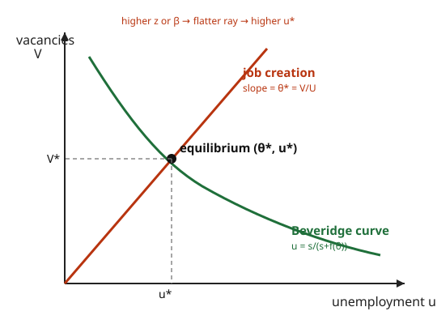

# Grad Macroeconomics · Lesson 6.3: Search and matching — the DMP model

> ⏱ ~15 min · Module 6: Frictions, policy, and unemployment · Builds on: [6.2 Policy rules and the Taylor principle](06-02-policy-rules-taylor-principle.md) · Unlocks: [6.4 A taste of heterogeneous-agent macro](06-04-heterogeneous-agent-taste.md)

## Why this matters

Every model so far cleared the labor market: a wage $w$ moved until everyone who wanted to work at that wage did. So unemployment was either zero or a puzzle you had to bolt on. But real labor markets have *simultaneous* unemployment and vacancies — jobless workers **and** unfilled jobs, side by side, for months. A market-clearing wage cannot explain that; there is no single price that leaves both sides rationed.

The Diamond–Mortensen–Pissarides (DMP) model — Nobel 2010 — takes the honest view: **hiring takes time**. Workers and jobs don't meet on a frictionless spot market; they *search*, and matches trickle out of a congested process. Unemployment becomes a **flow phenomenon** — a bathtub whose level is set by how fast people fall in (separations) versus climb out (job-finding) — not a failure of a wage to fall far enough. This is the modern theory of equilibrium unemployment, and the frame for essentially all serious labor and business-cycle work on jobs.

## The idea

Picture a pool of unemployed workers $U$ and a pile of posted vacancies $V$. They don't instantly pair off. Instead a **matching function** grinds them together and spits out a flow of new hires per unit time, like a chemical reaction rate: more of either reactant makes more matches, but never instantly.

One number summarizes how easy hiring is: **market tightness** $\theta = V/U$, vacancies per unemployed worker. A tight market (high $\theta$) is a *worker's* market — jobs are plentiful, so an unemployed person finds work fast, but a firm's vacancy sits empty longer. A slack market (low $\theta$) is the reverse. Everything downstream — how fast people escape unemployment, how much bargaining power each side has, where wages land — is driven by $\theta$.

Firms decide how many vacancies to post by a simple profit rule: **keep posting until the last vacancy just breaks even.** Workers and firms then *split the surplus* of each match by bargaining. Two forces, job-creation and wage-setting, pin down $\theta$ — and once you know $\theta$, the bathtub gives you the unemployment rate.

## The formal version

**Matching function.** Flow of new matches per unit time:
$$M = m(U, V), \qquad m \text{ increasing in each argument, constant returns to scale (CRS).}$$
*In words:* hires come out of unemployed searchers and open jobs, and doubling both doubles hires. CRS is what lets one ratio, $\theta$, carry all the information.

**Rates.** Divide matches by each side's stock:
$$f(\theta) = \frac{m(U,V)}{U} = m(1,\theta) \quad\text{(job-finding rate)}, \qquad q(\theta) = \frac{m(U,V)}{V} = m(\tfrac1\theta,1) \quad\text{(vacancy-filling rate)}.$$
$f$ is the rate an unemployed worker meets a job (rises with $\theta$); $q$ is the rate a vacancy meets a worker (falls with $\theta$). They're linked: $f(\theta) = \theta\, q(\theta)$ (since $\frac MU = \frac VU\cdot\frac MV$). The expected time to fill a vacancy is $1/q(\theta)$.

**Beveridge curve (the bathtub in steady state).** Let $s$ be the exogenous **separation rate** (jobs die at rate $s$). With the labor force normalized to $1$, employment is $1-u$. Flow *in* to unemployment $= s(1-u)$; flow *out* $= f(\theta)\,u$. Steady state equates them:
$$s(1-u) = f(\theta)\,u \;\;\Longrightarrow\;\; \boxed{\,u = \frac{s}{s + f(\theta)}\,}$$
*In words:* unemployment is the share of time spent in the pool — the inflow rate over total turnover. In $(u,V)$ space this traces a **downward-sloping, convex** curve: more vacancies raise $\theta$, raise $f$, and drain the pool.

**Value functions** (continuous time, discount rate $r$; flow output $p$, wage $w$, vacancy cost $c$, value of being unemployed $z$). A filled job is worth $J$, a vacancy $\mathcal V$, employment $W$, unemployment $\mathcal U$:
$$rJ = (p - w) - sJ, \qquad r\mathcal V = -c + q(\theta)(J - \mathcal V),$$
$$rW = w - s(W - \mathcal U), \qquad r\mathcal U = z + f(\theta)(W - \mathcal U).$$
Each is "flow payoff + rate of transition $\times$ capital gain," the asset-pricing form of a Bellman equation.

**Job-creation condition (free entry).** Firms post vacancies until $\mathcal V = 0$. Then the vacancy equation gives $c = q(\theta)J$, i.e.
$$\boxed{\,\frac{c}{q(\theta)} = J = \frac{p - w}{r + s}\,}$$
*In words:* the expected cost of filling a vacancy (cost $c$ times expected wait $1/q$) equals the present value of a filled job's profits. This is downward-sloping in $\theta$: more tightness means slower filling, so firms post fewer vacancies.

**Wage — Nash bargaining.** The worker and firm split the match surplus; the worker gets share $\beta \in (0,1)$ (**bargaining power**). The sharing rule $(1-\beta)(W-\mathcal U) = \beta J$ combined with the value functions yields the wage equation
$$\boxed{\,w = \beta\,(p + c\theta) + (1-\beta)\,z\,}$$
*In words:* the wage is a weighted average of what the worker brings the firm (productivity $p$, plus $c\theta$ — the hiring cost the firm *saves* by not restarting the search) and the worker's outside option $z$. Higher $\beta$ tilts toward the first; higher $z$ toward the second.

**Equilibrium.** Substitute the wage into job creation ($p - w = (1-\beta)(p-z) - \beta c\theta$):
$$(1-\beta)(p - z) = \frac{c(r+s)}{q(\theta)} + \beta c\theta.$$
The left side is a constant; the right side rises in $\theta$ (as $q\downarrow$, $1/q\uparrow$; and $\beta c\theta\uparrow$). So there is a **unique** $\theta^*$, and the Beveridge curve then delivers $u^* = s/(s+f(\theta^*))$.

## Picture

The convex green **Beveridge curve** is the flow-balance locus $u=s/(s+f(\theta))$. The red **job-creation ray** from the origin has slope equal to equilibrium tightness $\theta^*=V/U$ (fixed by the two-equation system). Their crossing sets $(\theta^*, u^*)$. Anything that raises wages — higher $z$ or higher $\beta$ — flattens the ray (less job creation, lower $\theta^*$) and slides the equilibrium *rightward along* the Beveridge curve to higher unemployment.

## Worked examples

**Example 1 — the bathtub (deriving $u = s/(s+f)$).** Track the unemployment rate over time. Inflow to the pool is separations from the employed, $s(1-u)$; outflow is job-finding, $f(\theta)u$:
$$\dot u = s(1-u) - f(\theta)\,u.$$
Set $\dot u = 0$: $s - su = f u \Rightarrow s = (s+f)u \Rightarrow u = \dfrac{s}{s+f(\theta)}.$ The dynamics are stable — $\partial\dot u/\partial u = -(s+f) < 0$ — so any starting level converges to this steady state. Note the comparative statics fall out for free: $u$ rises with the separation rate $s$ and falls with job-finding $f(\theta)$, hence falls with tightness $\theta$.

**Example 2 — Boss Problem 6 core: solve the equilibrium with Cobb–Douglas matching.**
Take $m(U,V) = A\,U^{\eta}V^{1-\eta}$ with $\eta\in(0,1)$ the **elasticity of matches with respect to unemployment**. Then
$$f(\theta) = m(1,\theta) = A\,\theta^{1-\eta}, \qquad q(\theta) = m(\tfrac1\theta,1) = A\,\theta^{-\eta}$$
(check $f = \theta q$: $\theta\cdot A\theta^{-\eta} = A\theta^{1-\eta}$ ✓). Parameters: $A=1,\ \eta=\tfrac12,\ \beta=\tfrac12,\ p=1,\ z=0.4,\ c=0.3,\ s=0.1,\ r=0.05$.

*Job-creation + wage, combined.* With $q(\theta)=\theta^{-1/2}$ so $1/q(\theta)=\theta^{1/2}$:
$$(1-\beta)(p-z) = c(r+s)\,\theta^{1/2} + \beta c\,\theta.$$
Plug in: $(0.5)(0.6) = (0.3)(0.15)\theta^{1/2} + (0.5)(0.3)\theta$, i.e. $0.3 = 0.045\,\theta^{1/2} + 0.15\,\theta$. Let $x=\theta^{1/2}$:
$$0.15x^2 + 0.045x - 0.3 = 0 \;\Longrightarrow\; x^2 + 0.3x - 2 = 0 \;\Longrightarrow\; x = \frac{-0.3+\sqrt{8.09}}{2} = 1.272.$$
So $\theta^* = x^2 = 1.62$. Then $f(\theta^*) = \theta^{*1/2} = 1.272$, and
$$u^* = \frac{s}{s+f} = \frac{0.1}{0.1+1.272} = 0.073 \approx 7.3\%.$$
*Check via the wage.* $w = \beta(p+c\theta^*)+(1-\beta)z = 0.5(1+0.3\cdot1.62)+0.5(0.4) = 0.943$. Then $c/q(\theta^*) = 0.3\cdot1.272 = 0.382$ and $(p-w)/(r+s) = 0.057/0.15 = 0.382$ ✓ — job creation holds.

*Comparative statics (sign, then confirm).* In $(1-\beta)(p-z) = c(r+s)\theta^{1/2} + \beta c\theta$, the RHS is strictly increasing in $\theta$.
- **Raise $z$** (better benefits): LHS $(1-\beta)(p-z)$ *falls* $\Rightarrow \theta^*\downarrow \Rightarrow f\downarrow \Rightarrow u^*\uparrow$. Numerically $z:0.4\to0.5$ gives LHS $=0.25$, so $0.15x^2+0.045x-0.25=0\Rightarrow x=1.150$, $\theta^*=1.32$, $u^* = 0.1/1.25 = 8.0\%$ — up from 7.3%.
- **Raise $\beta$** (stronger worker hand): LHS falls *and* the $\beta c\theta$ term rises — both shrink $\theta^*$, so $u^*\uparrow$ again.

**The mechanism is the same both times:** anything that pushes wages up shrinks the profit from a filled job, firms post fewer vacancies, tightness falls, and equilibrium unemployment rises. Generous benefits and powerful unions raise unemployment here not through "laziness" but through the job-creation margin.

## Watch out

- **Unemployment is a flow, not an excess supply.** There's no wage that "should have fallen." $u^*>0$ even with fully flexible, bargained wages — it's the residence time in a frictional pool. Cutting wages doesn't clear it; it works only through $\theta$ (job creation).
- **$f$ and $q$ move in opposite directions.** Both are functions of the *same* $\theta$, but tightness helps workers ($f\uparrow$) exactly by hurting firms' fill rate ($q\downarrow$). Never treat them as independent.
- **Don't confuse the two curves' comparative statics.** A shift in $s$ moves the *Beveridge curve* itself; a change in $z,\beta,p,c$ moves the *job-creation ray* and slides you *along* the Beveridge curve. Empirically, outward shifts of the Beveridge curve (more $u$ *and* $V$) signal worse matching efficiency, not a wage problem.
- **The wage $w=\beta(p+c\theta)+(1-\beta)z$ needs $z<p$**; otherwise the match has no surplus to split and no jobs form.

## One-liner

> Unemployment is the steady-state level of a bathtub — inflow $s$ over turnover $s+f(\theta)$ — and tightness $\theta$ is set where free-entry job creation meets Nash-bargained wages; anything that raises wages lowers job creation and raises unemployment.

## Problems

**P1 (🟢)** In a labor market the monthly separation rate is $s = 0.02$ and the monthly job-finding rate is $f(\theta) = 0.38$. Compute the steady-state unemployment rate. If a recession doubles the separation rate to $s=0.04$ (holding $f$ fixed), what is the new $u$?

**P2 (🟡 — Boss Problem 6)** Matching is $m(U,V)=A\,U^{\eta}V^{1-\eta}$ with $A=1,\ \eta=\tfrac12$. Parameters: $\beta=0.6,\ p=1,\ z=0.2,\ c=0.2,\ s=0.08,\ r=0.04$.
(a) Write the job-creation condition and the wage equation, combine them, and solve for equilibrium tightness $\theta^*$ and unemployment $u^*$.
(b) Without recomputing, sign the effect on $\theta^*$ and $u^*$ of (i) a rise in the benefit $z$, (ii) a rise in bargaining power $\beta$, and explain the common economic mechanism.

**P3 (🔴)** State the **Hosios condition** for this economy (in terms of $\beta$ and the matching elasticity $\eta$), and explain the two search externalities it balances. Is the decentralized DMP equilibrium generically efficient?

Solutions

**P1.** $u = \dfrac{s}{s+f} = \dfrac{0.02}{0.02+0.38} = \dfrac{0.02}{0.40} = 0.05 = 5\%$. Doubling separations: $u = \dfrac{0.04}{0.04+0.38} = \dfrac{0.04}{0.42} = 0.095 \approx 9.5\%$. Unemployment nearly doubles — the inflow rate jumped while the exit rate held, so the pool fills. (This is the "job-destruction" recession channel; a "job-finding" recession would instead cut $f$.)

**P2. (a)** With $q(\theta)=A\theta^{-\eta}=\theta^{-1/2}$, the **job-creation condition** is
$$\frac{c}{q(\theta)} = \frac{p-w}{r+s}, \qquad\text{i.e.}\qquad c\,\theta^{1/2} = \frac{p-w}{r+s},$$
and the **wage equation** is $w = \beta(p+c\theta) + (1-\beta)z$. Substituting $p-w = (1-\beta)(p-z)-\beta c\theta$:
$$(1-\beta)(p-z) = c(r+s)\,\theta^{1/2} + \beta c\,\theta.$$
Numbers: $(0.4)(0.8) = (0.2)(0.12)\theta^{1/2} + (0.6)(0.2)\theta$, i.e. $0.32 = 0.024\,\theta^{1/2} + 0.12\,\theta$. Let $x=\theta^{1/2}$:
$$0.12x^2 + 0.024x - 0.32 = 0 \;\Longrightarrow\; x^2 + 0.2x - 2.667 = 0 \;\Longrightarrow\; x = \frac{-0.2+\sqrt{10.707}}{2} = 1.536.$$
So $\theta^* = x^2 = 2.36$. Then $f(\theta^*)=\theta^{*1/2}=1.536$, and
$$u^* = \frac{s}{s+f} = \frac{0.08}{0.08+1.536} = \frac{0.08}{1.616} = 0.0495 \approx 5.0\%.$$
(Sanity check: $w = 0.6(1+0.2\cdot2.36)+0.4(0.2)=0.6\cdot1.472+0.08=0.963$; $c/q=0.2\cdot1.536=0.307$; $(p-w)/(r+s)=0.037/0.12=0.307$ ✓.)

**(b)** In $(1-\beta)(p-z) = c(r+s)\theta^{1/2}+\beta c\theta$, the RHS strictly increases in $\theta$, so $\theta^*$ moves the same way as the LHS.
(i) $z\uparrow \Rightarrow$ LHS $\downarrow \Rightarrow \theta^*\downarrow \Rightarrow f\downarrow \Rightarrow u^*\uparrow$.
(ii) $\beta\uparrow \Rightarrow (1-\beta)(p-z)\downarrow$ *and* the $\beta c\theta$ term $\uparrow$; both force $\theta^*\downarrow \Rightarrow u^*\uparrow$.
**Common mechanism:** both raise the wage $w=\beta(p+c\theta)+(1-\beta)z$, which cuts the firm's profit $J=(p-w)/(r+s)$ from a filled job. By free entry ($c/q(\theta)=J$), lower $J$ means fewer vacancies, lower tightness, slower job-finding, and a higher steady-state pool. Job creation, not effort, is the margin.

**P3.** The **Hosios condition** is
$$\beta = \eta \quad(\text{worker bargaining power} = \text{elasticity of matches w.r.t. unemployment}).$$
An extra vacancy exerts two opposite externalities on others, neither of which the posting firm prices:
- **Thick-market (positive) externality:** it raises $\theta$, so *unemployed workers* find jobs faster ($f\uparrow$) — a benefit the firm ignores.
- **Congestion (negative) externality:** it also makes it harder for *other firms* to fill their vacancies ($q\downarrow$) — a cost the firm ignores.
The wage split $\beta$ governs how much of the match surplus workers capture, and hence how strong the private incentive to post vacancies is. When $\beta=\eta$, the share workers extract exactly matches their marginal contribution to the matching technology, so the two externalities cancel and the decentralized equilibrium is **constrained-efficient** (it maximizes net output given the frictions). For $\beta\ne\eta$ they don't cancel: $\beta>\eta$ over-rewards workers, wages are too high, and there are too few vacancies (too much unemployment); $\beta<\eta$ gives too many. So the DMP equilibrium is **generically inefficient** — efficiency is a knife-edge, not the rule, which is the central normative message of search theory.

## Flashback

**From Lesson 6.2 (Policy rules and the Taylor principle):** A central bank sets the nominal rate by the rule $i_t = 1 + 1.5\,\pi_t$ (percent). (a) Does it satisfy the Taylor principle? (b) If inflation rises by 1 percentage point, what happens to the *real* interest rate, and why does the answer determine whether the rule stabilizes inflation?

Solution

(a) The Taylor principle requires the nominal rate to respond to inflation more than one-for-one, i.e. $\partial i/\partial\pi > 1$. Here $\partial i/\partial\pi = 1.5 > 1$ ✓, so it is satisfied — the associated equilibrium is *determinate* (unique, no sunspot inflation).

(b) The real rate is $r_t = i_t - \pi_t = 1 + 0.5\,\pi_t$, so $\partial r/\partial\pi = 1.5 - 1 = 0.5 > 0$: a 1 pp rise in inflation raises the *real* rate by 0.5 pp. That is exactly why the rule stabilizes — higher inflation tightens real policy, cooling demand and pulling inflation back. Had the coefficient been below 1 (say $i = 1 + 0.7\pi$), the real rate would *fall* when inflation rose, feeding a self-fulfilling spiral and indeterminacy.

## Connections

- **Backward:** DMP fills the labor-market hole that [4.1 the RBC model](04-01-real-business-cycle.md) and [4.4 the New Keynesian model](04-04-nominal-rigidities-new-keynesian.md) left — both had a frictionless labor market where hours, not *jobs*, adjusted. The value-function equations are the asset-pricing Bellman form from [1.5 stochastic dynamic programming](01-05-stochastic-dynamic-programming.md); free entry is a zero-profit condition, the same equilibrium logic as [1.6 recursive competitive equilibrium](01-06-recursive-competitive-equilibrium.md). Wages here respond to the outside option $z$ and tightness — a richer channel than the policy-rule frictions of [6.1](06-01-monetary-fiscal-nk.md) and [6.2](06-02-policy-rules-taylor-principle.md).
- **Forward:** [6.4 heterogeneous-agent macro](06-04-heterogeneous-agent-taste.md) puts *idiosyncratic* unemployment risk — precisely the job-loss and job-finding hazards $s$ and $f(\theta)$ here — at the center, where it interacts with precautionary saving. DMP is also the workhorse of modern labor economics (wage dispersion, on-the-job search, matching efficiency).
- **Sideways (micro / game theory):** the wage is set by **Nash bargaining over a match surplus** — the cooperative-bargaining and surplus-splitting machinery developed in [grad-micro](../../grad-micro/syllabus.md) and [grad game theory](../../grad-game-theory/syllabus.md). The parameter $\beta$ is exactly the Nash bargaining weight; the Hosios condition is a statement about when private surplus shares implement the social optimum.
- **Sideways (matching markets, plain language):** the "matching function" abstracts a whole literature on how two-sided markets pair participants — dating, housing, kidney exchange — where, as here, meeting is the scarce technology and prices alone don't clear the market.
