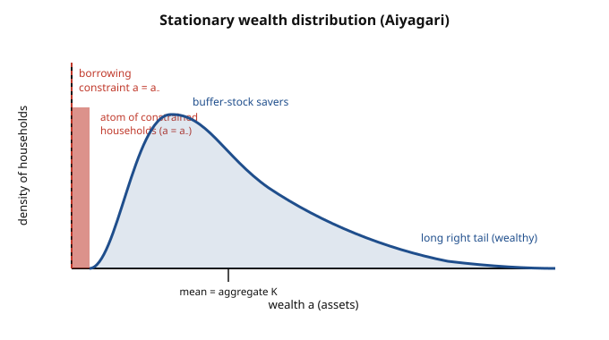

# Grad Macroeconomics · Lesson 6.4: A taste of heterogeneous-agent macro

> ⏱ ~15 min · Module 6: Frictions, policy, and unemployment · Builds on: [6.3 Search and matching: the DMP model](06-03-search-matching-dmp.md) · Unlocks: end of course — see the [syllabus](../syllabus.md) for where to go next (HANK, computational macro, inequality)

## Why this matters

Every model in this course until now has quietly leaned on one household — the *representative agent* — whose Euler equation stands in for the whole economy. That is a spectacular simplification, and for many questions (growth, the average business cycle) it earns its keep. But it makes two things literally impossible to talk about: **inequality** (one agent has no distribution) and **the effect of not being able to insure yourself** against a bad year (one agent bears only aggregate risk, which markets price cleanly).

Drop the representative agent and both come alive. Replace it with a *continuum* of households, each hit by its own idiosyncratic income shocks it can only partly insure against, each up against a borrowing limit. Suddenly the model has a wealth distribution as a genuine object — some households rich, some pinned at zero — and that distribution talks back to prices. This is the frontier of macro, and it is where the recursive toolkit you built in Module 1 finally gets pointed at the messiest, most realistic version of the question. It is also the natural finale: everything folds together here.

## The idea

Take the buffer-stock household from [5.2](05-02-precautionary-saving.md): income $y$ fluctuates randomly, you can't sell claims on your future labor income (markets are **incomplete**), and you can't borrow past some limit $a \geq \underline{a}$. Your best response is to hold a *buffer* of savings — save in good times so a run of bad draws doesn't crush your consumption. That precautionary motive means you save *more* than a household facing the same average income with full insurance would.

Now the Aiyagari move: **put a whole economy of these households side by side.** A continuum of them, each drawing its own income shock independently, each running that same buffer-stock policy. They differ only in their luck-so-far — their current wealth and income state. At any moment the economy is described not by one number but by a *distribution*: how many households sit at each wealth level.

Two things follow, and they are the whole lesson. **First, aggregates shift.** Because *everyone* is saving precautionarily against risk they can't insure, the total capital stock is *higher* than in the representative-agent world — and more capital chasing the same production technology drives the interest rate *lower*. **Second, a nondegenerate distribution emerges and stays put.** Households constantly move around — a bad shock pushes you toward the constraint, good shocks let you rebuild your buffer — but the *shape* of the distribution stops changing. It is a stationary distribution of a Markov process: individuals churn, the histogram holds still. Some households pile up exactly at the borrowing constraint (an atom — a literal spike); most spread out in a right-skewed bell with a long wealthy tail.

## The formal version

**Households.** A continuum (measure one) of infinitely-lived households. Each solves, in recursive form,

$$V(a, y) = \max_{c,\ a'} \Big\{ u(c) + \beta\, \mathbb{E}\big[V(a', y') \mid y\big] \Big\}$$
$$\text{s.t.}\quad c + a' = (1+r)\,a + w\,y, \qquad a' \geq \underline{a},$$

where $a$ is beginning-of-period assets, $y$ is the idiosyncratic labor-income state following a Markov chain, $c$ consumption, $\beta \in (0,1)$ the discount factor, $r$ the interest rate, $w$ the wage, and $\underline{a}$ the borrowing limit. *In words:* this is exactly the [5.2](05-02-precautionary-saving.md) buffer-stock problem — an instance of the stochastic dynamic program from [1.5](01-05-stochastic-dynamic-programming.md) — solved by each household taking prices $(r,w)$ as given. The solution is a policy function $a' = g(a, y)$.

**The distribution as a state.** The policy $g$ plus the income Markov chain induce a transition rule on the *joint distribution* $\lambda(a,y)$ of households across wealth and income. A **stationary distribution** $\lambda^*$ is a fixed point of that rule: push every household one step forward with $g$, and the histogram maps to itself.
$$\lambda^* = T_g\,\lambda^*.$$
*In words:* individuals keep moving, but the population shares at each $(a,y)$ stop changing.

**General equilibrium (Aiyagari).** Firms are the standard neoclassical one: $Y = F(K,L)$, so competitive prices are $r = F_K(K,1) - \delta$ and $w = F_L(K,1)$ (with $L=1$ the fixed labor supply). Equilibrium is a **fixed point in prices**:

$$r \;\Longrightarrow\; g(\cdot;r,w) \;\Longrightarrow\; \lambda^*(\cdot;r) \;\Longrightarrow\; K = \int a \,\, d\lambda^* \;\Longrightarrow\; r = F_K(K,1)-\delta.$$

*In words:* a candidate interest rate implies household policies, which imply a stationary wealth distribution, whose *mean* is aggregate capital $K$; feed that $K$ back through the firm's marginal product and you must recover the interest rate you started with. This is the recursive competitive equilibrium of [1.6](01-06-recursive-competitive-equilibrium.md) — but now the **aggregate state is an entire distribution**, not a single capital stock. That is the conceptual leap.

**Aggregate shocks — Krusell–Smith (sketch).** Add an *aggregate* productivity shock $z$ on top of the idiosyncratic ones. Now prices move with the whole economy, so to forecast tomorrow's prices a household needs to forecast how the *entire distribution* $\lambda$ evolves — an infinite-dimensional state. Their celebrated finding is **approximate aggregation**: households forecast prices almost perfectly using only the *first moment* — the **mean** of the wealth distribution — rather than its full shape. Formally, a regression $\log K' = a_0 + a_1 \log K$ (one per aggregate state $z$) achieves $R^2$ essentially indistinguishable from 1. *In words:* the distribution is infinite-dimensional in principle, but for prices, only its average matters — because the households who hold most of the wealth behave nearly linearly, so their savings aggregate as if there were a representative saver, even though welfare and MPCs do not.

## Picture

The red spike is real economics, not an artifact: a positive *mass* of households sits exactly at the borrowing limit $\underline{a}$, consuming hand-to-mouth. They are the ones with the highest marginal propensity to consume — remember them for Problem 3.

## Worked examples

**Example 1 (why $r < \rho$ — the central comparison).** In a deterministic representative-agent economy at a steady state, the Euler equation forces the interest rate to the household's rate of time preference: with $\beta = 1/(1+\rho)$, the steady state requires $\beta(1+r) = 1$, i.e. $r = \rho$. Capital is pinned exactly where impatience and the return on saving balance.

Now switch on uninsurable idiosyncratic risk. Each household's Euler equation gains a precautionary term (from the convexity of marginal utility, $u''' > 0$):
$$u'(c) = \beta(1+r)\,\mathbb{E}\big[u'(c')\big] \;\geq\; \beta(1+r)\,u'(\mathbb{E}[c']),$$
by Jensen — future marginal utility is *higher* in expectation than at the expected consumption. To satisfy this, households want to save even when $\beta(1+r) < 1$, i.e. even when the market return doesn't compensate their impatience. In aggregate, this extra saving means desired capital supply is larger at every $r$; the asset-market-clearing $r$ therefore lands **strictly below** the complete-markets benchmark:
$$\boxed{\,r^{\text{Aiyagari}} < \rho = r^{\text{rep-agent}}.}$$
*Intuition:* people over-accumulate a buffer against risk they can't shed, the economy ends up capital-rich, and the marginal product of capital — hence $r$ — is bid down. The gap $\rho - r$ is a clean measure of how much precautionary saving the incompleteness generates.

**Example 2 (the Aiyagari algorithm, in words).** You can't solve the fixed point in closed form; you iterate on the price. The loop:

1. **Guess** an interest rate $r_0$ (start below $\rho$). Back out the wage $w_0 = F_L(K_0,1)$ from the implied $K_0 = F_K^{-1}(r_0+\delta)$.
2. **Solve the household problem** at $(r_0, w_0)$: iterate the Bellman/Euler equation to convergence (a contraction, by [1.5](01-05-stochastic-dynamic-programming.md)) to get the savings policy $g(a,y)$.
3. **Find the stationary distribution** $\lambda^*$ induced by $g$ and the income chain — either simulate a large panel of households forward until the histogram settles, or iterate $\lambda \mapsto T_g\lambda$ directly on a grid.
4. **Aggregate**: compute household capital supply $K^{s} = \int a\, d\lambda^*$.
5. **Check market clearing**: does $K^s$ equal the firm's capital demand $K_0$ at $r_0$? Equivalently, does the implied return match $r_0$? If capital supply exceeds demand, $r$ is too high — **lower** $r$ and return to step 1. Repeat until $|K^s - K_0|$ is within tolerance.

The whole thing is a one-dimensional root-find on $r$, with an entire distribution recomputed inside every iteration. That inner-loop cost is why heterogeneous-agent macro is fundamentally computational — there is no phase diagram to draw.

## Watch out

- **The stationary distribution is not a steady state in the [2.3](02-03-ramsey-cass-koopmans.md) sense.** Nothing rests. Every household is perpetually moving through wealth states; only the *cross-sectional shape* is invariant. Confusing "aggregates constant" with "everyone constant" throws away the entire point.
- **Precautionary saving needs $u''' > 0$**, not just risk aversion ($u'' < 0$). Quadratic utility is risk-averse but has $u'''=0$ — it gives certainty-equivalence and *zero* precautionary saving (that's exactly why [5.1](05-01-permanent-income-life-cycle.md)'s permanent-income model with quadratic utility has no buffer motive). The Aiyagari force comes specifically from the convexity of *marginal* utility.
- **Approximate aggregation is an empirical near-miracle, not a theorem.** Krusell–Smith *found* that the mean suffices to near-perfect accuracy in their calibration; it is not guaranteed. In models with more constrained households or bigger nonlinearities (some HANK models), higher moments start to matter and the trick weakens.
- **"Incomplete markets" ≠ "no markets."** Households still save and borrow a single riskless asset; they just can't buy state-contingent claims that fully insure their idiosyncratic income. It's the *missing* insurance markets that do the work.

## One-liner

> Give macro a continuum of households with uninsurable risk and a borrowing limit, and the representative agent shatters into a stationary wealth distribution — everyone over-saves for safety, so capital is high, $r$ is low, and the aggregate state is now the whole histogram.

## Problems

**P1 (🟢)** In one paragraph, explain why introducing *uninsurable idiosyncratic* income risk (holding average income fixed) *raises* aggregate saving and *lowers* the equilibrium interest rate relative to a complete-markets economy. Name the property of the utility function that the argument depends on.

**P2 (🟡)** Describe the Aiyagari stationary equilibrium as a fixed point: list the sequence of objects the interest rate maps through and back to. In this loop, what plays the role of the "aggregate state," and how does it differ from the aggregate state in the recursive competitive equilibrium of [1.6](01-06-recursive-competitive-equilibrium.md)?

**P3 (🔴)** Households pinned at the borrowing constraint consume hand-to-mouth and have a marginal propensity to consume (MPC) near 1, while unconstrained buffer-stock households have low MPCs. Argue why a lump-sum fiscal transfer is *more expansionary* in this heterogeneous-agent economy than in a representative-agent model. Then connect this to the zero-lower-bound fiscal multiplier of [6.1](06-01-monetary-fiscal-nk.md): why do high-MPC households make government spending especially potent when monetary policy can't respond?

Solutions

**P1.** Because idiosyncratic income risk is *uninsurable*, each household bears the full variance of its own income and cannot smooth it away through insurance markets. With a utility function whose marginal utility is convex (**$u''' > 0$** — the prudence property), the *expected* marginal utility of future consumption exceeds the marginal utility at expected consumption (Jensen's inequality). A bad consumption draw hurts more than a symmetric good draw helps, so households self-insure by accumulating a precautionary buffer of assets — they save more than they would with the same average income fully insured. Summed over the continuum, desired asset holdings are larger at every interest rate: the capital-supply schedule shifts out. Market clearing against the firm's downward-sloping capital demand ($r = F_K(K,1)-\delta$) then occurs at a higher $K$ and a lower $r$. Quantitatively, $r$ falls strictly below the discount rate $\rho$ that would clear the complete-markets economy: households accept a return below their impatience because the safety value of the buffer makes up the difference.

**P2.** The fixed point runs:
$$r \;\to\; \text{prices } (r,w) \;\to\; \text{household policy } g(a,y) \;\to\; \text{stationary distribution } \lambda^*(a,y) \;\to\; K = \textstyle\int a\,d\lambda^* \;\to\; r' = F_K(K,1)-\delta,$$
and equilibrium requires $r' = r$ (asset market clears). The **aggregate state is the entire wealth-income distribution $\lambda^*$** — an infinite-dimensional object — whereas the RCE of [1.6](01-06-recursive-competitive-equilibrium.md) had a *single* aggregate capital stock $K$ as its state, because the representative agent has no distribution. The heterogeneous-agent model needs the full histogram (not just its mean) to describe who holds the capital and who is constrained; only its *mean* happens to determine the price in the no-aggregate-shock stationary case, which is what makes the collapse to a one-dimensional root-find on $r$ possible.

**P3.** In a representative-agent model a lump-sum transfer financed by (equivalent-valued) future taxes is close to neutral — the single household smooths the windfall over its infinite horizon and barely changes current consumption (Ricardian equivalence / low MPC out of transitory income). In the heterogeneous-agent economy, a *positive mass* of households sits at the borrowing constraint: they are consumption-constrained, not consumption-smoothing, so their MPC is near 1. A transfer to them is spent almost entirely and immediately. Because the aggregate consumption response is the *distribution-weighted* average of individual MPCs, and that average is pulled up sharply by the constrained mass, aggregate demand rises much more than the representative-agent MPC would predict. The distribution of MPCs — not the average income — is what determines the transfer's punch.

Connection to [6.1](06-01-monetary-fiscal-nk.md): at the zero lower bound the central bank cannot cut the nominal rate to offset a demand change, so the usual crowding-out channel (higher spending → higher rates → lower private demand) is switched off, and the fiscal multiplier is large. Layering in high-MPC constrained households amplifies this further: the extra government spending raises the incomes of hand-to-mouth households, who spend nearly all of it, which raises others' incomes, and so on — a Keynesian-cross multiplier that a low-MPC representative agent would mute. Heterogeneity and the ZLB reinforce each other: constrained agents make the *first-round* spending large, and the pinned interest rate lets the *subsequent rounds* propagate without being choked off. This is precisely the mechanism HANK (Heterogeneous-Agent New Keynesian) models were built to capture.

## Flashback

**From Lesson 5.2 (Precautionary saving / buffer-stock).** A household with CRRA utility $u(c) = c^{1-\gamma}/(1-\gamma)$ faces i.i.d. income $y$ with mean $\bar y$ and can save in a riskless asset at gross return $R = 1+r$ with $\beta R = 1$. Its consumption Euler equation is $u'(c_t) = \beta R\,\mathbb{E}_t[u'(c_{t+1})]$. Show that under income risk the household's *target* wealth is positive (it holds a buffer), whereas with income *certain* at $\bar y$ and $\beta R = 1$ it would want flat consumption and no buffer. Identify the exact term responsible.

Solution

With $\beta R = 1$ the Euler equation reduces to $u'(c_t) = \mathbb{E}_t[u'(c_{t+1})]$. If income were certain, the household could set $c_{t+1} = c_t$ for all $t$ (perfect smoothing), satisfying the Euler equation with equality and requiring *no* precautionary buffer — the certainty-equivalence benchmark.

Under risk, marginal utility is convex: for CRRA, $u'(c) = c^{-\gamma}$ and $u'''(c) = \gamma(\gamma+1)c^{-\gamma-2} > 0$. By Jensen,
$$\mathbb{E}_t[u'(c_{t+1})] > u'\big(\mathbb{E}_t[c_{t+1}]\big).$$
For the Euler equation $u'(c_t) = \mathbb{E}_t[u'(c_{t+1})]$ to hold with the RHS inflated by this convexity, the household must lower $c_t$ (raising $u'(c_t)$) — i.e. consume *less than* expected income today and accumulate assets. This continues until wealth reaches a **target** where the precautionary saving motive (pushing wealth up) exactly balances impatience and the desire to consume (pushing it down). The responsible term is the **convexity of marginal utility, $u''' > 0$ (prudence)**: it is what makes expected future marginal utility exceed marginal utility at the mean, and hence what turns risk into a positive target buffer. This single household is exactly the building block that, aggregated over a continuum, produces the Aiyagari capital stock in this lesson.

## Connections

- **Backward — [5.2](05-02-precautionary-saving.md):** the buffer-stock household *is* the atom of the Aiyagari model; heterogeneous-agent macro is that one problem, solved by a continuum and closed in general equilibrium.
- **Backward — [1.5](01-05-stochastic-dynamic-programming.md) & [1.6](01-06-recursive-competitive-equilibrium.md):** each household's problem is a stochastic dynamic program (a contraction, solved by value/policy iteration), and the equilibrium is a recursive competitive equilibrium — now with a *distribution* as the aggregate state rather than a scalar $K$.
- **Backward — [5.5](05-05-equity-premium-puzzle.md):** uninsurable idiosyncratic risk raises households' *effective* risk aversion (they can't diversify their labor-income risk), so they demand a larger premium to hold risky claims — a partial resolution of the equity-premium puzzle that the representative-agent Lucas tree could not deliver.
- **Sideways — [probability theory](../../probability-theory/syllabus.md):** the stationary wealth distribution is the invariant distribution of a Markov process; existence and uniqueness rest on the same ergodicity machinery you'd meet there.
- **Sideways — [mathematical finance](../../mathematical-finance/syllabus.md):** incomplete markets and uninsurable risk are the core departure from the complete-markets, no-arbitrage world — the same friction, viewed from asset pricing rather than macro aggregation.
- **Forward — the frontier:** adding nominal rigidities ([4.4](04-04-nominal-rigidities-new-keynesian.md)) to this structure gives **HANK** (Heterogeneous-Agent New Keynesian) models, today's workhorse for studying how monetary and fiscal policy transmit through the wealth distribution — and the natural next course after this one.

---

**Course finale.** That closes Grad Macroeconomics. Step back and see the arc: you started with the recursive toolkit in Module 1 — the principle of optimality, the Euler and transversality conditions, stochastic dynamic programming, recursive competitive equilibrium — and everything since has been that same machinery pointed at successively richer questions: growth (Module 2), overlapping generations (3), business cycles and nominal rigidities (4), consumption, investment, and asset pricing (5), and policy and frictions (6). The through-line never changed: **macroeconomics is optimizing agents interacting in equilibrium, solved recursively.** What moves the field forward is putting the realism back in — heterogeneity, incomplete markets, search frictions, bounded rationality — without losing the discipline of general equilibrium. You now have the toolkit to read that frontier. See the [syllabus](../syllabus.md) for suggested next steps.
