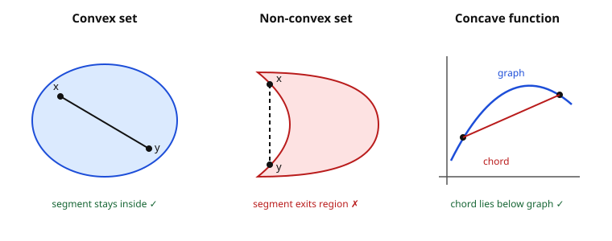

# Grad Microeconomics · Lesson 1.1: Convexity, concavity, and quasiconcavity

> ⏱ ~15 min · Module 1: The optimization toolkit · Builds on: [syllabus](../syllabus.md) · Unlocks: [1.2 Unconstrained and equality-constrained optimization](01-02-unconstrained-equality-constrained-optimization.md)

## Why this matters

Almost every result in first-year micro is an optimization in disguise: consumers maximize utility, firms minimize cost, and a competitive equilibrium is a fixed point of those optima. The theorems that make those problems *tractable* — a first-order condition is enough, the maximizer is unique, a local max is global — all rest on one geometric hypothesis about **curvature**. Get the curvature right and the calculus you'll do in 1.2 and 1.3 is not just necessary but sufficient. This lesson is the vocabulary: convex sets (well-behaved feasible regions), concave objectives (well-behaved payoffs), and the subtler, ordinal cousin — quasiconcavity — that is *exactly* what utility theory needs and no more.

## The idea

Three pictures, one theme: **averages beat extremes.**

- A **convex set** is a region with no dents: pick any two points in it, and the straight line between them never leaves. A filled disk is convex; a crescent moon is not.
- A **concave function** is a dome (think a hill): the straight chord connecting two points on the graph sags *below* the graph. Averaging two inputs does at least as well as averaging the two outputs — diminishing returns made geometric. A **convex function** is the bowl: the chord rides *above* the graph. They're mirror images — flip a dome and you get a bowl, so $f$ concave $\iff -f$ convex.
- **Quasiconcavity** keeps only the *shape of the level sets*, forgetting how tall the hill is. A function is quasiconcave if every "at least this high" region is convex — a single connected mesa with no separate peaks. Crucially, this survives any monotone relabeling of the output: stretch the height axis however you like and the mesas stay mesas. That's why it's the right notion for **preferences**, which are ordinal — utility numbers are just labels for "better than," and only the *ranking* is real.

The punchline you'll cash in for the rest of the course: concave $\Rightarrow$ quasiconcave, but **not** the reverse. Utility theory lives in that gap.

## The formal version

Throughout, $x, y \in \mathbb{R}^n$ are points (bundles), and $\lambda \in [0,1]$ is a weight. The point $\lambda x + (1-\lambda) y$ is a **convex combination** — a weighted average sweeping the segment from $y$ ($\lambda=0$) to $x$ ($\lambda=1$).

**Convex set.** A set $C \subseteq \mathbb{R}^n$ is *convex* if for all $x, y \in C$ and all $\lambda \in [0,1]$,
$$\lambda x + (1-\lambda) y \in C.$$
*In words:* the whole segment between any two members stays inside — no dents, no holes, no gaps.

**Concave function.** Let $f$ have a convex domain. $f$ is *concave* if for all $x, y$ and $\lambda \in [0,1]$,
$$f\big(\lambda x + (1-\lambda) y\big) \ \geq\ \lambda f(x) + (1-\lambda) f(y),$$
and *strictly* concave if the inequality is strict whenever $x \neq y$ and $\lambda \in (0,1)$. Reverse the inequality ($\leq$) and $f$ is *convex*. *In words:* the function of the average is at least the average of the function — the graph bulges above its chords. Note $f$ concave $\iff -f$ convex, so every fact below has a mirror.

**Jensen's inequality.** For concave $f$ and a random input $X$, $\ f(\mathbb{E}[X]) \geq \mathbb{E}[f(X)]$. *In words:* a risk-averse agent (concave utility) prefers the sure average to the gamble — this single line *is* risk aversion.

**Second-order test (the workhorse).** For $f \in C^2$ on an open convex domain, let $H(x)$ be the Hessian (matrix of second partials $\partial^2 f / \partial x_i \partial x_j$). Then
$$f \text{ concave} \iff H(x) \text{ negative semidefinite for all } x,$$
and $H(x)$ **negative definite** for all $x$ $\Rightarrow$ $f$ strictly concave. *In words:* concavity is just "the second derivative is $\leq 0$" upgraded to many dimensions — the quadratic form $v^\top H v \leq 0$ curves you downward in every direction. (Definiteness of quadratic forms is the [linalg-refresher](../../linalg-refresher/syllabus.md) machinery; wheel it in here.)

- **1-D:** $f'' \leq 0$ everywhere $\iff$ concave; $f'' < 0 \Rightarrow$ strictly concave.
- **2-D leading-principal-minor test.** Write $H = \begin{pmatrix} f_{xx} & f_{xy} \\ f_{xy} & f_{yy}\end{pmatrix}$. It is **negative definite** iff $f_{xx} < 0$ and $\det H = f_{xx}f_{yy} - f_{xy}^2 > 0$ (leading minors alternate $-,+$). It is **negative semidefinite** iff $f_{xx} \leq 0$, $f_{yy} \leq 0$, and $\det H \geq 0$.

**Quasiconcavity.** $f$ is *quasiconcave* if every upper contour set is convex:
$$U_a = \{\,x : f(x) \geq a\,\} \text{ is convex for every } a \in \mathbb{R}.$$
Equivalently, $f(\lambda x + (1-\lambda)y) \geq \min\{f(x), f(y)\}$. *In words:* moving toward an average never drops you below the worse of the two endpoints — the "at least $a$" regions are single convex mesas. **Every concave function is quasiconcave**, and quasiconcavity is preserved by any strictly increasing transformation $g \circ f$ — which concavity is *not*.

**Bordered Hessian (the quasiconcavity test, stated now, used in 1.2).** For $f \in C^2$, border the Hessian with the gradient:
$$\bar H = \begin{pmatrix} 0 & \nabla f^\top \\ \nabla f & H \end{pmatrix}.$$
Quasiconcavity on the positive orthant is diagnosed by a sign pattern on the leading principal minors of $\bar H$ (they must alternate in a fixed way). *In words:* it's the definiteness test restricted to directions *along the level set* — we'll deploy it in [1.2](01-02-unconstrained-equality-constrained-optimization.md) where the constraint picks out exactly those directions.

## Picture

## Worked examples

**Example 1 (mechanical — Cobb–Douglas is concave, barely).** Test $f(x,y) = x^{1/2} y^{1/2}$ on the positive orthant $x, y > 0$. First derivatives:
$$f_x = \tfrac{1}{2}x^{-1/2}y^{1/2}, \qquad f_y = \tfrac{1}{2}x^{1/2}y^{-1/2}.$$
Second derivatives:
$$f_{xx} = -\tfrac{1}{4}x^{-3/2}y^{1/2}, \quad f_{yy} = -\tfrac{1}{4}x^{1/2}y^{-3/2}, \quad f_{xy} = \tfrac{1}{4}x^{-1/2}y^{-1/2}.$$
Now the minors. $f_{xx} < 0$ and $f_{yy} < 0$ (good so far), and
$$\det H = f_{xx}f_{yy} - f_{xy}^2 = \tfrac{1}{16}x^{-1}y^{-1} - \tfrac{1}{16}x^{-1}y^{-1} = 0.$$
So $H$ is negative **semi**definite (not definite): $f$ is **concave but not strictly concave**. The $\det H = 0$ is the geometric fingerprint of constant returns to scale — the surface is a ridge, dead flat along every ray from the origin. This same $f$ is also quasiconcave (concave always is), so its indifference curves $\{xy = c\}$ bound convex upper contour sets — the textbook convex-to-the-origin isoquants.

**Example 2 (why you'd care — quasiconcave but not concave).** Take $g(x,y) = xy$ on the positive orthant. Its Hessian is $\begin{pmatrix} 0 & 1 \\ 1 & 0 \end{pmatrix}$, with $\det = -1 < 0$: **indefinite**, so $g$ is neither concave nor convex (along the diagonal $y=x$ it curves *up* like a bowl). And yet $g = (x^{1/2}y^{1/2})^2$ — it's the strictly increasing transform $t \mapsto t^2$ applied to the concave $f$ of Example 1. Monotone transforms preserve quasiconcavity, so $g$ **is** quasiconcave: same convex upper contour sets $\{xy \geq a\}$, same indifference map, opposite concavity verdict.

That is the whole ordinal point in one example. A consumer with utility $f = \sqrt{xy}$ and one with utility $g = xy$ have *identical preferences* — every choice they ever make agrees — because $g$ is just a relabeling of $f$'s output. Demanding concavity would let you distinguish them; demanding only quasiconcavity does not, and preferences can't tell them apart either. So **quasiconcavity is exactly the right amount of structure** for consumer theory: it encodes "averages are (weakly) preferred to extremes" — convex preferences — without smuggling in cardinal content the theory doesn't have. In [micro-refresher](../../micro-refresher/syllabus.md)'s consumer chapter, *convex preferences $\iff$ quasiconcave utility* is precisely this.

## Watch out

- **You might think** negative-definite is required for concavity, **but actually** concavity only needs negative *semi*definite ($v^\top H v \leq 0$). Cobb–Douglas (Example 1) has $\det H = 0$ everywhere and is genuinely concave. Negative definite buys you the *strict* concavity that guarantees a *unique* maximizer — a stronger, separate prize.
- **You might think** the leading-principal-minor sign test that certifies *definiteness* also certifies *semi*definiteness, **but actually** it doesn't. For semidefiniteness you must check *all* principal minors (including non-leading ones), not just the leading ones — a leading-minors-only check can pass on a matrix that isn't NSD. Use leading minors for the strict (definite) verdict; be careful with the weak one.
- **You might think** quasiconcave means concave-ish, so first-order conditions are automatically sufficient, **but actually** quasiconcavity alone does *not* make a critical point a maximum ($f(x)=x^3$ is quasiconcave on $\mathbb{R}$ with a non-max critical point at $0$). It guarantees that the set of maximizers is convex and that *on a convex feasible set the constrained optimum is global* — the sufficiency you'll prove in 1.3 needs the constraint structure, not just the objective.

## One-liner

> Concave is a dome (chords sag below); quasiconcave keeps only the convex "at-least-this-good" mesas and survives any relabeling of height — which is why utility theory, being ordinal, asks for quasiconcavity and nothing more.

## Problems

**P1 (🟢)** Classify $f(x,y) = -x^2 - 2y^2 + xy$ on $\mathbb{R}^2$ as concave, convex, or neither. Is it *strictly* so?

**P2 (🟡)** Consider $u(x,y) = \ln x + \ln y$ on the positive orthant. (a) Show $u$ is concave. (b) Show that $u$ and the $g(x,y)=xy$ of Example 2 represent the *same* preferences, and say which one a strictly-increasing transform turns into the other.

**P3 (🔴, optional)** Prove directly from the definitions that every concave function is quasiconcave. Then give a one-line function showing the converse fails, and identify the property of *preferences* (not utility) that quasiconcavity is the exact utility-side counterpart of.

Solutions

**P1** Hessian is constant: $f_{xx} = -2$, $f_{yy} = -4$, $f_{xy} = 1$, so
$$H = \begin{pmatrix} -2 & 1 \\ 1 & -4 \end{pmatrix}.$$
Leading principal minors: $D_1 = -2 < 0$ and $D_2 = \det H = (-2)(-4) - (1)^2 = 8 - 1 = 7 > 0$. The signs alternate $-, +$, which is the **negative-definite** pattern. So $f$ is **strictly concave** on all of $\mathbb{R}^2$. (Sanity check: the lone $+xy$ cross term isn't large enough to overpower the two strong negative curvatures — $|f_{xy}|$ small relative to $\sqrt{f_{xx}f_{yy}}$.)

**P2** (a) $u_x = 1/x$, $u_y = 1/y$, so $u_{xx} = -1/x^2 < 0$, $u_{yy} = -1/y^2 < 0$, $u_{xy} = 0$. Then $\det H = (1/x^2)(1/y^2) - 0 = 1/(x^2y^2) > 0$ with $u_{xx}<0$: **negative definite**, so $u$ is strictly concave.
(b) $u(x,y) = \ln x + \ln y = \ln(xy) = \ln g(x,y)$, and $t \mapsto \ln t$ is strictly increasing on $t>0$. So $u = \ln \circ\, g$ is a strictly increasing transform of $g$ (equivalently $g = e^{u}$ turns $u$ back into $g$). A strictly increasing transform leaves the preference ranking untouched, so $u$ and $g$ — and also the $f=\sqrt{xy}$ of Example 1 — all represent **the same preferences**. Note the contrast: $u$ is concave, $g$ is not, yet they are preference-equivalent. Concavity is not preserved by the transform; the shared **quasiconcavity** is.

**P3** *Claim: $f$ concave $\Rightarrow$ $f$ quasiconcave.* Fix any $a \in \mathbb{R}$ and take $x, y \in U_a = \{z : f(z) \geq a\}$, so $f(x) \geq a$ and $f(y) \geq a$. For any $\lambda \in [0,1]$, concavity gives
$$f(\lambda x + (1-\lambda)y) \ \geq\ \lambda f(x) + (1-\lambda) f(y) \ \geq\ \lambda a + (1-\lambda) a \ =\ a.$$
So $\lambda x + (1-\lambda)y \in U_a$: the upper contour set $U_a$ is convex. As $a$ was arbitrary, every upper contour set is convex, i.e. $f$ is quasiconcave. $\blacksquare$

*Converse fails:* $f(x) = x^3$ on $\mathbb{R}$ is quasiconcave (it's strictly increasing, so every $U_a$ is a half-line $[a^{1/3}, \infty)$, which is convex) but not concave ($f'' = 6x > 0$ for $x>0$, a convex stretch). 

*Preference counterpart:* quasiconcavity of a utility function is the exact utility-side image of **convex preferences** — the assumption that upper contour sets (weakly-preferred sets) are convex, i.e. *averages are weakly preferred to extremes*. It is ordinal (transform-invariant), which is why it, and not concavity, is the standard axiom.

## Connections

- **Forward (1.2 / 1.3):** these curvature conditions are what turn the first-order conditions of [1.2](01-02-unconstrained-equality-constrained-optimization.md) from *necessary* into *sufficient*. Concave objective + convex feasible set $\Rightarrow$ every stationary point is a global max; strict concavity $\Rightarrow$ it's unique. The bordered Hessian stated here is the tool 1.2 uses to check quasiconcavity along a constraint, and 1.3's KKT sufficiency theorem is this lesson's payoff.
- **Sideways (consumer theory, 2.1):** *convex preferences $\iff$ quasiconcave utility $\iff$ convex upper contour sets* — the demand-theory backbone, foreshadowed by Example 2. Diminishing marginal rates of substitution is just concavity/quasiconcavity read off the indifference map.
- **Sideways ([linalg-refresher](../../linalg-refresher/syllabus.md)):** the whole second-order story is definiteness of the quadratic form $v^\top H v$ — eigenvalue signs and principal-minor tests. Concavity $=$ "$H \preceq 0$ everywhere."
- **Sideways ([real-analysis](../../real-analysis/syllabus.md)):** curvature gives you the *shape* of the optimum, but *existence* comes from elsewhere — a continuous function on a compact (closed and bounded) feasible set attains its max (Weierstrass). Quasiconcavity + compact convex constraint is the standard existence-and-uniqueness package you'll lean on repeatedly.
