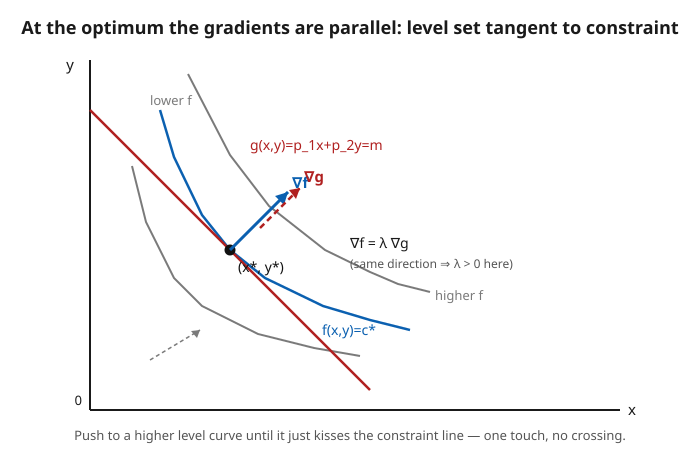

# Grad Microeconomics · Lesson 1.2: Unconstrained and equality-constrained optimization

> ⏱ ~15 min · Module 1: The optimization toolkit · Builds on: [1.1 Convexity, concavity, and quasiconcavity](01-01-convexity-concavity-quasiconcavity.md) · Unlocks: [1.3 Inequality constraints: Kuhn–Tucker](01-03-inequality-constraints-kuhn-tucker.md)

## Why this matters

Almost every object in this course is the solution to "maximize something subject to a constraint": a consumer maximizes utility on a budget, a firm minimizes cost at a target output, a planner maximizes welfare given resources. Before we can *prove* things about demand, cost, and equilibrium, we need a reliable machine that takes an objective plus a constraint and returns the optimum — together with a diagnostic that certifies we found a *max* and not a saddle. That machine is the Lagrangian, and its multiplier $\lambda$ is not bookkeeping: it's a price, the marginal value of loosening the constraint. Lesson 2.2 is literally this lesson with utility plugged in.

## The idea

Start with no constraint. To find the top of a smooth hill $f$, walk until the ground is flat in every direction — the gradient is zero. That's a *stationary point*, but flatness alone doesn't distinguish a peak from a valley floor or a saddle; you also need the surface to curve *downward* around you. Curvature is what the Hessian measures, and 1.1 already told us the punchline: if $f$ is concave, every flat spot is a global summit, no further checking required.

Now add a constraint — you may only stand on a fenced path $g(x)=b$. The trick is to imagine the level curves of $f$ (equal-height contours) and slide along the fence. As long as the fence *crosses* a contour, you can step along it to a higher one, so you're not done. You stop exactly where the fence runs *tangent* to a contour — one touch, no crossing. At that kiss point the fence and the contour share the same tangent line, so their perpendiculars line up: **the gradient of $f$ points the same direction as the gradient of $g$.** They're parallel, and the proportionality constant is $\lambda$. That single geometric fact is the entire method of Lagrange multipliers.

## The formal version

Let $f:\mathbb{R}^n\to\mathbb{R}$ be the **objective** ($x=(x_1,\dots,x_n)$ the choice vector), and write $\nabla f(x)=\big(\partial f/\partial x_1,\dots,\partial f/\partial x_n\big)$ for its **gradient** and $H_f(x)=\big[\partial^2 f/\partial x_i\partial x_j\big]$ for its **Hessian** (matrix of second partials).

**Unconstrained optimum.** If $x^*$ is an interior local max of $f$, then

$$\nabla f(x^*)=0 \quad\text{(FOC)}, \qquad H_f(x^*)\ \text{is negative semidefinite (SOC)}.$$

Sufficiency: if $\nabla f(x^*)=0$ and $H_f(x^*)$ is *negative definite*, $x^*$ is a strict local max. *In words:* flat ground is necessary; downward curvature in every direction makes it a genuine peak. And if $f$ is concave everywhere, any stationary point is a **global** max — the local certificate upgrades to global for free (that's the payoff of 1.1's concavity).

**Equality-constrained optimum.** To maximize $f(x)$ subject to $g(x)=b$, form the **Lagrangian**

$$\mathcal{L}(x,\lambda)=f(x)-\lambda\big(g(x)-b\big),$$

where $\lambda\in\mathbb{R}$ is the **multiplier**. The first-order conditions are $\nabla_x\mathcal{L}=0$ and $\partial\mathcal{L}/\partial\lambda=0$, i.e.

$$\nabla f(x^*)=\lambda\,\nabla g(x^*),\qquad g(x^*)=b.$$

*In words:* at the optimum the objective's gradient is a scalar multiple of the constraint's gradient (parallel gradients / tangency), and the constraint holds. Setting $\partial\mathcal{L}/\partial\lambda=0$ just re-imposes the constraint — the Lagrangian bundles "find the tangency" and "stay on the fence" into one stationarity problem.

**Reading $\lambda$ (shadow price).** Let $V(b)=f(x^*(b))$ be the optimal value as the constraint level $b$ moves. Then

$$\frac{dV}{db}=\lambda.$$

*In words:* $\lambda$ is the marginal value of relaxing the constraint by one unit — the shadow price of the resource $b$. (This is the envelope theorem, developed properly in [1.4](01-04-envelope-theorem-duality.md); note it here so the multiplier means something.)

**Second-order condition: the bordered Hessian.** Tangency is necessary, not sufficient — you could be at the tangent *low* point. The correct curvature test checks $H_f$ only on directions that stay on the constraint (the tangent subspace $\{v:\nabla g\cdot v=0\}$), and the tidy way to do it is the **bordered Hessian**. With one constraint and two variables,

$$\bar H=\begin{pmatrix}0 & g_x & g_y\\ g_x & \mathcal{L}_{xx} & \mathcal{L}_{xy}\\ g_y & \mathcal{L}_{yx} & \mathcal{L}_{yy}\end{pmatrix}.$$

For $n$ variables and $m$ constraints, examine the last $n-m$ leading principal minors of $\bar H$:

- **constrained max:** their signs alternate, ending with the sign of the full determinant equal to $(-1)^n$;
- **constrained min:** they all share the sign $(-1)^m$.

*In words:* the border encodes "stay on the fence," and the sign pattern of $\det\bar H$ tells you whether the constrained curvature bends down (max) or up (min). For the common $n=2,\,m=1$ case this collapses to a one-line check: $\det\bar H>0\Rightarrow$ max, $\det\bar H<0\Rightarrow$ min. This is exactly definiteness of $\mathcal{L}$'s Hessian *restricted to the tangent subspace* — see [`linalg-refresher`](../../linalg-refresher/syllabus.md) on quadratic forms.

## Picture

## Worked examples

**Example 1 (the consumer problem — this *is* Marshallian demand).** Maximize Cobb–Douglas $f(x,y)=x^a y^b$ (with $a,b>0$) subject to the budget $p_1 x+p_2 y=m$, where $p_1,p_2$ are prices and $m$ is income. Lagrangian:

$$\mathcal{L}=x^a y^b-\lambda\,(p_1 x+p_2 y-m).$$

FOCs:

$$a\,x^{a-1}y^{b}=\lambda p_1,\qquad b\,x^{a}y^{b-1}=\lambda p_2,\qquad p_1 x+p_2 y=m.$$

Divide the first by the second to kill $\lambda$ and the messy powers:

$$\frac{a\,y}{b\,x}=\frac{p_1}{p_2}\ \Longrightarrow\ p_2 y=\frac{b}{a}\,p_1 x.$$

*This ratio is the tangency condition:* the marginal rate of substitution $\tfrac{f_x}{f_y}=\tfrac{ay}{bx}$ equals the price ratio $\tfrac{p_1}{p_2}$. Substitute into the budget: $p_1 x\big(1+\tfrac{b}{a}\big)=m$, so

$$\boxed{\,x^*=\frac{a}{a+b}\frac{m}{p_1},\qquad y^*=\frac{b}{a+b}\frac{m}{p_2}\,}$$

— the demand functions we'll name in 2.2. Note the clean fact they encode: $p_1 x^*=\tfrac{a}{a+b}m$ and $p_2 y^*=\tfrac{b}{a+b}m$, so a Cobb–Douglas consumer spends **constant expenditure shares** $\tfrac{a}{a+b},\tfrac{b}{a+b}$ regardless of prices. The multiplier, from the first FOC, is $\lambda=\dfrac{a\,(x^*)^{a-1}(y^*)^b}{p_1}$ — the marginal utility of income, i.e. how much more utility one extra unit of $m$ buys. (Since $x^*,y^*\propto m$, the optimal utility $V=(x^*)^a(y^*)^b\propto m^{a+b}$, so $\lambda=dV/dm=(a+b)V/m>0$.)

**Example 2 (nearest point — solve, then certify with the bordered Hessian).** Find the point on the line $x+2y=10$ closest to the origin, i.e. minimize $f(x,y)=x^2+y^2$ subject to $g(x,y)=x+2y=10$.

$$\mathcal{L}=x^2+y^2-\lambda(x+2y-10),\qquad 2x=\lambda,\quad 2y=2\lambda,\quad x+2y=10.$$

So $x=\tfrac{\lambda}{2}$, $y=\lambda$, and $\tfrac{\lambda}{2}+2\lambda=\tfrac{5\lambda}{2}=10\Rightarrow \lambda=4$, giving $x^*=2,\ y^*=4$. Geometrically $\nabla f=(2x,2y)$ points radially outward and $\nabla g=(1,2)$ is normal to the line — at $(2,4)$ they're parallel, as they must be. Now certify it's a **min**, not a max, with the bordered Hessian. Here $\mathcal{L}_{xx}=2,\ \mathcal{L}_{yy}=2,\ \mathcal{L}_{xy}=0,\ g_x=1,\ g_y=2$:

$$\bar H=\begin{pmatrix}0&1&2\\1&2&0\\2&0&2\end{pmatrix},\qquad \det\bar H=-1(1\cdot2-0\cdot2)+2(1\cdot0-2\cdot2)=-2-8=-10.$$

With $n=2,m=1$ the minimum rule wants sign $(-1)^m=-1$: indeed $\det\bar H=-10<0$, so $(2,4)$ is a constrained minimum. ✓ Finally read $\lambda$: the optimal value is $V(b)=$ min of $x^2+y^2$ on $x+2y=b$, which equals $b^2/5$ (squared distance from origin to that line), so $dV/db=2b/5=20/5=4=\lambda$ — the multiplier is exactly the shadow price of pushing the line outward.

## Watch out

- **You might think** stationarity means "maximum." **Actually** $\nabla f=0$ (or the tangency $\nabla f=\lambda\nabla g$) is satisfied at maxima, minima, *and* saddles alike. You must add a curvature check (Hessian / bordered Hessian) — *unless* concavity of $f$ on a convex constraint set hands you the max globally for free. Never report a Lagrange solution as "the max" without one of those two justifications.
- **You might think** the sign of $\lambda$ is a convention you can ignore. **Actually** with the convention $\mathcal{L}=f-\lambda(g-b)$, a positive $\lambda$ means relaxing $b$ *raises* the optimal value ($dV/db=\lambda>0$) — normal for a binding "more resource is good" constraint. If you write $\mathcal{L}=f+\lambda(\dots)$ instead, $\lambda$ flips sign and so does its interpretation. Pick one convention and stay in it; the shadow-price reading depends on it.
- **You might think** the tangency condition always applies. **Actually** it needs a **constraint qualification**: $\nabla g(x^*)\neq 0$, so the constraint actually pins down a direction to be tangent to. If $\nabla g=0$ at the candidate, the Lagrange equations can fail to characterize the optimum. (And this whole lesson assumes the optimum is *interior* — corners, where a constraint like $x\ge 0$ binds, need the inequality machinery of [1.3](01-03-inequality-constraints-kuhn-tucker.md).)

## One-liner

> At a constrained optimum the objective's gradient is parallel to the constraint's — that's Lagrange — and the multiplier is the price you'd pay for one more unit of the constraint.

## Problems

**P1 (🟢)** Maximize the unconstrained $f(x,y)=6x+8y-x^2-y^2$. Find the stationary point, classify it with the Hessian, and state why it is a *global* max.

**P2 (🟡)** A consumer has utility $U(x,y)=x^{1/3}y^{2/3}$, faces prices $p_1=2,\ p_2=4$, and income $m=24$. Set up the Lagrangian, solve for the optimal bundle $(x^*,y^*)$ and the multiplier $\lambda$, and verify the expenditure shares match $\tfrac{a}{a+b},\tfrac{b}{a+b}$.

**P3 (🔴, optional)** Maximize $f(x,y)=\ln x+\ln y$ subject to $x+y=10$. Solve for $(x^*,y^*)$ and $\lambda$; then (a) confirm it is a maximum using the bordered Hessian, and (b) verify directly that $\lambda=dV/db$ at $b=10$, where $V(b)$ is the optimal value on $x+y=b$.

Solutions

**P1** FOC: $f_x=6-2x=0\Rightarrow x^*=3$; $f_y=8-2y=0\Rightarrow y^*=4$. Hessian $H_f=\begin{pmatrix}-2&0\\0&-2\end{pmatrix}$, which is negative definite (both eigenvalues $-2<0$), so $(3,4)$ is a strict local max. It is **global** because $H_f$ is negative definite *everywhere* — constant and negative-definite — so $f$ is (strictly) concave on all of $\mathbb{R}^2$, and by 1.1 a stationary point of a concave function is a global max. Value: $f(3,4)=18+32-9-16=25$.

**P2** Here $a=\tfrac13,\ b=\tfrac23$, so $a+b=1$. Lagrangian $\mathcal{L}=x^{1/3}y^{2/3}-\lambda(2x+4y-24)$. Using the demand formulas from Example 1 (or solving the FOCs directly):

$$x^*=\frac{a}{a+b}\frac{m}{p_1}=\frac{1/3}{1}\cdot\frac{24}{2}=4,\qquad y^*=\frac{b}{a+b}\frac{m}{p_2}=\frac{2/3}{1}\cdot\frac{24}{4}=4.$$

Multiplier from the first FOC $a\,x^{a-1}y^b=\lambda p_1$: $\ \tfrac13\,x^{-2/3}y^{2/3}=\tfrac13 (y/x)^{2/3}=\tfrac13(4/4)^{2/3}=\tfrac13$ at the optimum, so $\tfrac13=2\lambda\Rightarrow\lambda=\tfrac16$. (Check with the second FOC: $\tfrac23 x^{1/3}y^{-1/3}=\tfrac23(x/y)^{1/3}=\tfrac23=4\lambda\Rightarrow\lambda=\tfrac16$. ✓) Expenditure shares: $p_1x^*=2\cdot4=8=\tfrac13(24)$ and $p_2y^*=4\cdot4=16=\tfrac23(24)$ — shares $\tfrac13,\tfrac23=\tfrac{a}{a+b},\tfrac{b}{a+b}$. ✓

**P3** $\mathcal{L}=\ln x+\ln y-\lambda(x+y-10)$. FOC: $\tfrac1x=\lambda,\ \tfrac1y=\lambda\Rightarrow x=y$, and $x+y=10\Rightarrow x^*=y^*=5$, $\lambda=\tfrac15$.

(a) With $g=x+y$: $g_x=g_y=1$, and $\mathcal{L}_{xx}=-1/x^2=-\tfrac1{25}$, $\mathcal{L}_{yy}=-\tfrac1{25}$, $\mathcal{L}_{xy}=0$. Then

$$\bar H=\begin{pmatrix}0&1&1\\1&-\tfrac1{25}&0\\1&0&-\tfrac1{25}\end{pmatrix},\quad \det\bar H=-1\!\left(-\tfrac1{25}-0\right)+1\!\left(0+\tfrac1{25}\right)=\tfrac1{25}+\tfrac1{25}=\tfrac2{25}>0.$$

For $n=2,m=1$ the maximum rule wants $\det\bar H$ with sign $(-1)^n=+1$: it is positive, so $(5,5)$ is a constrained **max**. ✓ (Equivalently, $\ln x+\ln y$ is strictly concave and the constraint set is convex, so tangency already gives the global max — the bordered Hessian just confirms the local machinery agrees.)

(b) On $x+y=b$ symmetry gives $x^*=y^*=b/2$, so $V(b)=2\ln(b/2)$ and $dV/db=2\cdot\tfrac{1}{b}=\tfrac2b$. At $b=10$: $dV/db=\tfrac2{10}=\tfrac15=\lambda$. ✓ The multiplier is the shadow price of the resource.

## Connections

- **Forward:** [1.3](01-03-inequality-constraints-kuhn-tucker.md) replaces "$g(x)=b$" with "$g(x)\le b$," turning the single tangency equation into the Kuhn–Tucker conditions with complementary slackness — this lesson is the equality-only special case where every constraint binds. [1.4](01-04-envelope-theorem-duality.md) makes the shadow-price fact $dV/db=\lambda$ a theorem (the envelope theorem) and builds duality on it.
- **Sideways (consumer theory):** Example 1 *is* the utility-maximization problem — [2.2](02-02-utility-maximization-marshallian-demand.md) takes those demand functions $x^*(p,m)$ and calls them Marshallian demand, then extracts the indirect utility function and Roy's identity from the very $\lambda$ we computed.
- **Backward (linear algebra):** the bordered-Hessian test is definiteness of a quadratic form restricted to the constraint's tangent subspace — the quadratic-forms and definiteness toolkit from [`linalg-refresher`](../../linalg-refresher/syllabus.md), reused as a second-order condition.
- **Sideways (physics, for fun):** the same Lagrange multiplier reappears in analytical mechanics as the magnitude of a *constraint force* — the reaction that keeps a bead on a wire is mathematically the $\lambda$ that keeps a consumer on a budget. Different subject, identical algebra.
- See the [syllabus](../syllabus.md) for where Module 1 is heading (Boss problem 1 chains FOC → KKT → envelope in one exercise).
