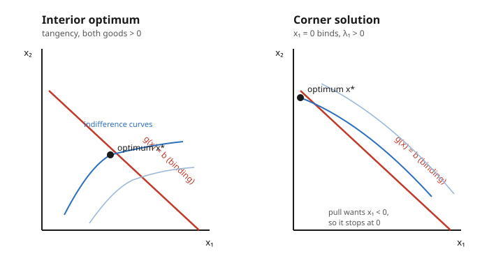

# Grad Microeconomics · Lesson 1.3: Inequality constraints — the Kuhn–Tucker conditions

> ⏱ ~15 min · Module 1: The optimization toolkit · Builds on: [1.2 Unconstrained and equality-constrained optimization](01-02-unconstrained-equality-constrained-optimization.md) · Unlocks: [1.4 The envelope theorem and duality](01-04-envelope-theorem-duality.md)

## Why this matters

Equality constraints ("spend *exactly* your income") are a convenient fiction. Real economic agents face *inequalities*: you can spend up to your budget, hold a nonnegative quantity of every good, produce no more than capacity allows. And the interesting answers live at the edges — a consumer who buys *zero* of a good, a firm that leaves a resource *unused*, a constraint that *doesn't bind*. Lagrange from [1.2](01-02-unconstrained-equality-constrained-optimization.md) can't see these; it assumes every constraint is tight. The Kuhn–Tucker (KKT) conditions are the upgrade that handles "$\le$" honestly, and their central idea — **complementary slackness** — is the engine behind demand functions, shadow prices, and every constrained model in the course.

## The idea

Picture the consumer's problem geometrically: climb utility as high as possible without leaving the budget set. Two things can stop you.

- You hit the **budget line** and can't afford to go higher — the budget constraint *binds*. Spending one more dollar would buy you $\lambda$ more utils, so $\lambda > 0$ is the constraint's **shadow price**: what you'd pay to relax it.
- You hit a **wall of the box** — you'd like *negative* quantity of some good, but $x_i \ge 0$ forbids it, so you stop at zero. That's a **corner solution**: the nonnegativity constraint binds because the unconstrained pull wanted to send $x_i$ below zero.

The unifying principle is dead simple once said aloud: **you never pay for a constraint that isn't tight.** If a constraint is slack — you have budget to spare, or you're holding a strictly positive amount — then relaxing it buys you nothing, so its shadow price is zero. If its shadow price is positive, the constraint must be exactly tight. A constraint is *either* binding with a positive multiplier *or* slack with a zero multiplier, never both, never neither. That "either/or" is complementary slackness, and it converts the vague question "which constraints matter here?" into a system of equations you can actually solve.

## The formal version

**The problem.** Maximize $f(x)$ over $x = (x_1,\dots,x_n)$ subject to $m$ inequality constraints and nonnegativity:

$$\max_{x} \ f(x) \quad \text{s.t.} \quad g_j(x) \le b_j \ (j=1,\dots,m), \qquad x_i \ge 0 \ (i=1,\dots,n).$$

Here $f$ is the objective (utility, profit), $g_j(x)\le b_j$ a resource limit (spending $\le$ income), and $x_i\ge0$ says quantities can't go negative.

**The Lagrangian.** Attach a multiplier $\lambda_j \ge 0$ to each inequality:

$$L(x,\lambda) = f(x) + \sum_{j=1}^m \lambda_j\,\bigl(b_j - g_j(x)\bigr).$$

Note $\partial L/\partial x_i = \partial f/\partial x_i - \sum_j \lambda_j\,\partial g_j/\partial x_i$: the marginal gain in the objective, net of the marginal cost charged by every constraint the good uses.

**KKT conditions.** A point $x^*$ with multipliers $\lambda^*$ is a *KKT point* if:

1. **Stationarity** (for each nonnegative variable $x_i$):
$$\frac{\partial L}{\partial x_i} \le 0, \qquad x_i \ge 0, \qquad x_i\cdot\frac{\partial L}{\partial x_i} = 0.$$
*In words:* either you consume the good ($x_i>0$) and its marginal net value is exactly zero, or its marginal net value is negative and you consume none ($x_i=0$). (A variable free in sign instead gets the plain equality $\partial L/\partial x_i = 0$ — that's Lagrange from 1.2 recovered.)

2. **Primal feasibility:** $g_j(x^*)\le b_j$ and $x_i^*\ge 0$. *In words:* the answer actually satisfies the constraints.

3. **Dual feasibility:** $\lambda_j^* \ge 0$. *In words:* shadow prices are nonnegative — loosening a constraint can never hurt.

4. **Complementary slackness:** $\lambda_j^*\,\bigl(b_j - g_j(x^*)\bigr) = 0$ for each $j$. *In words:* for every constraint, either it binds ($g_j = b_j$) or its multiplier is zero — no paying for slack.

**Sufficiency (the clean case).** If $f$ is concave (or quasiconcave with $\nabla f\neq 0$) and every $g_j$ is convex — so the feasible set is convex, exactly the structure [1.1](01-01-convexity-concavity-quasiconcavity.md) flagged as the guarantee of clean optima — then **any KKT point is a global maximum.** *In words:* under convexity, solving the KKT algebra isn't just necessary, it's the whole answer.

**Necessity needs a constraint qualification.** If $x^*$ is a local max, KKT multipliers exist *provided* a constraint qualification (CQ) holds — e.g. **Slater's condition** for convex problems (there exists a strictly interior feasible point $\tilde x$ with $g_j(\tilde x) < b_j$ for all $j$), or **LICQ** (the gradients of the active constraints are linearly independent at $x^*$). Without a CQ, a genuine maximum can fail to be a KKT point: e.g. $\max\ x$ s.t. $x^3 \le 0$ has optimum $x=0$, yet stationarity $1 - \lambda\cdot 3x^2 = 1 = 0$ is unsolvable because the constraint gradient vanishes there (LICQ fails).

## Picture

Left: the highest indifference curve is tangent to the budget line in the interior — both goods positive, only the budget constraint binds. Right: the consumer's pull points off the edge (it "wants" $x_1<0$), so the optimum slides up the $x_2$-axis to the corner where $x_1=0$ binds and its multiplier turns positive.

## Worked examples

**Example 1 (a corner solution — perfect substitutes).** Maximize $u = 3x_1 + 2x_2$ s.t. $2x_1 + x_2 \le 10$, with $x_1,x_2\ge 0$ (prices $2$ and $1$, income $10$).

$$L = 3x_1 + 2x_2 + \lambda(10 - 2x_1 - x_2).$$

Stationarity: $\partial L/\partial x_1 = 3 - 2\lambda \le 0$ and $\partial L/\partial x_2 = 2 - \lambda \le 0$.

The "bang per buck" is $3/2 = 1.5$ for good 1 versus $2/1 = 2$ for good 2, so guess $x_2>0$. Then its stationarity holds with equality: $2-\lambda=0 \Rightarrow \lambda = 2$. Check good 1: $3 - 2(2) = -1 < 0$, so complementary slackness *forces* $x_1 = 0$. Since $\lambda = 2 > 0$, the budget binds: $x_2 = 10$.

**Answer:** $x^* = (0, 10)$, $u = 20$, $\lambda = 2$. The consumer buys none of good 1 — a corner. And $\lambda=2$ is the shadow price of income: one more dollar buys $2$ more utils. Because $u$ is linear (hence concave) and the constraints linear (convex set), sufficiency applies — this is the global max, no second-order check needed.

**Example 2 (complementary slackness toggling — a quota that may or may not bind).** Maximize $u = \ln x + \ln y$ s.t. a budget $x + y \le m$ *and* a quota $x \le \bar x$ (with $x,y>0$, so the $\ln$'s keep us off the axes). Prices normalized to $1$.

$$L = \ln x + \ln y + \lambda(m - x - y) + \mu(\bar x - x).$$

Interior stationarity: $\dfrac1x - \lambda - \mu = 0$ and $\dfrac1y - \lambda = 0$. Comp. slack.: $\lambda(m-x-y)=0$, $\ \mu(\bar x - x)=0$, with $\lambda,\mu\ge0$.

*Quota slack* ($m=10,\ \bar x = 8$): guess $\mu = 0$. Then $1/x = \lambda = 1/y \Rightarrow x=y$, and the binding budget gives $x=y=5$. Check the quota: $x=5 \le 8$ ✓, and $\mu(\bar x - x) = 0\cdot 3 = 0$ ✓. **Solution $(5,5)$, $\lambda = 0.2$, $\mu = 0$** — you wouldn't pay a cent to relax a quota you're not hitting.

*Quota binding* ($m=10,\ \bar x = 3$): now the unconstrained interior $x=5$ violates $x\le3$, so guess $\mu>0 \Rightarrow x = 3$; the budget gives $y = 7$. From the $y$-equation $\lambda = 1/7 \approx 0.143$. From the $x$-equation $\mu = \tfrac13 - \tfrac17 = \tfrac{4}{21} \approx 0.19 > 0$ ✓. **Solution $(3,7)$, quota shadow price $\mu \approx 0.19$** — relaxing the quota by one unit raises utility by about $0.19$.

Same problem, one parameter changed, and complementary slackness flips $\mu$ from $0$ to positive. This is precisely the machinery Boss Problem 1 asks you to run, and the shadow price $\mu$ is what [1.4](01-04-envelope-theorem-duality.md)'s envelope theorem will let you read off without re-solving.

## Watch out

- **You might think a slack constraint's multiplier could be anything.** It's exactly zero. If $g_j(x^*) < b_j$, complementary slackness $\lambda_j(b_j-g_j)=0$ forces $\lambda_j=0$. Nonzero multipliers live only on binding constraints — and multipliers are always $\ge 0$; a *negative* $\lambda$ means you set up a sign backwards.
- **You might think you can just guess which constraints bind and stop.** Guessing is fine — *verifying* is mandatory. After assuming a binding pattern, you must check the whole KKT list: dual feasibility ($\lambda\ge0$), primal feasibility (the ignored constraints still hold), and the stationarity inequalities. Example 1's $x_1=0$ was *confirmed* by $3-2\lambda<0$, not assumed.
- **You might think a KKT point is automatically the maximum.** Only under concavity of $f$ and convexity of the feasible set. Maximize the *convex* $f=x^2+y^2$ on a convex set and the interior KKT point is a *minimum*, with the real max at a corner (P3). And necessity itself needs a constraint qualification — no CQ, and a true max can fail to be a KKT point at all.

## One-liner

> At an optimum every constraint is either binding with a positive shadow price or slack with a zero one — complementary slackness turns "which constraints matter?" into algebra, and under concavity plus a constraint qualification the KKT conditions pin down the global max.

## Problems

**P1 (🟢)** Maximize $u = 5x + 4y$ s.t. $2x + y \le 8$, $x,y\ge0$. Write the KKT conditions, find the optimum, and give the shadow price of income. Is any nonnegativity constraint binding?

**P2 (🟡)** Maximize $u = x^{1/2}y^{1/2}$ s.t. $x + y \le 10$ and $x \le 3$, with $x,y>0$. Does the quota $x\le 3$ bind? Find $x^*, y^*$ and both multipliers $\lambda$ (budget) and $\mu$ (quota).

**P3 (🔴, optional)** Maximize $f(x,y) = x^2 + y^2$ s.t. $x + y \le 1$, $x,y\ge0$. Find the interior KKT point, then evaluate $f$ at the corners $(1,0)$ and $(0,1)$. Which is the true maximum, and why did KKT "point to" the wrong place? Tie your answer to the sufficiency condition from [1.1](01-01-convexity-concavity-quasiconcavity.md).

Solutions

**P1** $L = 5x + 4y + \lambda(8 - 2x - y)$. Stationarity: $5 - 2\lambda \le 0$, $\ 4 - \lambda \le 0$. Bang-per-buck: $5/2 = 2.5$ vs $4/1 = 4$, so good $y$ dominates — guess $y>0 \Rightarrow 4-\lambda = 0 \Rightarrow \lambda = 4$. Then good $x$: $5 - 2(4) = -3 < 0$, so complementary slackness forces $x = 0$. Budget binds ($\lambda>0$): $y = 8$.
**Answer:** $x^*=(0,8)$, $u=32$, shadow price of income $\lambda = 4$. Yes — the nonnegativity constraint $x\ge0$ binds (that's the corner). Linear objective + linear constraint ⇒ global max by sufficiency.

**P2** $L = x^{1/2}y^{1/2} + \lambda(10 - x - y) + \mu(3 - x)$. Ignoring the quota, the symmetric Cobb–Douglas optimum is $x=y=5$, which violates $x\le3$ — so the quota binds, $x=3$; the binding budget gives $y=7$.
Marginal utilities: $u_x = \tfrac12 (y/x)^{1/2} = \tfrac12\sqrt{7/3}\approx0.764$, $\ u_y = \tfrac12(x/y)^{1/2} = \tfrac12\sqrt{3/7}\approx0.327$.
Stationarity: $u_y = \lambda \Rightarrow \lambda \approx 0.327$; $\ u_x = \lambda + \mu \Rightarrow \mu = 0.764 - 0.327 \approx 0.437 > 0$ ✓ (so the quota indeed binds — consistent).
**Answer:** $x^*=3,\ y^*=7$, budget shadow price $\lambda\approx0.33$, quota shadow price $\mu\approx0.44$. Relaxing the quota one unit is worth more at the margin than an extra dollar of income, because you're forced away from the good you'd otherwise want more of.

**P3** $L = x^2 + y^2 + \lambda(1 - x - y)$. Interior stationarity: $2x - \lambda = 0$, $2y-\lambda=0 \Rightarrow x=y=\lambda/2$. Binding budget $x+y=1 \Rightarrow x=y=\tfrac12$, $\lambda=1$, $f = \tfrac14+\tfrac14 = \tfrac12$.
But $f(1,0) = 1$ and $f(0,1) = 1$ — both corners beat the KKT point. The true maximum is at a **corner** ($f=1$); the interior KKT point $(\tfrac12,\tfrac12)$ is actually the *minimum* of $f$ along the budget line.
**Why:** $f = x^2+y^2$ is **convex**, not concave, so the sufficiency theorem doesn't apply — a KKT point of a maximization need not be a max. Maximizing a convex function over a convex set drives you to an extreme point, which the stationarity condition (built to find interior flat spots) can't see. Concavity of $f$ is exactly the hypothesis that rules this out; lesson [1.1](01-01-convexity-concavity-quasiconcavity.md) is why we always check it first.

## Flashback

**From Lesson 1.2 (equality-constrained optimization):** Solve $\max\ x^{1/3}y^{2/3}$ s.t. $4x + 2y = 24$ using a Lagrangian, and report the multiplier. (Different numbers than anything above — set it up fresh.)

Solution

$L = x^{1/3}y^{2/3} + \lambda(24 - 4x - 2y)$. FOCs give the tangency condition MRS = price ratio:
$$\frac{u_x}{u_y} = \frac{\tfrac13 x^{-2/3}y^{2/3}}{\tfrac23 x^{1/3}y^{-1/3}} = \frac{y}{2x} = \frac{4}{2} = 2 \ \Rightarrow\ y = 4x.$$
Budget: $4x + 2(4x) = 12x = 24 \Rightarrow x^* = 2,\ y^* = 8$ (the Cobb–Douglas share rule agrees: spend fraction $\tfrac13$ of income on $x$, so $4x = 8$). Utility $u = 2^{1/3}8^{2/3} = 2^{1/3}\cdot 4 = 2^{7/3}\approx 5.04$.
Multiplier: $\lambda = u_x/4 = \tfrac13 (2)^{-2/3}(8)^{2/3}/4 = \tfrac13\cdot\tfrac{4}{2^{2/3}}/4 = \tfrac{1}{3\cdot 2^{2/3}}\approx 0.21$ — the marginal utility of a dollar of income, matching the shadow-price reading KKT gives to a binding budget.

## Connections

- **Backward:** KKT contains [1.2](01-02-unconstrained-equality-constrained-optimization.md) as the special case where every constraint binds (all $\lambda_j$ free, stationarity an equality), and it leans on [1.1](01-01-convexity-concavity-quasiconcavity.md) — concavity + convex feasible set is exactly what upgrades "KKT point" to "global max."
- **Forward:** [1.4](01-04-envelope-theorem-duality.md) shows the multipliers $\lambda,\mu$ *are* the derivatives of the optimal value with respect to $b$ and $\bar x$ — the shadow-price reading made rigorous by the envelope theorem. Consumer theory ([2.2](02-02-utility-maximization-marshallian-demand.md) onward) *is* KKT: Marshallian demand is the solution to this exact problem, corner solutions and all.
- **Sideways (game theory):** the same KKT algebra underlies constrained best responses and mechanism-design problems in [`grad-game-theory`](../../grad-game-theory/syllabus.md), where incentive and participation constraints bind or slacken just like budgets here.
- **Sideways (linear algebra):** the second-order check for a KKT max — the objective's Hessian, restricted to the directions the binding constraints leave free — is the definiteness-on-a-subspace test from [`linalg-refresher`](../../linalg-refresher/syllabus.md), the same bordered-Hessian machinery [1.2](01-02-unconstrained-equality-constrained-optimization.md) used.
