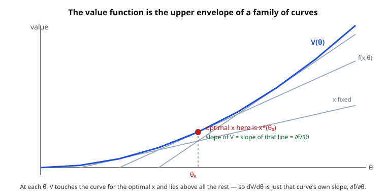

# Grad Microeconomics · Lesson 1.4: The envelope theorem and duality

> ⏱ ~15 min · Module 1: The optimization toolkit · Builds on: [1.3 Inequality constraints: Kuhn–Tucker](01-03-inequality-constraints-kuhn-tucker.md) · Unlocks: [1.5 Monotone comparative statics and dynamic programming](01-05-monotone-comparative-statics-dynamic-programming.md)

## Why this matters

Nearly every object in consumer and producer theory is a *value function* — the best you can do given the environment. Indirect utility, the expenditure function, cost, profit: each is "$\max$ (or $\min$) over choices, holding parameters fixed." The recurring question is not *what* the optimal choice is but *how the optimal value moves* when a price, an income, or a resource limit shifts. The envelope theorem answers that with a shortcut so clean it feels illegal — you differentiate as if the choice variable were frozen. And it hands you the interpretation of the Lagrange multiplier you have been circling since 1.2: the multiplier is a price. Roy's identity, Shephard's lemma, Hotelling's lemma — the whole duality apparatus of Modules 2 and 3 — are this one theorem wearing different clothes.

## The idea

You are standing at the top of a hill whose shape you can tilt with a dial $\theta$. Your job: for each dial setting, walk to the highest point and record the altitude. That record is the value function $V(\theta)$.

Now nudge the dial. Your altitude changes for two reasons: the hilltop you were standing on moved (the *direct* effect of $\theta$), **and** the whole landscape reshaped so your old spot is no longer the peak, tempting you to re-walk (the *indirect* effect, through re-optimizing). The envelope theorem says: for a small nudge, **ignore the second effect entirely.** Why? Because you were standing exactly at the top — and at the top, the ground is flat. Taking a small step to chase the new peak buys you nothing to first order (that is what "top" means). So only the direct tilt survives.

That is the entire content. $V$ inherits its slope from the *direct* dependence of the objective on the parameter, evaluated at the current optimum — the re-optimization is a second-order afterthought.

## The formal version

**The value function.** Let $f(x,\theta)$ be an objective with choice variable $x$ and parameter $\theta$. Define

$$V(\theta) = \max_{x} f(x,\theta), \qquad x^*(\theta) = \arg\max_{x} f(x,\theta).$$

*In words:* $V$ is the best attainable objective at parameter $\theta$; $x^*(\theta)$ is the choice that attains it.

**Envelope theorem (unconstrained).** If $x^*(\theta)$ is an interior maximizer where $\partial f/\partial x = 0$, and things are smooth, then

$$\frac{dV}{d\theta} = \frac{\partial f}{\partial \theta}\Big|_{x = x^*(\theta)}.$$

*In words:* to find how the optimal value responds to $\theta$, differentiate the objective with respect to $\theta$ only — treating the optimal choice as a constant — and plug in the optimizer.

**Proof (the derivative-of-a-max, in three lines).** $V(\theta) = f(x^*(\theta),\theta)$. Differentiate with the chain rule:

$$\frac{dV}{d\theta} = \underbrace{\frac{\partial f}{\partial x}}_{=\,0\text{ at }x^*}\cdot\frac{dx^*}{d\theta} + \frac{\partial f}{\partial \theta} = \frac{\partial f}{\partial \theta}\Big|_{x^*}.$$

The first term dies because the first-order condition $\partial f/\partial x = 0$ holds at an interior optimum. That single cancellation *is* the theorem.

**Constrained version.** Let $V(\theta) = \max_x f(x,\theta)$ subject to $g(x,\theta) = b$, with Lagrangian $\mathcal{L}(x,\lambda,\theta) = f(x,\theta) + \lambda\big(b - g(x,\theta)\big)$. Then at the optimum,

$$\frac{dV}{d\theta} = \frac{\partial \mathcal{L}}{\partial \theta}\Big|_{x^*,\lambda^*}.$$

*In words:* the same shortcut, but differentiate the *Lagrangian* (not the bare objective) with respect to $\theta$, freezing $x$ and $\lambda$. The indirect effects through the re-optimizing $x^*$ cancel here too — the multiplier term is exactly what absorbs the movement along the constraint.

**The punchline — the multiplier is the shadow price.** Take the parameter to be the constraint bound itself, $\theta = b$. Since $\partial \mathcal{L}/\partial b = \lambda$,

$$\boxed{\;\frac{dV}{db} = \lambda^*\;}$$

*In words:* $\lambda^*$ is the rate at which the optimal value rises when you relax the constraint by one unit — the marginal value, or **shadow price**, of the constrained resource. Its units are "value per unit of $b$." This is the promise made in [1.2](01-02-unconstrained-equality-constrained-optimization.md) and [1.3](01-03-inequality-constraints-kuhn-tucker.md), now delivered.

## Picture

Fix a choice $x$ and plot the objective $f(x,\theta)$ as $\theta$ varies — one curve per $x$. The value function $V(\theta) = \max_x f(x,\theta)$ is the **upper envelope**: at each $\theta$ it rides on whichever curve is currently on top, i.e. the one whose $x$ is optimal there. Two facts fall out. First, because $V$ merely *touches* the winning curve (and lies above the losers), its slope at that point equals the winning curve's own slope — that is the envelope theorem, geometrically. Second, when each $f(x,\cdot)$ is a straight line (objective affine in $\theta$), $V$ is a max of lines, hence **convex**. That is exactly why profit and expenditure functions are convex/concave in prices — see the duality note below.

## Worked examples

**Example 1 (mechanical — the theorem verified by hand).** Let $V(\theta) = \max_x\big(2\theta x - x^2\big)$. The FOC is $2\theta - 2x = 0 \Rightarrow x^*(\theta) = \theta$, giving $V(\theta) = 2\theta\cdot\theta - \theta^2 = \theta^2$, so $dV/d\theta = 2\theta$.

Now the envelope shortcut: $\partial f/\partial\theta = 2x$, and evaluated at $x^* = \theta$ that is $2\theta$. Identical — and we never had to differentiate $x^*(\theta)$. The indirect channel contributed nothing, as promised.

**Example 2 (why you'd care — indirect utility, seeding 2.2).** A consumer maximizes Cobb–Douglas utility $u(x_1,x_2) = x_1^{a} x_2^{1-a}$ (with $0 < a < 1$) subject to the budget $p_1 x_1 + p_2 x_2 = m$. The Lagrangian is $\mathcal{L} = x_1^a x_2^{1-a} + \lambda(m - p_1 x_1 - p_2 x_2)$, and the familiar solution (from [1.2](01-02-unconstrained-equality-constrained-optimization.md)) is the Marshallian demand

$$x_1^*(p,m) = \frac{a\,m}{p_1}, \qquad x_2^*(p,m) = \frac{(1-a)\,m}{p_2}.$$

Substituting back gives the **indirect utility function** $V(p,m) = \max_x u$ s.t. budget:

$$V(p,m) = \Big(\tfrac{a m}{p_1}\Big)^{a}\Big(\tfrac{(1-a)m}{p_2}\Big)^{1-a} = \kappa\,\frac{m}{p_1^{a}\,p_2^{1-a}}, \qquad \kappa \equiv a^{a}(1-a)^{1-a}.$$

Two envelope checks. Here $m$ plays the role of the constraint bound $b$, so we expect $\partial V/\partial m = \lambda^*$, the marginal utility of income:

$$\frac{\partial V}{\partial m} = \kappa\,p_1^{-a}p_2^{-(1-a)} = \frac{V}{m}.$$

Differentiate the Lagrangian directly and you find $\partial\mathcal{L}/\partial m = \lambda$, confirming $\lambda^* = V/m$: one extra dollar of income buys $V/m$ extra utils. And the price derivative, via $\partial\mathcal{L}/\partial p_1 = -\lambda x_1$:

$$\frac{\partial V}{\partial p_1} = -\lambda^*\,x_1^* = -\frac{V}{m}\cdot\frac{a m}{p_1} = -\frac{aV}{p_1}.$$

Divide the two to recover demand from the value function alone:

$$-\frac{\partial V/\partial p_1}{\partial V/\partial m} = -\frac{-aV/p_1}{V/m} = \frac{a m}{p_1} = x_1^*(p,m).$$

That last identity is **Roy's identity**, and you just derived it from nothing but the envelope theorem. Lesson 2.2 (see the [syllabus](../syllabus.md)) develops it in full — you have now seen its engine.

## Watch out

- **The indirect effect vanishes *only* at an interior optimum where the FOC holds.** The whole trick is the cancellation $\partial f/\partial x = 0$. At a corner or a kink (a binding non-negativity constraint, a non-differentiable objective) that term is not zero, and blindly applying the shortcut gives the wrong slope. The Kuhn–Tucker machinery of [1.3](01-03-inequality-constraints-kuhn-tucker.md) is exactly where you check which regime you are in.
- **Total derivative, not partial.** $dV/d\theta$ is a *total* derivative — it already includes everything, because the envelope theorem has done the accounting for you and shown the indirect part is zero. Do not "add back" a $\partial f/\partial x \cdot dx^*/d\theta$ term; you would be double-counting a term that is already zero.
- **The multiplier carries units.** $\lambda^* = dV/db$ is "value per unit of $b$": utils per dollar of income, output per unit of a scarce input, dollars per unit of a quota. When a problem's numbers look off by a factor, check that you are comparing shadow prices in consistent units, not raw multipliers from differently scaled constraints.

## One-liner

> At an optimum the choice is already flat, so the value function's slope is pure direct effect — and when the parameter is a constraint bound, that slope is the multiplier, i.e. the resource's shadow price.

## Problems

**P1 (🟢)** Let $V(a) = \max_{x>0}\big(a\ln x - x\big)$. Find $x^*(a)$ and $V(a)$, compute $dV/da$ directly, then verify the envelope theorem gives the same answer without differentiating $x^*$.

**P2 (🟡)** A planner maximizes output $f(x,y) = x^{1/3}y^{2/3}$ subject to a resource constraint $x + y = b$. Solve for the optimum, find the value function $V(b)$ and the multiplier $\lambda^*$, and confirm $dV/db = \lambda^*$. State the units of $\lambda^*$ in words.

**P3 (🔴, optional)** A firm chooses input $x \ge 0$ to maximize profit $\pi(p,w) = \max_x\big(p\,x^{1/2} - w\,x\big)$, where $p$ is the output price and $w$ the input price. Find the optimal input and profit. Then show (i) $\partial\pi/\partial p$ equals the optimal output $q^* = (x^*)^{1/2}$ — this is Hotelling's lemma — and (ii) $\pi$ is convex in $p$. Which upcoming lesson does this preview?

Solutions

**P1** FOC: $a/x - 1 = 0 \Rightarrow x^*(a) = a$. Then $V(a) = a\ln a - a$, so directly

$$\frac{dV}{da} = \ln a + a\cdot\frac{1}{a} - 1 = \ln a.$$

Envelope: $\partial f/\partial a = \ln x$, evaluated at $x^* = a$ gives $\ln a$. ✓ The direct route needed the product rule and a cancellation; the envelope route read the slope straight off $\partial f/\partial a$.

**P2** Lagrangian $\mathcal{L} = x^{1/3}y^{2/3} + \lambda(b - x - y)$. FOCs:

$$\tfrac{1}{3}x^{-2/3}y^{2/3} = \lambda, \qquad \tfrac{2}{3}x^{1/3}y^{-1/3} = \lambda.$$

Dividing eliminates $\lambda$: $\tfrac{1}{2}\,\tfrac{y}{x} = 1 \Rightarrow y = 2x$. With $x + y = b$: $3x = b$, so $x^* = b/3$, $y^* = 2b/3$. The value function:

$$V(b) = \Big(\tfrac{b}{3}\Big)^{1/3}\Big(\tfrac{2b}{3}\Big)^{2/3} = b\,\big(\tfrac{1}{3}\big)^{1/3}\big(\tfrac{2}{3}\big)^{2/3} = C\,b, \qquad C = \tfrac{1}{3}\,2^{2/3}.$$

(The last simplification: $(1/3)^{1/3}(2/3)^{2/3} = 2^{2/3}(1/3)^{1/3+2/3} = 2^{2/3}/3$.) So $dV/db = C = \tfrac{1}{3}2^{2/3}$. Now the multiplier at the optimum:

$$\lambda^* = \tfrac{1}{3}(x^*)^{-2/3}(y^*)^{2/3} = \tfrac{1}{3}\Big(\tfrac{b}{3}\Big)^{-2/3}\Big(\tfrac{2b}{3}\Big)^{2/3} = \tfrac{1}{3}\,2^{2/3} = C.$$

So $dV/db = \lambda^*$. ✓ (Constant returns to scale make $V$ linear in $b$, so $\lambda^*$ is constant.) Units: $\lambda^*$ is **units of output per unit of the resource** — the marginal output the planner gains by loosening the resource budget by one unit, i.e. its shadow price.

**P3** FOC: $\tfrac{p}{2}x^{-1/2} - w = 0 \Rightarrow x^{1/2} = \tfrac{p}{2w} \Rightarrow x^*(p,w) = \tfrac{p^2}{4w^2}$. Optimal output $q^* = (x^*)^{1/2} = \tfrac{p}{2w}$. Profit:

$$\pi(p,w) = p\cdot\tfrac{p}{2w} - w\cdot\tfrac{p^2}{4w^2} = \frac{p^2}{2w} - \frac{p^2}{4w} = \frac{p^2}{4w}.$$

(i) $\dfrac{\partial\pi}{\partial p} = \dfrac{2p}{4w} = \dfrac{p}{2w} = q^*$ — the derivative of the profit function with respect to output price is the optimal supply. This is Hotelling's lemma, and it is just the envelope theorem applied with $\theta = p$: $\partial\mathcal{L}/\partial p = x^{1/2} = q$, evaluated at $x^*$. (ii) $\dfrac{\partial^2\pi}{\partial p^2} = \dfrac{1}{2w} > 0$, so $\pi$ is convex in $p$ — matching the "max of lines is convex" picture, since profit is a max of terms affine in $p$. This previews Lesson 3.3, Profit maximization and supply.

## Flashback

**From Lesson 1.2 (Unconstrained and equality-constrained optimization):** Maximize $f(x,y) = xy$ subject to $x + y = b$. First treat $b = 10$: solve for $x^*, y^*$ and the multiplier $\lambda^*$. Then, *before computing $V(b)$*, predict $dV/db$ from $\lambda^*$ — and verify by finding $V(b)$ in closed form.

Solution

Lagrangian $\mathcal{L} = xy + \lambda(b - x - y)$. FOCs: $y = \lambda$ and $x = \lambda$, so $x = y$; the constraint $x + y = b$ gives $x^* = y^* = b/2$ and $\lambda^* = b/2$. At $b = 10$: $x^* = y^* = 5$, $\lambda^* = 5$.

Prediction: $dV/db = \lambda^* = b/2 = 5$ at $b = 10$. Verify: $V(b) = x^*y^* = (b/2)^2 = b^2/4$, so $dV/db = b/2$ — matching $\lambda^*$ for every $b$, and equal to $5$ at $b = 10$. ✓ The multiplier read off the constrained problem *was* the marginal value of relaxing the constraint, no re-solving required.

## Connections

- **Backward:** this closes the loop opened in [1.2](01-02-unconstrained-equality-constrained-optimization.md) and [1.3](01-03-inequality-constraints-kuhn-tucker.md), where $\lambda$ appeared as bookkeeping in the Lagrangian; it is the shadow price $dV/db$. The convexity of the envelope (max of affine curves) reaches back to [1.1](01-01-convexity-concavity-quasiconcavity.md).
- **Forward:** the entire duality architecture of Modules 2–3 is this theorem repeated (see the [syllabus](../syllabus.md) for the map). **Roy's identity** (2.2, $x_i = -\partial_{p_i}V / \partial_m V$) and **Shephard's lemma** (2.3, $h_i = \partial_{p_i} e$) come from differentiating indirect utility and the expenditure function; **Hotelling's** and **Shephard's** lemmas for the firm (3.2, 3.3) do the same for cost and profit. The **primal–dual** structure — a $\max$ problem paired with a $\min$ problem sharing the same value (utility $\leftrightarrow$ expenditure, profit $\leftrightarrow$ cost) — is previewed here: a value function that is a *max* of affine-in-price objectives is convex (profit in prices), a *min* is concave (expenditure and cost in prices); indirect utility is quasiconvex in prices. Legendre–Fenchel **conjugacy** is the general statement that these paired convex/concave value functions determine each other.
- **Sideways:** the "differentiate the value function, ignore the re-optimization" move is the same idea as the Hamilton–Jacobi value function in classical mechanics, where the action's derivatives return momentum and energy — the envelope theorem is economics' version of that. The clean cancellation also rests on the smoothness and interior-optimum hypotheses of `real-analysis` (the implicit function theorem guarantees a differentiable $x^*(\theta)$ in the first place).
