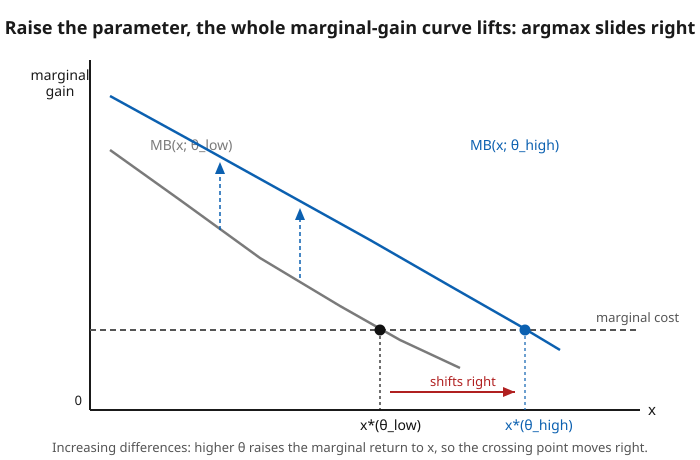

# Grad Microeconomics · Lesson 1.5: Monotone comparative statics and dynamic programming

> ⏱ ~15 min · Module 1: The optimization toolkit · Builds on: [1.4 The envelope theorem and duality](01-04-envelope-theorem-duality.md) · Unlocks: [2.1 Preferences and utility representation](02-01-preferences-utility-representation.md)

## Why this matters

Two workhorses close out the toolkit. The first answers the question comparative statics keeps asking — *when a parameter rises, does the optimal choice rise?* — but answers it **without** the crutches the implicit function theorem demands (smoothness, concavity, an interior optimum). That robustness is exactly what you want when preferences are only ordinal or the choice set is discrete. The second, dynamic programming, turns an infinite-horizon optimization — a wall of choice variables stretching into the future — into a *single* recursive equation you can actually solve. You will meet the first idea everywhere in consumer and producer theory and again in the maximum theorem behind general-equilibrium existence; the second is the tool that makes intertemporal problems tractable.

## The idea

**Comparative statics, ordinally.** Suppose raising your choice $x$ is *more attractive the higher a parameter $\theta$ gets* — think of $x$ = machines and $\theta$ = the price of the good they produce: more valuable output makes each extra machine worth more. That property, "$x$ and $\theta$ are complements," is called **increasing differences**. The punchline (Topkis): whenever it holds, the optimal $x$ can only move *with* $\theta$ — up when $\theta$ goes up, never down. No derivatives, no concavity, no interior solution required. You get the *direction* of the comparative static for free from the sign of a complementarity, even when you can't compute the optimum at all.

**Optimizing over time, recursively.** A planner choosing consumption for all eternity faces infinitely many variables. The trick: today's problem is a smaller copy of tomorrow's. Bundle "everything from tomorrow on" into a single number — the **value** of arriving at next period's state — and today collapses to one choice: pick the action maximizing *today's reward plus the discounted value of where it leaves you*. That self-referential equation is the **Bellman equation**, and because the future is discounted ($\beta<1$), solving it by repeated substitution *converges* — the same contraction-mapping logic that made Newton's method and fixed-point iteration work in `real-analysis`.

## The formal version

### A. Monotone comparative statics

**Increasing differences.** Let $f:X\times\Theta\to\mathbb{R}$ with $X,\Theta\subseteq\mathbb{R}$ ordered. $f$ has **increasing differences** in $(x,\theta)$ if for all $x''\ge x'$ and $\theta''\ge\theta'$,
$$f(x'',\theta'')-f(x',\theta'')\;\ge\;f(x'',\theta')-f(x',\theta').$$
*In words:* the gain from stepping $x'\to x''$ is at least as large at the higher parameter $\theta''$ as at the lower $\theta'$ — a higher $\theta$ makes extra $x$ pay more. (On $\mathbb{R}^n$ the same property within each coordinate pair is **supermodularity**.)

**Smooth characterization.** If $f$ is $C^2$, then increasing differences $\iff \dfrac{\partial^2 f}{\partial x\,\partial\theta}\ge 0$ everywhere.
*In words:* the cross-partial is just the marginal-of-a-marginal — how the marginal return to $x$ changes as $\theta$ rises. Nonnegative means the marginal-gain curve lifts with $\theta$.

**Topkis's monotonicity theorem.** If $X$ is a lattice, $f$ has increasing differences in $(x,\theta)$, and $x^*(\theta)=\operatorname*{arg\,max}_{x\in X} f(x,\theta)$, then $x^*(\theta)$ is **nondecreasing** in $\theta$ (in the strong set order when the argmax is set-valued).
*In words:* complementarity alone forces the optimal choice to move the same direction as the parameter. Contrast the IFT route to comparative statics, which needs $f$ smooth, strictly concave, and an interior optimum, then signs $dx^*/d\theta$ from second-order conditions. Topkis is the **ordinal, robust** version — it survives kinks, corners, and discrete choice sets that break the IFT entirely.

**The Maximum Theorem (Berge).** Let $f:X\times\Theta\to\mathbb{R}$ be continuous and $\Gamma:\Theta\rightrightarrows X$ a continuous (upper *and* lower hemicontinuous), compact-valued constraint correspondence. Then the value function $V(\theta)=\max_{x\in\Gamma(\theta)}f(x,\theta)$ is continuous, and the argmax correspondence $x^*(\theta)$ is nonempty, compact-valued, and **upper hemicontinuous**.
*In words:* if the objective is continuous and the feasible set varies nicely and stays compact, the best attainable value moves continuously and the optimal choice can't jump discontinuously out of nowhere. **Compactness** (from `real-analysis`) is what guarantees the max exists in the first place; this theorem is the existence-and-continuity backbone under general equilibrium (Lesson 4.3).

### B. Dynamic programming

**Sequential problem.** Choose actions $\{a_t\}$ to maximize $\sum_{t=0}^{\infty}\beta^t\, r(s_t,a_t)$ subject to the transition $s_{t+1}=g(s_t,a_t)$, with state $s_t$, discount $\beta\in(0,1)$, and $a_t\in\Gamma(s_t)$.

**Bellman equation (recursive form).**
$$V(s)=\max_{a\in\Gamma(s)}\ \Big\{\, r(s,a)+\beta\, V\big(g(s,a)\big)\,\Big\}.$$
*In words:* the best lifetime value of starting at state $s$ equals, over today's actions, the best of {today's reward $+$ discounted best value of the state you move to}. The **value function** $V$ prices each state; the **policy function** $a^*(s)$ is the maximizing action — a time-invariant rule "what to do in state $s$."

**Existence, uniqueness, and value iteration.** Define the Bellman operator $(TW)(s)=\max_{a\in\Gamma(s)}\{r(s,a)+\beta W(g(s,a))\}$ on the complete metric space of bounded continuous functions (sup norm). **Blackwell's sufficient conditions** — $T$ is monotone ($W\le W'\Rightarrow TW\le TW'$) and discounts ($T(W+c)=TW+\beta c$) — make $T$ a **contraction of modulus $\beta$**. By the Banach fixed-point theorem (`real-analysis`), $V$ exists, is unique, and **value iteration** $V_{n+1}=TV_n$ converges from *any* bounded start:
$$\lVert V_n-V\rVert\;\le\;\beta^{\,n}\,\lVert V_0-V\rVert.$$
*In words:* because $\beta<1$, each pass of the Bellman update shrinks your error by a factor $\beta$, so iterating from a wild guess marches geometrically to the one true value function.

## Picture

## Worked examples

**Example 1 (MCS with no calculus, then confirmed by the cross-partial).** A firm picks an integer capacity $x\in\{0,1,2,3\}$; the payoff is $f(x,\theta)=\theta x-x^2$, where $\theta$ measures demand strength. Read the optimal $x$ straight off a table — *no derivatives*:

| $x$ | $f(x,2)$ | $f(x,4)$ | $f(x,6)$ |
|---|---|---|---|
| 0 | 0 | 0 | 0 |
| 1 | 1 | 3 | 5 |
| 2 | 0 | 4 | 8 |
| 3 | $-3$ | 3 | **9** |
| $x^*(\theta)$ | **1** | **2** | **3** |

The argmax climbs $1\to2\to3$ as $\theta$ climbs $2\to4\to6$: nondecreasing, exactly Topkis. *Why* it had to: the gain from $x\to x+1$ is $f(x{+}1,\theta)-f(x,\theta)=\theta-(2x+1)$, which **rises with $\theta$** (coefficient $+1$) — increasing differences, verified on the discrete grid. Now confirm smoothly: treating $x$ as continuous, $\partial^2 f/\partial x\,\partial\theta=1\ge0$, and indeed the interior optimum $x^*=\theta/2$ is increasing. The tabular argument and the cross-partial agree — but the table needed no smoothness at all.

**Example 2 (dynamic programming: value iteration on two states, by hand).** Two states $\{1,2\}$, discount $\beta=\tfrac12$. In each state choose *stay* or *move*:

- state 1: *stay* gives reward $0$ and stays in 1; *move* gives $-1$ and goes to 2.
- state 2: *stay* gives reward $2$ and stays in 2; *move* gives $0$ and goes to 1.

State 2 is the cash cow. Iterate $V_{n+1}=TV_n$ from $V_0=(0,0)$, applying $V(s)=\max\{\text{stay: } r+\tfrac12 V(\text{same}),\ \text{move: } r+\tfrac12 V(\text{other})\}$:

| $n$ | $V_n(1)$ | $V_n(2)$ | gap $4-V_n(2)$ |
|---|---|---|---|
| 0 | 0 | 0 | 4 |
| 1 | 0 | 2 | 2 |
| 2 | 0 | 3 | 1 |
| 3 | 0.5 | 3.5 | 0.5 |
| 4 | 0.75 | 3.75 | 0.25 |
| 5 | 0.875 | 3.875 | 0.125 |

The gap to the limit **halves every iteration** — the contraction modulus $\beta=\tfrac12$ made visible. The fixed point is $V=(1,4)$: in state 2, staying yields $2+\tfrac12(4)=4>\tfrac12(1)$; in state 1, moving yields $-1+\tfrac12(4)=1>\tfrac12(1)$. So the **policy function** is $a^*(1)=$ *move*, $a^*(2)=$ *stay* — pay the one-time cost to reach the cash cow, then never leave.

## Watch out

- **You might think** Topkis needs the objective to be concave. **Actually** it needs the right *order* structure — a lattice — and complementarity, not concavity. Supermodularity is about how choices *reinforce each other*, a completely different property from curvature; a supermodular function can be wildly non-concave and Topkis still delivers monotone comparative statics.
- **You might think** increasing differences guarantees the argmax moves for the "obvious" order on any set. **Actually** the direction is only defined once you fix the order (the lattice). Re-index the choice set — flip $x\mapsto -x$ — and increasing differences becomes *decreasing* differences; the theorem's conclusion flips with it. Get the order right before invoking Topkis.
- **You might think** the Bellman contraction works for any discount. **Actually** it hinges on $\beta<1$: that is the "discounting" half of Blackwell's conditions and the contraction modulus itself. At $\beta=1$ the operator need not contract, the infinite sum can diverge, and a unique bounded value function need not exist — undiscounted infinite-horizon problems require separate, more delicate tools.

## One-liner

> Complementarity ($\partial^2 f/\partial x\,\partial\theta\ge0$) sends the optimal choice the same way as the parameter — no calculus needed; and discounting ($\beta<1$) turns an infinite-horizon problem into one contraction whose fixed point you can iterate to.

## Problems

**P1 (🟢)** A firm's payoff is $f(x,\theta)=\theta\ln x - x$ for $x>0$, $\theta>0$. Using only the cross-partial, argue that the optimal $x^*(\theta)$ is nondecreasing in $\theta$ *without* solving the optimization. Then solve for $x^*(\theta)$ and confirm.

**P2 (🟡)** A cake of size $W$ must be eaten over two periods ($t=1,2$), consuming all of it. Flow utility is $\ln c_t$ and period-2 utility is discounted by $\beta\in(0,1)$. Set up the problem, and find the optimal $c_1,c_2$. Which period gets more, and how does the split depend on $\beta$?

**P3 (🔴, optional)** Two firms simultaneously choose efforts $x_i\ge0$; firm $i$'s payoff is $u_i(x_i,x_j)=a\,x_i x_j + b\,x_i - c\,x_i^2$ with $a,b,c>0$. Show $u_i$ has increasing differences in $(x_i,x_j)$, conclude via Topkis that each best response is nondecreasing in the rival's effort (a *supermodular game*, strategic complements), and find the best-response function explicitly. Bridge: this is the structure `grad-game-theory` exploits to guarantee pure-strategy equilibria exist.

Solutions

**P1** The cross-partial: $\partial f/\partial x=\theta/x-1$, so $\partial^2 f/\partial x\,\partial\theta=\partial/\partial\theta(\theta/x-1)=1/x>0$ for all $x>0$. Positive cross-partial $\Rightarrow$ increasing differences in $(x,\theta)$ $\Rightarrow$ by Topkis, $x^*(\theta)$ is nondecreasing — established without ever solving. Confirming: the first-order condition $\theta/x-1=0$ gives $x^*(\theta)=\theta$, which is indeed increasing in $\theta$. (Second-order: $\partial^2 f/\partial x^2=-\theta/x^2<0$, so it is the max.)

**P2** Maximize $\ln c_1+\beta\ln c_2$ subject to $c_1+c_2=W$. Substitute $c_2=W-c_1$ and differentiate: $\dfrac{1}{c_1}-\dfrac{\beta}{W-c_1}=0\Rightarrow W-c_1=\beta c_1\Rightarrow c_1(1+\beta)=W$. Hence
$$c_1^*=\frac{W}{1+\beta},\qquad c_2^*=\frac{\beta W}{1+\beta}.$$
Since $\beta<1$, $c_2^*<c_1^*$: **period 1 gets more** — discounting makes present consumption more valuable. As $\beta\to1$ (patient), the split $\to$ equal ($W/2$ each); as $\beta\to0$ (impatient), $c_1^*\to W$, eat it all now. (The infinite-horizon version has policy $c^*=(1-\beta)W$, consume a constant fraction each period — same logic, Bellman-solved.)

**P3** Cross-partial: $\partial u_i/\partial x_i=a x_j+b-2c x_i$, so $\partial^2 u_i/\partial x_i\,\partial x_j=a>0$. Positive $\Rightarrow$ increasing differences in $(x_i,x_j)$, so by Topkis firm $i$'s best response $x_i^*(x_j)=\operatorname*{arg\,max}_{x_i\ge0}u_i$ is nondecreasing in $x_j$: efforts are **strategic complements**, and the game is supermodular. Explicitly, the first-order condition $a x_j+b-2c x_i=0$ gives
$$x_i^*(x_j)=\frac{a x_j+b}{2c},$$
which is increasing in $x_j$ (slope $a/2c>0$), confirming the monotone best response. Because best responses are monotone, the map from strategy profiles to itself is monotone on a lattice — Tarski's fixed-point theorem then guarantees a pure-strategy Nash equilibrium exists, the payoff of supermodularity that `grad-game-theory` develops.

## Flashback

**From Lesson 1.4 (The envelope theorem and duality):** A firm's value function is $V(\theta)=\max_{x>0}\,\big[2\theta\sqrt{x}-x\big]$. Use the envelope theorem to compute $V'(\theta)$ *without* first simplifying $V$, then verify by solving for $V(\theta)$ directly.

Solution

Envelope theorem: $V'(\theta)=\dfrac{\partial}{\partial\theta}\big[2\theta\sqrt{x}-x\big]\Big|_{x=x^*(\theta)}=2\sqrt{x^*(\theta)}$ — only the *direct* dependence on $\theta$ counts; the indirect effect through $x^*$ vanishes because $x^*$ is optimal. Solve for the optimizer: $\partial/\partial x(2\theta\sqrt{x}-x)=\theta/\sqrt{x}-1=0\Rightarrow \sqrt{x^*}=\theta\Rightarrow x^*=\theta^2$. So $V'(\theta)=2\sqrt{\theta^2}=2\theta$. Verify directly: $V(\theta)=2\theta\cdot\theta-\theta^2=\theta^2$, and $dV/d\theta=2\theta$. ✓ The envelope shortcut skipped the substitution entirely — the payoff of Lesson 1.4.

## Connections

- **Backward:** the value function $V(\theta)$ and $V(s)$ here are the same object Lesson [1.4](01-04-envelope-theorem-duality.md) taught you to differentiate — MCS signs how the *optimizer* moves, the envelope theorem how the *value* moves. Topkis is the derivative-free cousin of the IFT comparative statics from [1.2](01-02-unconstrained-equality-constrained-optimization.md)–[1.3](01-03-inequality-constraints-kuhn-tucker.md).
- **Forward:** comparative statics recur through all of consumer and producer theory (how demand shifts with price/income, factor demand with wages); the **maximum theorem** is the continuity-and-existence engine behind Walrasian equilibrium existence in Lesson 4.3. Dynamic programming reappears lightly wherever an intertemporal choice needs a recursive formulation.
- **Sideways (game theory):** supermodularity makes a game one of **strategic complements** (P3) — best responses slope up, equilibria form a lattice, and Tarski/Topkis guarantee existence and monotone comparative statics of equilibria, the backbone of `grad-game-theory`'s supermodular-games chapter.
- **Sideways (analysis):** the Bellman contraction is the Banach fixed-point theorem from `real-analysis` in economic dress, and the maximum theorem runs on `real-analysis` compactness and hemicontinuity.
