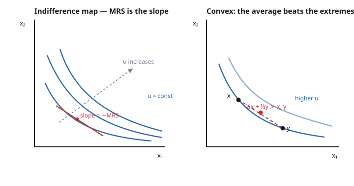

# Grad Microeconomics · Lesson 2.1: Preferences and utility representation

> ⏱ ~15 min · Module 2: Consumer theory · Builds on: [1.5 Monotone comparative statics and dynamic programming](01-05-monotone-comparative-statics-dynamic-programming.md) · Unlocks: [2.2 Utility maximization: Marshallian demand](02-02-utility-maximization-marshallian-demand.md)

## Why this matters

Undergrad micro hands you a utility function and says "maximize it." Graduate micro asks the uncomfortable prior question: *where did that function come from, and what does its value mean?* The honest answer is that the primitive object is not utility at all — it is a **preference relation**, a raw ranking of bundles. Utility is a *bookkeeping device* we are only sometimes entitled to. Knowing exactly when we are entitled to it — and, crucially, what about the utility function is real versus arbitrary — is what keeps you from proving false theorems later. Every welfare claim, every demand derivation, every duality result in this module rests on the axioms we lay down here.

## The idea

Imagine you can look at any two consumption bundles and say which you like at least as much — no numbers, just "this one, or I'm indifferent." That is the whole primitive: a binary relation $\succeq$ ("at least as good as") over bundles. If your rankings are *coherent* in two mild senses — you can always compare (no shrugs), and you never cycle ($A$ over $B$ over $C$ over $A$) — then a single number can be pinned on each bundle so that "higher number" means "ranked higher." That number is utility.

But the number is a *thermometer with no fixed zero and no fixed degree size*. Only the **order** it encodes is real. Say bundle $A$ gets utility $3$ and $B$ gets $6$. It is meaningless to say "$B$ is twice as good" or "the gap is $3$ utils" — relabel with $u^2$ and the numbers become $9$ and $36$, same ranking, wildly different "gaps." What survives every relabeling is the shape of the indifference curves and their slope, the marginal rate of substitution. That is the ordinal core, and it is all consumer theory ever uses.

## The formal version

Fix a **consumption set** $X \subseteq \mathbb{R}^n$ (bundles of $n$ goods, quantities $\ge 0$). A preference relation is a binary relation $\succeq$ on $X$, with strict preference $x \succ y$ (meaning $x \succeq y$ but not $y \succeq x$) and indifference $x \sim y$ (both $x \succeq y$ and $y \succeq x$).

**Rationality axioms.**

- **Completeness:** for all $x, y \in X$, $x \succeq y$ or $y \succeq x$ (or both).
- **Transitivity:** for all $x, y, z$, if $x \succeq y$ and $y \succeq z$ then $x \succeq z$.

*In words:* you can rank any two bundles, and your rankings never form a cycle. A relation with both properties is called **rational**. (These are exactly the axioms for a total preorder — see `proofs-primer` and `real-analysis` on order relations.)

Rationality is enough to rank, but not enough for calculus. We add regularity:

- **Continuity:** for every $x$, the sets $\{y \in X : y \succeq x\}$ (upper contour) and $\{y \in X : y \preceq x\}$ (lower contour) are **closed** in $X$. *In words:* preferences don't jump — if a sequence of bundles you weakly prefer to $x$ converges, the limit is still weakly preferred. No sudden reversal in the limit.
- **Monotonicity / local nonsatiation.** *Strong monotonicity:* if $y \ge x$ and $y \ne x$ then $y \succ x$ (strictly more of something is strictly better). *Local nonsatiation (LNS):* for every $x$ and every $\varepsilon > 0$ there is a $y$ with $\lVert y - x \rVert < \varepsilon$ and $y \succ x$ (arbitrarily close, there is always something strictly better). *In words:* there is no thick band of "meh" and no bliss point in any neighborhood.
- **Convexity:** the upper contour set $\{y : y \succeq x\}$ is a convex set — equivalently, if $y \succeq x$ and $z \succeq x$ then $\alpha y + (1-\alpha) z \succeq x$ for all $\alpha \in [0,1]$. *In words:* averages are at least as good as extremes; taste for diversification.

**Representation theorem (Debreu).** If $\succeq$ on $X \subseteq \mathbb{R}^n$ is **rational and continuous**, then there exists a **continuous** utility function $u : X \to \mathbb{R}$ with
$$x \succeq y \iff u(x) \ge u(y).$$
*In words:* coherent, non-jumpy preferences can always be recorded by an honest continuous number. Continuity is doing real work here, not decoration: it is what forbids the pathology below.

**Ordinality.** If $u$ represents $\succeq$ and $f : \mathbb{R} \to \mathbb{R}$ is **strictly increasing**, then $v = f \circ u$ represents the *same* $\succeq$, because $f$ preserves the order: $u(x) \ge u(y) \iff f(u(x)) \ge f(u(y))$. *In words:* utility is unique only up to strictly increasing relabeling. So any property of $u$ that a monotone transform can destroy is **not** a property of preferences.

This is why **concavity of $u$ is meaningless but quasiconcavity is meaningful.** Convex preferences $\iff$ the upper contour sets $\{u \ge c\}$ are convex $\iff$ $u$ is **quasiconcave** — and quasiconcavity survives every monotone transform, while concavity does not (Lesson 1.1). The ordinal object is the family of indifference curves and their slopes.

**Marginal rate of substitution.** With $u$ differentiable, along an indifference curve $u(x_1, x_2) = c$,
$$\mathrm{MRS}_{12} = \frac{\partial u / \partial x_1}{\partial u / \partial x_2}.$$
*In words:* how many units of good 2 you'd give up for one more unit of good 1, staying indifferent — the magnitude of the indifference-curve slope. Under $v = f \circ u$ the chain rule multiplies both partials by the same $f'(u) > 0$, which cancels: **MRS is invariant to monotone transforms.** Diminishing MRS (indifference curves flattening as $x_1$ grows) is exactly convex preferences.

## Picture

## Worked examples

**Example 1 (mechanical — MRS is ordinal). Cobb–Douglas.** Let $u(x_1, x_2) = x_1^{a} x_2^{b}$ with $a, b > 0$. Then
$$\mathrm{MRS}_{12} = \frac{\partial u/\partial x_1}{\partial u/\partial x_2} = \frac{a\, x_1^{a-1} x_2^{b}}{b\, x_1^{a} x_2^{b-1}} = \frac{a}{b}\cdot \frac{x_2}{x_1}.$$
Now apply the monotone transform $v = \ln u = a \ln x_1 + b \ln x_2$ (a strictly increasing relabel):
$$\mathrm{MRS}_{12} = \frac{\partial v/\partial x_1}{\partial v/\partial x_2} = \frac{a / x_1}{b / x_2} = \frac{a}{b}\cdot \frac{x_2}{x_1}.$$
**Identical.** Same MRS, and the indifference curves $x_1^a x_2^b = c$ and $a\ln x_1 + b\ln x_2 = \ln c$ are literally the same curves — only their *labels* changed. Notice the MRS falls as $x_1$ rises (holding $x_2$): diminishing MRS, i.e. convex preferences. Yet $u$ is not concave for $a+b>1$ while $v$ always is — proof that concavity was never the preference's business.

**Example 2 (why continuity is an axiom, not a formality — lexicographic preferences).** On $X = \mathbb{R}^2_+$ define: $x \succ y$ if $x_1 > y_1$, or if $x_1 = y_1$ and $x_2 > y_2$ (rank by good 1 first, break ties by good 2 — a dictionary ordering).

*It is rational.* **Complete:** any two bundles are ranked by comparing $x_1$, then $x_2$. **Transitive:** inherited from the transitivity of $>$ on each coordinate.

*It is not continuous, hence not representable.* Take $x = (1, 1)$ and the sequence $y^k = \big(1 + \tfrac{1}{k},\, 0\big)$. Each $y^k \succ x$ (bigger first coordinate), yet $y^k \to (1,0) \prec x$ — the weakly-preferred set is not closed, so continuity fails. And no utility function can exist: for each first coordinate $t$, the good-2 dimension forces a whole *interval* of distinct utility values $(a_t, b_t)$, and these intervals must be disjoint across different $t$ (since any bundle with a larger $x_1$ beats every bundle with a smaller $x_1$). But $\mathbb{R}$ cannot contain uncountably many disjoint intervals — each holds a distinct rational, and the rationals are countable. Contradiction. **Lexicographic preferences are perfectly rational but admit no utility function at all** — the standing warning that Debreu's theorem needs its continuity hypothesis.

## Watch out

- **You might think a utility number measures intensity — "$u(A)=10$ means $A$ is twice as good as $u(B)=5$."** But utility is ordinal: only $u(A) > u(B)$ has content. Any strictly increasing relabel ($u \mapsto u^3$, $u \mapsto \ln u$, ...) is an equally valid utility for the same preferences and destroys every ratio and difference. (The one place cardinal magnitude *does* return is expected utility under risk in [2.5](02-05-choice-under-uncertainty.md) — flag that contrast now.)
- **You might think "continuous preferences" means smooth indifference curves.** No — continuity is a *closedness* condition on contour sets (no reversal in limits), and it neither requires nor implies differentiability. Perfect-complements (Leontief) preferences are continuous with kinked, non-differentiable curves.
- **You might think completeness is free.** It is a genuine and strong behavioral assumption: it forbids "I can't compare these" or incomparability. Real agents facing radically different bundles often *can't* rank them; assuming they always can is an idealization you are choosing, not a logical necessity.
- **You might think you always need strong monotonicity.** You usually don't — **local nonsatiation** is the workhorse. It is all you need to prove Walras' law and the First Welfare Theorem ([2.2](02-02-utility-maximization-marshallian-demand.md), 4.4): LNS guarantees the consumer spends the entire budget (no interior bliss point to stop short at), which is exactly the hook those proofs hang on. Strong monotonicity is a convenient special case, not the requirement.

## One-liner

> Preferences are the primitive; utility is an ordinal thermometer we earn only under continuity, and only its indifference-curve shape — quasiconcavity and MRS — is real.

## Problems

**P1 (🟢)** For $u(x_1, x_2) = 2\ln x_1 + 3\ln x_2$, compute $\mathrm{MRS}_{12}$ at the bundle $(4, 6)$. Then write down a *different* utility function representing the same preferences and confirm it gives the same MRS there.

**P2 (🟡)** Consider $u(x_1, x_2) = \min\{x_1, x_2\}$ (perfect complements). (a) Are these preferences convex? Justify from the upper contour sets. (b) Are they continuous? (c) Are they strongly monotone? Explain each in one line.

**P3 (🔴, optional)** Let $\succeq$ be represented by $u(x_1, x_2) = x_1 + x_2$ (perfect substitutes). Show the preferences are convex but **not** *strictly* convex, and explain in one sentence why this is exactly the case in which utility maximization can fail to give a unique demanded bundle (a preview of [2.2](02-02-utility-maximization-marshallian-demand.md)).

Solutions

**P1** $\dfrac{\partial u}{\partial x_1} = \dfrac{2}{x_1}$, $\dfrac{\partial u}{\partial x_2} = \dfrac{3}{x_2}$, so
$$\mathrm{MRS}_{12} = \frac{2/x_1}{3/x_2} = \frac{2 x_2}{3 x_1}.$$
At $(4,6)$: $\mathrm{MRS}_{12} = \dfrac{2\cdot 6}{3\cdot 4} = \dfrac{12}{12} = 1$.

A different representation: $v = e^{u} = x_1^2 x_2^3$ (applying the strictly increasing $f(t)=e^t$). Then $\dfrac{\partial v}{\partial x_1} = 2x_1 x_2^3$, $\dfrac{\partial v}{\partial x_2} = 3x_1^2 x_2^2$, and
$$\mathrm{MRS}_{12} = \frac{2x_1 x_2^3}{3x_1^2 x_2^2} = \frac{2x_2}{3x_1},$$
identical, and $=1$ at $(4,6)$. The monotone relabel left MRS untouched, as it must.

**P2** (a) **Convex — yes.** The upper contour set $\{(x_1,x_2): \min\{x_1,x_2\} \ge c\} = \{x_1 \ge c\} \cap \{x_2 \ge c\}$ is the intersection of two half-spaces (a shifted quadrant), and an intersection of convex sets is convex. Geometrically the L-shaped indifference curves have their "better" region as a convex corner. (b) **Continuous — yes:** $u(x)=\min\{x_1,x_2\}$ is a continuous function (min of continuous functions), and a preference represented by a continuous $u$ has closed contour sets. (c) **Strongly monotone — no:** from $(1,1)$, moving to $(2,1)$ adds a unit of good 1 but $\min$ stays $1$, so $(2,1) \sim (1,1)$, not $\succ$. (It *is* weakly monotone, and it satisfies LNS everywhere except... in fact it satisfies LNS everywhere: from any point you can raise *both* coordinates slightly and strictly improve.)

**P3** Convexity: upper contour sets $\{x_1 + x_2 \ge c\}$ are half-planes, hence convex — so preferences are convex. Not *strictly* convex: strict convexity would require that for $x \ne y$ with $x \sim y$, the average is **strictly** preferred. Take $x=(2,0)$ and $y=(0,2)$: both give $u=2$, so $x \sim y$, and the average $(1,1)$ also gives $u = 2$ — indifferent, not strictly better. The whole indifference "curve" is a straight line, so a chord between two indifferent points lies *on* the indifference set, not strictly above it. Because that indifference line is parallel to the budget line when prices are equal, the consumer is indifferent among a whole segment of bundles — utility maximization has no unique solution. Strict convexity (strictly bowed curves) is precisely what would pin the optimum to a single point.

## Flashback

**From Lesson 1.1 (Convexity, concavity, and quasiconcavity):** Show that $u(x_1, x_2) = x_1^{1/3} x_2^{2/3}$ is quasiconcave on $\mathbb{R}^2_{++}$ by checking that its upper contour sets are convex — and state in one line why this (not concavity) is the property that matters for preferences.

Solution

Take the monotone transform $v = \ln u = \tfrac{1}{3}\ln x_1 + \tfrac{2}{3}\ln x_2$, which represents the same preferences and so has the same upper contour sets. Since $\ln$ is a **concave** function of each argument and a nonnegative-weighted sum of concave functions is concave, $v$ is concave on $\mathbb{R}^2_{++}$. A concave function has convex upper contour sets $\{v \ge c\}$ (from 1.1: superlevel sets of a concave function are convex). Those are exactly the upper contour sets of $u$, so $u$ has convex upper contour sets — i.e. $u$ is **quasiconcave**.

(Direct check without the transform: the boundary $x_1^{1/3}x_2^{2/3}=c$ solves to $x_2 = (c/x_1^{1/3})^{3/2} = c^{3/2} x_1^{-1/2}$, a decreasing, convex-to-origin curve; the region above it is convex.)

Why quasiconcavity and not concavity: concavity is *cardinal* — the transform $u = x_1^{1/3}x_2^{2/3}$ is itself quasiconcave but one can relabel any preference to make its utility non-concave, so concavity is not a property of $\succeq$. Quasiconcavity survives every strictly increasing relabel, so it *is* a property of the preferences — precisely the convexity of tastes.

## Connections

- **Backward:** convex preferences $\iff$ quasiconcave utility ties directly to [1.1](01-01-convexity-concavity-quasiconcavity.md)'s convex-set / superlevel-set machinery; the maximum theorem from [1.5](01-05-monotone-comparative-statics-dynamic-programming.md) is what will later guarantee that the demand we build on top of these preferences varies continuously in prices.
- **Forward:** [2.2](02-02-utility-maximization-marshallian-demand.md) maximizes exactly this $u$ over a budget set — LNS makes the budget constraint bind, quasiconcavity delivers the tangency (MRS = price ratio) as the optimum. The cardinal notion of utility returns only in [2.5](02-05-choice-under-uncertainty.md), where expected utility is unique up to *affine* (not merely monotone) transforms — a strictly stronger structure worth contrasting with today's ordinality.
- **Sideways:** order relations and the continuity/closedness ideas come straight from `real-analysis` (closed sets, convergent sequences) and `proofs-primer` (total orders); the same "rational preferences over outcomes" primitive underlies every player's payoff ranking in `grad-game-theory`, where vNM utility over lotteries is the bridge from this ordinal ranking to the numbers a game's payoff matrix records.
