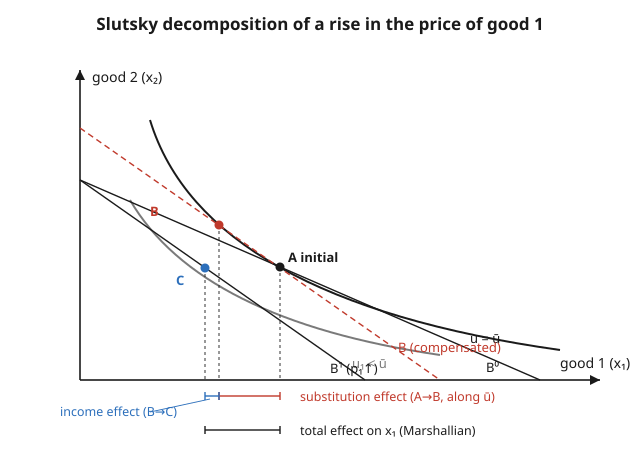

# Grad Microeconomics · Lesson 2.4: The Slutsky equation and comparative statics

> ⏱ ~15 min · Module 2: Consumer theory · Builds on: [2.3 Expenditure minimization and duality](02-03-expenditure-minimization-duality.md) · Unlocks: [2.5 Choice under uncertainty](02-05-choice-under-uncertainty.md)

## Why this matters

Comparative statics is the payoff of consumer theory: a price moves, and we want to predict which way demand goes and *why*. The naive answer — "prices up, quantity down" — is not a theorem, and the reason it isn't is the whole content of this lesson. A price change does two things at once: it changes *relative* prices (making the dearer good less attractive at fixed satisfaction) and it changes *real income* (your money buys less overall). The Slutsky equation is the bookkeeping that separates these, and its structure — a symmetric, negative semidefinite matrix — is exactly the fingerprint that certifies a demand system came from a rational optimizer. It also explains the theory's most famous exception, the Giffen good, and underwrites welfare analysis and revealed preference downstream.

## The idea

Raise the price of good 1. Your old bundle is now unaffordable, so you re-optimize. Split the move into two conceptual steps.

**Step 1 — substitution.** Imagine we secretly hand you just enough extra cash to stay on your *original* indifference curve. Same satisfaction, new relative prices. You slide *along* that curve away from the now-expensive good toward its substitutes. This is the pure "relative-prices" response — it is exactly the Hicksian (compensated) demand's reaction, and it can only be non-positive for the good's own price: with utility pinned, you never buy *more* of something that got dearer.

**Step 2 — income.** Now take the imaginary cash back. Your real purchasing power falls, and you slide to a lower indifference curve. Which way good 1 moves now depends on whether it is *normal* (poorer ⇒ buy less) or *inferior* (poorer ⇒ buy more).

The observed (Marshallian) change is the sum. For a normal good both steps push demand down — tidy. For a strongly inferior good, the income step pushes *up* hard enough to overpower the substitution step, and demand rises with price: a **Giffen good**. Nothing paradoxical — just two effects with opposite signs, and the wrong one winning.

## The formal version

Write $p=(p_1,\dots,p_n)$ for the price vector, $m$ for wealth, $\bar u$ for a utility level. Let $x_i(p,m)$ be Marshallian demand, $h_i(p,\bar u)$ Hicksian (compensated) demand, and $e(p,\bar u)$ the expenditure function from [2.3](02-03-expenditure-minimization-duality.md). The duality identity that glues them together is

$$h_i(p,\bar u) = x_i\big(p,\,e(p,\bar u)\big).$$

**In words:** the compensated demand at utility $\bar u$ is just the ordinary demand of someone handed exactly the income $e(p,\bar u)$ needed to reach $\bar u$ at prices $p$.

Differentiate both sides with respect to $p_j$, holding $\bar u$ fixed, using the chain rule on the right:

$$\frac{\partial h_i}{\partial p_j} = \frac{\partial x_i}{\partial p_j} + \frac{\partial x_i}{\partial m}\,\frac{\partial e}{\partial p_j}.$$

Shephard's lemma (2.3) says $\partial e/\partial p_j = h_j(p,\bar u)$, and at the reference point $h_j = x_j$. Substitute and solve for the ordinary price derivative:

$$\boxed{\ \frac{\partial x_i}{\partial p_j} = \underbrace{\frac{\partial h_i}{\partial p_j}}_{\text{substitution}} \;-\; \underbrace{x_j\,\frac{\partial x_i}{\partial m}}_{\text{income}}\ }$$

**In words (the Slutsky equation):** the total response of demand for $i$ to a change in price $j$ equals the compensated (substitution) response minus the income response, where the income response is scaled by how much of good $j$ you were buying, $x_j$ — a bigger price change on a bigger purchase drains more real income.

Collect the substitution terms into the **Slutsky matrix** $S=[s_{ij}]$ with

$$s_{ij} = \frac{\partial h_i}{\partial p_j} = \frac{\partial x_i}{\partial p_j} + x_j\,\frac{\partial x_i}{\partial m}.$$

Because $S$ is the Hessian of the concave function $e$ in $p$ (2.3), it inherits three properties:

- **Symmetry:** $s_{ij}=s_{ji}$ (Young's theorem on $e$). *In words:* the compensated cross-effects match — a testable restriction on real data.
- **Negative semidefinite:** $v^\top S v \le 0$ for all $v$ (e is concave). In particular $s_{ii} = \partial h_i/\partial p_i \le 0$ — the **compensated law of demand**: own-price substitution effects are never positive.
- **Singular, with $Sp = 0$:** Hicksian demand is homogeneous of degree $0$ in $p$, so Euler's theorem gives $\sum_j s_{ij}p_j = 0$. *In words:* scaling all prices leaves compensated demand unmoved, so $p$ is a null vector of $S$ — it is NSD but never negative *definite*.

**Integrability (the converse).** These properties are not just consequences — they are *sufficient*. If an observed demand system $x(p,m)$ satisfies Walras' law ($p\cdot x=m$), homogeneity of degree $0$, and has a Slutsky matrix that is symmetric and negative semidefinite, then there exists a well-behaved (quasiconcave) preference relation that generates it. **In words:** symmetry + NSD are *exactly* the empirical content of rational consumer theory; pass them and preferences can be reconstructed, fail them and no utility function could have produced your data.

## Picture

Bundle **A** is the initial optimum. Pivot the budget line inward at the fixed good-2 intercept ($p_1$ rises). The dashed **compensated** line is parallel to the new one but shifted out until it just touches the *original* indifference curve at **B**: the slide $A\to B$ is the substitution effect. Removing the imaginary compensation drops you to **C** on a lower curve: the slide $B\to C$ is the income effect. Their sum, $A\to C$, is the observed Marshallian change.

## Worked examples

**Example 1 (mechanical — verify Slutsky for Cobb–Douglas).** Let $u(x_1,x_2)=x_1^{a}x_2^{1-a}$, $0<a<1$. Standard results: Marshallian $x_1 = am/p_1$, expenditure $e(p,\bar u)=\bar u\,k\,p_1^{a}p_2^{1-a}$ with $k=a^{-a}(1-a)^{-(1-a)}$, and by Shephard $h_1=\partial e/\partial p_1 = \bar u\,k\,a\,p_1^{a-1}p_2^{1-a}$. Compute the three derivatives at a reference point:

$$\frac{\partial x_1}{\partial p_1} = -\frac{am}{p_1^{2}},\qquad \frac{\partial x_1}{\partial m}=\frac{a}{p_1},\qquad \frac{\partial h_1}{\partial p_1}=\bar u\,k\,a(a-1)p_1^{a-2}p_2^{1-a}.$$

Assemble the substitution term algebraically from the Slutsky formula (cleaner than plugging in the Hicksian):

$$s_{11}=\frac{\partial x_1}{\partial p_1}+x_1\frac{\partial x_1}{\partial m} = -\frac{am}{p_1^{2}} + \frac{am}{p_1}\cdot\frac{a}{p_1} = -\frac{a(1-a)m}{p_1^{2}} \;<\;0.$$

Negative for every admissible $a$ — Cobb–Douglas substitution effects obey the compensated law, and **Cobb–Douglas has no Giffen goods**. Numbers make it concrete: $a=\tfrac12,\ p_1=p_2=1,\ m=100$ give $x_1=x_2=50$, $\bar u=50$, $k=2$. Then $\partial x_1/\partial p_1=-50$ (total), $\partial h_1/\partial p_1 = s_{11} = -a(1-a)m/p_1^2 = -25$ (substitution), and $x_1\,\partial x_1/\partial m = 50\cdot\tfrac12 = 25$ (income). Indeed $-50 = -25 - 25$. ✓ The observed drop splits evenly into substitution and income here.

**Example 2 (why you'd care — the Slutsky matrix is a lie detector).** Same Cobb–Douglas, $a=\tfrac12$, evaluated at $p_1=p_2=1$, $m=100$ (so $\bar u=50,\ k=2$). Differentiating the two Hicksians $h_1=\bar u k\,a\,p_1^{a-1}p_2^{1-a}$, $h_2=\bar u k\,(1-a)\,p_1^{a}p_2^{-a}$ and plugging in:

$$S=\begin{pmatrix} s_{11} & s_{12}\\ s_{21} & s_{22}\end{pmatrix} = \begin{pmatrix} -25 & 25\\ 25 & -25\end{pmatrix}.$$

Check every property. **Symmetric:** $s_{12}=s_{21}=25$. ✓ **NSD:** diagonal entries $\le 0$ and $\det S = (-25)(-25)-(25)(25)=0\ge 0$ — negative semidefinite. **Singular / $Sp=0$:** with $p=(1,1)^\top$, $Sp=(-25+25,\ 25-25)^\top=(0,0)^\top$. ✓ The zero determinant is *not* a coincidence of the numbers; $Sp=0$ forces $S$ to be rank-deficient for any demand system. A demand system whose cross-terms failed $s_{12}=s_{21}$ could not have come from *any* utility function — which is exactly the test the next problem set exploits.

## Watch out

- **The income term is subtracted, and scaled by $x_j$ not $x_i$.** The Slutsky equation is $\partial x_i/\partial p_j = s_{ij} - x_j\,\partial x_i/\partial m$. A common slip is to attach $x_i$ (the good being differentiated) instead of $x_j$ (the good whose price moved). For own-price they coincide, which hides the error until you do a cross-price problem.
- **Own-*substitution* is always $\le 0$; own-*Marshallian* need not be.** $s_{ii}\le0$ is a theorem. But $\partial x_i/\partial p_i = s_{ii} - x_i\,\partial x_i/\partial m$ can be *positive* when the good is inferior enough ($\partial x_i/\partial m<0$ with the income term dominating) — that is precisely a Giffen good. "Demand curves slope down" is a fact about compensated demand, not observed demand.
- **$S$ is negative *semi*definite, not negative definite.** Because $Sp=0$, it always has a zero eigenvalue and $\det S=0$ in the two-good case. Expecting a strictly negative determinant will make you wrongly reject valid demand data.
- **Symmetry is a restriction, not a definition.** Any set of numbers can be arranged into a matrix; only ones satisfying $s_{ij}=s_{ji}$ (and NSD) are consistent with optimization. This is the whole leverage of integrability.

## One-liner

> A price change moves demand by a substitution slide along the old indifference curve minus an income slide across curves — $\partial x_i/\partial p_j = \partial h_i/\partial p_j - x_j\,\partial x_i/\partial m$ — and the substitution part forms a symmetric, negative-semidefinite matrix that is rationality's signature.

## Problems

**P1 (🟢)** Quasilinear preferences $u(x_1,x_2)=2\sqrt{x_1}+x_2$ (interior solution, $x_2>0$). Find Marshallian $x_1(p,m)$, show $\partial x_1/\partial m = 0$, and conclude that for good 1 the Slutsky equation collapses to $\partial x_1/\partial p_1 = \partial h_1/\partial p_1$. Interpret.

**P2 (🟡)** At a point, an observed two-good demand system has
$$\frac{\partial x_1}{\partial p_2}=3,\quad \frac{\partial x_2}{\partial p_1}=1,\quad \frac{\partial x_1}{\partial m}=2,\quad \frac{\partial x_2}{\partial m}=1,\qquad x_1=4,\ x_2=5.$$
Compute $s_{12}$ and $s_{21}$. Could this data have been generated by a utility-maximizing consumer? Why?

**P3 (🔴, optional)** Starting from $\partial x_i/\partial p_i = s_{ii} - x_i\,\partial x_i/\partial m$ with $s_{ii}\le 0$, prove: (a) a normal good ($\partial x_i/\partial m\ge 0$) can never be Giffen; (b) a Giffen good must be inferior, and state the precise inequality (in terms of $s_{ii}$, $x_i$, $\partial x_i/\partial m$) under which $\partial x_i/\partial p_i>0$.

Solutions

**P1** The consumer maximizes $2\sqrt{x_1}+x_2$ subject to $p_1x_1+p_2x_2=m$. The interior FOC sets the marginal rate of substitution equal to the price ratio: $\frac{\partial u/\partial x_1}{\partial u/\partial x_2}=\frac{1/\sqrt{x_1}}{1}=\frac{p_1}{p_2}$, so $\sqrt{x_1}=p_2/p_1$ and

$$x_1(p,m)=\frac{p_2^{2}}{p_1^{2}}.$$

This does not contain $m$, so $\partial x_1/\partial m = 0$: all extra income flows to good 2 (the numéraire-like good). With a zero income effect the Slutsky equation loses its second term entirely:

$$\frac{\partial x_1}{\partial p_1} = \frac{\partial h_1}{\partial p_1} - x_1\cdot 0 = \frac{\partial h_1}{\partial p_1} = -\frac{2p_2^{2}}{p_1^{3}}.$$

**Interpretation:** with no income effect, observed and compensated demand coincide, so the Marshallian demand curve *is* the substitution effect — it must slope down, and Giffen behavior is impossible for a quasilinear good. (This is why quasilinear utility is the workhorse for welfare analysis: consumer surplus measured on the ordinary curve equals the exact compensated measure.)

**P2** Use $s_{ij}=\partial x_i/\partial p_j + x_j\,\partial x_i/\partial m$:

$$s_{12}=\frac{\partial x_1}{\partial p_2}+x_2\frac{\partial x_1}{\partial m}=3+5\cdot 2 = 13,\qquad s_{21}=\frac{\partial x_2}{\partial p_1}+x_1\frac{\partial x_2}{\partial m}=1+4\cdot 1 = 5.$$

Since $s_{12}=13\neq 5=s_{21}$, the Slutsky matrix is **not symmetric**. No utility-maximizing consumer could generate this data: symmetry of $S$ is a necessary condition (it is the Hessian of the expenditure function, which must be symmetric by Young's theorem). The raw cross-price derivatives $3\neq 1$ are *not* the test — the correct test corrects them for the income effects, and even after correcting, symmetry fails.

**P3** Rearranged Slutsky: $\dfrac{\partial x_i}{\partial p_i} = s_{ii} - x_i\dfrac{\partial x_i}{\partial m}$, with $s_{ii}\le 0$ and $x_i\ge 0$.

*(a)* If the good is normal, $\partial x_i/\partial m\ge 0$, so $-x_i\,\partial x_i/\partial m \le 0$. Then $\partial x_i/\partial p_i$ is a sum of two non-positive terms, hence $\le 0$: the ordinary demand curve slopes down. A normal good is never Giffen.

*(b)* Giffen means $\partial x_i/\partial p_i>0$, i.e. $s_{ii} - x_i\,\partial x_i/\partial m > 0$, i.e.

$$-\,x_i\,\frac{\partial x_i}{\partial m} > -\,s_{ii} = |s_{ii}| \ge 0.$$

The left side must be positive, which (with $x_i>0$) forces $\partial x_i/\partial m<0$: **the good must be inferior**. The precise threshold is

$$x_i\left(-\frac{\partial x_i}{\partial m}\right) > |s_{ii}|,$$

i.e. the magnitude of the income effect (scaled by the amount consumed) must exceed the magnitude of the own substitution effect. Giffen goods therefore require strong inferiority *and* a large budget share — both rare, which is why real Giffen goods are near-mythical.

## Flashback

**From Lesson 2.3 (Expenditure minimization and duality):** A consumer's expenditure function is $e(p_1,p_2,\bar u)=2\bar u\sqrt{p_1 p_2}$. Recover both Hicksian demands via Shephard's lemma, verify they reproduce the expenditure identity $p_1h_1+p_2h_2=e$, and confirm $h_1$ is homogeneous of degree $0$ in $(p_1,p_2)$.

Solution

Shephard's lemma: $h_i = \partial e/\partial p_i$. Writing $e=2\bar u\,p_1^{1/2}p_2^{1/2}$,

$$h_1=\frac{\partial e}{\partial p_1}=2\bar u\cdot\tfrac12 p_1^{-1/2}p_2^{1/2}=\bar u\sqrt{\frac{p_2}{p_1}},\qquad h_2=\frac{\partial e}{\partial p_2}=\bar u\sqrt{\frac{p_1}{p_2}}.$$

Identity check: $p_1h_1+p_2h_2 = \bar u\big(p_1\sqrt{p_2/p_1}+p_2\sqrt{p_1/p_2}\big)=\bar u\big(\sqrt{p_1p_2}+\sqrt{p_1p_2}\big)=2\bar u\sqrt{p_1p_2}=e$. ✓

Homogeneity: scaling prices by $t>0$, $h_1(tp_1,tp_2,\bar u)=\bar u\sqrt{tp_2/(tp_1)}=\bar u\sqrt{p_2/p_1}=h_1(p,\bar u)$ — degree $0$, as Hicksian demand must be. (These are the $a=\tfrac12$ Cobb–Douglas compensated demands from this lesson's Example 1, confirming the two derivations agree.)

## Connections

- **Backward:** the derivation is duality ([2.3](02-03-expenditure-minimization-duality.md)) plus the envelope theorem — Shephard's lemma turns the chain-rule term into $x_j$, and the concavity of $e$ (an envelope of linear cost functions) is what makes $S$ negative semidefinite. The Hessian symmetry mirrors [1.4 The envelope theorem and duality](01-04-envelope-theorem-duality.md)'s treatment of the envelope theorem, and the algebra of quasiconcave preferences traces back to `micro-refresher`.
- **Forward:** integrability — that symmetry + NSD reconstruct preferences — is the analytic twin of **revealed preference** (2.6), which reaches the same conclusion from finite choice data; together they underwrite exact welfare measurement (compensating and equivalent variation) via the compensated demand curve.
- **Sideways (production):** the cost-minimizing firm's conditional input demands satisfy the identical structure — the substitution matrix of factor demands is symmetric and NSD because the cost function is concave in input prices, exactly as $e$ is concave in output prices ([3.2 Cost functions and input demand](03-02-cost-minimization.md)). Consumer duality and producer duality are one theorem wearing two costumes.
