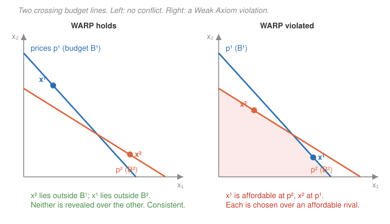

# Grad Microeconomics · Lesson 2.6: Revealed preference

> ⏱ ~15 min · Module 2: Consumer theory · Builds on: [2.5 Choice under uncertainty](02-05-choice-under-uncertainty.md) · Unlocks: [3.1 Production sets and technology](03-01-production-sets-technology.md)

## Why this matters

Every lesson so far started by *assuming* a utility function and grinding out demand. But nobody hands you a utility function — all you ever observe is what people buy at what prices. So flip the whole module on its head: **start from a table of choices and ask what, if anything, they reveal.** Are the choices even consistent with *some* utility being maximized? Revealed preference makes "the consumer is rational" a *testable* hypothesis about data, not an article of faith — and its punchline (Afriat's theorem) says rationality is exactly equivalent to a simple no-cycles condition you can check by hand. This is the empirical backbone of demand analysis, and it ties off Module 2 by inverting it.

## The idea

You watch someone shop. On Monday, facing prices $p^1$, they buy bundle $x^1$ — and you notice that a different bundle $x^2$ was *also affordable* that day (it cost no more than what they spent). They could have had $x^2$ and chose $x^1$ instead. That is a genuine piece of evidence: **$x^1$ is revealed preferred to $x^2$.** Not because $x^1$ was cheaper — affordability and choice together are what matter — but because they voted with their wallet while $x^2$ sat within reach.

Now the consistency test. If $x^1$ is ever revealed preferred to $x^2$, a rational chooser must **never** turn around on some other day and reveal $x^2$ preferred to $x^1$ — buying $x^2$ while $x^1$ was affordable. That would be choosing each over the other under conditions where both were available: incoherent. Forbidding exactly this is the Weak Axiom. Geometrically it's about two crossing budget lines and where the chosen points fall.

## The formal version

**The data.** A finite dataset $D=\{(p^t,x^t)\}_{t=1}^{T}$: at observation $t$, prices $p^t\in\mathbb{R}^n_{++}$ (all positive) prevail and the consumer buys $x^t\in\mathbb{R}^n_{+}$, spending income $m^t=p^t\cdot x^t$ (budget exhausted). Here $p\cdot x=\sum_i p_i x_i$ is total cost.

**Directly revealed preferred.** Write $x^t\,R^D\,x^s$ when
$$p^t\cdot x^s \;\le\; p^t\cdot x^t \;(=m^t).$$
*In words:* at the prices of observation $t$, bundle $x^s$ cost no more than what was actually spent — it was affordable — yet $x^t$ was chosen. Choosing $x^t$ over an affordable $x^s$ "directly reveals" $x^t$ at least as good. If the inequality is strict ($<$), we say $x^t$ is *strictly* directly revealed preferred, $x^t\,P^D\,x^s$.

**The Weak Axiom (WARP).** For all $t,s$ with $x^t\neq x^s$:
$$x^t\,R^D\,x^s \quad\Longrightarrow\quad \text{not } x^s\,R^D\,x^t,\qquad\text{i.e., } p^s\cdot x^t \;>\; m^s.$$
*In words:* if $x^t$ was ever picked while $x^s$ was affordable, then on any day $x^s$ is picked, $x^t$ must have been *out of reach*. You can't have the wallet vote both ways between two bundles.

**The revealed-preference relation $R$.** Let $R$ be the *transitive closure* of $R^D$: $x^t\,R\,x^s$ if there is a chain $x^t\,R^D\,x^{a}\,R^D\,x^{b}\cdots R^D\,x^s$. *In words:* "preferred" now also travels through intermediaries — if $A$ beats $B$ and $B$ beats $C$, then $A$ beats $C$ even if you never compared them directly.

**The Strong Axiom (SARP).** For all $t,s$ with $x^t\neq x^s$: $\;x^t\,R\,x^s \Rightarrow \text{not } x^s\,R^D\,x^t.$ *In words:* no cycles at all — you can never return, even through a long chain, to something already beaten. **GARP** is the same with the tie-tolerant strict relation ($x^t\,R\,x^s \Rightarrow \text{not } x^s\,P^D\,x^t$), which is what you want when indifference is allowed.

**Afriat's theorem (the punchline).** For a *finite* dataset $D$, the following are equivalent:

1. $D$ satisfies GARP.
2. $D$ is rationalized by a locally nonsatiated utility function $u$ — meaning $x^t$ solves $\max u(x)$ subject to $p^t\cdot x\le m^t$ for every $t$.
3. $D$ is rationalized by a **continuous, strictly increasing, concave** utility function.

*In words:* a no-cycles condition you can check on a spreadsheet is *exactly* the same thing as "these choices come from maximizing a well-behaved utility." Rationality has an operational, falsifiable definition. And the jump from (2) to (3) is remarkable — if *any* utility fits, then a nice one does too.

**The bridge back to Slutsky.** When the data come from a smooth demand function $x(p,w)$ rather than scattered points, WARP has a calculus twin. Compensate a price change so the old bundle stays just affordable (the **Slutsky compensation** of Lesson 2.4), and WARP becomes
$$\Delta p\cdot\Delta x\;\le\;0,$$
which says the Slutsky substitution matrix $S$ is negative semidefinite. *In words:* the Slutsky conditions you derived from utility maximization in Lesson 2.4 **are** the Weak Axiom, read in the smooth limit. Same content, two dialects — Problem 3 proves the link.

## Picture

## Worked examples

**Example 1 (mechanical — test WARP on two observations).** Two goods, two shopping days:

| $t$ | prices $p^t$ | chosen $x^t$ | income $m^t=p^t\cdot x^t$ |
|---|---|---|---|
| 1 | $(3,1)$ | $(4,1)$ | $13$ |
| 2 | $(1,3)$ | $(1,4)$ | $13$ |

Check both directions.

- Is $x^1\,R^D\,x^2$? Cost of $x^2$ at day-1 prices: $p^1\cdot x^2 = 3(1)+1(4)=7\le 13$. Affordable, and $x^1$ was chosen $\Rightarrow x^1\,R^D\,x^2$. ✓
- Is $x^2\,R^D\,x^1$? Cost of $x^1$ at day-2 prices: $p^2\cdot x^1 = 1(4)+3(1)=7\le 13$. Affordable, and $x^2$ was chosen $\Rightarrow x^2\,R^D\,x^1$. ✓

Both hold with $x^1\neq x^2$: **WARP is violated.** On each day the consumer bought one bundle while the other sat strictly within budget (cost $7$, income $13$) — voting both ways. No utility function can rationalize this pair; it's the right-hand panel of the picture.

**Example 2 (build the relation — a clean dataset that passes).** Two goods, three observations:

| $t$ | prices $p^t$ | chosen $x^t$ | income $m^t$ |
|---|---|---|---|
| 1 | $(1,1)$ | $(5,1)$ | $6$ |
| 2 | $(2,1)$ | $(3,2)$ | $8$ |
| 3 | $(3,1)$ | $(1,4)$ | $7$ |

(Incomes: $m^1=1{\cdot}5+1{\cdot}1=6$, $m^2=2{\cdot}3+1{\cdot}2=8$, $m^3=3{\cdot}1+1{\cdot}4=7$.) Tabulate every cross-cost $p^t\cdot x^s$ against $m^t$:

| chosen \ vs | $x^1$ | $x^2$ | $x^3$ | $m^t$ |
|---|---|---|---|---|
| **day 1** $p^1=(1,1)$ | 6 | **5** | **5** | 6 |
| **day 2** $p^2=(2,1)$ | 11 | 8 | **6** | 8 |
| **day 3** $p^3=(3,1)$ | 16 | 11 | 7 | 7 |

An entry $\le m^t$ (bold) means "affordable that day," i.e. $x^t\,R^D\,x^s$. Reading off: $x^1\,R^D\,x^2$, $x^1\,R^D\,x^3$, and $x^2\,R^D\,x^3$. No reverse arrow appears anywhere (every off-diagonal entry in the other direction exceeds its $m^t$), so WARP holds pairwise. The transitive closure adds only $x^1\,R\,x^3$ — already present — and produces **no cycle**. GARP is satisfied, so by Afriat's theorem a continuous, increasing, concave $u$ rationalizes the data (any such $u$ with $u(x^1)>u(x^2)>u(x^3)$ works). The choices are exactly as if the consumer maximized utility — and we never had to guess the utility.

## Watch out

- **"Revealed preferred" is not "cheaper."** $x^t\,R^D\,x^s$ requires that $x^s$ was *affordable when $x^t$ was chosen*. A bundle can be cheaper than $x^t$ and reveal nothing (it might belong to a different observation), and a bundle costing *exactly* $m^t$ still counts as affordable. Affordability **plus** choice — never price alone.
- **WARP is weaker than it looks with $n>2$ goods.** For two goods WARP already forces a utility representation, but with three or more it does **not**: a dataset can satisfy WARP on every pair yet still have a 3-cycle $x^1\,R\,x^2\,R\,x^3\,R^D\,x^1$ through the transitive closure. That cycle violates SARP even though no *pair* does. You need SARP/GARP — not WARP — for Afriat (Problem 2 exhibits exactly such a cycle).
- **Afriat gives a concave utility, not the utility.** Rationalizations are wildly non-unique: finite data pin down utility only on the observed bundles, so infinitely many functions (all concave-and-monotone) fit. Don't read the recovered $u$ as "the" preferences.
- **Finite data can't falsify continuity — only the axiom.** GARP is the *entire* empirical content. Continuity, concavity, and monotonicity in Afriat's conclusion are free gifts you can always arrange once the axiom holds; no finite dataset could ever contradict them. What data *can* do is catch a cycle.

## One-liner

> Don't assume utility — watch the wallet: choices are rational exactly when the revealed-preference relation has no cycles (GARP), and then Afriat hands you a concave utility for free.

## Problems

**P1 (🟢)** Two goods, two observations: $(p^1,x^1)=\big((1,2),(2,3)\big)$ and $(p^2,x^2)=\big((2,1),(3,2)\big)$. Compute both incomes, check whether $x^1\,R^D\,x^2$ and whether $x^2\,R^D\,x^1$, and state whether WARP is satisfied.

**P2 (🟡)** Three goods, three observations, all with income $17$:
$$(p^1,x^1)=\big((3,1,3),(4,2,1)\big),\quad (p^2,x^2)=\big((3,3,1),(1,4,2)\big),\quad (p^3,x^3)=\big((1,3,3),(2,1,4)\big).$$
Build the directly-revealed-preferred relation (compute each $p^t\cdot x^s$ and compare to $17$), confirm that **no pair** violates WARP, then take the transitive closure and show the data nonetheless violate SARP. What does Afriat's theorem then say about rationalizability?

**P3 (🔴, optional — the Slutsky bridge)** A demand function $x(p,w)$ satisfies WARP. Start at $(p^0,w^0)$ with demand $x^0$. Change prices to $p^1$ and **Slutsky-compensate** wealth to $w^1=p^1\cdot x^0$ (so the old bundle $x^0$ is just affordable at the new prices); let $x^1$ be the new demand. Prove that
$$(p^1-p^0)\cdot(x^1-x^0)\;\le\;0,$$
with strict inequality when $x^1\neq x^0$. Then explain, for a change in a single price $p_k$ alone, why this makes the compensated own-price effect $\partial x_k/\partial p_k\le 0$ — i.e., the Slutsky matrix is negative semidefinite.

Solutions

**P1** Incomes: $m^1=p^1\cdot x^1=1(2)+2(3)=8$; $m^2=p^2\cdot x^2=2(3)+1(2)=8$.
- $x^1\,R^D\,x^2$? $\;p^1\cdot x^2=1(3)+2(2)=7\le 8$. Affordable $\Rightarrow$ yes, $x^1\,R^D\,x^2$.
- $x^2\,R^D\,x^1$? $\;p^2\cdot x^1=2(2)+1(3)=7\le 8$. Affordable $\Rightarrow$ yes, $x^2\,R^D\,x^1$.

Both directions hold with $x^1\neq x^2$, so **WARP is violated**: each bundle was chosen while the other cost only $7$ against income $8$.

**P2** Every income is $17$, so an entry $p^t\cdot x^s\le 17$ means "$x^s$ affordable on day $t$," i.e. $x^t\,R^D\,x^s$. Compute the off-diagonal costs:

*Day 1,* $p^1=(3,1,3)$: $\;p^1\cdot x^2=3(1)+1(4)+3(2)=13\le17\Rightarrow x^1\,R^D\,x^2$. $\;p^1\cdot x^3=3(2)+1(1)+3(4)=19>17$ (not affordable).

*Day 2,* $p^2=(3,3,1)$: $\;p^2\cdot x^3=3(2)+3(1)+1(4)=13\le17\Rightarrow x^2\,R^D\,x^3$. $\;p^2\cdot x^1=3(4)+3(2)+1(1)=19>17$ (not affordable).

*Day 3,* $p^3=(1,3,3)$: $\;p^3\cdot x^1=1(4)+3(2)+3(1)=13\le17\Rightarrow x^3\,R^D\,x^1$. $\;p^3\cdot x^2=1(1)+3(4)+3(2)=19>17$ (not affordable).

So the only direct arrows are $x^1\,R^D\,x^2$, $x^2\,R^D\,x^3$, $x^3\,R^D\,x^1$. Check each **pair** for WARP: pair $(1,2)$ has only $x^1\,R^D\,x^2$ (the reverse cost $19>17$); pair $(2,3)$ has only $x^2\,R^D\,x^3$; pair $(3,1)$ has only $x^3\,R^D\,x^1$. Exactly one direction per pair, so **WARP holds on every pair** — no two-observation violation exists.

But the transitive closure chains them: $x^1\,R^D\,x^2\,R^D\,x^3\Rightarrow x^1\,R\,x^3$, while directly $x^3\,R^D\,x^1$. That is a cycle $x^1\,R\,x^3\,R^D\,x^1$ with $x^1\neq x^3$: **SARP is violated.** By Afriat's theorem, GARP failing means **no** locally nonsatiated (hence no continuous/concave/monotone) utility rationalizes these choices — the consumer is behaving irrationally in a way WARP alone could never detect. This is the promised $n>2$ gap between WARP and SARP.

**P3** By construction $w^1=p^1\cdot x^0$, so $x^0$ costs exactly $w^1$ at the new prices — it is affordable at $(p^1,w^1)$. Since $x^1$ is the chosen bundle there, $x^1$ is revealed preferred to $x^0$: $x^1\,R^D\,x^0$.

WARP now bites at the original situation. Suppose $x^1\neq x^0$. WARP says that because $x^1\,R^D\,x^0$, we cannot also have $x^0\,R^D\,x^1$ — so at $(p^0,w^0)$, where $x^0$ was chosen, $x^1$ must have been **unaffordable**:
$$p^0\cdot x^1 \;>\; w^0 \;=\; p^0\cdot x^0 \quad\Longrightarrow\quad p^0\cdot(x^1-x^0)\;>\;0. \tag{i}$$
Meanwhile $x^1$ is affordable at $(p^1,w^1)$ with the budget exhausted, and $x^0$ costs exactly $w^1$ there:
$$p^1\cdot x^1 \;\le\; w^1 \;=\; p^1\cdot x^0 \quad\Longrightarrow\quad p^1\cdot(x^1-x^0)\;\le\;0. \tag{ii}$$
Subtract (i) from (ii):
$$(p^1-p^0)\cdot(x^1-x^0)\;=\;\underbrace{p^1\cdot(x^1-x^0)}_{\le\,0}\;-\;\underbrace{p^0\cdot(x^1-x^0)}_{>\,0}\;<\;0.$$
So $\Delta p\cdot\Delta x<0$ when $x^1\neq x^0$ (and $=0$ when $x^1=x^0$), giving $\Delta p\cdot\Delta x\le 0$. ∎

Single price: let only $p_k$ change, $\Delta p=(0,\dots,\Delta p_k,\dots,0)$. Then $\Delta p\cdot\Delta x=\Delta p_k\,\Delta x_k\le 0$, so $\Delta x_k$ and $\Delta p_k$ have opposite signs — the **compensated** demand for good $k$ falls when its own price rises. Dividing by $\Delta p_k$ and taking the limit, $\partial x_k/\partial p_k\big|_{\text{comp}}=S_{kk}\le 0$: the diagonal of the Slutsky matrix is nonpositive, and the full vector inequality $\Delta p\cdot S\,\Delta p\le 0$ is exactly negative semidefiniteness. Revealed preference *is* the Slutsky condition of 2.4.

## Flashback

**From Lesson 2.5 (Choice under uncertainty):** A consumer with utility over wealth $u(w)=\ln w$ faces a 50–50 gamble paying wealth $100$ or $400$. Find the certainty equivalent $CE$ and the risk premium.

Solution

Expected utility of the gamble:
$$\mathbb{E}[u]=\tfrac12\ln 100+\tfrac12\ln 400=\tfrac12\ln(100\cdot400)=\tfrac12\ln 40000=\ln\sqrt{40000}=\ln 200.$$
The certainty equivalent solves $u(CE)=\mathbb{E}[u]$, i.e. $\ln CE=\ln 200$, so $CE=200$. Expected wealth is $\tfrac12(100)+\tfrac12(400)=250$, so the risk premium is
$$\pi=\mathbb{E}[w]-CE=250-200=50.$$
A log-utility consumer would sacrifice up to $50$ in expected wealth to swap this gamble for its sure equivalent. (Concavity of $\ln$ forces $CE<\mathbb{E}[w]$, exactly the risk aversion of 2.5.)

## Connections

- **Backward:** this recovers what Lessons 2.1 and 2.2 *assumed*. There we posited rational preferences and a utility function and derived demand; here we start from demand and ask whether such preferences could have existed. Afriat closes the loop: choices satisfying GARP are indistinguishable from utility maximization.
- **Backward (the sharp link):** the Weak Axiom for a smooth demand function is precisely the negative-semidefiniteness of the Slutsky substitution matrix from Lesson 2.4 — Problem 3 is that equivalence in miniature. Symmetry of $S$ (the integrability piece) corresponds to the *strong* axiom; WARP alone gives only NSD.
- **Sideways (`real-analysis`):** the move from $R^D$ to $R$ is the **transitive closure** of a binary relation, and SARP is acyclicity — the same order-theoretic machinery behind extending a partial order to a preference. A cycle is exactly what blocks a consistent ranking.
- **Sideways (`proofs-primer`):** Afriat's theorem has the classic **equivalence-theorem** shape — a chain of "TFAE" implications (data condition $\Leftrightarrow$ existence of an object $\Leftrightarrow$ existence of a *nice* object). Recognizing that structure tells you the proof will construct a utility from the data (the Afriat inequalities) and, separately, derive the axiom from any rationalization.
- **Sideways (empirical demand):** this is where micro meets econometrics — GARP is the testable restriction structural demand estimation leans on, and Afriat numbers measure *how badly* real consumption data miss rationality when they do.
