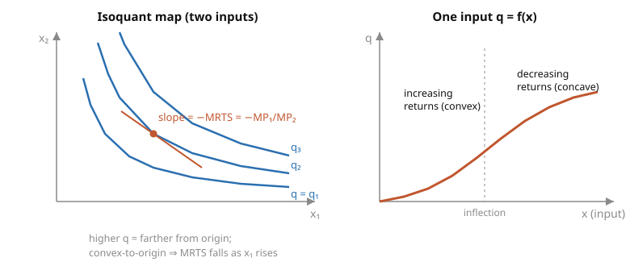

# Grad Microeconomics · Lesson 3.1: Production sets and technology

> ⏱ ~15 min · Module 3: Producer theory · Builds on: [2.6 Revealed preference](02-06-revealed-preference.md) · Unlocks: [3.2 Cost minimization](03-02-cost-minimization.md)

## Why this matters

Everything you just built for the consumer — a choice set, an objective, first-order conditions, a value function, and a duality between primal and dual — has a mirror image on the supply side. The firm is the consumer's structural twin: an isoquant *is* an indifference curve, the marginal rate of technical substitution *is* the marginal rate of substitution, the cost function *is* the expenditure function. Getting the firm's primitive right — the set of production plans it can physically carry out — is what makes the whole cost/profit duality of the next three lessons run. And one property of that primitive, convexity, is the exact producer-side analog of the concavity you met in [1.1](01-01-convexity-concavity-quasiconcavity.md): it is what guarantees the firm's optimization problems have well-behaved solutions.

## The idea

Forget "output = f(inputs)" for a moment. A firm's most general description is just a **list of everything it can do**. Book-keep every good with one sign convention: in a plan, negative entries are what you *use up*, positive entries are what you *make*. So a plan that turns 3 units of labor and 2 of steel into 5 cars is the vector $(-3,-2,5)$. This signed vector is called a **netput**. The firm's technology is then simply the set $Y$ of all netputs it can pull off — nothing more.

Why the abstraction? Because it handles multi-output firms, joint production, and inputs-that-are-also-outputs without any special pleading, and because the interesting economics turns out to be *properties of the shape of $Y$*: Does it contain the origin (can the firm shut down)? Can you always waste inputs (free disposal)? Can you run it backward (irreversibility)? Is it convex (does averaging two feasible plans stay feasible)? Each is a one-line geometric condition with a crisp economic meaning.

When there is a single output we can collapse $Y$ back down to the familiar **production function** $q=f(x)$: the most output the firm can squeeze from input bundle $x$. Its level sets are **isoquants**, and their slope is the rate at which you can trade one input for another while holding output fixed — the exact producer twin of the consumer's indifference-curve slope.

## The formal version

**Production set.** The technology is a set $Y\subseteq\mathbb{R}^n$. A point $y=(y_1,\dots,y_n)\in Y$ is a feasible **production plan** (netput): $y_k<0$ means good $k$ is a net input, $y_k>0$ a net output. When $Y=\{y:F(y)\le 0\}$ for a **transformation function** $F:\mathbb{R}^n\to\mathbb{R}$, the **efficient frontier** is $\{y:F(y)=0\}$ — the plans you cannot improve without using more of something.

*In words:* $Y$ is the menu of everything the firm can physically do; the frontier is the part of the menu with no slack.

The standard axioms on $Y$, each with its meaning:

- **Nonempty & closed.** $Y\neq\varnothing$, and $Y$ contains its limit points. *In words:* the firm can do *something*, and a plan that is the limit of feasible plans is itself feasible — closedness is exactly what lets a maximum exist (Weierstrass, from `real-analysis`).
- **No free lunch.** $Y\cap\mathbb{R}^n_+\subseteq\{0\}$. *In words:* the only plan with no negative entries (no inputs) is producing nothing — you cannot make output out of thin air.
- **Possibility of inaction.** $0\in Y$. *In words:* the firm can shut down, using and making nothing.
- **Free disposal.** $y\in Y$ and $y'\le y$ (componentwise) $\Rightarrow y'\in Y$. *In words:* you can always throw output away or soak up extra inputs for no gain — the frontier can be reached from "outside" by wasting.
- **Irreversibility.** $y\in Y,\ y\neq 0 \Rightarrow -y\notin Y$. *In words:* you cannot run the process in reverse to turn the cars back into labor and steel.
- **Convexity.** $y,y'\in Y$ and $t\in[0,1]\Rightarrow ty+(1-t)y'\in Y$. *In words:* time-sharing between two feasible plans is feasible; combined with $0\in Y$ this forces **nonincreasing returns to scale** (scaling a plan down stays feasible, but scaling up need not).

**Returns to scale** are statements about scaling a *whole* plan by $\alpha>0$:

$$\text{CRS}: y\in Y\Rightarrow \alpha y\in Y\ \forall\alpha\ge 0\ \ (Y\text{ is a cone});\quad \text{IRS}: \alpha\ge 1;\quad \text{DRS}: \alpha\in[0,1].$$

*In words:* constant returns means $Y$ is closed under any rescaling (a ray from the origin through any plan stays inside); increasing means you can only scale *up*; decreasing (= nonincreasing) means you can only scale *down*.

**Single output.** With one output, $Y=\{(-x,q):x\in\mathbb{R}^m_+,\ 0\le q\le f(x)\}$ where $f(x)$ is the **production function**. Returns to scale read off $f$ directly:

$$\text{CRS}\iff f(tx)=tf(x),\quad \text{IRS}\iff f(tx)>tf(x),\quad \text{DRS}\iff f(tx)<tf(x)\quad (t>1).$$

*In words:* double every input; constant returns doubles output exactly, increasing more than doubles, decreasing less than doubles. For $f$ homogeneous of degree $r$ — $f(tx)=t^r f(x)$ — the verdict is just $r$ vs $1$.

**MRTS.** Along an isoquant $\{x:f(x)=\bar q\}$, the **marginal rate of technical substitution** of input 1 for input 2 is

$$\mathrm{MRTS}_{12}=\frac{\partial f/\partial x_1}{\partial f/\partial x_2}=\frac{MP_1}{MP_2}=-\left.\frac{dx_2}{dx_1}\right|_{f=\bar q},$$

where $MP_k=\partial f/\partial x_k$ is the **marginal product** of input $k$. *In words:* the ratio of marginal products is exactly how much of input 2 you must add to stay on the same isoquant when you shed one unit of input 1 — the (negative) slope of the isoquant. This is the producer's $\mathrm{MRS}$.

**Elasticity of substitution** measures how curved the isoquant is:

$$\sigma=\frac{d\ln(x_2/x_1)}{d\ln \mathrm{MRTS}_{12}}\ \ge 0.$$

*In words:* the percentage change in the input ratio per one-percent change in the MRTS. Straight-line isoquants (perfect substitutes) give $\sigma=\infty$; right-angle isoquants (fixed proportions) give $\sigma=0$; Cobb–Douglas sits at $\sigma=1$.

**Convexity ↔ concavity (the link that matters).** For a single-output firm with free disposal, $Y$ is **convex $\iff f$ is concave**. A concave $f$ is automatically **quasiconcave** (its isoquants bound convex upper level sets — the input requirement sets $\{x:f(x)\ge \bar q\}$ are convex) and exhibits **nonincreasing returns to scale**. *In words:* the same convexity that gave the consumer nice indifference sets in [1.1](01-01-convexity-concavity-quasiconcavity.md) gives the firm convex-to-origin isoquants; this is precisely what makes the cost-minimization tangency of [3.2](03-02-cost-minimization.md) both necessary and sufficient, with no need to check every candidate corner.

## Picture

## Worked examples

**Example 1 (Cobb–Douglas — the workhorse).** Let $f(x_1,x_2)=x_1^{a}x_2^{b}$ with $a,b>0$ on $\mathbb{R}^2_{++}$.

Marginal products:

$$MP_1=\frac{\partial f}{\partial x_1}=a\,x_1^{a-1}x_2^{b}=a\,\frac{f}{x_1},\qquad MP_2=b\,x_1^{a}x_2^{b-1}=b\,\frac{f}{x_2}.$$

Marginal rate of technical substitution:

$$\mathrm{MRTS}_{12}=\frac{MP_1}{MP_2}=\frac{a\,f/x_1}{b\,f/x_2}=\frac{a}{b}\cdot\frac{x_2}{x_1}.$$

So as you use more $x_1$ and less $x_2$, the ratio $x_2/x_1$ falls and the MRTS falls — the isoquant flattens, which is exactly the convex-to-origin shape in the picture. (One can check $\sigma=1$ here: $\ln(x_2/x_1)=\ln\mathrm{MRTS}-\ln(a/b)$, so the derivative is $1$.)

Returns to scale: $f(tx_1,tx_2)=(tx_1)^a(tx_2)^b=t^{a+b}f(x_1,x_2)$ — homogeneous of degree $a+b$. Hence

$$a+b<1\Rightarrow\text{DRS},\qquad a+b=1\Rightarrow\text{CRS},\qquad a+b>1\Rightarrow\text{IRS}.$$

**Example 2 (the two extremes — reading $\sigma$ off the isoquant).** Contrast two one-parameter technologies with the Cobb–Douglas middle.

*Perfect substitutes:* $f(x_1,x_2)=ax_1+bx_2$. Isoquants $ax_1+bx_2=\bar q$ are straight lines, so $\mathrm{MRTS}_{12}=a/b$ is **constant** — the input ratio slides freely with no change in MRTS, giving $\sigma=\infty$. Scaling: $f(tx)=t\,f(x)$, so **constant returns**.

*Fixed proportions (Leontief):* $f(x_1,x_2)=\min\{x_1/a,\ x_2/b\}$. Isoquants are right angles with vertex on the ray $x_1/a=x_2/b$; away from the vertex one marginal product is zero, so the MRTS jumps from $\infty$ to $0$ across the kink and the input ratio never moves — $\sigma=0$. Scaling: $f(tx)=t\,f(x)$, again **constant returns**.

So elasticity of substitution and returns to scale are *independent* dials: both technologies here are CRS, yet one lets you substitute perfectly and the other not at all. (The CES family $f=(\alpha x_1^{\rho}+(1-\alpha)x_2^{\rho})^{1/\rho}$ interpolates all three, with $\sigma=1/(1-\rho)$: $\rho\to 1$ gives substitutes, $\rho\to 0$ gives Cobb–Douglas, $\rho\to-\infty$ gives Leontief.)

## Watch out

- **Returns to scale $\neq$ diminishing marginal product.** Returns to scale is *global*, about scaling *all* inputs together — $f(tx)$ vs $tf(x)$. Diminishing marginal product is *local*, about raising *one* input with the others fixed — the sign of $\partial^2 f/\partial x_k^2$. Cobb–Douglas with $a=b=0.6$ has $a+b=1.2>1$ (increasing returns) yet each marginal product diminishes ($a-1<0$). They are different questions; do not infer one from the other.
- **MRTS is a *ratio* of marginal products, and the subscripts order it.** $\mathrm{MRTS}_{12}=MP_1/MP_2$ (input 1 in the numerator), and it equals the *negative* of the isoquant slope. Flipping the ratio or forgetting the sign is the most common producer-theory arithmetic slip; it inverts every tangency in [3.2](03-02-cost-minimization.md).
- **Free disposal is an assumption, not a theorem.** It is imposed because it is realistic and convenient (it makes the frontier the graph of a function), but it can fail — think congestion or mandatory disposal costs. Likewise "no free lunch" and "inaction" are modeling choices; a given $Y$ satisfies exactly the ones you can verify from its definition.
- **Mind the netput signs.** In $Y\subseteq\mathbb{R}^n$ inputs are *negative*. The production function $f$ hides this by taking $x\ge 0$ and writing $q=f(x)$; the plan it corresponds to is $(-x,\,q)$. Mixing the two conventions mid-calculation is a reliable way to get a sign wrong.

## One-liner

> A firm is a *set of signed plans*: inputs negative, outputs positive — and its economics is the geometry of that set, with convexity of $Y$ (concavity of $f$) the producer twin of consumer convexity that keeps every optimum tame.

## Problems

**P1 (🟢)** For $f(x_1,x_2)=4\,x_1^{1/4}x_2^{1/2}$, compute $MP_1$, $MP_2$, and $\mathrm{MRTS}_{12}$, and classify the returns to scale.

**P2 (🟡)** A single-output firm uses good 1 as input and makes good 2, with netput set
$$Y=\{(y_1,y_2):\ y_1\le 0,\ 0\le y_2\le \sqrt{-y_1}\}.$$
(a) Does $Y$ satisfy *no free lunch*? *Possibility of inaction*? (b) Does $Y$ satisfy *free disposal*? (c) What are the returns to scale of the underlying $f$?

**P3 (🔴, optional)** For the CES technology $f(x_1,x_2)=\big(x_1^{\rho}+x_2^{\rho}\big)^{\nu/\rho}$ with $0<\rho<1$ and $\nu>0$: (a) show $f$ is homogeneous of degree $\nu$ and give the returns-to-scale verdict in terms of $\nu$; (b) compute $\mathrm{MRTS}_{12}$; (c) show the elasticity of substitution is $\sigma=1/(1-\rho)$, independent of $\nu$.

Solutions

**P1** Write $f=4x_1^{1/4}x_2^{1/2}$.

$$MP_1=4\cdot\tfrac14 x_1^{-3/4}x_2^{1/2}=x_1^{-3/4}x_2^{1/2},\qquad MP_2=4\cdot\tfrac12 x_1^{1/4}x_2^{-1/2}=2x_1^{1/4}x_2^{-1/2}.$$

$$\mathrm{MRTS}_{12}=\frac{MP_1}{MP_2}=\frac{x_1^{-3/4}x_2^{1/2}}{2x_1^{1/4}x_2^{-1/2}}=\frac{1}{2}\,x_1^{-1}x_2=\frac{x_2}{2x_1}.$$

Degree of homogeneity: $\tfrac14+\tfrac12=\tfrac34<1$, so $f(tx)=t^{3/4}f(x)$ — **decreasing returns to scale**. (The leading constant $4$ does not affect homogeneity.)

**P2** Feasible plans: input amount $x=-y_1\ge 0$, output $q=y_2$ with $0\le q\le\sqrt{x}$, i.e. $f(x)=\sqrt{x}$.

(a) *No free lunch:* need $Y\cap\mathbb{R}^2_+\subseteq\{0\}$. If $y\ge 0$ then $y_1\ge 0$; combined with the constraint $y_1\le 0$ this forces $y_1=0$, hence $y_2\le\sqrt{0}=0$, so $y_2=0$. The only nonnegative plan is $0$ — **holds**. *Inaction:* take $y_1=0,\ y_2=0$: then $0\le 0\le\sqrt{0}=0$ ✓, so $0\in Y$ — **holds**.

(b) *Free disposal:* need $y\in Y,\ y'\le y\Rightarrow y'\in Y$. Take $y=(y_1,y_2)\in Y$ and any $y'=(y_1',y_2')\le y$. Then $y_1'\le y_1\le 0$ ✓ the input sign, and $y_2'\le y_2\le\sqrt{-y_1}$. Since $y_1'\le y_1$ we have $-y_1'\ge -y_1\ge 0$, so $\sqrt{-y_1'}\ge\sqrt{-y_1}\ge y_2\ge y_2'$; also $y_2'\le y_2$ and we still need $y_2'\ge 0$. That last piece can fail — $y'\le y$ permits $y_2'<0$, which is not in $Y$. **As stated $Y$ fails free disposal**, but only because the definition pins output to $y_2\ge 0$. If we drop that floor (allow disposing of output, $y_2\le\sqrt{-y_1}$ with no lower bound), then every $y'\le y$ satisfies $y_2'\le y_2\le\sqrt{-y_1}\le\sqrt{-y_1'}$ and free disposal **holds**. This is exactly why free disposal is written as "$y'\le y$" with no nonnegativity trap — it is the modeling choice, not a theorem.

(c) $f(x)=\sqrt{x}=x^{1/2}$ is homogeneous of degree $\tfrac12<1$: $f(tx)=t^{1/2}f(x)$ — **decreasing returns to scale**. (Consistent with $\sqrt{\cdot}$ concave and $Y$ convex once the output floor is handled.)

**P3** Let $g=x_1^{\rho}+x_2^{\rho}$, so $f=g^{\nu/\rho}$.

(a) $g(tx)=(tx_1)^\rho+(tx_2)^\rho=t^\rho g(x)$, hence $f(tx)=(t^\rho g)^{\nu/\rho}=t^{\nu}g^{\nu/\rho}=t^{\nu}f(x)$ — homogeneous of degree $\nu$. So $\nu<1$ DRS, $\nu=1$ CRS, $\nu>1$ IRS.

(b) $MP_k=\dfrac{\nu}{\rho}g^{\nu/\rho-1}\cdot\rho x_k^{\rho-1}=\nu\,g^{\nu/\rho-1}x_k^{\rho-1}.$ The common factor $\nu g^{\nu/\rho-1}$ cancels in the ratio:

$$\mathrm{MRTS}_{12}=\frac{MP_1}{MP_2}=\frac{x_1^{\rho-1}}{x_2^{\rho-1}}=\left(\frac{x_1}{x_2}\right)^{\rho-1}=\left(\frac{x_2}{x_1}\right)^{1-\rho}.$$

(c) Take logs: $\ln\mathrm{MRTS}_{12}=(1-\rho)\ln(x_2/x_1)$, so $\ln(x_2/x_1)=\dfrac{1}{1-\rho}\ln\mathrm{MRTS}_{12}$. Therefore

$$\sigma=\frac{d\ln(x_2/x_1)}{d\ln\mathrm{MRTS}_{12}}=\frac{1}{1-\rho},$$

independent of $\nu$ — returns to scale ($\nu$) and substitutability ($\sigma$) are genuinely separate dials, confirming Example 2. (Check: $\rho\to 0\Rightarrow\sigma\to 1$, Cobb–Douglas; $\rho\to 1\Rightarrow\sigma\to\infty$, perfect substitutes.)

## Flashback

**From Lesson 1.1 (Convexity, concavity, quasiconcavity):** Show that $g(x_1,x_2)=x_1x_2$ on $\mathbb{R}^2_{++}$ is quasiconcave but **not** concave. Why does this matter for the claim "convex $Y$ needs $f$ concave, but tame isoquants only need $f$ quasiconcave"?

Solution

*Not concave:* the Hessian is $\begin{pmatrix}0&1\\1&0\end{pmatrix}$, with eigenvalues $\pm 1$ — indefinite, so $g$ is neither concave nor convex (a concave function needs a negative semidefinite Hessian everywhere).

*Quasiconcave:* the upper level sets are $\{(x_1,x_2)\in\mathbb{R}^2_{++}:x_1x_2\ge c\}$ for $c>0$, the region on and above the hyperbola $x_2=c/x_1$. Since $x_2=c/x_1$ is a convex function of $x_1$, the region above it is a convex set; every upper level set is convex, which is the definition of quasiconcavity.

*Why it matters:* the isoquants of $g$ are convex-to-origin (exactly the picture's left panel), so the tangency condition for cost minimization behaves well — that only requires **quasiconcavity** (convex input requirement sets). Full **concavity** is the stronger property, equivalent to the whole production set $Y$ being convex, which additionally forces nonincreasing returns to scale. Cobb–Douglas $x_1x_2$ (degree $2$, increasing returns) is the standard example of the gap: nice isoquants, but $Y$ is *not* convex.

## Connections

- **Backward:** this is [1.1](01-01-convexity-concavity-quasiconcavity.md)'s convexity/concavity/quasiconcavity toolkit re-cast for the firm — convex $Y$ ⇔ concave $f$ ⇒ quasiconcave $f$ ⇒ convex isoquants. The homogeneity bookkeeping and the definiteness test for concavity lean on `linalg-refresher` (quadratic forms) and `real-analysis` (closedness ⇒ existence of the optimum).
- **Forward:** [3.2](03-02-cost-minimization.md) minimizes input cost over an isoquant of this $f$ — the MRTS-equals-price-ratio tangency lives or dies on the convexity established here; 3.3 then maximizes profit over all of $Y$ and *recovers* the technology from the profit/cost functions (producer duality).
- **Sideways (consumer duality):** the entire lesson is the producer half of a dictionary you already know — isoquant ↔ indifference curve, $\mathrm{MRTS}\leftrightarrow\mathrm{MRS}$, input requirement set ↔ better-than set, and next lesson's cost function ↔ the expenditure function of [2.3](02-03-expenditure-minimization-duality.md). The economic intuition (returns to scale, substitution) traces back to `micro-refresher`.
