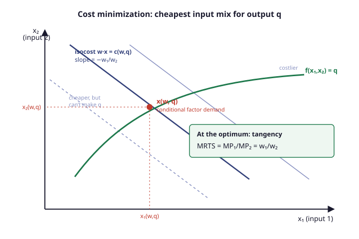

# Grad Microeconomics · Lesson 3.2: Cost minimization

> ⏱ ~15 min · Module 3: Producer theory · Builds on: [3.1 Production sets and technology](03-01-production-sets-technology.md) · Unlocks: [3.3 Profit maximization and supply](03-03-profit-maximization-supply.md)

## Why this matters

Before a firm decides *how much* to produce, it must know what any given output *costs* — the cheapest recipe of inputs that delivers it. That question is the cost-minimization problem, and it hands you the **cost function** $c(w,q)$: the firm's entire technology repackaged as a spending curve. Every supply decision in 3.3 runs through it, and it is the producer's mirror of a problem you have already solved. The consumer chasing a fixed utility target at least cost (the [expenditure minimization problem](02-03-expenditure-minimization-duality.md) of 2.3) and the firm chasing a fixed output target at least cost are *the same optimization with the labels changed*. So this lesson is mostly a translation exercise — and the payoff is that all of duality carries straight over.

## The idea

You must produce exactly $q$ units. The technology gives you many input mixes that hit $q$ — lots of labor and little capital, or the reverse — all lying on a single **isoquant** (a level curve of the production function, the producer's indifference curve). Inputs have prices, so each mix costs something. Draw the lines of equal spending — **isocost lines**, straight because total cost $w_1 x_1 + w_2 x_2$ is linear — and slide the cheapest one outward until it just kisses the isoquant. That tangency is the answer: any cheaper isocost line fails to reach $q$; any point where the isocost *crosses* the isoquant is beatable by sliding along the curve toward the flatter-cost direction.

At the kiss, the isoquant and the isocost line share a slope. The isoquant's slope is the **marginal rate of technical substitution** (MRTS) — how much input 2 you can shed per extra unit of input 1 while holding output fixed. The isocost's slope is the price ratio $w_1/w_2$. Setting them equal is the whole first-order story: *substitute toward the input that is cheap relative to its marginal product, until the relative productivity exactly offsets the relative price.* If that sentence feels familiar, it is the consumer's "MRS = price ratio" wearing a lab coat.

## The formal version

**The cost-minimization problem (CMP).** Inputs $x=(x_1,\dots,x_n)\ge 0$ have prices $w=(w_1,\dots,w_n)\gg 0$. Given a production function $f$ and a target output $q\ge 0$,

$$c(w,q) = \min_{x\ge 0}\; w\cdot x \quad\text{subject to}\quad f(x)\ge q.$$

*In words:* spend as little as possible while producing at least $q$. The minimizer is the **conditional factor demand** $x(w,q)$ (conditional because it fixes $q$), and $c(w,q)=w\cdot x(w,q)$ is the **cost function** — least cost as a function of prices and output.

**The dictionary (why 2.3 already did this).** Line up the CMP against the expenditure problem $e(p,\bar u)=\min_{x}\,p\cdot x$ s.t. $u(x)\ge\bar u$:

$$q \;\leftrightarrow\; \bar u,\qquad w \;\leftrightarrow\; p,\qquad f \;\leftrightarrow\; u,\qquad x(w,q)\;\leftrightarrow\; h(p,\bar u),\qquad c(w,q)\;\leftrightarrow\; e(p,\bar u).$$

*In words:* output target plays the role of the utility target, input prices the role of goods prices, and conditional factor demand the role of Hicksian (compensated) demand. Same feasible set shape, same objective, same theorems — every result below is a 2.3 result with symbols renamed.

**First-order (tangency) condition.** With an interior optimum and a differentiable $f$, the Lagrangian $w\cdot x + \lambda\big(q-f(x)\big)$ gives $w_i=\lambda\,\partial f/\partial x_i$ for each $i$. Dividing any two,

$$\underbrace{\frac{\partial f/\partial x_1}{\partial f/\partial x_2}}_{\text{MRTS}} = \frac{w_1}{w_2}.$$

*In words:* the ratio of marginal products equals the ratio of input prices — the isoquant is tangent to the isocost line. The multiplier $\lambda = \partial c/\partial q$ is marginal cost.

**Properties of $c(w,q)$** (all inherited from 2.3's expenditure function). As a function of $w$, $c$ is: (1) **homogeneous of degree 1** — $c(tw,q)=t\,c(w,q)$; (2) **nondecreasing** in each $w_i$; (3) **concave** in $w$; (4) **continuous**. It is also nondecreasing in $q$. *In words:* double all input prices and cost exactly doubles; costlier inputs never lower cost; and — the surprising one — cost bends *downward* in prices, because when one input's price rises the firm substitutes away from it, softening the blow.

**Shephard's lemma (again).** Where $c$ is differentiable in $w$,

$$x_i(w,q) = \frac{\partial c}{\partial w_i}(w,q).$$

*In words:* the conditional demand for input $i$ is just the price-sensitivity of cost — read the recipe straight off the derivative of the spending curve. This is the [envelope theorem of 1.4](01-04-envelope-theorem-duality.md): the indirect effect through re-optimizing the input mix vanishes at the optimum, so only the direct "you bought $x_i$ units" term survives. The **input-substitution matrix** $\big[\partial x_i/\partial w_j\big] = \big[\partial^2 c/\partial w_i\partial w_j\big]$ is therefore symmetric (mixed partials commute) and negative semidefinite (concavity of $c$) — own-price input demands slope down.

## Picture

## Worked examples

**Example 1 (Cobb–Douglas — the workhorse, computed in full).** Let $f(x_1,x_2)=x_1^{a}x_2^{b}$ with $a,b>0$. Marginal products are $\partial f/\partial x_1 = a\,x_1^{a-1}x_2^{b}$ and $\partial f/\partial x_2 = b\,x_1^{a}x_2^{b-1}$, so

$$\text{MRTS}=\frac{a x_2}{b x_1}=\frac{w_1}{w_2}\;\Longrightarrow\; x_2=\frac{b\,w_1}{a\,w_2}\,x_1.$$

Substitute into the constraint $x_1^{a}x_2^{b}=q$:

$$x_1^{a}\left(\frac{b w_1}{a w_2}\right)^{b}x_1^{b}=q \;\Longrightarrow\; x_1(w,q)=q^{\frac{1}{a+b}}\left(\frac{a\,w_2}{b\,w_1}\right)^{\frac{b}{a+b}},\qquad x_2(w,q)=q^{\frac{1}{a+b}}\left(\frac{b\,w_1}{a\,w_2}\right)^{\frac{a}{a+b}}.$$

These are the conditional factor demands. Cost is $c=w_1x_1+w_2x_2$; collecting the powers of $w_1,w_2$ and simplifying the constant to $(a+b)a^{-a/(a+b)}b^{-b/(a+b)}$ gives the clean form

$$\boxed{\,c(w,q)=(a+b)\,q^{\frac{1}{a+b}}\left(\frac{w_1}{a}\right)^{\frac{a}{a+b}}\left(\frac{w_2}{b}\right)^{\frac{b}{a+b}}.\,}$$

*Verify Shephard's lemma.* Since $c\propto w_1^{a/(a+b)}$, $\;\partial c/\partial w_1 = \tfrac{a}{a+b}\,c/w_1$. Plugging the boxed $c$ and simplifying $w_1^{a/(a+b)-1}=w_1^{-b/(a+b)}$ returns exactly $q^{1/(a+b)}\big(a w_2/(b w_1)\big)^{b/(a+b)}=x_1(w,q)$. ✓

*Returns to scale (link to 3.1).* $f$ is homogeneous of degree $a+b$, and cost carries the reciprocal exponent, $c\propto q^{1/(a+b)}$:

- $a+b=1$ (constant RTS): $c$ is **linear** in $q$ → average cost $=$ marginal cost, both constant in $q$.
- $a+b<1$ (decreasing RTS): exponent $1/(a+b)>1$ → $c$ is **convex** in $q$ → marginal cost rises.
- $a+b>1$ (increasing RTS): exponent $<1$ → $c$ is **concave** in $q$ → marginal cost falls.

Returns to scale in the technology become the curvature of cost in output — cleanly, with no extra assumptions.

**Example 2 (linear technology — where the recipe corners and Shephard kinks).** Let $f(x_1,x_2)=\alpha_1 x_1+\alpha_2 x_2$ (perfect substitutes: input $i$ yields $\alpha_i$ units of output per unit input). Producing one unit of output costs $w_i/\alpha_i$ if you use input $i$ alone — so use whichever is cheaper per unit of output:

$$c(w,q)=q\,\min\!\left\{\frac{w_1}{\alpha_1},\,\frac{w_2}{\alpha_2}\right\},\qquad x(w,q)=\begin{cases}\big(q/\alpha_1,\,0\big) & w_1/\alpha_1 < w_2/\alpha_2,\\[2pt]\big(0,\,q/\alpha_2\big) & w_1/\alpha_1 > w_2/\alpha_2.\end{cases}$$

The solution is a **corner** — all of one input, none of the other — because the isoquant is a straight line and slides the tangency to an axis. Two things to notice. First, $c$ is a **minimum of linear functions of $w$**, hence **concave** in $w$ — a vivid instance of property (3). Second, along the switching line $w_1/\alpha_1=w_2/\alpha_2$ the cost function has a **kink**: it is not differentiable, and there conditional demand is set-valued (any split works). Shephard's lemma holds on either side ($\partial c/\partial w_1=q/\alpha_1=x_1$ where input 1 is used, $=0$ where it is idle) but *fails at the kink* — exactly the point the substitution matrix cannot exist. (The Leontief technology $f=\min\{x_1/\alpha_1,x_2/\alpha_2\}$ is the mirror image: the kink lives in the L-shaped isoquant, giving fixed proportions $x_i=\alpha_i q$ and a cost $c=(\alpha_1w_1+\alpha_2w_2)q$ that is smooth in $w$.)

**Cost duality (preview).** Notice that in both examples $c(w,q)$ contains everything: substitution possibilities, returns to scale, the whole isoquant map. That is the duality claim — *a valid cost function recovers the technology*. You test validity with the properties above: is the candidate homogeneous of degree 1 in $w$, concave in $w$, and nondecreasing? If yes, it is *some* firm's cost function, and you can reconstruct its input requirement sets from it. The full reconstruction is Boss Problem 3; for now, treat the three tests as the passport check.

## Watch out

- **Cost is concave in $w$, not convex.** The instinct "more variables, more curving up" is wrong here. When an input's price rises the firm substitutes away, so cost rises *less* than linearly — it bends down, exactly like the expenditure function $e$ in prices. Convexity in $w$ is disqualifying (see P2).
- **Homogeneity is degree 1 in $w$, not in $q$.** Scaling all input prices scales cost proportionally (a units-of-money fact). Scaling *output* scales cost by $q^{1/(a+b)}$ — the returns-to-scale exponent — which is proportional only under constant returns.
- **Conditional factor demand fixes $q$; it is not what the firm actually buys.** $x(w,q)$ answers "cheapest way to make $q$," for *every* hypothetical $q$. The output the firm chooses — and hence the inputs it truly hires — waits for the profit-maximization of 3.3. Conditional demand is the compensated (Hicksian) object; the observable one is its unconditional cousin.
- **Shephard's lemma needs differentiability.** At a kink in $c(w,q)$ — perfect substitutes at the switch price, any corner — the derivative and the substitution matrix simply do not exist. The lemma is an envelope statement, and envelopes require a smooth ceiling.

## One-liner

> Cost minimization is expenditure minimization with output in place of utility: slide the isocost line to the isoquant, read the recipe off $\partial c/\partial w_i$, and remember cost bends *down* in prices.

## Problems

**P1 (🟢)** For $f(x_1,x_2)=x_1^{1/2}x_2^{1/2}$, find the conditional factor demands $x(w,q)$ and the cost function $c(w,q)$. Confirm that constant returns to scale makes $c$ linear in $q$, and state the (constant) average and marginal cost.

**P2 (🟡)** A colleague proposes $c(w,q)=q\sqrt{w_1^{2}+w_2^{2}}$ as a firm's cost function. Check the validity tests: is it homogeneous of degree 1 in $w$? Nondecreasing? Concave in $w$? Decide whether it can be *any* firm's cost function, and name the property that settles it.

**P3 (🔴, optional)** Using the conditional demands from P1, compute the input-substitution matrix $\big[\partial x_i/\partial w_j\big]$. Verify it is symmetric and negative semidefinite, and explain why its determinant is zero. (This is Shephard's lemma's second-derivative content, and connects to the definiteness machinery of `linalg-refresher`.)

Solutions

**P1** Here $a=b=\tfrac12$, so $a+b=1$. From Example 1's formulas,

$$x_1(w,q)=q\left(\frac{w_2}{w_1}\right)^{1/2}=q\sqrt{\frac{w_2}{w_1}},\qquad x_2(w,q)=q\sqrt{\frac{w_1}{w_2}}.$$

Cost: $c=w_1x_1+w_2x_2 = q\sqrt{w_1 w_2}+q\sqrt{w_1 w_2}=2q\sqrt{w_1 w_2}$. (The boxed formula agrees: $(a+b)=1$ and $(w_1/a)^{1/2}(w_2/b)^{1/2}=\sqrt{2w_1}\sqrt{2w_2}=2\sqrt{w_1w_2}$.) Since $c=2\sqrt{w_1w_2}\cdot q$ is linear in $q$, average cost $c/q=2\sqrt{w_1w_2}$ and marginal cost $\partial c/\partial q=2\sqrt{w_1w_2}$ are equal and independent of $q$ — the signature of constant returns.

**P2** Homogeneity: $c(tw,q)=q\sqrt{t^2w_1^2+t^2w_2^2}=t\,q\sqrt{w_1^2+w_2^2}=t\,c(w,q)$ — degree 1 ✓. Nondecreasing: $\partial c/\partial w_1 = q\,w_1/\sqrt{w_1^2+w_2^2}\ge 0$ ✓. Concavity: $\sqrt{w_1^2+w_2^2}$ is the Euclidean **norm** of $w$, and every norm is *convex*, not concave (its graph is a bowl opening up). So $c$ is convex in $w$ — the opposite of what a cost function requires. **It cannot be any firm's cost function**, and the disqualifying property is concavity in $w$. (Economically: this "firm" would let cost rise *faster* than linearly as one input's price climbs, meaning it never substitutes away — impossible for a cost-minimizer.)

**P3** From P1, $x_1=q\,w_1^{-1/2}w_2^{1/2}$ and $x_2=q\,w_1^{1/2}w_2^{-1/2}$. Differentiate:

$$\frac{\partial x_1}{\partial w_1}=-\frac{q}{2}\,w_1^{-3/2}w_2^{1/2},\quad \frac{\partial x_1}{\partial w_2}=\frac{q}{2}\,w_1^{-1/2}w_2^{-1/2},\quad \frac{\partial x_2}{\partial w_1}=\frac{q}{2}\,w_1^{-1/2}w_2^{-1/2},\quad \frac{\partial x_2}{\partial w_2}=-\frac{q}{2}\,w_1^{1/2}w_2^{-3/2}.$$

So

$$M=\frac{q}{2}\begin{pmatrix} -\,w_1^{-3/2}w_2^{1/2} & w_1^{-1/2}w_2^{-1/2}\\[4pt] w_1^{-1/2}w_2^{-1/2} & -\,w_1^{1/2}w_2^{-3/2}\end{pmatrix}.$$

**Symmetric:** the off-diagonal entries are identical ($\partial x_1/\partial w_2=\partial x_2/\partial w_1$) — mixed partials of $c$ commute, i.e. Shephard applied twice either way. **Negative semidefinite:** both diagonal entries are negative (own-price input demands slope down), and the determinant is

$$\det M=\frac{q^2}{4}\Big[(w_1^{-3/2}w_2^{1/2})(w_1^{1/2}w_2^{-3/2})-(w_1^{-1/2}w_2^{-1/2})^2\Big]=\frac{q^2}{4}\big[w_1^{-1}w_2^{-1}-w_1^{-1}w_2^{-1}\big]=0.$$

A symmetric $2\times2$ matrix with nonpositive diagonal and zero determinant has eigenvalues $\{0,\text{negative}\}$, hence is negative semidefinite. The **zero determinant is not an accident**: $c$ is homogeneous of degree 1 in $w$, so by Euler's theorem the substitution matrix annihilates the price vector, $Mw=0$ — the price direction is always a null eigenvector, forcing a zero eigenvalue. NSD-but-singular is exactly what homogeneity predicts.

## Flashback

**From Lesson 2.3 (Expenditure minimization and duality):** For utility $u(x_1,x_2)=x_1^{1/2}x_2^{1/2}$, prices $p=(p_1,p_2)$, and target $\bar u$, solve the expenditure-minimization problem: find the Hicksian demand $h(p,\bar u)$ and the expenditure function $e(p,\bar u)$. Then state, term by term, the dictionary that turns this into the cost-minimization answer of P1.

Solution

The EMP $\min_x p\cdot x$ s.t. $u(x)\ge\bar u$ is structurally the CMP with $u\leftrightarrow f$, $\bar u\leftrightarrow q$, $p\leftrightarrow w$. Its tangency condition is MRS $=x_2/x_1=p_1/p_2$, identical algebra to P1. Hence

$$h_1(p,\bar u)=\bar u\sqrt{\frac{p_2}{p_1}},\qquad h_2(p,\bar u)=\bar u\sqrt{\frac{p_1}{p_2}},\qquad e(p,\bar u)=2\,\bar u\sqrt{p_1 p_2}.$$

The dictionary: $u\to f$, $\bar u\to q$, $p\to w$, Hicksian demand $h(p,\bar u)\to$ conditional factor demand $x(w,q)$, expenditure $e(p,\bar u)\to$ cost $c(w,q)$. Apply it to $e=2\bar u\sqrt{p_1p_2}$ and you land exactly on P1's $c=2q\sqrt{w_1w_2}$ — not analogous, *the same object relabeled*. Shephard's lemma reads $h_i=\partial e/\partial p_i$ there and $x_i=\partial c/\partial w_i$ here; the concavity of $e$ in $p$ is the concavity of $c$ in $w$. One theorem, two markets.

## Connections

- **Backward:** this is [2.3](02-03-expenditure-minimization-duality.md)'s expenditure-minimization problem verbatim, output for utility — every property, and Shephard's lemma, is inherited, not re-proved. It minimizes over the technology built in [3.1](03-01-production-sets-technology.md), and returns to scale there become cost's curvature in $q$ here. The envelope logic behind Shephard is [1.4](01-04-envelope-theorem-duality.md).
- **Forward:** [3.3](03-03-profit-maximization-supply.md) puts cost to work — the firm chooses the output $q$ that maximizes $pq-c(w,q)$, and marginal cost $\partial c/\partial q$ becomes the supply curve. Cost minimization is the inner problem inside profit maximization.
- **Sideways (real-analysis):** concavity of $c$ in $w$ — and the substitution matrix being negative semidefinite — is the concave-function / second-derivative theory of `real-analysis`; the singular-but-NSD Hessian in P3 is the definiteness-of-quadratic-forms toolkit of `linalg-refresher`. The economic reading of the same math (firms substitute; consumers substitute) is the `micro-refresher` intuition made rigorous.
