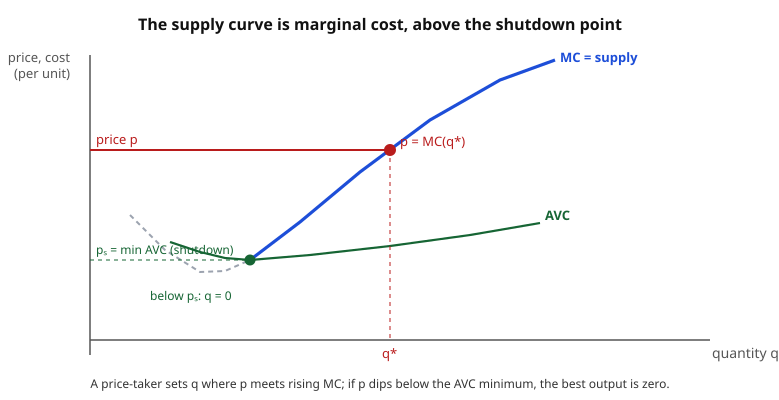

# Grad Microeconomics · Lesson 3.3: Profit maximization and supply

> ⏱ ~15 min · Module 3: Producer theory · Builds on: [3.2 Cost minimization](03-02-cost-minimization.md) · Unlocks: [3.4 Aggregation and the firm](03-04-aggregation-and-the-firm.md)

## Why this matters

A firm's whole reason for existing is one number: profit. But "maximize profit" hides a two-step structure that the entire theory of supply hangs on. First, *however much* you decide to produce, you should produce it as cheaply as possible — that is cost minimization, done in [3.2](03-02-cost-minimization.md). Second, given that cheapest-cost schedule, choose *how much* to sell. Do the second step and the famous rule falls out immediately: a price-taking firm produces where **price equals marginal cost**. That single condition is the supply curve. And the profit function it generates is the third and final panel of the duality triptych — after utility ↔ expenditure (2.2–2.3) and cost ↔ technology (3.2), you get profit ↔ technology here, with Hotelling's lemma playing the role Roy's identity and Shephard's lemma played before. One theorem, three costumes.

## The idea

Think of running a lemonade stand where you can sell as many cups as you like at the going price $p$ — you are small, the market ignores you (a *price-taker*). You already know, from 3.2, the cheapest way to make any number of cups: the cost function $c(q)$. Now you tune the dial $q$.

Ask: should I make one more cup? That cup sells for $p$ and costs an extra $c'(q)$ — its **marginal cost** — to produce. If $p > c'(q)$, the cup earns more than it costs: make it. If $p < c'(q)$, it loses money: don't. You keep expanding exactly until the two meet, $p = c'(q)$. That is the whole logic — squeeze out every cup that pays for itself and stop at the one that just breaks even at the margin.

Two things this reasoning quietly assumes. It assumes marginal cost is *rising* where you stop — otherwise "just past the meeting point every cup still pays" and you'd want infinite cups. And it assumes the price at least covers the per-cup running cost, or you'd do better selling nothing. Both caveats become the fine print of the formal rule.

## The formal version

**The profit-maximization problem (PMP).** A firm with technology set $Y$ (the netput vectors $y$ it can carry out; positive entries are outputs, negative are inputs) at prices $p \gg 0$ solves

$$\pi(p) = \max_{y \in Y}\; p \cdot y.$$

*In words:* pick the feasible production plan whose revenue-minus-cost, valued at market prices, is largest; $\pi$ records that best value.

For a single-output firm with output price $p$, input prices $w = (w_1,\dots,w_n)$, and production function $q = f(x)$, split it into the two-step form:

$$\pi(p,w) = \max_{q \ge 0}\Big[\, p\,q - c(w,q) \,\Big], \qquad c(w,q) = \min_{x:\,f(x)\ge q} w\cdot x.$$

*In words:* inside, $c(w,q)$ is the minimum cost of $q$ units (the output of [3.2](03-02-cost-minimization.md)); outside, choose $q$ to maximize revenue $pq$ minus that cost. Cost minimization is nested inside profit maximization — solve it first, then this becomes a one-variable problem in $q$.

**First-order condition.** Differentiating the bracket in $q$ and setting it to zero,

$$p - \frac{\partial c(w,q)}{\partial q} = 0 \quad\Longrightarrow\quad \boxed{\,p = MC(w,q)\,}.$$

*In words:* at the optimum, output price equals marginal cost. The price-taker expands until the revenue from the last unit exactly matches what it cost to make.

**Second-order condition.** For a maximum we need the bracket concave in $q$, i.e.

$$-\frac{\partial^2 c}{\partial q^2} \le 0 \quad\Longleftrightarrow\quad \frac{\partial\, MC}{\partial q} \ge 0.$$

*In words:* marginal cost must be **non-decreasing** at the chosen output. If $MC$ were falling there, producing one more unit past $p = MC$ would still add profit, so no finite optimum exists. This is why competitive theory needs eventually-rising marginal cost — which comes from decreasing returns / a convex cost function.

**The returns-to-scale knife-edge.** With *constant* returns to scale, $c(w,q) = c(w,1)\,q$ is linear, so $MC = c(w,1)$ is flat. Then $p \cdot q - c(w,1)q = (p - MC)\,q$: if $p < MC$ produce $0$, if $p > MC$ produce $\infty$, and if $p = MC$ *any* $q$ is optimal with profit exactly $0$. Supply is a **correspondence**, not a function, and maximized profit is zero. With *increasing* returns, $MC$ falls and no interior maximum exists at all. So a well-behaved competitive supply curve requires eventually-decreasing returns.

**The profit function and its properties.** As a function of the price vector $(p,w)$, $\pi$ inherits four properties directly from being a max of linear functions:

1. **Homogeneous of degree 1:** $\pi(\alpha p, \alpha w) = \alpha\,\pi(p,w)$ for $\alpha > 0$ — scaling all prices scales profit, the plan unchanged (only *relative* prices matter for the choice).
2. **Convex** in $(p,w)$ — the point this lesson keeps returning to.
3. **Increasing** in the output price $p$, **decreasing** in each input price $w_i$.
4. **Continuous** on its domain.

*In words:* $\pi$ is a value function, so it is the upper envelope of the affine functions $(p,w)\mapsto p\cdot y$ (one per fixed plan $y$), and a max of affine functions is convex — exactly the [1.4](01-04-envelope-theorem-duality.md) picture. Convexity is the producer's structural signature, and (as below) the source of the law of supply.

**Hotelling's lemma.** Where $\pi$ is differentiable,

$$\frac{\partial \pi(p,w)}{\partial p} = q(p,w) \qquad\text{and}\qquad \frac{\partial \pi(p,w)}{\partial w_i} = -\,x_i(p,w).$$

*In words:* the price-derivative of the profit function *is* the profit-maximizing supply; the (negative) input-price-derivative *is* the factor demand. You read the firm's behavior straight off the slope of its value function — no re-solving. This is the envelope theorem of [1.4](01-04-envelope-theorem-duality.md) with the parameter set to a price: since the plan $y$ enters $p\cdot y$ directly and $\partial\pi/\partial p = y_{\text{output}}\big|_{y^*} = q$, the re-optimization term vanishes. It is the producer's analog of Roy's identity (2.2) and Shephard's lemma (2.3).

**The law of supply.** Because $\pi$ is convex, its Hessian $D^2_{(p,w)}\pi$ is **positive semidefinite (PSD)**. By Hotelling, that Hessian is exactly the Jacobian of the netput supply $\big(q, -x\big)$ with respect to $(p,w)$. Reading the diagonal:

$$\frac{\partial q}{\partial p} = \frac{\partial^2 \pi}{\partial p^2} \ge 0, \qquad \frac{\partial (-x_i)}{\partial(- w_i)}= \frac{\partial x_i}{\partial w_i}\le 0.$$

*In words:* output never falls when its own price rises, and each factor demand slopes down in its own price. This is the mirror image of the consumer's Slutsky matrix — but note the **sign flip**: the Slutsky substitution matrix is *negative* semidefinite (expenditure is *concave* in prices), while the profit Hessian is *positive* semidefinite (profit is *convex* in prices). Same envelope machinery, opposite curvature, because one problem is a min and the other a max.

**Recovering technology (the third duality).** Just as the expenditure function pins down preferences (2.3) and the cost function pins down the input requirement sets (3.2), the profit function pins down the production set: under free disposal and convexity,

$$Y = \big\{\, y : p\cdot y \le \pi(p) \text{ for all } p \gg 0 \,\big\}.$$

*In words:* $Y$ is the intersection of all the halfspaces its own profit function allows — knowing the most you could earn at *every* price vector is enough to reconstruct everything you could physically do. This closes the duality gallery: utility ↔ expenditure, technology ↔ cost, technology ↔ profit.

## Picture

The firm reads its output off the rising branch of marginal cost: slide the horizontal price line $p$ up or down and the intersection $p = MC$ traces out $q(p)$ — the supply curve *is* that rising MC branch. Two boundaries close it in. Below, the branch is truncated at the **minimum of average variable cost**: if $p$ dips under that, every unit fails to cover its own running cost and the firm shuts down ($q = 0$), so the falling branch of MC (dashed) is never used. The rising slope is the second-order condition made visible — and, by Hotelling, that same upward tilt is why $\partial q/\partial p \ge 0$.

## Worked examples

**Example 1 (mechanical — supply and profit from a power cost function, with a Hotelling check).** Cost minimization on a decreasing-returns technology delivers a cost function of the form

$$c(w,q) = k(w)\, q^{\gamma}, \qquad \gamma > 1,$$

where $k(w) > 0$ collects the input-price dependence and $\gamma > 1$ encodes decreasing returns (so $MC$ rises). Marginal cost is $MC = \gamma\,k(w)\,q^{\gamma - 1}$. Set $p = MC$ and solve for supply:

$$p = \gamma\,k(w)\,q^{\gamma-1} \;\Longrightarrow\; q(p,w) = \left(\frac{p}{\gamma\,k(w)}\right)^{\frac{1}{\gamma - 1}}.$$

Since $\gamma > 1$, the exponent $\tfrac{1}{\gamma-1} > 0$: supply rises with $p$, as the law of supply demands. Now the profit function — substitute $q(p,w)$ into $pq - c$. Write $m \equiv \tfrac{1}{\gamma - 1}$ so $q = (p/\gamma k)^{m}$ and $q^\gamma = (p/\gamma k)^{m\gamma}$. Then

$$\pi(p,w) = p\,q - k q^{\gamma} = p\left(\frac{p}{\gamma k}\right)^{m} - k\left(\frac{p}{\gamma k}\right)^{m\gamma}.$$

Use the key identity $m(\gamma - 1) = 1$, so $(p/\gamma k)^{m\gamma} = (p/\gamma k)^{m}\cdot(p/\gamma k)^{m(\gamma-1)} = (p/\gamma k)^{m}\cdot\frac{p}{\gamma k}$. That lets the two terms share a factor:

$$\pi = p\Big(\tfrac{p}{\gamma k}\Big)^{m} - k\Big(\tfrac{p}{\gamma k}\Big)^{m}\tfrac{p}{\gamma k} = \Big(\tfrac{p}{\gamma k}\Big)^{m} p\Big(1 - \tfrac{1}{\gamma}\Big) = (\gamma - 1)\,\gamma^{-\frac{\gamma}{\gamma-1}}\, k(w)^{-\frac{1}{\gamma-1}}\, p^{\frac{\gamma}{\gamma-1}},$$

where the last step expands $(p/\gamma k)^m = p^m(\gamma k)^{-m}$ and collects powers using $m + 1 = \tfrac{\gamma}{\gamma-1}$. **Hotelling check** — differentiate in $p$:

$$\frac{\partial \pi}{\partial p} = \frac{\gamma}{\gamma-1}\cdot(\gamma-1)\,\gamma^{-\frac{\gamma}{\gamma-1}}k^{-\frac{1}{\gamma-1}}\,p^{\frac{1}{\gamma-1}} = \left(\frac{p}{\gamma k}\right)^{\frac{1}{\gamma-1}} = q(p,w).\;\checkmark$$

The derivative of profit reproduces supply exactly — Hotelling's lemma, verified end to end.

To ground it: with $\gamma = 2$ (so $c = k q^2$, $m = 1$), supply is $q = p/2k$ (linear, rising) and $\pi = p^2/4k$ — precisely the shape of the [1.4](01-04-envelope-theorem-duality.md) P3 firm, now derived from cost rather than from the primal input choice.

**Example 2 (why you'd care — convexity, the law of supply, and the constant-returns knife-edge).** Take the $\gamma = 2$ case, $\pi(p,w) = p^2/(4k(w))$ with a single input, $k(w) = w$ (so $c = w q^2$). Check the two headline properties.

*Convexity and the law of supply.* $\dfrac{\partial \pi}{\partial p} = \dfrac{p}{2w} = q$, and $\dfrac{\partial^2 \pi}{\partial p^2} = \dfrac{1}{2w} > 0$ — profit is convex in $p$, and this second derivative *is* $\partial q/\partial p = 1/2w > 0$, the law of supply on the nose. For the input, $\dfrac{\partial \pi}{\partial w} = -\dfrac{p^2}{4w^2} = -x$ gives factor demand $x = p^2/4w^2$, and $\dfrac{\partial x}{\partial w} = -\dfrac{p^2}{2w^3} < 0$: demand slopes down in its own price. The full Hessian

$$D^2\pi = \begin{pmatrix} \frac{1}{2w} & -\frac{p}{2w^2} \\[2pt] -\frac{p}{2w^2} & \frac{p^2}{2w^3}\end{pmatrix}$$

has non-negative diagonal and determinant $\frac{1}{2w}\cdot\frac{p^2}{2w^3} - \frac{p^2}{4w^4} = \frac{p^2}{4w^4} - \frac{p^2}{4w^4} = 0 \ge 0$ — positive semidefinite, confirming convexity. (The zero determinant is homogeneity showing itself: degree-1 homogeneity forces the Hessian to be singular, with $(p,w)$ in its null space.)

*The knife-edge.* Now flatten the technology to constant returns, $c(w,q) = w\,q$. Then $\pi = \max_q (p - w)\,q$: for $p < w$ produce nothing, for $p > w$ produce unboundedly, and for $p = w$ any output is optimal with **profit exactly zero**. Supply is the correspondence $q \in [0,\infty)$ at $p = w$ and $\{0\}$ or "$\infty$" off it — no smooth curve, no positive profit. This is exactly why competitive firms need *strictly* rising $MC$ for the tidy picture of Example 1 to hold, and it foreshadows why the long-run competitive industry earns zero profit in [3.4](03-04-aggregation-and-the-firm.md).

## Watch out

- **You might think price always equals marginal cost, full stop — but $p = MC$ needs a rising MC there.** With constant returns $MC$ is flat and scale is indeterminate (profit zero, supply a correspondence); with increasing returns $MC$ falls and there is *no* profit-maximizing output — the firm wants to be infinitely large. The clean supply curve exists only on the eventually-rising branch.
- **You might expect the profit function to be concave in prices like expenditure — but it is *convex*.** Expenditure and cost are *minima* of price-linear functions (concave); profit is a *maximum* of price-linear functions (convex). The curvature sign is the whole difference between the consumer's negative-semidefinite Slutsky matrix and the producer's positive-semidefinite profit Hessian. Getting the sign backward inverts the law of supply.
- **You might apply $p = MC$ and forget the shutdown floor.** If $p$ falls below the minimum of average variable cost, the profit-maximizing quantity is $q = 0$, not the (loss-making) interior $p = MC$ point on the falling branch. $p = MC$ is necessary, not sufficient — always check the firm would rather operate than close.
- **You might treat $\pi$ as scale-sensitive to the price *level*.** It is homogeneous of degree 1: double every price (output and inputs together) and profit doubles with the plan unchanged. Only relative prices move the firm's choice; a common inflation of all prices is a pure rescaling.

## One-liner

> A price-taker rides up its rising marginal-cost curve until $p = MC$, and the resulting profit function is convex in prices with supply as its price-gradient — Hotelling's lemma, the producer's Roy/Shephard.

## Problems

**P1 (🟢)** A firm has cost function $c(w,q) = w\,q^{3/2}$ (so $\gamma = 3/2$, one input at price $w$). Derive the supply curve $q(p,w)$ from $p = MC$, and confirm it rises in $p$.

**P2 (🟡)** For the same firm, find the profit function $\pi(p,w)$ in closed form, then verify Hotelling's lemma: show $\partial\pi/\partial p$ equals your supply from P1 and $\partial\pi/\partial w$ equals $-x$, where $x$ is the cost-minimizing input use. Check that $\pi$ is convex in $p$.

**P3 (🔴, optional)** A firm produces two outputs from fixed resources with profit function $\pi(p_1,p_2) = \tfrac{1}{2}\big(p_1^2 + p_2^2\big)$ (input prices suppressed). (a) Use Hotelling's lemma to find both supply functions $q_1(p), q_2(p)$. (b) Write the $2\times 2$ Hessian $D^2\pi$ and confirm it is positive semidefinite (the law of supply for both goods). (c) Is this $\pi$ homogeneous of degree 1? If not, what does that tell you about whether it can be a genuine profit function of *all* prices — and what is the resolution?

Solutions

**P1** Marginal cost: $MC = \dfrac{\partial}{\partial q}\big(w q^{3/2}\big) = \tfrac{3}{2}\,w\,q^{1/2}$. Set $p = MC$:

$$p = \tfrac{3}{2} w\,q^{1/2} \;\Longrightarrow\; q^{1/2} = \frac{2p}{3w} \;\Longrightarrow\; q(p,w) = \frac{4p^2}{9w^2}.$$

$\partial q/\partial p = 8p/9w^2 > 0$, so supply rises in $p$. ✓ ($MC$ is increasing in $q$ since $\gamma = 3/2 > 1$, so the second-order condition holds and this interior point is a genuine max.)

**P2** Substitute $q = 4p^2/9w^2$ into $\pi = pq - c$. Revenue: $pq = p\cdot\dfrac{4p^2}{9w^2} = \dfrac{4p^3}{9w^2}$. Cost: $q^{3/2} = \big(\tfrac{4p^2}{9w^2}\big)^{3/2} = \dfrac{8 p^3}{27 w^3}$, so $c = w q^{3/2} = \dfrac{8p^3}{27 w^2}$. Then

$$\pi(p,w) = \frac{4p^3}{9w^2} - \frac{8p^3}{27w^2} = \frac{12p^3 - 8p^3}{27 w^2} = \frac{4p^3}{27\,w^2}.$$

*Hotelling in $p$:* $\dfrac{\partial \pi}{\partial p} = \dfrac{12 p^2}{27 w^2} = \dfrac{4p^2}{9w^2} = q(p,w)$. ✓ Matches P1.

*Hotelling in $w$:* $\dfrac{\partial \pi}{\partial w} = 4p^3\cdot\big(-2\big)w^{-3}/27 = -\dfrac{8p^3}{27 w^3}$, so factor demand is $x = \dfrac{8p^3}{27 w^3}$. Cross-check against cost minimization: the input use at output $q$ is $x = q^{3/2} = \dfrac{8p^3}{27 w^3}$ (from the cost $c = w\cdot x$ with $x = q^{3/2}$) — identical. ✓

*Convexity:* $\dfrac{\partial^2 \pi}{\partial p^2} = \dfrac{8p}{9w^2} > 0$ for $p > 0$, so $\pi$ is convex in $p$. ✓ (And this equals $\partial q/\partial p$ from P1 — the law of supply again.)

**P3** (a) Hotelling: $q_i = \partial \pi/\partial p_i$. So $q_1(p) = p_1$ and $q_2(p) = p_2$.

(b) Hessian:

$$D^2\pi = \begin{pmatrix} \partial^2\pi/\partial p_1^2 & \partial^2\pi/\partial p_1\partial p_2 \\ \partial^2\pi/\partial p_2\partial p_1 & \partial^2\pi/\partial p_2^2\end{pmatrix} = \begin{pmatrix} 1 & 0 \\ 0 & 1\end{pmatrix} = I.$$

The identity is positive definite (eigenvalues $1,1 > 0$), hence PSD: $\partial q_1/\partial p_1 = 1 \ge 0$ and $\partial q_2/\partial p_2 = 1 \ge 0$, each output rising in its own price. ✓ The zero off-diagonals say the two goods are independent in supply here.

(c) Homogeneity of degree 1 would require $\pi(\alpha p) = \alpha\,\pi(p)$. But $\pi(\alpha p) = \tfrac{1}{2}\big(\alpha^2 p_1^2 + \alpha^2 p_2^2\big) = \alpha^2\,\pi(p) \ne \alpha\,\pi(p)$ — it is homogeneous of degree **2**, not 1. A profit function of *all* prices (outputs *and* inputs) must be degree-1 homogeneous, so this $\pi$ cannot be the profit function of a firm whose only prices are $p_1,p_2$. Resolution: the "suppressed input prices" are doing real work. If input prices $w$ are held fixed and $\pi$ is degree-1 in $(p,w)$ jointly, then as a function of $p$ *alone* at fixed $w$ it need not be degree-1 — the missing homogeneity lives in the frozen $w$. (Equivalently: only *relative* prices are pinned down; a genuine full profit function scales linearly when $p$ *and* $w$ scale together.)

## Flashback

**From Lesson 3.2 (Cost minimization):** A firm has cost function $c(w_1,w_2,q) = 2\,q\,\sqrt{w_1 w_2}$. Use Shephard's lemma to find the conditional factor demands $x_1(w,q)$ and $x_2(w,q)$, and confirm that this cost function is homogeneous of degree 1 in $(w_1,w_2)$ and concave in prices.

Solution

**Shephard's lemma** ($x_i = \partial c/\partial w_i$): write $c = 2q\,w_1^{1/2}w_2^{1/2}$. Then

$$x_1 = \frac{\partial c}{\partial w_1} = 2q\cdot\tfrac{1}{2}w_1^{-1/2}w_2^{1/2} = q\sqrt{\frac{w_2}{w_1}}, \qquad x_2 = \frac{\partial c}{\partial w_2} = q\sqrt{\frac{w_1}{w_2}}.$$

*Sanity check:* $w_1 x_1 + w_2 x_2 = q\sqrt{w_1 w_2} + q\sqrt{w_1 w_2} = 2q\sqrt{w_1 w_2} = c$. ✓ (Input spending reconstructs total cost, as it must.)

**Homogeneity degree 1 in $w$:** $c(\alpha w_1, \alpha w_2, q) = 2q\sqrt{\alpha w_1 \cdot \alpha w_2} = 2q\,\alpha\sqrt{w_1 w_2} = \alpha\,c(w,q)$. ✓ Doubling both input prices doubles cost, mix unchanged.

**Concavity in prices:** the Hessian in $(w_1,w_2)$. With $c = 2q(w_1 w_2)^{1/2}$,

$$\frac{\partial^2 c}{\partial w_1^2} = -\tfrac{1}{2}q\,w_1^{-3/2}w_2^{1/2} < 0, \quad \frac{\partial^2 c}{\partial w_2^2} = -\tfrac{1}{2}q\,w_1^{1/2}w_2^{-3/2} < 0,$$

$$\frac{\partial^2 c}{\partial w_1 \partial w_2} = \tfrac{1}{2}q\,w_1^{-1/2}w_2^{-1/2}.$$

Determinant: $\big(-\tfrac{1}{2}q w_1^{-3/2}w_2^{1/2}\big)\big(-\tfrac{1}{2}q w_1^{1/2}w_2^{-3/2}\big) - \big(\tfrac{1}{2}q w_1^{-1/2}w_2^{-1/2}\big)^2 = \tfrac{1}{4}q^2 w_1^{-1}w_2^{-1} - \tfrac{1}{4}q^2 w_1^{-1}w_2^{-1} = 0$. Negative diagonal and zero determinant → the Hessian is negative semidefinite, so $c$ is **concave** in prices. ✓ (Note the contrast with today's lesson: cost is *concave* in input prices, profit is *convex* in all prices — the two curvatures that run the whole duality.)

## Connections

- **Backward:** the inner minimization here is exactly [3.2](03-02-cost-minimization.md) — cost minimization feeds its marginal cost into the outer $p = MC$ choice, and Shephard's lemma there is the twin of Hotelling's lemma here. The convexity of $\pi$ as a max of affine-in-price functions is the [1.4](01-04-envelope-theorem-duality.md) envelope picture, and Hotelling's lemma *is* the envelope theorem with the parameter set to a price (P3 of 1.4 was this lesson in miniature).
- **Forward:** [3.4](03-04-aggregation-and-the-firm.md) sums these individual supply curves into industry supply and asks when many firms act "as if" one representative firm — and why free entry with constant returns drives long-run profit to zero (the knife-edge of Example 2). Producer surplus, the area left of the supply curve, is the profit-function object that [4.1](04-01-partial-equilibrium-surplus.md) builds partial-equilibrium welfare from.
- **Sideways:** this completes the **duality gallery**. Roy's identity (2.2), Shephard's lemma (2.3 and 3.2), and Hotelling's lemma (here) are one theorem — differentiate a value function, get the optimal choice — differing only in min-vs-max and hence concave-vs-convex curvature. The consumer's negative-semidefinite Slutsky matrix and the producer's positive-semidefinite profit Hessian are the same envelope fact with the sign flipped. Recovering $Y$ from $\pi$ mirrors recovering preferences from expenditure: value functions and technologies determine each other, the economic face of Legendre–Fenchel conjugacy noted in [1.4](01-04-envelope-theorem-duality.md).
