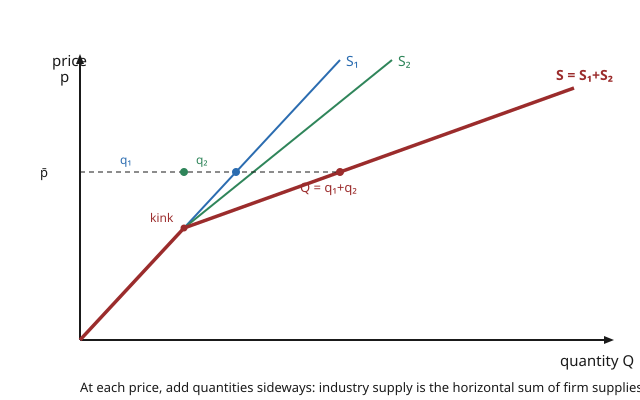

# Grad Microeconomics · Lesson 3.4: Aggregation and the firm

> ⏱ ~15 min · Module 3: Producer theory · Builds on: [3.3 Profit maximization and supply](03-03-profit-maximization-supply.md) · Unlocks: [4.1 Partial equilibrium and surplus](04-01-partial-equilibrium-surplus.md)

## Why this matters

Markets clear against *industry* supply, not one firm's. So before we can put supply and demand in the same picture ([4.1](04-01-partial-equilibrium-surplus.md)) or prove a competitive equilibrium exists and is efficient ([4.3](04-03-existence-walrasian-equilibrium.md)–[4.4](04-04-two-welfare-theorems.md)), we need to know how many firms' worth of behavior collapses into a single supply curve — and whether that collapse loses any information. The headline: on the producer side it loses *nothing*. Aggregate supply behaves exactly as if a single "representative firm" chose it, and independent profit maximization automatically produces the industry's output at least total cost. That clean aggregation is a small miracle — and it is exactly the miracle that **fails** on the consumer side, which is why demand aggregation is hard and supply aggregation is a one-liner.

## The idea

Fix a price $p$. Firm 1 wants to sell $q_1(p)$ units, firm 2 wants $q_2(p)$, and so on — each reads the *same* price off the wall and picks its own quantity. The market doesn't care who made what; it only sees the total $Q(p) = q_1(p) + q_2(p) + \cdots$. So to build industry supply you **add quantities sideways**: at each height $p$, stack the firms' quantities end to end. High-cost firms sit out at low prices and switch on as price rises, so the industry curve is flatter than any single firm's (more sellers respond to each price bump) and it kinks wherever a new firm enters.

Here is the deeper claim hiding in that arithmetic. Because every firm faces the *same* prices and profit is *linear* in what a firm buys and sells, "each firm maximizes its own profit" and "the industry maximizes total profit" are the same statement — the sum of the best individual choices *is* the best collective choice. You can pretend the whole industry is one giant firm whose technology is the pooled technology of all of them, and you lose nothing. That's the representative firm.

## The formal version

Let there be $J$ firms. Write firm $j$'s choice as a **netput vector** $y_j \in \mathbb{R}^L$: a production plan with outputs positive and inputs negative, so profit at prices $p \in \mathbb{R}^L_{++}$ is the single dot product $p \cdot y_j$. Firm $j$'s technology is its **production set** $Y_j \subseteq \mathbb{R}^L$ (the plans it can carry out), and its profit function and supply are
$$
\pi_j(p) = \max_{y_j \in Y_j} p \cdot y_j, \qquad y_j(p) = \arg\max_{y_j \in Y_j} p \cdot y_j .
$$
*In words:* each firm picks the feasible plan with the highest revenue-minus-cost at the going prices; $\pi_j$ is that best value, $y_j(p)$ the plan achieving it.

**Aggregate netput and profit.** Define the industry's total plan and total profit by summing:
$$
Y(p) \equiv \sum_{j=1}^{J} y_j(p), \qquad \Pi(p) \equiv \sum_{j=1}^{J} \pi_j(p).
$$
*In words:* the industry sells (and uses) the sum of what its firms sell (and use), and earns the sum of their profits.

**Aggregation theorem (the representative firm).** Let $Y = \sum_j Y_j = \{\, y_1 + \cdots + y_J : y_j \in Y_j \,\}$ be the **Minkowski sum** of the production sets. Then for every $p$,
$$
\Pi(p) = \max_{y \in Y} \, p \cdot y \qquad\text{and}\qquad Y(p) = \arg\max_{y \in Y}\, p \cdot y .
$$
*In words:* the aggregate profit function and aggregate supply are exactly those of a *single* fictional firm whose production set is the pooled set $Y$. Industry behavior is "as if" one firm with the combined technology chose it — no information about the individual firms is needed to predict the total.

*Why it's true (one line).* Maximizing $p\cdot(y_1+\cdots+y_J)$ over $(y_1,\dots,y_J) \in Y_1\times\cdots\times Y_J$ separates: the objective is a sum in which each $y_j$ appears in only its own term, so you maximize term by term. Summing the separate argmaxes gives the joint argmax. Linearity of the objective in the netput, plus a common price, is the whole engine.

**Productive efficiency corollary (First Welfare Theorem, production side).** The plan $Y(p)$ produced by independent profit maximization *maximizes total profit over $Y$* — equivalently, it produces the aggregate output vector at the least total cost, with every firm's marginal cost equalized to the common price. *In words:* competitive price-taking makes the industry produce efficiently for free; no planner could reshuffle production across firms to do better.

**Contrast — why consumer demand does *not* aggregate.** For consumers the "price" they optimize against is shared, but the objective (utility) is *not* linear and each consumer has a private budget/income, so summed individual demands generally depend on the *distribution* of income, not just the total. Aggregate demand behaves like a single "representative consumer" only under the restrictive **Gorman polar form** of preferences. *In words:* the trick that makes supply trivial — a linear objective with a common multiplier — is precisely what demand lacks; we return to how badly this breaks in [4.6](04-06-uniqueness-stability-failure.md) (the Sonnenschein–Mantel–Debreu theorem).

## Picture

## Worked examples

**Example 1 (mechanical — horizontal summation with a kink).** Two price-taking firms. Firm 1 supplies $q_1(p) = p$ for all $p \ge 0$. Firm 2 has a higher shutdown price: $q_2(p) = 2p$ for $p \ge 2$, and $q_2(p) = 0$ for $p < 2$. Build the industry supply $Q(p)$.

Add sideways, region by region:
$$
Q(p) = \begin{cases} p, & 0 \le p < 2 \quad(\text{only firm 1 is on}),\\[4pt] p + 2p = 3p, & p \ge 2 \quad(\text{both firms on}). \end{cases}
$$
The curve **kinks at $p = 2$** where firm 2 enters — and note it also *jumps*: just below $p=2$, $Q \to 2$; at $p = 2$ firm 2 switches on at $q_2 = 4$, so $Q$ leaps from $2$ to $6$. (At exactly its shutdown price a firm is indifferent between $0$ and its minimum-average-cost output, so supply is a correspondence there, not a function — a real feature of U-shaped costs, not a bug.) Evaluate: at $p = 1$, $Q = 1$; at $p = 4$, $Q = 3(4) = 12$.

**Example 2 (why you'd care — free-entry long-run equilibrium).** Identical firms, each with cost $C(q) = q^2 + 4$ for $q > 0$ and $C(0) = 0$ (a fixed cost of $4$ paid only if active). Market demand is $D(p) = 100 - 5p$. With free entry, how many firms operate, at what price, each producing how much?

*Long-run price = minimum average cost.* Entry continues as long as an active firm earns positive profit, so entry stops exactly when profit hits zero, i.e. when price equals the lowest attainable average cost. Average cost is
$$
AC(q) = \frac{q^2 + 4}{q} = q + \frac{4}{q}, \qquad AC'(q) = 1 - \frac{4}{q^2} = 0 \ \Rightarrow\ q^{*} = 2,
$$
so $\min AC = AC(2) = 2 + 2 = 4$. Hence the long-run price is $p^{*} = 4$. Check the standard fact that marginal cost passes through the bottom of average cost: $MC(q) = 2q$, and $MC(2) = 4 = AC(2)$. ✓

*Each firm's output and profit.* A price-taker sets $p = MC$: $4 = 2q \Rightarrow q^{*} = 2$, matching the min-$AC$ scale. Profit is $p^{*}q^{*} - C(q^{*}) = 4(2) - (4 + 4) = 8 - 8 = 0$. ✓ Zero profit, as free entry demands.

*Number of firms.* Market quantity at $p^{*} = 4$ is $D(4) = 100 - 20 = 80$. Since each firm makes $2$ units, $n = 80 / 2 = 40$ firms. The long-run industry supply is **flat at $p = 4$**: demand shifts change $n$, not the price. This flat "as-if" supply curve is the representative firm of an industry with free entry.

## Watch out

- **You might think you add supply curves *vertically*, but** you add them *horizontally*. Vertical summation (adding prices at a fixed quantity) is for goods consumed jointly by the same buyer — the trick for the demand for a **public good** ([6.4]). For competitive supply, price is common and *quantities* add.
- **You might think the industry curve is smooth, but** it kinks (and can jump) at every firm's entry/shutdown price. Below its shutdown price a firm supplies $0$ and contributes nothing to the sum; the aggregate is only as differentiable as the entry structure allows.
- **You might think this ease carries over to demand, but** it does not. Producer aggregation is clean because profit is *linear in the netput* under a *common* price; consumer aggregation needs Gorman preferences and generally fails. Do not "sum the representative consumer" the way you sum the representative firm.
- **You might think the representative firm is a real firm, but** it is an *as-if* bookkeeping device — the profit-max of the pooled set $\sum_j Y_j$. No single firm need have that technology; the claim is only that the *total* behaves as though one did.

## One-liner

> Add firm supplies sideways: industry supply is the horizontal sum, and because profit is linear under a common price, the sum of the best plans is the best pooled plan — one representative firm, no information lost (the miracle demand doesn't get).

## Problems

**P1 (🟢)** Two price-taking firms. Firm 1 supplies $q_1(p) = 2p$ for $p \ge 1$ and $0$ below; firm 2 supplies $q_2(p) = p$ for $p \ge 3$ and $0$ below. Write the industry supply $Q(p)$ as a piecewise function, note where it kinks, and evaluate $Q$ at $p = 2$ and $p = 4$.

**P2 (🟡)** Identical firms with cost $C(q) = 2q^2 + 8$ for $q > 0$, $C(0) = 0$; market demand $D(p) = 200 - 10p$. Find the long-run competitive price, each firm's output, the number of firms, and verify profit is zero.

**P3 (🔴, optional)** Two firms with cost functions $C_1(q_1) = q_1^2$ and $C_2(q_2) = 2q_2^2$. (a) Find each firm's supply $q_j(p)$ from $p = MC_j$, and the industry supply $Q(p)$. (b) At the price that induces total output $Q = 6$, find each firm's output and show their marginal costs are equal. (c) Confirm this split minimizes total cost of producing $6$ units directly (Lagrange or substitution), and check it matches the representative firm's aggregate cost $C(Q)$ evaluated at $Q = 6$ — illustrating that price-taking delivers the efficient allocation.

Solutions

**P1** Add sideways by price region. Below $p = 1$ nobody produces; between $1$ and $3$ only firm 1; at and above $3$ both:
$$
Q(p) = \begin{cases} 0, & p < 1,\\[2pt] 2p, & 1 \le p < 3,\\[2pt] 2p + p = 3p, & p \ge 3. \end{cases}
$$
Kinks at $p = 1$ (firm 1 enters — jump from $0$ to $2$) and $p = 3$ (firm 2 enters — jump from $6$ to $9$, since firm 2 switches on at $q_2 = 3$). Evaluate: $Q(2) = 2(2) = 4$; $Q(4) = 3(4) = 12$.

**P2** Long-run price is minimum average cost. $AC(q) = \dfrac{2q^2 + 8}{q} = 2q + \dfrac{8}{q}$, so $AC'(q) = 2 - \dfrac{8}{q^2} = 0 \Rightarrow q^{2} = 4 \Rightarrow q^{*} = 2$, giving $\min AC = 2(2) + \dfrac{8}{2} = 4 + 4 = 8$. Thus $p^{*} = 8$. Check $MC = 4q$: $MC(2) = 8 = AC(2)$ ✓. Each firm produces $q^{*} = 2$; profit $= 8(2) - (2\cdot4 + 8) = 16 - 16 = 0$ ✓. Market quantity: $D(8) = 200 - 80 = 120$, so $n = 120 / 2 = 60$ firms.

**P3** (a) Price equals marginal cost for each: $MC_1 = 2q_1 = p \Rightarrow q_1 = \dfrac{p}{2}$; $MC_2 = 4q_2 = p \Rightarrow q_2 = \dfrac{p}{4}$. Industry supply $Q(p) = \dfrac{p}{2} + \dfrac{p}{4} = \dfrac{3p}{4}$, i.e. $p = \dfrac{4Q}{3}$.

(b) $Q = 6 \Rightarrow p = \dfrac{4(6)}{3} = 8$. Then $q_1 = \dfrac{8}{2} = 4$ and $q_2 = \dfrac{8}{4} = 2$ (and $q_1 + q_2 = 6$ ✓). Marginal costs: $MC_1 = 2(4) = 8$ and $MC_2 = 4(2) = 8$ — **equal**, both to the common price. Equalized marginal cost is exactly the least-cost condition.

(c) Minimize $q_1^2 + 2q_2^2$ subject to $q_1 + q_2 = 6$. Substitute $q_1 = 6 - q_2$: minimize $f(q_2) = (6 - q_2)^2 + 2q_2^2$; $f'(q_2) = -2(6 - q_2) + 4q_2 = 6q_2 - 12 = 0 \Rightarrow q_2 = 2$, $q_1 = 4$ — the same split as price-taking produced. Total cost $= 4^2 + 2(2^2) = 16 + 8 = 24$.

Representative firm: its aggregate cost is $C(Q) = \min\{q_1^2 + 2q_2^2 : q_1 + q_2 = Q\}$. With the optimal split $q_1 = \tfrac{2Q}{3},\, q_2 = \tfrac{Q}{3}$ (from equalizing $MC$: $2q_1 = 4q_2$), $C(Q) = \left(\tfrac{2Q}{3}\right)^2 + 2\left(\tfrac{Q}{3}\right)^2 = \tfrac{4Q^2}{9} + \tfrac{2Q^2}{9} = \tfrac{2Q^2}{3}$. Then $C(6) = \tfrac{2(36)}{3} = 24$, matching the direct minimization, and its marginal cost $C'(Q) = \tfrac{4Q}{3}$ gives $C'(6) = 8 = p$. The pooled "as-if" firm reproduces the efficient allocation exactly.

## Flashback

**From Lesson 3.3 (Profit maximization and supply):** A single firm's profit function in output price $p$ and a single input price $w$ is $\pi(p, w) = \dfrac{p^2}{4w}$. Use **Hotelling's lemma** to recover its output supply $q(p, w)$ and its input demand $x(p, w)$, and state the sign of each response to $p$.

Solution

Hotelling's lemma: differentiating the profit function in the price of a good returns that good's net supply — with the sign convention that outputs enter positively and inputs negatively. Output supply:
$$
q(p, w) = \frac{\partial \pi}{\partial p} = \frac{\partial}{\partial p}\left(\frac{p^2}{4w}\right) = \frac{p}{2w}.
$$
Input demand (the input's netput is $-x$, so $-x = \partial\pi/\partial w$):
$$
x(p, w) = -\frac{\partial \pi}{\partial w} = -\frac{\partial}{\partial w}\left(\frac{p^2}{4w}\right) = -\left(-\frac{p^2}{4w^2}\right) = \frac{p^2}{4w^2}.
$$
Signs: $\partial q/\partial p = \tfrac{1}{2w} > 0$ — the **law of supply**, output rises with its own price; and $\partial x/\partial p = \tfrac{p}{2w^2} > 0$ — a higher output price pulls in more of the input. (Sanity check: convexity of $\pi$ in $p$ forces $\partial q/\partial p \ge 0$, and here $\partial^2\pi/\partial p^2 = 1/(2w) > 0$ ✓. These per-firm supplies are exactly the $q_j(p)$ this lesson sums into $Q(p)$.)

## Connections

- **Backward:** the summands are the individual supplies $y_j(p)$ from [3.3](03-03-profit-maximization-supply.md), themselves recovered by Hotelling's lemma from $\pi_j$; the least-cost/marginal-cost-equalization corollary is [3.2](03-02-cost-minimization.md)'s cost function speaking at the industry level.
- **Forward:** [4.1](04-01-partial-equilibrium-surplus.md) sets this industry supply against market demand to find equilibrium price and quantity and measure producer surplus; the productive-efficiency corollary is the production half of the First Welfare Theorem proved in [4.4](04-04-two-welfare-theorems.md), and the Minkowski-sum representative firm is what makes aggregate supply well-behaved in the existence proof of [4.3](04-03-existence-walrasian-equilibrium.md).
- **Sideways (asymmetry):** the clean producer aggregation here is the foil for consumer aggregation, which needs Gorman preferences and generally fails — the failure becomes a theorem in [4.6](04-06-uniqueness-stability-failure.md) (Sonnenschein–Mantel–Debreu). The undergraduate version of horizontal summation and short-run vs long-run industry supply lives in `micro-refresher` (competitive market supply).
