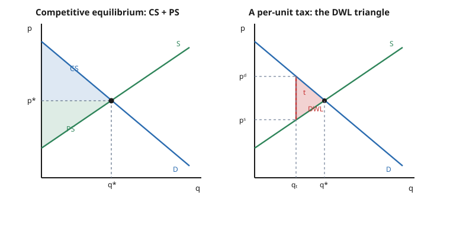

# Grad Microeconomics · Lesson 4.1: Partial equilibrium and surplus

> ⏱ ~15 min · Module 4: General equilibrium and welfare · Builds on: [3.4 Aggregation and the firm](03-04-aggregation-and-the-firm.md) · Unlocks: [4.2 The Edgeworth box and Walrasian equilibrium](04-02-edgeworth-box-walrasian-equilibrium.md)

## Why this matters

Every undergraduate has shaded the little triangles under a supply-and-demand cross and called them "welfare." The question this course forces is: *when is that legitimate?* The area under a demand curve is a picture of dollars — but a demand curve is a slice of a consumer's full optimization, tangled up with income effects, and areas under it are generally only an approximation to true welfare. This lesson pins down the one assumption — **quasilinear utility** — under which the triangles are *exact*, computes consumer and producer surplus honestly, and shows that the competitive equilibrium maximizes their sum. That last fact is the First Welfare Theorem in miniature, and the deadweight-loss machinery you build here is exactly what Module 6 uses to indict monopoly. It is also the warm-up act: one market in isolation, before Module 4 lets all markets clear at once.

## The idea

Put everything else aside and look at **one** market — call it "partial equilibrium." Aggregate demand $D(p)$ slopes down (buyers want more when it's cheap), aggregate supply $S(p)$ slopes up (sellers offer more when it's dear), and the price gravitates to where they cross: $D(p^*) = S(p^*)$. That crossing is the market-clearing price.

Now, who gains? A buyer whose maximum willingness to pay is 30 dollars but who pays 20 pockets a 10-dollar gain — and the demand curve, read as *marginal willingness to pay at each quantity*, stacks all those gains into an area: **consumer surplus**, the region under demand and above the price. Symmetrically, the supply curve is *marginal cost*, so the region above supply and below the price is the sellers' gain: **producer surplus**. Total surplus is the whole quadrilateral between the two curves up to $q^*$ — the total value the market creates over and above the resources it consumes.

The subtlety undergrad courses skip: reading "area under demand" as literal dollars of welfare only works if a dollar spent in this market doesn't ripple back through the consumer's income and shift the very demand curve you're integrating. Quasilinear preferences buy you exactly that — one good is money itself, absorbing all income effects, so demand for the other good doesn't move when wealth changes. Then the area is not an approximation. It is the number.

## The formal version

**Quasilinear utility.** A consumer has utility over a good $x$ and a numeraire (money) $m$ of the form

$$u(x, m) = v(x) + m, \qquad v'(x) > 0,\; v''(x) < 0.$$

Facing price $p$ and wealth $w$, she solves $\max_{x} \; v(x) + (w - px)$, giving the first-order condition

$$v'(x) = p.$$

**In words:** she buys until the marginal benefit of one more unit, $v'(x)$, equals its price. Notice $w$ has dropped out — the demand $x(p)$ solving $v'(x)=p$ **does not depend on wealth**. There is no income effect on $x$; all wealth changes are soaked up by $m$. This is the payoff of the separable, money-linear form flagged back in [2.5](02-05-choice-under-uncertainty.md) and the vanishing-income-effect case of the Slutsky decomposition in [2.4](02-04-slutsky-equation-comparative-statics.md).

Because Marshallian demand equals Hicksian demand here (no income effect to separate them), the area under the demand curve measures welfare *exactly*, not to first order.

**Consumer surplus.** With inverse demand $p = P(q)$ (the height $v'(q)$),

$$CS(p^*) = \int_0^{q^*} \big(P(q) - p^*\big)\,dq.$$

**In words:** for each unit up to $q^*$, take how much it was worth minus what was paid, and add them up. This equals the utility gain $v(q^*) - p^* q^*$ measured in dollars — genuine welfare, because money enters $u$ linearly.

**Producer surplus.** With inverse supply $p = C'(q)$ (marginal cost),

$$PS(p^*) = \int_0^{q^*}\big(p^* - C'(q)\big)\,dq = p^* q^* - \int_0^{q^*} C'(q)\,dq.$$

**In words:** revenue minus total *variable* cost. This is the profit-plus-fixed-cost quantity from [3.3](03-03-profit-maximization-supply.md): $PS = \pi + F$, since $\pi = p^*q^* - VC - F$. Producer surplus is **not** profit unless fixed cost is zero.

**Efficiency.** Total surplus $TS(q) = \int_0^{q}\big(P(s) - C'(s)\big)\,ds$ is maximized where its integrand vanishes, i.e. $P(q) = C'(q)$ — marginal value equals marginal cost. That is precisely the competitive equilibrium $q^*$.

**In words:** the market clears exactly where the last unit's worth to a buyer equals its cost to a seller. Produce less and you forgo units worth more than they cost; produce more and you make units that cost more than they're worth. The competitive quantity is the welfare optimum — a first taste of the First Welfare Theorem ([4.4](04-04-two-welfare-theorems.md)).

## Picture

## Worked examples

**Example 1 (mechanical — equilibrium and the two triangles).** Linear demand and supply:

$$q^d = 100 - 2p, \qquad q^s = -20 + 2p.$$

Equilibrium sets $q^d = q^s$: $\;100 - 2p = -20 + 2p \Rightarrow 120 = 4p \Rightarrow p^* = 30$, and $q^* = 100 - 2(30) = 40$.

To shade the triangles, find where each curve meets the price axis ($q = 0$):
- **Demand choke price:** $100 - 2p = 0 \Rightarrow p = 50$ (the highest willingness to pay).
- **Supply intercept price:** $-20 + 2p = 0 \Rightarrow p = 10$ (the lowest marginal cost served).

Both curves are straight, so the surpluses are literal triangles of base $q^* = 40$:

$$CS = \tfrac{1}{2}\,(50 - 30)\,(40) = 400, \qquad PS = \tfrac{1}{2}\,(30 - 10)\,(40) = 400,$$

$$TS = CS + PS = 800.$$

(The symmetry is an artifact of equal slopes; nothing forces $CS = PS$ in general.)

**Example 2 (why you'd care — a tax, its incidence, and deadweight loss).** Impose a per-unit tax $t = 12$, collected from sellers. Now buyers pay $p^d$ while sellers keep $p^s = p^d - t$. Quantities:

$$q^d = 100 - 2p^d, \qquad q^s = -20 + 2p^s = -20 + 2(p^d - t).$$

Clear the market: $100 - 2p^d = -20 + 2p^d - 2t \Rightarrow 120 + 2t = 4p^d \Rightarrow p^d = 30 + \tfrac{t}{2}$.

With $t = 12$: $\;p^d = 36$, $\;p^s = 24$, and $q_t = 100 - 2(36) = 28$.

**Incidence.** The buyer's price rose by 6 (from 30 to 36) and the seller's fell by 6 (from 30 to 24). The tax is split evenly — not because it was "collected from sellers," but because demand and supply have equal slope magnitudes here. Incidence is governed by *relative elasticities*, never by the statutory side; a legally seller-side tax lands half on buyers.

**Deadweight loss.** Quantity fell from 40 to 28, a drop of $\Delta q = 12$. The lost surplus is the triangle with base $t$ (the price wedge) and height $\Delta q$:

$$DWL = \tfrac{1}{2}\, t\, \Delta q = \tfrac{1}{2}(12)(12) = 72.$$

Check by full accounting. New surpluses (base $q_t = 28$):

$$CS' = \tfrac12(50 - 36)(28) = 196, \quad PS' = \tfrac12(24 - 10)(28) = 196, \quad \text{Revenue} = t\,q_t = 12(28) = 336.$$

Total with tax $= 196 + 196 + 336 = 728$, down from $800$. The gap is $800 - 728 = 72 = DWL$. ✓ Every dollar of the wedge that *doesn't* become revenue vanishes into the triangle: surplus on the 12 units no longer traded, each worth more to a buyer than it cost a seller.

## Watch out

- **You might think consumer surplus always measures welfare, but** it is exact only under quasilinearity (no income effects). With income effects the truthful measures are **compensating** and **equivalent variation** (the wealth you'd need to give or take to undo a price change), and $CV \neq EV \neq CS$ in general — they merely *coincide* here because Marshallian = Hicksian demand. Exact welfare measurement without quasilinearity is the CV/EV machinery you'll meet head-on later.
- **You might think a tax "on sellers" is paid by sellers, but** incidence depends on the *slopes* (elasticities) of demand and supply, not on who writes the check. The inelastic side bears more; equal slopes split it evenly, as in Example 2.
- **You might think producer surplus is profit, but** $PS = \pi + F$: it counts revenue over *variable* cost, ignoring fixed cost $F$ (see [3.3](03-03-profit-maximization-supply.md)). They agree only when $F = 0$.
- **You might think this one-market analysis is the whole story, but** partial equilibrium freezes all other prices and incomes. A tax here shifts demand in related markets, whose feedback we've ignored. Honoring those loops is the entire point of general equilibrium — [4.2](04-02-edgeworth-box-walrasian-equilibrium.md) onward.

## One-liner

> Under quasilinear preferences the surplus triangles are exact welfare, the competitive quantity maximizes their sum, and any wedge that pushes trade below it carves out a deadweight-loss triangle of area $\tfrac12 \times \text{wedge} \times \text{lost quantity}$.

## Problems

**P1 (🟢)** Demand is $q^d = 60 - p$ and supply is $q^s = 2p$. Find the equilibrium price and quantity, then compute consumer surplus, producer surplus, and total surplus.

**P2 (🟡)** In the market of P1, impose a per-unit tax $t = 9$. Find the buyer price $p^d$, seller price $p^s$, the traded quantity, the tax revenue, and the deadweight loss. Confirm that $CS + PS + \text{Revenue} + DWL$ equals the no-tax total surplus.

**P3 (🔴, optional)** A consumer has quasilinear utility $u(x,m) = 8\sqrt{x} + m$, wealth $w$, and faces price $p$ for good $x$. (a) Derive her Marshallian demand $x(p)$ and confirm it is independent of $w$. (b) Her (net) consumer surplus at price $p$ is $v(x(p)) - p\,x(p)$. Compute it as a function of $p$, and verify by direct integration that it equals $\int_p^\infty x(\tilde p)\,d\tilde p$ — the area to the left of the demand curve above $p$.

Solutions

**P1** Equilibrium: $60 - p = 2p \Rightarrow 60 = 3p \Rightarrow p^* = 20$, $q^* = 2(20) = 40$. Choke price (demand at $q=0$): $p = 60$. Supply intercept price (supply at $q=0$): $p = 0$. Both linear:

$$CS = \tfrac12(60 - 20)(40) = 800, \qquad PS = \tfrac12(20 - 0)(40) = 400, \qquad TS = 1200.$$

**P2** With a per-unit tax $t=9$, let buyers pay $p^d$ and sellers keep $p^s = p^d - 9$:

$$60 - p^d = 2(p^d - 9) \Rightarrow 60 + 18 = 3p^d \Rightarrow p^d = 26, \quad p^s = 17.$$

Quantity: $q_t = 60 - 26 = 34$ (check supply: $2(17) = 34$ ✓). Revenue $= 9 \times 34 = 306$.

Quantity fell from 40 to 34, so $\Delta q = 6$ and

$$DWL = \tfrac12\,(9)(6) = 27.$$

Verify the accounting: $CS' = \tfrac12(60-26)(34) = \tfrac12(34)(34) = 578$; $PS' = \tfrac12(17-0)(34) = 289$. Then

$$578 + 289 + 306 + 27 = 1200 = TS \text{ from P1.} \checkmark$$

**P3** (a) She maximizes $8\sqrt{x} + (w - px)$. First-order condition:

$$\frac{d}{dx}\big(8\sqrt{x} - px\big) = \frac{4}{\sqrt{x}} - p = 0 \;\Rightarrow\; \sqrt{x} = \frac{4}{p} \;\Rightarrow\; x(p) = \frac{16}{p^2}.$$

Wealth $w$ never appears — no income effect, as quasilinearity guarantees (provided $w$ is large enough to afford an interior $x$).

(b) With $v(x) = 8\sqrt{x}$ and $x(p) = 16/p^2$: $\sqrt{x(p)} = 4/p$, so $v(x(p)) = 8 \cdot \tfrac{4}{p} = \tfrac{32}{p}$, and $p\,x(p) = p \cdot \tfrac{16}{p^2} = \tfrac{16}{p}$. Hence

$$CS(p) = \frac{32}{p} - \frac{16}{p} = \frac{16}{p}.$$

Now integrate demand to the left of the curve, from $p$ up to the choke (here $x \to 0$ as $\tilde p \to \infty$):

$$\int_p^\infty x(\tilde p)\,d\tilde p = \int_p^\infty \frac{16}{\tilde p^2}\,d\tilde p = \left[-\frac{16}{\tilde p}\right]_p^\infty = \frac{16}{p}. \checkmark$$

The two routes agree — the utility gain in dollars *is* the area under the demand curve, precisely because money enters utility linearly. (This improper integral converges for the same reason as the perpetuity in [calc-refresher 2.3](../../calc-refresher/lessons/02-03-improper-integrals-and-models.md): a $1/p^2$ tail encloses finite area.)

## Flashback

**From Lesson 2.4 (The Slutsky equation and comparative statics):** A consumer has quasilinear utility $u(x_1, x_2) = 6\ln x_1 + x_2$, with $x_2$ the numeraire (price 1), wealth $w$, and price $p_1$ for good 1. Derive the Marshallian demand $x_1(p_1, w)$ and state what its Slutsky decomposition says about the income effect on good 1.

Solution

Maximize $6\ln x_1 + (w - p_1 x_1)$. First-order condition:

$$\frac{6}{x_1} - p_1 = 0 \;\Rightarrow\; x_1(p_1, w) = \frac{6}{p_1}.$$

Demand for good 1 is independent of wealth $w$. In the Slutsky equation $\dfrac{\partial x_1}{\partial p_1} = \underbrace{\dfrac{\partial h_1}{\partial p_1}}_{\text{substitution}} - \; x_1\,\dfrac{\partial x_1}{\partial w}$, the income term vanishes because $\partial x_1/\partial w = 0$. So the Marshallian and Hicksian demands coincide, the entire price response is the substitution effect, and — the point of this whole lesson — the area under this demand curve is an *exact* welfare measure. (For an interior solution we need $w \geq 6$, so that $x_2 = w - 6 \geq 0$.)

## Connections

- **Backward:** demand comes from the consumer's optimization in [2.2](02-02-utility-maximization-marshallian-demand.md), and the reason surplus is exact is the vanishing income effect of [2.4](02-04-slutsky-equation-comparative-statics.md) under the separable form of [2.5](02-05-choice-under-uncertainty.md). Supply is marginal cost from [3.3](03-03-profit-maximization-supply.md); producer surplus is that lesson's profit-plus-fixed-cost, and industry supply is aggregated in [3.4](03-04-aggregation-and-the-firm.md).
- **Forward:** "the competitive quantity maximizes total surplus" is the First Welfare Theorem restricted to one market — [4.4](04-04-two-welfare-theorems.md) proves it for a whole economy, once [4.2](04-02-edgeworth-box-walrasian-equilibrium.md) and [4.3](04-03-existence-walrasian-equilibrium.md) define and establish Walrasian equilibrium. The CV/EV caveat is the launching point for exact welfare measurement beyond quasilinearity.
- **Sideways:** the deadweight-loss triangle is the exact tool Module 6 turns on structural distortions — monopoly's markup in [6.1](06-01-monopoly-price-discrimination.md), tax and externality wedges in [6.3](06-03-externalities-coase-theorem.md), and the Cournot-vs-competition DWL comparison of Boss Problem 6. For the undergraduate-level version of these same pictures, see [`micro-refresher`](../../micro-refresher/syllabus.md).
- Full module map: [syllabus](../syllabus.md).
