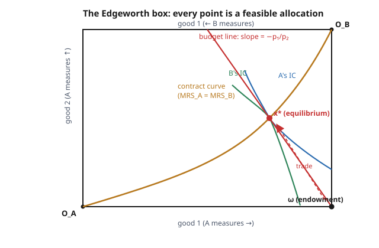

# Grad Microeconomics · Lesson 4.2: The Edgeworth box and Walrasian equilibrium

> ⏱ ~15 min · Module 4: General equilibrium and welfare · Builds on: [4.1 Partial equilibrium and surplus](04-01-partial-equilibrium-surplus.md) · Unlocks: [4.3 Existence of Walrasian equilibrium](04-03-existence-walrasian-equilibrium.md)

## Why this matters

Partial equilibrium studied one market with everything else held fixed. But prices are all connected: the price of bread affects the demand for butter, which feeds back into wages, which feeds back into bread. **General equilibrium** takes the whole system at once and asks the audacious question — can a single vector of prices make *every* market clear simultaneously, with each person selfishly optimizing and no central planner? The Edgeworth box is the two-person, two-good laboratory where you can *see* the answer with your own eyes, and it delivers the discipline's most famous result in embryo: competitive trade lands on an efficient outcome. Everything in the rest of this module — existence via fixed points (4.3), the welfare theorems (4.4), the core (4.5) — is this picture made rigorous and general.

## The idea

Two people, Anna (A) and Bruno (B). Two goods. A fixed total amount of each good sits in the room — nobody produces anything, they can only *trade* what they already own. Here is the trick that makes the whole thing visible: draw a rectangle whose width is the total amount of good 1 and whose height is the total amount of good 2. Measure Anna's bundle from the **bottom-left** corner in the usual way. Now measure Bruno's bundle from the **top-right** corner, with his axes flipped. Because the box is exactly the size of the total supply, **a single point in the box specifies both people's bundles at once** — whatever Anna doesn't hold, Bruno does. Every point is a way of dividing the pie with nothing left over.

Now overlay each person's indifference curves (Anna's bowing out from her corner, Bruno's from his). A point is **Pareto efficient** if you can't move to make one person happier without hurting the other — and geometrically that happens exactly where an Anna-curve and a Bruno-curve are *tangent*. Anywhere they cross, there's a little lens-shaped region between them where both can rise, so a crossing is never efficient; a tangency has no such lens. String all the tangencies together and you get the **contract curve**.

A **Walrasian equilibrium** is one special way of reaching an efficient point: announce a price, let each person sell their endowment and buy their favorite affordable bundle, and hope that when both shop independently, their choices exactly add up to the total supply — no shortage, no glut. When they do, the market clears, and (spoiler) the point they land on sits on the contract curve.

## The formal version

**Pure exchange economy.** Two consumers $i \in \{A,B\}$, two goods. Consumer $i$ owns an **endowment** $\omega_i = (\omega_{i1}, \omega_{i2}) \ge 0$ and has utility $u_i$. Total supply is $\bar\omega = \omega_A + \omega_B$. An **allocation** $(x_A, x_B)$ is *feasible* if $x_A + x_B = \bar\omega$ (markets clear, nothing created or destroyed).

*In words:* the only bundles on the table are re-shufflings of what's already owned — a point in the box.

**Pareto efficiency.** A feasible allocation is Pareto efficient if there is no other feasible allocation that makes one consumer strictly better off and the other no worse off. With smooth, convex, monotone preferences and an interior allocation, this is equivalent to

$$\mathrm{MRS}_A = \mathrm{MRS}_B, \qquad \text{where } \mathrm{MRS}_i = \frac{\partial u_i/\partial x_1}{\partial u_i/\partial x_2}.$$

*In words:* both people value good 1 in terms of good 2 at the same rate — their indifference curves are tangent, so no mutually beneficial trade remains. The set of all such points is the **contract curve** (a.k.a. the Pareto set). The economically relevant part is the piece where both do at least as well as at their endowment — this is **individual rationality**.

**Walrasian (competitive) equilibrium.** A price vector $p = (p_1, p_2) \gg 0$ and a feasible allocation $(x_A^*, x_B^*)$ such that for each consumer $i$,

$$x_i^* \text{ solves } \max_{x_i \ge 0} u_i(x_i) \quad \text{subject to} \quad p \cdot x_i \le p \cdot \omega_i,$$

and markets clear: $x_A^* + x_B^* = \bar\omega$.

*In words:* at the equilibrium price, each person independently buys the best bundle they can afford by selling their endowment, and when you add up everyone's independent choices they exactly exhaust the total supply. Geometrically: draw the single budget line through the endowment $\omega$ with slope $-p_1/p_2$; equilibrium is a slope for which **both consumers pick the same point** on that line.

**Only relative prices matter.** Demand is homogeneous of degree zero in $p$ — scaling all prices by $\lambda>0$ leaves every budget set unchanged — so equilibrium pins down the ratio $p_1/p_2$, not the levels. We **normalize** $p_2 = 1$ and solve for $p_1$.

## Picture

The budget line pivots around the fixed endowment $\omega$ as the price ratio changes; equilibrium is the pivot at which Anna's chosen bundle and Bruno's chosen bundle land on the *same* point $x^*$ — which is necessarily a tangency, hence on the contract curve.

## Worked examples

**Example 1 (mechanical — solve for the equilibrium price and allocation).** This is the algebraic core of **Boss problem 4**. Let

$$u_A(x,y) = x^{3/4} y^{1/4}, \qquad u_B(x,y) = x^{1/2} y^{1/2},$$

with endowments $\omega_A = (1,0)$ (Anna owns all of good 1) and $\omega_B = (0,1)$ (Bruno owns all of good 2), so $\bar\omega = (1,1)$.

*Step 1 — each consumer's Marshallian demand.* A Cobb–Douglas consumer with exponent $\alpha$ on good 1 spends fraction $\alpha$ of wealth on good 1 (this is the Module 2.2 result). Normalizing $p_2 = 1$ and writing $p = p_1$, wealth is the market value of the endowment, $m_i = p\,\omega_{i1} + \omega_{i2}$:

$$x_{A1} = \frac{3}{4}\cdot\frac{m_A}{p}, \quad x_{A2} = \frac{1}{4}\,m_A, \qquad x_{B1} = \frac{1}{2}\cdot\frac{m_B}{p}, \quad x_{B2} = \frac{1}{2}\,m_B,$$

with $m_A = p\cdot 1 + 0 = p$ and $m_B = p\cdot 0 + 1 = 1$.

*Step 2 — clear the good-1 market.* Impose $x_{A1} + x_{B1} = \bar\omega_1 = 1$:

$$\frac{3}{4}\cdot\frac{p}{p} + \frac{1}{2}\cdot\frac{1}{p} = 1 \;\;\Longrightarrow\;\; \frac{3}{4} + \frac{1}{2p} = 1 \;\;\Longrightarrow\;\; \frac{1}{2p} = \frac{1}{4} \;\;\Longrightarrow\;\; p^* = 2.$$

So the equilibrium price ratio is $p_1/p_2 = 2$: good 1 is twice as valuable as good 2.

*Step 3 — read off the allocation.* With $p^*=2$: $m_A = 2$, $m_B = 1$, so

$$x_A^* = \left(\tfrac34\cdot\tfrac{2}{2},\; \tfrac14\cdot 2\right) = \left(\tfrac34, \tfrac12\right), \qquad x_B^* = \left(\tfrac12\cdot\tfrac{1}{2},\; \tfrac12\cdot 1\right) = \left(\tfrac14, \tfrac12\right).$$

*Step 4 — sanity check both markets.* Good 1: $\tfrac34 + \tfrac14 = 1$. ✓ Good 2: $\tfrac12 + \tfrac12 = 1$. ✓ Anna, who weights good 1 more heavily, ends up with more of it; Bruno splits evenly. Both strictly improved on their endowment (each started at a corner with utility $0$).

For general endowments the same two steps give the clean formula

$$p^* = \frac{a\,\omega_{A2} + b\,\omega_{B2}}{(1-a)\,\omega_{A1} + (1-b)\,\omega_{B1}},$$

where $a, b$ are the good-1 exponents of $A, B$ — worth memorizing as a check.

**Example 2 (the contract curve, and verifying $x^*$ lies on it).** For Cobb–Douglas with good-1 exponent $\alpha$,

$$\mathrm{MRS} = \frac{\partial u/\partial x}{\partial u/\partial y} = \frac{\alpha\, x^{\alpha-1}y^{1-\alpha}}{(1-\alpha)\,x^{\alpha}y^{-\alpha}} = \frac{\alpha}{1-\alpha}\cdot\frac{y}{x}.$$

Write Anna's bundle as $(x,y)$; feasibility forces Bruno's bundle to be $(1-x,\,1-y)$. Set $\mathrm{MRS}_A = \mathrm{MRS}_B$:

$$\frac{3/4}{1/4}\cdot\frac{y}{x} = \frac{1/2}{1/2}\cdot\frac{1-y}{1-x} \;\;\Longrightarrow\;\; 3\,\frac{y}{x} = \frac{1-y}{1-x}.$$

Cross-multiply: $3y(1-x) = x(1-y) \Rightarrow 3y - 3xy = x - xy \Rightarrow 3y - 2xy = x$, hence the **contract curve**

$$\boxed{\,y = \frac{x}{3 - 2x}\,}, \qquad x \in [0,1].$$

It runs from $O_A$ at $(0,0)$ to $O_B$ at $(1,1)$, bowing toward Anna's good-1-rich corner. Check the equilibrium: at $x = \tfrac34$, $\; y = \dfrac{3/4}{3 - 3/2} = \dfrac{3/4}{3/2} = \tfrac12$. ✓ The Walrasian allocation sits exactly on the contract curve — a first sighting of the **First Welfare Theorem**: competitive equilibria are Pareto efficient.

## Watch out

- **You might think equilibrium determines all prices, but** only the *ratio* is determined — demand is homogeneous of degree zero, so $(p_1,p_2)$ and $(2p_1,2p_2)$ give identical behavior. Always normalize ($p_2 = 1$) before "solving," or you'll chase a free parameter forever.
- **You might think you must clear both markets separately, but** by **Walras' law** they aren't independent. Each consumer's budget binds ($p\cdot x_i = p\cdot\omega_i$), so summing gives $p\cdot(x_A + x_B - \bar\omega) = 0$ identically. If the good-1 market clears then $p_2(x_{A2}+x_{B2}-\bar\omega_2)=0$, forcing good 2 to clear too. With $n$ goods you solve $n-1$ independent equations, not $n$.
- **You might think tangency always means efficiency, but** the $\mathrm{MRS}_A=\mathrm{MRS}_B$ characterization needs an *interior*, *convex* case. At a boundary (someone consumes zero of a good) the efficient allocation can have $\mathrm{MRS}_A \ne \mathrm{MRS}_B$ — the tangency condition becomes an inequality, exactly as in the Kuhn–Tucker story of Lesson [1.3](01-03-inequality-constraints-kuhn-tucker.md). And without convexity, a tangency can be a *worst* mutual point, not a best.
- **You might think the equilibrium is a property of preferences alone, but** the **endowment** picks out *which* efficient point you reach. Shift $\omega$ and the equilibrium slides along the contract curve. This is what separates a market from a planner: the planner can choose any point on the contract curve; the market chooses the one its endowment can afford.

## One-liner

> In the Edgeworth box, competitive trade pivots the budget line around the fixed endowment until both shoppers land on the same tangency — market clearing and Pareto efficiency in one picture.

## Problems

**P1 (🟢)** Keep $u_A = x^{3/4}y^{1/4}$ and $u_B = x^{1/2}y^{1/2}$, but *swap* the endowments: $\omega_A = (0,1)$, $\omega_B = (1,0)$. Find the equilibrium price ratio $p_1/p_2$ and the equilibrium allocation, and verify it lies on the contract curve $y = x/(3-2x)$.

**P2 (🟡)** Prove Walras' law in this two-good economy: show that if each consumer exhausts their budget ($p\cdot x_i = p\cdot\omega_i$) and the good-1 market clears, then the good-2 market clears automatically. Conclude that only one market-clearing equation is needed.

**P3 (🔴, optional)** *(Second Welfare Theorem preview.)* The allocation giving Anna $x_A = (\tfrac12, \tfrac14)$ is Pareto efficient (it's on the contract curve). (a) Find the price ratio $p_1/p_2$ that supports it as a Walrasian equilibrium. (b) Describe the full set of endowments $\omega_A$ (with $\omega_B = \bar\omega - \omega_A$) for which this same allocation is the equilibrium, and say in one sentence why this illustrates the Second Welfare Theorem.

Solutions

**P1** Normalize $p_2 = 1$, $p = p_1$. Now $m_A = p\cdot 0 + 1 = 1$ and $m_B = p\cdot 1 + 0 = p$. Good-1 demands: $x_{A1} = \tfrac34\cdot\tfrac{m_A}{p} = \tfrac{3}{4p}$, $\;x_{B1} = \tfrac12\cdot\tfrac{m_B}{p} = \tfrac12$. Clear good 1:

$$\frac{3}{4p} + \frac12 = 1 \;\Longrightarrow\; \frac{3}{4p} = \frac12 \;\Longrightarrow\; p^* = \frac32.$$

So $p_1/p_2 = \tfrac32$. Allocation: $m_A = 1$, $m_B = \tfrac32$.

$$x_A^* = \left(\tfrac34\cdot\tfrac{1}{3/2},\; \tfrac14\cdot 1\right) = \left(\tfrac12, \tfrac14\right), \qquad x_B^* = \left(\tfrac12\cdot\tfrac{3/2}{3/2},\; \tfrac12\cdot\tfrac32\right) = \left(\tfrac12, \tfrac34\right).$$

Check clearing: good 1, $\tfrac12+\tfrac12 = 1$ ✓; good 2, $\tfrac14 + \tfrac34 = 1$ ✓. On the contract curve? At $x = \tfrac12$: $y = \dfrac{1/2}{3 - 1} = \dfrac{1/2}{2} = \tfrac14$ ✓.

**P2** Budget balance for each consumer (utility is strictly increasing, so budgets bind):

$$p_1 x_{A1} + p_2 x_{A2} = p_1\omega_{A1} + p_2\omega_{A2}, \qquad p_1 x_{B1} + p_2 x_{B2} = p_1\omega_{B1} + p_2\omega_{B2}.$$

Add them and group by good:

$$p_1\big(x_{A1}+x_{B1} - \bar\omega_1\big) + p_2\big(x_{A2}+x_{B2} - \bar\omega_2\big) = 0.$$

This is **Walras' law**: the value of aggregate excess demand is zero at any prices. If the good-1 market clears, $x_{A1}+x_{B1} - \bar\omega_1 = 0$, so the first term vanishes and the identity reduces to $p_2\big(x_{A2}+x_{B2} - \bar\omega_2\big) = 0$. Since $p_2 > 0$, we get $x_{A2}+x_{B2} = \bar\omega_2$: the good-2 market clears too. Hence with two goods there is only **one** independent market-clearing condition — consistent with the fact that we solve for one unknown, the price *ratio*.

**P3** (a) The supporting price ratio equals the common $\mathrm{MRS}$ at the allocation (the tangent slope of the shared indifference-curve tangency). Using Anna at $(\tfrac12,\tfrac14)$:

$$\frac{p_1}{p_2} = \mathrm{MRS}_A = \frac{3/4}{1/4}\cdot\frac{y}{x} = 3\cdot\frac{1/4}{1/2} = \frac{3}{2}.$$

(Check with Bruno at $(1-\tfrac12,\,1-\tfrac14) = (\tfrac12,\tfrac34)$: $\mathrm{MRS}_B = 1\cdot\frac{3/4}{1/2} = \tfrac32$ ✓ — they agree, confirming it's on the contract curve.)

(b) At prices $(p_1,p_2) = (\tfrac32, 1)$, the allocation is affordable to Anna iff her endowment lies on her budget line through the target bundle:

$$\tfrac32\,\omega_{A1} + \omega_{A2} = \tfrac32\cdot\tfrac12 + \tfrac14 = 1.$$

So **any** endowment $\omega_A = (\omega_{A1}, \omega_{A2})$ in the box satisfying $\tfrac32\omega_{A1} + \omega_{A2} = 1$ (with $\omega_B = (1,1)-\omega_A$ automatically on the same budget line, by Walras' law) yields exactly this equilibrium allocation. Illustration of the **Second Welfare Theorem**: any Pareto-efficient allocation can be decentralized as a Walrasian equilibrium by choosing the supporting price and redistributing endowments (lump-sum) onto the corresponding budget line — the market implements whatever efficient point you want, provided you can move the starting wealth.

## Flashback

**From Lesson 2.2 (Utility maximization: Marshallian demand):** A consumer with $u(x,y) = x^{1/3} y^{2/3}$ faces prices $p_1 = 2$, $p_2 = 3$ and has wealth $m = 90$. Find the Marshallian demand $(x^*, y^*)$ and verify the budget binds. (This is the exact primitive each consumer solves inside an Edgeworth-box equilibrium — with wealth $m = p\cdot\omega$ instead of an exogenous number.)

Solution

Cobb–Douglas spends its exponents as budget shares: fraction $\tfrac13$ on good 1, fraction $\tfrac23$ on good 2. So

$$x^* = \frac{1}{3}\cdot\frac{m}{p_1} = \frac{1}{3}\cdot\frac{90}{2} = 15, \qquad y^* = \frac{2}{3}\cdot\frac{m}{p_2} = \frac{2}{3}\cdot\frac{90}{3} = 20.$$

Budget check: $p_1 x^* + p_2 y^* = 2(15) + 3(20) = 30 + 60 = 90 = m$ ✓. (The share rule comes from the first-order condition $\mathrm{MRS} = \frac{\alpha}{1-\alpha}\frac{y}{x} = \frac{p_1}{p_2}$ combined with the binding budget — the same tangency that defines the contract curve, here against a *market* price line rather than the other consumer's curve.)

## Connections

- **Backward:** every equilibrium bundle is a Marshallian demand from Module 2's consumer problem — Lesson 2.1 ([preferences and utility representation](02-01-preferences-utility-representation.md)) grounds it and Lesson 2.2 solves the maximization — with wealth set to the market value of the endowment $p\cdot\omega$; the tangency condition is the same first-order condition, and the interior-vs-boundary caveat is [1.3](01-03-inequality-constraints-kuhn-tucker.md)'s Kuhn–Tucker logic. The efficiency-as-tangency argument reprises the convexity structure of [1.1](01-01-convexity-concavity-quasiconcavity.md).
- **Forward:** [4.3](04-03-existence-walrasian-equilibrium.md) proves an equilibrium price *exists* in general (not just for tractable Cobb–Douglas) by turning "aggregate excess demand is zero" into a fixed-point problem; Lesson 4.4 turns the two spoilers seen here ($x^*$ on the contract curve; any efficient point decentralizable) into the First and Second Welfare Theorems; Lesson 4.5 shows the equilibrium is exactly the *core* of this two-person economy.
- **Sideways:** the equilibrium concept — everyone best-responds to a common object (here, prices) and the responses are mutually consistent — has the same shape as a Nash equilibrium in the grad-game-theory course (best responses that clear); prices play the role of the strategy each agent takes as given. The underlying supply-demand intuition and surplus language come from [`micro-refresher`](../../micro-refresher/syllabus.md).
