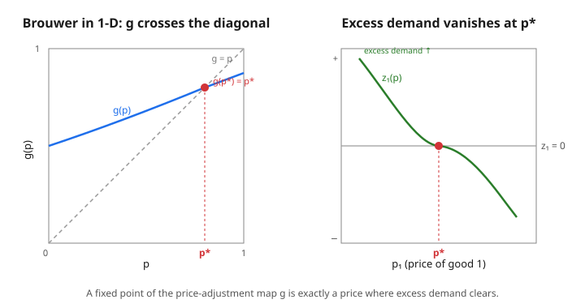

# Grad Microeconomics · Lesson 4.3: Existence of Walrasian equilibrium

> ⏱ ~15 min · Module 4: General equilibrium and welfare · Builds on: [4.2 The Edgeworth box and Walrasian equilibrium](04-02-edgeworth-box-walrasian-equilibrium.md) · Unlocks: [4.4 The two welfare theorems](04-04-two-welfare-theorems.md)

## Why this matters

In [4.2](04-02-edgeworth-box-walrasian-equilibrium.md) we *defined* a Walrasian equilibrium — a price at which every consumer's independently chosen demand happens to add up to the available supply. But defining a thing is not the same as knowing it exists. Adam Smith's invisible hand is a promise: turn everyone loose to optimize selfishly, and some price will silently clear every market at once. Is that promise ever empty? This is the question that occupied Walras for decades and was only settled in 1954 by Arrow and Debreu. The answer — yes, an equilibrium always exists under mild conditions — is the intellectual payoff of the whole optimization toolkit from Module 1, and the machine that delivers it is a **fixed-point theorem**. The same machine, you'll see, powers the existence of Nash equilibrium in game theory.

## The idea

Strip the economy down to one object: **excess demand**. At any price vector $p$, each consumer solves their utility-maximization problem and picks a bundle; add up everyone's demand, subtract the total endowment, and you get how much *more* of each good the market wants than exists. Call it $z(p)$. An equilibrium is simply a price where the market wants no more of anything — where $z(p) \le 0$.

Now here's the trick that finds one. Imagine a Walrasian auctioneer who watches $z(p)$ and shouts price adjustments: *raise the price of any good in excess demand, lower the price of any good in excess supply.* This is a map — feed it a price, it hands you back a new price. If we can arrange for this map to be a **continuous function from a compact convex set to itself**, a theorem of Brouwer guarantees it has a **fixed point**: a price the auctioneer would leave unchanged. And a price the auctioneer won't touch is one where nothing is in excess demand — an equilibrium. That's the entire argument. The rest is making "compact," "convex," and "continuous" true, which is where Walras' law and the price simplex earn their keep.

## The formal version

**The economy.** $I$ consumers, $L$ goods. Consumer $i$ has endowment $\omega_i \in \mathbb{R}^L_+$ and, facing price $p \in \mathbb{R}^L_+$, chooses Marshallian demand $x_i(p, p\cdot\omega_i)$ — the solution to their utility-maximization problem from [2.2](02-02-utility-maximization-marshallian-demand.md), where wealth is the market value $p\cdot\omega_i$ of what they own. The **aggregate excess demand** is

$$z(p) = \sum_{i=1}^{I} x_i(p, p\cdot\omega_i) \;-\; \sum_{i=1}^{I} \omega_i.$$

*In words:* total wanted minus total available, good by good. A **Walrasian equilibrium** is a price $p^* $ with $z(p^*) \le 0$, and $z_l(p^*) = 0$ for every good $l$ with $p^*_l > 0$ (a good in strict excess supply must be free).

Excess demand has three properties that make the argument work:

- **Continuity.** $z$ is continuous in $p$ (on the region where prices stay positive). *In words:* nudging prices only nudges demand. This is not free — it needs each consumer's demand to be a continuous single-valued function, which the **maximum theorem** ([1.5](01-05-monotone-comparative-statics-dynamic-programming.md)) delivers when preferences are continuous and *strictly* convex, so the budget-constrained optimum is unique and moves continuously.
- **Homogeneity of degree zero.** $z(\lambda p) = z(p)$ for every $\lambda > 0$. *In words:* only relative prices matter — doubling all prices doubles every wealth $p\cdot\omega_i$ too, so budget sets and hence demands are unchanged. This lets us **normalize** prices onto the unit simplex $\Delta = \{\,p \in \mathbb{R}^L_+ : \sum_l p_l = 1\,\}$, which is compact and convex — exactly Brouwer's habitat.
- **Walras' law.** $p \cdot z(p) = 0$ for every $p$. *In words:* the total value of excess demand is always zero, because each consumer spends their entire budget ($p \cdot x_i = p\cdot\omega_i$, from local nonsatiation — see [2.2](02-02-utility-maximization-marshallian-demand.md)). Summing over consumers, the value of what's demanded equals the value of what's owned. Consequence: if $L-1$ markets clear and prices are positive, the $L$-th clears automatically — **one market is always redundant.**

There is also a **boundary condition** (desirability): as any price $p_l \to 0$, excess demand for that good blows up, $z_l(p) \to +\infty$. *In words:* a nearly free good everyone wants gets swamped — this keeps the equilibrium price off the boundary of the simplex, where demand functions misbehave.

**Brouwer's fixed-point theorem.** *Let $K \subseteq \mathbb{R}^n$ be nonempty, compact, and convex, and let $f : K \to K$ be continuous. Then $f$ has a fixed point: some $x^* \in K$ with $f(x^*) = x^*$.* This is a topology result (`topology`, `real-analysis`); in dimension one it is just the intermediate value theorem — a continuous $f:[0,1]\to[0,1]$ must cross the diagonal, because $h(x) = f(x) - x$ satisfies $h(0) \ge 0$ and $h(1) \le 0$, so $h$ has a root.

**The existence proof (Arrow–Debreu in miniature).** Define the auctioneer's price-adjustment map $g : \Delta \to \Delta$ by

$$g_l(p) = \frac{p_l + \max\{0,\, z_l(p)\}}{1 + \sum_{k=1}^{L} \max\{0,\, z_k(p)\}}.$$

*In words:* bump up each price in proportion to its excess demand, then renormalize so the new prices sum to $1$ and stay in $\Delta$. Because $z$ is continuous, $g$ is continuous; $\Delta$ is compact and convex; so **Brouwer gives a fixed point** $p^*$ with $g(p^*) = p^*$. It remains to show $z(p^*) \le 0$. Writing $M = \sum_k \max\{0, z_k(p^*)\}$, the fixed-point equation rearranges to

$$p^*_l \cdot M = \max\{0,\, z_l(p^*)\} \qquad \text{for every } l.$$

Multiply by $z_l(p^*)$ and sum over $l$:

$$M \underbrace{\sum_l p^*_l\, z_l(p^*)}_{=\,p^*\cdot z(p^*)\,=\,0 \text{ (Walras)}} \;=\; \sum_l z_l(p^*)\,\max\{0, z_l(p^*)\} \;=\; \sum_{l:\,z_l>0} z_l(p^*)^2.$$

The left side is $0$. The right side is a sum of squares — it can only equal $0$ if **no** good has $z_l(p^*) > 0$. Hence $z(p^*) \le 0$: $p^*$ is a Walrasian equilibrium. $\blacksquare$

(If demand is a *correspondence* rather than a function — preferences convex but not *strictly* so, so the optimum need not be unique — replace Brouwer by its set-valued cousin, **Kakutani's fixed-point theorem**, and the argument survives. That is the fully general Arrow–Debreu form.)

## Picture

## Worked examples

**Example 1 (solve a two-good exchange economy).** Two goods, two consumers, both with Cobb–Douglas utility $u(x_1, x_2) = x_1^{1/2} x_2^{1/2}$. Consumer $A$ is endowed with $\omega_A = (2, 0)$; consumer $B$ with $\omega_B = (0, 1)$. By homogeneity we normalize $p_2 = 1$ and write $p = p_1$ for the relative price of good $1$.

Cobb–Douglas demand spends half of wealth on each good, so demand for good $1$ is $x_1^i = \tfrac{1}{2}\, w_i / p$ with $w_i = p\cdot\omega_i$:

$$w_A = 2p, \quad x_1^A = \tfrac{1}{2}\cdot\frac{2p}{p} = 1; \qquad w_B = 1, \quad x_1^B = \tfrac{1}{2}\cdot\frac{1}{p} = \frac{1}{2p}.$$

Total endowment of good $1$ is $2$, so excess demand for good $1$ is

$$z_1(p) = \underbrace{1 + \frac{1}{2p}}_{\text{demand}} - \underbrace{2}_{\text{supply}} = \frac{1}{2p} - 1.$$

Note the shape: $z_1 \to +\infty$ as $p \to 0$ (desirability) and $z_1 \to -1$ as $p \to \infty$ (you can't shed more than the $1$ unit consumers were endowed net). **Walras' law makes market 2 redundant**, so we only solve $z_1(p^*) = 0$:

$$\frac{1}{2p^*} - 1 = 0 \;\Longrightarrow\; p^* = \tfrac{1}{2}.$$

The equilibrium price ratio is $p_1/p_2 = \tfrac{1}{2}$ — good $1$ is cheaper because it's the abundant one. Allocation: $x_1^A = 1$, $x_1^B = 1/(2p^*) = 1$ (total $2$ ✓); wealths become $w_A = 2p^* = 1$, $w_B = 1$, so $x_2^A = \tfrac12\cdot 1 = \tfrac12$, $x_2^B = \tfrac12\cdot 1 = \tfrac12$ (total $1$ ✓). Both markets clear at $p^* = (\tfrac12, 1)$ — the same equilibrium the Edgeworth-box construction of [4.2](04-02-edgeworth-box-walrasian-equilibrium.md) locates as the price line through the endowment tangent to both indifference curves.

**Example 2 (Walras' law and homogeneity, checked identically).** Take the *same* system and confirm the two structural properties, so you see they hold as identities, not accidents. First compute excess demand for good $2$: $x_2^A = \tfrac12 w_A / p_2 = \tfrac12(2p) = p$ and $x_2^B = \tfrac12(1) = \tfrac12$, against endowment $1$, so $z_2(p) = p + \tfrac12 - 1 = p - \tfrac12$. Then

$$p\cdot z(p) = p_1 z_1 + p_2 z_2 = p\left(\frac{1}{2p} - 1\right) + 1\left(p - \tfrac12\right) = \left(\tfrac12 - p\right) + \left(p - \tfrac12\right) = 0 \;\; \text{for all } p.$$

**Walras' law holds identically** — every dollar's worth of excess demand in one market is exactly a dollar's worth of excess supply in the other. For **homogeneity**, scale prices to $(\lambda p_1, \lambda p_2)$: each wealth $p\cdot\omega_i$ scales by $\lambda$ and each price scales by $\lambda$, so every ratio $w_i/p_l$ is unchanged and $z(\lambda p) = z(p)$ — degree zero.

Finally, watch the fixed-point map close the loop. On the normalized simplex the equilibrium is $p^* = (\tfrac13, \tfrac23)$ (rescale $(\tfrac12,1)$ to sum to $1$). There $z(p^*) = 0$, so $\max\{0, z_l(p^*)\} = 0$ for both goods, and $g_l(p^*) = \dfrac{p^*_l + 0}{1 + 0} = p^*_l$ — the auctioneer leaves it untouched. The equilibrium is exactly a fixed point of $g$, as the proof promised.

## Watch out

- **You might think** an equilibrium requires $z(p^*) = 0$ in every market. **Actually** the condition is $z(p^*) \le 0$: a good in genuine excess supply is allowed, but only if it is *free* ($p^*_l = 0$). With positive prices and local nonsatiation, though, Walras' law forces exact clearing — the inequality bites only at zero prices.
- **You might think** we can pin down absolute prices. **Actually** homogeneity means only the *ratios* $p_1 : p_2 : \cdots$ are determined; there's one degree of price freedom we burn by normalizing to the simplex. Don't try to "solve for $p_1$" without fixing a numéraire or the budget constraint.
- **You might think** continuity of $z$ is automatic. **Actually** it's the load-bearing hypothesis, and it needs **strictly convex** (plus continuous) preferences so that each consumer's demand is a single-valued continuous function (maximum theorem, [1.5](01-05-monotone-comparative-statics-dynamic-programming.md)). A **nonconvexity** — an indivisible good, an indifference curve with a flat or a kink that lets demand jump — can make $z$ discontinuous and destroy existence outright. Convexity is not decoration; it's what lets Brouwer touch the problem.
- **You might think** existence settles everything. **Actually** existence is the weakest of the three GE questions. It says nothing about **uniqueness** (there can be many equilibria) or **stability** (whether the auctioneer's process converges) — those, and the way both can fail, are [4.6](04-06-uniqueness-stability-failure.md).

## One-liner

> Normalize prices to the simplex so demand lives on a compact convex set, let the auctioneer's "raise the excess-demand goods" map act on it, and Brouwer hands you a fixed point that Walras' law forces to be a market-clearing price.

## Problems

**P1 (🟢)** Two consumers, two goods, both with Cobb–Douglas utility $u = x_1^{1/2}x_2^{1/2}$. Endowments $\omega_A = (1,0)$, $\omega_B = (0,1)$. Normalizing $p_2 = 1$, write down $z_1(p)$ and solve for the equilibrium price ratio. Is your answer symmetric, and why should you have expected that?

**P2 (🟡)** Consumer $A$ has utility $x_1^{2/3}x_2^{1/3}$ and endowment $(1,0)$; consumer $B$ has utility $x_1^{1/3}x_2^{2/3}$ and endowment $(0,1)$. Find the equilibrium price ratio $p_1/p_2$, then verify Walras' law $p\cdot z(p) = 0$ holds *for all* $p$ (not just at equilibrium).

**P3 (🔴, optional)** Show directly, without computing any demands, that if aggregate excess demand $z$ is continuous, homogeneous of degree zero, and satisfies Walras' law $p\cdot z(p) = 0$, then the fixed point $p^*$ of the map $g$ above satisfies $z_l(p^*) \le 0$ for every $l$, with equality wherever $p^*_l > 0$. (This is the heart of the existence theorem — reproduce the sum-of-squares step and then handle the "equality where $p^*_l>0$" claim.)

Solutions

**P1** Wealths $w_A = p$, $w_B = 1$. Demand for good $1$: $x_1^A = \tfrac12 (p)/p = \tfrac12$, $x_1^B = \tfrac12(1)/p = 1/(2p)$. Endowment of good $1$ is $1$, so

$$z_1(p) = \tfrac12 + \frac{1}{2p} - 1 = \frac{1}{2p} - \tfrac12.$$

Setting $z_1 = 0$ gives $p^* = 1$, i.e. $p_1/p_2 = 1$. It's symmetric because the economy is symmetric under swapping the two goods and the two consumers simultaneously ($A\leftrightarrow B$, good $1 \leftrightarrow$ good $2$): each consumer owns one unit of "their" good and splits spending evenly, so neither good is scarcer. A symmetric economy has a symmetric equilibrium.

**P2** Demand for good $1$: $x_1^A = \tfrac23 w_A/p = \tfrac23 (p)/p = \tfrac23$ (since $w_A = p$), and $x_1^B = \tfrac13 w_B/p = \tfrac13(1)/p = 1/(3p)$ (since $w_B = 1$). Endowment of good $1$ is $1$:

$$z_1(p) = \tfrac23 + \frac{1}{3p} - 1 = \frac{1}{3p} - \tfrac13 = 0 \;\Longrightarrow\; p^* = 1,\quad p_1/p_2 = 1.$$

(The opposite-and-symmetric tastes cancel the asymmetry, again giving ratio $1$.) Now Walras' law. Good $2$: $x_2^A = \tfrac13 w_A/p_2 = \tfrac13 p$, $x_2^B = \tfrac23 w_B/p_2 = \tfrac23$; endowment $1$, so $z_2(p) = \tfrac13 p + \tfrac23 - 1 = \tfrac13 p - \tfrac13$. Then

$$p\cdot z = p\left(\frac{1}{3p} - \tfrac13\right) + 1\left(\tfrac13 p - \tfrac13\right) = \left(\tfrac13 - \tfrac13 p\right) + \left(\tfrac13 p - \tfrac13\right) = 0 \quad \text{for all } p. \checkmark$$

**P3** From $g(p^*) = p^*$, the definition of $g$ gives, for each $l$,

$$p^*_l = \frac{p^*_l + \max\{0, z_l(p^*)\}}{1 + M}, \qquad M := \sum_k \max\{0, z_k(p^*)\} \ge 0.$$

Cross-multiplying: $p^*_l(1 + M) = p^*_l + \max\{0, z_l(p^*)\}$, i.e. $p^*_l M = \max\{0, z_l(p^*)\}$. Multiply by $z_l(p^*)$ and sum over $l$:

$$M \sum_l p^*_l z_l(p^*) = \sum_l z_l(p^*)\max\{0, z_l(p^*)\}.$$

By Walras' law the left side is $M\,(p^*\cdot z(p^*)) = 0$. The right side is $\sum_{l:\,z_l>0} z_l(p^*)^2$, a sum of squares over the goods in strict excess demand. A sum of nonnegative terms is zero only if each term is zero — so **no** good has $z_l(p^*) > 0$, giving $z(p^*) \le 0$. For the equality-where-positive claim: suppose $p^*_l > 0$ for some good with $z_l(p^*) < 0$. Then $p^*\cdot z(p^*) = \sum_k p^*_k z_k(p^*) \le p^*_l z_l(p^*) < 0$ (every term is $\le 0$ since $z \le 0$ and $p^* \ge 0$, and this one is strictly negative), contradicting Walras' law $p^*\cdot z(p^*) = 0$. Hence $z_l(p^*) = 0$ wherever $p^*_l > 0$. $\blacksquare$

## Flashback

**From Lesson 4.2 (The Edgeworth box and Walrasian equilibrium):** In a two-good exchange economy, consumer $A$ has utility $u_A = x_1 x_2$ and endowment $(3, 1)$; consumer $B$ has utility $u_B = x_1 x_2$ and endowment $(1, 3)$. Normalize $p_2 = 1$. Find the equilibrium price ratio and the equilibrium allocation, and note where it sits relative to the endowment.

Solution

$u = x_1 x_2$ is Cobb–Douglas with equal exponents, so each consumer spends half of wealth on each good. Wealths: $w_A = 3p + 1$, $w_B = p + 3$. Demand for good $1$: $x_1^A = \tfrac12 w_A / p = \tfrac{3p+1}{2p}$, $x_1^B = \tfrac{p+3}{2p}$. Total endowment of good $1$ is $4$, so

$$z_1(p) = \frac{3p+1}{2p} + \frac{p+3}{2p} - 4 = \frac{4p + 4}{2p} - 4 = \frac{2p+2}{p} - 4 = 2 + \frac{2}{p} - 4 = \frac{2}{p} - 2.$$

Setting $z_1 = 0$: $p^* = 1$, so $p_1/p_2 = 1$. At $p^* = 1$: $w_A = 4$, $w_B = 4$, so $x_1^A = 2, x_2^A = 2$ and $x_1^B = 2, x_2^B = 2$ — each ends at $(2,2)$, the center of the box. The economy is symmetric (swap goods and consumers), so the equilibrium price is $1$ and trade carries both from their lopsided endowments to the egalitarian split $(2,2)$; check market $2$: $x_2^A + x_2^B = 2 + 2 = 4 = $ total endowment ✓.

## Connections

- **Backward:** the whole proof rests on Module 1 and consumer theory. Continuity of excess demand *is* the **maximum theorem** ([1.5](01-05-monotone-comparative-statics-dynamic-programming.md)) applied to the budget-constrained consumer; the demand functions and Walras' law come from utility maximization and local nonsatiation in [2.2](02-02-utility-maximization-marshallian-demand.md); the equilibrium concept itself is [4.2](04-02-edgeworth-box-walrasian-equilibrium.md).
- **Forward:** existence is the license to ask *is it good?* — [4.4](04-04-two-welfare-theorems.md) shows the equilibrium we just proved to exist is Pareto efficient (First Welfare Theorem) and that any efficient allocation is supportable by prices (Second). And *is it unique / stable?* — [4.6](04-06-uniqueness-stability-failure.md), where the tâtonnement dynamics and the Sonnenschein–Mantel–Debreu theorem show both can fail.
- **Sideways (math):** Brouwer and Kakutani are pure `topology` / `real-analysis` — compactness, convexity, and continuity forcing a fixed point; the one-dimensional case is the intermediate value theorem you met there.
- **Sideways (game theory):** this is the **same machine** that proves Nash equilibrium exists. In `grad-game-theory`, the best-response correspondence plays the role of the auctioneer's map $g$, the mixed-strategy simplex plays the role of the price simplex, and **Kakutani's fixed-point theorem** delivers the equilibrium. Learn the fixed-point argument once here and you get Nash existence for free.
