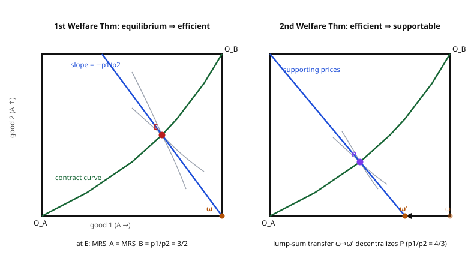

# Grad Microeconomics · Lesson 4.4: The two welfare theorems

> ⏱ ~15 min · Module 4: General equilibrium and welfare · Builds on: [4.3 Existence of Walrasian equilibrium](04-03-existence-walrasian-equilibrium.md) · Unlocks: [4.5 The core and equivalence](04-05-core-and-equivalence.md)

## Why this matters

Existence (4.3) told us competitive prices *can* clear every market at once. That's a coordination miracle, but it says nothing about whether the outcome is any *good*. The two welfare theorems answer that, and they are the theorems that made economics a policy science. The **first** says competitive equilibrium wastes nothing — Adam Smith's invisible hand, promoted from metaphor to lemma. The **second** says the market mechanism doesn't chain you to one distribution: *any* efficient outcome you might prefer on fairness grounds is reachable by markets, once you've set the starting wealth. Together they license the standard division of labor in economics: let prices handle efficiency, let lump-sum transfers handle justice. Every argument for markets — and every honest statement of their limits — starts here.

## The idea

Two intuitions, one per theorem.

**First theorem (cheap and universal).** At a Walrasian equilibrium everyone has bought the best bundle their budget allows. Suppose some clever planner could reshuffle goods to make *someone* happier and *no one* worse off. Anyone made strictly happier must have been handed a bundle they could *not* afford at the old prices (or they'd have bought it themselves). Anyone else got a bundle at least as good — which, by "more is better," costs at least as much as what they had. Add it all up: the new allocation costs *strictly more* than the old one at market prices. But the old one already spent society's entire endowment. There's no more money. The reshuffle is infeasible. So no such improvement exists — equilibrium is efficient. Notice what we never used: **convexity, smoothness, one good or a thousand.** Just "more is better." That's why the first theorem is nearly assumption-free.

**Second theorem (powerful but demanding).** Now run it backwards. Pick *any* efficient allocation you like — maybe a very equal one. Can markets deliver it? Draw the set of all reshuffles that would make *everyone* at least as well off as your target. If preferences are **convex** (averages are weakly preferred to extremes), that set is convex, and it just touches — but never enters — the set of things society can actually produce from its endowment. Two convex sets that don't overlap can be pried apart by a flat wall: a **hyperplane**. The direction perpendicular to that wall *is a price vector*. At those prices, your target allocation is exactly what each consumer would freely choose — provided each is handed the right wealth to afford it. That "handed the right wealth" is the catch: you must **redistribute endowments first** (a lump-sum transfer). Convexity is doing real work here; drop it and the wall can't be drawn.

The asymmetry is the whole lesson: **first theorem needs almost nothing; second theorem needs convexity plus transfers.**

## The formal version

Setup: an **exchange economy** with consumers $i = 1, \dots, I$, goods $\ell = 1, \dots, L$. Consumer $i$ has preferences $\succsim_i$ over consumption bundles $x_i \in \mathbb{R}^L_+$ and an endowment $\omega_i \in \mathbb{R}^L_+$. An **allocation** $(x_1, \dots, x_I)$ is **feasible** if $\sum_i x_i \le \sum_i \omega_i$ (call the total endowment $\bar\omega = \sum_i \omega_i$). Prices are a vector $p \in \mathbb{R}^L$.

**Definitions.**
- **Pareto efficient:** a feasible allocation with no other feasible allocation that makes every consumer at least as well off and at least one strictly better off.
  - *In words:* you can't help someone without hurting someone.
- **Walrasian equilibrium (with transfers):** prices $p$ and a feasible allocation $(x_i)$ such that each $x_i$ maximizes $\succsim_i$ subject to the budget $p \cdot x_i \le w_i$, where the wealth levels $(w_i)$ satisfy $\sum_i w_i = p \cdot \bar\omega$. With **no** transfers, $w_i = p \cdot \omega_i$.
  - *In words:* at these prices everyone buys their favorite affordable bundle and all markets clear; "with transfers" just means we're free to reassign who owns the initial wealth, keeping the total fixed.
- **Local nonsatiation (LNS):** for every bundle $x_i$ and every radius $\varepsilon > 0$ there is a bundle $x_i'$ within distance $\varepsilon$ with $x_i' \succ_i x_i$.
  - *In words:* no matter where you stand, a strictly better bundle sits arbitrarily close — you're never fully satisfied. (More-is-better implies this; so does any strictly increasing utility.)

---

**First Welfare Theorem.** If every consumer's preferences are locally nonsatiated, then any Walrasian equilibrium allocation is Pareto efficient.

*In words:* competitive markets waste nothing — the only assumption is that people always want a little more.

**Proof.** Let $(p, (x_i))$ be a Walrasian equilibrium with wealths $(w_i)$, and suppose for contradiction that a feasible allocation $(x_i')$ Pareto-dominates it. Two facts drive everything.

1. If $x_i' \succ_i x_i$ (consumer $i$ strictly prefers the new bundle), then $p \cdot x_i' > w_i$. Why: $x_i$ was $i$'s *utility-maximizing* choice on the budget, so anything strictly better must have been unaffordable.
2. If $x_i' \succsim_i x_i$ (weakly prefers), then $p \cdot x_i' \ge w_i$. Why: if instead $p \cdot x_i' < w_i$, LNS gives a bundle $x_i''$ arbitrarily close to $x_i'$, hence still affordable, that is strictly better — contradicting that $x_i$ was optimal. (**This is the one and only place LNS is used**, and why "no thick indifference bands" matters.)

Since $(x_i')$ Pareto-dominates, every consumer is weakly better off (fact 2 applies to all) and at least one is strictly better off (fact 1 applies to that one). Summing over $i$, with the strict inequality surviving the sum:

$$\sum_i p \cdot x_i' > \sum_i w_i = p \cdot \bar\omega.$$

But feasibility of $(x_i')$ means $\sum_i x_i' \le \bar\omega$, and with $p \ge 0$ (prices are nonnegative at equilibrium under LNS) that forces $\sum_i p \cdot x_i' \le p \cdot \bar\omega$. The two displays contradict each other. Hence no dominating allocation exists. $\blacksquare$

*The engine:* an improvement would have to cost more than society owns. Cheap, and completely general.

---

**Second Welfare Theorem.** Suppose every consumer's preferences are convex, continuous, and locally nonsatiated, with $\bar\omega \gg 0$. Then for any Pareto-efficient allocation $(x_i^*)$ there exist prices $p \ne 0$ such that $(p, (x_i^*))$ is a Walrasian equilibrium *with transfers* — i.e. with wealth levels $w_i = p \cdot x_i^*$, each $x_i^*$ maximizes $\succsim_i$ on the budget $p \cdot x_i \le w_i$.

*In words:* pick any efficient outcome; if preferences are convex you can hit it with competitive markets, provided you first redistribute the starting wealth by lump-sum transfers.

**Proof sketch (separating hyperplane).** For each consumer let $V_i = \{\, x_i : x_i \succ_i x_i^* \,\}$ be the set of bundles *strictly preferred* to the target. Convexity of $\succsim_i$ makes each $V_i$ convex; form the aggregate **better-than set**

$$V = \sum_i V_i = \Big\{ \textstyle\sum_i x_i : x_i \succ_i x_i^* \ \forall i \Big\},$$

which is convex (a sum of convex sets). Because $(x_i^*)$ is Pareto efficient, there is **no feasible way** to make everyone strictly better off, so $V$ does not meet the feasible aggregate $\{\, z : z \le \bar\omega \,\}$ except possibly at its boundary — the two convex sets are disjoint in interiors. The **separating hyperplane theorem** (from `real-analysis` / `linalg-refresher`: two disjoint convex sets admit a hyperplane with one on each side) delivers a nonzero $p$ and scalar $c$ with

$$p \cdot z \ge c \ \text{ for all } z \in V, \qquad p \cdot z \le c \ \text{ for all feasible } z.$$

That $p$ is the price vector: its normal direction is the wall's orientation. Continuity plus LNS then upgrade the separation to the exact statement that each $x_i^*$ is $i$'s cost-minimizing way to reach utility $u_i(x_i^*)$ at prices $p$, and (using $\bar\omega \gg 0$, a cheaper-point condition) that cost-minimization coincides with utility-maximization on the budget $p \cdot x_i \le p \cdot x_i^*$. Setting $w_i = p \cdot x_i^*$ gives the transfers. $\blacksquare$

*The engine:* efficiency says "no common improvement," which geometrically means the better-than cloud and the feasible set don't overlap — and disjoint convex sets always have a separating price. **Convexity is what keeps the cloud convex; without it the wall may not exist.**

## Picture

Left panel (first theorem): the blue budget line runs through the endowment $\omega$; equilibrium $E$ sits where both consumers' indifference curves are tangent — that tangency ($MRS_A = MRS_B$) is exactly the contract curve (the green Pareto set), so $E$ is efficient. Right panel (second theorem): to hit the *chosen* efficient point $P$, tilt prices to the supporting slope and slide the endowment from $\omega$ to $\omega'$ by a lump-sum transfer; now the competitive budget line through $\omega'$ makes $P$ each consumer's free choice.

## Worked examples

A two-good, two-consumer exchange economy. Consumer $A$ has $u_A(x_1,x_2) = x_1^{2/3} x_2^{1/3}$; consumer $B$ has $u_B(y_1,y_2) = y_1^{1/2} y_2^{1/2}$. Endowments: $\omega_A = (1,0)$, $\omega_B = (0,1)$, so $\bar\omega = (1,1)$. (Cobb–Douglas demand, from 4.2: a consumer with $x_1^{\alpha}x_2^{1-\alpha}$ and wealth $w$ at prices $(p_1,p_2)$ buys $x_1 = \alpha w / p_1$, $x_2 = (1-\alpha) w / p_2$ — spend fraction $\alpha$ of wealth on good 1.)

**Example 1 (first theorem: solve equilibrium, verify efficiency).** Normalize $p_2 = 1$, write $p_1 = p$. Wealths from own endowments: $w_A = p \cdot 1 = p$, $w_B = 1$. Demands:

$$x_{A1} = \tfrac{2}{3}\,\tfrac{p}{p} = \tfrac{2}{3}, \quad x_{B1} = \tfrac{1}{2}\,\tfrac{1}{p}.$$

Clear the good-1 market ($x_{A1} + x_{B1} = 1$): $\tfrac{2}{3} + \tfrac{1}{2p} = 1 \Rightarrow \tfrac{1}{2p} = \tfrac{1}{3} \Rightarrow p = \tfrac{3}{2}$. So the equilibrium price ratio is $p_1/p_2 = 3/2$. The allocation:

$$x_A = \left(\tfrac{2}{3},\ \tfrac{1}{2}\right), \qquad x_B = \left(\tfrac{1}{3},\ \tfrac{1}{2}\right)$$

(good 2: $x_{A2} = \tfrac{1}{3}\cdot\tfrac{3/2}{1} = \tfrac12$, $x_{B2} = \tfrac12\cdot\tfrac11=\tfrac12$; markets clear: $\tfrac23+\tfrac13=1$, $\tfrac12+\tfrac12=1$ ✓). Now *verify Pareto efficiency directly* via the tangency condition $MRS_A = MRS_B$. For Cobb–Douglas, $MRS = \frac{\partial u/\partial x_1}{\partial u/\partial x_2} = \frac{\alpha}{1-\alpha}\frac{x_2}{x_1}$:

$$MRS_A = \frac{2/3}{1/3}\cdot\frac{1/2}{2/3} = 2 \cdot \tfrac{3}{4} = \tfrac{3}{2}, \qquad MRS_B = \frac{1/2}{1/2}\cdot\frac{1/2}{1/3} = \tfrac{3}{2}.$$

They match — and match the price ratio. The allocation lies on the contract curve, so it is Pareto efficient, exactly as the first theorem promises (no efficiency computation was needed; the theorem guaranteed it).

**Example 2 (second theorem: decentralize a *different* efficient point).** The contract curve here is the set of interior allocations with $MRS_A = MRS_B$, i.e. $2\frac{x_{A2}}{x_{A1}} = \frac{1-x_{A2}}{1-x_{A1}}$, which solves to $x_{A2} = \frac{x_{A1}}{2 - x_{A1}}$. Suppose fairness pushes us toward giving $A$ half of good 1: target $x_{A1} = \tfrac12$, giving $x_{A2} = \frac{1/2}{3/2} = \tfrac13$. The target Pareto-efficient allocation is

$$x_A^* = \left(\tfrac12,\ \tfrac13\right), \qquad x_B^* = \left(\tfrac12,\ \tfrac23\right).$$

**Supporting prices** = the common $MRS$ at $P$: $MRS_A = 2\cdot\frac{1/3}{1/2} = \tfrac43$ (and $MRS_B = \frac{2/3}{1/2} = \tfrac43$ ✓). So set $\hat p_1/\hat p_2 = 4/3$, i.e. $\hat p = (\tfrac43, 1)$. **Required wealths** = value of each target bundle at $\hat p$:

$$w_A^* = \tfrac43\cdot\tfrac12 + 1\cdot\tfrac13 = 1, \qquad w_B^* = \tfrac43\cdot\tfrac12 + 1\cdot\tfrac23 = \tfrac43.$$

(Check: $w_A^* + w_B^* = \tfrac73 = \hat p \cdot \bar\omega = \tfrac43 + 1$ ✓. And these wealths reproduce the target as CD demand: $x_{A1} = \tfrac23\cdot\frac{1}{4/3} = \tfrac12$, etc. ✓.) **The lump-sum transfer:** at $\hat p$ the untouched endowments are worth $\hat p\cdot\omega_A = \tfrac43$ and $\hat p\cdot\omega_B = 1$ — but $A$ needs only $1$ and $B$ needs $\tfrac43$. So move wealth $\tfrac13$ from $A$ to $B$. Concretely, redistribute endowments to $\omega_A' = (\tfrac34, 0)$, $\omega_B' = (\tfrac14, 1)$ (transfer $\tfrac14$ unit of good 1 from $A$ to $B$): then $\hat p\cdot\omega_A' = \tfrac43\cdot\tfrac34 = 1$ and $\hat p\cdot\omega_B' = \tfrac43\cdot\tfrac14 + 1 = \tfrac43$, and the Walrasian equilibrium from *these* endowments is exactly $P$. The market decentralized a hand-picked distribution — but only after redistribution. (Examples 1 and 2 together are Boss Problem 4.)

## Watch out

- **The first theorem needs *only* LNS — not convexity.** You might think efficiency requires nice smooth convex tastes; it doesn't. Kinks, nonconvexities, indivisibilities: the first theorem survives them all, because its proof is a pure budget-summing argument. Convexity is the *second* theorem's requirement, and dropping it can genuinely break decentralization — a nonconvex better-than set may have no separating hyperplane, so some efficient points are simply unreachable by any prices.
- **"Supported *with transfers*" is not "is an equilibrium of the original endowments."** The second theorem does not say markets, left alone, reach your favorite outcome. It says markets reach it *after* you reset who owns what. Skip the transfer and you get whatever equilibrium the original $\omega$ produces (Example 1's $E$), not your target $P$. Prices alone can't relocate the equilibrium along the contract curve — wealth must move.
- **Efficient $\ne$ fair.** Pareto efficiency is a shockingly weak bar: "one person owns everything, everyone else starves" is Pareto efficient (you can't make a starver better off without taking from the tycoon). The first theorem promises efficiency and *nothing about equity*. All the distributional content lives in the transfers of the second theorem — which is exactly why the theorems are usually stated as a pair.
- **Lump-sum transfers are a heroic assumption.** "Lump-sum" means the transfer can't be dodged by changing behavior — it's tied to fixed characteristics, not to income or trades (which people would distort). Implementing one requires the planner to *know* everyone's type. That informational demand is precisely where Module 5 (mechanism design, screening) begins: in the real world you can't see types, so second-best redistribution uses distorting taxes, and the clean efficiency/equity split blurs.

## One-liner

> Competitive markets never waste (first theorem, needs only that people want more); and with convex tastes they can reach *any* efficient outcome you choose — but only after you redistribute the starting wealth (second theorem).

## Problems

**P1 (🟢)** In an exchange economy both consumers have identical Cobb–Douglas preferences $u = x_1^{1/2} x_2^{1/2}$; endowments are $\omega_A = (4,0)$, $\omega_B = (0,2)$. Find the Walrasian equilibrium price ratio and allocation, and verify $MRS_A = MRS_B$ (so the outcome is efficient, per the first theorem).

**P2 (🟡)** A student claims: "By the second welfare theorem, in Example 1's economy we can make the allocation perfectly equal — $x_A = x_B = (\tfrac12,\tfrac12)$ — just by announcing the right prices, no redistribution needed." Diagnose the two errors. (Hint: is $(\tfrac12,\tfrac12)$ even Pareto efficient here? And what does "supported with transfers" require?)

**P3 (🔴, optional)** Consider one consumer with *nonconvex* preferences: her better-than sets are not convex (e.g. she strictly prefers a specialized bundle to any average of it with another equally-liked bundle). Sketch/argue why there can be a Pareto-efficient allocation that **no** price vector supports as an equilibrium with transfers, and identify exactly which line of the second theorem's proof fails.

Solutions

**P1** Both spend half of wealth on each good. Normalize $p_2 = 1$, $p_1 = p$; wealths $w_A = 4p$, $w_B = 2$. Good-1 demands: $x_{A1} = \tfrac12\cdot\frac{4p}{p} = 2$, $x_{B1} = \tfrac12\cdot\frac{2}{p} = \frac1p$. Clearing $x_{A1}+x_{B1} = 4$: $2 + \tfrac1p = 4 \Rightarrow p = \tfrac12$. So $p_1/p_2 = \tfrac12$. Allocation: $x_{A2} = \tfrac12\cdot\frac{4p}{1} = 2p = 1$, $x_{B2} = \tfrac12\cdot\frac{2}{1} = 1$, and $x_{B1} = \frac1p = 2$. Thus $x_A = (2,1)$, $x_B = (2,1)$ (clears: $2+2=4$, $1+1=2$ ✓). Check $MRS = \frac{x_2}{x_1}$: $MRS_A = \tfrac12 = MRS_B$, equal to $p_1/p_2 = \tfrac12$. Tangent → on the contract curve → Pareto efficient. ✓

**P2** *Error 1 — the target isn't efficient.* At $(\tfrac12,\tfrac12)$ for both, $MRS_A = \frac{2/3}{1/3}\cdot\frac{1/2}{1/2} = 2$ while $MRS_B = \frac{1/2}{1/2}\cdot\frac{1/2}{1/2} = 1$. Since $MRS_A \ne MRS_B$, the allocation is *off* the contract curve — a mutually improving trade exists, so it is not Pareto efficient. The second theorem only supports *efficient* allocations; it says nothing about $(\tfrac12,\tfrac12)$. *Error 2 — "no redistribution needed" is exactly backwards.* Even for a genuinely efficient target (like Example 2's $P$), the theorem supports it only *with transfers*: you must move endowments (there, shift $\tfrac14$ of good 1 from $A$ to $B$). Prices alone cannot slide the equilibrium to a chosen point on the contract curve; wealth has to move. So both the premise (efficiency) and the mechanism (no transfers) are wrong.

**P3** With nonconvex preferences the individual better-than set $V_i = \{x : x \succ_i x_i^*\}$ is *not convex*, so the aggregate better-than set $V = \sum_i V_i$ need not be convex. The second theorem's proof separates $V$ from the feasible set with a hyperplane — but the **separating hyperplane theorem requires both sets to be convex.** If $V$ is nonconvex it can "wrap around" the feasible set so that no single flat hyperplane keeps them apart: any line that touches the efficient point cuts *into* $V$, meaning at the candidate prices the consumer would strictly prefer — and could afford — some other bundle, so the target is not her optimum. Concretely, a consumer with (say) a bumpy, non-quasiconcave utility can have an efficient allocation whose supporting "budget line" is tangent at $x_i^*$ yet passes below a preferred bundle across the bump; at those prices she jumps to the bump, breaking market clearing. The failing line is the invocation of the separating hyperplane theorem, whose hypothesis (convexity of $V$) no longer holds. The first theorem, needing no such separation, is untouched. $\blacksquare$

## Flashback

**From Lesson 4.2 (The Edgeworth box and Walrasian equilibrium):** Two consumers with identical preferences $u = x_1 x_2$; endowments $\omega_A = (2,0)$, $\omega_B = (0,1)$. Solve for the competitive equilibrium price ratio and allocation, then confirm the outcome is Pareto efficient.

Solution

$u = x_1 x_2$ is a monotone transform of $x_1^{1/2}x_2^{1/2}$, so each consumer spends half of wealth on each good. Normalize $p_2 = 1$, $p_1 = p$; wealths $w_A = 2p$, $w_B = 1$. Good-1 demands: $x_{A1} = \tfrac12\cdot\frac{2p}{p} = 1$, $x_{B1} = \tfrac12\cdot\frac{1}{p} = \frac{1}{2p}$. Clear good 1 ($x_{A1}+x_{B1} = 2$): $1 + \frac{1}{2p} = 2 \Rightarrow \frac{1}{2p} = 1 \Rightarrow p = \tfrac12$. So $p_1/p_2 = \tfrac12$.

Allocation: $x_{A2} = \tfrac12\cdot\frac{2p}{1} = 2p = 1$; $x_{B1} = \frac{1}{2p} = 1$, $x_{B2} = \tfrac12\cdot\frac{1}{1} = \tfrac12$. Wait — recompute $x_{A1}$: it is $1$, and $x_{B1} = 1$, summing to $2$ ✓; $x_{A2} = 1$, $x_{B2} = \tfrac12$, summing to $\tfrac32$? That exceeds $\bar\omega_2 = 1$ — so recheck. $w_A = 2p = 1$, hence $x_{A2} = \tfrac12 \cdot \frac{w_A}{p_2} = \tfrac12\cdot 1 = \tfrac12$; $w_B = 1$, $x_{B2} = \tfrac12$. Good 2: $\tfrac12+\tfrac12 = 1$ ✓. So the allocation is

$$x_A = \left(1,\ \tfrac12\right), \qquad x_B = \left(1,\ \tfrac12\right).$$

Efficiency check: $MRS = \frac{x_2}{x_1}$, so $MRS_A = \tfrac12 = MRS_B$, both equal to $p_1/p_2 = \tfrac12$. The indifference curves are mutually tangent → the allocation is on the contract curve → Pareto efficient. (And this is the first welfare theorem in miniature: we didn't have to *check* efficiency — solving the competitive equilibrium guaranteed it.)

## Connections

- **Backward:** [4.2](04-02-edgeworth-box-walrasian-equilibrium.md) built the Edgeworth box and defined the **contract curve** as the Pareto set — this lesson proves *why* the competitive equilibrium lands on it (first theorem) and that *every* point of it is reachable (second theorem). [4.3](04-03-existence-walrasian-equilibrium.md) guaranteed the equilibrium these theorems evaluate actually *exists*. The convexity hypothesis of the second theorem is the same convexity from [1.1](01-01-convexity-concavity-quasiconcavity.md) that made better-than sets convex.
- **Forward:** [4.5](04-05-core-and-equivalence.md) sharpens the efficiency story — the **core** refines Pareto efficiency to coalition-proofness, and the Debreu–Scarf theorem shows competition and the core coincide in large economies. Module 5 (mechanism design) is the sustained answer to this lesson's biggest caveat: **lump-sum transfers require observing types**, which you can't, so real redistribution is second-best. Lessons 6.3–6.4 (externalities, public goods) are cataloged failures of the *first* theorem — LNS holds but prices are missing for some goods, so the invisible hand misses.
- **Sideways (`real-analysis` / `linalg-refresher`):** the second theorem is an *economic corollary of the separating hyperplane theorem* — two disjoint convex sets, a wall between them, its normal read as a price. The same separation underlies duality in linear programming and the supporting-hyperplane characterization of convex sets. Seeing "prices = separating normal" once makes the whole GE–duality web click.
