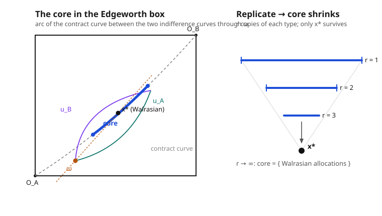

# Grad Microeconomics · Lesson 4.5: The core and equivalence

> ⏱ ~15 min · Module 4: General equilibrium and welfare · Builds on: [4.4 The two welfare theorems](04-04-two-welfare-theorems.md) · Unlocks: [4.6 Uniqueness, stability, and their failure](04-06-uniqueness-stability-failure.md)

## Why this matters

The First Welfare Theorem says competitive markets are efficient — but it *assumes* price-taking, and in a world of finitely many traders, why would anyone take prices as given rather than haggle? This lesson answers that. It reconstructs competition from a purely game-theoretic primitive — coalitions that can walk away and do better on their own — and proves that in a large economy the only allocations no coalition wants to overturn are *exactly* the Walrasian ones. Price-taking isn't an assumption you swallow; it's what's left standing when every group is free to defect. This is the deepest justification we have for the competitive model, and the bridge from GE to cooperative game theory.

## The idea

Forget prices for a moment. An allocation is on the table. A group of agents — a **coalition** — looks at it and asks: "Using nothing but the goods *we* walked in with, can we split them among ourselves so that everyone in our group is at least as happy, and someone is strictly happier?" If yes, they secede — they **block** the allocation, and it's dead. The **core** is the set of allocations that survive: no coalition, large or small, can profitably break away.

Two blocking checks are easy. A single agent blocks if the allocation gives her less than her own endowment would — so core allocations must be **individually rational**. The coalition of *everyone* blocks if the pie can be re-split to make someone better off with nobody worse — so core allocations must be **Pareto efficient**. The core is trapped inside "individually rational *and* Pareto efficient," but it's usually strictly smaller: intermediate coalitions do extra pruning.

In the Edgeworth box this is a picture you can point to. Draw the indifference curve of each trader through the endowment $\omega$. Individual rationality keeps you on the far side of each curve (nobody accepts a trade worse than no-trade). Pareto efficiency pins you to the contract curve. The core is the *arc of the contract curve caught between the two indifference curves through $\omega$* — a segment, not a point. Now the magic: **replicate** the economy, cloning each trader into $r$ identical copies. More agents means more coalitions, means more ways to block, means the surviving segment shrinks. As $r \to \infty$ it collapses to a single point — the Walrasian allocation. Competition and coalition-proofness turn out to be the same thing.

## The formal version

Fix an exchange economy with agents $i = 1,\dots,n$, each with endowment $\omega_i \in \mathbb{R}^L_+$ and preferences $\succsim_i$. An **allocation** $x = (x_1,\dots,x_n)$ is feasible if $\sum_i x_i = \sum_i \omega_i$.

**Blocking.** A coalition $S \subseteq \{1,\dots,n\}$ (nonempty) **blocks** $x$ if there exist bundles $(y_i)_{i \in S}$ with

$$\sum_{i \in S} y_i = \sum_{i \in S} \omega_i, \qquad y_i \succsim_i x_i \text{ for all } i \in S, \qquad y_i \succ_i x_i \text{ for some } i \in S.$$

*In words:* using only the coalition's **own** pooled endowment, they can hand every member a bundle at least as good, and at least one member a strictly better one.

**The core.** $\mathcal{C}$ is the set of feasible allocations that no coalition blocks.

*In words:* allocations stable against every possible walk-out. Taking $S = \{i\}$ gives individual rationality ($x_i \succsim_i \omega_i$); taking $S = \{1,\dots,n\}$ gives Pareto efficiency. Both are necessary, neither pair is sufficient.

**Walrasian $\subseteq$ core.** Every Walrasian equilibrium allocation lies in the core.

*In words, with the proof in one breath:* let $x^*$ be a Walrasian allocation at prices $p$. Suppose coalition $S$ blocks it with $(y_i)$. Each $y_i \succsim_i x_i^*$, with one strict; but $x_i^*$ maximizes $\succsim_i$ on the budget $p \cdot x_i \le p \cdot \omega_i$, so $y_i \succ_i x_i^*$ forces $p \cdot y_i > p \cdot \omega_i$ and $y_i \succsim_i x_i^*$ forces $p \cdot y_i \ge p \cdot \omega_i$. Summing over $S$: $p \cdot \sum_{i\in S} y_i > p \cdot \sum_{i \in S} \omega_i$ — the coalition's plan costs more than it owns, contradicting feasibility. This is the First Welfare Theorem's budget argument (from [4.4](04-04-two-welfare-theorems.md)) run on a sub-economy.

**Equal treatment (the lemma that makes replicas tractable).** In the $r$-fold replica, if preferences are strictly convex, then any core allocation gives **identical bundles to all copies of the same type**.

*In words:* the core can't play favorites among clones. So a core allocation of the replica is fully described by one bundle per type, and blocking coalitions can be summarized by *how many* of each type they contain — the machinery collapses from $rn$ agents to $n$ numbers.

**Debreu–Scarf core convergence.** Replicate the economy $r$ times (each of $n$ types cloned into $r$ identical agents). Let $\mathcal{C}_r$ be the set of type-allocations in the core of the $r$-replica. Then $\mathcal{C}_1 \supseteq \mathcal{C}_2 \supseteq \cdots$ and

$$\bigcap_{r=1}^{\infty} \mathcal{C}_r = \{\text{Walrasian equilibrium allocations}\}.$$

*In words:* the core shrinks with each round of cloning and, in the limit, contains **exactly** the competitive allocations — no more, no less. Coalition-proofness in the large economy singles out price-taking on its own.

## Picture

## Worked examples

Throughout, an exchange economy with two types, goods $x$ and $y$, and Cobb–Douglas utility $u_A = x_A\, y_A$, $u_B = x_B\, y_B$. Endowments $\omega_A = (1.5,\,0.5)$, $\omega_B = (0.5,\,1.5)$, so total supply is $(2,2)$.

**Example 1 (mechanical — locate the core, check Walrasian is inside).**

*Contract curve.* For $u = xy$ the marginal rate of substitution is $\mathrm{MRS} = u_x/u_y = y/x$. Pareto efficiency equates them: $y_A/x_A = y_B/x_B$. Substituting $x_B = 2 - x_A$, $y_B = 2 - y_A$ and simplifying gives $y_A = x_A$ — the contract curve is the main diagonal. Write a point on it as $A$ consumes $(t,t)$, $B$ consumes $(2-t, 2-t)$.

*Individual rationality.* Endowment utilities are $u_A(\omega_A) = 1.5 \cdot 0.5 = 0.75$ and $u_B(\omega_B) = 0.5 \cdot 1.5 = 0.75$. So we need

$$t^2 \ge 0.75 \quad\text{and}\quad (2-t)^2 \ge 0.75 \;\Longrightarrow\; \tfrac{\sqrt3}{2} \le t \le 2 - \tfrac{\sqrt3}{2},$$

i.e. $t \in [0.866,\ 1.134]$. **That interval is the core** — the Pareto-efficient, individually-rational arc.

*Walrasian point.* Normalize $p_y = 1$. With Cobb–Douglas each agent spends half of wealth on each good. Market-clearing in good $x$ gives $\tfrac{1}{2}\frac{1.5 p_x + 0.5}{p_x} + \tfrac{1}{2}\frac{0.5 p_x + 1.5}{p_x} = 2$, which reduces to $p_x + 1 = 2p_x$, so $p_x = 1$. Each agent then has wealth $2$ and demands $(1,1)$: the Walrasian allocation is $t = 1$. Since $0.866 < 1 < 1.134$, it sits **strictly inside** the core — as it must, and away from the boundary because $r = 1$ hasn't done its shrinking yet.

**Example 2 (a small blocking argument — replication kills a non-Walrasian core point).**

Take the core allocation $t = 1.1$: every $A$ gets $(1.1,1.1)$ with $u_A = 1.21$, every $B$ gets $(0.9,0.9)$ with $u_B = 0.81$. It is Pareto efficient and individually rational, so it lives in the $r=1$ core — but it favors the $A$'s over the competitive split, so it is *not* Walrasian. Watch it die at $r = 2$.

Replicate: agents $A_1, A_2, B_1, B_2$. By equal treatment, the candidate still gives every $A$-copy $(1.1,1.1)$ and every $B$-copy $(0.9,0.9)$. Form the coalition $S = \{A_1, B_1, B_2\}$ — **one $A$, two $B$'s**. Its pooled endowment is

$$\omega_A + 2\,\omega_B = (1.5,0.5) + 2(0.5,1.5) = (2.5,\ 3.5).$$

Proposed re-split inside $S$: let $A_1$ **keep** $(1.1,1.1)$, and give each of $B_1, B_2$ the bundle $(0.7,\ 1.2)$. Feasibility check: $1.1 + 0.7 + 0.7 = 2.5$ and $1.1 + 1.2 + 1.2 = 3.5$ — exactly the coalition's endowment, nothing borrowed. Utilities: $A_1$ has $1.21$ (unchanged), each $B$ now has $0.7 \cdot 1.2 = 0.84 > 0.81$ (strictly better). Everyone weakly gains, the $B$'s strictly gain: **$S$ blocks.**

The allocation was in the core with one trader of each type; two clones of the "short side" ($B$) were enough to overturn it. The intuition is the one behind convergence: replication lets the group being squeezed assemble a coalition that mimics trading against the competitive market, and only the price-taking allocation resists every such coalition.

## Watch out

- **Blocking uses the coalition's *own* endowment only.** You might think a coalition can propose any Pareto improvement it likes — but it may only redistribute $\sum_{i\in S}\omega_i$, the goods its members brought. It cannot borrow from outsiders. This budget is exactly what the Walrasian-in-core proof exploits.
- **Individually rational + Pareto efficient is necessary, not sufficient.** Those two conditions only rule out the singleton and grand coalitions. Example 2's point passes both yet gets blocked by an *intermediate* coalition once the economy is replicated. The core is generally a strict subset of that box.
- **Equal treatment is a theorem, not an assumption.** With strictly convex preferences the core *forces* identical types to get identical bundles — you don't impose it, you earn it (concavity means an unequal pair could be averaged into a blocking improvement). It's what lets "coalition" reduce to "how many of each type."
- **Core $\supseteq$ Walrasian always; equality only in the limit.** For any finite economy the core is typically bigger than the set of Walrasian allocations. Debreu–Scarf is a statement about $r \to \infty$, not about any fixed $r$.

## One-liner

> The core is what survives every coalition's threat to walk out with its own goods — and as the economy is cloned to infinity, the only survivors are the competitive allocations, so price-taking is coalition-proofness in disguise.

## Problems

**P1 (🟢)** In the economy above ($u = xy$, endowments $(1.5,0.5)$ and $(0.5,1.5)$), an allocation gives $A$ the bundle $(1.3,1.3)$ and $B$ the bundle $(0.7,0.7)$. Is it in the (one-copy) core? Justify with the two easy necessary conditions.

**P2 (🟡)** Prove directly — without invoking the general theorem — that the Walrasian allocation $(1,1)$ for each agent is in the $r=1$ core. (Only three coalitions exist; rule out each.)

**P3 (🔴, optional)** By the symmetry of the economy, the $B$-favorable core point $t = 0.9$ (so $A$ gets $(0.9,0.9)$, $B$ gets $(1.1,1.1)$) should also be blocked at $r = 2$. Exhibit a blocking coalition and an explicit feasible re-split.

Solutions

**P1** *Pareto efficiency:* the point has $y_A = x_A = 1.3$, so it lies on the contract curve (the diagonal) — efficient. *Individual rationality:* $u_A = 1.3^2 = 1.69 \ge 0.75$ ✓, but $u_B = 0.7^2 = 0.49 < 0.75 = u_B(\omega_B)$. Agent $B$ is worse off than at her own endowment, so the singleton $\{B\}$ blocks (she keeps $(0.5,1.5)$ for utility $0.75$). **Not in the core** — efficiency alone doesn't save an allocation that starves a trader below her outside option.

**P2** At the Walrasian prices $p = (1,1)$ every agent's endowment is worth $2$, and each consumes $(1,1)$ with $u = 1$.
- $\{A\}$: alone, $A$ may only use $\omega_A = (1.5,0.5)$, giving at most $u_A = 1.5 \cdot 0.5 = 0.75 < 1$. Cannot improve — no block.
- $\{B\}$: symmetric, $u_B(\omega_B) = 0.75 < 1$ — no block.
- $\{A,B\}$: the grand coalition can improve on $(1,1),(1,1)$ only by finding a Pareto-superior feasible allocation. But $(1,1)$ is Pareto efficient (it's on the contract curve, equal MRS), so none exists — no block.
No coalition blocks, so the Walrasian allocation is in the core. (This is the general "Walrasian $\subseteq$ core" proof made concrete: each singleton fails because the competitive bundle already maximizes utility over the value of its own endowment, and the grand coalition fails by the First Welfare Theorem.)

**P3** Mirror Example 2, swapping the roles of the two types (and the two goods). Coalition $S = \{A_1, A_2, B_1\}$ — **two $A$'s, one $B$** — with pooled endowment $2\omega_A + \omega_B = (3.5, 2.5)$. Re-split: let $B_1$ **keep** $(1.1,1.1)$, and give each of $A_1, A_2$ the bundle $(1.2,\ 0.7)$. Feasibility: $1.2 + 1.2 + 1.1 = 3.5$ ✓ and $0.7 + 0.7 + 1.1 = 2.5$ ✓. Utilities: $B_1$ has $1.21$ (unchanged); each $A$ now has $1.2 \cdot 0.7 = 0.84 > 0.81 = u_A$ at the candidate. Both $A$'s strictly gain, $B_1$ is indifferent, so $S$ blocks. The $B$-favorable point is out of the $r=2$ core, just as the $A$-favorable one was.

## Flashback

**From Lesson 4.2 (The Edgeworth box and Walrasian equilibrium):** In a two-agent, two-good box with total supply $(1,1)$ and utilities $u_A = x_A^{1/3} y_A^{2/3}$, $u_B = x_B^{2/3} y_B^{1/3}$, derive the equation of the contract curve $y_A$ as a function of $x_A$.

Solution

For $u = x^{a} y^{1-a}$, $\mathrm{MRS} = u_x/u_y = \dfrac{a}{1-a}\dfrac{y}{x}$. So $\mathrm{MRS}_A = \tfrac{1/3}{2/3}\dfrac{y_A}{x_A} = \tfrac{1}{2}\dfrac{y_A}{x_A}$ and $\mathrm{MRS}_B = \tfrac{2/3}{1/3}\dfrac{y_B}{x_B} = 2\dfrac{y_B}{x_B}$. Efficiency sets them equal; with $x_B = 1 - x_A$, $y_B = 1 - y_A$:

$$\tfrac{1}{2}\frac{y_A}{x_A} = 2\,\frac{1 - y_A}{1 - x_A} \;\Longrightarrow\; y_A(1 - x_A) = 4x_A(1 - y_A) \;\Longrightarrow\; y_A(1 + 3x_A) = 4x_A,$$

so the contract curve is

$$y_A = \frac{4x_A}{1 + 3x_A}.$$

It runs from $O_A$ at $(0,0)$ to $O_B$ at $(1,1)$ and bows toward the good each agent weights more heavily — unlike the symmetric case in this lesson, where matched exponents straightened it into the diagonal.

## Connections

- **Backward:** the contract curve here is [4.2](04-02-edgeworth-box-walrasian-equilibrium.md)'s Pareto set, now re-read as the "grand-coalition-proof" locus; the proof that Walrasian allocations resist blocking is the budget argument of the First Welfare Theorem from [4.4](04-04-two-welfare-theorems.md), applied coalition by coalition instead of to the whole economy.
- **Forward:** [4.6](04-06-uniqueness-stability-failure.md) asks whether the Walrasian point the core converges *to* is unique and stable — core convergence guarantees *what* the limit is, not that there's only one.
- **Sideways (cooperative game theory):** the **core is a solution concept for cooperative games** — the set of coalition-stable outcomes — and this lesson is the exchange-economy instance of it. That bridge, *core of an economy $\leftrightarrow$ core of a cooperative game $\leftrightarrow$ competitive equilibrium*, is developed for its own sake in `grad-game-theory`; the transferable-utility warm-up (imputations, the core of a characteristic-function game) lives in `game-theory-refresher`. Debreu–Scarf is precisely the statement that the economic and competitive cores coincide in the large-economy limit.
- **Sideways (intuition):** the competitive equilibrium and welfare pictures behind all of this are the undergraduate-level story in `micro-refresher`; this lesson supplies the game-theoretic *foundation* that course takes on faith.
