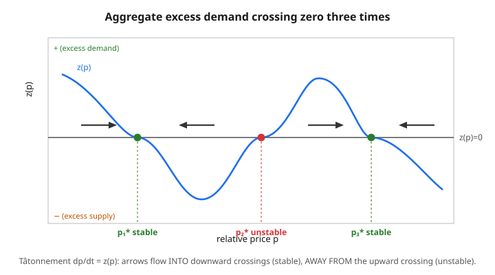

# Grad Microeconomics · Lesson 4.6: Uniqueness, stability, and their failure

> ⏱ ~15 min · Module 4: General equilibrium and welfare · Builds on: [4.5 The core and equivalence](04-05-core-and-equivalence.md) · Unlocks: [5.1 Adverse selection: the market for lemons](05-01-adverse-selection-lemons.md)

## Why this matters

Lesson 4.3 gave us existence: under convexity and continuity, a Walrasian equilibrium always exists. That is a genuine triumph — but it is also the *only* structural promise the theory keeps, and it is easy to over-read. Existence does not say the equilibrium is **unique** (there may be several clearing price vectors, and comparative statics becomes ambiguous), nor that it is **stable** (that a disequilibrium market would actually find it). This lesson is the honest coda to the general-equilibrium program: we ask when uniqueness and stability *do* hold, we find one clean sufficient condition (gross substitutes), and then we confront the theorem — Sonnenschein–Mantel–Debreu — that says the market's aggregate behavior inherits almost nothing from the rationality of the individuals inside it. Knowing where the dream breaks is what keeps you from assuming a "nice" downward-sloping market demand curve that the theory never promised you.

## The idea

Picture aggregate excess demand as a single curve: on the horizontal axis a relative price $p$, on the vertical axis $z(p)$, the net amount the whole economy wants to *buy* minus what it has. An equilibrium is a price where the curve crosses zero — supply meets demand. Existence says the curve crosses zero at least once. But nothing stops it from wiggling and crossing three times, or five. Each crossing is a valid equilibrium, and they can be ranked differently by different people — so "the" equilibrium is a fiction unless something forces a single crossing.

Now imagine a fictional auctioneer who, whenever a good is in excess demand ($z>0$), nudges its price *up*, and when in excess supply ($z<0$), nudges it *down*. This is **tâtonnement** ("groping"). At a *downward* crossing — curve going from positive to negative as price rises — the auctioneer's rule pushes prices back toward the crossing from both sides: it is **stable**, a valley the dynamics fall into. At an *upward* crossing, the same rule pushes prices *away*: **unstable**, a ridge that the slightest breeze rolls you off of. So the geometry of the crossing decides everything, and stability and instability must alternate.

The deflating punchline comes last. You might hope that piling up rational, optimizing consumers forces $z(p)$ to be well-behaved — single-crossing, downward-sloping, tame. Sonnenschein–Mantel–Debreu says no: essentially *any* continuous curve satisfying two bookkeeping identities is the excess demand of some perfectly standard economy. The wiggles are not pathologies to be assumed away; they are the generic case.

## The formal version

Work on the price simplex; normalize prices so only relative prices matter. Aggregate excess demand $z(p) = \big(z_1(p), \dots, z_L(p)\big)$ over $L$ goods, where $z_i(p)$ is total demand minus total endowment of good $i$. From individual optimization it always inherits exactly three properties:

1. **Continuity** in $p$.
2. **Homogeneity of degree zero:** $z(\lambda p) = z(p)$ for all $\lambda > 0$ — scaling all prices changes nothing real.
3. **Walras' law:** $p \cdot z(p) = 0$ for all $p$ — the value of aggregate excess demand is zero at every price.

An **equilibrium** is a price $p^*$ with $z(p^*) = 0$ (in the free-disposal version, $\le 0$ with equality where $p^*_i>0$).

**Gross substitutes (a sufficient condition for uniqueness).** Say $z$ satisfies *gross substitutes* if
$$\frac{\partial z_i(p)}{\partial p_j} > 0 \quad \text{for all } i \neq j.$$
*In words:* raise the price of any one good and the excess demand for **every other** good goes up — everything is a substitute for everything else, nothing is a complement. 

**Theorem (uniqueness).** If $z$ satisfies gross substitutes, the equilibrium price vector is unique up to scaling. *In words:* the curve can cross zero only once. The argument is a discrete-WARP flavor: if $p$ and $q$ were two distinct equilibria, raise the components of $p$ one at a time to reach $q$; gross substitutes makes the good whose *relative* price fell into excess demand, so $q$ cannot also clear — contradiction. (This is the index-theorem intuition: gross substitutes forces every crossing to be downward, and downward crossings cannot occur twice in a row without an upward crossing between them.)

**Tâtonnement dynamics.** Let prices evolve by the ODE
$$\frac{dp_i}{dt} = z_i(p), \qquad i = 1, \dots, L.$$
*In words:* prices rise where demand exceeds supply and fall where supply exceeds demand. A rest point of this ODE is exactly an equilibrium. Equilibrium $p^*$ is **locally stable** if trajectories starting near it converge to it, and **globally stable** if trajectories from *any* start converge.

**Theorem (stability under gross substitutes).** If $z$ satisfies gross substitutes, the (unique) equilibrium is globally stable. *In words:* the auctioneer always finds it. The proof is a Lyapunov argument (see `ode-refresher`): the "distance" $V(p) = \tfrac{1}{2}\sum_i (p_i - p^*_i)^2$ satisfies $\dot V = \sum_i (p_i - p_i^*)\,z_i(p) < 0$ off equilibrium — gross substitutes plus Walras' law force the value to strictly decrease, so $p$ slides monotonically down to $p^*$.

But without gross substitutes, tâtonnement can **cycle** or **diverge**: Scarf (1960) built a three-good exchange economy whose unique equilibrium is globally *unstable* — every non-equilibrium trajectory orbits it forever on a closed loop, never approaching.

**Theorem (Sonnenschein–Mantel–Debreu).** Fix any continuous function $\zeta:\ P \to \mathbb{R}^L$ defined on a compact price set bounded away from the boundary, satisfying homogeneity of degree zero and Walras' law $p\cdot \zeta(p)=0$. Then there is an exchange economy with $L$ (or fewer) consumers whose aggregate excess demand equals $\zeta$ on $P$. *In words:* continuity, homogeneity, and Walras' law are the **only** universal restrictions — beyond them, anything goes. Individual rationality (each consumer's demand obeys WARP and a negative-semidefinite Slutsky matrix, from [2.4](02-04-slutsky-equation-comparative-statics.md)) leaves **no** fingerprint on the aggregate. There is no hope of deriving uniqueness or stability from micro-foundations alone.

## Picture

## Worked examples

**Example 1 (mechanical — find and classify all equilibria).** A two-good economy reduces to a scalar excess demand in the relative price $p = p_1/p_2 > 0$:
$$z(p) = -(p-1)(p-2)(p-4).$$
Equilibria are the zeros: $p^* \in \{1, 2, 4\}$. To classify each under tâtonnement $\dot p = z(p)$, we need the sign of $z'(p^*)$ — a downward crossing ($z'<0$) is stable, an upward crossing ($z'>0$) is unstable. At a root, only the term keeping the other two factors survives, so
$$z'(1) = -\big[(1-2)(1-4)\big] = -[(-1)(-3)] = -3 < 0 \ \Rightarrow\ \textbf{stable},$$
$$z'(2) = -\big[(2-1)(2-4)\big] = -[(1)(-2)] = +2 > 0 \ \Rightarrow\ \textbf{unstable},$$
$$z'(4) = -\big[(4-1)(4-2)\big] = -[(3)(2)] = -6 < 0 \ \Rightarrow\ \textbf{stable}.$$
So $p=1$ and $p=4$ are stable, $p=2$ is the unstable ridge between them. Sanity check the flow directly: for $p$ just below $1$, $z(p) = -(-)(-)(-) > 0$, prices rise toward $1$; between $1$ and $2$, $z<0$, prices fall back toward $1$ — both sides drain into $p=1$, confirming stability. This is exactly the three-crossing picture above, made arithmetic.

**Example 2 (why you'd care — gross substitutes buys uniqueness and stability).** Pure exchange, two goods, two Cobb–Douglas consumers with equal weights $\tfrac12$. Consumer $A$ has endowment $(1,0)$, consumer $B$ has $(0,1)$. At prices $(p_1,p_2)$, wealth is $w_A = p_1$, $w_B = p_2$, and Cobb–Douglas spends half of wealth on each good, so demand for good 1 is
$$x_1^A = \tfrac12\,\frac{p_1}{p_1} = \tfrac12, \qquad x_1^B = \tfrac12\,\frac{p_2}{p_1}.$$
Total endowment of good 1 is $1$, so aggregate excess demand for good 1 is
$$z_1(p_1,p_2) = \tfrac12 + \tfrac12\,\frac{p_2}{p_1} - 1 = \tfrac12\!\left(\frac{p_2}{p_1} - 1\right).$$
Check gross substitutes: $\dfrac{\partial z_1}{\partial p_2} = \dfrac{1}{2p_1} > 0$ — raising good 2's price raises excess demand for good 1. Good. (And the own-price effect $\partial z_1/\partial p_1 = -\tfrac12 p_2/p_1^2 < 0$, as it must be.) Setting $z_1 = 0$ gives $p_2/p_1 = 1$: a **unique** relative price $p_1 = p_2$. And since $z_1$ is strictly decreasing in $p_1$, tâtonnement $\dot p_1 = z_1$ pulls $p_1$ down when it is too high and up when too low — **globally stable**. Gross substitutes delivered exactly what the theorems promised: one equilibrium, and the auctioneer finds it. Contrast this clean aggregation with Example 1's constructed cubic, which SMD tells us is equally legitimate as the excess demand of *some* economy.

## Watch out

- **Existence $\not\Rightarrow$ uniqueness $\not\Rightarrow$ stability.** These are three separate claims. 4.3 bought you only the first. Multiple equilibria are consistent with all the axioms, and even a *unique* equilibrium can be unstable (Scarf's example: one equilibrium, globally unstable — trajectories orbit it forever).
- **Gross substitutes is sufficient, not necessary.** Plenty of economies with complementarities still have a unique, stable equilibrium. Failing gross substitutes is a warning, not a verdict — don't conclude multiplicity just because two goods are complements.
- **Tâtonnement is a fable, not a market.** No trades happen until prices clear; the "auctioneer" adjusts on paper. Real markets trade out of equilibrium, which changes endowments mid-process (path dependence, wealth effects) — a genuinely harder problem this ODE quietly sidesteps. Stability of tâtonnement is not the same as stability of any actual trading process.
- **SMD kills the "nice aggregate demand curve."** Producer aggregation was clean — [3.4](03-04-aggregation-and-the-firm.md) showed the aggregate supply of a set of firms behaves just like one big firm's. Demand aggregation is the opposite: the market excess-demand function can be *any* continuous, homogeneous, Walras-law-obeying curve. Do not assume market demand slopes down, satisfies WARP, or has a well-behaved Slutsky matrix — the individuals do, the aggregate need not.

## One-liner

> Existence is all the general-equilibrium program guarantees: gross substitutes buys a unique, tâtonnement-stable equilibrium, but Sonnenschein–Mantel–Debreu says the aggregate demand curve can be *anything* continuous obeying Walras' law — so multiplicity and instability are the generic, not exceptional, case.

## Problems

**P1 (🟢)** A scalar excess demand in the relative price $p>0$ is $z(p) = (p-1)(p-3)$. Find all equilibria and classify each as stable or unstable under tâtonnement $\dot p = z(p)$.

**P2 (🟡)** Repeat Example 2 but with consumer weights $\alpha$ on good 1 and $1-\alpha$ on good 2 (same for both consumers), endowments $A=(1,0)$, $B=(0,1)$. Derive $z_1(p_1,p_2)$, verify gross substitutes, and find the unique equilibrium relative price $p_1/p_2$.

**P3 (🔴, optional)** Consider $z(p) = -(p-1)(p-2)(p-4)$ from Example 1 but with the *sign flipped*: $\tilde z(p) = (p-1)(p-2)(p-4)$. Classify all three equilibria under tâtonnement. Then explain, in one sentence, why $\tilde z$ **cannot** be the excess demand of any economy in which good 1 is a normal good with positive demand at low prices — i.e., what does the sign of $\tilde z(p)$ as $p \to 0^+$ tell you, and how does that relate to the required behavior of a well-defined excess demand near a zero price?

Solutions

**P1** Zeros of $z(p) = (p-1)(p-3)$ are $p^* \in \{1, 3\}$. The derivative $z'(p) = (p-3) + (p-1) = 2p - 4$.
- $z'(1) = 2(1) - 4 = -2 < 0$ → **stable** (downward crossing).
- $z'(3) = 2(3) - 4 = +2 > 0$ → **unstable** (upward crossing).

Flow check: for small $p$, $z = (-)(-) > 0$ so prices rise toward $1$; between $1$ and $3$, $z=(+)(-)<0$ so prices fall back toward $1$ — $p=1$ drains from both sides (stable), $p=3$ repels (unstable). A parabola opening upward with two roots always gives stable-then-unstable in this way.

**P2** Wealth $w_A = p_1$, $w_B = p_2$. Cobb–Douglas with weight $\alpha$ on good 1 spends fraction $\alpha$ of wealth on good 1, so demand for good 1 is $x_1 = \alpha\, w / p_1$:
$$x_1^A = \alpha\,\frac{p_1}{p_1} = \alpha, \qquad x_1^B = \alpha\,\frac{p_2}{p_1}.$$
Total endowment of good 1 is $1$, so
$$z_1(p_1,p_2) = \alpha + \alpha\,\frac{p_2}{p_1} - 1.$$
Gross substitutes: $\dfrac{\partial z_1}{\partial p_2} = \dfrac{\alpha}{p_1} > 0$ (since $0<\alpha<1$). Own-price effect $\partial z_1/\partial p_1 = -\alpha p_2/p_1^2 < 0$. Setting $z_1 = 0$:
$$\alpha\,\frac{p_2}{p_1} = 1 - \alpha \quad\Rightarrow\quad \frac{p_1}{p_2} = \frac{\alpha}{1-\alpha}.$$
Unique equilibrium relative price. When $\alpha = \tfrac12$ this recovers $p_1/p_2 = 1$ from Example 2. Higher $\alpha$ (good 1 more desired) makes good 1 relatively more expensive — as intuition demands. Since $z_1$ is strictly decreasing in $p_1$, the equilibrium is globally stable under tâtonnement.

**P3** $\tilde z(p) = (p-1)(p-2)(p-4)$, zeros at $\{1,2,4\}$, and $\tilde z' = -z'$ from Example 1, so every classification flips:
- $\tilde z'(1) = +3 > 0$ → **unstable**.
- $\tilde z'(2) = -2 < 0$ → **stable**.
- $\tilde z'(4) = +6 > 0$ → **unstable**.

So $p=2$ is the lone stable equilibrium, flanked by two unstable ones.

As $p \to 0^+$, $\tilde z(p) \to (-1)(-2)(-4) = -8 < 0$: the model says good 1 is in *excess supply* as its price approaches zero. That is economically impossible for a good with positive demand — as a good becomes nearly free, boundary/monotonicity behavior forces its excess demand to be large and **positive** (everyone wants the near-free good), which is exactly the boundary condition that guarantees the equilibrium price stays strictly positive. So while $\tilde z$ is a fine polynomial, its sign near $p=0$ disqualifies it as the excess demand of a standard economy with monotone preferences — a reminder that SMD's "anything goes" still respects the boundary behavior that keeps equilibrium prices off zero.

## Flashback

**From Module 4 (Walras' law and market clearing):** In a two-good exchange economy the aggregate excess demand for good 1 is $z_1(p_1,p_2) = 5 - 5\,\dfrac{p_1}{p_2}$. Use Walras' law to recover $z_2$, find the equilibrium relative price, and show that whenever market 1 clears (at positive prices) market 2 clears automatically.

Solution

Walras' law: $p_1 z_1 + p_2 z_2 = 0$ at all prices, so
$$z_2 = -\frac{p_1}{p_2}\,z_1 = -\frac{p_1}{p_2}\left(5 - 5\,\frac{p_1}{p_2}\right) = -5\,\frac{p_1}{p_2} + 5\left(\frac{p_1}{p_2}\right)^{\!2}.$$
Equilibrium in market 1: $z_1 = 0 \Rightarrow 5 = 5\,p_1/p_2 \Rightarrow p_1/p_2 = 1$. Substituting into $z_2$: $z_2 = -5(1) + 5(1)^2 = 0$ — market 2 clears too. More generally, Walras' law gives $p_2 z_2 = -p_1 z_1$; if $z_1 = 0$ and $p_2 > 0$, then $z_2 = 0$ necessarily. This is the "$n-1$ markets clearing forces the $n$-th" principle: with $L$ goods you only ever need to check $L-1$ markets, because Walras' law spends the last degree of freedom for you.

## Connections

- **Backward:** existence in [4.3](04-03-existence-walrasian-equilibrium.md) is the premise this lesson refuses to over-read — a fixed point of the price map exists, but the map can have several fixed points and the tâtonnement flow need not converge to any of them. Individual rationality (WARP, negative-semidefinite Slutsky) from [2.4](02-04-slutsky-equation-comparative-statics.md) is precisely what SMD shows *fails to aggregate*.
- **Forward:** Module 5 abandons a different idealization — perfect information — starting with [5.1](05-01-adverse-selection-lemons.md), where asymmetric information breaks the first welfare theorem even when equilibrium is unique and stable.
- **Sideways (dynamics):** tâtonnement is an autonomous ODE $\dot p = z(p)$, and its stability is a textbook Lyapunov-function question — see `ode-refresher` for the $\dot V < 0$ argument and for why a system can have a unique rest point that everything spirals *away* from (Scarf).
- **Sideways (aggregation):** contrast [3.4](03-04-aggregation-and-the-firm.md) — producer aggregation is clean (aggregate supply behaves like one firm), while SMD shows demand aggregation is hopeless. The asymmetry is that supply comes from a convex technology with no wealth effects, whereas demand carries the income effects (`real-analysis`-style curvature of the Slutsky matrix) that refuse to survive summation.
