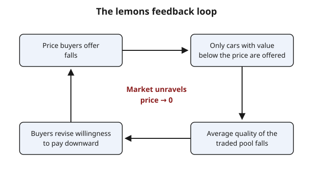

# Grad Microeconomics · Lesson 5.1: Adverse selection — the market for lemons

> ⏱ ~15 min · Module 5: Information economics · Builds on: [4.6 Uniqueness, stability, and their failure](04-06-uniqueness-stability-failure.md) · Unlocks: [5.2 Signaling](05-02-signaling.md)

## Why this matters

Every model in Module 4 quietly assumed everyone knows the same thing: prices, quality, endowments — all common knowledge. Drop that one assumption and the machinery breaks in a way no price adjustment can repair. The used-car seller knows whether her car is a gem or a lemon; you, the buyer, do not. Insurance companies face applicants who know their own health; lenders face borrowers who know their own risk. Akerlof's 1970 lemons paper showed that this *informational* gap can make an entire market with real gains from trade collapse to nothing. It is a failure of the First Welfare Theorem of a kind [4.4](04-04-two-welfare-theorems.md) never anticipated — not a missing market or an externality, but hidden knowledge about *who you are trading with*.

## The idea

Here is the whole mechanism in one breath. You can't see a car's quality, so the most you'll pay is what a *typical* offered car is worth to you. But sellers aren't offering a typical car — a seller only parts with hers if your price beats what the car is worth *to her*. So at any price, the cars actually on the lot are exactly the ones their owners value least: the worse-than-average ones. Once you realize the pool you're buying from is below average, you lower your offer. That drives the best of the remaining cars off the lot, the pool gets worse again, you lower your offer again — and the market spirals down.

The engine is **selection**: the price doesn't just set *how much* trades, it selects *which types* trade, and it always selects the bad ones in. "Adverse" because the selection works against the buyer. Crucially this is hidden information about a fixed *type* — the car already is what it is before anyone signs. That is what separates it from hidden *actions* (moral hazard, [5.4](05-04-moral-hazard-principal-agent.md)), where behavior changes after the contract.

## The formal version

Set up the cleanest version. Car quality $q$ is distributed uniformly on $[0,1]$. A seller of a quality-$q$ car values it at $q$ (her reservation value). A buyer values the same car at $(1+m)q$, where $m>0$ is the fractional gain from trade — buyers value every car strictly more, so trade is efficient at *every* quality. Buyers are risk-neutral and see only the price $p$, not $q$.

**Who offers at price $p$?** A seller sells iff $p \ge q$, i.e. iff $q \le p$. So the offered cars are those with $q\in[0,p]$.

$$\text{Offered set at price } p \;=\; \{\, q : q \le p \,\}.$$

**In words:** at any price, only the cars worth *less than the price* to their owners show up — the low end of the quality range.

**Average quality of the offered pool.** For $q$ uniform on $[0,p]$, the conditional mean is the midpoint:

$$\mathbb{E}[\,q \mid q \le p\,] \;=\; \frac{p}{2}.$$

**In words:** the typical car actually for sale is only half as good as the price would suggest — this conditional expectation of the *traded* pool (not the population) is the heart of the matter.

**Buyer's willingness to pay.** A risk-neutral buyer will pay up to her expected value of what she'll actually get:

$$\text{WTP}(p) \;=\; (1+m)\,\mathbb{E}[\,q \mid q \le p\,] \;=\; (1+m)\,\frac{p}{2}.$$

**Equilibrium condition.** A price $p>0$ can sustain trade only if buyers are willing to pay it, $\text{WTP}(p) \ge p$:

$$(1+m)\frac{p}{2} \ge p \;\;\Longleftrightarrow\;\; \frac{1+m}{2} \ge 1 \;\;\Longleftrightarrow\;\; m \ge 1.$$

**In words:** the price cancels out entirely — the market survives only if buyers value cars *at least twice* as much as sellers ($m\ge 1$). If $m<1$, the only price satisfying the condition is $p=0$: **total collapse**, even though gains from trade $mq>0$ exist at every single quality level. The gap $\tfrac{1+m}{2}<1$ means every candidate price is undercut by the pool it summons, and the only fixed point is zero.

## Picture

## Worked examples

**Example 1 (two types — find the collapse threshold).** Two kinds of car. A *good* one is worth 2,000 dollars to its seller and 2,400 dollars to a buyer; a *lemon* is worth 1,000 dollars to its seller and 1,200 dollars to a buyer. A fraction $\lambda$ of cars are good. Buyers can't tell them apart. When does a market with *both* types trading exist?

If buyers expect the full population mix, their willingness to pay is the expected value:

$$\text{WTP} = \lambda(2400) + (1-\lambda)(1200) = 1200 + 1200\lambda.$$

For a good-car owner to actually sell, the price must clear her reservation value: $p \ge 2000$. Competitive buyers bid the price up to their WTP, so both types trade iff

$$1200 + 1200\lambda \ge 2000 \;\;\Longleftrightarrow\;\; \lambda \ge \frac{800}{1200} = \frac{2}{3}.$$

So the threshold is $\lambda^{*}=\tfrac{2}{3}$. If $\lambda \ge \tfrac23$, all cars trade at $p = 1200+1200\lambda \ge 2000$. If $\lambda < \tfrac23$, the good owners refuse, the pool becomes lemons-only, and the price settles at $p=1200$ — the lemon's value. The 400 dollars of surplus on every good car is destroyed. Notice the *partial* unraveling: lemons still trade, so the market doesn't vanish — it just sheds its best participants.

**Example 2 (uniform version — the efficiency benchmark).** Take $m=\tfrac12$: buyers value every car 50% more than its owner does. The sustaining condition needs $m\ge1$, and $\tfrac12<1$, so the market collapses to $p=0$ and *nothing* trades.

Now measure the damage against the efficient outcome. Since $(1+m)q > q$ for every $q>0$, efficiency wants *every* car to trade, generating per-car surplus $mq$. Total efficient surplus:

$$W^{\text{eff}} = \int_0^1 m\,q \,dq = \frac{m}{2} = \frac{1}{4}\ \text{(per unit mass of cars).}$$

Realized surplus with asymmetric information: $0$. The entire $m/2$ is lost — not because trade was inefficient (it wasn't — every trade was mutually beneficial) but because buyers cannot *identify* the beneficial trades. This is the improper-integral surplus computation of `calc-refresher` [2.3](../../calc-refresher/lessons/02-03-improper-integrals-and-models.md) meeting a welfare theorem: the area exists, the market just can't collect it.

## Watch out

- **Hidden type, not hidden action.** Adverse selection is about a characteristic fixed *before* contracting — the car already is a lemon. Do not confuse it with moral hazard ([5.4](05-04-moral-hazard-principal-agent.md)), where the hidden thing is an *action taken after* the contract (a driver who, once insured, drives recklessly). Same word "asymmetric information," structurally different problem.
- **It's the pool's average, not the population's.** The buyer's WTP depends on $\mathbb{E}[q \mid q \le p]$, the conditional mean of what's *offered* — never the unconditional $\mathbb{E}[q]$. Plugging in the population average is the classic error; the whole failure is that the offered pool is a biased, self-selected sample.
- **Gains from trade do not guarantee trade.** Here $mq>0$ at every quality — trade is Pareto-improving car by car — and still the market can hit zero volume. Mutual benefit is necessary but nowhere near sufficient when types are hidden.
- **Collapse can be partial.** The uniform model with $m<1$ goes all the way to zero, but the two-type model stops at lemons-only. Unraveling removes the top of the quality range; how far it eats down depends on the distribution.

## One-liner

> When buyers can't see quality, price selects the sellers who value their goods least — so the traded pool is worse than average, buyers pay less, better goods flee, and a market with gains from trade at every quality can still unravel to nothing.

## Problems

**P1 (🟢)** In the uniform model, buyers value cars 80% more than sellers do ($m=0.8$). Does a market with positive trade exist? State the equilibrium price and justify it from the sustaining condition.

**P2 (🟡)** Two types again: a peach is worth 8,000 dollars to its seller and 10,000 to a buyer; a lemon is worth 3,000 to its seller and 4,000 to a buyer. Fraction $\lambda$ are peaches. Find the smallest $\lambda$ for which both types trade, and state what happens just below it.

**P3 (🔴, optional)** *Insurance version.* An insurer offers a policy at premium $p$. A person of risk type $r$ (expected claim cost) buys iff $p \le r$ (they insure when the premium is below their own expected cost). Risk $r$ is uniform on $[0,1]$; the insurer's cost of covering a buyer equals that buyer's $r$. 
(a) At premium $p$, who buys, and what is the insurer's average cost per policy sold? 
(b) Show the insurer's profit per policy is negative for every $p>0$, so no positive-premium market survives. Explain in one sentence why this is the same mechanism as the lemons market, with the roles of "high quality" and "low quality" swapped.

Solutions

**P1** The sustaining condition is $m \ge 1$; here $m=0.8<1$, so the market **collapses** and the only equilibrium is $p=0$ — no trade. Check directly: at any $p>0$ the offered pool has average quality $p/2$, so buyers will pay $(1.8)(p/2)=0.9p < p$. Every positive price is undercut by the pool it attracts, and the running-down has no fixed point except zero. (You'd need $m\ge1$ — buyers valuing cars at least double — for a positive-price market.)

**P2** Buyer WTP under full mixing: $\text{WTP} = \lambda(10000)+(1-\lambda)(4000) = 4000 + 6000\lambda$. Peaches are offered only if $p \ge 8000$. Both types trade iff

$$4000 + 6000\lambda \ge 8000 \iff 6000\lambda \ge 4000 \iff \lambda \ge \frac{2}{3}.$$

So $\lambda^{*}=\tfrac23$. Just below $\lambda=\tfrac23$, WTP falls short of 8,000, peach owners withdraw, and the market unravels to lemons-only at $p=4000$; the 2,000 dollars of surplus on each peach is destroyed even though that trade was mutually beneficial.

**P3** (a) A person buys iff $p \le r$, i.e. iff $r \ge p$. So buyers are the *high-risk* tail $r\in[p,1]$. Their average cost to the insurer is the conditional mean of a uniform on $[p,1]$:

$$\mathbb{E}[r \mid r \ge p] = \frac{p+1}{2}.$$

(b) Profit per policy $= p - \mathbb{E}[r\mid r\ge p] = p - \frac{p+1}{2} = \frac{2p - p - 1}{2} = \frac{p-1}{2}.$ For every $p<1$ this is negative, and at $p=1$ nobody strictly buys — so no premium yields nonnegative profit and the market has no positive-trade equilibrium. It's the same mechanism with the sign flipped: raising the premium doesn't scare off the *worst* customers, it scares off the *best* (lowest-risk) ones, so the surviving pool is always more expensive to cover than the price — adverse selection, now selecting high-cost buyers *in*.

## Flashback

**From Lesson 2.5 (Expected value and risk):** A gamble pays 100 dollars with probability $\tfrac14$, 40 dollars with probability $\tfrac12$, and 0 with probability $\tfrac14$. (a) Compute its expected payoff. (b) Now suppose you only receive the payoff *if it is below 60 dollars* (otherwise you get nothing). Compute the expected value of what you actually receive, and say in one line why this "conditional-on-the-bad-outcomes" expectation is the same statistical move that drives the lemons market.

Solution

(a) $\mathbb{E}[X] = \tfrac14(100) + \tfrac12(40) + \tfrac14(0) = 25 + 20 + 0 = 45$ dollars.

(b) The outcomes below 60 are 40 (prob $\tfrac12$) and 0 (prob $\tfrac14$); the 100 outcome is discarded. Conditioning on "payoff $< 60$" (total probability $\tfrac34$):

$$\mathbb{E}[X \mid X<60] = \frac{\tfrac12(40) + \tfrac14(0)}{\tfrac34} = \frac{20}{3/4} = \frac{80}{3} \approx 26.7 \text{ dollars}.$$

Restricting to the low outcomes drags the mean down from 45 to about 26.7 — exactly what the buyer suffers when the traded pool is the low-quality tail $\{q \le p\}$ rather than the full population. Adverse selection is a conditional expectation over a truncated, self-selected sample.

## Connections

- **Backward:** this is a First Welfare Theorem failure of a new species — [4.4](04-04-two-welfare-theorems.md) guaranteed efficiency under complete markets and symmetric information; drop the symmetry and competitive prices no longer coordinate the beneficial trades, echoing the equilibrium-existence troubles of [4.6](04-06-uniqueness-stability-failure.md). It leans on the expected-value machinery of [2.5](02-05-choice-under-uncertainty.md).
- **Forward:** the fixes each get a lesson — [5.2](05-02-signaling.md) has the *informed* side (sellers) burn resources to credibly reveal quality; [5.3](05-03-screening.md) has the *uninformed* side (buyers/insurers) design menus that make types sort themselves; [5.4](05-04-moral-hazard-principal-agent.md) contrasts hidden action. Warranties and reputation are informal signaling devices — a warranty is only affordable to offer on a good car.
- **Sideways (probability):** the load-bearing object is a conditional expectation over a truncated distribution, $\mathbb{E}[q\mid q\le p]$ — the same conditioning-on-a-subset move formalized in `probability-theory` and `prob-stat-refresher`. The used-car story is a stand-in: the identical logic runs insurance markets (healthy people opt out, premiums rise, the pool sickens), credit markets, and labor markets.
