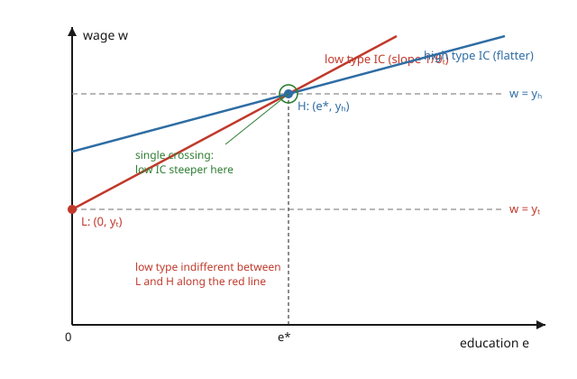

# Grad Microeconomics · Lesson 5.2: Signaling

> ⏱ ~15 min · Module 5: Information economics · Builds on: [5.1 Adverse selection: the market for lemons](05-01-adverse-selection-lemons.md) · Unlocks: [5.3 Screening](05-03-screening.md)

## Why this matters

Lesson 5.1 left the market for lemons collapsing: because buyers cannot tell good from bad, good sellers withdraw, and trade unravels toward nothing. But real markets do not vanish — good workers get hired, good borrowers get loans. Something rescues them. The rescue, when the *informed* party moves first, is a **signal**: a costly action the informed side takes precisely so the uninformed side can read its type off the action. Spence's canonical case is education. A worker knows her own ability; a firm does not. If the able worker can buy a diploma more cheaply (in effort, tuition, all-nighters) than the less able one, then holding the diploma becomes *credible evidence* of ability — even if the schooling taught her nothing at all. This lesson pins down exactly when a signal separates types, why the same logic breeds a swarm of equilibria, and the uncomfortable welfare verdict: the cure can be pure waste.

## The idea

Put yourself on the worker's side. You know you are the high-ability type, worth $y_H$ to any employer. The firm sees a pool of applicants and, unable to tell you apart, would offer everyone the *average* wage — a haircut you resent. You want to shout "I'm the good one!" but talk is free, so the firm ignores it. What you need is an action that is **cheap for you and expensive for the low type** — expensive enough that the low type won't copy it even to grab your high wage.

Education is exactly such an action *if* ability lowers its cost. Grinding through a hard degree costs the able worker some effort; it costs the less able worker *more* effort for the same diploma. So the able worker can pile on enough education that the less able worker, doing the arithmetic, decides the high wage isn't worth the slog and stays home with the low wage. Now education has become a **credible sound**: only the high type is willing to make it, so the firm reads "degree" as "high type" and pays $y_H$. The signal works not because it is costly, but because it is *differentially* costly — cheaper for the type it is meant to identify.

The engine, stated once and used forever, is **single crossing**: in the (education, wage) plane, the high type's indifference curves are *flatter* than the low type's. Flatter means "I'll trade a lot of extra education for a modest wage bump" — education is cheap to me. That slope gap is the entire reason a signal can pry the types apart.

## The formal version

**Setup.** A worker has ability (type) $\theta \in \{\theta_L, \theta_H\}$ with $\theta_L < \theta_H$, known to the worker, unknown to firms. Ability equals productivity, so a type-$\theta$ worker is worth $y_\theta$ to a competitive employer, with $y_L < y_H$. The worker chooses education $e \ge 0$ at cost $c(e,\theta)$, then firms observe $e$ (not $\theta$) and Bertrand-compete, paying a wage $w(e)$. Crucially, education is **unproductive**: it does not raise $y_\theta$. The worker's payoff is

$$u(e, w; \theta) = w - c(e,\theta).$$

**In words:** you like wage, dislike the effort of schooling, and your effort cost depends on your type.

**Single-crossing (Spence–Mirrlees).** In the $(e,w)$ plane, an indifference curve holds $w - c(e,\theta)$ constant, so its slope is

$$\left.\frac{dw}{de}\right|_{u\ \text{const}} = c_e(e,\theta), \qquad \text{and we require } \quad c_e(e,\theta_H) < c_e(e,\theta_L).$$

**In words:** the marginal cost of one more unit of education is lower for the high type, so the high type's indifference curves are flatter everywhere. This is the condition that makes separation possible — without it, no signal can distinguish the types.

**Perfect Bayesian equilibrium (PBE).** An equilibrium is a wage schedule $w(e)$, education choices $e_L, e_H$, and firms' beliefs $\mu(e) = \Pr(\theta_H \mid e)$ such that: (i) each type chooses $e$ to maximize $w(e) - c(e,\theta)$; (ii) beliefs are updated by Bayes' rule on the education levels actually chosen; (iii) competition drives $w(e) = \mu(e)\,y_H + (1-\mu(e))\,y_L$ (firms earn zero). See `grad-game-theory` for the general machinery — the subtlety is that Bayes' rule says *nothing* about $e$ values no one picks, so **off-path beliefs are free**, and different free choices support different equilibria.

**Separating equilibrium.** The types choose distinct levels $e_L \ne e_H$; firms infer type perfectly, so $w(e_L) = y_L$ and $w(e_H) = y_H$. Sustaining it needs two **incentive-compatibility (IC)** constraints:

$$\underbrace{y_L - c(e_L,\theta_L) \ \ge\ y_H - c(e_H,\theta_L)}_{\text{low type won't mimic high}}, \qquad \underbrace{y_H - c(e_H,\theta_H)\ \ge\ y_L - c(e_L,\theta_H)}_{\text{high type won't pool down}}.$$

**In words:** the low type must prefer its own (no-degree, low-wage) bundle to faking the high type's degree, and the high type must prefer buying the degree to being mistaken for low. Single crossing guarantees both can hold at once.

**Pooling equilibrium.** Both types choose the *same* $e$, so education reveals nothing; firms pay the population-average wage $\bar y = \lambda y_H + (1-\lambda)y_L$, where $\lambda = \Pr(\theta_H)$. Pooling survives only when off-path deviations are met with pessimistic beliefs (any unexpected $e$ is assumed to come from a low type). **In words:** everyone hides in the crowd, propped up by the threat that stepping out is read as bad news.

**Refinement.** These beliefs generate a continuum of equilibria (a whole interval of separating $e_H$, plus pooling). The **Intuitive Criterion** (Cho–Kreps) prunes them by asking, of any off-path $e$: could *only* the high type conceivably benefit from deviating there, no matter the wage? If so, firms should believe a deviator is high, and that logic destroys pooling and all but the **least-cost separating equilibrium** — the one where the high type buys the *smallest* education that still deters the low type. That is the standard prediction; details live in `grad-game-theory`.

## Picture

The low type sits at $L=(0, y_L)$. Its indifference curve through $L$ (red, steep) is the constraint: any bundle on or below it is one the low type won't envy. The high type's bundle $H=(e^*, y_H)$ is placed at the exact education where that red line hits $y_H$ — one notch more education and the low type strictly won't mimic. The blue high-type curve through $H$ is flatter (single crossing), so the high type happily prefers $H$ to $L$. That flatness gap is what lets the two bundles coexist.

## Worked examples

**Example 1 (least-cost separating equilibrium — computed).** Two types with productivities $y_L = 10$ and $y_H = 20$ (thousands of dollars per year). Education cost is $c(e,\theta) = e/\theta$ with $\theta_L = 1$, $\theta_H = 2$ — higher ability, lower marginal cost, so $c_e = 1/\theta$ satisfies single crossing ($1/2 < 1$). Find the least-cost separating equilibrium.

*Low type's bundle.* Education is costly and buys nothing on its own, so the low type, once revealed, chooses $e_L = 0$ and earns $w = y_L = 10$. Its payoff is $10 - 0 = 10$.

*Pin the high type's education from the low type's IC.* The high type must pick $e^*$ large enough that the low type won't imitate. If the low type mimics — buys $e^*$ and collects $y_H = 20$ — its payoff is $20 - e^*/\theta_L = 20 - e^*$. Non-mimicry requires

$$20 - e^* \ \le\ 10 \quad\Longrightarrow\quad e^* \ \ge\ 10.$$

The *least-cost* separating equilibrium takes the smallest such level, $e^* = 10$, where the low type is exactly indifferent (its IC binds).

*Check the high type is willing.* At $H = (10, 20)$ the high type earns $20 - 10/\theta_H = 20 - 5 = 15$. Deviating to $e = 0$ would mark it as low, paying $10 - 0 = 10 < 15$. So the high type strictly prefers to signal. Both IC constraints hold, and the pair $(e_L, e_H) = (0, 10)$ with wages $(10, 20)$ is the least-cost separating equilibrium.

**Example 2 (welfare — the signal is pure waste).** Keep Example 1's numbers and ask what separation cost society.

Because education adds nothing to productivity, the *first-best* (full-information) outcome has **both** types choosing $e = 0$: firms already know who is who, so no one wastes effort. Total output is the same $y_L$ and $y_H$ either way — education never moved it.

The signaling equilibrium reproduces those wages but forces the high type to burn

$$c(e^*, \theta_H) = \frac{10}{2} = 5$$

thousand dollars of education cost that produces *nothing*. That 5 is **deadweight signaling cost** — dissipated effort, not a transfer to anyone. Per high-ability worker, signaling is a 5-unit tax paid to the void.

Contrast with the lemons collapse of [5.1](05-01-adverse-selection-lemons.md): there, the good type was driven out and gains from trade *vanished*. Signaling does better — trade is restored, the able worker is correctly paid — but not for free. The disease was no trade; the cure is wasteful trade. Whether the cure beats the disease depends on how large the restored surplus is relative to the burned $5$ — and it is entirely possible for a society to end up *over-educated*, credential-signaling far past anything productivity would justify.

## Watch out

- **You might think** any costly action can serve as a signal — **but actually** the cost must be *differentially* costly. If education cost the same for both types ($c_e(e,\theta_H) = c_e(e,\theta_L)$), single crossing fails and no separation exists: whatever the high type buys, the low type profitably copies. Cost alone is not credibility; the *cost gap* is.
- **You might think** the equilibrium is unique — **but actually** off-path beliefs are unconstrained by Bayes' rule, so an entire interval of $e_H \in [10, 20]$ (and pooling) can be supported by suitably pessimistic beliefs. The multiplicity is real; a refinement like the Intuitive Criterion is what selects the least-cost separating outcome. Don't report "the" equilibrium without saying which selection you invoked.
- **You might think** signaling and screening are the same thing — **but actually** they differ by who moves first. Here the **informed** worker acts (chooses education) before the uninformed firm responds; in [5.3](05-03-screening.md) the **uninformed** party moves first, posting a menu of contracts to sift the types. Same single-crossing engine, mirror-image timing.
- **You might think** because education raises the worker's wage it must be socially valuable — **but actually** in the pure Spence model education is unproductive, so the private return is entirely a *sorting* return, not a productivity return. The wage gap between degree-holders is consistent with schooling that teaches nothing.

## One-liner

> A signal separates types only when it is cheaper for the type it certifies — single crossing is the whole engine, and the diploma can be worthless yet still worth buying.

## Problems

**P1 (🟢)** In Example 1, suppose the high type's ability rises to $\theta_H = 4$ (education even cheaper for it), with everything else unchanged. Does the least-cost separating education $e^*$ change? Compute the high type's equilibrium payoff and the deadweight signaling cost.

**P2 (🟡)** Now raise the low type's ability to $\theta_L = 2$ while keeping $\theta_H = 4$, $y_L = 10$, $y_H = 20$. Find the new least-cost separating $e^*$ from the low type's binding IC, and verify the high type still prefers to signal.

**P3 (🔴, optional)** A fraction $\lambda$ of workers are high type. Consider a *pooling* equilibrium at $e = 0$, where both types earn $\bar y = \lambda \cdot 20 + (1-\lambda)\cdot 10$ (Example 1 numbers, $\theta_L=1,\theta_H=2$). (a) For pooling to survive, off-path beliefs must make deviation unattractive; find the range of wages a high-type deviator to $e = 4$ would need to be offered for the deviation to tempt it, and explain how pessimistic beliefs ($w(4) = 10$) kill the temptation. (b) Sketch the Intuitive-Criterion objection: find an education level the *high* type would deviate to if believed high, but that the *low* type would refuse even at wage $20$, and argue this breaks the pool.

Solutions

**P1** The binding IC is the *low* type's, and the low type is unchanged ($\theta_L = 1$): mimicking gives $20 - e^*/1$, so non-mimicry still needs $20 - e^* \le 10$, i.e. $e^* = 10$. **The least-cost education is unchanged** — it is set by the type being deterred, not the type buying it. The high type's payoff, however, rises: $20 - e^*/\theta_H = 20 - 10/4 = 20 - 2.5 = 17.5$. Deadweight signaling cost falls to $c(10,4) = 10/4 = 2.5$. Cheaper education for the able type means the same separation is achieved with less waste borne by that worker.

**P2** With $\theta_L = 2$, the low type mimicking $e^*$ earns $20 - e^*/2$. Non-mimicry:

$$20 - \frac{e^*}{2} \le 10 \quad\Longrightarrow\quad \frac{e^*}{2} \ge 10 \quad\Longrightarrow\quad e^* \ge 20, \quad\text{so } e^* = 20.$$

A more able low type is *harder to deter* — it too finds education cheap — so the high type must buy twice as much. Check the high type ($\theta_H = 4$) is willing: at $H = (20, 20)$ its payoff is $20 - 20/4 = 20 - 5 = 15$; deviating to $e = 0$ and being paid $y_L = 10$ gives $10 < 15$. The high type still signals. (Note the ballooning waste: deadweight cost is now $20/4 = 5$, and it grows without bound as the two abilities converge — separation becomes ever more expensive as the types get harder to tell apart.)

**P3** (a) A high type deviating to $e = 4$ from the pool earns $w(4) - c(4,\theta_H) = w(4) - 4/2 = w(4) - 2$. Its pooling payoff is $\bar y - 0 = \bar y$. The deviation tempts it only if $w(4) - 2 \ge \bar y$, i.e. $w(4) \ge \bar y + 2$. With pessimistic off-path beliefs $\mu(4) = 0$, competition sets $w(4) = 10$. Then the deviation pays $10 - 2 = 8 \le \bar y$ (since $\bar y \ge 10 > 8$), so no type deviates — pooling holds. The pool is propped up entirely by the threat "any degree is read as low-type."

(b) The Intuitive Criterion asks whether those pessimistic beliefs are *reasonable*. Consider a deviation to $e = 11$. Even offered the highest possible wage $20$, the **low** type would earn $20 - 11/\theta_L = 20 - 11 = 9 < \bar y$ (for $\bar y \ge 10$), so the low type would *never* choose $e = 11$ under any belief — the deviation is "equilibrium-dominated" for it. The **high** type, offered $20$, would earn $20 - 11/2 = 14.5$, which beats $\bar y$ whenever $\bar y < 14.5$ (e.g. $\lambda < 0.45$). Since only the high type could rationally deviate there, firms *should* believe a deviator is high and pay $20$ — making the deviation profitable and **breaking the pool**. This is why the refinement discards pooling and selects the least-cost separating equilibrium.

## Flashback

**From Lesson 5.1 (Adverse selection: the market for lemons):** A used car's quality $q$ is uniform on $[0,1]$, known only to the seller, whose reservation value is $q$. A buyer values a car of quality $q$ at $\beta q$ for some constant $\beta > 0$. At price $p$, exactly the sellers with $q \le p$ are willing to sell. (a) Find the average quality of cars offered at price $p$, and the buyer's expected value of a purchase. (b) Show that for $\beta = 1.4$ the market unravels to no trade, and find the threshold value of $\beta$ above which trade at some positive price survives.

Solution

(a) Sellers with $q \le p$ offer, and since $q$ is uniform on $[0,1]$, the offered cars are uniform on $[0,p]$, so average offered quality is

$$E[q \mid q \le p] = \frac{p}{2}.$$

The buyer's expected value of a random offered car is $\beta \cdot \frac{p}{2} = \frac{\beta p}{2}$.

(b) A buyer pays $p$ only if expected value covers the price: $\frac{\beta p}{2} \ge p$, i.e. $\frac{\beta}{2} \ge 1$, i.e. $\beta \ge 2$ — independent of $p$. For $\beta = 1.4 < 2$: $\frac{1.4 p}{2} = 0.7p < p$ for every $p > 0$, so the buyer never buys at a positive price; the only equilibrium is $p = 0$, no trade. The market fully unravels. The threshold is $\boxed{\beta = 2}$: buyers must value quality at least *twice* the seller's own valuation for adverse selection not to kill the market. This is the same self-selection logic behind signaling — who is willing to transact at a given price reveals their hidden type — only here no signal is available to break it.

## Connections

- **Backward:** this is the answer to the problem [5.1](05-01-adverse-selection-lemons.md) posed. Adverse selection destroyed trade because types were pooled; signaling restores it by giving the informed party a credible way to separate — at the cost of the wasteful education the flashback's frictionless market never needed.
- **Forward:** [5.3](05-03-screening.md) flips the timing. There the *uninformed* party moves first, offering a menu of (education-or-quantity, wage-or-price) contracts and letting each type self-select — the mirror image of signaling, run on the identical single-crossing engine.
- **Sideways (game theory):** the whole apparatus — perfect Bayesian equilibrium, off-path beliefs, the Intuitive Criterion, and the general theory of **signaling games** — belongs to `grad-game-theory` (with a lighter treatment in `game-theory-refresher`). This lesson is that theory's flagship economic application; the belief-refinement bridge is worth naming explicitly.
- **Sideways (labor and education economics):** the Spence model is the origin of the "sheepskin effect" debate — do degrees pay because they *build* human capital or merely *signal* pre-existing ability? The pure signaling model is the null hypothesis that schooling is productivity-neutral, and empirical labor economics has spent decades measuring how far reality departs from it.
