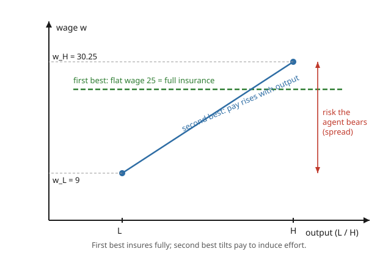

# Grad Microeconomics · Lesson 5.4: Moral hazard and the principal–agent problem

> ⏱ ~15 min · Module 5: Information economics · Builds on: [5.3 Screening](05-03-screening.md) · Unlocks: [5.5 Mechanism design in markets](05-05-mechanism-design-markets.md)

## Why this matters

You hire a manager, a contractor, a fund; you cannot watch them work, only the result. They can coast and blame bad luck. This is **moral hazard** — hidden *action* — and it is the reason almost no real contract pays a flat salary and stops there: bonuses, equity, commissions, deductibles, and co-pays all exist to make someone with private control over an outcome *want* to do the right thing. The tension is exact and unavoidable: the cheapest way to make a risk-averse agent happy is to insure her (pay her a flat wage), but a flat wage gives her no reason to exert costly effort. You cannot have both. Every incentive scheme you've ever seen is a chosen point on that tradeoff — and this lesson shows you how to solve for the optimal one. It is Boss Problem 5, and it is the beating heart of contract theory, executive pay, and insurance design.

## The idea

Keep the two informational problems of this module straight, because they are opposites:

- **Adverse selection** ([5.1](05-01-adverse-selection-lemons.md), [5.3](05-03-screening.md)): hidden *type*, known *before* contracting. The agent is born high- or low-cost and you don't know which. You screen or signal.
- **Moral hazard** (here): hidden *action*, chosen *after* contracting. The agent is identical to everyone else until she decides how hard to work — and that choice you cannot see.

Here is the whole story in one breath. A **principal** (risk-neutral — think of a diversified firm or investor who cares only about expected dollars) hires an **agent** to take an action (effort) that she cannot observe. Effort is costly to the agent but makes good output *more likely* — it shifts the odds, it doesn't guarantee anything. The principal can only pay based on what she *can* see: the **output**. So she designs a wage schedule $w(\text{output})$, and the agent, staring at that schedule, privately picks the effort that's best *for her*.

If the principal could see effort, life is easy: she orders "work hard," pays a flat wage, and because she's risk-neutral and the agent is risk-averse, **she should absorb all the risk herself** — full insurance is efficient risk-sharing. That's the **first best**.

But she can't see effort. If she pays a flat wage, the agent pockets it and shirks — nothing in the contract rewards working. So to get effort she must **pay more after good outcomes than bad ones**. That tilts the wage with output — and now the agent's income is *random*, which a risk-averse person dislikes and must be compensated for. The principal is forced to hand the agent a **risk premium** she'd rather not pay, purely to buy incentives. That extra cost is the price of hidden action. This is the **second best**, and it is strictly worse than the first.

## The formal version

**The environment.** The agent chooses effort $a$ from a set (we'll use two levels, high $a_H$ and low $a_L$). Effort has cost $c(a)$ in *utility* terms, with $c(a_H) > c(a_L)$. Output $q$ is random and depends on effort only through probabilities: let $p(a)$ be the probability of the good outcome under effort $a$, with $p(a_H) > p(a_L)$ — high effort makes success more likely. The agent has a **von Neumann–Morgenstern** utility (from [2.5](02-05-choice-under-uncertainty.md))
$$U = u(w) - c(a),\qquad u \text{ increasing and concave (risk averse)},$$
so wage and effort enter separably. The principal is **risk-neutral**: she maximizes expected $\big(q - w\big)$. The agent has a **reservation utility** $\bar u$ — her best outside option.

**First best (effort observable / contractible).** The principal chooses a wage schedule *and* dictates effort. Since she's risk-neutral and the agent risk-averse, optimal risk-sharing puts *all* risk on her: pay a **flat wage** $w^{FB}$, independent of output, just large enough to keep the agent:
$$u(w^{FB}) - c(a) = \bar u \quad\Longrightarrow\quad w^{FB} = u^{-1}\big(\bar u + c(a)\big).$$
*In words:* fully insure the agent (constant wage), and set that wage to the **certainty equivalent** that exactly covers her effort cost and outside option — no more. The flat wage $w^{FB}$ is the cash value of "$\bar u + c(a)$ utils." The principal then picks whichever effort maximizes her expected output minus this wage.

**Second best (effort hidden).** Now the contract can only condition on output. To implement high effort $a_H$, the principal solves
$$
\min_{w(\cdot)} \ \mathbb{E}\big[w(q)\mid a_H\big] \quad\text{subject to}
$$

- **(IR) Participation / individual rationality:** $\ \mathbb{E}\big[u(w(q))\mid a_H\big] - c(a_H) \ \ge\ \bar u.$
  *In words:* given that she'll choose high effort, the agent must still prefer the job to her outside option.
- **(IC) Incentive compatibility:** $\ \mathbb{E}\big[u(w(q))\mid a_H\big] - c(a_H)\ \ge\ \mathbb{E}\big[u(w(q))\mid a_L\big] - c(a_L).$
  *In words:* facing *this* wage schedule, the agent's own best choice is exactly the high effort the principal wants — she must *want* to work hard, since no one can make her.

These are the same two constraints as screening ([5.3](05-03-screening.md)), repurposed: IR keeps her in, IC pins her *action*. The key structural fact: to satisfy IC with $p(a_H) > p(a_L)$, the wage after the good outcome must exceed the wage after the bad one — **the schedule must slope up in output**, which loads risk onto a risk-averse agent. That is the **risk–incentive tradeoff**: insurance wants a flat wage, incentives want a steep one, and the optimum trades them off. Typically **IC binds** (you provide exactly enough incentive and not a drop more), and **IR binds** (you extract all surplus down to $\bar u$).

**Informativeness / sufficient-statistic principle (brief).** Base pay on any signal that is informative about effort, and *only* on the information it carries about effort: a signal already summarized by output ("sufficient statistic") adds nothing, while an independent noisy report on effort belongs in the contract even if it doesn't affect output. (The clean derivation via the agent's first-order condition — the "first-order approach" — is valid only when the agent's problem is well-behaved; monotone-likelihood-ratio conditions are the usual guardrail. We'll take the two-action model, where IC is a single inequality and no such caveat bites.)

## Picture

Read it as the tradeoff made visible. The flat green line is **first best**: one wage for every output, all risk on the principal. The blue upward line is **second best**: pay $w_L$ after failure, a higher $w_H$ after success. The red spread $w_H - w_L$ is the *risk the agent must swallow* to make high effort her own best choice — and because she's risk-averse, the principal has to over-pay in expectation (a risk premium) to keep her participating. Flat is cheap but toothless; sloped has teeth but costs a premium.

## Worked examples

**Example 1 (Boss Problem 5 — the full two-effort, two-outcome solve).**

An agent has $u(w) = \sqrt{w}$ and reservation utility $\bar u = 4$. High effort costs $c(a_H) = 1$ util; low effort costs $c(a_L) = 0$. Output is either a **success** worth 100 to the principal or a **failure** worth 0. Probabilities of success:
$$p(a_H) = 0.8,\qquad p(a_L) = 0.4.$$
The principal is risk-neutral and wants to implement high effort. Solve the first best, then the second best, and find the cost of hidden action.

*First best (effort observable).* Fully insure: flat wage $w^{FB}$ solving $u(w^{FB}) - c(a_H) = \bar u$:
$$\sqrt{w^{FB}} - 1 = 4 \ \Rightarrow\ \sqrt{w^{FB}} = 5 \ \Rightarrow\ w^{FB} = 25.$$
Expected profit under high effort: $\ 0.8(100) + 0.2(0) - 25 = 55$. (Check that high effort is what she wants: mandating low effort would need $\sqrt{w}=4$, i.e. $w=16$, for a profit of $0.4(100)-16 = 24 < 55$. High effort it is.)

*Second best (effort hidden).* Let $w_H, w_L$ be the wages after success and failure. Write $a=\sqrt{w_H}$, $b=\sqrt{w_L}$ to linearize. Impose both constraints as equalities (both bind at the optimum):

IR: $\ 0.8\,a + 0.2\,b - 1 = 4 \ \Rightarrow\ 0.8a + 0.2b = 5.$

IC: high effort beats low effort,
$$0.8a + 0.2b - 1 \ \ge\ 0.4a + 0.6b - 0 \ \Rightarrow\ 0.4a - 0.4b \ge 1 \ \Rightarrow\ a - b \ge 2.5,$$
binding: $\ a - b = 2.5.$

Solve. Substitute $a = b + 2.5$ into the IR equality: $0.8(b+2.5) + 0.2b = 5 \Rightarrow b + 2 = 5 \Rightarrow b = 3$, so $a = 5.5$. Therefore
$$w_L = b^2 = 9,\qquad w_H = a^2 = 30.25.$$
Pay **more after success** ($30.25 > 9$), as promised. Verify IC directly: high effort gives $0.8(5.5)+0.2(3)-1 = 4$; low effort gives $0.4(5.5)+0.6(3) = 4$ — exactly equal, so IC binds and the agent (weakly) picks high. IR: $0.8(5.5)+0.2(3)-1 = 4 = \bar u$. ✓

*Cost of hidden action.* Expected wage bill under the second-best contract:
$$\mathbb{E}[w \mid a_H] = 0.8(30.25) + 0.2(9) = 24.2 + 1.8 = 26.$$
First best paid a flat 25. So hidden action costs the principal
$$26 - 25 = 1 \text{ dollar (the agency cost).}$$
This is precisely a **risk premium**. The agent's wage lottery — $30.25$ w.p. $0.8$, $9$ w.p. $0.2$ — delivers expected utility $0.8(5.5)+0.2(3) = 5$, whose certainty equivalent is $5^2 = 25$: the *same* value as the flat first-best wage. The principal pays an expected $26$ for something the agent values at $25$; the missing dollar is burned providing incentives, exactly $\mathbb{E}[w] - \mathrm{CE}$. Second-best profit: $80 - 26 = 54 < 55$. The whole gap is the price of not being able to watch.

**Example 2 (dial risk aversion to zero — "sell the firm to the agent").**

Now suppose the agent is **risk-neutral**: $u(w) = w$. Does hidden action still cost anything? No — and the reason is illuminating. When the agent doesn't mind risk, the principal can dump *all* of it on her at no premium by making her the **residual claimant**: let the agent keep the output and pay the principal a fixed fee $F$ ("sell her the firm").

With output 100/0, $p(a_H)=0.8$, $p(a_L)=0.4$, $c(a_H)=1$, $\bar u = 4$, the agent now solves her own problem. Keeping output, her payoff under high effort is $0.8(100) - F - 1 = 79 - F$; under low effort $0.4(100) - F = 40 - F$. High effort wins **on its own** ($79 > 40$) because she now bears the full marginal consequence of slacking — IC is automatic. Participation: $79 - F \ge 4 \Rightarrow F \le 75$. Set $F = 75$; the principal collects 75.

Compare to first best with a risk-neutral agent: flat wage $w$ with $w - 1 \ge 4 \Rightarrow w = 5$, profit $80 - 5 = 75$. **Identical.** With a risk-neutral agent the second best *equals* the first best — hidden action is free. The entire agency cost we found in Example 1 (that 1 dollar) came from the agent's **concavity**: the more risk-averse she is, the fatter the risk premium the principal must pay to run any given wage spread, so incentives get strictly more expensive as $-u''/u'$ rises. Risk aversion is the whole source of the friction.

## Watch out

- **You might think** moral hazard and adverse selection are the same "asymmetric information" problem, **but actually** they are mirror images: adverse selection is hidden *type* known *before* the contract (you don't know *who* you hired — [5.1](05-01-adverse-selection-lemons.md)); moral hazard is hidden *action* chosen *after* (you don't know *what they did*). Screening/signaling fight the first; incentive schemes fight the second. Confusing them is the module's classic error.
- **You might think** a risk-neutral agent still needs incentive pay, **but actually** you just make her the residual claimant and the problem vanishes — first best is attainable. All agency cost here is a *risk premium*; with no risk aversion there is no premium and no tradeoff. (Real contracts still use incentives because agents *are* risk-averse and often wealth-constrained.)
- **You might think** the IR constraint is what forces the wage spread, **but actually** it's **IC**. IR just sets the *level* (extract surplus down to $\bar u$); IC sets the *slope* (pay must rise enough with output that high effort beats low). Drop IC and the optimal contract is instantly flat — full insurance. The spread exists only to satisfy incentive compatibility.
- **You might think** you should pay on output alone, **but actually** the informativeness principle says condition on *any* signal that carries information about effort — a supervisor's report, peer performance, an audit — even one that doesn't affect output, because it lets you provide the same incentive with less wage risk. A signal that's a sufficient statistic for output, though, earns no place in the contract.

## One-liner

> With hidden action you cannot both insure a risk-averse agent and motivate her; the optimal contract slopes pay up with output just enough to make high effort incentive-compatible (IC binds), and the extra expected wage over the flat first-best is exactly the risk premium you pay for incentives.

## Problems

**P1 (🟢)** An agent with $u(w)=\sqrt{w}$, reservation utility $\bar u = 2$, faces high-effort cost $c(a_H) = 1$. Effort is **observable**. Find the first-best (flat) wage, and state in one sentence why it doesn't depend on output.

**P2 (🟡)** Same agent as P1 ($u=\sqrt{w}$, $\bar u = 2$, $c(a_H)=1$, $c(a_L)=0$), but effort is now **hidden**. Success occurs with probability $p(a_H)=0.75$ under high effort and $p(a_L)=0.25$ under low effort. Solve the binding IR and IC constraints for $w_H$ and $w_L$, then compute the expected wage bill and the agency cost (the excess over first best). Confirm the excess equals the risk premium of the agent's wage lottery.

**P3 (🔴, optional)** A **risk-neutral** agent, $u(w)=w$, has $\bar u = 2$, $c(a_H)=1$, $c(a_L)=0$. Output is 200 (success) or 0, with $p(a_H)=0.6$, $p(a_L)=0.2$. Design a "sell-the-firm" contract (agent keeps output, pays fixed fee $F$) that implements high effort, find the largest $F$ the principal can charge, and show the principal earns the same profit as under observable effort — i.e. hidden action costs nothing here.

Solutions

**P1** Full insurance: set $u(w^{FB}) - c(a_H) = \bar u$, i.e. $\sqrt{w^{FB}} - 1 = 2 \Rightarrow \sqrt{w^{FB}} = 3 \Rightarrow w^{FB} = 9$. It's flat because the principal is risk-neutral and the agent risk-averse, so efficient risk-sharing puts *all* output risk on the principal; with effort contractible there's no reason to expose the agent to any variation. The wage is the certainty equivalent of "$\bar u + c(a_H) = 3$ utils."

**P2** Let $a=\sqrt{w_H}$, $b=\sqrt{w_L}$.

IR (binding): $0.75a + 0.25b - 1 = 2 \Rightarrow 0.75a + 0.25b = 3.$

IC (binding): $0.75a + 0.25b - 1 = 0.25a + 0.75b - 0 \Rightarrow 0.5a - 0.5b = 1 \Rightarrow a - b = 2.$

Substitute $a = b+2$: $0.75(b+2) + 0.25b = 3 \Rightarrow b + 1.5 = 3 \Rightarrow b = 1.5,\ a = 3.5.$ So
$$w_L = 1.5^2 = 2.25,\qquad w_H = 3.5^2 = 12.25.$$
Expected wage bill: $0.75(12.25) + 0.25(2.25) = 9.1875 + 0.5625 = 9.75.$ First-best wage (P1) $= 9$, so the **agency cost is $9.75 - 9 = 0.75$ dollars.** Risk-premium check: the wage lottery gives expected utility $0.75(3.5)+0.25(1.5) = 3$, certainty equivalent $3^2 = 9$; expected wage $9.75$ minus CE $9$ equals $0.75$ — the risk premium, exactly the agency cost. ✓

**P3** With the agent keeping output and paying $F$, her payoff is $0.6(200) - F - 1 = 119 - F$ under high effort and $0.2(200) - F = 40 - F$ under low. High effort dominates ($119 > 40$) with no incentive scheme needed — she's the residual claimant, so IC holds automatically. Participation: $119 - F \ge 2 \Rightarrow F \le 117$. Largest fee: $F = 117$, giving the principal profit 117.

Observable-effort benchmark (risk-neutral agent, flat wage): $w - 1 \ge 2 \Rightarrow w = 3$, profit $0.6(200) - 3 = 117$. Same 117 — hidden action costs nothing, because a risk-neutral agent bears risk at zero premium. The only thing that made incentives expensive in Examples 1–2 was risk aversion.

## Flashback

**From Lesson 2.5 (Choice under uncertainty):** A worker with $u(w) = \sqrt{w}$ faces a 50/50 wage lottery paying 400 or 100. Find the certainty equivalent and the risk premium — and say in one line what this quantity *is* in the language of this lesson.

Solution

Expected utility: $\mathbb{E}[u] = \tfrac12\sqrt{400} + \tfrac12\sqrt{100} = \tfrac12(20) + \tfrac12(10) = 15.$ Certainty equivalent: $\sqrt{\mathrm{CE}} = 15 \Rightarrow \mathrm{CE} = 225.$ Expected wage: $\tfrac12(400)+\tfrac12(100) = 250.$ Risk premium: $\pi = 250 - 225 = 25$ dollars.

In this lesson's terms: $\pi$ is what a principal *overpays in expectation* to impose that much wage spread on this agent. A flat wage of 225 would make her exactly as happy as the risky package costing 250 on average — so the 25 is dead-weight, spent only to buy incentives. Every agency cost in the lesson is a risk premium of this form.

## Connections

- **Backward:** the machinery is [2.5](02-05-choice-under-uncertainty.md)'s expected utility, certainty equivalent, and risk premium, now weaponized — the first-best wage *is* a certainty equivalent, and the agency cost *is* $\mathbb{E}[w]-\mathrm{CE}$. The IR/IC constraint pair is lifted straight from screening ([5.3](05-03-screening.md)); only the hidden object changed, from *type* to *action*.
- **Forward:** [5.5](05-05-mechanism-design-markets.md) generalizes IR + IC into the theory of mechanism design — the revelation principle treats "which action/type to induce" as a design problem, and moral hazard is the hidden-action instance.
- **Sideways (game theory):** this is contract theory / hidden-action games — `grad-game-theory` studies the same principal–agent interaction as a game of imperfect information, where IC is a best-response condition. The optimal contract is the principal's Stackelberg move.
- **Sideways (applications):** it *is* insurance with a deductible (co-pays force the insured to internalize care — a slope on an otherwise flat indemnity) and *is* executive compensation (equity and options tilt CEO pay to firm value); both trade insurance against incentives exactly as here.
- **Sideways (probability):** the effort choice is a choice *between distributions* of output, and IC compares expected payoffs under two different distributions — the likelihood-ratio structure behind the informativeness principle is pure `probability-theory`.
