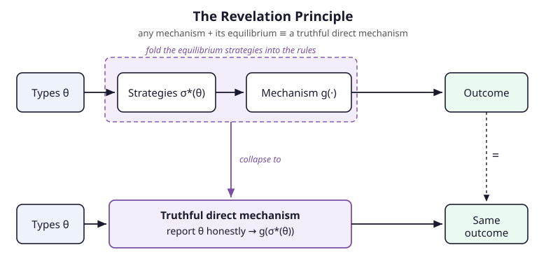

# Grad Microeconomics · Lesson 5.5: Mechanism design in markets

> ⏱ ~15 min · Module 5: Information economics · Builds on: [5.4 Moral hazard and the principal–agent problem](05-04-moral-hazard-principal-agent.md) · Unlocks: [6.1 Monopoly and price discrimination](06-01-monopoly-price-discrimination.md)

## Why this matters

Screening (5.3) and the principal–agent problem (5.4) were both special cases of one question: *how do you get an outcome that depends on information people won't just hand you?* An auctioneer wants to sell to whoever values the object most — but every bidder has a reason to understate. A government wants to build a bridge exactly when total willingness-to-pay exceeds cost — but everyone free-rides. Mechanism design is the general theory: you don't observe types, so you design the **rules of a game** whose equilibrium delivers the outcome you want. This is the capstone of the information module and the engineering discipline behind auctions, regulation, and public-goods provision — and its central result, the revelation principle, is what makes the whole enterprise tractable.

## The idea

You're the *designer*. There are agents, each holding a private **type** $\theta_i$ (a value, a cost, a productivity) that you can't see. You want to choose an outcome — who gets the object, who pays what — as a function of those types. But you can only ask; you can't verify. So you write down a game: a set of messages each agent may send, and a rule that maps the profile of messages to an outcome. Agents play the game to their own advantage. Your problem is to pick messages-and-rule so that the *equilibrium* of the game they play produces the outcome *you* wanted from the true types.

That sounds like an impossibly large search — mechanisms can be baroque (sealed bids, ascending clocks, multi-round menus, arbitrary message spaces). The **revelation principle** is the liberating shortcut: whatever any clever mechanism achieves in equilibrium, a *dead-simple* mechanism achieves too — one where you just ask each agent to report their type, and honest reporting is itself an equilibrium. Why? Because you can take the equilibrium strategies agents *would* have played in the fancy mechanism and bolt them onto the rules — let the mechanism "play the game on their behalf." An agent who would have shaded their bid in the fancy auction now just tells the truth to a machine that shades on their behalf. Same outcome, but now truth-telling is optimal by construction. So you never need to search over all mechanisms; you can search over **truthful direct mechanisms** only.

## The formal version

**Environment.** Agents $i = 1,\dots,n$; agent $i$ has private type $\theta_i \in \Theta_i$, drawn from a commonly known prior. A **social choice function** $f$ maps the type profile $\theta = (\theta_1,\dots,\theta_n)$ to an outcome $f(\theta)$ (e.g., an allocation plus transfers). The designer wants to *implement* $f$.

**Mechanism.** A mechanism is a pair $(M, g)$: a message space $M = M_1 \times \cdots \times M_n$ and an outcome rule $g : M \to \text{outcomes}$. Given the mechanism, agents play a Bayesian game, choosing strategies $\sigma_i : \Theta_i \to M_i$.

> In words: the mechanism is the rulebook; the strategy is how each type decides to play under those rules.

**Direct mechanism.** A mechanism is *direct* if $M_i = \Theta_i$ — the only message you may send is a report of your own type. It is **incentive compatible** (IC) if truthful reporting, $\sigma_i(\theta_i) = \theta_i$, is an equilibrium. Two strengths:

- **Dominant-strategy IC (DSIC):** truth is optimal *no matter what others report*.
- **Bayesian IC (BIC):** truth is optimal *in expectation*, given others report truthfully and the type prior.

> In words: DSIC never asks you to guess what rivals will do; BIC only holds truth up as best on average. DSIC is the stronger, more robust demand.

**Individual rationality (IR / participation).** Each type must weakly prefer joining the mechanism to its outside option: expected utility $\ge \bar u_i(\theta_i)$.

> In words: nobody can be forced in — the deal must beat walking away.

**Revelation principle.** *Any social choice function implementable by some mechanism $(M,g)$ in (dominant-strategy / Bayesian) equilibrium is implementable by an incentive-compatible direct mechanism, with the same equilibrium outcome.*

> In words: to know what's achievable, you only ever need to check truthful direct mechanisms — the constraints IC and IR are the entire feasible set. **Implementation** = choosing an outcome-plus-transfer rule so the target $f$ satisfies IC and IR.

**Two canonical results (stated light).**

- **VCG / pivotal mechanism (efficiency).** To implement the *efficient* allocation in dominant strategies, charge each agent the **externality** they impose — the loss their presence forces on everyone else. Truthful reporting is then a dominant strategy for every agent, and the allocation maximizes total surplus. The **second-price (Vickrey) auction** is the one-object instance (Example 1).
- **Revenue equivalence (Myerson).** Among auctions that (i) always award the object to the highest-value bidder and (ii) give a zero-value bidder zero expected payoff, *expected revenue is identical* — it depends only on the allocation rule and the rents left to bidders, not on the payment format. First-price and second-price auctions raise the same expected revenue (Example 2). Revenue *maximization* (Myerson's optimal auction) is a different objective from efficiency — it deliberately distorts, e.g. by setting a reserve price.

**Gibbard–Satterthwaite (the negative result, no transfers).** Strip away money. With three or more outcomes and unrestricted preferences, the *only* social choice functions that are DSIC and onto are **dictatorships**. Transfers are what rescue mechanism design; without them, truthful non-dictatorial implementation is essentially impossible. (This is the engine behind Arrow's theorem — the forward link to 6.5.)

## Picture

The top path is a general mechanism: types generate equilibrium strategies $\sigma^*(\theta)$, which feed the rule $g$, which produces an outcome. The revelation principle absorbs the dashed box — strategies *and* rule together — into a single direct mechanism (bottom) that takes honest type reports and returns the identical outcome. Truth-telling is optimal because the machine now does whatever shading the agent used to do.

## Worked examples

**Example 1 (the clean DSIC instance — the second-price auction).** One object, bidders $i$ with private values $v_i$. Each submits a sealed bid $b_i$; the highest bidder wins and pays the **second-highest** bid. Claim: bidding your true value, $b_i = v_i$, is a *weakly dominant strategy*.

Fix everyone else's bids and let $p = \max_{j \ne i} b_j$ be the highest competing bid — this is what $i$ would pay if they win, and it's outside $i$'s control. Bidder $i$ wins iff their bid exceeds $p$, earning $v_i - p$; otherwise they earn $0$. Compare truthful $b_i = v_i$ against any deviation:

- **Overbid** ($b_i > v_i$): this only changes the outcome when $v_i \le p < b_i$ — the overbid *wins* a round truth would have lost or tied. But then $i$ pays $p \ge v_i$, netting $v_i - p \le 0$. Winning here is worse than the $0$ from losing. Never helps.
- **Underbid** ($b_i < v_i$): this only changes the outcome when $b_i < p \le v_i$ — the underbid *loses* a round truth would have won. That forgoes $v_i - p \ge 0$. Never helps.

In every case truthful bidding does at least as well as the deviation, whatever others do — the definition of weak dominance. The price you pay never depends on your own bid (only on whether you win), so there's no gain from shading. The winner is the highest-value bidder ⇒ **efficient**, and truth is dominant ⇒ **DSIC**.

*Numbers.* Three bidders value the object at $v_1 = 10$, $v_2 = 7$, $v_3 = 4$. All bid truthfully. Bidder 1 wins and pays the second-highest bid, $7$, for a surplus of $10 - 7 = 3$. Notice the winner's *payment* $7$ is exactly the surplus the others lose by 1's presence: without bidder 1, bidder 2 would have won and enjoyed the object worth $7$ to them. The Vickrey price *is* the VCG externality charge.

**Example 2 (revenue equivalence — first vs. second price).** Two bidders, values drawn independently from the uniform distribution on $[0,1]$. Compute each format's expected payment from a bidder whose value is $v$.

*Second-price.* Bid truthfully (Example 1). A bidder with value $v$ wins iff the other's value is below $v$ — probability $v$. Conditional on winning, the other value is uniform on $[0,v]$, so the expected price paid is $v/2$. Expected payment given $v$:
$$m_{\text{2nd}}(v) = \underbrace{v}_{\Pr(\text{win})} \cdot \underbrace{\tfrac{v}{2}}_{\text{E[price}\,|\,\text{win]}} = \frac{v^2}{2}.$$

*First-price.* Winner pays their own bid, so bidders shade. With $n=2$ uniform bidders the symmetric equilibrium bid is $b(v) = v/2$ (each bids half their value). A value-$v$ bidder wins with probability $v$ (still needs the highest value) and then pays their bid $v/2$:
$$m_{\text{1st}}(v) = \underbrace{v}_{\Pr(\text{win})} \cdot \underbrace{\tfrac{v}{2}}_{\text{bid}} = \frac{v^2}{2}.$$

Identical, value by value — so certainly identical in expectation. Integrating over the prior gives each format the same expected revenue:
$$\text{E[revenue]} = 2 \int_0^1 \frac{v^2}{2}\,dv = 2 \cdot \frac{1}{6} = \frac{1}{3}.$$

The formats *look* nothing alike — one hides the price you pay behind rivals' bids, the other makes you name it — yet they raise the same money. That's revenue equivalence: with the same allocation rule (highest value wins) and the same rents (a zero-value bidder pays nothing), the payment mechanics wash out. (The `probability-theory` expected-value machinery is doing all the work in that integral.)

## Watch out

- **You might think** the revelation principle says real auctions *are* direct-report machines. **Actually** it's a statement about what's *achievable*: for any outcome, *some* truthful direct mechanism reaches it. Real markets use indirect formats (ascending clocks, sealed bids) for robustness, simplicity, or because direct reporting demands the designer know the prior — the principle is a proof tool, not a design prescription.
- **You might think** IC is one condition. **Actually** DSIC (truth optimal against *any* rival play) is strictly stronger than BIC (truth optimal *on average*). VCG delivers the strong kind; many Bayesian-optimal mechanisms only deliver BIC. Always know which you've got.
- **You might think** efficiency and revenue maximization are the same goal. **Actually** they diverge: VCG maximizes total surplus (Vickrey, no reserve); Myerson's revenue-optimal auction *distorts* — it sets a reserve price and sometimes withholds the object — trading efficiency for revenue.
- **You might think** VCG is a free lunch. **Actually** it can run a **budget deficit** (the pivotal charges needn't cover costs in public-goods settings), and it's vulnerable to **collusion** — a coalition can jointly misreport to lower everyone's externality payments. Dominant strategy protects individuals, not cartels.
- **You might think** you can always find a truthful non-dictatorial rule. **Actually** without transfers, **Gibbard–Satterthwaite** says no — money is the ingredient that makes honest mechanism design possible (bridge to 6.5 / Arrow).

## One-liner

> You can't see types, so design rules whose equilibrium reveals them — and by the revelation principle you may assume, with no loss, that the rule just asks and truth-telling is optimal.

## Problems

**P1 (🟢)** A single object is sold by second-price sealed-bid auction to four bidders with values $9, 6, 6, 2$, all bidding truthfully. Who wins, what do they pay, and what is the winner's surplus? Then explain in one sentence why the losing bidders have no incentive to have bid higher.

**P2 (🟡)** A town of two residents is deciding whether to build a streetlamp costing $10$ (paid from a common fund). Resident A privately values the lamp at $a$, resident B at $b$; the lamp is efficient to build iff $a + b \ge 10$. Design a VCG/pivotal scheme: build iff reported values sum to at least $10$, and charge each resident the externality they impose on the other. Write down A's payment as a function of the reports, and argue in one line why A reports $a$ truthfully. (You may assume B reports truthfully.)

**P3 (🔴, optional)** Two bidders have values drawn independently and uniformly on $[0,1]$. Consider an **all-pay auction**: both submit bids, the *highest* bid wins the object, but *both* bidders pay their own bids regardless of who wins. It is known that the symmetric equilibrium bid function is $b(v) = v^2/2$. Compute a bidder's expected payment as a function of their value $v$, and confirm it equals the $v^2/2$ from the first- and second-price auctions — i.e., revenue equivalence holds for this exotic format too.

Solutions

**P1** The highest bidder, with value $9$, wins and pays the **second-highest bid**, which is $6$. Winner's surplus is $9 - 6 = 3$. The losers have no incentive to bid higher because to win they would have to bid above $9$, but they'd then pay the price set by the *next* bid (at least $9$), which exceeds their own values of $6, 6, 2$ — winning would give them negative surplus. Bidding above your value can only win you a loss.

**P2** Efficient rule: build iff $a + b \ge 10$ (using reports). VCG charges each resident the externality — the *change* in others' welfare caused by including this resident's report in the decision. Resident A's payment is the harm A's presence does to B:

- If A's report tips the decision *from not-building to building* (i.e., B alone wouldn't fund it: $b < 10$, but $a + b \ge 10$), then B, who valued the lamp at $b$ but faces cost... the pivotal charge A pays equals the net cost imposed on B that A's participation created: A pays $10 - b$ (the shortfall B couldn't cover alone). If A is *not pivotal* (the decision would be the same without A's report — either B funds it alone with $b \ge 10$, or the lamp isn't built), A pays $0$.

So $t_A = 10 - b$ when A is pivotal (build happens only because of A), and $t_A = 0$ otherwise. A reports truthfully because A's payment $10 - b$ does **not depend on A's own report** — the report only flips whether the lamp is built, and A wants it built exactly when their true value $a$ exceeds their pivotal cost $10 - b$, i.e. when $a + b \ge 10$, which is precisely the efficient rule. Reporting truthfully makes the build decision go A's way exactly when it's worth it to A; misreporting can only cause building when $a < 10 - b$ (net loss to A) or block it when $a > 10 - b$ (forgone gain). Truth is dominant. (Note: the sum of the two pivotal charges need not cover the cost $10$ — the classic VCG budget deficit.)

**P3** Expected payment in the all-pay auction is unconditional — you pay $b(v)$ whether you win or lose. So the expected payment of a value-$v$ bidder is simply their bid:
$$m_{\text{all-pay}}(v) = b(v) = \frac{v^2}{2}.$$
This matches $m_{\text{1st}}(v) = m_{\text{2nd}}(v) = v^2/2$ exactly. Revenue equivalence holds: the format allocates to the highest value and gives a zero-value bidder zero payoff, so despite everyone-pays mechanics, expected revenue is again $2\int_0^1 \tfrac{v^2}{2}\,dv = \tfrac{1}{3}$. (Here the low types pay small amounts *and lose* — the format collects lots of little payments instead of one big one — but the totals reconcile.)

## Flashback

**From Lesson 5.3 (Screening) / 5.4 (incentive compatibility):** A monopolist screens two equally likely buyer types with valuations $\theta_L = 1$ and $\theta_H = 2$; a buyer of type $\theta$ getting quality $q$ and paying transfer $t$ has utility $\theta q - t$. The seller offers a menu $\{(q_L, t_L), (q_H, t_H)\}$ and, at the optimum, plans $q_L = 3$. (a) Which incentive-compatibility constraint binds — and why *that* one? (b) Compute the **information rent** the high type must be left. (c) In which direction is the low type's quality distorted, and why does shrinking $q_L$ shrink the rent?

Solution

**(a)** The **downward IC constraint of the high type binds**: the high type is tempted to *mimic the low type* and grab the cheaper bundle $(q_L, t_L)$. Because the high type values quality more (single-crossing), any bundle the low type finds fairly priced is a *bargain* for the high type — so the seller can't fully extract from the high type without driving them to imitate the low type. The high type's IC binds; the low type has no incentive to reach up for the pricier, higher-quality bundle.

**(b)** To keep the high type from mimicking, they must be left utility at least what mimicking yields. The **information rent** is the extra surplus the high type gets from the low type's bundle over what the low type gets:
$$\text{rent} = (\theta_H - \theta_L)\, q_L = (2 - 1)\cdot 3 = 3.$$
The high type must be handed $3$ in surplus purely because their type is hidden — that's the price of asymmetric information.

**(c)** The low type's quality is **distorted downward** ("no distortion at the top, downward distortion at the bottom"). Since the rent equals $(\theta_H - \theta_L)q_L$, every unit of $q_L$ the seller offers the low type hands $(\theta_H - \theta_L) = 1$ of additional rent to the high type. Cutting $q_L$ below its efficient level trades a little low-type surplus for a larger reduction in the high type's rent — the same IC-vs-rent tradeoff mechanism design formalizes in general.

## Connections

- **Backward:** screening ([5.3](05-03-screening.md)) is single-agent, single-principal mechanism design — the seller *is* the designer choosing a direct menu, and its binding downward-IC and information rent are exactly the IC and IR constraints here. Moral hazard ([5.4](05-04-moral-hazard-principal-agent.md)) is IC over hidden *actions* rather than hidden *types*; both are instances of "design payoffs so the private thing you can't see gets chosen for you."
- **Forward:** [6.1](06-01-monopoly-price-discrimination.md) — second-degree price discrimination is the monopolist running the screening mechanism of the flashback at scale. And [6.5 (Arrow / social choice)](06-05-social-choice-welfare.md) picks up Gibbard–Satterthwaite: what happens to truthful implementation once you take money off the table.
- **Sideways (game theory):** this is the market-facing half of a shared subject — [`grad-game-theory`](../../grad-game-theory/syllabus.md) and [`game-theory-refresher`](../../game-theory-refresher/syllabus.md) develop Bayesian games, auctions, and the revelation principle methods-first; the auction analyses here are those tools pointed at markets. The Vickrey-auction dominant-strategy argument is a pure game-theory result.
- **Sideways (probability):** revenue equivalence lives entirely in the expected-value calculus of [`probability-theory`](../../probability-theory/syllabus.md) — the $1/3$ came from integrating a payment rule against the uniform prior.
- See the [syllabus](../syllabus.md) for where Module 5 sits in the sequence.
