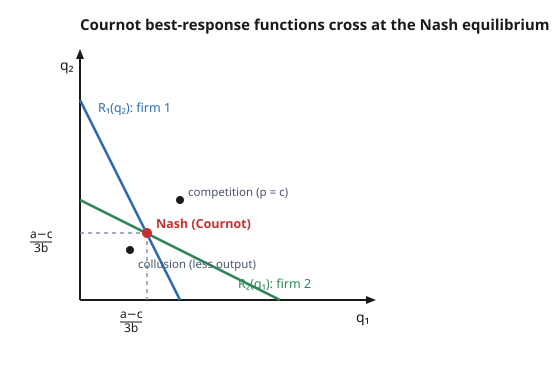

# Grad Microeconomics · Lesson 6.2: Oligopoly

> ⏱ ~15 min · Module 6: Market structure, externalities, and welfare · Builds on: [6.1 Monopoly and price discrimination](06-01-monopoly-price-discrimination.md) · Unlocks: [6.3 Externalities and the Coase theorem](06-03-externalities-coase-theorem.md)

## Why this matters

Monopoly ([6.1](06-01-monopoly-price-discrimination.md)) has one firm that ignores everyone; perfect competition ([4.1](04-01-partial-equilibrium-surplus.md)) has infinitely many, each too small to matter. Real markets — airlines, phone carriers, chip foundries, breakfast cereal — live in between: a *handful* of firms, each big enough that its choices move the price, each watching the others. The moment a firm's best move depends on what rivals do, you are no longer maximizing against a fixed demand curve — you are playing a **game**. Oligopoly is where industrial organization becomes game theory, and the punchline is subtle: the *same* firms can behave almost like a monopoly or almost like a competitive market depending only on *what variable they compete in* — quantity or price. That single distinction, Cournot versus Bertrand, is the lesson.

## The idea

Two firms sell nearly the same thing. If they compete by choosing **how much to produce**, each holds back a little — flooding the market would crater the price on your own units too — so output lands *between* monopoly and competition, and some markup survives. That is **Cournot**.

But if they compete by **posting a price** and the good is identical, the logic flips violently. Whoever is even a penny cheaper takes the *entire* market. So if your rival prices above cost, you undercut and grab everything; the only resting point is both pricing at marginal cost, earning zero — the competitive outcome, with just *two* firms. That is **Bertrand**, and its shocking conclusion is called the Bertrand paradox.

And if one firm can **commit first** — build the factory, announce the output — the other must react to a done deal. The leader exploits this by overproducing, forcing the follower to shrink. That is **Stackelberg**, and it is a first-mover advantage in the flesh.

Three models, three "intensities of competition," same handful of firms. The strategic glue underneath all of them is one idea from game theory: each firm plays a **best response** to what it expects the others to do, and equilibrium is where every guess is right at once — a **Nash equilibrium** (see [game-theory-refresher](../../game-theory-refresher/syllabus.md) and [grad-game-theory](../../grad-game-theory/syllabus.md)).

## The formal version

**Setup.** Two firms, $i = 1, 2$, produce a homogeneous good at constant marginal cost $c$. Market (inverse) demand is linear:

$$p = a - b\,Q, \qquad Q = q_1 + q_2, \qquad a > c > 0,\; b > 0,$$

where $p$ is price, $Q$ total output, $q_i$ firm $i$'s output, $a$ the choke price, and $b$ the demand slope. Firm $i$'s profit is $\pi_i = (p - c)\,q_i$.

**Cournot (simultaneous quantities).** Each firm chooses $q_i$ taking the rival's $q_j$ as given. Firm 1's problem is $\max_{q_1}\,\big(a - b(q_1 + q_2) - c\big)q_1$, with first-order condition $a - 2b q_1 - b q_2 - c = 0$, i.e. the **best-response (reaction) function**

$$q_1 = R_1(q_2) = \frac{a - c}{2b} - \frac{q_2}{2}, \qquad q_2 = R_2(q_1) = \frac{a-c}{2b} - \frac{q_1}{2}.$$

**In words:** the more I expect you to make, the less I make — every extra unit you produce lowers the price, so my profit-maximizing output falls by half a unit. A Cournot–Nash equilibrium is a pair $(q_1^*, q_2^*)$ where each is a best response to the other — the point where the two reaction lines cross. By symmetry $q_1^* = q_2^* = q^*$, so $q^* = \frac{a-c}{2b} - \frac{q^*}{2}$, giving

$$q^* = \frac{a - c}{3b}, \qquad Q^* = \frac{2(a-c)}{3b}, \qquad p^* = a - bQ^* = \frac{a + 2c}{3}.$$

Compare the three regimes' *total* output: monopoly $\frac{a-c}{2b}$, Cournot duopoly $\frac{2(a-c)}{3b}$, competition $\frac{a-c}{b}$. Since $\tfrac12 < \tfrac23 < 1$, Cournot sits strictly between — **more output, lower price, less deadweight loss than monopoly, but not yet efficient.**

**In words:** two competing quantity-setters produce more than one monopolist would, but each still restrains output enough to keep price above cost.

**Bertrand (simultaneous prices).** Now firms post prices $p_1, p_2$; consumers buy entirely from the cheaper one (splitting if tied). With identical goods and equal marginal cost $c$, the unique Nash equilibrium is

$$p_1^* = p_2^* = c, \qquad \pi_1 = \pi_2 = 0.$$

**In words:** if either firm prices above $c$, the other can undercut by a hair, seize the *whole* market, and still profit — so any price above cost unravels. Two firms are enough to reproduce the competitive outcome. This is the **Bertrand paradox**.

**Stackelberg (sequential quantities).** Firm 1 (the *leader*) chooses $q_1$ first; firm 2 (the *follower*) observes it and best-responds with $R_2(q_1)$. Solving **backward**, the leader substitutes the follower's reaction into its own profit and maximizes, yielding

$$q_1^{S} = \frac{a-c}{2b}, \qquad q_2^{S} = R_2(q_1^S) = \frac{a-c}{4b}, \qquad Q^S = \frac{3(a-c)}{4b},\quad p^S = \frac{a+3c}{4}.$$

**In words:** by committing first, the leader produces the full monopoly quantity and pushes the follower down to half of that — first-mover advantage, and it requires genuine *commitment* (the follower must believe $q_1$ is locked in).

## Picture

The steep blue line is firm 1's best response $R_1(q_2)$ (slope $-2$ in this plane); the shallow green line is firm 2's $R_2(q_1)$ (slope $-\tfrac12$). They intersect once, at the symmetric Cournot–Nash point $q_1 = q_2 = \frac{a-c}{3b}$. The collusive split (each producing half the monopoly output) sits *below* it — less total output — and the competitive symmetric point sits *above*.

## Worked examples

**Example 1 (mechanical — $n$-firm Cournot and the march to competition).** Generalize to $n$ symmetric firms, demand $p = a - bQ$, $Q = \sum_{j=1}^n q_j$, each with marginal cost $c$. Firm $i$ maximizes $\big(a - bQ - c\big)q_i$; its first-order condition is $a - bQ - b q_i - c = 0$. In a symmetric equilibrium $q_i = q$ and $Q = nq$:

$$a - c = b\,q\,(n+1) \;\Rightarrow\; q = \frac{a-c}{b\,(n+1)}, \qquad Q = \frac{n(a-c)}{b\,(n+1)}, \qquad p = \frac{a + nc}{n+1}.$$

The markup shrinks like $p - c = \dfrac{a-c}{n+1}$. Check the endpoints: $n=1$ gives the monopoly $\frac{a-c}{2b}$ and $p=\frac{a+c}{2}$; and as $n \to \infty$, $p \to c$ — **perfect competition is recovered in the limit of many firms.** The deadweight loss versus the competitive quantity $Q_c = \frac{a-c}{b}$ is the triangle between $Q$ and $Q_c$ at the surviving markup:

$$DWL_n = \tfrac12\,(p - c)\,(Q_c - Q) = \tfrac12\cdot\frac{a-c}{n+1}\cdot\frac{a-c}{b(n+1)} = \frac{(a-c)^2}{2b\,(n+1)^2} \;\xrightarrow{n\to\infty}\; 0.$$

*Numbers* ($a = 100$, $b = 1$, $c = 10$, so $a - c = 90$):

| regime | per firm $q$ | total $Q$ | price $p$ | $DWL$ |
|---|---|---|---|---|
| monopoly ($n=1$) | $45$ | $45$ | $55$ | $1012.5$ |
| Cournot duopoly ($n=2$) | $30$ | $60$ | $40$ | $450$ |
| Cournot $n=4$ | $18$ | $72$ | $28$ | $162$ |
| competition ($n\to\infty$) | $\to 0$ | $90$ | $10$ | $0$ |

Duopoly's deadweight loss ($450$) is well under monopoly's ($1012.5$) and falls like $1/(n+1)^2$ toward zero. This convergence — and the surplus accounting behind it — is exactly **Boss Problem 6**.

**Example 2 (Bertrand paradox, then the Stackelberg first-mover gain).** Same primitives, $a=100$, $b=1$, $c=10$.

*Bertrand.* Suppose both post $p = 40$ (the Cournot price). Firm 1 deviates to $p = 39.99$, captures the entire market $q = 100 - 39.99 \approx 60$, and earns roughly $(39.99 - 10)(60) \approx 1799$ instead of splitting. The same incentive exists at *any* $p > 10$, so undercutting drives both to $p = c = 10$, zero profit. Two firms, competitive outcome — the paradox. (What breaks it: capacity limits so a firm *can't* serve everyone, differentiated products so a penny doesn't move all buyers, or repeated play that supports collusion.)

*Stackelberg.* Firm 1 leads. The follower's reaction is $R_2(q_1) = 45 - \tfrac{q_1}{2}$. The leader's profit, after substitution, is

$$\pi_1 = \Big(a - b\big(q_1 + R_2(q_1)\big) - c\Big)q_1 = \Big(\tfrac{a-c}{2} - \tfrac{b}{2}q_1\Big)q_1 = \big(45 - \tfrac12 q_1\big)q_1,$$

maximized at $q_1^S = 45$ (the monopoly quantity), whence $q_2^S = 45 - 22.5 = 22.5$, $Q^S = 67.5$, $p^S = 32.5$. Profits:

$$\pi_1^S = (32.5 - 10)(45) = 1012.5, \qquad \pi_2^S = (32.5-10)(22.5) = 506.25.$$

Against the Cournot benchmark where each earns $(40-10)(30) = 900$: the leader jumps to $1012.5$ (**up** from 900), the follower falls to $506.25$ (**down** from 900). Moving first is worth real money — provided the commitment is credible.

*Why the cartel won't hold.* If the two split the monopoly output ($22.5$ each, $p = 55$), each earns $(55-10)(22.5) = 1012.5$ — better than Cournot's $900$. But collusion is **not a one-shot Nash equilibrium**: taking the rival's $22.5$ as fixed, the best response is $R(22.5) = 45 - 11.25 = 33.75$, which lifts the deviator to $(43.75-10)(33.75) \approx 1139 > 1012.5$. Each wants to cheat — a **prisoner's dilemma** ([game-theory-refresher](../../game-theory-refresher/syllabus.md)). Only *repeated* interaction with credible punishment can sustain the cartel.

## Watch out

- **You might think Cournot and Bertrand are minor modeling variants, but** they give wildly different answers for the *same* firms and costs: quantity competition leaves a markup between monopoly and competition, while price competition with homogeneous goods jumps *straight to* marginal-cost pricing. What firms compete *in* matters as much as how many there are.
- **You might think the Bertrand paradox says "two firms means competitive prices," but** it needs homogeneous goods *and* no capacity constraints. Add differentiation, capacity limits (Edgeworth), or repetition and prices rise back above cost — which is why real duopolies are profitable.
- **You might think the Stackelberg leader wins just by moving first, but** the advantage lives entirely in *commitment*. If the follower doesn't believe $q_1$ is irreversible — if the leader could quietly cut back — the threat evaporates and you are back at Cournot. First-mover advantage is a commitment story, not a timing accident.
- **You might think a cartel producing the monopoly output is an equilibrium, but** it isn't a one-shot Nash equilibrium: each firm strictly prefers to overproduce given the other's restraint. Collusion is a prisoner's dilemma, stable only in repeated play.
- **You might think "few firms" always lands between monopoly and competition, but** that is the *Cournot* intuition. Bertrand skips the middle entirely — two firms already price at cost.

## One-liner

> Oligopoly is game theory applied to markets: quantity competition (Cournot) lands between monopoly and competition and slides to competition as $n \to \infty$, price competition (Bertrand) reaches competition with just two firms, and commitment (Stackelberg) hands the first mover a monopoly-sized share.

## Problems

**P1 (🟢)** Duopoly with inverse demand $p = 60 - Q$ and common marginal cost $c = 12$. Find the symmetric Cournot equilibrium: each firm's output, total output, the market price, and each firm's profit.

**P2 (🟡)** Same market as P1 ($p = 60 - Q$, $c = 12$), but now firm 1 is a Stackelberg leader. Find $q_1$, $q_2$, the price, and both profits by backward induction, and confirm the leader earns more than in the Cournot case of P1.

**P3 (🔴, optional)** For the $n$-firm symmetric Cournot model with $p = a - bQ$ and marginal cost $c$, the **Lerner index** (markup power) is $L = \frac{p - c}{p}$. (a) Show that at the symmetric equilibrium $L = \dfrac{s_i}{|\varepsilon|}$, where $s_i = 1/n$ is each firm's market share and $\varepsilon$ is the market demand elasticity at equilibrium. (b) Interpret the two limits $n = 1$ and $n \to \infty$.

Solutions

**P1** Here $a = 60$, $b = 1$, $c = 12$, so $a - c = 48$. Using the symmetric duopoly formulas:

$$q^* = \frac{a-c}{3b} = \frac{48}{3} = 16, \qquad Q^* = 32, \qquad p^* = a - bQ^* = 60 - 32 = 28.$$

(Check via price formula: $p = \frac{a+2c}{3} = \frac{60 + 24}{3} = 28$. ✓) Each firm's profit:

$$\pi_i = (p^* - c)\,q^* = (28 - 12)(16) = 16 \times 16 = 256.$$

**P2** Follower's reaction (from $R_2(q_1) = \frac{a-c}{2b} - \frac{q_1}{2}$): $R_2(q_1) = 24 - \tfrac{q_1}{2}$. Leader maximizes

$$\pi_1 = \big(60 - (q_1 + 24 - \tfrac{q_1}{2}) - 12\big)q_1 = \big(24 - \tfrac12 q_1\big)q_1.$$

First-order condition: $24 - q_1 = 0 \Rightarrow q_1 = 24$. Then $q_2 = 24 - 12 = 12$, total $Q = 36$, price $p = 60 - 36 = 24$. Profits:

$$\pi_1 = (24 - 12)(24) = 288, \qquad \pi_2 = (24 - 12)(12) = 144.$$

The leader earns $288 > 256$ (its Cournot profit from P1), the follower earns $144 < 256$. First-mover advantage confirmed; total output $36$ exceeds the Cournot $32$, so consumers gain too.

**P3** From Example 1, equilibrium price $p = \frac{a+nc}{n+1}$ and markup $p - c = \frac{a-c}{n+1}$. Therefore

$$L = \frac{p-c}{p} = \frac{(a-c)/(n+1)}{p} = \frac{a-c}{(n+1)\,p}.$$

Now connect to elasticity. Market demand is $Q = \frac{a-p}{b}$, so its price elasticity at equilibrium is $\varepsilon = \frac{dQ}{dp}\frac{p}{Q} = -\frac{1}{b}\cdot\frac{p}{Q}$, giving $|\varepsilon| = \frac{p}{bQ}$. With $Q = \frac{n(a-c)}{b(n+1)}$ we get $bQ = \frac{n(a-c)}{n+1}$, so

$$\frac{s_i}{|\varepsilon|} = \frac{1/n}{p/(bQ)} = \frac{bQ}{n\,p} = \frac{1}{n\,p}\cdot\frac{n(a-c)}{n+1} = \frac{a-c}{(n+1)\,p} = L. \checkmark$$

So each firm's Lerner index equals its market share $s_i = 1/n$ divided by the market elasticity — the standard oligopoly markup rule. (b) At $n = 1$: $L = \frac{1}{|\varepsilon|}$, the pure monopoly markup ([6.1](06-01-monopoly-price-discrimination.md)). As $n \to \infty$: $s_i \to 0$, so $L \to 0$ and $p \to c$ — price equals marginal cost, the competitive limit.

## Flashback

**From Lesson 6.1 (Monopoly and price discrimination):** A single-price monopolist faces inverse demand $p = 120 - 2Q$ with constant marginal cost $c = 20$. Find the monopoly quantity and price, then compute the deadweight loss relative to the competitive outcome.

Solution

Revenue $R = pQ = (120 - 2Q)Q$, so marginal revenue $MR = 120 - 4Q$ (twice the slope of demand — the monopolist's signature). Set $MR = MC$:

$$120 - 4Q = 20 \;\Rightarrow\; Q_m = 25, \qquad p_m = 120 - 2(25) = 70.$$

The competitive benchmark sets $p = MC$: $120 - 2Q = 20 \Rightarrow Q_c = 50$, $p_c = 20$. The deadweight loss is the triangle between $Q_m$ and $Q_c$ at the wedge $p_m - c$:

$$DWL = \tfrac12\,(p_m - c)(Q_c - Q_m) = \tfrac12\,(70 - 20)(50 - 25) = \tfrac12\,(50)(25) = 625.$$

The monopolist restricts output to half the efficient level and carves out $625$ in lost surplus — the same triangle logic ([4.1](04-01-partial-equilibrium-surplus.md)) that Cournot *shrinks* as firms are added.

## Connections

- **Backward:** monopoly ([6.1](06-01-monopoly-price-discrimination.md)) is the $n = 1$ benchmark this lesson generalizes — the Cournot markup $\frac{a-c}{n+1}$ collapses to the monopoly markup at $n=1$ and to zero as $n\to\infty$. The deadweight-loss triangles are measured with the surplus machinery of [4.1](04-01-partial-equilibrium-surplus.md), and each firm's profit maximization is the marginal-revenue-equals-marginal-cost condition from [3.3](03-03-profit-maximization-supply.md), now with a *strategic* marginal revenue that depends on rivals.
- **Forward:** the deadweight loss of market power sets up the welfare comparisons of Module 6 and the policy question of when intervention helps — externalities and the Coase theorem come next in [6.3](06-03-externalities-coase-theorem.md).
- **Sideways (the central bridge):** oligopoly *is* game theory wearing an industrial-organization uniform. Cournot and Bertrand are Nash equilibria in quantities and prices; Stackelberg is subgame-perfect equilibrium by backward induction; the unstable cartel is a prisoner's dilemma resolved only by repeated play. All of this machinery — **best response, Nash equilibrium, backward induction, repeated games** — is developed in [grad-game-theory](../../grad-game-theory/syllabus.md) and reviewed in [game-theory-refresher](../../game-theory-refresher/syllabus.md). For the undergraduate-level version of these market structures, see [micro-refresher](../../micro-refresher/syllabus.md).
- Full module map: [syllabus](../syllabus.md).
