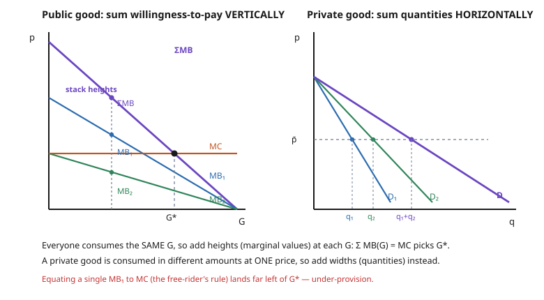

# Grad Microeconomics · Lesson 6.4: Public goods

> ⏱ ~15 min · Module 6: Market structure, externalities, and welfare · Builds on: [6.3 Externalities and the Coase theorem](06-03-externalities-coase-theorem.md) · Unlocks: [6.5 Social choice and welfare](06-05-social-choice-welfare.md)

## Why this matters

National defense, a lighthouse beam, a proved theorem, clean air: once these exist, your using them costs no one anything, and no fence keeps non-payers out. The market's central trick — a price that rations a scarce thing among rival claimants — has nothing to ration, so it breaks. The efficient amount of such a good is real and computable, but no decentralized market of self-interested buyers will fund it: each waits for the others. This lesson pins down *how much* a public good society should provide (the Samuelson condition), *why* voluntary provision falls short (free-riding), and the one price system that would fix it if only people told the truth (Lindahl).

## The idea

A **private good** — an apple — has two properties we never think about: eating it uses it up (**rival**), and the grocer can refuse you until you pay (**excludable**). Drop either property and the logic of markets changes.

- **Non-rival:** my enjoyment doesn't subtract from yours. We can *all* consume the *same* unit at once. A radio broadcast reaching one more listener costs the station nothing.
- **Non-excludable:** you can't practically keep non-payers from consuming. Once the streetlight is on, it lights everyone on the block.

|  | **Excludable** | **Non-excludable** |
|---|---|---|
| **Rival** | private good (apple) | common-pool resource (fishery) |
| **Non-rival** | club good (cinema, cable) | **pure public good** (defense, lighthouse) |

A **pure public good** is both non-rival and non-excludable. Here's the pivot that makes everything else follow: because everyone consumes the *same quantity* of a public good, you can't ask "how many does each person buy?" — there's one common $G$. So instead of adding up *quantities* people would buy at a common price (the private-good move, horizontal summation from [3.4](03-04-aggregation-and-the-firm.md)), you add up the *marginal values* different people place on that one common unit — **vertical summation** — and provide up to where the stacked willingness-to-pay meets marginal cost. That single switch, horizontal-to-vertical, is the whole subject.

## The formal version

Let $G \ge 0$ be the quantity of the public good and let each consumer $i \in \{1,\dots,n\}$ have a private numeraire $x_i$ (think: money spent on everything else). Take **quasilinear** utility
$$u_i(G, x_i) = b_i(G) + x_i,$$
where $b_i(G)$ is $i$'s benefit from the public good, with $b_i' > 0$, $b_i'' < 0$. The marginal rate of substitution between the public good and the numeraire is $\mathrm{MRS}_i = b_i'(G)$ — $i$'s marginal willingness to pay, in numeraire, for one more unit of $G$. Producing $G$ costs $c$ per unit (the marginal rate of transformation, $\mathrm{MRT} = c$).

**Planner's problem.** A utilitarian planner maximizes total surplus $\sum_i b_i(G) - cG$ over $G$. The first-order condition is

$$\boxed{\ \sum_{i=1}^{n} \mathrm{MRS}_i \;=\; \mathrm{MRT}\ } \qquad\Longleftrightarrow\qquad \sum_{i=1}^{n} b_i'(G) = c.$$

**In words (the Samuelson condition):** provide up to the point where the *sum* of everyone's marginal willingness-to-pay equals marginal cost. Sum vertically — add the heights — because the unit is shared. (For general, non-quasilinear preferences the same condition holds with each $\mathrm{MRS}_i$ measured between the public good and a common private good; quasilinearity just kills income effects so we can add money-metric benefits directly.)

Contrast the private-good rule, where each consumer independently sets *their own* $\mathrm{MRS}_i = p$ at a common price and we add quantities. For a public good, no single person's $\mathrm{MRS}_i$ equals $c$ at the optimum — the *sum* does.

**Voluntary (Nash) provision.** Now strip the planner. Each $i$ chooses a contribution $g_i \ge 0$, everyone consumes $G = \sum_j g_j$, and $i$ pays $c\,g_i$. Person $i$ solves $\max_{g_i \ge 0}\ b_i\!\left(g_i + \textstyle\sum_{j\ne i} g_j\right) - c\,g_i$, taking others' contributions as given. The interior first-order condition is

$$b_i'(G) = c \qquad(\text{own } \mathrm{MRS}_i = \mathrm{MRT}).$$

**In words:** each contributor weighs only the benefit *to himself*, ignoring the benefit his contribution confers on everyone else — a positive externality ([6.3](06-03-externalities-coase-theorem.md)). Each equates *his own* marginal benefit to marginal cost, not the sum, so $G$ stops far short of the Samuelson level. This is a contribution game; its Nash equilibrium ([grad-game-theory](../../grad-game-theory/syllabus.md)) is a generalized prisoner's dilemma — everyone would gain if all contributed more, yet no one individually will.

**Lindahl equilibrium.** The fix, in principle: give each consumer a **personalized price** $\tau_i \ge 0$ per unit of $G$, with $\sum_i \tau_i = c$. Facing price $\tau_i$, consumer $i$ demands the $G$ solving $b_i'(G) = \tau_i$. A **Lindahl equilibrium** is a price vector at which everyone demands the *same* $G$ and the prices cover cost. Then $\sum_i \tau_i = \sum_i b_i'(G) = c$ — exactly Samuelson.

**In words:** Lindahl prices are the public-good analog of Walrasian prices — each person pays per unit their own marginal benefit, the personalized prices add up to marginal cost, and the resulting common quantity is efficient. The catch: computing $\tau_i$ requires knowing $b_i'$, and each person has every incentive to understate it (lower price, still consume the same $G$). Lindahl is not incentive-compatible; eliciting truthful valuations needs a mechanism — VCG / Clarke–Groves ([5.5 mechanism design](06-05-social-choice-welfare.md)), itself limited by budget-balance and participation constraints.

## Picture

## Worked examples

**Example 1 (efficient vs. voluntary — the free-rider gap).** Two consumers value a public good with marginal benefits
$$b_1'(G) = 12 - G, \qquad b_2'(G) = 6 - \tfrac12 G,$$
and marginal cost $c = 6$.

*Efficient level (vertical sum $=$ MC):*
$$\sum_i b_i'(G) = (12 - G) + \left(6 - \tfrac12 G\right) = 18 - \tfrac32 G = 6 \ \Longrightarrow\ \tfrac32 G = 12 \ \Longrightarrow\ G^* = 8.$$
Both marginal benefits are still positive there ($b_1'(8)=4$, $b_2'(8)=2$), so it's an interior optimum.

*Voluntary Nash provision (each sets own MB $=$ MC):* person 1 wants total $G$ with $12 - G = 6 \Rightarrow G = 6$; person 2 wants $6 - \tfrac12 G = 6 \Rightarrow G = 0$. Person 2's marginal benefit never reaches $c$ (it starts at $6$ and falls), so person 2 contributes nothing and **free-rides entirely**; person 1 provides to his own optimum. Nash outcome $G^N = 6 < G^* = 8$.

*Size of the loss.* Aggregate net marginal surplus is $\sum_i b_i'(G) - c = 12 - \tfrac32 G$, positive on $(6,8)$. The deadweight loss from stopping at $6$ instead of $8$ is the triangle
$$\int_6^8 \left(12 - \tfrac32 G\right)dG = \Big[12G - \tfrac34 G^2\Big]_6^8 = (96-48)-(72-27) = 3.$$
Three units of surplus, evaporated to free-riding.

**Example 2 (Lindahl prices decentralize $G^*$).** Same two consumers. Find personalized prices that support $G^* = 8$. Set each price to that consumer's marginal benefit *at* $G^*$:
$$\tau_1 = b_1'(8) = 12 - 8 = 4, \qquad \tau_2 = b_2'(8) = 6 - \tfrac12(8) = 2.$$
Check the two Lindahl requirements. **Prices cover cost:** $\tau_1 + \tau_2 = 4 + 2 = 6 = c.$ ✓ **Everyone demands the same $G$:** facing $\tau_1 = 4$, person 1 solves $12 - G = 4 \Rightarrow G = 8$; facing $\tau_2 = 2$, person 2 solves $6 - \tfrac12 G = 2 \Rightarrow G = 8$. ✓ Both independently demand exactly $G^* = 8$ at their own price. The person who values the good more pays more per unit ($4$ vs. $2$) — and the personalized prices, summing to marginal cost, reproduce the planner's outcome. That's the public-good echo of a Walrasian equilibrium: prices carrying just enough information to decentralize efficiency — *if* preferences are known.

## Watch out

- **You might think** each consumer's $\mathrm{MRS}_i = \mathrm{MRT}$ at the optimum, as with a private good. **Actually** that's both the private-good rule *and* the free-rider's mistake — it gives voluntary under-provision. For a public good it's the *sum* $\sum_i \mathrm{MRS}_i = \mathrm{MRT}$. Add vertically, not per person.
- **You might think** non-rival and non-excludable are the same property. **Actually** they're independent axes. A **club good** (a subscription streaming service) is non-rival but *excludable* — you can charge admission even though extra viewers cost nothing. A **common-pool resource** (a fishery) is rival but non-excludable. Only the pure public good is both.
- **You might think** free-riding is irrational. **Actually** it's individually optimal — given what others do, contributing less is a best response. It's *collectively* inefficient: the public-goods game is a many-player prisoner's dilemma, rational play at every node, bad outcome overall.
- **You might think** Lindahl prices solve the problem in practice. **Actually** they require truthful revelation of $b_i'$, and everyone gains by understating it. Without an incentive-compatible mechanism, the prices can't be found — that's the bridge to mechanism design, not a footnote.
- **You might think** "public good" means "provided by the government." **Actually** the definition is non-rivalry + non-excludability, a property of the *good*, not of *who pays*. Fireworks bought by a private club are still a public good; toll roads run by the state are still (congestible, excludable) closer to club goods.

## One-liner

> Because everyone consumes the same unit, efficiency means summing marginal willingness-to-pay *vertically* to marginal cost — and because everyone consumes it whether they pay or not, self-interested provision never gets there.

## Problems

**P1 (🟢)** Three consumers have marginal benefits $b_A'(G) = 10 - G$, $b_B'(G) = 8 - G$, $b_C'(G) = 6 - G$ for a public good with constant marginal cost $c = 9$. Find the Samuelson-efficient level $G^*$ and verify every consumer's marginal benefit is positive there.

**P2 (🟡)** Two *identical* consumers each have $b_i'(G) = 8 - G$; marginal cost is $c = 4$. (a) Find the efficient $G^*$. (b) Find the voluntary (Nash) provision $G^N$, where each equates his own marginal benefit to $c$. (c) Compute the deadweight loss of the free-rider outcome.

**P3 (🔴, optional)** Now $n$ *identical* consumers each have $b_i'(G) = 10 - G$, marginal cost $c = 4$. (a) Give $G^*(n)$ from the Samuelson condition and the Nash total $G^N$. (b) Evaluate both at $n = 2, 10, 100$. (c) What happens to each *person's* contribution in the Nash equilibrium as $n \to \infty$, and what does that say about markets for public goods in large populations? Tie it to the contribution game in [grad-game-theory](../../grad-game-theory/syllabus.md).

Solutions

**P1** Vertical sum of marginal benefits set to marginal cost:
$$\sum_i b_i'(G) = (10-G)+(8-G)+(6-G) = 24 - 3G = 9 \ \Longrightarrow\ 3G = 15 \ \Longrightarrow\ G^* = 5.$$
At $G^*=5$: $b_A'=5>0$, $b_B'=3>0$, $b_C'=1>0$ — all positive, so the interior condition is valid. (Had any gone negative, that consumer would sit at a corner and drop out of the sum.)

**P2** (a) Samuelson: $2(8-G) = 4 \Rightarrow 8 - G = 2 \Rightarrow G^* = 6.$

(b) Nash: each sets his *own* marginal benefit to $c$: $8 - G = 4 \Rightarrow G^N = 4$. (By symmetry each contributes $2$; neither internalizes the benefit to the other.) So $G^N = 4 < G^* = 6$.

(c) Aggregate net marginal surplus is $\sum_i b_i'(G) - c = (16 - 2G) - 4 = 12 - 2G$, positive on $(4,6)$. Deadweight loss:
$$\int_4^6 (12 - 2G)\,dG = \big[12G - G^2\big]_4^6 = (72-36)-(48-16) = 36 - 32 = 4.$$
The free-rider outcome throws away $4$ units of surplus.

**P3** (a) Samuelson with $n$ identical consumers: $n(10 - G) = 4 \Rightarrow 10 - G = \tfrac{4}{n} \Rightarrow$
$$G^*(n) = 10 - \tfrac{4}{n}.$$
Nash: each sets own MB $=c$: $10 - G = 4 \Rightarrow G^N = 6$, independent of $n$.

(b)

| $n$ | $G^*(n) = 10 - 4/n$ | $G^N$ |
|---|---|---|
| $2$ | $8$ | $6$ |
| $10$ | $9.6$ | $6$ |
| $100$ | $9.96$ | $6$ |

(c) As $n \to \infty$, $G^*(n) \to 10$ but $G^N$ stays pinned at $6$: the gap *widens*. And each person's Nash contribution is $g^N = G^N/n = 6/n \to 0$ — in a large population every individual free-rides almost completely, and the total provided is capped by what a single enthusiast would fund alone. Voluntary provision doesn't just under-supply; it gets *relatively* worse as the group grows, because each contributor's share of the total social benefit he creates shrinks to nothing. This is why large-population public goods (defense, basic research, emissions abatement) are essentially never adequately provided by voluntary contribution — the contribution game's Nash equilibrium collapses toward zero per capita.

## Flashback

**From Lesson 6.3 (Externalities and the Coase theorem):** A competitive market has inverse demand $p = 24 - Q$ and private marginal cost (supply) $\mathrm{PMC} = Q$. Production also imposes a marginal external cost $\mathrm{MEC} = Q$ on bystanders (pollution). Find the private equilibrium quantity, the socially efficient quantity, and the per-unit Pigouvian tax that restores efficiency.

Solution

*Private equilibrium* — demand meets private marginal cost:
$$24 - Q = Q \ \Longrightarrow\ Q_m = 12.$$

*Social optimum* — demand meets *social* marginal cost $\mathrm{SMC} = \mathrm{PMC} + \mathrm{MEC} = Q + Q = 2Q$:
$$24 - Q = 2Q \ \Longrightarrow\ 3Q = 24 \ \Longrightarrow\ Q^* = 8.$$

The market *over*produces (12 vs. 8) because firms ignore the damage they impose. A **Pigouvian tax** equal to the marginal external cost *at the optimum* internalizes it: $t = \mathrm{MEC}(Q^*) = Q^* = 8$. Check: with the tax, private cost becomes $Q + 8$, and $24 - Q = Q + 8 \Rightarrow 2Q = 16 \Rightarrow Q = 8 = Q^*$. ✓

Note the mirror image: a *negative* externality (pollution) makes the market do *too much* and calls for a corrective *tax*; a public good is a *positive* externality (your contribution benefits everyone) and the market does *too little* — the symmetric remedy would be a *subsidy* or, better, a mechanism that elicits the shared value.

## Connections

- **Backward:** a public good is the positive-externality limit of [6.3](06-03-externalities-coase-theorem.md) pushed all the way — your contribution's benefit spills entirely onto others, so the private incentive collapses. And it's a headline failure of the First Welfare Theorem ([4.4](04-04-two-welfare-theorems.md)): with non-rival, non-excludable goods there is no complete set of markets, and competitive equilibrium is not Pareto efficient.
- **Backward (the contrast):** the vertical-vs-horizontal summation distinction rests on [3.4](03-04-aggregation-and-the-firm.md)'s aggregation — private demand aggregates *quantities* at a common price; public-good value aggregates *marginal valuations* at a common quantity.
- **Forward:** eliciting the $b_i'$ that Lindahl prices need is exactly the problem of [6.5](06-05-social-choice-welfare.md) and mechanism design — VCG/Clarke–Groves makes truth-telling a dominant strategy for public-good provision, at the cost of budget balance.
- **Sideways (game theory):** the voluntary-contribution game is the canonical $n$-player public-goods game — a generalized prisoner's dilemma whose Nash equilibrium under-provides. See the Nash machinery in [grad-game-theory](../../grad-game-theory/syllabus.md) and its refresher, [game-theory-refresher](../../game-theory-refresher/syllabus.md).
- **Sideways (undergrad bridge):** [micro-refresher](../../micro-refresher/syllabus.md) introduces the 2×2 rival/excludable taxonomy and the intuition for free-riding; this lesson supplies the Samuelson condition and the Lindahl fix behind it.
