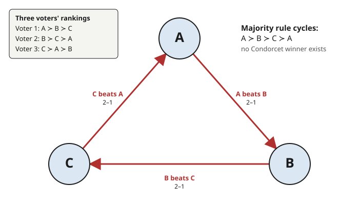

# Grad Microeconomics · Lesson 6.5: Social choice and welfare

> ⏱ ~15 min · Module 6: Market structure, externalities, and welfare · Builds on: [6.4 Public goods](06-04-public-goods.md) · Unlocks: (capstone — the end of the course)

## Why this matters

The whole course has been a study of one machine: the market. Prices take millions of private, incomparable wants and grind them into a single number per good — and under the right assumptions ([4.4](04-04-two-welfare-theorems.md), the welfare theorems) the result is Pareto efficient. That is a genuine miracle of aggregation. So a natural question closes the subject: can we do the same thing *without prices*? When a committee, an electorate, or a planner must pick one option for everyone, is there a principled way to fold each person's ranking into a coherent "society's ranking"?

The answer, due to Kenneth Arrow, is a flat and famous **no**. Any rule that aggregates individual orderings into a social ordering, and that respects a handful of conditions any reasonable person would demand, must secretly be a **dictatorship** — one person's ranking becomes society's, everyone else ignored. This is not a warning about bad voting systems; it is a theorem that *no* system escapes. It is the sharpest possible counterpoint to the welfare theorems, and the right place to end a course on welfare.

## The idea

Start with the oldest crack in majority rule, spotted by Condorcet in 1785. Three friends — call them Voter 1, 2, 3 — must choose among three restaurants $A$, $B$, $C$. Their honest rankings are:

- Voter 1: $A \succ B \succ C$
- Voter 2: $B \succ C \succ A$
- Voter 3: $C \succ A \succ B$

Each individual ranking is perfectly sensible — transitive, no contradictions. Now run majority votes on the pairs. $A$ vs $B$: Voters 1 and 3 prefer $A$, so $A$ wins. $B$ vs $C$: Voters 1 and 2 prefer $B$, so $B$ wins. So $A \succ B$ and $B \succ C$ — if society were rational, it should now prefer $A$ to $C$. But $C$ vs $A$: Voters 2 and 3 prefer $C$, so $C$ wins. Society prefers $A$ to $B$, $B$ to $C$, and $C$ to $A$: a **cycle**. Majority preference is **intransitive** even though every voter is rational.

This is the seed of everything. Individual rationality does not survive aggregation. There is no "best" restaurant — whatever you pick, a majority would rather switch to something else, forever. Arrow's theorem is the discovery that this pathology is not special to majority rule; it is a shadow cast by three or more alternatives onto *every* aggregation rule that plays fair.

## The formal version

Fix a finite set of alternatives $X$ with $|X| \ge 3$, and $n$ individuals. Each individual $i$ has a **preference ordering** $\succeq_i$ — a complete, transitive ranking of $X$ (exactly the rationality axioms of [2.1](02-01-preferences-utility-representation.md)). A **social welfare function** (SWF) is a map

$$F: (\succeq_1, \dots, \succeq_n) \ \longmapsto\ \succeq_S$$

that takes any profile of individual orderings and returns a single **social ordering** $\succeq_S$, itself required to be complete and transitive.

**In words:** $F$ is the aggregation machine — feed it everyone's ranking, it must output one coherent ranking for society (no cycles allowed in the output).

Arrow asks $F$ to satisfy four conditions:

**(1) Unrestricted domain (U).** $F$ is defined for *every* logically possible profile of individual orderings. **In words:** the rule must handle whatever preferences people actually have — you can't outlaw inconvenient voters.

**(2) Weak Pareto (P).** If *every* individual strictly prefers $x$ to $y$, then society strictly prefers $x$ to $y$: $x \succ_i y\ \forall i \implies x \succ_S y$. **In words:** unanimity is respected — if we all agree, society agrees.

**(3) Independence of irrelevant alternatives (IIA).** Society's ranking of $x$ versus $y$ depends only on how individuals rank $x$ versus $y$ — not on where any third option $z$ sits. Formally, if two profiles agree on every individual's $x$-vs-$y$ comparison, then $F$ ranks $x$ and $y$ the same way in both. **In words:** to decide $x$ against $y$, only the $x$-vs-$y$ opinions count; irrelevant options can't tip the scale.

**(4) Non-dictatorship (D).** There is no individual $d$ such that $x \succ_d y \implies x \succ_S y$ for all $x,y$ and all profiles, regardless of everyone else. **In words:** no single person's strict preference always becomes society's, overriding all others.

> **Arrow's Impossibility Theorem.** If $|X| \ge 3$, no social welfare function satisfies (U), (P), (IIA), and (D) simultaneously. Equivalently: the *only* SWFs satisfying unrestricted domain, weak Pareto, and IIA are **dictatorships**.

**In words:** demand universality, unanimity-respect, and independence, and you have — without asking for it — handed all power to one person. Drop the dictator and one of the other three must break.

**Proof idea (decisive-set contraction — a sketch, not the full proof).** Call a group of voters $S$ *decisive* over the ordered pair $(x,y)$ if, whenever everyone in $S$ ranks $x \succ y$, society does too (no matter what outsiders think). Weak Pareto says the *whole* electorate is decisive over every pair. The engine of the proof is a **contraction lemma**: using IIA and unrestricted domain to construct clever profiles, one shows that if a group $S$ is decisive over some pair, then some *strictly smaller* subgroup is decisive over some pair as well. Iterate: decisiveness keeps shrinking down through the electorate until it lands on a single individual — and a "field expansion" step shows that individual is decisive over *every* pair. That individual is a dictator. The three "fair" axioms don't just permit a dictator; they manufacture one. (The full argument is a beautiful exercise in the proof structure of `proofs-primer` — construct the adversarial profile, apply IIA to freeze the relevant comparisons, derive the contradiction.)

**Escape routes.** Impossibility means all four axioms can't hold at once, so every escape *relaxes one*:

- **Restrict the domain (drop U).** If preferences are **single-peaked** — each voter has one ideal point on a line and likes options less the farther they sit from it — the Condorcet cycle vanishes and majority rule delivers a transitive winner. The **Median Voter Theorem** (Black, 1948): with an odd number of voters and single-peaked preferences over a one-dimensional line, the median voter's ideal point is a **Condorcet winner** — it beats every other option in a pairwise majority vote. This is the constructive counterpoint to Arrow: restrict the domain and coherent aggregation returns.
- **Use cardinal, comparable utility (drop IIA).** Arrow's alternatives carry only *ordinal, non-comparable* rankings. If instead we can measure and compare utilities across people, we can build **social welfare functions** in the Bergson–Samuelson sense: the **utilitarian** $W = \sum_i u_i$ (maximize the sum) or the **Rawlsian** $W = \min_i u_i$ (maximize the worst-off). These violate IIA — they use utility magnitudes, not just pairwise ranks — which is exactly how they dodge the theorem. Amartya Sen's work is largely about what interpersonal comparability buys you here.
- **Accept manipulability.** Keep the ordinal, fair setup and live with the fact (below) that any such rule can be gamed.

## Picture

The three arrows point winner-to-loser and chase each other around the triangle: $A \succ B \succ C \succ A$. There is no sink — no node all arrows point *into* — so no option is a Condorcet winner. That closed loop, impossible for a single rational agent, is what majority rule produces from three rational agents.

## Worked examples

**Example 1 (the Condorcet paradox — computed in full).** Take the profile in "The idea": Voter 1 $A\succ B\succ C$, Voter 2 $B\succ C\succ A$, Voter 3 $C\succ A\succ B$. Compute all three pairwise majority votes.

*$A$ vs $B$.* Voter 1: $A\succ B$ ✓. Voter 2: $B \succ A$ (since $B\succ C\succ A$). Voter 3: $A\succ B$ ✓. Tally $A$: 2, $B$: 1 — **$A$ wins**.

*$B$ vs $C$.* Voter 1: $B\succ C$ ✓. Voter 2: $B\succ C$ ✓. Voter 3: $C\succ B$ (since $C\succ A\succ B$). Tally $B$: 2, $C$: 1 — **$B$ wins**.

*$C$ vs $A$.* Voter 1: $A\succ C$ (since $A\succ B\succ C$). Voter 2: $C\succ A$ ✓. Voter 3: $C\succ A$ ✓. Tally $C$: 2, $A$: 1 — **$C$ wins**.

So $A \succ_S B$, $B \succ_S C$, $C \succ_S A$. Suppose a Condorcet winner existed — an option beating both others pairwise. $A$ loses to $C$; $B$ loses to $C$... but $C$ loses to $A$. Every candidate is beaten by someone, so **no Condorcet winner exists**. The social preference has a cycle, hence is *not* transitive: majority rule, on this domain, is not a valid SWF. This is not a counting mistake — recount all you like, the cycle is real.

**Example 2 (single-peaked preferences → the median voter rescues transitivity).** Now put the same three options on a line by ideology: $A < B < C$ (say tax rates: low, medium, high). Three voters with single-peaked preferences, i.e. each has a most-preferred point and dislikes options monotonically as they move away from it:

- Voter L (peak at $A$): $A \succ B \succ C$
- Voter M (peak at $B$): $B \succ$ {$A$ or $C$, whichever is nearer — say $A$} $\succ C$
- Voter R (peak at $C$): $C \succ B \succ A$

Each preference is single-peaked: no one "loves the extremes and hates the middle." The median of the three peaks $\{A, B, C\}$ is $B$ (Voter M's ideal). Claim: **$B$ is a Condorcet winner**.

*$B$ vs $A$.* Voter M and Voter R both prefer $B$ to $A$ ($B$ is at or nearer their peaks). That's 2 of 3 — **$B$ beats $A$**.

*$B$ vs $C$.* Voter L and Voter M both prefer $B$ to $C$. That's 2 of 3 — **$B$ beats $C$**.

$B$ beats every alternative pairwise, so it is the Condorcet winner, and majority preference is transitive here. Why did the cycle disappear? Single-peakedness forbids the "wrap-around" ranking $C \succ A \succ B$ that Voter 3 had in Example 1 (loving high *and* low tax while hating medium is not single-peaked on this line). Killing that one pattern kills the cycle. This is Arrow's domain-restriction escape made concrete: relax **unrestricted domain**, and coherent majority aggregation exists — the median voter's ideal is the stable social choice, which is why political competition famously converges toward the center.

## Watch out

- **You might think** Arrow proves "voting is useless" or "all voting systems are equally bad" — **but actually** it says no rule satisfies *all four* axioms at once. Rules still differ enormously in *which* axiom they sacrifice and how gracefully. Impossibility is about a specific joint wish-list, not a verdict that collective choice is hopeless.
- **You might think** Arrow applies to any welfare comparison — **but actually** it is specifically about **ordinal, interpersonally non-comparable** preferences. The moment you allow cardinal, comparable utilities (utilitarian sums, Rawlsian maximin), you've relaxed IIA and Arrow no longer bites. The theorem is a statement about the poverty of pure rankings, not about welfare economics as a whole.
- **You might think** IIA is obviously reasonable — **but actually** it is the most controversial axiom. It forbids using *intensity* or *rank distance*: whether you rank $x$ just barely above $y$ or vastly above it, IIA says only the bare direction may count, and it bans any third option from mattering. Most real-world "irrelevant alternative" spoiler effects (a minor candidate reshaping the major-candidate outcome) are IIA violations, and many people, on reflection, *want* to violate it.
- **You might think** a Condorcet cycle is some arithmetic glitch — **but actually** it is a genuine, robust failure of majority rule. The social "preference" really does loop; there is no fixed point to elect. Single-peakedness is the key structural condition that rules it out.
- **You might think** Arrow and Gibbard–Satterthwaite are the same theorem — **but actually** they are twins, not identicals. Arrow is about *aggregation* (can we form a coherent social ranking?); Gibbard–Satterthwaite is about *strategy* (can we make truth-telling optimal?). Different questions, parallel impossibility.

## One-liner

> With three or more options, any preference-aggregation rule that is universal, unanimity-respecting, and independent of irrelevant alternatives is secretly a dictatorship — coherent "society's preferences" without prices, or a dictator, cannot be had.

## Problems

**P1 (🟢)** Three voters rank options $\{X, Y, Z\}$: Voter 1 $X\succ Y\succ Z$, Voter 2 $Y\succ Z\succ X$, Voter 3 $Z\succ X\succ Y$. Compute all three pairwise majority votes and determine whether a Condorcet winner exists. Then say which Arrow axiom majority rule violates here.

**P2 (🟡)** On a left–right line, five voters have single-peaked preferences with ideal points at positions $2, 5, 5, 9, 11$. (a) Which position is the Condorcet winner under majority rule, and why? (b) A sixth voter with ideal point $1$ joins. Does the Condorcet winner move? (c) In one sentence, connect (b) to why candidates in a two-party race crowd toward the center.

**P3 (🔴, optional)** Consider the **Borda count**: with $m$ alternatives, each voter awards $m-1$ points to their top choice, $m-2$ to the next, down to $0$ for the last; society ranks by total points. (a) Using the Example-1 Condorcet profile, compute the Borda scores of $A, B, C$ and give the Borda social ranking — note it produces a transitive result where majority rule failed. (b) Now show Borda violates IIA: keep everyone's $A$-vs-$B$ ranking fixed but change where $C$ sits in someone's list so that the Borda ranking of $A$ vs $B$ flips. Explain why this is exactly the "irrelevant alternative" Arrow warns about.

Solutions

**P1** This is the Condorcet profile relabeled ($X\to A$, etc.).

- $X$ vs $Y$: Voter 1 $X\succ Y$, Voter 2 $Y\succ X$, Voter 3 $X\succ Y$ → $X$ wins 2–1.
- $Y$ vs $Z$: Voter 1 $Y\succ Z$, Voter 2 $Y\succ Z$, Voter 3 $Z\succ Y$ → $Y$ wins 2–1.
- $Z$ vs $X$: Voter 1 $X\succ Z$, Voter 2 $Z\succ X$, Voter 3 $Z\succ X$ → $Z$ wins 2–1.

So $X\succ_S Y \succ_S Z \succ_S X$: a cycle, and **no Condorcet winner exists** (each option loses to one other). The output ordering is intransitive, so majority rule fails to produce a valid social ordering. The violated axiom is not any of P, IIA, or D — majority rule satisfies all three — it is that no SWF over the **unrestricted domain** can also guarantee a transitive output; majority rule buys U, P, IIA, D by giving up the transitivity of $\succeq_S$. (Equivalently: to keep majority rule *and* transitivity you must restrict the domain, which is exactly the escape P2 uses.)

**P2** (a) With single-peaked preferences the **median ideal point** is the Condorcet winner. Sorted peaks: $2, 5, 5, 9, 11$; the median (3rd of 5) is $\mathbf{5}$. Any proposal to its right loses the three voters at $2,5,5$ (a majority) who prefer $5$; any proposal to its left loses the three at $5,5,9,11$... more precisely voters at $5,5,9,11$ prefer $5$ to anything below it — a majority either way. So $5$ beats every alternative pairwise.

(b) Now six voters with peaks $1,2,5,5,9,11$. With an even count the median is between the 3rd and 4th sorted peaks, both equal to $5$, so the median position is still **$5$** — the Condorcet winner does not move. (Adding a voter to the *left* pulls the count but not past the cluster at $5$; the median is robust to changes far from it.)

(c) In a two-candidate race, each candidate wins by capturing the median voter, so both converge toward the median position — the median voter theorem is the formal engine behind the empirical "move to the center."

**P3** (a) Borda scores ($m=3$, so 2/1/0 points), profile Voter 1 $A\succ B\succ C$, Voter 2 $B\succ C\succ A$, Voter 3 $C\succ A\succ B$:

- $A$: $2$ (V1) $+ 0$ (V2) $+ 1$ (V3) $= 3$.
- $B$: $1$ (V1) $+ 2$ (V2) $+ 0$ (V3) $= 3$.
- $C$: $0$ (V1) $+ 1$ (V2) $+ 2$ (V3) $= 3$.

A perfect three-way tie, $A \sim B \sim C$ — transitive (everything indifferent), unlike the majority-rule cycle. Borda "resolves" the paradox by producing a coherent (here, flat) ranking.

(b) IIA violation. Start from a profile where Borda gives $A \succ B$. Take two voters: Voter 1 $A\succ B\succ C$ and Voter 2 $B\succ A \succ C$. Scores: $A = 2+1 = 3$, $B = 1+2 = 3$ — a tie. Now change *only Voter 2's placement of the irrelevant option $C$*, moving $C$ above $A$: Voter 2 becomes $B \succ C \succ A$. Voter 2 still ranks $B\succ A$ — the $A$-vs-$B$ comparison is untouched for both voters. New scores: $A = 2 + 0 = 2$, $B = 1 + 2 = 3$, so now $B \succ A$. The social ranking of $A$ vs $B$ flipped even though *no one changed their $A$-vs-$B$ opinion* — only where $C$ sat moved. That is precisely an "irrelevant alternative" ($C$) altering the social verdict on $A$ vs $B$, the violation IIA forbids. Borda escapes Arrow's cycle only by paying with IIA.

## Flashback

**From Lesson 2.1 (Preferences and utility representation):** A rational preference relation $\succeq$ on a set $X$ is **complete** and **transitive**. (a) State what transitivity requires. (b) Show directly that the majority-rule social preference from Example 1 is complete but *not* transitive, and explain in one line why this blocks it from being represented by any utility function $u: X \to \mathbb{R}$.

Solution

(a) Transitivity: for all $x,y,z \in X$, if $x \succeq y$ and $y \succeq z$ then $x \succeq z$. (Preferences don't loop or contradict across chains.)

(b) *Completeness* holds: for each pair, majority rule delivers a strict winner (from Example 1, $A\succ_S B$, $B\succ_S C$, $C\succ_S A$), so every pair is comparable — no ties, nothing undefined. *Transitivity fails*: $A \succ_S B$ and $B \succ_S C$, so transitivity would force $A \succ_S C$; but in fact $C \succ_S A$. The chain loops, contradicting transitivity.

Why no utility representation: a utility function would assign real numbers $u(A), u(B), u(C)$ with $x \succ_S y \iff u(x) > u(y)$. The cycle would then require $u(A) > u(B) > u(C) > u(A)$, i.e. $u(A) > u(A)$ — impossible for real numbers, which are totally ordered and never strictly exceed themselves. Real numbers can't cycle, so a cyclic preference can never be represented by a utility function. This is the individual-level rationality of [2.1](02-01-preferences-utility-representation.md) failing at the *social* level: society, unlike a rational person, has no utility function.

## Connections

- **Backward:** this is [2.1](02-01-preferences-utility-representation.md)'s rationality axioms turned on society. There, completeness and transitivity were the price of admission for a utility representation; here, the shock is that aggregation *destroys transitivity* — the Condorcet cycle is a preference relation that no utility function can represent, so "society" is not a rational agent even when every member is.
- **Backward (the course's other pole):** contrast with [4.4](04-04-two-welfare-theorems.md). The welfare theorems say the market *succeeds* at aggregation — competitive prices produce a Pareto-efficient allocation, decentralized and coherent. Arrow says that *without* the price mechanism, folding preferences into a coherent social ranking is impossible short of a dictator. The market's success and social choice's impossibility are the two poles of welfare economics: prices aggregate what raw rankings cannot.
- **Sideways (mechanism design):** Arrow's strategic twin is **Gibbard–Satterthwaite** ([5.5](05-05-mechanism-design-markets.md)): any non-dictatorial voting rule over $\ge 3$ alternatives with full range is **manipulable** — some voter can gain by misreporting, so no such rule is strategy-proof. Arrow is about the *coherence* of the aggregate; Gibbard–Satterthwaite is about the *honesty* of the inputs. Together they bound mechanism design from both sides: the revelation-principle machinery of [5.5](05-05-mechanism-design-markets.md) works precisely because, in general environments, you cannot have coherence *and* strategy-proofness *and* fairness at once.
- **Sideways (proof technique):** the decisive-set contraction is a template impossibility proof — assume the axioms, construct an adversarial profile, use IIA to freeze the relevant comparisons, and drive out a contradiction (a lone dictator). It's the same "adversary constructs the counterexample" logic as the impossibility and diagonalization arguments in `proofs-primer`.
- **Sideways (game theory & political economy):** voting rules, strategic manipulation, and coalition formation are core to `grad-game-theory` (and `game-theory-refresher`); the median voter theorem is the workhorse model of formal political economy, explaining platform convergence, the size of government, and why single-dimensional politics is so much more tractable than multidimensional politics (where cycles return with a vengeance).

---

*Capstone reflection.* The course began with a single optimizing agent — convexity, Kuhn–Tucker, the envelope theorem (Module 1) — and asked what such agents do when they meet. Consumer and producer theory (Modules 2–3) built the agents; general equilibrium (Module 4) assembled them into a market and proved the astonishing result that self-interested trade, guided only by prices, lands on a Pareto-efficient allocation. Modules 5–6 spent their energy on what breaks that miracle: hidden information, monopoly, externalities, public goods — each a wedge between private incentive and social good. Arrow is the deepest wedge of all. It says the market's aggregation feat was not free: it rode on prices and cardinal willingness-to-pay. Strip those away and ask for coherent collective choice from bare rankings, and you hit a wall no cleverness removes. The two welfare theorems and Arrow's impossibility are the same subject seen from opposite ends — one showing how much aggregation the price system silently accomplishes, the other showing how little is possible without it. That tension is welfare economics. You now hold both ends of it.
