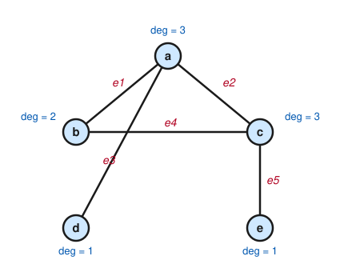

# Graph Theory · Lesson 1.1: What is a graph? Degree & the handshake lemma

> ⏱ ~15 min · Module 1: Foundations, paths & connectivity · Builds on: nothing (course start) · Unlocks: [Lesson 1.2](01-02-representing-graphs-isomorphism.md) (representing graphs & isomorphism)

## Why this matters

A graph is the minimal model of "things and the connections between them" — people and friendships, cities and roads, tasks and dependencies, atoms and bonds. Almost nothing in this course needs numbers; it needs *structure*, and the graph is where structure lives. Before any of the deep theorems (matchings, flows, coloring), you need one reflex: count the connections at each dot, add them up, and notice that the total can never be odd. That single parity fact — the handshake lemma — is the first thing that turns a picture into a proof, and it already rules out situations that look perfectly plausible ("could 9 people each shake exactly 3 hands?").

## The idea

Draw some dots and connect some pairs with lines. The dots are **vertices**, the lines are **edges**, and that's the whole object. The **degree** of a vertex is just how many line-ends stick out of it — how many edges touch it.

Here's the one observation that makes the subject start. Every edge is a single segment with *two* ends. So if you walk around the graph and add up the degree of every vertex — counting each line-end once — you've counted every edge exactly twice, once from each of its two ends. The grand total is therefore always **even**: it's exactly twice the number of edges.

That's it. The name comes from handshakes: if edges are handshakes between people, then summing "how many hands each person shook" double-counts every handshake (it took two people), so the total number of shaken-hands is even. And an even total can't be built from an odd number of odd contributors — which is why an *odd* number of people who each shook an *odd* number of hands is impossible.

## The formal version

**Definition (graph).** A **graph** $G = (V, E)$ is a finite set $V$ of **vertices** together with a set $E$ of **edges**, where each edge is an unordered pair $\{u, v\}$ of distinct vertices. If $\{u,v\} \in E$ we say $u$ and $v$ are **adjacent** (neighbors), and the edge is **incident** to each of them. We write $|V|$ for the number of vertices and $|E|$ for the number of edges.

*In words:* a graph is dots plus a choice of which pairs of dots are joined.

This is a **simple graph**: no edge from a vertex to itself (a *loop*), and no pair joined twice (*parallel edges*). A **multigraph** relaxes exactly this — it allows loops and parallel edges — and models things like a road map where two cities are linked by several separate roads. Unless we say otherwise, "graph" means simple graph.

**Definition (degree).** The **degree** of a vertex $v$, written $\deg(v)$, is the number of edges incident to $v$.

*In words:* $\deg(v)$ counts the edges touching $v$. (In a multigraph, a loop at $v$ contributes $2$ to $\deg(v)$ — both of its ends are at $v$.)

**The Handshake Lemma.** For any graph $G = (V, E)$,
$$\sum_{v \in V} \deg(v) = 2\,|E|.$$

*In words:* summing the degrees of all vertices gives exactly twice the number of edges.

*Proof (double-counting the incidences).* Count the set of **incidences** — pairs $(v, e)$ where vertex $v$ is an endpoint of edge $e$ — in two ways.

- **By vertices:** each vertex $v$ belongs to $\deg(v)$ incidences, one per edge touching it. Total: $\sum_{v \in V} \deg(v)$.
- **By edges:** each edge $e = \{u, w\}$ has exactly two endpoints, so it appears in exactly $2$ incidences. Total: $2\,|E|$.

Both count the same set, so the two totals are equal:
$$\sum_{v \in V} \deg(v) = 2\,|E|. \qquad \blacksquare$$

The single most-used consequence:

**Corollary (odd-degree parity).** In any graph, the number of vertices of **odd** degree is **even**.

*In words:* you can never have an odd number of "odd" vertices.

*Proof.* Split the vertices into those of even degree and those of odd degree, and split the handshake sum accordingly:
$$\underbrace{\sum_{\deg(v)\text{ even}} \deg(v)}_{\text{call it } S_{\text{even}}} \; + \; \underbrace{\sum_{\deg(v)\text{ odd}} \deg(v)}_{\text{call it } S_{\text{odd}}} \; = \; 2|E|.$$
The whole right side is even, and $S_{\text{even}}$ is a sum of even numbers, hence even. Therefore $S_{\text{odd}} = 2|E| - S_{\text{even}}$ is even too. But $S_{\text{odd}}$ is a sum of *odd* numbers, and a sum of odd numbers is even **iff** there is an even number of them. So the count of odd-degree vertices is even. $\blacksquare$

**Application (the 9-handshake impossibility).** Can $9$ people each shake hands with exactly $3$ others? Model people as vertices and handshakes as edges. Then every vertex would have degree $3$ (odd), giving $9$ odd-degree vertices — an *odd* count, which the corollary forbids. Directly: $\sum_v \deg(v) = 9 \cdot 3 = 27$, which is odd and so cannot equal $2|E|$. Impossible — no matter how the handshakes are arranged. (This is the parity half of Boss problem 1.)

## Picture

The graph below has $5$ vertices $a,b,c,d,e$ and $5$ edges $e_1,\dots,e_5$. Each edge is one segment with two ends; the blue annotations give each vertex's degree.

Add the degrees: $\deg(a)+\deg(b)+\deg(c)+\deg(d)+\deg(e) = 3+2+3+1+1 = 10 = 2\cdot 5 = 2|E|$. The reason the sum lands on exactly $2|E|$ is visible in the drawing: follow any edge, say $e_4 = \{b,c\}$, and it contributes one line-end to $\deg(b)$ and one to $\deg(c)$ — so every edge is tallied twice, once at each end. The odd-degree vertices are $a, c, d, e$: four of them, an even count, as the corollary promises.

## Worked examples

**Example 1 (mechanical — reading off degrees).** Take the graph $V = \{1,2,3,4\}$ with edges $E = \{\{1,2\}, \{2,3\}, \{3,4\}, \{4,1\}, \{1,3\}\}$. Then
$$\deg(1) = 3\ (\text{to }2,4,3),\quad \deg(2) = 2,\quad \deg(3) = 3,\quad \deg(4) = 2.$$
Sum $= 3+2+3+2 = 10 = 2\cdot 5 = 2|E|$. ✓ Odd-degree vertices: $1$ and $3$ — two of them, even. ✓ This graph is a $4$-cycle with one diagonal added.

**Example 2 (why you'd care — killing a "degree sequence" on sight).** A **degree sequence** is the list of degrees a graph produces; a natural question is whether a proposed list is even *achievable*. Could a graph have degree sequence $(5, 4, 3, 3, 2, 2)$? Add it up: $5+4+3+3+2+2 = 19$, odd. By the handshake lemma the degree sum must equal $2|E|$, an even number — so **no graph has this degree sequence**, and we know it before drawing a single edge. (Passing the parity test is *necessary*, not sufficient: an even sum can still fail for other reasons, e.g. asking for a degree $\ge$ the number of other vertices. The handshake lemma is the cheapest filter, applied first.)

## Watch out

- You might think degree counts *neighbors*, but in a simple graph it counts *edges* — and those coincide. In a **multigraph** they don't: two parallel edges between $u$ and $v$ make $\deg(u)$ include $2$, though $v$ is one neighbor, and a **loop** at $v$ adds $2$ to $\deg(v)$, not $1$. Say "edges incident to $v$," not "vertices adjacent to $v$," to stay safe.
- You might think an *even* degree sum guarantees the graph exists, but it only clears the parity hurdle. $(5,4,3,3,2,2)$ is dead on arrival (sum $19$); an even sum like $(4,4,4,4)$ still needs a separate check that no vertex demands more neighbors than exist.
- You might think the corollary says "the number of odd-degree vertices is odd" or "half are odd" — it says the *count of odd-degree vertices is even* (possibly zero). Whether individual degrees are odd or even, and how many, is not otherwise constrained by this lemma.

## One-liner

> Every edge has two ends, so the degrees sum to $2|E|$ — an even total that forces an even number of odd-degree vertices.

## Problems

**P1 (🟢)** A graph has $V = \{1,2,3,4,5,6\}$ and edges $\{1,2\},\{1,3\},\{2,3\},\{3,4\},\{4,5\},\{4,6\},\{5,6\}$. (a) Compute $\deg(v)$ for every vertex. (b) Verify the handshake lemma by checking $\sum_v \deg(v) = 2|E|$. (c) List the odd-degree vertices and confirm there is an even number of them.

**P2 (🟡)** A graph is **$r$-regular** if every vertex has the same degree $r$. Prove that if $r$ is odd, then the number of vertices $n$ must be even. Use this to explain, in one sentence, why there is no $3$-regular graph on $7$ vertices.

**P3 (🔴, optional)** Prove that every simple graph with $n \ge 2$ vertices has two distinct vertices of the *same* degree. *(Hint: in a simple graph each degree lies in $\{0, 1, \dots, n-1\}$ — that's $n$ possible values for $n$ vertices, so pigeonhole is *almost* enough. Find the one reason two of those values can't both occur.)*

Solutions

**P1** (a) Tally the edges touching each vertex:
$$\deg(1)=2,\ \deg(2)=2,\ \deg(3)=3,\ \deg(4)=3,\ \deg(5)=2,\ \deg(6)=2.$$
(Vertex $1$: edges $\{1,2\},\{1,3\}$. Vertex $3$: $\{1,3\},\{2,3\},\{3,4\}$. Vertex $4$: $\{3,4\},\{4,5\},\{4,6\}$, etc.)

(b) There are $|E| = 7$ edges, so $2|E| = 14$. And $\sum_v \deg(v) = 2+2+3+3+2+2 = 14$. ✓

(c) Odd-degree vertices: $3$ and $4$ — exactly two, an even count. ✓

**P2** In an $r$-regular graph every one of the $n$ vertices has degree $r$, so the handshake lemma gives
$$\sum_{v} \deg(v) = n \cdot r = 2|E|.$$
The right side is even, so $nr$ is even. If $r$ is odd, then for the product $nr$ to be even the factor $n$ must supply the evenness — i.e. $n$ is even. $\blacksquare$

A $3$-regular graph on $7$ vertices would have $r = 3$ (odd) and $n = 7$ (odd), giving $nr = 21$, odd — impossible. (Equivalently: all $7$ vertices would have odd degree, an odd count, violating the corollary.)

**P3** Suppose, for contradiction, that all $n$ vertices have *distinct* degrees. In a simple graph on $n$ vertices, a vertex can be adjacent to at most the other $n-1$ vertices, so every degree lies in the set $\{0, 1, 2, \dots, n-1\}$, which has exactly $n$ values. With $n$ vertices all of distinct degree, every one of these $n$ values must be used exactly once — in particular some vertex has degree $0$ and some vertex has degree $n-1$.

But these two cannot coexist: a vertex of degree $n-1$ is adjacent to *every* other vertex, including the supposed degree-$0$ vertex — yet a degree-$0$ vertex is adjacent to *no one*. Contradiction. Hence the degrees cannot all be distinct, so two vertices share a degree. $\blacksquare$

*(Remark: this is a pigeonhole argument where the boxes $\{0,\dots,n-1\}$ number $n$ — same as the pigeons — but the structure of a simple graph forbids using both endpoints of that range at once, effectively removing one box.)*

## Connections

- **Backward:** the proof technique is **double counting** — count one set (incidences) two ways and equate — a staple of the [proofs-primer](../../proofs-primer/syllabus.md) toolkit, here doing its first real job. The corollary is a pure parity argument, another primer habit.
- **Forward:** [Lesson 1.2](01-02-representing-graphs-isomorphism.md) encodes graphs as adjacency matrices and lists, where the degree becomes a row sum; the handshake lemma reappears as the backbone of the tree identity $|E| = |V| - 1$ ([Lesson 2.1](02-01-trees.md)) and of the planar edge bound $|E| \le 3|V| - 6$ ([Lesson 3.1](03-01-planar-euler-formula.md)) — both are "sum the degrees / faces and divide" arguments.
- **Sideways (combinatorics):** double counting a set of incidences by rows and by columns is exactly the two-way count that proves countless identities in `combinatorics`; the handshake lemma is that method's smallest nontrivial instance.
