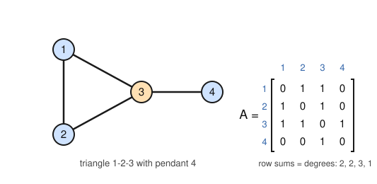
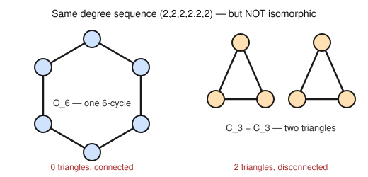

# Graph Theory · Lesson 1.2: Representing graphs — adjacency, isomorphism & special families

> ⏱ ~15 min · Module 1: Foundations, paths & connectivity · Builds on: [1.1](01-01-degree-and-handshake-lemma.md) · Unlocks: [1.3](01-03-walks-paths-connectivity.md)

## Why this matters

A drawing of a graph is a lie of convenience: the *positions* of the dots carry no information, only *which dots are joined* does. So the same graph has infinitely many pictures, and two innocent-looking drawings can be the very same object — or subtly different ones. To compute with graphs (and every algorithm you'll meet later does) you need a representation a machine can hold: a **matrix** or a **list**. And to compare graphs you need a language for "same shape, different labels" — **isomorphism** — plus cheap tests that shout *"not the same!"* without checking every relabeling. That test-for-difference is the daily workhorse: it's how you know a molecule is new, a circuit was miswired, or two social networks aren't secretly identical.

## The idea

One graph, three faces. Take a small network and you can hold it as:

- a **picture** — good for human intuition, useless to a computer;
- an **adjacency list** — for each vertex, who its neighbors are (compact when edges are few);
- an **adjacency matrix** — a grid of 0s and 1s, entry $(i,j)$ saying "is $i$ joined to $j$?" (fast to query, and — the punchline of Module 5 — an actual matrix you can take eigenvalues of).

Learning to slide between the three is the whole first skill of the lesson.

The second skill is *comparison*. If I hand you two graphs, "are they the same?" can't mean "identical labels" — relabeling the dots mustn't matter. It means: is there a **relabeling** that turns one edge-set exactly into the other? That's **isomorphism**. Checking it head-on is expensive, so we lean on **invariants** — quantities every isomorphism must preserve (how many edges, the list of degrees, how many triangles). If two graphs disagree on any invariant, they're instantly, certifiably *not* isomorphic. The catch, which you must internalize: invariants can only ever say "no." Agreeing on all of them is **not** a guarantee of "yes."

## The formal version

Throughout, $G = (V, E)$ is a **simple** graph: $V$ its vertices, $E$ a set of unordered pairs (edges), no loops, no repeats. Write $n = \lvert V\rvert$ and $m = \lvert E\rvert$.

**Adjacency matrix.** Fix an ordering $v_1, \dots, v_n$ of the vertices. The adjacency matrix is the $n \times n$ matrix $A$ with
$$A_{ij} = \begin{cases} 1 & v_iv_j \in E, \\ 0 & \text{otherwise.} \end{cases}$$
*In words:* a grid whose $(i,j)$ cell is 1 exactly when vertex $i$ and vertex $j$ are joined. For a simple graph $A$ is **symmetric** ($A_{ij} = A_{ji}$, edges have no direction) with **zero diagonal** ($A_{ii} = 0$, no loops). The $i$-th **row sum** is $\deg(v_i)$ — the matrix already knows Lesson 1.1's degrees.

**Adjacency list.** For each vertex, the set (or list) of its neighbors: $N(v) = \{u : uv \in E\}$. Storing $G$ this way costs about $n + 2m$ numbers instead of $n^2$ — the right choice for the *sparse* graphs (few edges) that dominate applications.

**Isomorphism.** Graphs $G$ and $H$ are **isomorphic**, written $G \cong H$, if there is a bijection $\varphi : V(G) \to V(H)$ such that
$$uv \in E(G) \iff \varphi(u)\varphi(v) \in E(H).$$
*In words:* a perfect renaming of the vertices that carries edges exactly onto edges (and non-edges onto non-edges). Isomorphic graphs are "the same graph wearing different name tags."

**Invariant.** A quantity $f(G)$ with $f(G) = f(H)$ whenever $G \cong H$. Reliable ones: the vertex count $n$, the edge count $m$, the **degree sequence** (the multiset of all degrees, usually written in sorted order), and the **triangle count** (number of 3-cliques). The last is readable straight from the matrix: the number of triangles is $\tfrac{1}{6}\operatorname{tr}(A^3)$, since $(A^3)_{ii}$ counts closed walks of length 3 out of $v_i$, and each triangle is counted twice at each of its three corners.

**The one non-negotiable caution.** Equal invariants are **necessary but not sufficient** for isomorphism. Two graphs can match on $n$, $m$, and the full degree sequence and still be different — see the Picture-free demo in the worked examples.

**Subgraph.** $H$ is a **subgraph** of $G$ if $V(H) \subseteq V(G)$ and $E(H) \subseteq E(G)$. If $H$ keeps *every* edge of $G$ between the vertices it retains, it's an **induced** subgraph. (Triangles above are just $K_3$ subgraphs.)

**Complement.** The complement $\bar G$ has the same vertices as $G$, and $uv$ is an edge of $\bar G$ **iff** $uv$ is *not* an edge of $G$. Every pair is an edge of exactly one of $G, \bar G$, so
$$m(G) + m(\bar G) = \binom{n}{2}.$$
*In words:* $\bar G$ is $G$ with "joined" and "not joined" swapped.

**Special families** (the ones you'll name reflexively):

| Family | Vertices | Edges | Each degree | What it is |
|---|---|---|---|---|
| $K_n$ (complete) | $n$ | $\binom{n}{2}$ | $n-1$ | every pair joined |
| $P_n$ (path) | $n$ | $n-1$ | $1$ or $2$ | a single line of vertices |
| $C_n$ (cycle, $n\ge 3$) | $n$ | $n$ | $2$ | a single closed loop |
| $K_{m,n}$ (complete bipartite) | $m+n$ | $mn$ | $n$ on one side, $m$ on the other | two groups, every cross-pair joined, none within a group |
| $Q_n$ (hypercube) | $2^n$ | $n\,2^{n-1}$ | $n$ | binary strings of length $n$; joined iff they differ in exactly one bit |

Two complements worth memorizing: $\overline{K_n}$ is the edgeless graph, and $\overline{K_{m,n}} = K_m \cup K_n$ (a disjoint $K_m$ and $K_n$ — you prove this in P3). The cube $Q_3$ is 8 vertices, all degree 3, and it's the star of Boss problem 1.

## Picture

The concrete graph below — a triangle on $\{1,2,3\}$ with a pendant vertex $4$, sometimes called the **paw** — shown beside its adjacency matrix. Trace the correspondence: vertex $3$ touches $1,2,4$, so row $3$ of $A$ is $1\;1\;0\;1$; the row sums down the side are exactly the degrees $2,2,3,1$.

As an adjacency list the same graph is $N(1)=\{2,3\}$, $N(2)=\{1,3\}$, $N(3)=\{1,2,4\}$, $N(4)=\{3\}$ — the two representations carry identical information.

## Worked examples

**Example 1 (mechanical — read the invariants off the matrix).** Using the paw's matrix
$$A = \begin{bmatrix} 0&1&1&0 \\ 1&0&1&0 \\ 1&1&0&1 \\ 0&0&1&0 \end{bmatrix},$$
extract everything at a glance. Row sums give the **degree sequence** $(1,2,2,3)$ (sorted); summing them, $1+2+2+3 = 8 = 2m$, so $m = 4$ edges — the handshake lemma of Lesson 1.1, now just "add up the rows." The diagonal is all zeros (simple graph) and $A$ is symmetric across it (undirected). For the **triangle count**, we need $\tfrac16\operatorname{tr}(A^3)$; rather than cube a matrix by hand, note the only way to close a 3-step walk is around a mutual triangle, and here $\{1,2,3\}$ is the sole triangle, so the count is $1$ — consistent with $\tfrac16\operatorname{tr}(A^3)$ since that trace must equal $6$.

**Example 2 (why you'd care — invariants only ever say "no").** Consider two graphs on 6 vertices, each **2-regular** (every degree $=2$), so both have the identical degree sequence $(2,2,2,2,2,2)$ and, by handshake, $m = 6$ edges:

They tie on vertex count, edge count, **and** the entire degree sequence — the three checks a beginner runs first. Yet they are **not** isomorphic, and two finer invariants prove it. *Triangle count:* $C_6$ has $0$ triangles, the two-triangle graph has $2$; no relabeling can invent triangles, so no $\varphi$ exists. *Connectivity* (Lesson 1.3): $C_6$ is one connected piece, the other is two — also isomorphism-invariant. This is the lesson's load-bearing warning made concrete: **matching invariants never certify "yes."** To actually prove $G \cong H$ you must exhibit the bijection $\varphi$ and check it edge-by-edge (as in P2) — invariants only ever license a fast, certain "no."

## Watch out

- You might think a shared degree sequence means "isomorphic" — but it's only a *screening* test. $C_6$ and $C_3 \cup C_3$ above share every basic invariant and are still different graphs. Invariants prove *difference*, never *sameness*.
- You might think a graph *has* an adjacency matrix — it has one *per vertex ordering*. Relabel the vertices and rows/columns get permuted: $A \mapsto PAP^{\mathsf T}$ for a permutation matrix $P$. Two matrices describe isomorphic graphs exactly when they're **permutation-similar** in this way, which is why $A$'s eigenvalues (unchanged by $P A P^{\mathsf T}$) are invariants — the hook into Module 5.
- You might slip on family sizes. Fix them once: $P_n$ has $n$ vertices and $n-1$ edges (endpoints have degree 1); $C_n$ has $n$ vertices and $n$ edges (all degree 2). And $\bar G$ shares $G$'s vertex set — the complement never adds or removes dots, only flips edges.

## One-liner

> A graph is one object with three faces — picture, list, matrix; isomorphism asks whether two faces are secretly the same graph, and invariants are the quick, one-directional "no."

## Problems

**P1 (🟢)** Let $G = C_4$, the 4-cycle on vertices $1,2,3,4$ with edges $\{12, 23, 34, 41\}$. (a) Write its adjacency matrix (order $1,2,3,4$) and its adjacency list. (b) State the degree sequence and, via the handshake sum, the edge count.

**P2 (🟡)** Let $G = P_4$, the path on $1,2,3,4$ with edges $\{12, 23, 34\}$. Build the complement $\bar G$ (list its edges), observe it is again a path, and **exhibit an explicit isomorphism** $\varphi : G \to \bar G$ — i.e. $P_4$ is *self-complementary*. Check your $\varphi$ carries all three edges of $G$ onto edges of $\bar G$.

**P3 (🔴, optional)** (a) Using the handshake lemma from [Lesson 1.1](01-01-degree-and-handshake-lemma.md), show the hypercube $Q_n$ has exactly $n\,2^{n-1}$ edges. (b) Prove $\overline{K_{m,n}} = K_m \cup K_n$ (a disjoint union), and use it to re-derive $m(K_{m,n}) = mn$ from the complement identity $m(G) + m(\bar G) = \binom{n}{2}$.

Solutions

**P1** (a) With order $1,2,3,4$, each vertex is joined to its two cycle-neighbors:
$$A = \begin{bmatrix} 0&1&0&1 \\ 1&0&1&0 \\ 0&1&0&1 \\ 1&0&1&0 \end{bmatrix}, \qquad N(1)=\{2,4\},\ N(2)=\{1,3\},\ N(3)=\{2,4\},\ N(4)=\{1,3\}.$$
(b) Every row sums to $2$, so the degree sequence is $(2,2,2,2)$. Handshake: $\sum_v \deg(v) = 8 = 2m$, hence $m = 4$ — matching the four listed edges. (Aside: $\overline{C_4}$ has edges $\{13, 24\}$, the two "diagonals" — a perfect matching $2K_2$.)

**P2** The six possible pairs on $\{1,2,3,4\}$ are $12,13,14,23,24,34$. Removing $G$'s edges $\{12,23,34\}$ leaves
$$E(\bar G) = \{13,\ 14,\ 24\}.$$
In $\bar G$: vertex $1 \sim 3,4$; vertex $4 \sim 1,2$; vertex $3 \sim 1$; vertex $2 \sim 4$. Reading the degree-1 endpoints inward, $\bar G$ is the path $3\!-\!1\!-\!4\!-\!2$ — a $P_4$. Match $G$'s path order $1\!-\!2\!-\!3\!-\!4$ to $\bar G$'s path order $3\!-\!1\!-\!4\!-\!2$ position by position:
$$\varphi(1)=3,\quad \varphi(2)=1,\quad \varphi(3)=4,\quad \varphi(4)=2.$$
Check the three edges of $G$: $12 \mapsto \varphi(1)\varphi(2) = 31 \in E(\bar G)$; $23 \mapsto 14 \in E(\bar G)$; $34 \mapsto 42 \in E(\bar G)$. All three land on edges of $\bar G$; since $\varphi$ is a bijection and both graphs have exactly 3 edges, edges map onto edges and non-edges onto non-edges. Hence $G \cong \bar G$: $P_4$ is self-complementary. $\blacksquare$

**P3** (a) $Q_n$ has $2^n$ vertices (the binary strings of length $n$), and each is adjacent to exactly the $n$ strings differing from it in a single bit, so every degree is $n$. Handshake: $\sum_v \deg(v) = n \cdot 2^n = 2m$, giving $m = n\,2^{n-1}$. $\blacksquare$

(b) $K_{m,n}$ has parts $X$ ($\lvert X\rvert = m$) and $Y$ ($\lvert Y\rvert = n$); its edges are *precisely* the cross-pairs (one endpoint in each part). The complement is on the same $m+n$ vertices, with an edge exactly where $K_{m,n}$ had none — that is, all pairs *within* $X$ and all pairs *within* $Y$, and no cross-pairs. Those within-$X$ pairs form a $K_m$, the within-$Y$ pairs a $K_n$, with nothing between them: $\overline{K_{m,n}} = K_m \cup K_n$. $\blacksquare$
Counting edges of the complement, $m(\overline{K_{m,n}}) = \binom{m}{2} + \binom{n}{2}$. On $m+n$ vertices the identity $m(G) + m(\bar G) = \binom{m+n}{2}$ gives
$$m(K_{m,n}) = \binom{m+n}{2} - \binom{m}{2} - \binom{n}{2} = \frac{(m+n)(m+n-1) - m(m-1) - n(n-1)}{2} = mn,$$
confirming $K_{m,n}$ has $mn$ edges.

## Connections

- **Backward:** this rests directly on [Lesson 1.1](01-01-degree-and-handshake-lemma.md) — a degree is a row sum of $A$, and $\sum_v \deg(v) = 2m$ is just "total the matrix." The degree *sequence* is that lemma's data repackaged as an isomorphism invariant.
- **Forward:** [Lesson 1.3](01-03-walks-paths-connectivity.md) turns "connected vs. not" — the invariant that split $C_6$ from $C_3 \cup C_3$ — into the machinery of walks and components, where $(A^k)_{ij}$ counts walks of length $k$. The families named here recur as headline actors: $K_5$ and $K_{3,3}$ are the two obstructions to planarity (Module 3), and $Q_3$ is Boss problem 1.
- **Sideways (linear algebra):** the adjacency matrix is a genuine real *symmetric* matrix, isomorphism is permutation-similarity $A \mapsto PAP^{\mathsf T}$, and its eigenvalues are isomorphism invariants — the bridge *adjacency matrix ↔ symmetric-matrix diagonalization* that opens Module 5 and leans on [linalg-refresher](../../linalg-refresher/syllabus.md). These same representations appear, computation-only, in [discrete-mathematics](../../discrete-mathematics/syllabus.md); here they become objects you prove theorems about.
