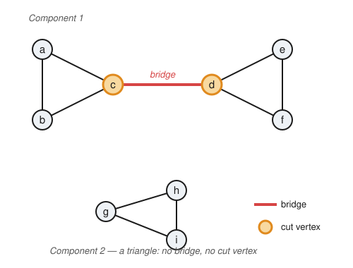

# Graph Theory · Lesson 1.3: Walks, paths, cycles, connectivity & components

> ⏱ ~15 min · Module 1: Foundations, paths & connectivity · Builds on: [Lesson 1.2](01-02-representing-graphs-isomorphism.md) · Unlocks: [Lesson 1.4](01-04-eulerian-hamiltonian.md)

## Why this matters

The single most-asked question about a network is *"can I get from here to there — and how far is it?"* Routing packets, tracing a rumor through a friend group, checking whether a circuit is one connected piece: all of it is reachability. This lesson makes "getting around" precise, splits any graph into its self-contained pieces (**components**), and pinpoints the single vertices and edges whose failure would cut the network in two. That last idea — a **cut vertex** or a **bridge** as a single point of failure — is the seed of connectivity, which grows into Menger's theorem and max-flow min-cut later in the course.

## The idea

Picture a graph as a subway map: vertices are stations, edges are tracks. A **walk** is any journey you could actually take — hop along edges, and you're allowed to double back through a station or ride a track twice. Now add discipline:

- **Trail** — a walk that never *reuses a track* (edge).
- **Path** — a walk that never *revisits a station* (vertex). Stricter: no repeated vertex forces no repeated edge, so every path is a trail.

A **cycle** is a path that loops back to where it started — a closed loop with no repeats except the shared endpoints. Two stations are in the same **component** if *some* journey connects them; a component is a maximal island of mutual reachability. The **distance** between two stations is the fewest hops on any route. And a **cut vertex** (or **bridge**) is the one station (or track) whose removal strands part of the map — the lone bridge between two boroughs.

The one lemma that makes all of this hang together: **if you can get there by any walk at all, you can get there by a path.** Wandering never buys you new reachability — you can always trim the wandering out.

## The formal version

Fix a graph $G=(V,E)$. A **walk** of length $k$ is a sequence $v_0 e_1 v_1 e_2 \cdots e_k v_k$ where each edge $e_i$ joins $v_{i-1}$ and $v_i$; its **length** is the number of edges $k$. It is a $u$–$v$ walk if $v_0=u$ and $v_k=v$.

- A **trail** is a walk with no repeated edge.
- A **path** is a walk with no repeated vertex.
- A **cycle** is a walk $v_0 v_1 \cdots v_k = v_0$ with $k \ge 3$, all of $v_0,\dots,v_{k-1}$ distinct. Its length is $k$.

*In words:* a walk lets you repeat anything, a trail forbids reusing an edge, a path forbids reusing a vertex, and a cycle is a path that closes up.

**Lemma (walk $\Rightarrow$ path).** *If there is a $u$–$v$ walk in $G$, then there is a $u$–$v$ path.*

*Proof (extremal — take a shortest walk).* Since a $u$–$v$ walk exists, among all $u$–$v$ walks choose one of **minimum length**, say $W = v_0 v_1 \cdots v_k$ with $v_0 = u$, $v_k = v$. I claim $W$ is a path. Suppose not: some vertex repeats, so $v_i = v_j$ for indices $i < j$. Delete the closed stretch between them and splice the ends together:
$$W' = v_0 \cdots v_i\, v_{j+1} \cdots v_k.$$
This is still a legal $u$–$v$ walk (the step from $v_i = v_j$ to $v_{j+1}$ was already an edge), but it is *shorter* than $W$ — contradicting minimality. So no vertex repeats, and $W$ is a $u$–$v$ path. $\blacksquare$

This lemma is exactly what lets "reachable" behave like an equivalence relation.

**Definition (connected, components).** Declare $u \sim v$ when there is a $u$–$v$ walk (equivalently, by the lemma, a $u$–$v$ path). This $\sim$ is an **equivalence relation**: *reflexive* (the length-$0$ walk $u$ reaches $u$), *symmetric* (reverse the walk), *transitive* (concatenate a $u$–$v$ walk with a $v$–$w$ walk). Its equivalence classes are the **connected components** of $G$. The graph is **connected** if it has exactly one component — every pair of vertices is joined by a path.

*In words:* the components are the maximal chunks in which everyone can reach everyone; "connected" means the whole graph is one such chunk.

**Definition (distance).** For $u,v$ in the same component, the **distance** $d(u,v)$ is the length of a shortest $u$–$v$ path; set $d(u,u)=0$, and $d(u,v)=\infty$ if they lie in different components.

*In words:* distance is the fewest edges you must cross to travel between two vertices. On a single component $d$ is a genuine metric — in particular $d(u,w) \le d(u,v) + d(v,w)$ (concatenate the two shortest paths into a walk, then apply the lemma).

**Definition (cut vertex, bridge).** Write $c(G)$ for the number of components of $G$. A vertex $v$ is a **cut vertex** (articulation point) if $c(G-v) > c(G)$. An edge $e$ is a **bridge** (cut edge) if $c(G-e) > c(G)$.

*In words:* deleting a cut vertex, or a bridge, breaks a connected piece into more pieces — it was the sole link holding them together.

## Picture

A graph with **two components**. In Component 1, the red edge $cd$ is the only route between the two triangles — a **bridge** — and its endpoints $c$ and $d$ (orange) are **cut vertices**: delete either and the graph falls into more pieces. Component 2 is a triangle, which has *no* bridge and *no* cut vertex — every pair still has a second route after any single deletion.

Read off the definitions: $c(G)=2$; a shortest $a$–$f$ path is $a\,c\,d\,f$, so $d(a,f)=3$; and $d(a,g)=\infty$ since $a,g$ sit in different components.

## Worked examples

**Example 1 (mechanical — shortcut a walk into a path).** In Component 1 above, consider the $a$–$e$ walk
$$W = a\, b\, c\, a\, c\, d\, e,$$
of length $6$. Vertex $a$ repeats (positions $0$ and $3$); splice it out to get $a\,c\,d\,e$. Vertex $c$ repeats in the original too — the trimmed route $a\,c\,d\,e$ now has no repeats, length $3$, and is a genuine $a$–$e$ path. Every detour we removed only shortened the trip: precisely the lemma in action. And $d(a,e)=3$, since any route must cross the lone bridge $cd$.

**Example 2 (why you'd care — the single point of failure).** Model a small office network where machines are vertices and cables are edges. If the graph has a **cut vertex**, that machine is a single point of failure: its outage partitions the network into groups that can no longer talk. In the figure, router $d$ is a cut vertex — if $d$ goes down, $\{e,f\}$ are severed from everyone else. The cable $cd$ is a bridge for the same reason: one cut and the office splits. The engineering takeaway is a graph fact — *a robust network should have no bridges and no cut vertices* (it should be "2-connected"), which is exactly the structure Component 2's triangle already has.

## Watch out

- You might think a *trail* and a *path* are the same thing, but a trail can revisit a **vertex** so long as it never repeats an **edge**. In the bowtie $a\,b\,c\,a\,d\,e\,a$ the middle $a$ is revisited — a legal trail, not a path.
- You might think "cut vertex" and "bridge" always come as a pair, but they don't. A bridge's two endpoints are cut vertices *only if each has another neighbor*; and a graph can have a cut vertex with **no** bridge at all (glue two triangles at a single shared vertex — that vertex is a cut vertex, yet every edge lies on a triangle, so no edge is a bridge).
- You might think $d(u,v)$ counts vertices, but it counts **edges**. A single edge $uv$ gives $d(u,v)=1$, and $d(u,u)=0$. Adjacent vertices are at distance $1$, never $2$.

## One-liner

> Reachability is an equivalence relation whose classes are the components, distance is the shortest path's edge-count, and a bridge or cut vertex is the lone link whose loss splits a piece in two.

## Problems

**P1 (🟢)** Let $H$ have vertices $\{1,2,3,4,5,6\}$ and edges $\{12,13,23,34,45,46,56\}$ (a triangle $1\,2\,3$, the edge $34$, then a triangle $4\,5\,6$). (a) Is $H$ connected? (b) Compute $d(1,5)$ and $d(1,6)$. (c) List every bridge and every cut vertex.

**P2 (🟡)** Prove: an edge $e=uv$ is a bridge **if and only if** $e$ lies on no cycle of $G$. *(This is the structural reason bridges and cycles are opposites.)*

**P3 (🔴, optional)** Prove: if every vertex of a finite simple graph $G$ has degree $\ge 2$, then $G$ contains a cycle. *(Hint: take a longest path and look at where an endpoint's neighbors can hide.)*

Solutions

**P1** (a) **Connected**: from vertex $1$ you can reach $2,3$ (triangle), then $4$ (edge $34$), then $5,6$ (triangle) — every vertex is reachable, so $c(H)=1$.

(b) A shortest $1$–$5$ route must cross the edge $34$ (the only link between the two triangles): $1\,3\,4\,5$ has length $3$, and nothing shorter exists, so $d(1,5)=3$. Likewise $1\,3\,4\,6$ gives $d(1,6)=3$.

(c) The edge $34$ is the only route between $\{1,2,3\}$ and $\{4,5,6\}$; deleting it leaves two components, so **$34$ is the unique bridge** (every other edge lies on a triangle, hence on a cycle — see P2). Deleting vertex $3$ severs $\{1,2\}$ from $\{4,5,6\}$, and deleting vertex $4$ severs $\{5,6\}$ from $\{1,2,3\}$, so the **cut vertices are $3$ and $4$**. Removing any of $1,2,5,6$ leaves a connected graph, so they are not cut vertices.

**P2** Let $e=uv$.

($\Leftarrow$, by contrapositive) Suppose $e$ is *not* a bridge. Then $u$ and $v$ still lie in the same component of $G-e$, so there is a $u$–$v$ path $P$ in $G-e$ (walk $\Rightarrow$ path lemma). $P$ avoids $e$, so appending $e$ closes it into a cycle $P + e$ through $e$. Hence $e$ lies on a cycle. Contrapositively: if $e$ is on no cycle, $e$ is a bridge.

($\Rightarrow$, by contrapositive) Suppose $e$ lies on a cycle $C$. Then $C - e$ is a $u$–$v$ path avoiding $e$, so $u,v$ stay connected in $G-e$. Moreover any walk that used $e$ can reroute along $C-e$, so **no** pair of vertices is disconnected by deleting $e$: we have $c(G-e)=c(G)$, i.e. $e$ is not a bridge. Contrapositively: if $e$ is a bridge, it lies on no cycle.

Together: $e$ is a bridge $\iff$ $e$ is on no cycle. $\blacksquare$

**P3** Because $G$ is finite it has only finitely many paths, so a **longest path** exists; call it $P = v_0 v_1 \cdots v_k$. Look at the endpoint $v_0$. Since $\deg(v_0) \ge 2$, $v_0$ has at least two neighbors. **Every** neighbor of $v_0$ must already lie on $P$: if $v_0$ had a neighbor $w \notin P$, then $w\, v_0 v_1 \cdots v_k$ would be a strictly longer path, contradicting maximality. So both of $v_0$'s (distinct) neighbors are among $v_1,\dots,v_k$; one of them is $v_1$, and there is a *second* neighbor $v_j$ with $j \ge 2$. Then
$$v_0\, v_1 \cdots v_j\, v_0$$
is a cycle (length $j+1 \ge 3$, no repeated interior vertex since $P$ is a path). Hence $G$ contains a cycle. $\blacksquare$

## Flashback

**From Lesson 1.1 (degree & the handshake lemma):** A chess club has $7$ members and wants to schedule a round of games so that **every member plays exactly $3$ others** (no pair plays twice). Model this as a graph and decide whether such a schedule can exist.

Solution

Let vertices be the $7$ members and edges the scheduled games; "plays exactly $3$ others" means every vertex has degree $3$. By the handshake lemma $\sum_v \deg(v) = 2\lvert E\rvert$, so the degree sum must be **even**. But here $\sum_v \deg(v) = 7 \cdot 3 = 21$, which is odd — impossible. Equivalently, a $3$-regular graph would have $7$ odd-degree vertices, yet the number of odd-degree vertices is always even. **No such schedule exists.** $\blacksquare$

## Connections

- **Backward:** the walk $\Rightarrow$ path lemma runs on the adjacency structure and special families from [Lesson 1.2](01-02-representing-graphs-isomorphism.md) — e.g. $C_n$ *is* a single cycle, $P_n$ *is* a single path, and $K_n$ has $d(u,v)=1$ for every pair.
- **Forward:** [Lesson 1.4](01-04-eulerian-hamiltonian.md) sharpens "traverse the graph" into two famous questions — cross every *edge* once (Euler trail) versus visit every *vertex* once (Hamiltonian cycle) — both requiring connectivity as a baseline. The bridge/cut-vertex idea grows into edge- and vertex-connectivity and, in Module 4, Menger's theorem and max-flow min-cut, where "how many independent routes exist" is answered by "how few links must you cut."
- **Sideways (proofs habits):** the lemma and P3 are textbook **extremal arguments** from [proofs-primer](../../proofs-primer/syllabus.md) — "take a shortest walk / a longest path, then show the extreme case can't misbehave" — the same move that will reappear for spanning trees and augmenting paths.
- **Sideways (CS):** components and distance are exactly what a breadth-first search computes; a future algorithms track turns this lesson's *why* into the *how fast*.
