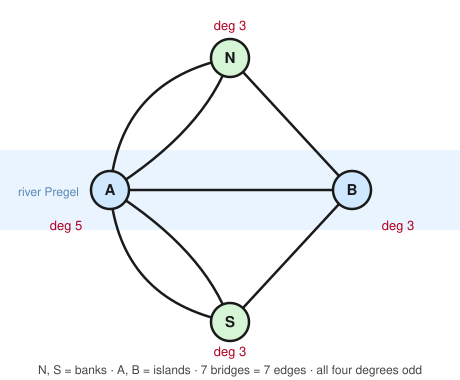

# Graph Theory · Lesson 1.4: Eulerian & Hamiltonian graphs

> ⏱ ~15 min · Module 1: Foundations, paths & connectivity · Builds on: [Lesson 1.3](01-03-walks-paths-connectivity.md) (walks, trails, connectivity) · Unlocks: [Module 2 · Trees](02-01-trees.md)

## Why this matters

Two questions sound almost identical: *can I trace every **edge** exactly once and return home?* and *can I visit every **vertex** exactly once and return home?* The first is the traversal problem Euler solved in 1736 to found the entire subject — and it has a one-line test you can run by counting on your fingers. The second, Hamilton's problem, has resisted a clean test for three centuries and is one of the canonical NP-hard problems: no efficient algorithm is known. This lesson is the story of that gap. It's the cleanest example in mathematics of two problems that *look* the same being worlds apart in difficulty — and it teaches you to never trust a superficial resemblance between "edge" and "vertex" versions of a question.

## The idea

Stand at a street corner in a town and try to walk every *street* exactly once, ending where you started. Every time you enter a corner you must also leave it — streets get used up in **entry–exit pairs**. So if a corner is going to work out, the number of streets meeting there had better be **even**: one to arrive, one to depart, over and over. That single observation is the whole secret. A closed edge-tour is possible exactly when the town is in one connected piece and *every* corner has an even number of streets.

Königsberg, 1736: a river, two islands, seven bridges (the **Picture** below). The townsfolk wondered whether you could stroll across all seven bridges once each and come home. Euler reduced the map to four dots (two banks, two islands) joined by seven edges and noticed **all four dots have odd degree**. Entry–exit pairing is impossible at an odd corner, so the walk cannot exist. No clever route was overlooked — a parity count killed every route at once.

Now change one word. Instead of every *bridge* once, visit every *land mass* once. Suddenly the finger-counting trick evaporates: there is no known way to certify "yes, such a tour exists" faster than, in the worst case, searching astronomically many orderings. Same-looking question, utterly different world.

## The formal version

Recall from [Lesson 1.3](01-03-walks-paths-connectivity.md): a **trail** is a walk with no repeated *edge*; it is **closed** if it starts and ends at the same vertex. Write $\deg(v)$ for the degree of vertex $v$ and $n = |V|$ for the number of vertices.

**Definitions (Eulerian).** An **Euler trail** is a trail that uses every edge of the graph exactly once. An **Euler circuit** is a closed Euler trail. A connected graph with an Euler circuit is called **Eulerian**.

*In words:* an Euler circuit is a single unbroken route that walks every edge once and returns home.

**Euler's Theorem.** Let $G$ be connected (ignoring isolated vertices).
- $G$ has an **Euler circuit** $\iff$ every vertex has **even** degree.
- $G$ has an **Euler trail but not a circuit** $\iff$ **exactly two** vertices have odd degree (the trail must start at one and end at the other).

*In words:* count the odd-degree vertices — zero means a closed tour exists, exactly two means an open one does, anything else means neither.

*(Why "exactly two" and never "exactly one"? By the handshake lemma from [Lesson 1.1](01-01-degree-and-handshake-lemma.md), the number of odd-degree vertices is always even — so $0, 2, 4, \dots$ are the only options.)*

**Proof of the easy direction (Euler circuit $\Rightarrow$ all degrees even).**
Suppose $G$ has an Euler circuit $C$. Fix any vertex $v$ and look at the moments $C$ passes *through* $v$. Each such visit consists of an edge arriving at $v$ and an edge departing from $v$ — two distinct edges, paired. For the start/end vertex the very first departing edge and the very last arriving edge form one more such pair, because the circuit closes up. Since $C$ uses every edge **exactly once**, every edge incident to $v$ belongs to exactly one of these entry–exit pairs. The edges at $v$ are thus partitioned into pairs, so $\deg(v)$ is even. As $v$ was arbitrary, every degree is even. $\blacksquare$

**Converse (sketch).** Suppose $G$ is connected with all degrees even. Start anywhere and keep walking along unused edges. You can never get *stuck* at a vertex other than your start: arriving at $v$ uses one edge and, since $\deg(v)$ is even, an unused edge always remains to leave by — so the walk only halts on returning to the start, giving a **closed trail** $C_0$. If $C_0$ misses some edges, connectivity guarantees a vertex $w$ on $C_0$ that still has unused edges; grow a second closed trail from $w$ and **splice** it into $C_0$ at $w$. Repeat until every edge is absorbed. The result is an Euler circuit. (This constructive splicing is *Hierholzer's algorithm*.) The two-odd-vertex case follows by adding a temporary edge between the two odd vertices, finding a circuit, then deleting that edge to leave an open Euler trail. $\blacksquare$

Now the deceptively similar vertex problem.

**Definitions (Hamiltonian).** A **Hamiltonian path** is a path (no repeated *vertex*) visiting every vertex. A **Hamiltonian cycle** is such a path that also closes into a cycle. A graph with a Hamiltonian cycle is **Hamiltonian**.

*In words:* a Hamiltonian cycle is a loop that hits every vertex exactly once.

Here is the punchline: **there is no known clean characterization.** Deciding whether a graph is Hamiltonian is **NP-hard** — no efficient (polynomial-time) test is known, and finding one would resolve the P vs NP problem. What we *do* have are one-directional crutches: conditions guaranteeing a Hamiltonian cycle exists, that say nothing when they fail.

**Dirac's Theorem (1952).** If $G$ is simple, $n \ge 3$, and every vertex satisfies $\deg(v) \ge n/2$, then $G$ is Hamiltonian.

**Ore's Theorem (1960).** If $G$ is simple, $n \ge 3$, and $\deg(u) + \deg(v) \ge n$ for **every pair of non-adjacent** vertices $u, v$, then $G$ is Hamiltonian.

*In words:* if a graph is "dense enough" — high individual degree (Dirac), or high degree summed over any non-neighbors (Ore) — it must contain a Hamiltonian cycle. Ore generalizes Dirac (if every degree is $\ge n/2$, any two of them sum to $\ge n$).

**These are SUFFICIENT, never NECESSARY.** A graph can be Hamiltonian and fail both wildly: the cycle $C_{100}$ is a Hamiltonian cycle *by definition*, yet every vertex has degree $2 \ll 50 = n/2$. So when Dirac or Ore fires, you're done; when it doesn't, you've learned **nothing** — you must go hunt for a cycle or prove none exists by hand. That asymmetry is exactly what makes Hamilton's problem hard and Euler's easy.

## Picture

The Königsberg bridges, stripped to a multigraph. Two river banks $N$, $S$ and two islands $A$, $B$; each bridge is one edge (parallel edges are drawn as separate curves). Degrees are $\deg A = 5$, $\deg B = \deg N = \deg S = 3$ — **all four odd**. By Euler's theorem the town admits neither an Euler circuit nor even an Euler trail: you'd need $0$ or $2$ odd vertices, and Königsberg has $4$.

(Check the handshake lemma: $5 + 3 + 3 + 3 = 14 = 2 \times 7$ edges. ✓)

## Worked examples

**Example 1 (mechanical — run the Euler test).** Classify each connected graph as having an Euler *circuit*, an Euler *trail only*, or *neither*, by counting odd-degree vertices.

- $K_5$ (complete graph, $5$ vertices): every vertex has degree $4$ — all even. **Euler circuit.**
- $K_4$: every vertex has degree $3$ — four odd vertices. Four is neither $0$ nor $2$: **neither.**
- $K_{2,3}$ (complete bipartite, parts of size $2$ and $3$): the two vertices in the size-$2$ part have degree $3$ (odd); the three in the size-$3$ part have degree $2$ (even). Exactly **two** odd vertices $\Rightarrow$ **Euler trail only**, and it must start at one degree-$3$ vertex and end at the other.

No route-hunting required — the whole classification is a degree count.

**Example 2 (why you'd care — Dirac at the boundary).** Does $K_{3,3}$ (complete bipartite, both parts size $3$) have a Hamiltonian cycle? Here $n = 6$ and every vertex has degree $3$. Dirac needs $\deg(v) \ge n/2 = 3$, and $3 \ge 3$ holds (the bound is inclusive), so Dirac **guarantees** a Hamiltonian cycle without any search. And indeed, labelling the parts $x_1,x_2,x_3$ and $y_1,y_2,y_3$,
$$x_1 \to y_1 \to x_2 \to y_2 \to x_3 \to y_3 \to x_1$$
visits all six vertices once and closes up. Notice Dirac told us the answer *before* we found the route — that's the power of a sufficient condition, when you're lucky enough that it applies.

## Watch out

- **You might think one odd-degree vertex could give an Euler trail — impossible.** The handshake lemma forces an *even* number of odd vertices, so the only cases are $0$ (circuit), $2$ (open trail), or $\ge 4$ (nothing). Never "exactly one" or "exactly three."
- **You might think Dirac failing means *not* Hamiltonian — it means nothing.** Dirac and Ore are one-way guarantees. $C_n$ has minimum degree $2$ and is Hamiltonian; a dense-looking graph can also fail Dirac yet still have a cycle. When the condition doesn't fire, you have zero information and must reason directly.
- **You might conflate "Euler" and "Hamiltonian" because both mean 'tour everything once.'** Euler = every **edge** once (repeat vertices freely); Hamiltonian = every **vertex** once (skip edges freely). A graph can be one and not the other. They are different problems with wildly different difficulty — that contrast is the entire lesson.

## One-liner

> Walking every *edge* once is a parity count you can do on your fingers (all-even $\Rightarrow$ Euler circuit); visiting every *vertex* once has no such shortcut — Dirac and Ore only ever say "yes," never "no."

## Problems

**P1 (🟢)** For each connected graph, state whether it has an Euler circuit, an Euler trail only, or neither, and justify by counting odd-degree vertices: (a) the cycle $C_6$; (b) the complete graph $K_6$; (c) the "bowtie" — two triangles $abc$ and $cde$ sharing only the vertex $c$.

**P2 (🟡)** The 3-cube $Q_3$ has $8$ vertices, each of degree $3$ (see the Module 1 boss problem). (a) Does $Q_3$ have an Euler circuit or trail? (b) Apply Dirac's condition to $Q_3$ — does it decide Hamiltonicity? (c) A Hamiltonian cycle of $Q_3$ is exactly a *Gray code* on $3$ bits; write one out as a cycle of binary strings.

**P3 (🔴)** Show that $K_{2,3}$ — which by Example 1 *does* have an Euler trail — has **no** Hamiltonian cycle. (Hint: a cycle in a bipartite graph must alternate between the two parts. What does that force about the part sizes?) Then connect this back to Dirac: does Dirac's condition apply to $K_{2,3}$?

Solutions

**P1** Count odd-degree vertices in each.
- (a) $C_6$: every vertex has degree $2$ (even). Zero odd vertices $\Rightarrow$ **Euler circuit** (the cycle itself).
- (b) $K_6$: every vertex has degree $5$ (odd) — that's six odd vertices. Six is not $0$ or $2$ $\Rightarrow$ **neither**. (General fact: $K_n$ is Eulerian iff $n$ is odd, so that every degree $n-1$ is even.)
- (c) Bowtie: degrees are $\deg(a)=\deg(b)=\deg(d)=\deg(e)=2$ and the shared vertex $\deg(c)=4$ — **all even**, and the graph is connected $\Rightarrow$ **Euler circuit** (e.g. $a\to b\to c\to d\to e\to c\to a$, using each of the $6$ edges once).

**P2** (a) Every degree is $3$, odd, so all $8$ vertices are odd. That's far more than $2$ $\Rightarrow$ **no Euler circuit and no Euler trail.** (b) Dirac needs $\deg(v)\ge n/2 = 8/2 = 4$, but every degree is $3 < 4$, so Dirac **does not apply** — it gives *no information* (neither confirms nor denies). (c) Label vertices by their $3$-bit strings; a Gray-code Hamiltonian cycle, changing one bit per step and returning to the start, is
$$000 \to 001 \to 011 \to 010 \to 110 \to 111 \to 101 \to 100 \to 000.$$
All eight strings appear once and consecutive strings differ in a single bit (i.e. are adjacent in $Q_3$), so this is a Hamiltonian cycle. Thus $Q_3$ is Hamiltonian even though Dirac stayed silent — a textbook case of a sufficient condition failing on a graph that nonetheless has the property.

**P3** Suppose $K_{2,3}$ had a Hamiltonian cycle. In a bipartite graph with parts $X$ (size $2$) and $Y$ (size $3$), every edge joins $X$ to $Y$, so any cycle must **alternate** $X, Y, X, Y, \dots$ and — to close up — use *equally many* vertices from each part. A Hamiltonian cycle uses all $5$ vertices, which would require $|X| = |Y|$; but $|X| = 2 \ne 3 = |Y|$. Contradiction, so **no Hamiltonian cycle exists**. Dirac: here $n = 5$, so Dirac needs $\deg(v) \ge 2.5$, i.e. $\ge 3$. The three vertices in $Y$ have degree $2 < 3$, so **Dirac does not apply** — consistent with the truth that no cycle exists. (This unbalanced-bipartite obstruction is also *why* Dirac insists on the full $n/2$ and not $(n-1)/2$: $K_{m,m+1}$ has minimum degree $m = (n-1)/2$ yet is never Hamiltonian.)

## Flashback

**From [Lesson 1.3](01-03-walks-paths-connectivity.md) (connectivity, cut vertices & bridges):** Consider the "bowtie-with-a-bridge" graph on vertices $\{a,b,c,d,e,f\}$ with edges
$$ab,\ bc,\ ca \quad(\text{triangle } abc), \qquad cd \quad(\text{a link}), \qquad de,\ ef,\ fd \quad(\text{triangle } def).$$
Find **all cut vertices** and **all bridges** of this graph. (Recall: deleting a cut vertex increases the number of connected components; a bridge is an edge whose deletion does the same.)

Solution

The graph is two triangles $abc$ and $def$ joined only through the single edge $cd$.

**Cut vertices:** $c$ and $d$. Deleting $c$ removes it and its edges, leaving $\{a,b\}$ (still joined by edge $ab$) completely separated from $\{d,e,f\}$ — that's $2$ components where there was $1$, so $c$ is a cut vertex. By the mirror-image argument, deleting $d$ separates $\{a,b,c\}$ from $\{e,f\}$, so $d$ is a cut vertex too. No other vertex is: deleting $a$ (or $b$, $e$, $f$) leaves the rest connected, since each lives on a triangle whose other two vertices stay linked and the $c$–$d$ bridge is untouched.

**Bridges:** only $cd$. Deleting $cd$ splits the graph into the two triangles $\{a,b,c\}$ and $\{d,e,f\}$ — two components — so $cd$ is a bridge. Every other edge lies on a triangle (a cycle), and deleting one edge of a cycle leaves its endpoints connected by the other two edges, so no triangle edge is a bridge.

**Answer:** cut vertices $\{c, d\}$; bridges $\{cd\}$.

## Connections

- **Backward:** the whole Euler test is powered by the handshake lemma of [Lesson 1.1](01-01-degree-and-handshake-lemma.md) (odd-degree vertices come in even numbers) and the trail/connectivity language of [Lesson 1.3](01-03-walks-paths-connectivity.md). Euler's theorem is Module 1's first "characterization" — a clean iff — and the standard to which later theorems are compared.
- **Forward:** [Module 2](02-01-trees.md) opens with **trees**, the graphs so sparse they have *no* cycles at all — the opposite extreme from the cycle-rich Hamiltonian question. The bipartite parity idea used in P3 returns in force in Lesson 2.3 (Hall's matching theorem), and the "sufficient vs. necessary" habit trained here recurs every time we meet a one-directional bound.
- **Sideways (complexity / CS):** the Euler-vs-Hamilton split is the textbook first example of the P-vs-NP divide — Euler circuits are decidable in linear time, Hamiltonian cycles are NP-hard. The future algorithms track (`algorithms`) picks up exactly here: Hierholzer's algorithm for the easy problem, and the theory of intractability for the hard one.
