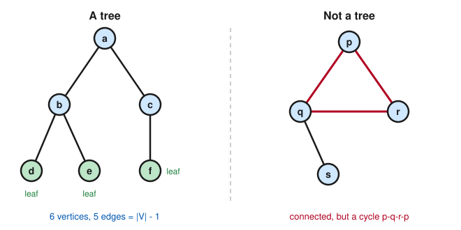

# Graph Theory · Lesson 2.1: Trees and their many faces

> ⏱ ~15 min · Module 2: Trees & matchings · Builds on: [Lesson 1.3](01-03-walks-paths-connectivity.md), [Lesson 1.4](01-04-eulerian-hamiltonian.md) · Unlocks: [Lesson 2.2](02-02-spanning-trees-mst.md)

## Why this matters

A tree is the leanest possible connected graph: hold it together with even one fewer edge and it falls into pieces; add even one edge and it grows a cycle. That "just barely connected" balance is why trees are the skeleton of almost everything computational — file systems, parse trees, the search trees in a database, the call tree of a recursive program, and (next lesson) the *spanning tree* that a network shrinks down to when it wants a cheapest backbone. The magic is that "tree" has half a dozen definitions that all describe the same object, so you can pick whichever one makes your proof fall out.

## The idea

Picture a family tree or a river with its tributaries: everything is connected, and there's exactly *one* way to trace back from any point to any other — no loops, no shortcuts, no redundancy. That's a tree. Two words carry the whole concept:

- **Connected** — you can get from any vertex to any other (Lesson 1.3).
- **Acyclic** — there are no cycles; you never return to where you started without backtracking.

Connectivity is the minimum needed to hold the graph together; acyclicity is the demand that *nothing be wasted*. A tree sits exactly at that razor's edge, and the razor's edge has a numeric signature you'll use constantly: **a tree on $n$ vertices has exactly $n-1$ edges** — the fewest that can possibly connect $n$ things.

The vertices at the very tips — degree exactly 1 — are called **leaves**, and every tree worth the name has at least two of them. Leaves are the handle you grab to prove things by induction: snip one off, and what's left is a smaller tree.

## The formal version

**Definition (tree, leaf, forest).** A **tree** is a connected acyclic graph. A vertex of degree $1$ is a **leaf**; a vertex of degree $\ge 2$ is **internal**. A graph whose every component is a tree (acyclic but not necessarily connected) is a **forest**.

*In words:* a tree is one connected piece with no loops; a forest is a bunch of trees sitting side by side.

Here is the payoff — the reason trees feel so rigid. For a graph $G$ on $n$ vertices, **all of the following say exactly the same thing**:

**Theorem (equivalent characterizations of a tree).** The following are equivalent.
1. $G$ is connected and acyclic (a tree).
2. $G$ is connected and $\lvert E\rvert = n-1$.
3. $G$ is acyclic and $\lvert E\rvert = n-1$.
4. Between every pair of vertices there is a **unique** path.
5. $G$ is connected, but deleting any single edge disconnects it (**every edge is a bridge**).
6. $G$ is acyclic, but adding any single new edge creates a cycle (**maximally acyclic**).

*In words:* connected-with-no-loops, connected-with-exactly-$n{-}1$-edges, loop-free-with-$n{-}1$-edges, exactly-one-path-between-any-two-vertices, can't-lose-an-edge, and can't-gain-an-edge are six descriptions of one and the same object.

We won't grind through all $6\times 5$ implications — that's a rite of passage you can do on your own. We prove the two facts everything else leans on: that a tree *has* leaves, and that it has exactly $n-1$ edges.

**Lemma (every tree with $n\ge 2$ vertices has at least two leaves).**

*Proof (longest-path argument).* $G$ is finite, so among all paths it contains there is a **longest** one; call it $P = v_0 v_1 \cdots v_k$. Since $n\ge 2$ and $G$ is connected, $P$ has at least one edge, so $k\ge 1$ and the endpoints $v_0, v_k$ are distinct. We claim each endpoint is a leaf. Suppose $v_0$ had a second neighbor $w \neq v_1$.

- If $w$ lies **off** $P$, then $w\,v_0 v_1 \cdots v_k$ is a *longer* path — contradicting the maximality of $P$.
- If $w$ lies **on** $P$, say $w = v_j$ with $j \ge 2$, then the edge $v_0 v_j$ closes the cycle $v_0 v_1 \cdots v_j v_0$ — contradicting acyclicity.

Both cases are impossible, so $v_0$ has no second neighbor: $\deg(v_0) = 1$. The identical argument at the other end gives $\deg(v_k) = 1$. Two distinct leaves. $\blacksquare$

**Theorem (the edge count).** A tree on $n$ vertices has exactly $n-1$ edges.

*Proof (induction on $n$, by removing a leaf).*
**Base case** $n=1$: the only tree is a lone vertex, with $0 = 1-1$ edges. ✓
**Inductive step:** assume every tree on $n-1$ vertices has $n-2$ edges, and let $T$ be a tree on $n \ge 2$ vertices. By the Lemma, $T$ has a leaf $\ell$. Delete $\ell$ together with its single incident edge to form $T' = T - \ell$, a graph on $n-1$ vertices. Then $T'$ is still a tree:
- **still acyclic** — deleting a vertex can never create a cycle;
- **still connected** — any path in $T$ between two surviving vertices could never have routed *through* the degree-$1$ vertex $\ell$ (you'd enter $\ell$ and be stuck), so every such path survives intact.

By the inductive hypothesis $\lvert E(T')\rvert = (n-1) - 1 = n-2$. Restoring $\ell$ puts back exactly one edge, so $\lvert E(T)\rvert = (n-2) + 1 = n-1$. $\blacksquare$

**Rooted trees.** Single out one vertex as the **root**. Now every other vertex has a well-defined *parent* (its neighbor one step closer to the root along the unique path there) and possibly several *children*; the leaves are exactly the childless vertices. Rooting doesn't change the graph — it just imposes a top-down hierarchy, which is precisely what turns an abstract tree into a data structure you can recurse on.

**Cayley's formula (stated).** The number of distinct **labeled** trees on $n$ vertices — trees whose vertices wear the fixed name tags $1, 2, \dots, n$ — is
$$
\boxed{\,n^{\,n-2}\,}.
$$
So there are $4^{2} = 16$ labeled trees on $4$ vertices and $5^{3} = 125$ on $5$. The proof is a gem, but we defer it to [Lesson 5.2](05-02-laplacian-matrix-tree.md), where the Matrix–Tree theorem drops it out as a determinant.

## Picture

On the **left**, a genuine tree: $6$ vertices, $5 = \lvert V\rvert - 1$ edges, one path between any two vertices, and three leaves ($d, e, f$) marked green. On the **right**, a non-example — it's connected, but the triangle $p\,q\,r\,p$ is a cycle, so there are *two* different $p$-to-$r$ paths and the graph carries a redundant edge. Snip any one edge of that triangle and it becomes a tree.

## Worked examples

**Example 1 (reading the edge count both ways).** A connected graph $G$ has $12$ vertices and $11$ edges. Is it a tree? Yes: characterization (2) says connected $+\ \lvert E\rvert = n-1$ is enough, and $11 = 12 - 1$. No need to hunt for cycles — the count guarantees there are none. Conversely, a tree with $30$ leaves and $17$ internal vertices has $n = 47$ vertices, hence exactly $46$ edges, and (handshake, Lesson 1.1) total degree $\sum_v \deg(v) = 2\lvert E\rvert = 92$.

**Example 2 (why the razor's edge matters — spanning backbones).** Take any connected network $G$ with $n$ vertices — say a LAN with redundant cabling. Its cheapest connected sub-network keeps all $n$ vertices but throws away every edge it can without disconnecting anything. By characterization (5), the result is a graph where *no* edge can be removed — a **spanning tree**, with exactly $n-1$ edges. That's the entire premise of the next lesson: connectivity costs $n-1$ edges and not a wire more, so the question becomes *which* $n-1$ to keep. Trees are what "no redundancy" looks like.

## Watch out

- You might think any graph with $n-1$ edges is a tree — but $n-1$ edges alone guarantees nothing. Take a triangle plus two isolated vertices: $n=5$, edges $=3 = n-2$… that's a forest, not a tree, and a triangle plus a separate single edge on $5$ vertices has $4 = n-1$ edges yet is disconnected *and* contains a cycle. You need $n-1$ edges **plus** one of {connected, acyclic}; either one drags the other along, but never assume it from the count alone.
- You might think "every tree has a root." A tree is just a connected acyclic graph — rootless. *Rooting* is an extra choice you impose; the same tree can be rooted at any of its $n$ vertices, giving $n$ different parent–child hierarchies over one unchanging graph.
- You might think a tree could have exactly one leaf. Impossible for $n\ge 2$: the longest-path argument always hands you *two* distinct degree-$1$ endpoints. (A one-vertex tree has zero leaves, and every larger tree has at least two.)

## One-liner

> A tree is connectivity with nothing to spare: $n$ vertices, exactly $n-1$ edges, one path between any two points — lose an edge and it breaks, add one and it loops.

## Problems

**P1 (🟢)** (a) A tree has $41$ vertices. How many edges does it have, and what is the sum of all its vertex degrees? (b) A graph $G$ has $8$ vertices and $7$ edges. If you are told $G$ is connected, must it be a tree? If instead you are told $G$ contains a cycle, must it be disconnected?

**P2 (🟡)** Prove that if $u$ and $v$ are two non-adjacent vertices of a tree $T$, then adding the edge $uv$ creates **exactly one** cycle. (Hint: characterization (4).)

**P3 (🔴, optional)** Let $\Delta$ be the maximum degree of a tree $T$. Prove that $T$ has at least $\Delta$ leaves. (Hint: delete a maximum-degree vertex and count what falls off.)

Solutions

**P1** (a) Edges $= n - 1 = 41 - 1 = 40$. By the handshake lemma $\sum_v \deg(v) = 2\lvert E\rvert = 2\cdot 40 = 80$.

(b) *Connected?* Yes, it must be a tree: here $\lvert E\rvert = 7 = 8 - 1 = n-1$, and characterization (2) — connected together with $\lvert E\rvert = n-1$ — is one of the equivalent definitions of a tree. *Has a cycle?* Yes, it must be disconnected. Among a graph with $\lvert E\rvert = n-1$, being a tree is equivalent to being acyclic *and* to being connected (characterizations (2) and (3) both pin down the same object at $n-1$ edges). A graph with a cycle is not acyclic, hence not a tree, hence — since it still has $n-1$ edges — it cannot be connected either. So it is disconnected. (Concretely: a $7$-edge graph on $8$ vertices that spends edges forming a cycle has too few left over to reach every vertex.)

**P2** Since $T$ is a tree, characterization (4) gives a **unique** path $P$ from $u$ to $v$ inside $T$. Adjoining the new edge $uv$ to $P$ closes a cycle $C$ — so at least one cycle appears.

Now suppose $C'$ is *any* cycle in $T + uv$. Because $T$ itself is acyclic, $C'$ must use the only new edge, $uv$; deleting that edge from $C'$ leaves a path from $u$ to $v$ lying entirely in $T$. But $T$ has only *one* $u$–$v$ path, namely $P$. Hence $C' = P + uv = C$. Exactly one cycle. $\blacksquare$

**P3** Let $v$ be a vertex of maximum degree $\Delta$, with neighbors $u_1, \dots, u_\Delta$. Delete $v$; the remaining graph $T - v$ splits into **exactly $\Delta$ components**, one containing each $u_i$. (Why distinct? If $u_i$ and $u_j$ landed in the same component there would be a $u_i$–$u_j$ path avoiding $v$, while $u_i\,v\,u_j$ is a $u_i$–$u_j$ path *through* $v$ — two different paths, contradicting the unique-path property of the tree.)

Each component $C_i$ is itself a tree (a connected acyclic subgraph). Consider what it contributes:
- If $C_i$ is a single vertex, that vertex is $u_i$, whose only neighbor in $T$ was $v$; so $\deg_T(u_i) = 1$ — a leaf of $T$.
- If $C_i$ has $\ge 2$ vertices, then by the Lemma it has at least two leaves *of its own*. At most one of them can be $u_i$ (the one vertex of $C_i$ adjacent to $v$); pick a leaf $w \neq u_i$. Then $w$ is not adjacent to $v$, so its degree in $T$ equals its degree in $C_i$, which is $1$ — a leaf of $T$.

Either way each of the $\Delta$ components supplies at least one leaf of $T$, and leaves from different components are distinct. Therefore $T$ has at least $\Delta$ leaves. $\blacksquare$

## Flashback

**From Lesson 1.1 (degree & the handshake lemma):** A tree has exactly $10$ vertices, and every vertex has degree either $1$ or $3$ (no other values occur). How many leaves does it have?

Solution

Let $L$ be the number of degree-$1$ vertices (the leaves) and $t$ the number of degree-$3$ vertices. Two facts pin them down:

- Vertex count: $L + t = 10$.
- Degree sum: the tree has $n - 1 = 9$ edges, so by the handshake lemma $\sum_v \deg(v) = 2\lvert E\rvert = 18$. Counting degrees by type, $1\cdot L + 3\cdot t = 18$.

Subtract the first equation from the second: $(L + 3t) - (L + t) = 18 - 10$, i.e. $2t = 8$, so $t = 4$ and $L = 6$.

**Six leaves.** (Such a tree does exist — e.g. four internal degree-$3$ vertices in a row, each also carrying enough pendant leaves to reach degree $3$ — so the count isn't vacuous; the point is that the edge count $\lvert E\rvert = n-1$ plus the handshake lemma nails the leaf total without drawing anything.) $\blacksquare$

## Connections

- **Backward:** this refines *connectivity* and *bridges* from [Lesson 1.3](01-03-walks-paths-connectivity.md) to their extreme case — a tree is a connected graph in which literally *every* edge is a bridge — and the edge count reuses the handshake lemma of [Lesson 1.1](01-01-degree-and-handshake-lemma.md). Contrast [Lesson 1.4](01-04-eulerian-hamiltonian.md): a tree on $\ge 2$ vertices has no cycle at all, so it can never carry an Euler circuit or a Hamiltonian cycle.
- **Forward:** [Lesson 2.2](02-02-spanning-trees-mst.md) hunts for the *cheapest* spanning tree of a weighted graph, and characterization (5) — every edge a bridge — is exactly why a greedy algorithm can't accidentally include a wasteful edge. Cayley's count $n^{n-2}$ gets its proof in [Lesson 5.2](05-02-laplacian-matrix-tree.md) via the Matrix–Tree theorem.
- **Sideways (combinatorics & CS):** counting labeled trees ($n^{n-2}$) is a headline result in `combinatorics`, provable by the Prüfer-code bijection; and *rooted* trees are the backbone of recursion and search structures in `algorithms` — the parent/child hierarchy here is the same one a binary search tree or a recursion call-tree runs on.
