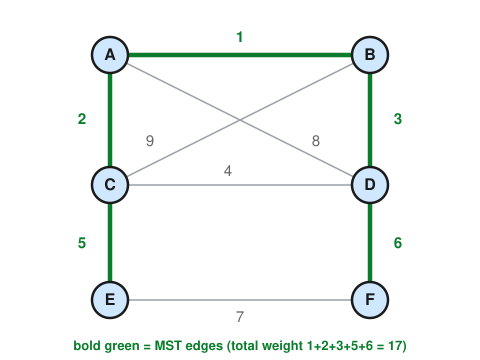

# Graph Theory · Lesson 2.2: Spanning trees & the minimum spanning tree

> ⏱ ~15 min · Module 2: Trees & matchings · Builds on: [Lesson 2.1](02-01-trees.md) · Unlocks: [Lesson 2.3](02-03-bipartite-matching-hall.md)

## Why this matters

You have a connected network — cities to wire, servers to link, pins on a chip to solder — and every possible connection has a cost. You want to hook everything together for the least total money, with no redundant loops. That "cheapest connected skeleton" is a **minimum spanning tree**, and the astonishing fact is that a mindless greedy rule — *always grab the cheapest edge that doesn't create a cycle* — provably finds it. This is the first place in the course where a local, myopic choice is guaranteed globally optimal, and the reason why is a piece of structure called the **cut property** that returns again in flows and matchings.

## The idea

Lesson 2.1 said a tree is the leanest connected graph: $n$ vertices, exactly $n-1$ edges, no cycles. A **spanning tree** of a connected graph $G$ is a tree that uses *all* of $G$'s vertices but only enough of its edges to stay connected — you keep the graph in one piece while throwing away every edge you can. Picture a road map and ask for the fewest roads that still let you drive between any two towns: that's a spanning tree.

Now give every edge a **weight** (a cost, distance, resistance). Different spanning trees cost different totals, and we want the cheapest one — the **minimum spanning tree (MST)**. The greedy recipe is embarrassingly simple: sort all edges cheapest-first, and walk down the list adding each edge *unless* it would close a cycle with edges already chosen. That's **Kruskal's algorithm**. The whole lesson's weight is on one question: why does never looking ahead still land you on the true optimum? The answer is that every greedy pick is the lightest edge crossing some divide in the graph — and such an edge can *never* be a mistake.

## The formal version

**Definition (spanning tree).** Let $G=(V,E)$ be a connected graph. A **spanning tree** of $G$ is a subgraph $T=(V,E')$ with $E'\subseteq E$ that is a tree (connected and acyclic) and includes every vertex of $G$.

*In words:* keep all the dots, keep just enough lines to stay connected without any loop — necessarily $|E'|=|V|-1$ by Lesson 2.1.

**Definition (weighted graph, MST).** A **weight function** is a map $w:E\to\mathbb{R}$ assigning each edge a real cost $w(e)$. The **weight** of a spanning tree $T$ is $w(T)=\sum_{e\in T}w(e)$. A **minimum spanning tree** is a spanning tree of least total weight.

*In words:* add up the costs of the edges you kept; the MST is the skeleton with the smallest such sum.

**Kruskal's algorithm.** Sort $E$ by weight, smallest first. Start with no edges. Scan the sorted list; add the current edge to your forest iff both endpoints lie in *different* components so far (i.e. it would not create a cycle). Stop once you have $|V|-1$ edges.

**Prim's algorithm.** Pick any start vertex as a one-vertex tree. Repeatedly add the *cheapest edge with exactly one endpoint in the tree so far*, absorbing its new vertex. Stop when all vertices are in.

*In words:* Kruskal grows many little trees and merges them cheapest-edge-first; Prim grows one tree outward, always reaching for the cheapest edge to a new vertex. Both are greedy, and both are optimal — for the same reason.

**The cut property (why greedy is safe).** A **cut** is a partition of $V$ into two nonempty sets $S$ and $V\setminus S$; an edge **crosses** the cut if it has one endpoint in each. 

> **Cut property.** For any cut, a lightest edge crossing it belongs to *some* MST. If that lightest crossing edge is *strictly* lighter than every other crossing edge, it belongs to *every* MST.

*In words:* whatever way you slice the vertices in two, the cheapest edge bridging the two halves is always a safe pick — no optimal tree ever needs to avoid it.

*Proof (exchange argument).* Let $e=(u,v)$ be a lightest edge crossing the cut $(S,V\setminus S)$, with $u\in S$, $v\in V\setminus S$. Take any MST $T$. If $e\in T$ we are done, so suppose $e\notin T$. Adding $e$ to a spanning tree creates exactly one cycle (Lesson 2.1: the endpoints already had a unique path between them, and $e$ closes it). Follow that cycle: it starts at $u\in S$, and since it returns to $u$, it must cross back from $V\setminus S$ into $S$ at some point — so it contains another edge $e'\neq e$ that also crosses the cut. Now **swap**: let $T'=T-e'+e$. Removing $e'$ from the cycle in $T+e$ leaves a connected subgraph with $|V|-1$ edges, hence another spanning tree. Its weight is
$$w(T')=w(T)-w(e')+w(e)\le w(T),$$
because $e$ is a *lightest* crossing edge, so $w(e)\le w(e')$. But $T$ was already minimum, so $w(T')\ge w(T)$; therefore $w(T')=w(T)$, and $T'$ is an MST that **contains $e$**. If moreover $w(e)<w(e')$ strictly, then $w(T')<w(T)$, contradicting minimality of $T$ — so the case $e\notin T$ is impossible, i.e. $e$ lies in *every* MST. $\blacksquare$

Every step of Kruskal and Prim adds a lightest edge across *some* cut. In Prim, the cut is (tree built so far) vs. (everything else), and you literally pick the lightest edge crossing it. In Kruskal, when you accept an edge $e$ joining two components, put one of those components on the $S$ side of a cut; every earlier — hence lighter-or-equal — edge crossing that cut was rejected for closing a cycle, so $e$ is a lightest crossing edge. Either way the cut property certifies the pick is in some MST. That is *why greedy is safe*.

**The cycle property (the dual, briefly).** For any cycle in $G$, a heaviest edge on that cycle belongs to *no* MST (uniquely heaviest ⇒ in no MST). This is exactly what justifies Kruskal's *rejections*: the edge you skip is the most expensive one closing its cycle, so it is never needed. (Same exchange argument, run in reverse — see P3.)

## Picture

A 6-vertex weighted graph. The bold green edges are its MST; the thin gray edges are the ones Kruskal rejects or never needs.

## Worked examples

**Example 1 (run Kruskal on the picture).** The graph above has these weighted edges. Sort them smallest-first and scan, accepting an edge only if its endpoints are in different components:

| edge | weight | endpoints' components | decision |
|---|---|---|---|
| A–B | 1 | {A}, {B} | **accept** → {A,B} |
| A–C | 2 | {A,B}, {C} | **accept** → {A,B,C} |
| B–D | 3 | {A,B,C}, {D} | **accept** → {A,B,C,D} |
| C–D | 4 | both in {A,B,C,D} | **reject** (cycle A–C–D–B–A) |
| C–E | 5 | {A,B,C,D}, {E} | **accept** → {A,B,C,D,E} |
| D–F | 6 | {A,B,C,D,E}, {F} | **accept** → all 6 vertices |
| E–F | 7 | both joined | reject (not needed) |
| A–D | 8 | both joined | reject |
| B–C | 9 | both joined | reject |

After the D–F accept we have $|V|-1=5$ edges spanning all six vertices, so we stop. The MST is $\{A\text{–}B, A\text{–}C, B\text{–}D, C\text{–}E, D\text{–}F\}$ with total weight $1+2+3+5+6=\boxed{17}$. Notice the single genuine rejection, C–D (weight 4): it is the heaviest edge on the cycle A–C–D–B–A among the ones considered, exactly what the cycle property predicts we can throw away.

**Example 2 (why you'd care — Prim reaches the same tree).** Run Prim from vertex A on the same graph, always grabbing the cheapest edge leaving the current tree:

- Tree $=\{A\}$. Cheapest edge out: A–B (1). Add B. Tree $=\{A,B\}$.
- Edges out: A–C (2), B–D (3), B–C (9), A–D (8). Cheapest: A–C (2). Add C.
- Edges out: B–D (3), C–D (4), C–E (5), … Cheapest: B–D (3). Add D.
- Edges out: C–E (5), D–F (6), … (C–D now internal). Cheapest: C–E (5). Add E.
- Edges out: D–F (6), E–F (7). Cheapest: D–F (6). Add F. Done.

Same five edges, same weight 17 — but built by *growing one blob outward* instead of *merging many blobs*. Two different orders of the same safe cut-property choices converge on the same optimum. (When all weights are distinct, as here, the MST is in fact *unique* — P3.)

## Watch out

- You might think "minimum spanning tree" means "shortest path between two vertices" — but they are different goals. An MST minimizes *total* edge cost over the whole network; it can force you along a long detour between a particular pair. Minimizing pairwise travel is the shortest-path problem (a future flows/algorithms topic), not this.
- You might think the greedy rule is safe only because we got lucky on this example — but the cut property is a *proof* it is always optimal, for any weights. Greedy failing is the norm elsewhere in optimization; MSTs are a rare clean win. (Contrast: greedily grabbing the cheapest edge into a growing *path* to solve travelling-salesman does **not** work.)
- You might think ties don't matter — but with repeated weights the MST need not be unique, and Kruskal's answer can depend on how you break ties among equal-weight edges. Every such choice still gives *an* MST (the cut property only promises "some MST" when the lightest crossing edge isn't strict); uniqueness is guaranteed precisely when all weights are distinct.
- You might think you must sort before Prim — you don't. Kruskal needs a global sort; Prim only ever needs the current cheapest boundary edge, so it runs off a priority queue without sorting everything up front.

## One-liner

> The cheapest edge crossing any cut is always in some MST — so greedily grabbing cheap acyclic edges (Kruskal) or cheap boundary edges (Prim) can never go wrong.

## Problems

**P1 (🟢)** Run Kruskal on the weighted graph with vertices $\{1,2,3,4\}$ and edges
$$1\text{–}2:4,\quad 2\text{–}3:1,\quad 3\text{–}4:3,\quad 1\text{–}4:2,\quad 1\text{–}3:5.$$
List the edges in sorted order with each accept/reject decision, and give the MST and its total weight.

**P2 (🟡)** Let $G$ be connected with a *unique* lightest edge $e$ (its weight is strictly smaller than every other edge's). Prove $e$ lies in every MST of $G$. (Hint: find a cut for which $e$ is the strict lightest crossing edge.)

**P3 (🔴, optional)** Prove the **cycle property**: if $e$ is the *strictly heaviest* edge on some cycle $C$ of $G$, then $e$ is in no MST. Deduce, using the cut property from P2's style of argument, that **if all edge weights are distinct then the MST is unique.**

Solutions

**P1** Sorted edges: 2–3 (1), 1–4 (2), 3–4 (3), 1–2 (4), 1–3 (5).

| edge | weight | decision |
|---|---|---|
| 2–3 | 1 | accept → {2,3} |
| 1–4 | 2 | accept → {1,4} |
| 3–4 | 3 | accept — 3∈{2,3}, 4∈{1,4}, different → merge {1,2,3,4} |
| 1–2 | 4 | reject (both in {1,2,3,4}, cycle) |
| 1–3 | 5 | reject (both joined) |

We hit $|V|-1=3$ edges after accepting 3–4. MST $=\{2\text{–}3,\ 1\text{–}4,\ 3\text{–}4\}$ with weight $1+2+3=6$.

**P2** Let $e=(u,v)$ be the unique lightest edge, so $w(e)<w(f)$ for every other edge $f$. Consider the cut $S=\{u\}$, $V\setminus S=V\setminus\{u\}$. Every edge crossing this cut is an edge incident to $u$; $e$ is one of them, and since $e$ is strictly lighter than *all* other edges of $G$ — in particular all other edges at $u$ — it is the strict lightest crossing edge of this cut. By the cut property (strict case), $e$ belongs to every MST. $\blacksquare$

**P3** *Cycle property.* Suppose, for contradiction, some MST $T$ contains the strictly-heaviest cycle edge $e=(u,v)$. Deleting $e$ splits $T$ into two components; let $S$ be the one containing $u$, so $v\in V\setminus S$. The cycle $C$ minus $e$ is a path from $u$ to $v$; since it starts in $S$ and ends outside $S$, it uses some edge $f\neq e$ that crosses the cut $(S,V\setminus S)$. Because $e$ is strictly heaviest on $C$, $w(f)<w(e)$. Now $T'=T-e+f$ reconnects the two pieces (as $f$ crosses the cut) and has $|V|-1$ edges, so it is a spanning tree with
$$w(T')=w(T)-w(e)+w(f)<w(T),$$
contradicting that $T$ is minimum. Hence no MST contains $e$. $\blacksquare$

*Uniqueness under distinct weights.* Suppose all weights are distinct but there are two different MSTs $T_1\neq T_2$. Among all edges in exactly one of them, let $e$ be the one of smallest weight; say $e\in T_1\setminus T_2$. Adding $e$ to $T_2$ creates a unique cycle $C$; since $T_1$ is acyclic, $C$ has some edge $f\notin T_1$, and $f\neq e$. Weights are distinct, so either $w(f)<w(e)$ or $w(f)>w(e)$.
- If $w(f)<w(e)$: then $f\in T_2\setminus T_1$ is an edge in exactly one tree with weight below $e$'s, contradicting the minimality of $e$'s choice.
- So $w(f)>w(e)$: then $T_2-f+e$ is a spanning tree of weight $w(T_2)-w(f)+w(e)<w(T_2)$, contradicting that $T_2$ is minimum.

Both cases are impossible, so $T_1=T_2$: the MST is unique. $\blacksquare$

## Flashback

**From [Lesson 2.1](02-01-trees.md) (Trees and their many faces):** A connected graph $G$ has 12 vertices and 30 edges. (a) How many edges does any spanning tree of $G$ have? (b) How many of $G$'s edges must you delete to be left with a spanning tree? (c) When you run Kruskal on $G$, how many "accept" decisions occur before it stops?

Solution

A spanning tree is a tree on all $|V|$ vertices, so by the tree edge-count $|E_T|=|V|-1$ it has $12-1=11$ edges. (a) **11.** (b) You keep 11 of the 30 edges, so you delete $30-11=19$. (c) Kruskal stops exactly when the forest becomes a spanning tree, i.e. after accepting $|V|-1=11$ edges — the other $30-11=19$ edges are each rejected for closing a cycle. So **11** accepts.

## Connections

- **Backward:** this is [Lesson 2.1](02-01-trees.md) put to work — every fact used (a tree has $|V|-1$ edges, adding one edge makes exactly one cycle, endpoints of a non-tree edge already have a unique path) is a tree characterization from there, and the exchange argument is pure "add an edge, kill the cycle it makes."
- **Forward:** the *cut property* is your first taste of the max–min duality that organizes the rest of the course. The same "swap along an alternating structure to improve" move powers augmenting paths for matchings ([Lesson 2.3](02-03-bipartite-matching-hall.md)) and for flows ([Lesson 4.2](04-02-augmenting-paths-ford-fulkerson.md)); the min-cut in max-flow ([Lesson 4.1](04-01-flow-networks-maxflow-mincut.md)) is a cut of exactly this flavor.
- **Forward:** spanning trees get *counted*, not just built, by the Matrix–Tree theorem in [Lesson 5.2](05-02-laplacian-matrix-tree.md), tying this skeleton to the Laplacian's eigenvalues.
- **Sideways (algorithms):** Kruskal and Prim are the canonical greedy algorithms; the cut property is the "exchange argument" template the CS `algorithms` track uses to prove greedy correctness in general (and the matroid theory that says exactly when greedy works).
