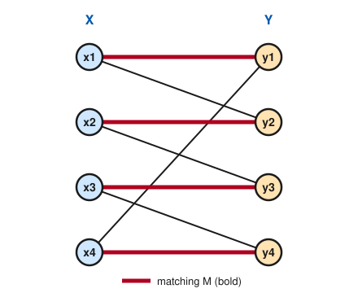
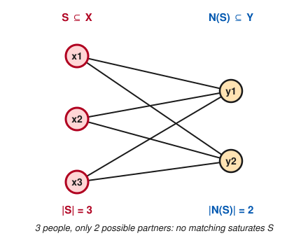

# Graph Theory · Lesson 2.3: Bipartite graphs & matchings — Hall's theorem

> ⏱ ~15 min · Module 2: Trees & matchings · Builds on: [2.1 (trees)](02-01-trees.md), [1.3 (walks, paths, connectivity)](01-03-walks-paths-connectivity.md) · Unlocks: [2.4 (König: matchings meet covers)](02-04-konig-covers.md)

## Why this matters

"Can everyone be paired off?" is one question wearing a hundred costumes: assign each worker to a job they can do, seat each guest with a dinner partner they know, marry off a village with no one left single, route each data packet to a free channel. All of them are the same graph problem — find a **matching** that leaves no one out — and there is a single, astonishingly clean theorem that decides when it's possible. Hall's marriage theorem tells you not just *that* a pairing exists but, when it doesn't, hands you the exact bottleneck to point at. It's the first great **duality** of the course: a thing you want to build (a big matching) is blocked by a thing you can exhibit (an overcrowded set), and the two are tied together exactly.

## The idea

First, the arena. A graph is **bipartite** if its vertices split into two teams so that *every edge crosses between teams* — never within one. Workers on the left, jobs on the right, an edge for "can do this job": a worker is never joined to a worker. The clean litmus test, which we'll prove, is: **a graph is bipartite exactly when it has no odd cycle.** Intuitively, if you try to 2-color the vertices by alternating along edges, a cycle only closes up consistently when its length is even; an odd loop forces a color clash.

A **matching** is a set of edges with no shared endpoints — a set of pairings where nobody is double-booked. The dream is a matching that **saturates** the left side: every worker gets a job. When can we?

The obstruction is obvious once you see it. Suppose three workers among the left are *collectively* qualified for only two jobs total. Then three people are chasing two slots — by pigeonhole one goes home. Call such a bottleneck a **deficient set**: a set $S$ of left vertices whose pool of allowable partners $N(S)$ is smaller than $S$ itself. Hall's theorem is the beautiful claim that this obvious obstruction is the *only* one: **if no deficient set exists, everyone can be matched.** No hidden global tangle can stop you — a local shortage is the whole story.

## The formal version

Throughout, $G$ is a **bipartite graph** with a fixed bipartition $V = X \cup Y$ (every edge has one end in $X$, one in $Y$). For a set $S \subseteq X$, its **neighborhood** is
$$N(S) = \{\, y \in Y : y \text{ is adjacent to some } x \in S \,\},$$
the set of all partners *anyone* in $S$ can reach. (Overlaps count once — it's a set union, not a sum of degrees.)

**Bipartite ⇔ no odd cycle.** $G$ is bipartite if and only if it contains no cycle of odd length.

*In words:* the only thing that stops you 2-coloring a graph is a loop of odd length.

*Proof.* ($\Rightarrow$) If $G$ is bipartite, walk around any cycle: it alternates $X, Y, X, Y, \dots$ and must return to its starting team, so its length is even. Hence an odd cycle can't exist. ($\Leftarrow$) Suppose $G$ has no odd cycle; we build a bipartition. Work in one connected component (color the components independently). Pick a root $r$ and let $d(v)$ be its **distance** from $r$ — the fewest edges in an $r\text{-to-}v$ path, exactly the BFS layers of [Lesson 1.3](01-03-walks-paths-connectivity.md). Color $v$ by the **parity** of $d(v)$: put $v \in X$ if $d(v)$ is even, $v \in Y$ if odd. Any edge $uv$ has $\lvert d(u)-d(v)\rvert \le 1$ (a neighbor is at most one layer away). If $u,v$ shared a parity we'd need $d(u)=d(v)$; then take shortest paths from $r$ to each, let $w$ be their last common vertex, and the two tails $w\to u$ and $w\to v$ have equal length $d(u)-d(w)$. Together with edge $uv$ they form a cycle of length $2\big(d(u)-d(w)\big)+1$ — odd, contradiction. So every edge joins even-parity to odd-parity: the coloring is a valid bipartition. $\blacksquare$

**Matchings.** A **matching** $M \subseteq E$ is a set of edges, no two sharing an endpoint. A vertex on an edge of $M$ is **saturated** (matched); otherwise **unsaturated**. $M$ **saturates** $X$ if every vertex of $X$ is matched. $M$ is **perfect** if it saturates *all* of $V$. $M$ is **maximum** if no matching has more edges (distinct from **maximal** — one you can't extend by a single edge, which may still be small).

**Augmenting paths & Berge's theorem.** Given a matching $M$, an **$M$-alternating path** alternates non-$M$, $M$, non-$M$, … edges. It is **$M$-augmenting** if *both* endpoints are unsaturated. Flipping such a path (swap which edges are in $M$) has one more non-$M$ edge than $M$ edge, so it raises $\lvert M\rvert$ by one — an augmenting path is a certificate that $M$ is *not* the best.

> **Berge's theorem.** $M$ is maximum **iff** there is no $M$-augmenting path.

*In words:* the only way a matching can be improved is by finding an alternating path with two free ends. *Proof of the hard direction.* Suppose $M$ is not maximum; let $M^*$ be larger. In the symmetric difference $M \triangle M^*$ every vertex meets at most one edge of each matching, so it has degree $\le 2$: the components are paths and even cycles that alternate between $M$ and $M^*$. Cycles use equal numbers of each. Since $\lvert M^*\rvert > \lvert M\rvert$, some component has more $M^*$-edges than $M$-edges — a path beginning and ending with $M^*$-edges. Its endpoints are unsaturated by $M$: an $M$-augmenting path. $\blacksquare$

**Hall's Marriage Theorem.** A bipartite graph with parts $X, Y$ has a matching saturating $X$ **iff**
$$\lvert N(S)\rvert \ge \lvert S\rvert \quad\text{for every } S \subseteq X \qquad(\textbf{Hall's condition}).$$

*In words:* everyone on the left can be matched exactly when no group of left vertices is chasing a smaller pool of partners.

*Proof.* ($\Rightarrow$) If $M$ saturates $X$, the partners of the vertices in $S$ are distinct and lie in $N(S)$, so $\lvert N(S)\rvert \ge \lvert S\rvert$. ($\Leftarrow$) Induct on $\lvert X\rvert$. If $\lvert X\rvert = 1$, the lone vertex has $\lvert N(\{x\})\rvert \ge 1$, so match it. For the step, two cases:

- **Surplus everywhere:** every nonempty *proper* $S \subset X$ has $\lvert N(S)\rvert \ge \lvert S\rvert + 1$. Pick any $x \in X$, match it to any neighbor $y$, and delete both. For any $S \subseteq X\setminus\{x\}$, removing $y$ costs at most one partner, so $\lvert N(S)\rvert$ drops by at most 1 and stays $\ge \lvert S\rvert$. Hall still holds; induction matches the rest, and we add $xy$.
- **A tight set exists:** some nonempty proper $T \subset X$ has $\lvert N(T)\rvert = \lvert T\rvert$ exactly. Hall holds inside the subgraph on $T \cup N(T)$, so by induction a matching saturates $T$ using only $N(T)$. On the remainder $X\setminus T$ vs. $Y\setminus N(T)$, check Hall: for $S \subseteq X\setminus T$,
$$\lvert N(S)\setminus N(T)\rvert = \lvert N(S\cup T)\rvert - \lvert N(T)\rvert \ge \big(\lvert S\rvert+\lvert T\rvert\big) - \lvert T\rvert = \lvert S\rvert,$$
using Hall on $S \cup T$. Induction saturates $X\setminus T$; the two matchings are disjoint and together saturate $X$. $\blacksquare$

**The obstruction, made explicit.** If Hall *fails*, a **deficient set** $S$ with $\lvert N(S)\rvert < \lvert S\rvert$ is a one-line proof that no saturating matching exists: its $\lvert S\rvert$ vertices can only reach $\lvert N(S)\rvert < \lvert S\rvert$ partners, so someone is stranded. More sharply, the **deficiency version** says the maximum matching saturates all but $\max_{S\subseteq X}\big(\lvert S\rvert - \lvert N(S)\rvert\big)$ of $X$ (proved in P3).

## Picture

A matching (bold) that saturates the whole left side — a perfect matching — and, beside it, a deficient set that kills any hope of one.

Every $x_i$ is paired to a distinct $y_i$ by the bold edges: this matching saturates $X$ (indeed all of $V$), so it is perfect. Hall's condition holds — you can check that no set of left vertices outruns its neighborhood.

Here $S = \{x_1, x_2, x_3\}$ but $N(S) = \{y_1, y_2\}$, so $\lvert N(S)\rvert = 2 < 3 = \lvert S\rvert$. Three vertices, two possible partners: no matching can saturate $S$, and $S$ itself is the certificate.

## Worked examples

**Example 1 (augmenting a matching — Berge in action).** Take the left graph above but start from the *non-maximum* matching $M = \{\,x_2y_2,\ x_3y_3\,\}$ (two bold-position edges only). Vertices $x_1, x_4, y_1, y_4$ are unsaturated. Look for an $M$-augmenting path from $x_1$: the edge $x_1y_1$ is non-$M$ and $y_1$ is unsaturated — a length-1 augmenting path already. Flip it: $M$ gains $x_1y_1$. Now only $x_4, y_4$ are free; the edge $x_4y_4$ is non-$M$ with both ends free — augment again. We reach $\{x_1y_1, x_2y_2, x_3y_3, x_4y_4\}$, a perfect matching. No unsaturated vertices remain, so no augmenting path can start: by Berge, it's maximum.

**Example 2 (Hall deciding an assignment).** Four analysts $\{1,2,3,4\}$, four projects $\{a,b,c,d\}$; qualifications: $1,2,3$ can each do only $\{a,b\}$, while $4$ can do $\{c,d\}$. Can all four be staffed? Test Hall on $S = \{1,2,3\}$: $N(S) = \{a,b\}$, so $\lvert N(S)\rvert = 2 < 3$. Hall fails; **no** full assignment exists, and $\{1,2,3\}$ is exactly the bottleneck to report to management — three people fighting over two projects. The best you can do saturates all but $3 - 2 = 1$ analyst: e.g. match $1a,\ 2b,\ 4c$, leaving $3$ (and projects $d$) idle — a maximum matching of size $3$.

## Watch out

- You might think a **maximal** matching is a **maximum** one — but "can't add another edge" is far weaker than "no bigger matching exists." In a path $x_1 y_1 x_2 y_2$, the single middle edge $y_1x_2$ is maximal yet size 1; the maximum is size 2. Berge's augmenting path is what upgrades one to the other.
- You might think Hall's condition is about single vertices ("everyone has a neighbor") — but that's only $S$ of size 1. Hall demands $\lvert N(S)\rvert \ge \lvert S\rvert$ for **every** subset; the deficient set in Example 2 has three vertices, each of which individually *does* have neighbors. The shortage is collective.
- You might think $N(S)$ sums up each vertex's partners — but it's the **union**: shared partners count once. That overlap is precisely how a set can be starved even when every member is well-connected on its own.
- Hall saturates $X$, not necessarily $Y$. For a **perfect** matching of the whole graph you also need $\lvert X\rvert = \lvert Y\rvert$ (then saturating $X$ forces saturating $Y$ too).

## One-liner

> Everyone on the left can be paired off exactly when no clique of them is chasing a smaller pool of partners — and when it fails, that overcrowded set is your proof.

## Problems

**P1 (🟢)** Bipartite graph: left $X=\{1,2,3,4\}$, right $Y=\{a,b,c,d\}$, with allowed edges $1\!-\!\{a,c\}$, $2\!-\!\{a,c\}$, $3\!-\!\{a,c\}$, $4\!-\!\{b,d\}$. (a) Does a matching saturating $X$ exist? (b) If not, name a deficient set and give the size of a maximum matching.

**P2 (🟡)** Prove: every $k$-regular bipartite graph with $k \ge 1$ has a perfect matching. (Hint: count the edges leaving a set $S \subseteq X$ two ways to verify Hall, then argue $\lvert X\rvert = \lvert Y\rvert$.)

**P3 (🔴, optional — the defect formula)** Prove the **deficiency version** of Hall: the maximum matching in a bipartite $G$ has size
$$\lvert X\rvert - d, \qquad d = \max_{S \subseteq X}\big(\lvert S\rvert - \lvert N(S)\rvert\big).$$
(Hint: add $d$ new vertices to $Y$, each joined to all of $X$, and apply Hall to the enlarged graph.)

Solutions

**P1** (a) Look at $S = \{1,2,3\}$: each is joined only to $a$ and $c$, so $N(S) = \{a,c\}$ and $\lvert N(S)\rvert = 2 < 3 = \lvert S\rvert$. Hall's condition fails, so **no** matching saturates $X$. (b) The deficient set is $S=\{1,2,3\}$ (deficiency $3-2 = 1$). By the defect formula (P3) the maximum matching has size $\lvert X\rvert - 1 = 3$; realize it explicitly, e.g. $\{\,1a,\ 3c,\ 4b\,\}$ — vertex $2$ is left unmatched, and no augmenting path from $2$ exists since its only neighbors $a,c$ are saturated and lead nowhere free. Maximum matching size $= 3$.

**P2** Let $G$ be $k$-regular bipartite with parts $X, Y$, $k \ge 1$. First, $\lvert X\rvert = \lvert Y\rvert$: counting edges by their $X$-ends gives $\lvert E\rvert = k\lvert X\rvert$, by their $Y$-ends $\lvert E\rvert = k\lvert Y\rvert$, so $\lvert X\rvert = \lvert Y\rvert$. Now verify Hall. Fix $S \subseteq X$. The number of edges with an endpoint in $S$ is exactly $k\lvert S\rvert$ (each vertex of $S$ has degree $k$, and no edge has two ends in $S$ since $G$ is bipartite). Every such edge lands in $N(S)$, and each vertex of $N(S)$ absorbs at most $k$ edges (its degree). Hence
$$k\lvert S\rvert = \#\{\text{edges from } S\} \le k\lvert N(S)\rvert \;\Rightarrow\; \lvert N(S)\rvert \ge \lvert S\rvert.$$
Hall holds, so a matching saturates $X$; since $\lvert X\rvert = \lvert Y\rvert$, saturating $X$ saturates $Y$ as well — it's perfect. $\blacksquare$

**P3** Note $d \ge 0$ (take $S = \varnothing$). *Upper bound.* Let $S^*$ achieve the max, so $\lvert N(S^*)\rvert = \lvert S^*\rvert - d$. Any matching $M$ can match the vertices of $S^*$ only into $N(S^*)$, saturating at most $\lvert N(S^*)\rvert = \lvert S^*\rvert - d$ of them; the other $\ge d$ vertices of $S^*$ stay unmatched. So $\lvert M\rvert \le \lvert X\rvert - d$.
*Achievability.* Build $G'$ by adding $d$ new vertices $Z$ to the $Y$-side, each joined to *all* of $X$. Check Hall in $G'$: for nonempty $S \subseteq X$, $N_{G'}(S) = N_G(S) \cup Z$, so
$$\lvert N_{G'}(S)\rvert = \lvert N_G(S)\rvert + d \ge \lvert N_G(S)\rvert + \big(\lvert S\rvert - \lvert N_G(S)\rvert\big) = \lvert S\rvert,$$
where the inequality is just $d \ge \lvert S\rvert - \lvert N_G(S)\rvert$ from the definition of $d$. (The empty set is trivial.) So $G'$ has a matching $M'$ saturating $X$, of size $\lvert X\rvert$. At most $d$ of its edges use the $d$ new vertices of $Z$; deleting those leaves a matching of $G$ with at least $\lvert X\rvert - d$ edges. Combined with the upper bound, the maximum is exactly $\lvert X\rvert - d$. $\blacksquare$

## Flashback

**From [Lesson 1.3](01-03-walks-paths-connectivity.md) (walks, paths, cycles):** A graph $G$ contains a **closed walk of odd length** (a walk that starts and ends at the same vertex, using an odd number of edges — vertices and edges may repeat). Prove $G$ must contain an odd **cycle** (no repeats). Conclude such a $G$ is not bipartite.

Solution

Among all odd closed walks in $G$, take one of **shortest** length $\ell$; call it $W$. Since $G$ is a simple graph it has no loops, so $\ell \ge 3$. Claim $W$ is a cycle. If not, some vertex $v$ appears twice as an interior vertex, splitting $W$ into two closed walks $W_1, W_2$ (both based at $v$) with $\text{len}(W_1) + \text{len}(W_2) = \ell$. As $\ell$ is odd, one summand is odd and the other even; the odd one is a *shorter* odd closed walk, contradicting minimality. So $W$ has no repeated vertex — it is an odd cycle. Finally, by the **bipartite ⇔ no odd cycle** theorem proved above, a graph containing an odd cycle cannot be bipartite. $\blacksquare$

## Connections

- **Backward:** the odd-cycle proof reruns the BFS distance layers from [Lesson 1.3](01-03-walks-paths-connectivity.md), and alternating/augmenting "paths" are literally the paths formalized there; matchings live happily inside the acyclic skeletons of [Lesson 2.1](02-01-trees.md) (a tree, being bipartite, always obeys Hall on the smaller side).
- **Forward:** [Lesson 2.4](02-04-konig-covers.md) sharpens Hall into the König duality *max matching $=$ min vertex cover* in bipartite graphs, and Module 4 shows bipartite matching is a **unit-capacity max-flow** problem — Hall then falls out as a special case of max-flow min-cut and Menger's theorem ([Lesson 4.3](04-03-menger-flows-matching.md)).
- **Sideways (combinatorics):** Hall's theorem is *identical* to the theorem on **systems of distinct representatives** in `combinatorics` — given sets $A_1,\dots,A_n$, pick a distinct representative from each iff every $k$ of them have union $\ge k$. It also underlies assignment and matching markets in economics (who-does-what, stable pairings), where the deficient set is the coalition that certifies infeasibility.
