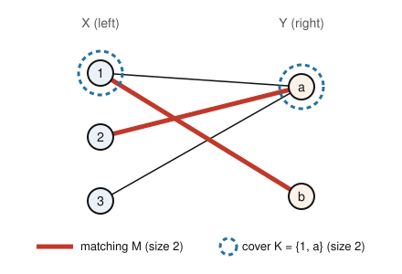

# Graph Theory · Lesson 2.4: König's theorem — matchings meet covers

> ⏱ ~15 min · Module 2: Trees & matchings · Builds on: [Lesson 2.3](02-03-bipartite-matching-hall.md) (bipartite graphs, matchings, Hall) · Unlocks: [Lesson 4.1](04-01-flow-networks-maxflow-mincut.md) (max-flow min-cut, where König is a special case)

## Why this matters

This is the lesson where the course's spine appears in full for the first time: a **max–min duality**. You can *build* something — a matching, a set of disjoint edges — and something else can *block* it — a cover, a set of vertices that touches every edge. The blocker is always at least as big as anything you build; that half is nearly free. The miracle, on bipartite graphs, is that the *best* build and the *cheapest* block come out **exactly equal**. That equality is a certificate: once your matching and your cover have the same size, each *proves* the other is optimal, no further search needed. The same shape recurs as max-flow = min-cut (Module 4) and connectivity = disjoint paths (Menger). Learn the pattern here where the pictures are smallest.

## The idea

Two players. The **matcher** picks edges no two of which share a vertex — a *matching* — and wants many. The **blocker** picks vertices so that every edge has at least one chosen endpoint — a *vertex cover* — and wants few.

Weak duality is a one-line observation: **every matching is smaller than every cover.** Why? Each edge of the matching needs a covered endpoint, and since matching edges never share a vertex, no single cover vertex can be blamed for two of them. So the cover spends at least one distinct vertex per matching edge. Blocker $\ge$ matcher, always, in *any* graph.

König's theorem says that on a **bipartite** graph this slack vanishes: the biggest matching and the smallest cover are the same size. And the proof is constructive — hand me a maximum matching and I'll build a cover of exactly that size by chasing *alternating paths*, the same augmenting-path idea from [Lesson 2.3](02-03-bipartite-matching-hall.md).

## The formal version

Fix a graph $G=(V,E)$ with $n=\lvert V\rvert$ vertices.

**Matching.** A set $M\subseteq E$ of pairwise-disjoint edges (no two share an endpoint). The **matching number** $\nu(G)$ is the size of a largest matching.

**Vertex cover.** A set $K\subseteq V$ such that every edge has at least one endpoint in $K$. The **vertex-cover number** $\tau(G)$ is the size of a smallest cover.

**Independent set.** A set $I\subseteq V$ with no edge between any two of its vertices. The **independence number** $\alpha(G)$ is the size of a largest one.

**Weak duality.** For every graph, $\nu(G)\le\tau(G)$.
*In words:* no matching can be bigger than any cover.
*Proof.* Let $M$ be any matching and $K$ any cover. Each edge $e\in M$ has an endpoint in $K$; pick one, call it $f(e)\in K$. If $f(e)=f(e')$ for edges $e\ne e'$ of $M$, then $e$ and $e'$ share that vertex — impossible, since $M$'s edges are disjoint. So $f$ is injective, giving $\lvert M\rvert=\lvert f(M)\rvert\le\lvert K\rvert$. Take $M$ maximum and $K$ minimum: $\nu(G)\le\tau(G)$. $\blacksquare$

**Complementation.** For every graph, $\alpha(G)+\tau(G)=n$.
*In words:* a set is a vertex cover exactly when its complement is independent, so cover and independent set are two views of the same cut.
*Proof.* $K$ is a cover $\iff$ no edge has *both* endpoints outside $K$ $\iff$ $V\setminus K$ spans no edge $\iff$ $V\setminus K$ is independent. So complementation is a bijection between covers and independent sets, and it flips size: the smallest cover complements the largest independent set, $\tau=n-\alpha$. $\blacksquare$

**König's theorem.** If $G$ is **bipartite**, then $\nu(G)=\tau(G)$.
*In words:* in a bipartite graph, the maximum matching and the minimum vertex cover have exactly the same size.

Weak duality already gives $\nu\le\tau$. The content is the reverse inequality $\tau\le\nu$, and we get it by *exhibiting* a cover of size $\nu$.

**König–Egerváry construction (cover of size $\nu$).** Let $G$ be bipartite with parts $X,Y$, and let $M$ be a *maximum* matching. Let $U\subseteq X$ be the $M$-unmatched vertices of $X$. Let $Z$ be the set of all vertices reachable from $U$ by an **$M$-alternating path** (start at an unmatched $X$-vertex; leave along a non-$M$ edge into $Y$, return along an $M$ edge into $X$, and repeat). Define
$$K=(X\setminus Z)\ \cup\ (Y\cap Z).$$
Then $K$ is a vertex cover with $\lvert K\rvert=\lvert M\rvert$. Because $\lvert M\rvert=\nu$ and (weak duality) every cover has size $\ge\nu$, this $K$ is minimum, and $\tau=\nu$. (Worked in full below; the two facts to check are "$K$ covers every edge" and "$\lvert K\rvert=\lvert M\rvert$".)

*Gallai's identities (lightly).* Complementation $\alpha+\tau=n$ is one of a matched pair. Its sibling, for a graph with no isolated vertex, is $\nu+\rho=n$, where $\rho$ is the **edge-cover number** (fewest edges touching every vertex). Same flavor: a build number plus a block number fills up $n$. We won't use $\rho$ again, but the symmetry is worth filing away.

## Picture

The bipartite graph below has parts $X=\{1,2,3\}$ and $Y=\{a,b\}$, with edges $1a,\,1b,\,2a,\,3a$. A **maximum matching** $M=\{1b,\,2a\}$ is drawn bold (size 2); vertex $3$ stays unmatched. A **minimum vertex cover** $K=\{1,a\}$ is circled (size 2) — one vertex from each side, and it touches all four edges. Matcher and blocker tie at 2: König in a single picture.

Notice the cover is *not* just "circle one whole side." Circling all of $X$ (size 3) or all of $Y$ (size 2) always works, but here the clever cover mixes sides to hit the true minimum — exactly what the construction finds for you.

## Worked examples

**Example 1 (the König–Egerváry construction, start to finish).** Use the picture's graph: $X=\{1,2,3\}$, $Y=\{a,b\}$, edges $1a,1b,2a,3a$, and the maximum matching $M=\{1b,\,2a\}$ (you can check no matching of size 3 exists — all three of $1,2,3$ would need distinct partners but only $a,b$ are available).

- **Unmatched $X$-vertices:** $U=\{3\}$ ($1,2$ are matched).
- **Grow alternating paths from $U$.** Start at $3$. Non-$M$ edge $3\!-\!a$ reaches $a$. Vertex $a$ is matched (to $2$), so the $M$ edge $a\!-\!2$ reaches $2$. From $2$ the only edge is $2\!-\!a$, already used — dead end. So the reachable set is
$$Z=\{3,\ a,\ 2\}.$$
- **Assemble the cover.**
$$K=(X\setminus Z)\cup(Y\cap Z)=(\{1,2,3\}\setminus\{2,3\})\cup(\{a,b\}\cap\{3,a,2\})=\{1\}\cup\{a\}=\{1,a\}.$$

Check it covers: $1a$ (has $1$), $1b$ (has $1$), $2a$ (has $a$), $3a$ (has $a$) — all four edges hit. And $\lvert K\rvert=2=\lvert M\rvert$. By weak duality no cover beats $2$, so $\tau=\nu=2$. Complementation cross-check: the complement $V\setminus K=\{2,3,b\}$ is independent (no edge among them — $2b,3b$ aren't edges), and $\alpha+\tau=3+2=5=n$. ✓

*Why the construction always works (outline).* Every $M$-edge contributes **exactly one** endpoint to $K$: if its $X$-endpoint is in $Z$ then (following the alternating path one more step) its $Y$-endpoint is in $Z$ too, so the $Y$-endpoint is chosen; otherwise the $X$-endpoint is outside $Z$ and is chosen. That is why $\lvert K\rvert=\lvert M\rvert$. And $K$ covers everything: an uncovered edge would need its $X$-end in $Z$ and its $Y$-end outside $Z$ — but such an edge extends an alternating path, forcing the $Y$-end into $Z$, a contradiction. (A leftover unmatched $Y$-vertex in $Z$ would give an augmenting path, contradicting maximality of $M$.)

**Example 2 (König $\Rightarrow$ Hall — one theorem buys the other).** Recall Hall's condition from [Lesson 2.3](02-03-bipartite-matching-hall.md): bipartite $G$ has a matching saturating $X$ iff $\lvert N(S)\rvert\ge\lvert S\rvert$ for every $S\subseteq X$. We derive the hard ("if") direction from König.

Assume Hall's condition holds. Let $K$ be a minimum cover, split as $K=K_X\cup K_Y$ with $K_X\subseteq X$, $K_Y\subseteq Y$. Look at $S=X\setminus K_X$: none of these vertices is in the cover, so **every** edge leaving $S$ must be covered on its $Y$-end, i.e. $N(S)\subseteq K_Y$. Hall then gives $\lvert K_Y\rvert\ge\lvert N(S)\rvert\ge\lvert S\rvert=\lvert X\rvert-\lvert K_X\rvert$. Rearranging,
$$\tau=\lvert K\rvert=\lvert K_X\rvert+\lvert K_Y\rvert\ \ge\ \lvert X\rvert.$$
By König, $\nu=\tau\ge\lvert X\rvert$, so a maximum matching has $\lvert X\rvert$ edges — it saturates $X$. Done. (The converse, matching $\Rightarrow$ Hall's condition, is the easy direction: a matching saturating $X$ pairs each $S$-vertex to a distinct neighbor, so $\lvert N(S)\rvert\ge\lvert S\rvert$.) König and Hall are two dialects of the same fact.

## Watch out

- **Weak duality is universal; equality is not.** $\nu\le\tau$ holds for *every* graph, but $\nu=\tau$ needs bipartite. The odd cycle $C_5$ breaks it: $\nu(C_5)=2$ yet $\tau(C_5)=3$ (P3). Odd cycles are exactly the bipartite obstruction from [Lesson 2.3](02-03-bipartite-matching-hall.md) — no coincidence.
- **Vertex cover, not edge cover.** A *vertex* cover is a set of *vertices* hitting every edge. Don't confuse it with an *edge* cover (edges hitting every vertex), the $\rho$ in Gallai's other identity. Different objects, different theorems.
- **Independent set $\ne$ matching.** Both say "no two chosen things touch," but a matching chooses *edges* and an independent set chooses *vertices*. The independent set that pairs with a minimum cover is $V\setminus K$, via complementation — not the matched vertices.
- **The minimum cover usually mixes sides.** Circling one entire part always covers a bipartite graph, so $\tau\le\min(\lvert X\rvert,\lvert Y\rvert)$ — but that bound is often loose. The true minimum, as in the picture, generally takes some vertices from each side.

## One-liner

> In a bipartite graph the largest set of disjoint edges and the smallest set of vertices hitting every edge are the same size — build equals block, and the alternating-path construction hands you both.

## Problems

**P1 (🟢)** Bipartite graph with $X=\{1,2,3\}$, $Y=\{a,b,c\}$ and edges $1a,\,1b,\,2b,\,2c,\,3b$. (a) Find a maximum matching $\nu$. (b) Find a minimum vertex cover $\tau$ and confirm $\nu=\tau$. (c) State the independence number $\alpha$ and verify $\alpha+\tau=n$.

**P2 (🟡)** Prove the complementation identity $\alpha(G)+\tau(G)=n$ for an *arbitrary* graph on $n$ vertices, directly from the definitions of cover and independent set. (This is the engine behind "min cover = max independent set's complement.")

**P3 (🔴, optional)** Show König can fail off the bipartite world. For the 5-cycle $C_5$ (vertices $v_1\ldots v_5$ in a ring), prove $\nu(C_5)=2$ and $\tau(C_5)=3$, so $\nu<\tau$ strictly. Then pinpoint *which* step of the König–Egerváry construction has no analogue here — i.e., what an odd cycle does that a bipartite graph never can.

Solutions

**P1** (a) Try $M=\{1a,\,2c,\,3b\}$: endpoints $1,a,2,c,3,b$ all distinct, so it's a valid matching of size $3$. Since $\lvert X\rvert=3$, no matching can exceed $3$; thus $\nu=3$ (a perfect matching of $X$).

(b) By König, $\tau=\nu=3$. A cover of size 3: take all of $X$, $K=\{1,2,3\}$ — every edge has an $X$-endpoint, so it's covered. (A mixed minimum also exists, e.g. $\{1,b,c\}$: covers $1a,1b$ via $1$; $2b,3b$ via $b$; $2c$ via $c$ ✓.) Either way $\tau=3=\nu$. ✓

(c) $n=6$, so $\alpha=n-\tau=6-3=3$. Concretely $V\setminus\{1,2,3\}=\{a,b,c\}$ is independent (no edges inside $Y$), of size $3$. Check $\alpha+\tau=3+3=6=n$. ✓

**P2** By complementation, $K\subseteq V$ is a vertex cover iff every edge has an endpoint in $K$ iff no edge lies entirely in $V\setminus K$ iff $V\setminus K$ is an independent set. So $I\mapsto V\setminus I$ is a bijection between independent sets and vertex covers, and it satisfies $\lvert V\setminus I\rvert=n-\lvert I\rvert$. Maximizing $\lvert I\rvert$ therefore minimizes $\lvert V\setminus I\rvert$: the largest independent set (size $\alpha$) complements the smallest cover (size $\tau$), giving $\tau=n-\alpha$, i.e. $\alpha+\tau=n$. $\blacksquare$

**P3** *Matching.* $C_5$ has 5 edges $v_1v_2,\ldots,v_5v_1$. Any two disjoint edges give $\nu\ge2$ (e.g. $\{v_1v_2,\,v_3v_4\}$). Could $\nu=3$? Three disjoint edges use $6$ distinct endpoints, but $C_5$ has only $5$ vertices — impossible. So $\nu(C_5)=2$.

*Cover.* Each cover vertex kills at most the $2$ edges incident to it, and there are $5$ edges, so a cover needs at least $\lceil 5/2\rceil=3$ vertices: $\tau\ge3$. And $\{v_1,v_3,v_5\}$ covers all five edges — check: $v_1v_2\,(v_1),\,v_2v_3\,(v_3),\,v_3v_4\,(v_3),\,v_4v_5\,(v_5),\,v_5v_1\,(v_1\text{ or }v_5)$ ✓ — wait, three of these vertices are mutually non-adjacent, size $3$. So $\tau(C_5)=3$. Hence $\nu=2<3=\tau$: weak duality holds strictly, König fails.

*What breaks.* The König–Egerváry construction relies on 2-coloring the vertices into sides $X,Y$ so every alternating path strictly alternates sides and every edge's endpoints get *opposite* treatment in $K$. An odd cycle is **not bipartite** — it has no proper 2-coloring — so an alternating walk can return to a vertex on the "same side," letting a single vertex be forced to cover two matching edges' worth of structure. That extra vertex is exactly the $+1$ slack: $\tau=\nu+1$ here. The bipartite hypothesis is not decoration; it is the whole load-bearing wall.

## Flashback

**From [Lesson 2.3](02-03-bipartite-matching-hall.md) (Hall's condition):** A company must assign 4 workers $\{1,2,3,4\}$ to 4 tasks $\{a,b,c,d\}$; worker $i$ can do task $t$ iff there's an edge. Edges: $1a,\,1b,\,2a,\,2b,\,3a,\,3b,\,4c,\,4d$. Show no assignment pairs every worker with a distinct task, by exhibiting a set $S$ of workers violating Hall's condition $\lvert N(S)\rvert\ge\lvert S\rvert$.

Solution

Take $S=\{1,2,3\}$. Their neighborhoods: $N(1)=\{a,b\}$, $N(2)=\{a,b\}$, $N(3)=\{a,b\}$, so $N(S)=\{a,b\}$. Then $\lvert N(S)\rvert=2<3=\lvert S\rvert$, violating Hall's condition. Three workers competing for only two feasible tasks cannot all be assigned distinctly, so no perfect matching (full assignment) exists. $\blacksquare$

(Sanity check via König: this $S$ certifies $\nu\le n_X-1=3$ — indeed a maximum matching such as $\{1a,\,2b,\,4c\}$ has size $3$, and $\{a,b,4\}$ is a matching-size cover, so $\nu=\tau=3<4$.)

## Connections

- **Backward:** This completes [Lesson 2.3](02-03-bipartite-matching-hall.md). Hall told you *when* a saturating matching exists; König quantifies the general case — the exact gap between what you can match and what you'd need is measured by a minimum cover, and Example 2 recovers Hall from König outright.
- **Forward:** König is the first shadow of **max-flow min-cut** ([Lesson 4.1](04-01-flow-networks-maxflow-mincut.md)). Orient a bipartite graph $s\to X\to Y\to t$ with unit capacities: a maximum flow is a maximum matching and a minimum cut is a minimum vertex cover, so König is that theorem specialized. Menger's theorem ([Lesson 4.3](04-03-menger-flows-matching.md)) is the same duality for disjoint paths.
- **Sideways (optimization / linear programming):** König is the combinatorial face of **LP duality** — matching is a maximization, vertex cover its dual minimization, and bipartiteness makes the LP *integral* so the two optima coincide at whole numbers. The same max = min pattern is the assignment problem in operations research and, in economics, the duality between an allocation and its supporting prices.
