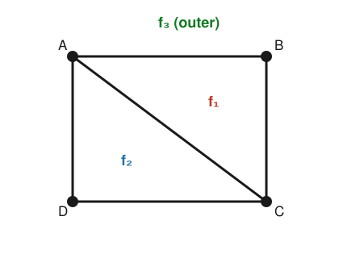

# Graph Theory · Lesson 3.1: Planar graphs & Euler's formula

> ⏱ ~15 min · Module 3: Planarity & coloring · Builds on: [Lesson 1.2](01-02-representing-graphs-isomorphism.md) (graph families, $K_n$, $K_{m,n}$), [Lesson 2.1](02-01-trees.md) (trees, $|E|=|V|-1$) · Unlocks: [Lesson 3.2](03-02-kuratowski-wagner.md) (Kuratowski–Wagner)

## Why this matters

A circuit board can't have wires crossing; a subway map wants clean, uncrossed lines; a chip layout lives on a flat surface. All of these ask the same question: **can this graph be drawn in the plane with no edges crossing?** Euler's formula — a three-term accounting identity relating vertices, edges, and faces — is the hinge the whole answer swings on. From it we squeeze out a single inequality, $|E| \le 3|V| - 6$, that instantly rules out drawing $K_5$ flat, and it is the same lever that later caps how many colors a map needs (Lesson 3.3). One formula, an entire module.

## The idea

Draw a connected graph on paper so that edges meet only at their endpoints — no crossings. Such a drawing is a **plane graph**. The edges chop the paper into regions called **faces**: the enclosed pockets you'd flood if you poured paint into them, *plus* the one unbounded region sprawling out to infinity around the whole picture. That outer face is easy to forget and always counts.

Here is the miracle. You can draw the same graph a hundred different ways, stretch it, bend the edges — and every single time, $(\text{vertices}) - (\text{edges}) + (\text{faces})$ comes out to exactly $2$. Vertices and edges are baked into the graph, but *faces* depend on the drawing... except their count is pinned down by the other two. That rigidity is Euler's formula, and it's what lets us reason about drawings without ever fixing one.

The intuition for *why* $2$: start from a spanning tree, which has no cycles and so carves out **one** face (just the outer one) — and a tree satisfies $|V| - |E| = 1$, i.e. $|V|-|E|+1 = 2$ already. Now add the remaining edges back one at a time. Each new edge closes a loop, and closing a loop splits one face into two: $|E|$ goes up by one, $|F|$ goes up by one, and the alternating sum $|V|-|E|+|F|$ never budges. It started at $2$; it stays at $2$.

## The formal version

**Definitions.** A graph is **planar** if it *can* be drawn in the plane with no two edges crossing. A **plane graph** is such a drawing, together with the regions it creates. The **faces** are the connected regions of the plane left when you remove all vertices and edges; exactly one face is unbounded (the **outer** face). Write $|V|, |E|, |F|$ for the numbers of vertices, edges, and faces.

**Euler's Formula.** For a *connected* plane graph,
$$|V| - |E| + |F| = 2.$$

*In words:* in any crossing-free drawing of a connected graph, vertices minus edges plus faces is always two — regardless of how you drew it.

*Proof (induction on $|E|$).* Fix $|V| = n$. A connected graph on $n$ vertices has at least $n-1$ edges.

- **Base case ($|E| = n-1$).** A connected graph with $|E| = |V|-1$ is a tree (Lesson 2.1). A tree has no cycle, so no edge encloses any region: the drawing leaves just the single outer face, $|F| = 1$. Then $|V|-|E|+|F| = n - (n-1) + 1 = 2$. ✓
- **Inductive step.** Suppose the formula holds for all connected plane graphs on $n$ vertices with fewer than $m$ edges, and take one $G$ with $|E| = m \ge n$. Since $m > n-1$, $G$ is not a tree, so it contains a cycle; pick any edge $e$ lying on a cycle. That edge borders **two different faces** (a cycle edge separates an inside from an outside). Deleting $e$ merges those two faces into one, so faces drop by exactly one, while the graph stays connected (deleting a cycle edge never disconnects). The smaller graph $G - e$ has $n$ vertices, $m-1$ edges, and $|F|-1$ faces, so by hypothesis $n - (m-1) + (|F|-1) = 2$. Restoring $e$ adds one edge and one face, leaving $n - m + |F| = 2$. $\blacksquare$

**The face-degree handshake.** Define $\deg(f)$, the **degree of a face** $f$, as the number of edge-sides bordering it — an edge that has $f$ on both sides (a bridge dangling into $f$) is counted **twice**. Then
$$\sum_{f} \deg(f) = 2|E|.$$

*In words:* add up how many edge-sides surround each face and you get twice the number of edges — because every edge has exactly two sides, each contributed to some face. (This is the handshake lemma of Lesson 1.1, run on faces instead of vertices: each edge is "shaken" by the two faces flanking it.)

**The master edge bound.** For a **simple** planar graph with $|V| \ge 3$,
$$|E| \le 3|V| - 6,$$
and if in addition the graph is **triangle-free** (girth $\ge 4$: no cycle of length 3),
$$|E| \le 2|V| - 4.$$

*In words:* a crossing-free simple graph can't be too dense — its edge count grows at most linearly in its vertices, and shunning triangles squeezes it even tighter.

*Proof.* Assume the graph is connected (if not, adding edges to connect it only makes $|E|$ larger, so the bound for the connected case implies the general one). With $|V| \ge 3$ and simple, every face is bordered by **at least 3 edge-sides** — you need three edges to enclose a region without repeats or multi-edges. So $\sum_f \deg(f) \ge 3|F|$, and combined with the face-handshake $\sum_f \deg(f) = 2|E|$,
$$2|E| \ge 3|F| \quad\Longrightarrow\quad |F| \le \tfrac{2}{3}|E|.$$
Feed this into Euler, $|F| = 2 - |V| + |E|$:
$$2 - |V| + |E| \le \tfrac{2}{3}|E| \quad\Longrightarrow\quad \tfrac{1}{3}|E| \le |V| - 2 \quad\Longrightarrow\quad |E| \le 3|V| - 6.$$
If the graph is triangle-free, its shortest cycle has length $\ge 4$, so **every face is bordered by at least 4 edge-sides**: $2|E| \ge 4|F|$, i.e. $|F| \le \tfrac{1}{2}|E|$. The same substitution gives $2 - |V| + |E| \le \tfrac12|E|$, hence $|E| \le 2|V| - 4$. $\blacksquare$

**The headline corollary — $K_5$ is nonplanar.** The complete graph $K_5$ has $|V| = 5$ vertices and $|E| = \binom{5}{2} = 10$ edges. If it were planar, the bound would force $|E| \le 3(5) - 6 = 9$. But $10 > 9$. Contradiction, so **$K_5$ cannot be drawn in the plane without a crossing** — no matter how cleverly you route the edges.

## Picture

A connected plane graph: the square $ABCD$ with one diagonal $AC$. Vertices $|V| = 4$, edges $\{AB, BC, CD, DA, AC\}$ so $|E| = 5$, and the drawing has three faces — the two triangles $f_1 = ABC$, $f_2 = ACD$, and the outer face $f_3$ — so $|F| = 3$.

Check Euler: $|V| - |E| + |F| = 4 - 5 + 3 = 2$. ✓ Check the face-handshake: $\deg(f_1) = 3$ (edges $AB, BC, CA$), $\deg(f_2) = 3$ (edges $AC, CD, DA$), $\deg(f_3) = 4$ (the outer boundary $AB, BC, CD, DA$); the sum $3 + 3 + 4 = 10 = 2|E|$. ✓

## Worked examples

**Example 1 (mechanical — count the faces without drawing).** A connected planar graph has $12$ vertices and $30$ edges. How many faces does any crossing-free drawing have? Rearrange Euler: $|F| = 2 - |V| + |E| = 2 - 12 + 30 = 20$. Every planar drawing of this graph — however you bend the edges — has exactly $20$ faces. (This is the icosahedron: 12 vertices, 30 edges, 20 triangular faces. Note $|E| = 30 = 3|V| - 6$ exactly, so it's a *maximal* planar graph — every face a triangle, no edge can be added.)

**Example 2 (why you'd care — the bound as a nonplanarity test).** Suppose someone hands you a simple graph with $|V| = 11$ vertices and $|E| = 30$ edges and claims it can be printed on a flat circuit board. Check: $3|V| - 6 = 3(11) - 6 = 27$. Since $30 > 27$, the edge bound is violated, so the graph is **not planar** — reject the claim outright, no drawing attempts needed. This is the everyday use of Euler's formula: a one-line arithmetic certificate that a graph is *too dense to flatten*. The converse is false — passing the test ($|E| \le 3|V|-6$) does **not** guarantee planarity (see Watch out) — but failing it is a definitive "no."

## Watch out

- You might forget the **outer face**, but it always counts. A single triangle drawn on paper has $|F| = 2$, not $1$: the inside pocket *and* the unbounded outside. Check: $3 - 3 + 2 = 2$. ✓ Omitting the outer face breaks Euler every time.
- You might think $|E| \le 3|V| - 6$ is an *if-and-only-if* test for planarity — it is **not**. It's a one-way filter: every simple planar graph obeys it, so violating it proves nonplanarity, but obeying it proves nothing. $K_{3,3}$ has $|V|=6, |E|=9$ and passes the bound ($9 \le 12$), yet is nonplanar — you need the *triangle-free* bound $9 > 2(6)-4 = 8$ to catch it (that's P2), and in general you need Kuratowski's theorem (Lesson 3.2).
- You might apply the bound to a **multigraph or a tiny graph**, but $|E| \le 3|V|-6$ assumes *simple* (no multi-edges or loops) and $|V| \ge 3$. Two vertices joined by three parallel edges are planar with $|E| = 3 > 3(2) - 6 = 0$; the "each face has $\ge 3$ sides" step fails when edges repeat.

## One-liner

> In any flat drawing of a connected graph, $|V|-|E|+|F|=2$ — and squeezing that through "every face needs $\ge 3$ edges" caps a simple planar graph at $|E|\le 3|V|-6$, which is why $K_5$ (10 edges, budget 9) can never lie flat.

## Problems

**P1 (🟢)** The graph of a cube $Q_3$ has $8$ vertices, each of degree $3$. (a) Use the handshake lemma to find its number of edges $|E|$. (b) Assuming it's planar (it is — imagine looking at a wireframe cube head-on), use Euler's formula to find its number of faces, and confirm your answer matches the faces of a physical cube.

**P2 (🟡)** Prove that $K_{3,3}$ (the complete bipartite graph with parts of size 3, so $|V| = 6$, $|E| = 9$) is nonplanar. *Hint:* $K_{3,3}$ is bipartite, so it has no odd cycles — in particular no triangles. Use the triangle-free bound, not the general one.

**P3 (🔴, optional)** Prove that **every** simple planar graph has a vertex of degree at most $5$. *Hint:* argue by contradiction using the degree-sum handshake $\sum_v \deg(v) = 2|E|$ (Lesson 1.1) together with the edge bound. (This innocent fact is the seed of the six- and five-color theorems in Lesson 3.3.)

Solutions

**P1** (a) By the handshake lemma (Lesson 1.1), $\sum_v \deg(v) = 2|E|$. Here every one of the $8$ vertices has degree $3$, so $\sum_v \deg(v) = 8 \cdot 3 = 24 = 2|E|$, giving $|E| = 12$.

(b) Euler: $|F| = 2 - |V| + |E| = 2 - 8 + 12 = 6$. A physical cube has $6$ faces (top, bottom, and four sides) — matching exactly. (In the planar drawing, five faces are the "sides/top/bottom" squares and the sixth is the outer face, which corresponds to the face nearest you that you're looking *through*.) Sanity check on the bound: $3|V|-6 = 18 \ge 12$, consistent, and since the cube is triangle-free (its shortest cycle is a 4-cycle), the tighter bound $2|V|-4 = 12 = |E|$ holds with equality — the cube is a maximal triangle-free planar graph.

**P2** Suppose, for contradiction, that $K_{3,3}$ is planar. It is simple with $|V| = 6 \ge 3$, so any plane drawing satisfies the general Euler machinery. Because $K_{3,3}$ is bipartite, every cycle has even length, so there are **no triangles** — its girth is $4$. Hence in any drawing every face is bordered by at least $4$ edge-sides, and the triangle-free bound applies:
$$|E| \le 2|V| - 4 = 2(6) - 4 = 8.$$
But $K_{3,3}$ has $|E| = 3 \cdot 3 = 9$ edges, and $9 > 8$ — contradiction. Therefore $K_{3,3}$ is nonplanar. $\blacksquare$ (Note the *general* bound $3|V|-6 = 12$ would **not** have caught this, since $9 \le 12$; the triangle-free refinement is essential.)

**P3** Suppose, for contradiction, that a simple planar graph $G$ has *every* vertex of degree $\ge 6$. If $G$ has fewer than $3$ vertices the claim is trivial (a vertex can't have degree $\ge 6$ among $< 3$ vertices at all in a simple graph), so assume $|V| \ge 3$. By the handshake lemma,
$$2|E| = \sum_{v} \deg(v) \ge 6|V| \quad\Longrightarrow\quad |E| \ge 3|V|.$$
But the edge bound for simple planar graphs says $|E| \le 3|V| - 6$. Combining,
$$3|V| \le |E| \le 3|V| - 6,$$
which gives $3|V| \le 3|V| - 6$, i.e. $0 \le -6$ — absurd. So the assumption fails: some vertex has degree $\le 5$. $\blacksquare$

## Flashback

**From Lesson 1.1 (Degree & the handshake lemma):** A friendship network is modeled as a simple graph in which every person has exactly $3$ friends within the group ($3$-regular). (a) If the group has $10$ people, how many friendship-edges are there? (b) Could such a group have exactly $7$ people? Justify.

Solution

(a) By the handshake lemma, $\sum_v \deg(v) = 2|E|$. Every vertex has degree $3$, so $\sum_v \deg(v) = 3 \cdot 10 = 30 = 2|E|$, giving $|E| = 15$ edges.

(b) No. For $7$ people the degree sum would be $3 \cdot 7 = 21$, which is **odd**. But $\sum_v \deg(v) = 2|E|$ is always **even** (it's twice an integer). An odd total is impossible, so no $3$-regular graph on $7$ vertices exists. (General rule: a $k$-regular graph on $n$ vertices needs $kn$ even — here $k=3$ forces $n$ even.) $\blacksquare$

## Connections

- **Backward:** the base case of Euler's proof *is* a tree from [Lesson 2.1](02-01-trees.md) ($|E| = |V|-1$, one face), and the face-degree sum is the handshake lemma of [Lesson 1.1](01-01-degree-and-handshake-lemma.md) transplanted from vertices to faces — same "count edge-ends two ways" double-counting.
- **Forward:** [Lesson 3.2](03-02-kuratowski-wagner.md) upgrades "$K_5$ and $K_{3,3}$ fail the bound" into the full characterization — a graph is planar **iff** it contains no subdivision (or minor) of $K_5$ or $K_{3,3}$. And P3's "some vertex has degree $\le 5$" is exactly the inductive engine of the five-color theorem in [Lesson 3.3](03-03-coloring-chromatic-number.md).
- **Sideways (topology & geometry):** $|V|-|E|+|F| = 2$ is the **Euler characteristic** of the sphere — the same invariant that counts the $5$ Platonic solids and generalizes to $|V|-|E|+|F| = 2 - 2g$ on a surface of genus $g$ (a graph that won't lie flat on paper may lie flat on a doughnut). It reappears wherever a space is cut into cells, from computational geometry to the Gauss–Bonnet theorem in differential geometry.
