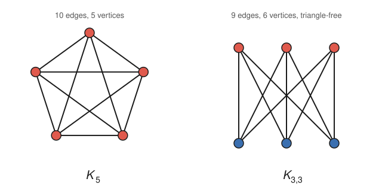

# Graph Theory · Lesson 3.2: Kuratowski & Wagner — what forbids a flat drawing

> ⏱ ~15 min · Module 3: Planarity & coloring · Builds on: [Lesson 3.1](03-01-planar-euler-formula.md) (Euler's formula and the edge bounds) · Unlocks: [Lesson 3.3](03-03-coloring-chromatic-number.md) (coloring, where the five-color theorem needs planarity)

## Why this matters

Lesson 3.1 gave you a *test* for nonplanarity — if $|E| > 3|V| - 6$, no plane drawing can exist. But that test is one-directional: plenty of nonplanar graphs slip under the bound (they're sparse but tangled in a subtler way). What you'd really like is a *characterization*: a finite list of "poison" configurations such that a graph is planar **exactly when** it avoids all of them. Astonishingly, the list has length two. Every obstruction to flatness — in a circuit board, a subway map, a dependency graph you're trying to lay out without crossings — is ultimately a hidden copy of one of just two graphs, $K_5$ or $K_{3,3}$. This is one of the cleanest "the whole world reduces to these" theorems in mathematics.

## The idea

Two graphs can be "the same tangle" even if one has extra vertices sitting in the middle of edges. Picture a rubber-band model of a graph: pin the vertices, stretch bands for edges. Now two things you can do without changing whether it lies flat:

1. **Subdivide** an edge — put a new pin in the middle of a band, splitting one edge into two. The picture is topologically identical; you've just added a degree-2 pass-through vertex. Undoing this (smoothing out every degree-2 vertex) is called *suppression*.
2. **Contract** an edge — slide two adjacent pins together until they merge into one, fusing their neighborhoods. Shrinking a whole connected chunk to a point is a sequence of contractions.

Kuratowski's theorem says: a graph fails to be planar **iff you can find, sitting inside it, a subdivided copy of $K_5$ or $K_{3,3}$** — the two graphs from the picture below, possibly with extra pins dotted along their edges. Wagner's theorem says the same thing with the more flexible *minor* relation (delete and contract, not just subdivide). Both single out the identical two culprits. The rest of the lesson makes "sitting inside," "subdivision," and "minor" precise, states both theorems exactly, and proves the easy half for $K_{3,3}$ from scratch.

## The formal version

Let $G = (V, E)$ be a simple graph. Recall the two forbidden graphs: $K_5$, the complete graph on 5 vertices (every pair joined, 10 edges), and $K_{3,3}$, the complete bipartite graph with parts of size 3 (every top vertex joined to every bottom vertex, 9 edges).

**Definition (subdivision).** A *subdivision* of $G$ is any graph obtained by repeatedly replacing an edge $uv$ with a path $u - w - v$ through a new degree-2 vertex $w$. We say $G$ *contains a subdivision of $H$* if some subgraph of $G$ is a subdivision of $H$.

*In words:* $H$ appears in $G$ once you're allowed to bend each of $H$'s edges into a longer chain of fresh in-between vertices. The original $H$-vertices become *branch vertices*; the inserted ones are pass-throughs.

**Definition (minor).** $H$ is a *minor* of $G$ if a copy of $H$ can be obtained from $G$ by a sequence of three operations: delete an edge, delete a vertex, or **contract** an edge (identify its two endpoints into one vertex, deleting any resulting loops or parallel edges).

*In words:* $H$ is a minor of $G$ if you can carve $G$ down — throwing away pieces and shrinking connected clumps each to a single point — until what's left is exactly $H$. Equivalently, $G$ has disjoint connected "blobs," one per vertex of $H$, with an edge between blobs whenever $H$ demands one.

Subdivision-containment is *stronger* than being a minor: if $G$ contains a subdivision of $H$, then $H$ is a minor of $G$ (suppress the degree-2 vertices by contracting), but not conversely.

**Kuratowski's Theorem (1930).** A graph $G$ is planar **if and only if** $G$ contains no subdivision of $K_5$ and no subdivision of $K_{3,3}$.

*In words:* the only way to be nonplanar is to hide a stretched-out $K_5$ or $K_{3,3}$ somewhere inside you.

**Wagner's Theorem (1937).** A graph $G$ is planar **if and only if** $G$ has neither $K_5$ nor $K_{3,3}$ as a minor.

*In words:* same two villains, but now "hidden inside" is read with the looser minor relation (delete/contract) rather than subdivision.

These are equivalent for this particular pair of forbidden graphs. In general "has an $H$-minor" and "contains an $H$-subdivision" differ, but for graphs of maximum degree $\le 3$ they coincide — and since $K_{3,3}$ is 3-regular, a $K_{3,3}$-minor always upgrades to a $K_{3,3}$-subdivision. (For $K_5$, degree 4, a minor might only yield a $K_{3,3}$-subdivision instead — which is fine, because Kuratowski forbids *both*.)

**Why these two and no others?** $K_5$ and $K_{3,3}$ are the *minimal* obstructions: each is nonplanar, but delete any single edge and it becomes planar. They are the smallest irreducible tangles, and every larger nonplanar graph is built around a copy of one of them. The proofs of both theorems are genuinely hard (they need the topology of the plane — the Jordan curve theorem — plus a careful induction), so we state them precisely and do **not** fake a proof. What we *can* prove cleanly is the direction everyone uses in practice: that $K_5$ and $K_{3,3}$ really are nonplanar. Below we nail $K_{3,3}$ with a self-contained counting argument.

## Picture

These are the only two graphs the whole theory forbids. $K_5$ (left) has 5 mutually adjacent vertices; $K_{3,3}$ (right) is bipartite — the three red vertices each join all three blue ones, and it contains **no triangle** (any cycle must alternate colors, so its shortest cycle has length 4). Both are drawn here *with* crossings because — as we're about to prove — no crossing-free drawing exists.

## Worked examples

**Example 1 (proving $K_{3,3}$ nonplanar — the girth-4 bound).** Recall from Lesson 3.1 that a connected planar graph with $|V| \ge 3$ satisfies $|E| \le 3|V| - 6$, and if additionally it is *triangle-free* (every cycle has length $\ge 4$, i.e. girth $\ge 4$) the sharper bound

$$|E| \le 2|V| - 4$$

holds. Here is that sharper bound derived cleanly, so this example stands alone. Suppose $K_{3,3}$ were planar; take any plane drawing, with $F$ faces. By Euler's formula (Lesson 3.1), $|V| - |E| + |F| = 2$. Now count incidences between edges and faces. Every face is bounded by a closed walk of at least $g$ edges, where $g$ is the girth; since $K_{3,3}$ is bipartite it has **no odd cycle**, hence no triangle, so $g \ge 4$ and every face is bounded by at least 4 edge-sides. Each edge borders exactly two face-sides, so summing "edges around a face" over all faces double-counts the edges:

$$4F \le \sum_{\text{faces}} (\text{length of boundary}) = 2|E| \quad\Longrightarrow\quad F \le \tfrac{1}{2}|E|.$$

Substitute into Euler: $2 = |V| - |E| + |F| \le |V| - |E| + \tfrac{1}{2}|E| = |V| - \tfrac{1}{2}|E|$. Rearranging, $\tfrac12|E| \le |V| - 2$, i.e.

$$|E| \le 2|V| - 4.$$

For $K_{3,3}$: $|V| = 6$, $|E| = 9$. The bound would force $9 \le 2\cdot 6 - 4 = 8$. But $9 > 8$ — contradiction. So **$K_{3,3}$ is not planar.** $\blacksquare$

**Example 2 (spotting the obstruction — using the theorem).** The *Petersen graph* (10 vertices, 15 edges, 3-regular) is a famous graph you can't easily eyeball as planar. Its edge count passes the Euler test: $3|V| - 6 = 24 \ge 15$, so the crude bound is silent — no help. Kuratowski/Wagner is exactly the tool. One can find inside the Petersen graph a subdivision of $K_{3,3}$: choose the three "outer" branch vertices and three "inner" ones, and route the nine required connections along internally-disjoint paths (some passing through the remaining degree-2 pass-through vertices). Because that subdivided $K_{3,3}$ lives inside, Kuratowski declares the Petersen graph nonplanar — a verdict the edge-count bound could never reach. The lesson: the $|E| \le 3|V|-6$ test only catches *dense* obstructions; the forbidden-minor characterization catches *all* of them.

## Watch out

- You might think "$K_{3,3}$ has 9 edges and $3|V|-6 = 12$, so the bound $|E| \le 3|V|-6$ proves it's nonplanar" — but it does **not**: $9 \le 12$ passes. The general bound is too weak for triangle-free graphs; you *must* use the girth-4 bound $|E| \le 2|V|-4$ (giving $9 > 8$). For $K_5$, by contrast, the general bound works directly: $10 > 3\cdot 5 - 6 = 9$.
- You might think a *minor* and a *subgraph* are the same — but contracting is not deleting. $K_5$ is a minor of the Petersen graph, yet the Petersen graph contains no $K_5$ *subgraph* (it's triangle-free, so it has no 5 mutually adjacent vertices at all). Minors see structure that subgraphs can't.
- You might think Kuratowski gives an *efficient* hand-check — "just look for a $K_5$ or $K_{3,3}$." In a large graph the subdivided copy can be deeply hidden along long paths; finding it by eye is hard. The theorem is a *characterization*, not a quick algorithm (efficient planarity testing exists but works differently).
- You might read "no subdivision of $K_5$ **or** $K_{3,3}$" as needing to rule out just one. You must rule out **both**: a graph is planar only if it contains neither.

## One-liner

> A graph lies flat if and only if it hides no stretched-out $K_5$ and no stretched-out $K_{3,3}$ — every obstacle to planarity is one of exactly two graphs in disguise.

## Problems

**P1 (🟢)** Prove that $K_5$ is nonplanar using the edge bound from Lesson 3.1. Then explain in one sentence why, for $K_5$, you may use the *general* bound $|E| \le 3|V|-6$ but for $K_{3,3}$ you cannot.

**P2 (🟡)** Let $G$ be the graph obtained from $K_5$ by subdividing **every** edge exactly once (insert one new degree-2 vertex in the middle of each of the 10 edges). (a) How many vertices and edges does $G$ have? (b) Is $G$ planar? Justify using this lesson's definitions and theorems — *without* re-running any edge-count computation on $G$ itself.

**P3 (🔴, optional)** The complete graph $K_6$ has 6 vertices and 15 edges. (a) Use the general edge bound to show $K_6$ is nonplanar. (b) Now argue the same conclusion a second way *via Wagner's theorem*, by exhibiting $K_5$ as a minor of $K_6$ (say which operation you use). (c) What does part (b) illustrate about the relationship "$H$ is a minor of $G$" when $G \supseteq H$ as a subgraph?

Solutions

**P1** For a connected planar simple graph with $|V| \ge 3$, Lesson 3.1 gives $|E| \le 3|V| - 6$. For $K_5$: $|V| = 5$, $|E| = \binom{5}{2} = 10$. If $K_5$ were planar we'd need $10 \le 3\cdot 5 - 6 = 9$, i.e. $10 \le 9$ — false. Hence $K_5$ is nonplanar. $\blacksquare$

The general bound works for $K_5$ because $K_5$ *contains triangles*, so the face-boundary length is only guaranteed to be $\ge 3$, and the derivation of $|E|\le 3|V|-6$ uses exactly $3F \le 2|E|$. For $K_{3,3}$ the same $\ge 3$ bound is too weak (it gives $9 \le 12$, no contradiction); because $K_{3,3}$ is triangle-free we get the *stronger* face bound $\ge 4$, hence $|E| \le 2|V|-4$, which is what actually rules it out.

**P2** (a) $K_5$ has 5 vertices and 10 edges. Subdividing every edge once adds one vertex per edge ($+10$ vertices) and splits each edge into two ($10 \to 20$ edges). So $G$ has $5 + 10 = 15$ vertices and $20$ edges.

(b) $G$ is a subdivision of $K_5$ — that's literally how it was constructed. By Kuratowski's theorem, any graph *containing a subdivision of $K_5$* is nonplanar; $G$ *is* such a subdivision (it contains itself as a subgraph). Equivalently: subdividing edges is a topological operation that never changes planarity (you're just adding pass-through points along existing curves), and $K_5$ is nonplanar, so $G$ is nonplanar too. No edge count on $G$ is needed — and indeed the crude bound would mislead here, since $20 \le 3\cdot 15 - 6 = 39$ passes comfortably. $\blacksquare$

**P3** (a) $K_6$: $|V| = 6$, $|E| = \binom{6}{2} = 15$. Planarity would require $15 \le 3\cdot 6 - 6 = 12$; since $15 > 12$, $K_6$ is nonplanar.

(b) Take $K_6$ and **contract any one edge** $uv$: the two endpoints merge into a single vertex adjacent to all remaining vertices (they were each adjacent to all others in $K_6$), and no parallel edges survive after cleanup. The result is $K_5$ on the 5 remaining "vertices." (Even simpler: **delete any one vertex** of $K_6$ to leave $K_5$.) Either way $K_5$ is a minor of $K_6$. Since $K_6$ has $K_5$ as a minor, Wagner's theorem declares $K_6$ nonplanar.

(c) It illustrates that if $G$ contains $H$ as a *subgraph*, then $H$ is automatically a *minor* of $G$ — just delete every vertex and edge of $G$ not in $H$, using zero contractions. Subgraph-containment is the special case of the minor relation that uses only deletions. So the minor relation is strictly more permissive: $K_5 \subseteq K_6$ as a subgraph immediately gives $K_5$ as a minor, but minors also capture copies reachable only by contracting (as in the Petersen graph, which has a $K_5$ minor but no $K_5$ subgraph).

## Flashback

**From Lesson 3.1 (Euler's formula & the edge bound):** A connected simple planar graph has $|V| = 11$ vertices and $|E| = 28$ edges. (a) Is this possible? (b) If instead the graph were known to be triangle-free with $|V| = 11$, what is the maximum number of edges it could have while remaining planar?

Solution

(a) The general planar bound is $|E| \le 3|V| - 6 = 3\cdot 11 - 6 = 27$. But $28 > 27$, so **no** such planar graph exists — a connected simple planar graph on 11 vertices has at most 27 edges.

(b) Triangle-free planar graphs obey the girth-4 bound $|E| \le 2|V| - 4 = 2\cdot 11 - 4 = 18$. So at most **18** edges. (This bound is achievable in principle — e.g. by suitable quadrangulations — but 18 is the ceiling.) $\blacksquare$

## Connections

- **Backward:** this lesson leans entirely on [Lesson 3.1](03-01-planar-euler-formula.md) — Euler's formula $|V|-|E|+|F|=2$ and the two edge bounds are what actually prove $K_5$ and $K_{3,3}$ nonplanar. The subdivision idea also reaches back to paths and cycles from [Lesson 1.3](01-03-walks-paths-connectivity.md), and $K_{3,3}$'s triangle-freeness is its bipartiteness from [Lesson 2.3](02-03-bipartite-matching-hall.md).
- **Forward:** [Lesson 3.3](03-03-coloring-chromatic-number.md) uses planarity crucially — the five-color theorem (and the famous four-color theorem) are statements *about planar graphs only*, and their proofs rest on the same Euler-formula machinery that forbids $K_5$ and $K_{3,3}$ here.
- **Sideways (topology & CS):** "forbidden minors" is a template far bigger than planarity. The Robertson–Seymour graph-minor theorem shows *every* minor-closed family of graphs (planar, toroidal, knotlessly-embeddable, ...) is characterized by a **finite** list of forbidden minors — Kuratowski–Wagner is just the first and most famous instance. On the applied side, VLSI circuit layout and graph-drawing software care directly about planarity and how few crossings a nonplanar graph can be drawn with (the *crossing number*), and the algorithmic side of that story belongs to the future `algorithms` track.
